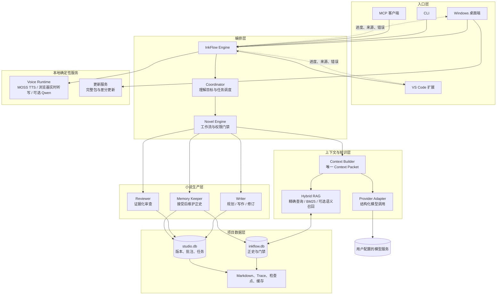
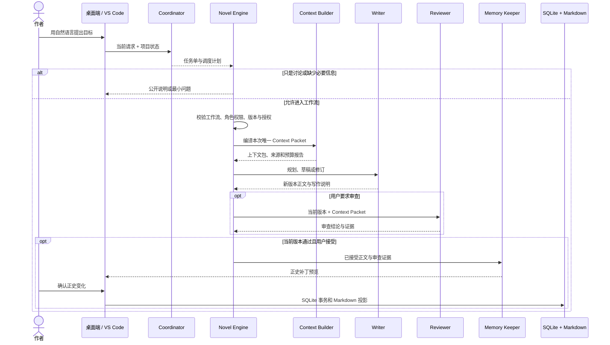

# 墨流（InkFlow）

墨流是一套面向中文长篇小说的本地 AI 创作工作台。它把灵感讨论、长期规划、章节写作、证据化审查、正史记忆、版本回退和本地听读放在同一个小说项目里，让一部长篇小说可以持续写下去，也能随时查清“这一段为什么这样写、参考了什么、现在是否已经成为正史”。

<p>
  <a href="https://github.com/littlewinter320/inkflow/releases/latest"><strong>⬇ 下载最新 Windows 正式版</strong></a>
  &nbsp;·&nbsp;
  <a href="https://github.com/littlewinter320/inkflow/releases">查看全部版本与下载</a>
  &nbsp;·&nbsp;
  <a href="https://github.com/littlewinter320/inkflow/issues">反馈问题</a>
</p>

当前版本：**0.6.3**。Windows 安装包、差分更新文件和完整更新说明都放在 [GitHub Releases](https://github.com/littlewinter320/inkflow/releases/latest)；源码版本、Release 标签和安装包版本保持一致。

## 目录

- [墨流适合谁](#墨流适合谁)
- [核心模块](#核心模块)
- [下载与第一次使用](#下载与第一次使用)
- [系统架构](#系统架构)
- [完整创作流程](#完整创作流程)
- [上下文、审查与正史](#上下文审查与正史)
- [本地语音与听读](#本地语音与听读)
- [项目文件与隐私](#项目文件与隐私)
- [0.6.3 核心更新](#063-核心更新)
- [常见问题](#常见问题)
- [从源码运行](#从源码运行)

## 墨流适合谁

墨流适合想长期维护一部中文小说的人。你可以只有一个模糊点子，也可以已经写了几十章、拥有设定集和大纲。它尤其适合在意人物前后是否一致、伏笔有没有回收、章节是否有推进、草稿是否被错误地当成既定事实的作者。

| 你现在的情况 | 在墨流中可以做什么 | 得到什么 |
| --- | --- | --- |
| 只有一个想法 | 和墨宝讨论，让 Writer 提出一个或三个方向 | 可修改的题材、卖点、人物关系和开篇方向 |
| 有题材或主角，但没有大纲 | 生成书罗盘、卷计划、篇章计划和章节卡 | 可逐步展开的写作蓝图 |
| 正在连载 | 写下一章、续写局部、扩写情节或修改对白 | 新草稿版本，不会覆盖已有历史 |
| 担心人物或时间线写乱 | 对指定章节运行 Reviewer 审查 | 带正文引文和设定依据的问题清单 |
| 想继续维护世界观 | 维护 Story Bible、场景笔记和个人偏好 | 后续任务可以检索的工作资料 |
| 想听小说或用语音下达请求 | 使用本地普通话转写、短消息朗读或后台听读 | 本机音频、播放队列和声音档案 |

故事方向、接受哪个版本、是否修改既有正史、是否使用自己的声音，始终由作者决定。墨流不会因为“生成成功”就默认一章已经完成。

## 核心模块

下面按功能介绍墨流。它们能协作，但你可以只使用其中一个模块，例如只讨论、只写草稿、只审查，或只听读，不会自动启动整条生产链。

### 墨宝对话与 Coordinator

你直接用自然中文表达目标，例如“第 8 章节奏太平，帮我加一个不揭底的结尾钩子”“先帮我判断这个设定是否值得写”“批量写第 10 到 12 章，但先不要入正史”。

Coordinator 是第四个正式 AI Agent，负责理解需求、建立任务单、选择已有工作流、安排下一步、汇总结果和提出必要的最小问题。它不写正文、不替 Reviewer 放行，也不替 Memory Keeper 提交正史。

### Writer：规划、正文与钩子

Writer 负责创意方向、四级规划、章节草稿和定点修订。

- 四级规划：书罗盘 → 卷计划 → 篇章计划 → 章节卡。远期只保留方向，当前篇章才展开连续章节卡。
- 章节草稿：每次生成都是新版本。只要求草稿时，系统不会自动审查或提交。
- 章节钩子：默认让大多数章节保留前向期待，也可以改成只在重点章节强调钩子，或以自然余味为主。
- 钩子说明：Writer 会记录实际锚点、读者会期待什么、为什么保留、暂时不说明什么、必须讲清什么，以及预计在哪个范围回应。
- 精修蓝图：需要精细改写时，可说明场景进入状态、人物目标、压力、转折和退出状态。

钩子可以来自未完成行动、关系变化、信息差、代价逼近或情绪余波，不要求每章靠反转。

### Reviewer：只审查，不直接改稿

Reviewer 专门检查当前草稿版本，关注人物知道什么、时间地点、物件状态、世界规则、因果、资源、章节功能、伏笔推进、表达重复和结尾效果。

每条严重问题都必须引用当前正文或 Context Packet 中的事实。普通风格建议不会阻止提交；只有硬正史冲突、不可能的因果或时间、核心章节功能缺失、输出截断、严重重复等问题才会阻断正史提交。

Reviewer 也会区分“有意留白”和“真正让读者看不懂”。神秘感、延后揭晓和开放问题本身不等于写得不清楚；缺少锚点、没有兑现路径或反复使用同一种空悬念，才会得到明确提醒。

### Memory Keeper：只维护已接受的正史

Memory Keeper 只读取“用户已接受、Reviewer 已对当前版本放行”的正文，提取人物状态、事实、时间线、伏笔和章节摘要，生成正史补丁预览。

它不能从未验收草稿写入正史，也不能替用户决定故事方向。用户确认补丁后，Novel Engine 才会用 SQLite 事务更新正史，再同步用户可直接阅读的 Markdown 文件。

### 章节编辑、版本与批注

编辑器用于查看 Markdown 正文、批注、版本记录和差异对比。用户手动修改未验收草稿会形成新版本；已接受正文会先显示正史保护和影响范围，避免静默覆盖历史。

你可以选中一段文字，让 Writer 只替换这一段，也可以先只留下批注。局部修改同样需要重新审查，旧报告不能批准新版本。

### Context Packet 与资料检索

长篇小说不能把所有旧正文都塞给模型。Context Builder 会把当前任务、已接受正史、章节卡、相关规划、未结伏笔、人物状态、用户偏好、协作消息和检索资料编译成一个唯一的 Context Packet。

上下文有权限和优先级：当前明确指令、已接受正史、长期硬规则和章节卡优先保留；旧章节摘要、低相关资料和外部参考会随预算压缩。用户可以选择统一上下文预算，或为四个 Agent 分别设置预算。

Writer 会保存本次写作的上下文清单；Reviewer 会说明正文实际使用了哪些来源、遗漏了哪些硬来源、与哪些来源发生冲突。这样出现问题时，作者能追到具体资料，而不是只看到“模型参考了设定”。

### 批量写作与临时连续性记忆

批量写作按章节顺序运行：Writer 写一章，Reviewer 审一章，必要时 Writer 修订并重新审查。后续章节会读取同一批次的临时连续性账本，但这些内容在用户接受前不是正史。

如果中间章节重写，依赖它的后续临时记忆会失效并从受影响处重建。你可以选择逐章确认、批次确认一次，或在“主动发起审查且当前版本通过”时自动验收。只写草稿永远不会自动进入正史。

### 设置、过程和错误引导

桌面端把模型、创作、语音、上下文、审查、学习和高级设置分开。任务过程会显示目标、章节版本、运行步骤、停止条件、验收方式、引用资料和结果文件。

出现错误时，界面会说明原因、影响、已经保留的内容和下一步可执行操作，例如打开模型设置、查看当前章节审查或重新尝试。墨流展示公开判断摘要、证据和工具状态，不展示也不保存模型原始思维链。

## 下载与第一次使用

### 下载 Windows 桌面版

[**前往 GitHub Releases 下载最新版**](https://github.com/littlewinter320/inkflow/releases/latest)

在下载页中选择 `InkFlow-Setup-版本号.exe`。安装完成后打开“墨流”，首次进入只需要完成以下几步：

1. 在模型设置中配置你要使用的模型服务和密钥。密钥只保存在系统凭据库或本地设置中，不会写入小说项目。
2. 新建小说，或选择一个已有的墨流项目目录。
3. 从“墨宝对话”用自然中文描述你想做的事。
4. 在项目导航中查看书籍、规划、章节、审查、正史和资料。

首次不必建立完整大纲。可以从下面任一句开始：

```text
我想写一部南方小城背景的悬疑小说，先给我三个方向。
根据第 6 章章节卡写草稿，结尾留下关于旧照片的钩子，先不要审查。
审查第 6 章当前版本，重点看主角是否知道了不该知道的事。
批量写第 10 到 12 章，每章审查通过后再让我一次确认。
```

### VS Code 扩展

如果你习惯在 VS Code 中编辑 Markdown，可以安装 Release 中提供的 `.vsix` 文件。扩展连接同一个本地墨流引擎和同一个项目，因此桌面端与 VS Code 看到的是同一套章节、正史、审查和门禁。

### 更新方式

桌面端会检查 GitHub Releases。后续正式版本在发布安装包、`latest.yml` 和 `.blockmap` 后，可以优先下载变化部分；条件不满足时会自动回退为完整安装包。语音模型和用户小说资料不在应用安装目录中，不会因为更新程序而被重新下载或删除。

## 系统架构

这张图描述模块关系，不表示一次请求的执行顺序。完整执行顺序见下一节。



墨流固定使用四个正式 AI Agent：Coordinator、Writer、Reviewer、Memory Keeper。Novel Engine、Context Builder、检索器、模型适配器、Voice Runtime 和更新服务都是确定性组件，不是第五个 Agent，也不能越过四个 Agent 的职责。

`inkflow.db` 是正史和门禁的稳定来源；`studio.db` 保存版本、批注、任务和工作资料；Markdown 是用户可读可编辑的文件投影。模型每次只收到编译完成的一个 Context Packet，不能直接读取整个项目或直接改数据库。

## 完整创作流程

下面是“请求一章并最终接受为正史”的完整流程。用户只要求讨论、规划、草稿或审查时，流程会停在对应位置，不会自动继续。



### 三个最常见的停点

| 你说的话 | 系统会做什么 | 不会做什么 |
| --- | --- | --- |
| “先给我三个故事方向” | Writer 生成可编辑方案 | 不建立项目、不写正文、不写正史 |
| “写第 3 章草稿，先不审查” | Writer 创建新的草稿版本 | 不运行 Reviewer、不写正史 |
| “审查并接受第 3 章” | Reviewer 审当前版本；通过后按你的验收策略进入正史预览 | 不用旧审查报告批准新版本，不跳过正史补丁确认 |

## 上下文、审查与正史

长篇小说的材料通常远超模型一次能稳定阅读的长度。墨流会先固定当前任务、已接受正史、长期硬规则和章节卡，再按相关度选择旧正文、资料、偏好、外部参考和检索结果。每个 Agent 能分别拥有自己的上下文预算；用户也可以选择简单的统一预算。

资料优先级如下：

```text
当前明确指令
> 已接受正史
> 用户长期硬规则
> 当前章节卡
> 已确认工作决定
> 用户弱偏好
> Agent 建议
> 外部参考特征
```

Story Bible、场景笔记和偏好是很有用的工作资料，但不会因为被检索到就自动变成正史。

Reviewer 判断的是“当前草稿是否有可证实的问题”；作者决定的是“是否接受这一个版本”。二者不能互相替代。

批量写作前，可以选择：

- 逐章确认：每章通过审查后由你决定是否接受；
- 批次确认一次：整个连续批次准备好后确认一次；
- 审查通过后自动验收：只对你主动发起并包含审查的工作流有效。

无论选哪一种，草稿版本、正文哈希、Reviewer 当前版本结论和 Memory Keeper 事务门禁都会保留。

| 内容 | 是否正史 | 说明 |
| --- | --- | --- |
| `BOOK.md`、已确认规划和章节卡 | 是 | 项目长期约束与当前故事计划 |
| 已接受并提交的章节正文 | 是 | 后续写作应遵守的故事事实 |
| `STATE.md`、人物状态和伏笔记录 | 是 | 从已接受正文同步出的当前状态 |
| 草稿、批注、审查报告、创意方案 | 否 | 可以继续修改、讨论或丢弃 |
| Story Bible、场景笔记、偏好 | 否 | 工作资料，需要进入正文并验收后才可能成为事实 |

## 本地语音与听读

语音是本地确定性服务，不参与写作、审查和正史提交。

| 能力 | 默认方案 | 使用方式 |
| --- | --- | --- |
| 普通话输入 | 浏览器原生实时听写 | 说话时显示预览，停止后回填输入框 |
| 日常朗读 | MOSS TTS Nano ONNX | 默认本地普通话朗读路径，支持句子拆分、速度、音量和停顿调整 |
| 高品质朗读 | Qwen3-TTS 1.7B CustomVoice | 可选下载，需要更多本地资源 |
| 授权声音克隆 | Qwen3-TTS 1.7B Base | 需要用户确认拥有声音使用权 |

声音克隆分成两个独立步骤：

1. 用户主动点击后，Writer 生成 **180～400 字** 的普通话朗读稿。它只生成文字，不读取录音、不训练模型，也不写入正史。
2. Voice Runtime 接收与朗读稿一致的参考音频，并独立检查时长为 **3～120 秒**；内置录音达到 120 秒自动停止。

MOSS 和 Qwen 不会随普通安装强制下载。MOSS 是默认本地朗读引擎；没有可用浏览器实时听写时，语音输入会明确提示，不会把停止录音误当成发送。安装 Qwen 后可以在“设置 → 本地语音 → Qwen 高品质组件”点击“删除 Qwen”，只清理 Qwen 的隔离依赖、模型缓存和安装状态，不删除录音、克隆档案、角色映射或已经生成的音频。下载模型、占用显卡和创建声音档案都必须由用户主动操作；用户录音、克隆档案、角色映射和听读结果保存在应用语音目录中，不写入小说正史、Trace 或公共训练数据。

## 项目文件与隐私

一个小说项目的大致结构如下：

```text
小说项目/
├─ BOOK.md                 # 书籍契约和长期规则
├─ PLAN.md                 # 当前正式规划
├─ STATE.md                # 当前正史状态摘要
├─ chapters/               # 正文与草稿 Markdown
├─ reviews/                # 审查报告
├─ planning/               # 公开规划材料
└─ .inkflow/
   ├─ inkflow.db           # 正史、规划、章节状态、审查与门禁
   ├─ studio.db            # 版本、批注、任务和工作资料
   ├─ runs/                # 运行事件与 Context Packet
   ├─ checkpoints/         # 可恢复检查点
   ├─ transactions/        # 正史提交恢复日志
   └─ cache/、index/       # 可重建缓存与检索索引
```

小说文件和数据库保留在你选择的项目目录。使用云模型时，系统会把本次任务需要的 Context Packet 发送给你配置的模型服务；不会把模型密钥写进小说、Trace 或仓库。界面只显示公开判断摘要、证据、工具状态和可复核结论，不展示或保存模型原始思维链。

## 0.6.3 核心更新

0.6.3 主要修复长时间生成时“看起来没有写作、任务突然结束”的可见性和恢复问题，并把本次第一章实际运行中的缺口纳入流程：

- **模型等待不再是黑屏等待**：Coordinator、Writer、Reviewer 和批量工作流在发出模型请求前都会发送公开的开始事件；事件包含角色、模型、阶段、输出上限、超时和是否开启深度推理等信息。客户端新增“实时运行过程”，按时间线显示已完成、进行中和失败步骤，点击发现的文件引用即可打开对应的 Context Packet、草稿、审查报告或 Trace。模型原始思考内容仍不保存、不展示，只显示判断摘要、证据和可复核结果。
- **规划请求更适合桌面端**：初始 PlanBundle 采用直接 JSON 交付，关闭本次规划的隐藏推理等待，保留 Schema 校验、章节卡、钩子约束和 Novel Engine 门禁；这样长请求会更快进入可见结果，不会因为等待推理而被用户误认为 Writer 没有工作。
- **中断记录更准确**：引擎退出、用户主动取消和普通失败分别记录，未完成任务会在数据库和 Trace 中标记为中断，已经落盘的草稿与旧版本保留。Electron 端不再在退出时擅自安装更新，也会把经过脱敏的引擎诊断显示给用户，避免更新重启打断写作。
- **Reviewer 证据链可复核**：Writer 完成后仍先生成草稿，再由 Reviewer 针对当前版本检查字数、重复段、时间线、因果、章节卡履约和章末钩子。只有用户验收或设置允许的自动验收才会进入正史；Reviewer 不直接改正文，修订会生成新版本并让旧审查失效。
- **检索缓存减少重复计算**：启用语义检索时，进程内新增有上限的向量缓存，先复用未改变源内容的向量，再回退到 SQLite；内容哈希变化会安全失效，不影响检索质量。用量统计同时读取 DeepSeek 返回的 prompt cache 命中/未命中 tokens，协作台可以区分服务商上下文缓存和本地检索缓存。
- **模型请求改为稳定前缀**：新增仅供模型请求使用的 Context Packet 序列化顺序，把冲突优先级、作品方向和输出契约放在稳定前缀，把当前章节任务、正文和修订指令放在后面；用户在界面和 Trace 中看到的可读版 Context Packet 不变。这样重复章节请求更容易复用服务商前缀缓存，不会为了命中缓存删除正史、章节卡或当前任务。
- **上下文重复内容自动去重**：正史事实已经在硬正史区出现时，不再从混合检索区重复发送；人物状态从全部事实中拆出单独区域，保留原有权限和证据边界。去重只移除同一来源的第二份副本，不删改原始资料，也不改变检索排序质量。
- **四 Agent 用量分别可见**：Trace 会把模型完成事件绑定到真实 Agent；协作台按 Coordinator、Writer、Reviewer、Memory Keeper 分开展示调用次数、缓存命中率和未知状态。服务商没有返回缓存字段时显示“未知”，不把缺少数据误算成未命中；总体命中率仅统计服务商明确报告的 Token。
- **审查复用增加硬约束指纹**：通过审查的草稿会保存当时的正史、章节卡、硬规则和输出契约指纹。重复点击接受或恢复中断任务时，只有正文和这些关键材料都未变化才复用旧报告；一旦设定或章节规划改变，会回到 Reviewer，避免旧结论放行新上下文。
- **严重审查意见不再静默放行**：正文引文、正史引用或规则编号无法定位的严重问题会进入一次受约束纠错；纠错后仍不能确认时保持“待确认”，不会因为引用不完整而自动通过，也不会为了保险无限增加模型调用。
- **质量优先的思考强度分工**：Writer 正文、Writer 修订和 Reviewer 主审使用设置中的思考强度；路由、结构化语义核验和篇幅补足仍使用轻量路径。这样把更多预算留给真正影响正文质量的调用，同时避免每个辅助步骤都产生隐藏推理 Token。
- **第一章 MVP 路径已跑通**：目标项目“霸道”完成了规划、Writer 草稿、Reviewer、Writer 修订和再次审查；第 1 章最终为草稿 v3，约 3421 个有效字符，重复段为 0，Reviewer 以 94 分通过，仅保留非阻断的时间措辞和个别表达优化建议。该结果仍是草稿，未替用户提交正史。
- **运行台改为摘要加详情**：主页协作台默认只保留工作流、任务、Agent、Context、检索、正史、版本、学习和调用入口；点击后在墨流内部展开完整记录，并可返回总览或跳到正文、审查、正史和项目工作区。
- **主页增加项目管理**：最近项目支持“移除记录”“转移”和“删除文件”。转移会保留章节、正史数据库和运行记录；删除默认移入系统回收站，执行前会显示影响并要求确认。

## 常见问题

### 为什么我只想写草稿，系统却没有自动入正史？

这是正常的。草稿、审查和正史是三种状态。只有当前版本通过审查、你已经授权验收并确认 Memory Keeper 的正史补丁后，内容才会进入正史。

### 为什么 Reviewer 不直接帮我改？

Reviewer 的职责是找出问题并引用证据。由 Writer 基于这些证据生成新版本，再由 Reviewer 审查新版本，才能避免“自己修改、自己放行”。

### 可以不用完整大纲吗？

可以。墨流支持从一点灵感开始，也支持只规划当前篇章。远期内容保留方向，等前面故事写出来后再继续展开。

### 能不能使用自己的模型服务？

可以。桌面端支持 DeepSeek、OpenAI 兼容接口、Anthropic、Gemini、OpenRouter、Ollama 和自定义兼容服务。不同服务的价格、模型能力和上下文长度由你的设置决定。

### Windows 提示未知发布者怎么办？

当前安装包尚未使用商业代码签名证书，Windows 可能显示未知发布者提示。请只从本仓库的 GitHub Releases 下载，并核对发布页面、版本号和文件名。

### 出问题应该怎样反馈？

请在 [GitHub Issues](https://github.com/littlewinter320/inkflow/issues) 附上复现步骤、应用版本、系统版本和不含隐私内容的错误信息。不要提交 API Key、完整私人小说正文或声音克隆参考音频。

## 从源码运行

普通用户请使用上方的 Windows 安装包。以下内容只面向需要参与源码调试或本地构建的人。

```powershell
# 安装 Python 引擎依赖
.\.venv\Scripts\python.exe -m pip install -e ".\agent[build]"

# 安装并启动桌面端开发环境
cd desktop
npm ci
npm run dev
```

构建 Windows 安装包时，在仓库根目录运行：

```powershell
.\scripts\build-release.ps1
```

该命令只构建本地安装包。创建 GitHub Release、推送标签和上传安装包属于独立发布操作。

## 许可证

本项目采用 [MIT License](LICENSE)。
