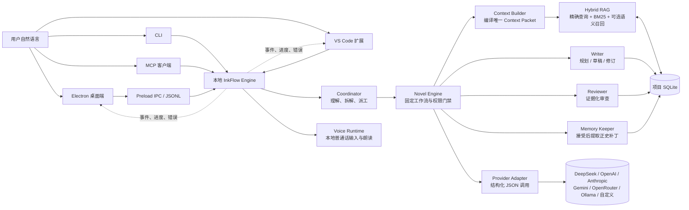
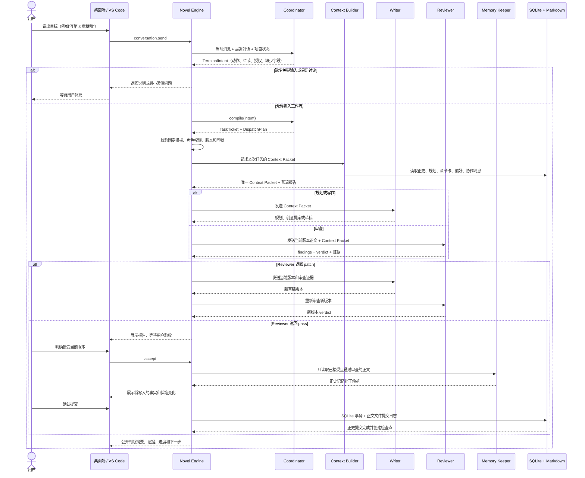
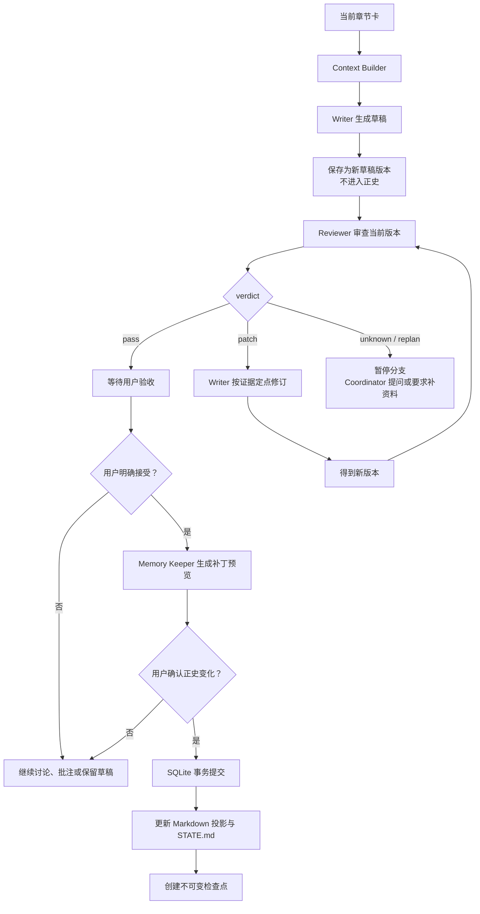
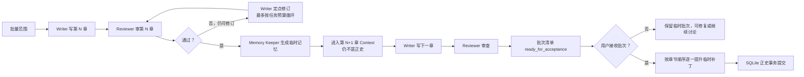
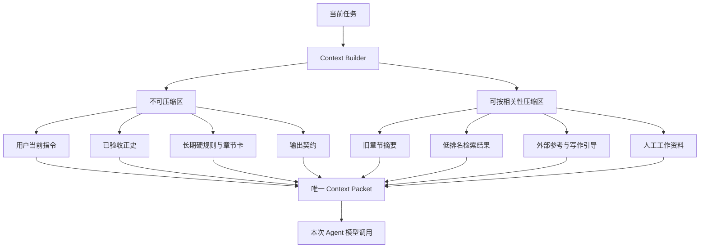
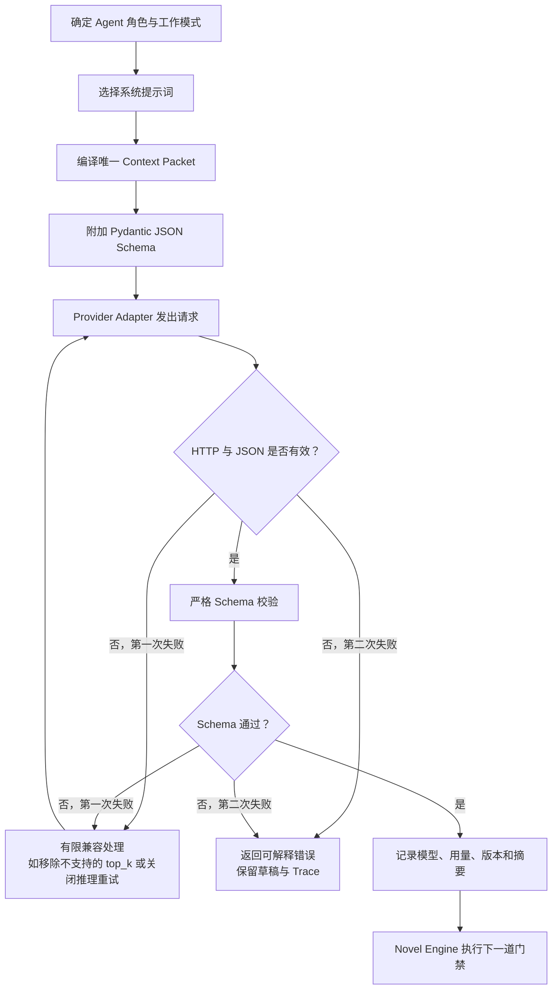
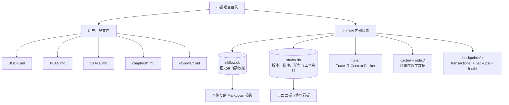
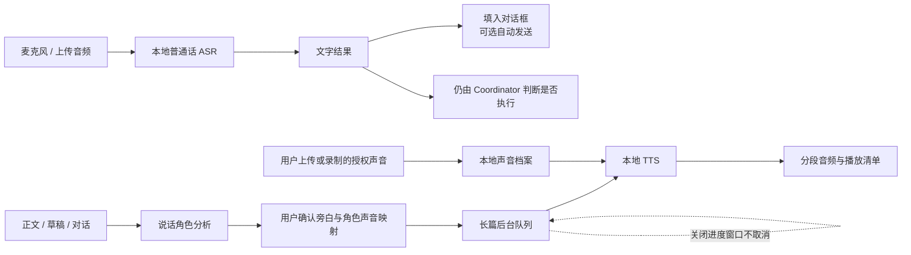
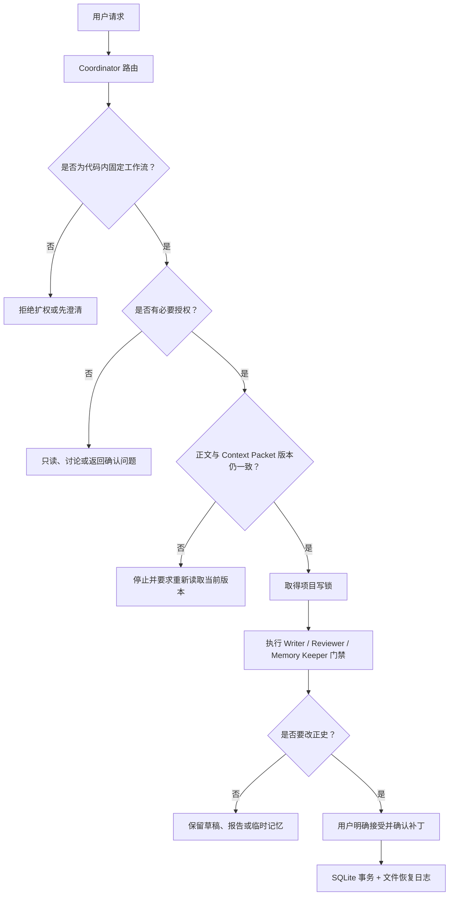

# 墨流（InkFlow）

墨流是一套面向中文长篇小说的本地创作工作台。你用普通话描述想法，墨流先理解目标，再按固定流程安排规划、写作、审查和正史维护。

当前源码版本：**0.5.3**

墨流的核心不是“开几个聊天窗口让模型自由发挥”，而是把模型放进一个有边界的生产系统：

- 四个正式 AI Agent 各司其职：Coordinator、Writer、Reviewer、Memory Keeper。
- Novel Engine 是确定性的编排器，负责检查权限、版本、证据、哈希和提交门禁。
- Context Builder 把书籍契约、正史、章节卡、检索结果和当前任务编译成一个 Context Packet；一次模型调用只看到这一份编译结果。
- SQLite 保存可核对的正史和运行状态，章节 Markdown 是用户直接阅读和编辑的文件投影。
- 语音是本地确定性服务，不是第五个 Agent，不参与写作、审查或正史提交。

## 先看懂：一次请求怎样变成结果



简单说，用户不会直接命令 Writer 去改数据库，也不会让 Reviewer 直接覆盖正文。每一步都先形成结构化结果，再由引擎判断下一步是否允许执行。

## 四个正式 AI Agent

四个 Agent 是产品层面的正式角色，但只有 Writer、Reviewer、Memory Keeper 负责小说生产。Coordinator 是 AI 产品经理与协作管家，不越过生产权限。

| Agent | 主要工作 | 不允许做的事 | 常见运行模式 |
| --- | --- | --- | --- |
| **Coordinator** | 理解自然语言、维护日常交流、拆解目标、补齐必要参数、选择固定工作流、生成任务单、汇总分歧 | 写正文、审查正文、替 Reviewer 放行、提交正史、发明工具或绕过门禁 | `chat`、`discuss`、路由 `TerminalIntent`、任务单与 `DispatchPlan` |
| **Writer** | 生成四级规划、开书创意、章节草稿、定点修订和选区替换 | 批准自己的正文、修改正史、修改审核规则 | `BRAINSTORM`、`PLAN`、`DRAFT`、`REVISE`、`SELECTION_REVISE` |
| **Reviewer** | 对当前正文做有证据的逻辑、时间、人物、因果、章节功能和表达审查 | 直接修改正文、用多数投票代替证据、审查旧版本后放行新版本 | `REVIEW`、多维预审、逐条语义核验、争议裁决、`ARC_AUDIT` |
| **Memory Keeper** | 从用户已接受且通过审查的正文提取事实、人物状态、伏笔和章节摘要，生成正史补丁 | 从未验收草稿写正史、续写、替用户裁决故事方向 | `MEMORY_PATCH`、证据对齐、冲突处理、批次临时记忆、正史提交 |

### Agent 之间怎样交流

墨流不使用无边界的自由群聊。需要互相确认时，系统写入结构化协作消息，消息绑定：

- 任务编号和运行编号；
- 章节号、当前草稿版本和正文哈希；
- Context Packet 编号；
- 发件 Agent、收件 Agent、问题类型和期望回复；
- 可复核的证据引用和消息状态。

一个议题默认最多进行两轮定向交流。仍然有歧义或分歧时，相关分支暂停，由 Coordinator 向用户提出最小问题。即使 Agent 之间说“可以”，也不能替代 Reviewer 的新版本审查或用户的正史验收。

## 完整生产流程

下面是从一句自然语言到正史提交的完整链路：



### 单章门禁



## 规划、写作、审查和批量模式

### 1. 建项与规划

新建小说时可以自己填写书名、题材、前提、主角、读者、单章字数、预计章节和卷数，也可以让 Writer 的灵感分身先给一个或三个方向。

灵感分身只返回可编辑的创意提案，不读取正史、不审查、不写正文。你选定方向并点击确认后，项目才会在本地创建。

正式规划由 Writer 生成四级结构：

1. 全书罗盘：长期主线、主题问题、主要冲突和结局方向。
2. 卷计划：每卷的承诺、起点、终点、对手压力、高潮和下一卷桥接。
3. 篇章计划：篇章承诺、升级、转折、高潮、余波、伏笔生命周期。
4. 章节卡：视角、时空、目标、阻力、决定、后果、不可逆变化、场景序列和章末钩子。

远期只保持方向，当前篇章才展开连续章节卡，避免把几百章伪装成一次性精确流水账。当前篇章全部进入正史后，Writer 才能根据实际结果生成下一篇章；新规划不能静默改写已经接受的历史。

### 2. 单章草稿

Writer 读取当前章节卡和 Context Packet，输出完整草稿和公开判断摘要。草稿会保存为新的文档版本，但不会自动审查，也不会自动进入正史。

用户只说“写草稿”时，墨流只写草稿；只有用户明确要求审查、修订或验收时，才进入相应流程。

### 3. 审查与修订

Reviewer 只报告有证据的问题。它会检查：

- 时间线、地点、物件状态和数字；
- 人物知道什么、相信什么，以及信息来源；
- 世界规则、因果、资源收支；
- 章节卡功能、篇章承诺和伏笔推进；
- 节奏、重复表达、角色同声和章末钩子。

每个扣分项都要引用当前正文连续原文；正史或规划冲突还要引用 Context Packet 中的来源。`major` 或 `blocking` 只用于有直接证据的硬问题，普通文风建议不会阻止放行。

Reviewer 返回 `patch` 时，Writer 依据报告生成新版本，Reviewer 必须审查这个新版本，旧报告不能批准新正文。返回 `unknown` 或 `replan` 时，系统不会猜测，会暂停并要求补充证据或调整规划。

### 4. 批量草稿与长跑

批量草稿不是“同时让多个 Agent 拼一部小说”，而是按章节顺序执行：



批次中的临时记忆只服务于同一批次后续章节的连续性；用户接收前，它不会成为正式正史。任一章节出现硬问题，批次会停在该章，不跳过失败章节继续写后面。

## Context Packet 与混合 RAG

### Context Packet 是什么

Context Packet 是一次模型调用唯一能看到的资料包。它不是把整个项目原样塞给模型，而是按任务编译出有来源、有权限、有预算的上下文。常见分区包括：

- 当前任务与用户要求；
- 冲突优先级与资料边界；
- 已验收正史事实和人物知识边界；
- 全书、卷、篇章、章节卡切片；
- 人工场景笔记和 Story Bible（明确标记为非正史）；
- 最近已接受章节和批次临时草稿；
- 未结伏笔、故事承诺和钩子义务；
- 混合检索结果、参考作品特征卡和写作引导；
- 用户偏好、文风契约、本地学习提示；
- 当前模式的输出契约。

冲突优先级固定为：

```text
用户当前明确指令
> 已验收正史
> 用户长期硬规则
> 当前章节卡
> 已确认工作决定
> 用户弱偏好
> Agent 建议
> 外部作品特征
```



当前默认软预算为 256K tokens，硬上限为 512K tokens，单次输出上限为 16K tokens。实际任务还会给草稿、审查和修订分别设置更窄的预算，并为输出预留空间。接近软预算时，只压缩低权威、低相关资料；用户指令、正史、长期硬规则、章节卡和输出门禁不会被静默删掉。硬材料本身超限时，流程停止并要求缩小任务范围。

### 检索怎么工作

```text
稳定 ID / 实体精确查询
→ 本地 BM25
→ 可选本地语义召回（例如 BGE-M3）
→ 融合去重
→ 可选 reranker（例如 BGE reranker）
→ 一跳关系扩展
→ 角色、章节、版本和权限过滤
→ 写入唯一 Context Packet
```

精确查询和 BM25 默认可用，不需要先下载大模型。语义模型和 reranker 在设置中填写后才启用。检索数量会根据查询复杂度、候选规模、涉及人物、未结伏笔、时间跨度和反馈动态计算，不把生成参数里的 `top_k` 当作固定召回数量；模型接口不支持 `top_k` 时，适配器不会强行发送。

Reviewer 对来源的正确引用或误导反馈会记录到项目中，影响之后的排序。SQLite 是事实来源，检索索引和缓存属于可重建派生数据，不会反过来取代正史。

## 每个模型调用的运作模式

无论底层使用哪家模型，墨流都尽量让调用保持同一种结构：



模型只接收公开的任务资料和输出契约。墨流不展示或保存模型原始思维链，只展示判断摘要、证据、工具状态、版本和可复核结论。

### Provider 适配

| 服务商类型 | 接口方式 | 说明 |
| --- | --- | --- |
| DeepSeek | OpenAI 兼容 Chat Completions | 支持 DeepSeek 的思考开关和推理强度字段 |
| OpenAI、Gemini、OpenRouter、Ollama、自定义服务 | OpenAI 兼容 Chat Completions | 通过基础地址和模型名接入；Ollama 可不填云端 Key |
| Anthropic | Anthropic Messages API | 使用独立的 `/v1/messages` 请求格式 |

每个 Agent 可以分别设置 `temperature`、`top_p` 和可选 `top_k`。`top_k` 默认留空；只有用户明确设置且接口接受时才使用。Provider 返回内容后由 Pydantic Schema 严格校验，避免把半截文本当成规划、审查或正史。

## 数据和文件怎样保存

创建一个小说项目后，用户能直接看到的文件通常是：

```text
小说项目/
├─ BOOK.md                    # 书籍契约：题材、前提、主角、读者和硬规则
├─ PLAN.md                    # 当前正式规划的可读投影
├─ STATE.md                   # 当前正史状态摘要
├─ chapters/                  # 章节正文和草稿 Markdown
├─ reviews/                   # Reviewer 审查报告与记忆冲突报告
├─ planning/                 # 规划判断单等公开规划材料
└─ .inkflow/
   ├─ project.json            # 项目标识与项目级设置
   ├─ inkflow.db              # 小说正史、规划、章节状态、审查、协作与学习事件
   ├─ studio.db               # 文档版本、批注、场景笔记、Story Bible、任务记录
   ├─ runs/                   # 每次运行的事件与 Context Packet
   ├─ cache/、index/          # 可重建缓存与检索派生数据
   ├─ references/             # 外部资料原文和抽象特征卡
   ├─ checkpoints/            # 不可变恢复点
   ├─ transactions/           # 正史文件与 SQLite 提交之间的恢复日志
   ├─ backups/                # 数据库迁移前的一致性备份
   └─ trash/                  # 可恢复删除的回收区
```



### 正史为什么同时有 SQLite 和 Markdown

- `inkflow.db` 保存已接受正文、事实、伏笔、章节状态、规划、审查和版本关系，是正史的稳定来源。
- `chapters/*.md` 是用户阅读、编辑和在 VS Code 中打开的文件投影。
- 用户修改未验收草稿时会产生新版本，不静默覆盖旧版本。
- 正史提交先准备文件和事务日志，再提交 SQLite，最后切换 Markdown；进程中断后可以按日志恢复。
- 旧项目需要增加正文列时，墨流先显示影响，用户确认后才备份并迁移；无法通过哈希验证的旧正文不会被猜测覆盖。

## 桌面端、引擎和其他入口

### Windows 桌面端

```text
Electron 主进程
→ 创建窗口、处理目录/文件/音频选择、在线更新和单实例
→ Preload 只暴露白名单 IPC
→ React/TypeScript 渲染工作区、Monaco 编辑器和面板
→ 按需启动本地 inkflow-engine.exe
→ 通过一行一个 JSON 的 JSON-RPC 通讯
```

启动时先显示主界面，模型状态、语音状态和更新检查在后台读取；最近项目会显示在主界面，用户点击后才进入工作区。只有通过 `--project` 启动参数明确指定项目时，才会自动打开该项目。这样模型连接慢或暂时不可用时，也不会把用户挡在空白启动页。

引擎请求会产生可见事件，例如“正在理解目标”“Writer 正在写作”“Reviewer 正在审查”“任务已完成”。桌面端可以显示这些进度、取消可取消的运行，并在任务记录中看到完成、失败、中断和取消状态。

### VS Code 扩展

`extension/` 是独立发布的工作区扩展，不和桌面端共用版本号。它提供：

- 墨流小说树和项目状态；
- 自然语言任务入口；
- 规划、写作、审查、验收快捷动作；
- 选中文字批注或局部修订；
- 检查点、任务记录和 MCP 配置。

扩展会优先寻找桌面版引擎，也可以使用工作区 Python 环境。它和桌面端调用同一套 `agent` 代码，不另起一套 Agent 逻辑。

### CLI 与 MCP

开发者可以从 CLI 调用创建项目、规划、写作、审查、修订、验收、批量流程、检查点和回退。MCP Server 通过 stdio 暴露同一套受门禁工具，外部编程助手不会获得一套绕过 Novel Engine 的隐藏接口。

仓库根目录的 `.mcp.json` 使用 `agent/scripts/inkflow-mcp.ps1` 启动 MCP。PowerShell 工具权限默认关闭；用户在设置中明确开启后，也只允许在当前小说项目目录内运行。

## 本地普通话语音

语音运行时与四个 Agent 并列但不属于 Agent。它只负责录音、普通话转写、朗读和长篇音频任务。



- 默认路径是轻量 `sherpa-onnx`，普通话 ASR/TTS 模型由用户在设置中确认后下载。
- Qwen/FunASR 是可选高品质组件，不随普通安装强制下载；安装前会显示磁盘、下载时间和显存影响。
- 只提供普通话模式；长篇转换和短消息朗读使用独立队列，并通过资源锁避免同时争抢推理资源。
- 关闭听读页面或进度窗口不会取消后台转换；只有用户明确点击“取消”才会停止。应用退出时未完成任务标记为中断，下次由用户选择是否继续。
- 声音克隆必须确认用户拥有使用权并已获得必要同意。参考音频、声音档案、角色映射和输出保存在应用语音目录，不写入小说正史、Trace 或公共训练数据。

## 编辑器里的预填续写

正文或草稿编辑器可以手动开启“预填续写”。停顿后，Writer 会读取光标附近文字和当前章节 Context Packet，返回一段灰色候选：

- `Tab` 接受候选并插入编辑器；
- `Esc` 忽略候选；
- 正文或光标变化会让旧候选失效；
- 候选不会自动保存、审查或写入正史；
- 仍然需要用户保存，并按普通草稿流程审查和验收。

这是编辑辅助，不是一个隐形的第五个写作 Agent。

## 本地学习与参考资料

墨流可以在本地记录接受、拒绝、撤回、重写、偏好和检索反馈，用于解释当前策略和改进排序。默认不会上传。

- 反馈事件保存在项目 SQLite。
- 允许导出后，默认导出结构化反馈；是否包含本项目正文由用户单独决定。
- 本地偏好比较可以训练一个轻量排序器。
- LoRA/DPO 功能目前只准备训练单，实际训练需要再次确认本地模型路径、磁盘、显存和时间。
- 外部热门作品只保留抽象特征卡，不把整本作品直接当训练语料，也不复用独特句子、人物或专名。

## 安全和权限边界



- API Key 只来自环境变量或系统凭据库（Windows Credential Manager），不写入代码、Git、小说、日志或 Trace。
- 普通设置保存在 `%APPDATA%\InkFlow\settings.json`，其中不允许出现 Key 或 Secret 字段；升级软件不会删除凭据库中的 Key。
- Reviewer 不能修改正文，Memory Keeper 不能从未验收草稿写正史，Coordinator 不能替它们越权。
- `force`、正史回改、数据库迁移、回退、删除和付费调用都必须经过明确确认或专用门禁。
- 回退先 `rollback-preview` 展示影响和确认码，再 `rollback-restore` 建立分支式恢复；不靠删除文件或重写 Git 历史伪装回退。
- Trace 只保存公开判断摘要、证据和工具状态，不保存原始思维链。

## 常见操作

普通用户不需要记命令，直接在桌面端输入自然语言即可，例如：

```text
帮我规划当前篇章
写第 3 章草稿，先不要审查
审查第 3 章，只指出有证据的问题
按审查意见修改第 3 章，但不要验收
我接受当前第 3 章，生成正史变化预览
连续生成第 8 到第 10 章草稿，逐章审查但先不要入正史
复审第 1 到第 10 章和篇章承诺的对齐情况
预览回退到第 6 章会影响什么
```

用户只说“讨论一下”“这个方向怎么样”时，Coordinator 会留在讨论，不会擅自调用 Writer 写正文。用户只要草稿时，也不会自动审查或入正史。

## 开发和构建

仓库的三个产品部分如下：

```text
agent/       Python 小说编排引擎、Provider、RAG、数据库、语音和 MCP
desktop/     Electron + React/TypeScript Windows 桌面端
extension/   独立 VS Code 扩展
development/ 构建脚本与当前维护说明
```

开发环境要求 Python 3.11+、Node.js/npm 和 Windows 桌面构建工具。按需安装依赖：

```powershell
pip install -e ".\agent[lightvoice]"  # 轻量 sherpa-onnx 语音
pip install -e ".\agent[rag]"         # 可选语义召回与 reranker
pip install -e ".\agent[voice]"       # 可选 Qwen/FunASR
```

构建桌面安装包：

```powershell
.\development\scripts\build-release.ps1
```

只有明确需要同时打包 VS Code 扩展时才增加 `-IncludeExtension`。普通用户直接从 GitHub Releases 下载 Windows 安装包即可，不需要安装 Python、Node.js 或阅读源码。

## 设计上的几个明确取舍

- 不增加“自由群聊 Agent”：交流必须绑定任务、版本和证据，最多两轮，避免重复、失控和费用膨胀。
- 不让多个 Writer 同时拼同一章：多个 Writer 只能提供互斥候选，最终正文由一个主笔版本产生。
- 不让多个 Reviewer 用投票代替证据：可以做独立第二意见，但每份意见都绑定同一正文哈希和 Context Packet。
- 不把向量检索当成正史：SQLite 是事实来源，索引可重建，检索结果必须经过权限和版本过滤。
- 不把语音拆成第五个 Agent：语音只执行确定性的输入、朗读和音频队列任务。
- 不把热门小说全文自动拿来训练：只学习抽象结构和用户明确允许的本地数据。

## 许可证

[MIT](LICENSE)
