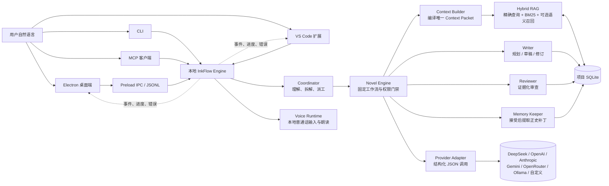
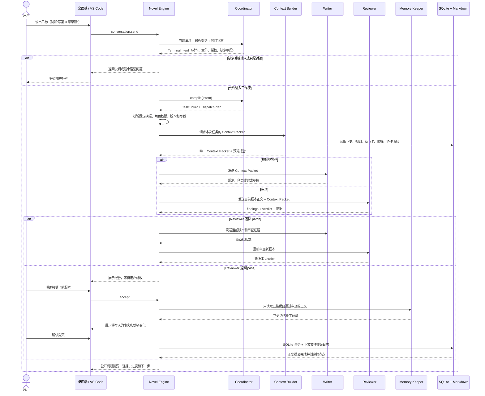
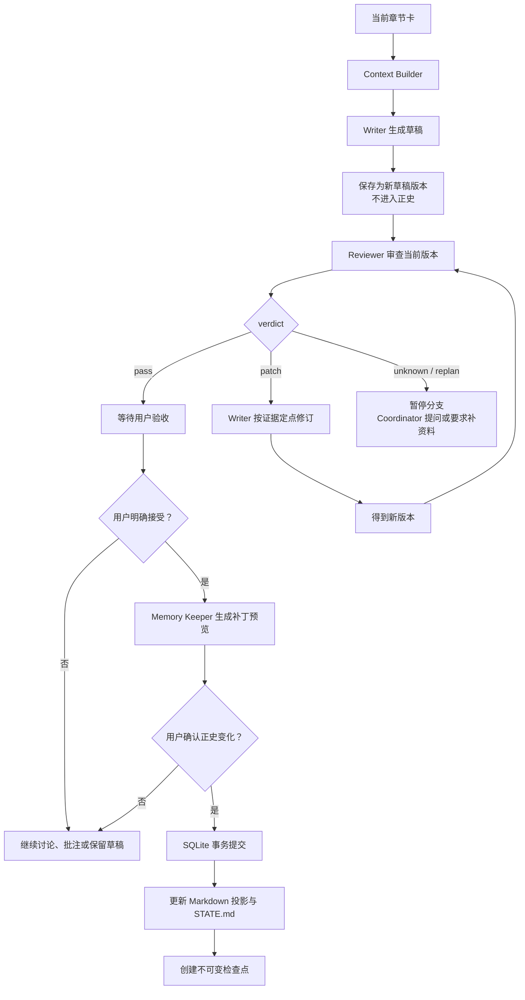
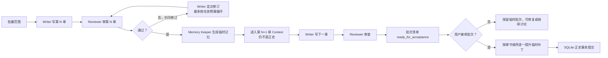
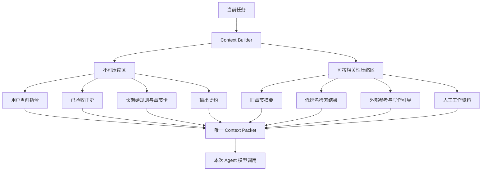
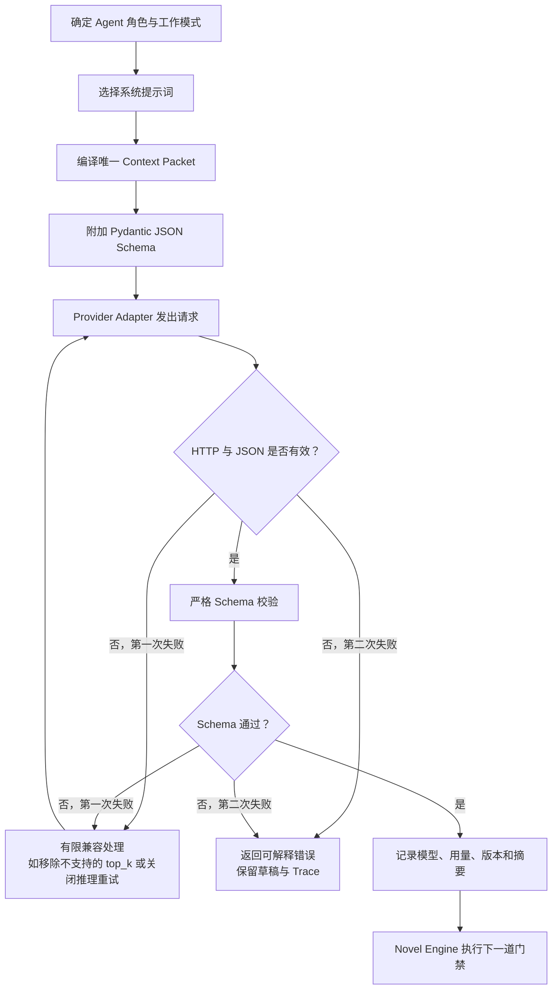
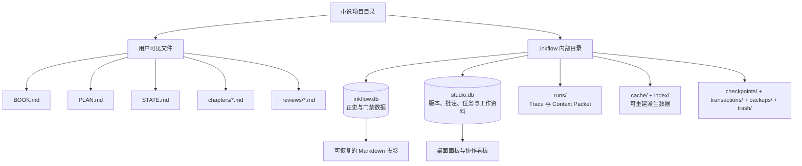
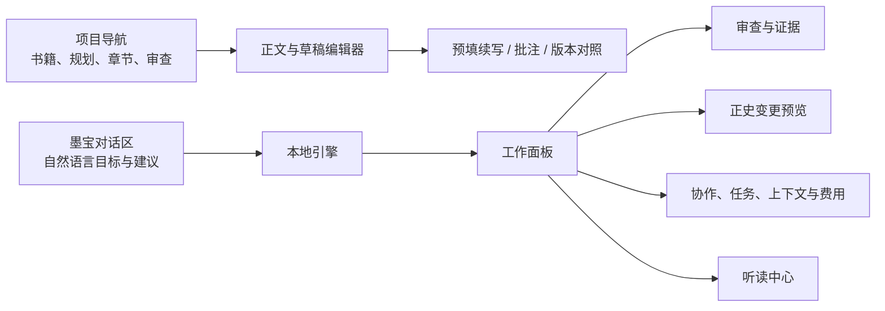
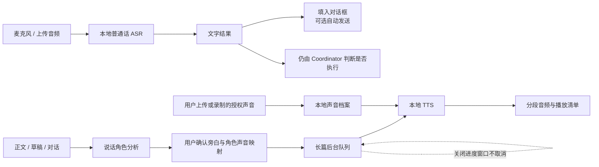
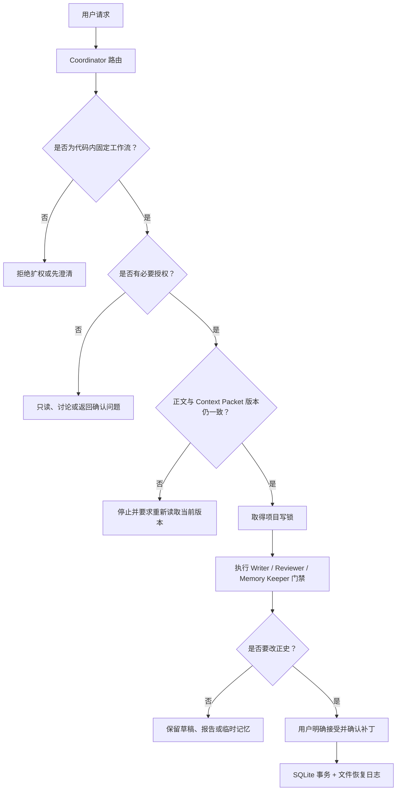

# 墨流（InkFlow）

墨流是一套为中文长篇小说设计的本地 AI 创作工作台。你可以直接用日常中文说明想法、修改意见或写作目标；Coordinator 会把需求整理成任务，Writer 负责规划和写作，Reviewer 根据正文与设定给出有证据的审查，Memory Keeper 只在正文被接受后更新正史。人物状态、时间线、伏笔、章节版本和任务记录都保存在本地项目中，方便长期连载、复查和回退。

当前源码版本：**0.6.0**

墨流把灵感讨论、四级规划、章节写作、审查、用户验收和长期记忆连接成一条可追踪的生产流程：

- 四个正式 AI Agent 各司其职：Coordinator、Writer、Reviewer、Memory Keeper。
- Novel Engine 是确定性的编排器，负责检查权限、版本、证据、哈希和提交门禁。
- Context Builder 把书籍契约、正史、章节卡、检索结果和当前任务编译成一个 Context Packet；一次模型调用只看到这一份编译结果。
- SQLite 保存可核对的正史和运行状态，章节 Markdown 是用户直接阅读和编辑的文件投影。
- 语音是本地确定性服务，不是第五个 Agent，不参与写作、审查或正史提交。

你可以从一句“我想写一个发生在南方小城的悬疑故事”开始，也可以导入已有设定后直接说“续写第 12 章，结尾留一个关于失踪照片的钩子，先不要入正史”。墨流会显示谁正在处理、参考了哪些资料、生成了什么文件、为什么暂停，以及下一步需要由谁完成。

## 0.6.0 更新日志

0.6.0 集中解决三个实际问题：长篇写作容易失去读者期待，多个角色使用上下文时缺少清楚的证据链，桌面端很难让普通用户看懂系统正在做什么。同时重做了本地普通话语音方案，并让更新包具备差分下载条件。

### 1. 四 Agent 调度和权限说明更加完整

**改前问题：** Coordinator 的定位容易被误解成普通聊天外壳，用户也难以判断一句自然语言请求究竟会调用哪个角色、是否会进入审查或正史提交。

**本次改动：** 明确 Coordinator、Writer、Reviewer、Memory Keeper 都是正式 AI Agent，其中后三个承担小说生产职责。Coordinator 负责理解自然语言、建立任务单、选择代码中已有的工作流、生成调度计划、展示进度和汇总结果；它不能替 Writer 写正文、替 Reviewer 放行，也不能替 Memory Keeper 提交正史。Novel Engine 继续校验角色权限、章节版本、正文哈希、证据与验收来源。

桌面端任务卡现在会显示任务目标、章节与版本、执行步骤、当前进度、停止条件、验收模式和授权来源。Agent 交接写入结构化协作消息，消息会绑定任务、章节版本、Context Packet 和证据引用。一个方向默认最多讨论两轮；仍有分歧时暂停相关分支，由 Coordinator 向用户提出最小问题。

**改后效果：** 用户可以看懂任务为什么被路由给某个 Agent，也能区分“已经生成草稿”“Reviewer 已审查”和“已经写入正史”这三种完全不同的状态。

### 2. 章节钩子从一句提示升级为可规划、可说明、可审查的写作环节

**改前问题：** 普通剧情章节容易平收，高潮章节虽然有悬念，却可能只留下含糊句子；Reviewer 又可能把有意留白当成表达不清，导致 Writer 为了通过审查提前解释谜底。

**本次改动：** 新增“章节结尾策略”，默认让大多数章节保留前向期待，同时提供“重点章节使用明确钩子”和“自然余味优先”。规划阶段会把结尾承诺写入章节卡；Writer 可使用未完成行动、关系变化、信息差、代价逼近、情绪余波等方式形成钩子，不要求每章都靠反转或危险事件。

Writer 输出新增独立 `HookNote`，记录钩子类型、实际锚点、读者将期待什么、为什么值得保留、有意暂不说明什么、必须讲清什么以及预计在哪个范围回应。系统还会检查近期章节结尾模式，提示连续使用同一种悬念、问句或突发打断的重复风险。精修任务可附带场景蓝图，说明每个场景的进入状态、人物目标、新压力、转折和退出状态。

Reviewer 新增 `HookAssessment`。它会区分“信息清楚”“有意留白”“真正混乱”和“没有钩子”；未知答案、延后揭晓或开放问题本身不扣清晰度分。只有缺少可理解锚点、与正史冲突、承诺无法兑现或结尾重复时才提出问题。审查报告会保留钩子建议，但不会扩大正史硬门禁。

**改后效果：** 章节结尾更容易形成下一章阅读动力，Writer 知道为什么留下这个钩子，Reviewer 也能保护合理的神秘感，同时指出空悬念和重复套路。

### 3. Context Packet 支持按 Agent 分配预算，并记录实际使用证据

**改前问题：** 四个角色共用一个上下文上限时，Writer、Reviewer 和 Memory Keeper 的任务差异无法体现；上下文过长时简单截断还可能破坏结构化资料。界面虽然能看到结果，却不容易判断本次到底引用、遗漏或冲突了哪些来源。

**本次改动：** 设置中保留“统一预算”，并增加“按 Agent 自定义”。用户可以分别设置 Coordinator、Writer、Reviewer、Memory Keeper 的常用上下文和最大上下文；每次模型调用仍只接收一个由 Context Builder 编译完成的 Context Packet。硬约束优先保留，软资料按任务相关性、来源权威和预算取舍；JSON、列表和长文本在压缩时尽量保持结构和句段边界，而不是从中间粗暴切断。

Writer 每次写作会保存上下文清单，记录 Context Packet 各分区、来源 ID、启用的写作指南和对应章节版本。Reviewer 输出新增 `ContextUseAudit`，分别列出正文实际采用的来源、应使用却遗漏的硬来源、发生冲突的来源；服务端只接受当前 Context Packet 中真实存在的来源 ID，防止报告引用不存在的材料。

用户长期偏好按“硬规则”和“弱偏好”进入上下文。硬规则会强制保留；弱偏好根据当前任务、章节卡和相关词进行筛选，避免偏好越积越多后挤占正文与正史。偏好现在可以启用、停用和删除，修改记录会进入本地学习事件。

**改后效果：** 用户既可以用一个简单的统一设置，也能为不同 Agent 精细分配上下文；当结果有问题时，可以从界面和审查报告追到具体来源，而不是只看到一句“模型参考了资料”。

### 4. Reviewer 的审查力度和阅读建议分开控制

**改前问题：** 一般阅读体验建议和必须阻止提交的硬错误混在一起，容易出现小问题反复打回；同时，审查结论若没有绑定当前正文版本，旧报告可能被误用于新草稿。

**本次改动：** 审查继续只把硬正史冲突、不可能的时间或因果、核心章节功能缺失、输出截断和严重重复作为提交阻断条件。阅读体验建议可选精简、标准或详细，标准模式优先给出 1～3 条最有价值的修改意见。核验模式分为本地证据门禁、增强核验和争议裁判；本地中文 NLI 与裁判模型都保持可选，未配置时不影响基础审查。

审查报告绑定章节号、草稿版本、正文哈希、Context Packet 与证据引用。桌面端新增章节状态条，显示当前草稿版本、Reviewer 报告是否匹配、能否验收；旧版本报告无法批准新版本正文。

**改后效果：** Reviewer 能严格拦住会破坏故事连续性的错误，也不会因为一条普通风格建议让流程无限返工。用户能直接看见为什么当前章节可以或不可以验收。

### 5. 验收方式增加逐章、批次一次和审查通过后自动验收

**改前问题：** 单章和批量写作都按同一种确认节奏处理，长批次需要频繁点击；完全取消确认又可能让未经审查的草稿进入正史。

**本次改动：** 设置新增三种验收策略：逐章确认、批次提交前确认一次、Reviewer 通过后自动验收。自动验收只在用户主动发起包含审查的工作流、当前版本审查通过且所有哈希与权限门禁成立时生效；“只写草稿”永远不会因此自动提交正史。任务单会记录授权来自当前请求、逐章点击、批次预授权还是设置中的自动验收。

批量草稿继续逐章执行 Writer、Reviewer、必要修订和重审。用户验收前，后续章节只读取同一批次的临时连续性账本和临时 Memory Keeper 补丁；中间章节重写后，会使其后依赖的临时记忆失效并从受影响处重建。正式提交只接受连续且通过审查的章节前缀。

**改后效果：** 用户可以根据写作习惯选择安全程度和操作频率，同时保留“当前版本已审查、用户已有授权、事务提交成功”三层保护。

### 6. 桌面端把运行过程、错误和设置改成普通用户可理解的界面

**改前问题：** 任务执行时只能看到笼统状态；遇到错误时，技术异常文本不能告诉用户数据有没有保留、应该去哪里处理。模型、上下文、审查和语音设置也较难区分。

**本次改动：** 过程面板以任务卡展示执行步骤和结果位置，并显示公开判断摘要、工作流动作、Agent、章节版本、参考来源和生成文件。文件引用可以从项目导航打开对应内容；系统仍不显示模型原始思维链。错误被整理为标题、原因、影响、已保留内容和下一步按钮，例如打开模型设置、打开章节审查或重新尝试。

设置重新按外观、模型、创作、语音、上下文、审查、学习和高级能力组织。模型生成参数与上下文预算都支持统一和按角色调整；章节钩子密度、验收确认方式、Reviewer 建议详细度也都有独立入口。更新窗口会区分检查、发现版本、下载进度、已下载和等待安装状态。

**改后效果：** 用户不用理解内部类名或数据库结构，也能判断系统现在在做什么、用了什么、结果放在哪里以及出错后该怎么继续。

### 7. 本地普通话语音改为 Kokoro 默认、Qwen3-TTS 1.7B 可选

**改前问题：** 旧轻量 VITS 音色机械，可选语音链路同时依赖 FunASR，模型职责和下载时机不够清楚；普通朗读、声音克隆和录音长度约束也容易混为一谈。

**本次改动：** 日常朗读默认改为 Kokoro 中文版 `kokoro-int8-multi-lang-v1_1`，由 sherpa-onnx 本地运行；普通话输入统一使用 SenseVoice。Kokoro 会按中文标点拆分语句、调整问句和感叹句语速、增加可调停顿并在分段边缘做淡入淡出，减少逐字播报和拼接爆音。默认提供多种男女声档案，用户可以调整速度、音量、停顿比例、设备和缓存。

高品质朗读与声音克隆改用 Qwen3-TTS 1.7B：CustomVoice 用于预设音色，Base 用于用户授权的声音克隆。安装按钮只负责下载并登记模型，不在下载阶段占用显卡；日常朗读只从本地文件加载，绝不会因为点一次朗读而偷偷下载。切换引擎时释放上一套模型缓存，减少两套大模型同时占用显存。FunASR 已从语音依赖中移除。

声音克隆现在明确分成两个互不混用的步骤：

1. **Writer 生成朗读稿。** 用户主动点击后才调用当前 Writer 模型，输出 180～400 字普通话文本和发音覆盖说明。它只生成文字，不读取音频、不启动录音、不训练声音，也不写入小说正史。
2. **Voice Runtime 采集参考录音。** 用户确认拥有声音使用权后上传或录制与朗读稿一致的音频；运行时独立检查 3～120 秒，内置录音到 120 秒自动停止。该时长限制不由 Writer 判断。

升级后首次启动会清理应用语音目录内已知的旧 VITS 和 Qwen 0.6B 模型缓存，避免旧模型与新路径混用；识别模型、用户录音、克隆档案、角色映射和已生成听读结果保留。清理失败会提示并在下次启动重试。Kokoro 与 Qwen 均不会随普通安装包强制附带，仍需用户在设置中了解大小和资源影响后主动下载。

**改后效果：** 基础朗读更自然、占用更轻，声音克隆拥有清楚的文字与录音边界；模型下载、磁盘占用和显存使用都由用户可见操作触发。

### 8. 桌面端更新支持差分包

**改前问题：** 每次升级都下载完整安装包，修改很小时仍要等待整个安装程序传输。

**本次改动：** Electron NSIS 构建开启差分包，发布流程要求同时产出安装程序、`latest.yml` 和 `.exe.blockmap`。客户端发现新版本后可根据 blockmap 只下载发生变化的数据块；如果服务器或旧版本不满足差分条件，electron-updater 会回退到完整包，不会用文件覆盖方式破坏安装。

**改后效果：** 后续版本在发布资源齐全时可以显著减少下载量和更新时间，同时仍保留完整安装包作为兼容路径。

### 9. 版本、兼容和验证说明

- Python 引擎、桌面端和 VS Code 扩展版本统一更新为 `0.6.0`，桌面构建输出目录和 VSIX 文件名同步更新。
- 0.6.0 不增加第五个 Agent。Context Builder、Novel Engine 和 Voice Runtime 都是确定性组件或服务，由现有四 Agent 工作流调用。
- 云模型调用仍取决于用户配置的服务商；本地语音模型仍由用户主动下载。Qwen3-TTS 1.7B 两套模型需要明显更多磁盘和运行资源。
- 本轮已完成桌面端 TypeScript 类型检查，以及语音克隆 MVP 边界检查：Writer 朗读稿保持 180～400 字，录音器独立限制 120 秒。没有为验证而下载或安装任何语音模型。

## 墨流适合做什么

墨流面向的是需要长期保持人物、时间线、伏笔和章节目标一致的中文小说创作。它既可以作为“从灵感开始”的创作助手，也可以接手一部已经有设定、正文和大纲的作品，帮助作者把素材整理成可继续写作的项目。

| 你现在的状态 | 可以怎样使用墨流 | 主要结果 |
| --- | --- | --- |
| 只有一个模糊点子 | 先和 Coordinator 讨论，再让 Writer 提出一个或三个创意方向 | 可编辑的选题、卖点、人物关系和开篇钩子 |
| 已经知道题材和主角 | 新建项目并生成书罗盘、卷计划、篇章计划和章节卡 | 一套逐步展开的写作蓝图 |
| 正在连载 | 让 Writer 写下一章草稿，或只请求局部续写、扩写、改对白 | 新的草稿版本，不会覆盖已接受正文 |
| 感觉前后不一致 | 让 Reviewer 针对人物、时间、设定、因果或伏笔做证据化审查 | 可定位的问题和修改建议 |
| 想长期维护世界观 | 在 Story Bible、场景笔记和偏好中补充材料 | 后续写作可检索的工作资料；不会自动升级为正史 |
| 想听小说或用语音对话 | 开启本地普通话转写、短消息朗读或后台听读 | 本机音频与播放清单，不影响写作和正史 |

它不把“生成得很长”当作完成，也不承诺代替作者作出所有故事决定。故事方向、接受哪一个版本、是否修改既有正史、是否使用自己的声音，始终由用户决定。

### 一次普通创作会看到什么

以“帮我写第 3 章草稿，先不要审查”为例，用户看到的是：Coordinator 先确认目标和章节；Writer 使用第 3 章章节卡、已有正史和相关资料写出新草稿；编辑器显示可阅读、可修改的版本；过程面板保留这次任务的公开摘要和所用资料范围。因为用户只要求草稿，系统不会把它当成已通过审查，更不会写入正史。

如果用户接着说“审查这章”，Reviewer 才会针对当前版本给出有引文的问题；如果用户说“按意见修改”，Writer 才基于该报告生成下一版。这样的分层让作者可以随时停在草稿、讨论或审查阶段，而不是被自动化流程推着走。

## 先看懂：一次请求怎样变成结果



简单说，用户不会直接命令 Writer 去改数据库，也不会让 Reviewer 直接覆盖正文。每一步都先形成结构化结果，再由引擎判断下一步是否允许执行。

## 四个正式 AI Agent

四个 Agent 是产品层面的正式角色，但只有 Writer、Reviewer、Memory Keeper 负责小说生产。Coordinator 是 AI 产品经理与协作管家，不越过生产权限。

| Agent | 主要工作 | 不允许做的事 | 常见运行模式 |
| --- | --- | --- | --- |
| **Coordinator** | 理解自然语言、维护日常交流、拆解目标、补齐必要参数、选择固定工作流、生成任务单、汇总分歧 | 写正文、审查正文、替 Reviewer 放行、提交正史、发明工具或绕过门禁 | `chat`、`discuss`、路由 `TerminalIntent`、任务单与 `DispatchPlan` |
| **Writer** | 生成四级规划、开书创意、章节草稿、定点修订和选区替换 | 批准自己的正文、修改正史、修改审核规则 | `BRAINSTORM`、`PLAN`、`DRAFT`、`REVISE`、`SELECTION_REVISE` |
| **Reviewer** | 对当前正文做有证据的逻辑、时间、人物、因果、章节功能和表达审查 | 直接修改正文、用多数投票代替证据、审查旧版本后放行新版本 | `REVIEW`、多维预审、逐条语义核验、争议裁决、`ARC_AUDIT` |
| **Memory Keeper** | 从用户已接受且通过审查的正文提取事实、人物状态、伏笔和章节摘要，生成正史补丁 | 从未验收草稿写正史、续写、替用户裁决故事方向 | `MEMORY_PATCH`、证据对齐、冲突处理、批次临时记忆、正史提交 |

### Agent 之间怎样交流

墨流不使用无边界的自由群聊。需要互相确认时，系统写入结构化协作消息，消息绑定：

- 任务编号和运行编号；
- 章节号、当前草稿版本和正文哈希；
- Context Packet 编号；
- 发件 Agent、收件 Agent、问题类型和期望回复；
- 可复核的证据引用和消息状态。

一个议题默认最多进行两轮定向交流。仍然有歧义或分歧时，相关分支暂停，由 Coordinator 向用户提出最小问题。即使 Agent 之间说“可以”，也不能替代 Reviewer 的新版本审查或用户的正史验收。

### 为什么要分成四个角色

小说创作里，“想出下一段”“判断这一段是否成立”“把已经成立的事实记下来”是三种不同的工作。把它们交给同一个没有边界的聊天角色，容易出现自己写、自己批准、再把未经确认的内容当作事实的情况。墨流把它们拆开：Writer 负责创造，Reviewer 负责质疑，Memory Keeper 负责记录，Coordinator 负责帮用户把事情讲明白和安排清楚。

Coordinator 的价值不在于多写一段正文，而在于让用户不必背命令：它会理解“这段节奏太慢”“男女主的关系再拉扯一点”“把这一章改得更像悬疑”“先别入正史”这些自然语言，并选择已定义的工作方式。它不拥有 Writer、Reviewer 或 Memory Keeper 的生产权限，因此也不会用“我觉得可以”替用户做验收决定。

## 完整生产流程

下面是从一句自然语言到正史提交的完整链路：



### 单章门禁



## 规划、写作、审查和批量模式

### 1. 建项与规划

新建小说时可以自己填写书名、题材、前提、主角、读者、单章字数、预计章节和卷数，也可以让 Writer 的灵感分身先给一个或三个方向。

灵感分身只返回可编辑的创意提案，不读取正史、不审查、不写正文。你选定方向并点击确认后，项目才会在本地创建。

正式规划由 Writer 生成四级结构：

1. 全书罗盘：长期主线、主题问题、主要冲突和结局方向。
2. 卷计划：每卷的承诺、起点、终点、对手压力、高潮和下一卷桥接。
3. 篇章计划：篇章承诺、升级、转折、高潮、余波、伏笔生命周期。
4. 章节卡：视角、时空、目标、阻力、决定、后果、不可逆变化、场景序列和章末钩子。

远期只保持方向，当前篇章才展开连续章节卡，避免把几百章伪装成一次性精确流水账。当前篇章全部进入正史后，Writer 才能根据实际结果生成下一篇章；新规划不能静默改写已经接受的历史。

### 2. 单章草稿

Writer 读取当前章节卡和 Context Packet，输出完整草稿和公开判断摘要。草稿会保存为新的文档版本，但不会自动审查，也不会自动进入正史。

用户只说“写草稿”时，墨流只写草稿；只有用户明确要求审查、修订或验收时，才进入相应流程。

### 3. 审查与修订

Reviewer 只报告有证据的问题。它会检查：

- 时间线、地点、物件状态和数字；
- 人物知道什么、相信什么，以及信息来源；
- 世界规则、因果、资源收支；
- 章节卡功能、篇章承诺和伏笔推进；
- 节奏、重复表达、角色同声和章末钩子。

每个扣分项都要引用当前正文连续原文；正史或规划冲突还要引用 Context Packet 中的来源。`major` 或 `blocking` 只用于有直接证据的硬问题，普通文风建议不会阻止放行。

Reviewer 返回 `patch` 时，Writer 依据报告生成新版本，Reviewer 必须审查这个新版本，旧报告不能批准新正文。返回 `unknown` 或 `replan` 时，系统不会猜测，会暂停并要求补充证据或调整规划。

### 4. 批量草稿与长跑

批量草稿不是“同时让多个 Agent 拼一部小说”，而是按章节顺序执行：



批次中的临时记忆只服务于同一批次后续章节的连续性；用户接收前，它不会成为正式正史。任一章节出现硬问题，批次会停在该章，不跳过失败章节继续写后面。

### 写作资料的层次

墨流把材料区分为不同层次，避免一句临时想法悄悄变成不可推翻的设定：

| 材料 | 用途 | 是否属于正史 |
| --- | --- | --- |
| `BOOK.md` | 题材、前提、目标读者、长期硬规则和书籍契约 | 是，作为项目级约束 |
| 书罗盘、卷/篇章计划、章节卡 | 说明故事要往哪里发展、当前章要完成什么 | 是，属于经过确认的规划 |
| 章节草稿 | Writer 或用户正在尝试的正文 | 否，直到通过审查并被用户接受 |
| 审查报告 | Reviewer 对某一草稿版本的判断和证据 | 否，不直接改正文 |
| Story Bible、场景笔记、批注 | 作者的工作材料、备选设定和局部提醒 | 否，需明确进入正文并验收后才可能成为事实 |
| `STATE.md` 和事实/伏笔记录 | 从已接受正文同步出的当前世界状态 | 是 |

因此，作者可以大胆在笔记区尝试设定；真正写进历史的内容仍然必须在正文、审查和验收中得到确认。

## Context Packet 与混合 RAG

### Context Packet 是什么

Context Packet 是一次模型调用唯一能看到的资料包。它不是把整个项目原样塞给模型，而是按任务编译出有来源、有权限、有预算的上下文。常见分区包括：

- 当前任务与用户要求；
- 冲突优先级与资料边界；
- 已验收正史事实和人物知识边界；
- 全书、卷、篇章、章节卡切片；
- 人工场景笔记和 Story Bible（明确标记为非正史）；
- 最近已接受章节和批次临时草稿；
- 未结伏笔、故事承诺和钩子义务；
- 混合检索结果、参考作品特征卡和写作引导；
- 用户偏好、文风契约、本地学习提示；
- 当前模式的输出契约。

冲突优先级固定为：

```text
用户当前明确指令
> 已验收正史
> 用户长期硬规则
> 当前章节卡
> 已确认工作决定
> 用户弱偏好
> Agent 建议
> 外部作品特征
```



当前默认软预算为 256K tokens，硬上限为 512K tokens，单次输出上限为 16K tokens。实际任务还会给草稿、审查和修订分别设置更窄的预算，并为输出预留空间。接近软预算时，只压缩低权威、低相关资料；用户指令、正史、长期硬规则、章节卡和输出门禁不会被静默删掉。硬材料本身超限时，流程停止并要求缩小任务范围。

### 检索怎么工作

```text
稳定 ID / 实体精确查询
→ 本地 BM25
→ 可选本地语义召回（例如 BGE-M3）
→ 融合去重
→ 可选 reranker（例如 BGE reranker）
→ 一跳关系扩展
→ 角色、章节、版本和权限过滤
→ 写入唯一 Context Packet
```

精确查询和 BM25 默认可用，不需要先下载大模型。语义模型和 reranker 在设置中填写后才启用。检索数量会根据查询复杂度、候选规模、涉及人物、未结伏笔、时间跨度和反馈动态计算，不把生成参数里的 `top_k` 当作固定召回数量；模型接口不支持 `top_k` 时，适配器不会强行发送。

Reviewer 对来源的正确引用或误导反馈会记录到项目中，影响之后的排序。SQLite 是事实来源，检索索引和缓存属于可重建派生数据，不会反过来取代正史。

### 上下文为什么不是越多越好

长篇小说的全部文件往往远超一个模型一次能可靠阅读的范围。把所有旧正文直接塞进去，不一定更聪明，反而会让当前章节卡、硬设定和用户新要求被淹没。墨流因此先固定不能丢的内容，再从相关资料中挑选最接近当前任务的片段。

草稿任务会更重视当前章节卡、上一章结果、人物状态和未结伏笔；审查任务会更重视当前正文、它声称冲突的事实和对应规划；规划任务则更重视书罗盘、卷篇章承诺和用户偏好。桌面端的上下文检查器会展示本次包含了哪些来源、检索取了什么、压缩了什么，作者可以据此补充或固定自己的资料。

`top_k` 不是一个永远不变的写作开关。它在墨流中主要是检索候选数量：涉及人物、时间跨度、未结线索或查询歧义更多时，召回范围会变大；结果清晰且 Token 预算紧张时会收窄。模型生成参数里的 `top_k` 仍然保留为可选高级设置，但不会被所有 Provider 强行使用。

## 每个模型调用的运作模式

无论底层使用哪家模型，墨流都尽量让调用保持同一种结构：



模型只接收公开的任务资料和输出契约。墨流不展示或保存模型原始思维链，只展示判断摘要、证据、工具状态、版本和可复核结论。

### Provider 适配

| 服务商类型 | 接口方式 | 说明 |
| --- | --- | --- |
| DeepSeek | OpenAI 兼容 Chat Completions | 支持 DeepSeek 的思考开关和推理强度字段 |
| OpenAI、Gemini、OpenRouter、Ollama、自定义服务 | OpenAI 兼容 Chat Completions | 通过基础地址和模型名接入；Ollama 可不填云端 Key |
| Anthropic | Anthropic Messages API | 使用独立的 `/v1/messages` 请求格式 |

每个 Agent 可以分别设置 `temperature`、`top_p` 和可选 `top_k`。`top_k` 默认留空；只有用户明确设置且接口接受时才使用。Provider 返回内容后由 Pydantic Schema 严格校验，避免把半截文本当成规划、审查或正史。

### 模型预设与高级参数

桌面端除了自定义服务商，也提供创作、规划、审查等预设。预设不是简单换一个模型名，而是同时给四个角色安排更合适的生成倾向：Writer 在创意和草稿阶段可以保留一定发散性；Coordinator 更注重清晰、稳定的拆解；Reviewer 和 Memory Keeper 更偏确定性，减少同一份正文被反复审出不同结论的情况。

用户仍然可以在“模型”设置中查看并调整服务商地址、模型 ID、思考强度、上下文预算、输出上限、价格估算和各角色的生成参数。API Key 只在首次保存或更换服务商时填写；界面只显示“已配置”，不会回显密钥。

## 数据和文件怎样保存

创建一个小说项目后，用户能直接看到的文件通常是：

```text
小说项目/
├─ BOOK.md                    # 书籍契约：题材、前提、主角、读者和硬规则
├─ PLAN.md                    # 当前正式规划的可读投影
├─ STATE.md                   # 当前正史状态摘要
├─ chapters/                  # 章节正文和草稿 Markdown
├─ reviews/                   # Reviewer 审查报告与记忆冲突报告
├─ planning/                 # 规划判断单等公开规划材料
└─ .inkflow/
   ├─ project.json            # 项目标识与项目级设置
   ├─ inkflow.db              # 小说正史、规划、章节状态、审查、协作与学习事件
   ├─ studio.db               # 文档版本、批注、场景笔记、Story Bible、任务记录
   ├─ runs/                   # 每次运行的事件与 Context Packet
   ├─ cache/、index/          # 可重建缓存与检索派生数据
   ├─ references/             # 外部资料原文和抽象特征卡
   ├─ checkpoints/            # 不可变恢复点
   ├─ transactions/           # 正史文件与 SQLite 提交之间的恢复日志
   ├─ backups/                # 数据库迁移前的一致性备份
   └─ trash/                  # 可恢复删除的回收区
```



### 正史为什么同时有 SQLite 和 Markdown

- `inkflow.db` 保存已接受正文、事实、伏笔、章节状态、规划、审查和版本关系，是正史的稳定来源。
- `chapters/*.md` 是用户阅读、编辑和在 VS Code 中打开的文件投影。
- 用户修改未验收草稿时会产生新版本，不静默覆盖旧版本。
- 正史提交先准备文件和事务日志，再提交 SQLite，最后切换 Markdown；进程中断后可以按日志恢复。
- 旧项目需要增加正文列时，墨流先显示影响，用户确认后才备份并迁移；无法通过哈希验证的旧正文不会被猜测覆盖。

## 桌面端、引擎和其他入口

### Windows 桌面端

```text
Electron 主进程
→ 创建窗口、处理目录/文件/音频选择、在线更新和单实例
→ Preload 只暴露白名单 IPC
→ React/TypeScript 渲染工作区、Monaco 编辑器和面板
→ 按需启动本地 inkflow-engine.exe
→ 通过一行一个 JSON 的 JSON-RPC 通讯
```

启动时先显示主界面，模型状态、语音状态和更新检查在后台读取；最近项目会显示在主界面，用户点击后才进入工作区。只有通过 `--project` 启动参数明确指定项目时，才会自动打开该项目。这样模型连接慢或暂时不可用时，也不会把用户挡在空白启动页。

引擎请求会产生可见事件，例如“正在理解目标”“Writer 正在写作”“Reviewer 正在审查”“任务已完成”。桌面端可以显示这些进度、取消可取消的运行，并在任务记录中看到完成、失败、中断和取消状态。

### 工作区里有哪些区域



- 墨宝对话区用于自然语言交流、主动建议和发起任务；它展示公开判断摘要，不展示模型内部思维链。
- 项目区用于查看书籍信息、规划、章节、审查、正史、资料和任务。
- 编辑器支持 Markdown 正文、批注、版本记录、Diff 对照和预填续写；未验收草稿可编辑，已接受正文会显示正史保护提示。
- 工作面板集中展示协作讨论、当前 Context Packet、检索诊断、Memory Keeper 的变更预览、任务进度、用量和听读任务。
- 设置与布局放在同一个入口，按外观、模型、创作、语音、上下文、审查、学习和高级能力分组；主题支持深色、浅色、跟随系统以及多种强调色。

### VS Code 扩展

`extension/` 是独立发布的工作区扩展，不和桌面端共用版本号。它提供：

- 墨流小说树和项目状态；
- 自然语言任务入口；
- 规划、写作、审查、验收快捷动作；
- 选中文字批注或局部修订；
- 检查点、任务记录和 MCP 配置。

扩展会优先寻找桌面版引擎，也可以使用工作区 Python 环境。它和桌面端调用同一套 `agent` 代码，不另起一套 Agent 逻辑。

### CLI 与 MCP

开发者可以从 CLI 调用创建项目、规划、写作、审查、修订、验收、批量流程、检查点和回退。MCP Server 通过 stdio 暴露同一套受门禁工具，外部编程助手不会获得一套绕过 Novel Engine 的隐藏接口。

仓库根目录的 `.mcp.json` 使用 `agent/scripts/inkflow-mcp.ps1` 启动 MCP。PowerShell 工具权限默认关闭；用户在设置中明确开启后，也只允许在当前小说项目目录内运行。

## 本地普通话语音

语音运行时与四个 Agent 并列但不属于 Agent。它只负责录音、普通话转写、朗读和长篇音频任务。



- 日常朗读默认使用 Kokoro 中文版（`kokoro-int8-multi-lang-v1_1`，由 sherpa-onnx 运行），普通话输入共用 SenseVoice。点击设置中的“下载 Kokoro”后才下载，两个组件预计下载约 500MB，解压需要额外空间。
- 高品质朗读与声音克隆使用可选 Qwen3-TTS 1.7B：CustomVoice 负责预设声音，Base 负责用户授权克隆。安装前明确提示两套模型合计约 9.2GB、依赖随环境另计及使用时的显存影响；安装完成仍保留用户当前的朗读选择。模型在确认安装时下载，日常朗读只读取已下载文件，缺失时提示重新准备；切换 Qwen 模型时释放上一套，避免两套大模型常驻显存。
- 升级后首次启动自动清理应用语音目录中已知的旧 VITS 与 Qwen 0.6B 缓存。新安装不附带模型；旧用户需要在设置中下载 Kokoro 才能恢复默认朗读。录音、克隆档案、角色映射、识别模型和听读结果保留；共享缓存和用户指定的外部目录不清理，失败会在设置中提示并在下次启动重试。
- Writer 朗读稿：听读中心 → 克隆我的声音 → “让 Writer 生成朗读稿”。点击时调用当前 Writer 模型（可能产生费用），通过专用 Context Packet 生成 180～400 字的连贯普通话材料并显示发音覆盖说明。此步骤只生成文字，不读取音频、不控制录音时长、不训练模型，也不写入正史。
- 参考录音：用户确认朗读稿后再上传或录制音频。Voice Runtime 独立检查音频必须为 3～120 秒，内置录音达到 120 秒自动停止；参考文本必须与实际录音一致。录音限制不由 Writer 推断。
- 只提供普通话模式；长篇转换和短消息朗读使用独立队列，并通过资源锁避免同时争抢推理资源。
- 关闭听读页面或进度窗口不会取消后台转换；只有用户明确点击“取消”才会停止。应用退出时未完成任务标记为中断，下次由用户选择是否继续。
- 声音克隆必须确认用户拥有使用权并已获得必要同意。参考音频、声音档案、角色映射和输出保存在应用语音目录，不写入小说正史、Trace 或公共训练数据。

短对话朗读适合听墨宝回答或一小段正文，直接从对话气泡或编辑器的朗读按钮触发。长篇“听小说”则创建后台任务：用户可以选择整章、草稿或自己粘贴的文本，设定旁白和角色声音映射，随后继续写作；关闭听读窗口不会停止转换。

轻量模式优先考虑普通 CPU 和离线可用性，适合基础普通话输入/朗读；Qwen 高品质模式用于更自然的预设声音和已授权的声音克隆，需要用户主动下载安装并准备更多本地资源。无论使用哪一种，语音只负责把文字转成声音或把声音转成文字，最终是否执行语音命令仍由 Coordinator 按普通权限规则判断。

## 编辑器里的预填续写

正文或草稿编辑器可以手动开启“预填续写”。停顿后，Writer 会读取光标附近文字和当前章节 Context Packet，返回一段灰色候选：

- `Tab` 接受候选并插入编辑器；
- `Esc` 忽略候选；
- 正文或光标变化会让旧候选失效；
- 候选不会自动保存、审查或写入正史；
- 仍然需要用户保存，并按普通草稿流程审查和验收。

这是编辑辅助，不是一个隐形的第五个写作 Agent。

## 本地学习与参考资料

墨流可以在本地记录接受、拒绝、撤回、重写、偏好和检索反馈，用于解释当前策略和改进排序。默认不会上传。

- 反馈事件保存在项目 SQLite。
- 允许导出后，默认导出结构化反馈；是否包含本项目正文由用户单独决定。
- 本地偏好比较可以训练一个轻量排序器。
- LoRA/DPO 功能目前只准备训练单，实际训练需要再次确认本地模型路径、磁盘、显存和时间。
- 外部热门作品只保留抽象特征卡，不把整本作品直接当训练语料，也不复用独特句子、人物或专名。

“学习”在这里首先是对作者偏好的本地整理，而不是让软件背着用户训练云端模型。例如，作者经常保留哪些类型的对白、经常拒绝哪些节奏建议、哪些检索资料真正帮助过审查，这些都可以成为后续任务的偏好提示或排序依据。是否导出数据、是否包含正文、是否尝试 LoRA/DPO，都是独立且需要再次确认的操作。

## 安全和权限边界



- API Key 只来自环境变量或系统凭据库（Windows Credential Manager），不写入代码、Git、小说、日志或 Trace。
- 普通设置保存在 `%APPDATA%\InkFlow\settings.json`，其中不允许出现 Key 或 Secret 字段；升级软件不会删除凭据库中的 Key。
- Reviewer 不能修改正文，Memory Keeper 不能从未验收草稿写正史，Coordinator 不能替它们越权。
- `force`、正史回改、数据库迁移、回退、删除和付费调用都必须经过明确确认或专用门禁。
- 回退先 `rollback-preview` 展示影响和确认码，再 `rollback-restore` 建立分支式恢复；不靠删除文件或重写 Git 历史伪装回退。
- Trace 只保存公开判断摘要、证据和工具状态，不保存原始思维链。

## 常见操作

普通用户不需要记命令，直接在桌面端输入自然语言即可，例如：

```text
帮我规划当前篇章
写第 3 章草稿，先不要审查
审查第 3 章，只指出有证据的问题
按审查意见修改第 3 章，但不要验收
我接受当前第 3 章，生成正史变化预览
连续生成第 8 到第 10 章草稿，逐章审查但先不要入正史
复审第 1 到第 10 章和篇章承诺的对齐情况
预览回退到第 6 章会影响什么
```

用户只说“讨论一下”“这个方向怎么样”时，Coordinator 会留在讨论，不会擅自调用 Writer 写正文。用户只要草稿时，也不会自动审查或入正史。

## 开发和构建

仓库的三个产品部分如下：

```text
agent/       Python 小说编排引擎、Provider、RAG、数据库、语音和 MCP
desktop/     Electron + React/TypeScript Windows 桌面端
extension/   独立 VS Code 扩展
development/ 构建脚本与当前维护说明
```

开发环境要求 Python 3.11+、Node.js/npm 和 Windows 桌面构建工具。按需安装依赖：

```powershell
pip install -e ".\agent[lightvoice]"  # Kokoro 朗读与 SenseVoice 输入的运行库
pip install -e ".\agent[rag]"         # 可选语义召回与 reranker
pip install -e ".\agent[voice]"       # 可选 Qwen3-TTS 1.7B（模型另行确认下载）
```

构建桌面安装包：

```powershell
.\development\scripts\build-release.ps1
```

只有明确需要同时打包 VS Code 扩展时才增加 `-IncludeExtension`。普通用户直接从 GitHub Releases 下载 Windows 安装包即可，不需要安装 Python、Node.js 或阅读源码。

## 设计上的几个明确取舍

- 不增加“自由群聊 Agent”：交流必须绑定任务、版本和证据，最多两轮，避免重复、失控和费用膨胀。
- 不让多个 Writer 同时拼同一章：多个 Writer 只能提供互斥候选，最终正文由一个主笔版本产生。
- 不让多个 Reviewer 用投票代替证据：可以做独立第二意见，但每份意见都绑定同一正文哈希和 Context Packet。
- 不把向量检索当成正史：SQLite 是事实来源，索引可重建，检索结果必须经过权限和版本过滤。
- 不把语音拆成第五个 Agent：语音只执行确定性的输入、朗读和音频队列任务。
- 不把热门小说全文自动拿来训练：只学习抽象结构和用户明确允许的本地数据。

## 许可证

[MIT](LICENSE)
