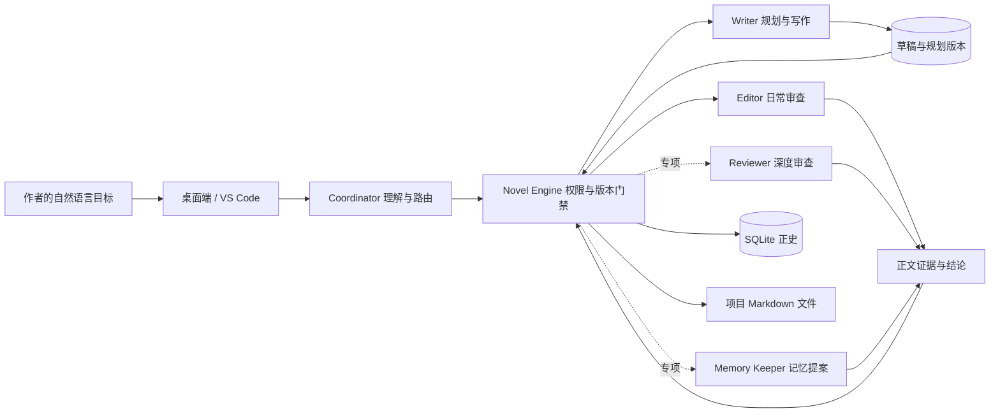

# 墨流 InkFlow

墨流是面向中文长篇小说的 Windows 创作工作台。你可以用自然语言讨论故事、规划篇章、写草稿、审查矛盾和维护正史，也可以把对话、文字或小说正文朗读并保存为本地音频。

**当前版本：0.7.0** · [下载安装包与 VS Code 扩展](https://github.com/littlewinter320/inkflow/releases/latest) · [反馈问题](https://github.com/littlewinter320/inkflow/issues) · [本次更新](CHANGELOG.md)

## 开始使用

1. 从 Releases 下载 `InkFlow-Setup-0.7.0.exe` 并安装。
2. 在“模型设置”中配置写作和审查使用的模型服务；模型下载完成不会自动替你切换各项功能的模型。
3. 创建小说项目，或打开已有项目目录。
4. 在墨宝对话框中用日常中文描述目标，例如“先讨论三个悬疑故事方向”“给第 6 章写草稿，暂不提交正史”。

桌面端和 VS Code 扩展使用同一项目文件。安装包包含引擎与 Edge 朗读组件；使用 Edge 朗读仍需要联网。

## 主要功能

| 场景 | 墨流提供的功能 |
| --- | --- |
| 规划故事 | 全书大纲、卷细纲、近期章节计划和章节卡分别保存，候选规划不会自动变成正史 |
| 写作与修订 | Writer 按当前任务和已接受资料生成草稿，保留版本与来源 |
| 审查与记忆 | 审查给出可定位的正文依据；关键矛盾、权限和版本由 Novel Engine 守门，正史提交可恢复 |
| 长篇协作 | Context Packet 按任务选取设定、前文和检索资料，记录来源与版本 |
| 语音 | 对话朗读、输入文字朗读和小说正文朗读分别选择引擎，音频保存在本地 |
| 工作台 | 查看任务进度、章节版本、批注、模型用量与失败后的续做入口 |

## AI 角色与数据流

墨流的能力池包含 Coordinator、Writer、Editor、Reviewer、Memory Keeper。日常流程使用前三者；专项审查或记忆工作按配置和任务需要启用。Coordinator 负责理解与调度，正文、审查和正史提交仍通过各自的角色与 Novel Engine 权限检查。

```mermaid
flowchart LR
    User[作者的自然语言目标] --> UI[桌面端 / VS Code]
    UI --> Coordinator[Coordinator 理解与路由]
    Coordinator --> Engine[Novel Engine 权限与版本门禁]
    Engine --> Writer[Writer 规划与写作]
    Engine --> Editor[Editor 日常审查]
    Engine -.专项.-> Reviewer[Reviewer 深度审查]
    Engine -.专项.-> Keeper[Memory Keeper 记忆提案]
    Writer --> Draft[(草稿与规划版本)]
    Editor --> Evidence[正文证据与结论]
    Reviewer --> Evidence
    Keeper --> Evidence
    Draft --> Engine
    Evidence --> Engine
    Engine --> Canon[(SQLite 正史)]
    Engine --> Markdown[项目 Markdown 文件]
```

详细角色边界和架构约束见 [架构文档](docs/INKFLOW_ARCHITECTURE_REDESIGN.md)。图中专项角色和数据写入均受当前配置、授权和版本限制。

## 语音与模型设置

安装后，**对话朗读、文本朗读和小说正文朗读默认使用 Edge 在线语音**。墨流将目标文字发送给在线语音服务，把生成的音频保存到本机供播放或下载；它不是离线 TTS，也不要求用户填写独立的付费语音 API Key。网络服务的可用性和条款由服务方决定。

语音输入、对话朗读、文本朗读、小说正文朗读是四个独立设置。语音输入可关闭，或选择浏览器识别及按需安装的本地普通话识别；MOSS 是按需安装的本地朗读选项。下载某个模型或组件只使它可用，实际使用由对应功能的设置决定。旧 Qwen 语音选项已移除，不影响其他模型服务中同名的通用语言模型。

需要朗读时，可以输入文字，也可以从小说项目选取正文。语音任务与独立只读操作可以并发；共享正史写入仍按版本协调。

## 项目与隐私

小说正文、规划、版本、音频和正史数据库保存在用户的项目或本地数据目录。使用云端写作模型时，墨流会发送本次任务所需的上下文；使用 Edge 朗读时，会发送待朗读文本。请在发送敏感内容前确认所选服务。模型密钥不写入小说项目。

## 从源码运行

需要 Python 3.11+、Node.js 和 Windows 桌面环境。引擎位于 `agent/`，桌面端位于 `desktop/`，VS Code 扩展位于 `extension/`。安装依赖后分别使用 `inkflow-app-server` 与桌面端的 `npm run dev` 开发。正式安装包通过 `scripts/build-release.ps1` 生成，发布产物和下载缓存使用 D 盘的 `D:\墨流\release\0.7.0`。

项目许可证见 [LICENSE](LICENSE)，语音依赖声明见 [第三方组件声明](THIRD_PARTY_NOTICES.md)。
