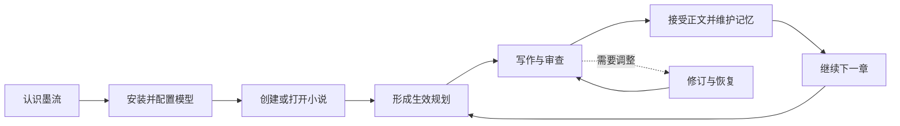
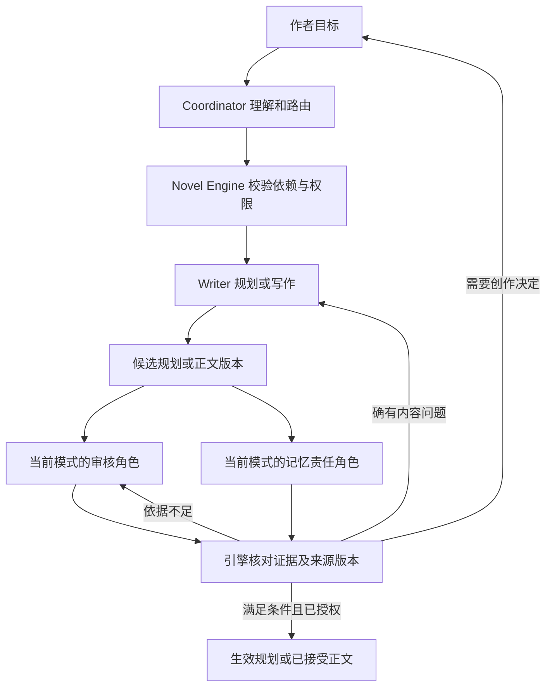
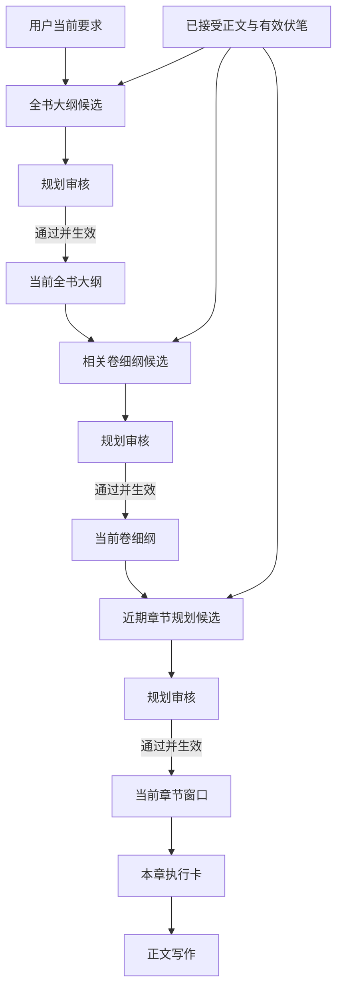
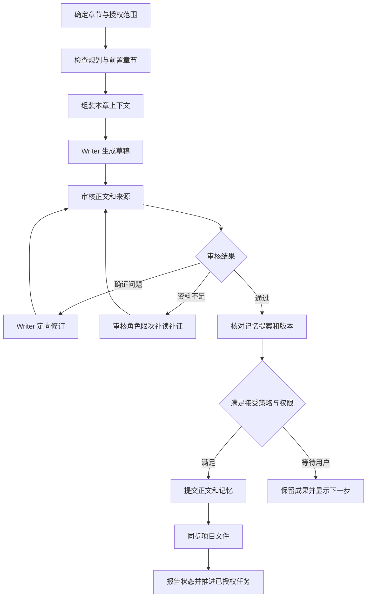
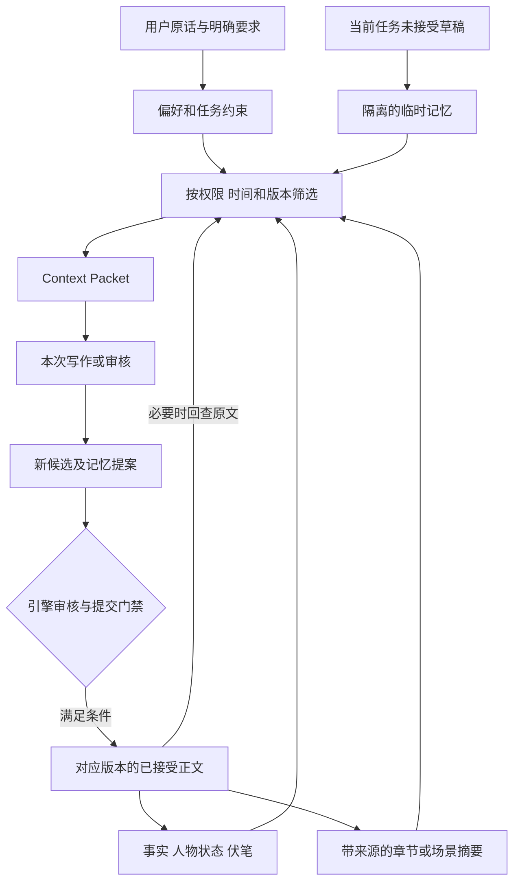
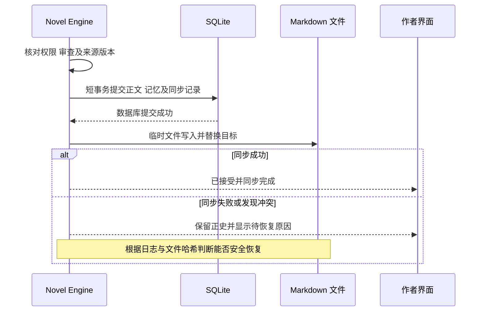
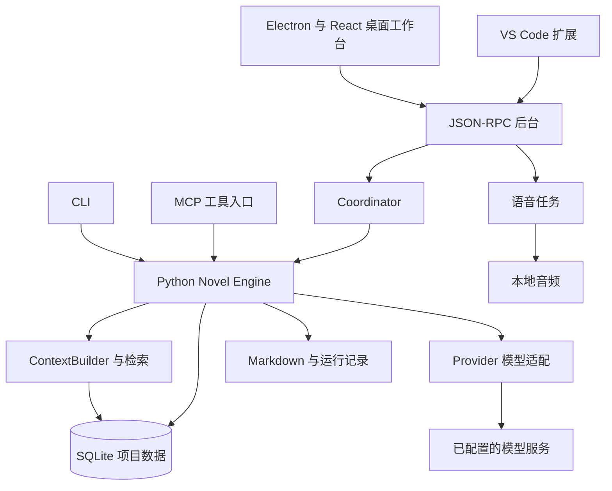

# 墨流 InkFlow

**面向中文长篇小说的 AI 协作创作工作台。**

墨流把故事讨论、分层规划、正文写作、证据审查和记忆维护组织在同一个小说项目中。作者用日常中文表达目标，Coordinator 理解并安排任务，Writer 产出规划或正文，当前模式下的编辑与专项角色提供审查和记忆提案，再由 Novel Engine 核对权限、依赖与版本，决定哪些结果可以进入下一步。

**已发布版本：0.7.0** · [下载安装包与扩展](https://github.com/littlewinter320/inkflow/releases/latest) · [本版更新](CHANGELOG.md) · [反馈问题](https://github.com/littlewinter320/inkflow/issues) · [许可证](LICENSE)

桌面工作台面向 Windows，另有 VS Code 扩展、CLI 和 MCP 入口。小说资料保存在本地，云端模型按任务接收所需上下文。安装包包含创作引擎与 Edge 朗读组件；写作服务需要按所选供应商配置，Edge 朗读需要联网。

> 本文是项目介绍与完整使用指南，解释操作顺序、产物关系和运行规则，并在文末提供现行文档及源码入口。流程图展示主要路径，实际执行受当前授权、配置、任务状态和来源版本约束。

<a id="guide"></a>
## 阅读导航

| 你想了解什么 | 建议从这里开始 | 接下来阅读 |
| --- | --- | --- |
| 墨流是什么，有什么特色 | [项目定位](#overview) | [安装与配置](#quickstart) |
| 先完成一次创作 | [第一次创作](#first-story) | [从草稿到正史](#chapter-flow) |
| 已有正文，想改变后续剧情 | [分层规划](#planning) | [修订与版本](#revision) |
| 各个角色怎样协作 | [五角色与模式](#roles) | [模型与上下文](#models) |
| 如何记住长篇资料 | [记忆关系](#memory) | [项目文件与同步](#data) |
| 为什么审核没有通过 | [审查规则](#review) | [问题与恢复](#recovery) |
| 使用语音或了解数据去向 | [语音功能](#voice) | [隐私与个性化](#privacy) |
| 从源码运行或研究实现 | [开发运行](#development) | [技术追踪与引用](#technical) |


```mermaid
graph LR
    A[认识墨流] --> B[安装并配置模型]
    B --> C[创建或打开小说]
    C --> D[形成生效规划]
    D --> E[写作与审查]
    E --> F[接受正文并维护记忆]
    F --> G[继续下一章]
    G --> D
    E -.需要调整.-> H[修订与恢复]
    H --> E
```

<a id="overview"></a>
## 1. 项目定位与特色

长篇小说写到几十章以后，困难往往来自累积的关系：人物上一章拿走了什么，另一位人物到底知道多少，早期埋下的线索是否仍然有效，作者刚刚改变的方向影响了哪些未来安排。只保存聊天记录，很难把这些问题与某一版正文稳定对应。

墨流围绕一本小说持续组织这些资料。讨论可以保持开放，未来规划可以修改，草稿可以试写；一旦正文被接受，后续创作就需要以它为依据。软件把这些状态分开，并保留来源、审查与版本信息，让作者能够追查“这次为什么这样写”“审核依据是什么”“接下来需要处理哪里”。

它适合希望分阶段推进中文长篇、保留作者决定权，并愿意查看关键审查依据的创作者。初次使用可以从讨论故事方向开始，已有作品可以先整理设定、审查当前章节，或保留已接受正文并重新设计后续剧情。创作效果仍取决于模型能力、上下文质量与要求的清晰程度，文学判断也需要作者参与。

| 能力 | 作者得到什么 | 需要理解的边界 |
| --- | --- | --- |
| 自然语言协作 | 讨论方向、补充条件、指定章节或改变安排 | 讨论、规划和正文生成是不同任务，范围应对应原话 |
| 分层故事规划 | 全书大纲、卷细纲、近期规划与执行卡 | 规划指导未来，已接受正文描述已经发生的内容 |
| 按任务分工 | 写作、编辑、专项审查与记忆维护 | 启用能力池不等于每次调用全部角色 |
| 可追溯审查 | 查看问题对应的原文、来源和理由 | 引文存在不保证语义判断正确，必要时仍需复核 |
| 长篇上下文管理 | 按任务选择设定、前文、事实与伏笔 | 每次输入有预算，不能假定模型每次都读过全书 |
| 正史与草稿隔离 | 试写和候选不会直接成为世界事实 | 接受正文仍需通过权限、版本和必要审查 |
| 版本与恢复 | 查看任务状态、保留结果并续做 | 来源变化后可能需要重新核对 |
| 多入口与语音 | 桌面、扩展、工具入口及朗读音频 | 写作模型、在线语音和本地组件分别配置 |

0.7.0 的用户可见变化集中在角色分工、规划与审查规则、来源核对、失败恢复和语音设置，详见 [CHANGELOG](CHANGELOG.md)。本文介绍当前使用方式，不把路线图目标或条件训练入口列为已经完成的能力。

**下一步：**首次使用进入[安装与配置](#quickstart)；想先理解创作过程，可以直接看[完整章节流程](#chapter-flow)。

<a id="quickstart"></a>
## 2. 安装与首次配置

### 2.1 使用 Windows 安装包

1. 打开 [Releases 下载入口](https://github.com/littlewinter320/inkflow/releases/latest)，选择目标版本的 Windows 安装包；0.7.0 对应 `InkFlow-Setup-0.7.0.exe`。
2. 运行安装程序，选择安装位置并启动墨流。使用安装包无需另外搭建 Python 开发环境。
3. 在模型设置中填写服务连接信息和密钥，核对模型名称。安装软件不会为你创建供应商账号或开通模型额度。
4. 创建小说项目，或打开包含 `.inkflow/project.json` 的已有项目目录。
5. 在墨宝对话框中说明第一件想完成的事，观察任务理解与范围，再沿结果和下一步继续。

下载入口可能指向比本文更新的版本；使用其他版本时，应阅读对应发布说明。同一发布版本内的桌面端、引擎和扩展保持一致，旧项目是否需要升级以软件提示为准。[S1](#source-release)

### 2.2 首次需要核对的设置

| 设置 | 作用 | 如何核对 |
| --- | --- | --- |
| 服务地址 | 决定请求发往哪里 | 使用供应商接口地址，避免填成普通网页地址 |
| 模型与密钥 | 决定模型能力与账号权限 | 检查可用模型、额度和密钥有效性 |
| 协作模式 | 决定参与资格和检查分工 | 先理解日常模式，再按需求启用专项 |
| 章节目标与规划窗口 | 约束任务规模 | 用户指定范围优先，近期规划默认窗口为 10 章 |
| 正文接受方式 | 决定合格结果如何进入正史 | 核对是否允许审核后自动接受；试写时明确暂不提交 |
| 语音与朗读设置 | 分别控制识别和音频生成 | 下载组件后仍需在对应功能中选择 |

仓库默认配置中的模型名称只是软件配置值，是否可调用由供应商账号决定。正在执行的任务保留自己的配置与策略快照，避免中途混用新旧规则。[S2](#source-config)

密钥通过系统凭据库或环境变量提供，不应放进小说正文或版本控制。非敏感设置在 Windows 下默认保存于 `%APPDATA%\InkFlow\settings.json`，也可由 `INKFLOW_SETTINGS_PATH` 指定其他位置。完整数据边界见[隐私说明](#privacy)。

<a id="first-story"></a>
## 3. 从零开始一本小说

作者不需要一开始就填满所有细节。先表达题材、主人公、核心困境与想保留的声音，再通过讨论补齐。有明确不能发生的事情时，直接写出硬要求；只是倾向时，可以使用“希望”“尽量”等表达，帮助软件区分必须遵守的条件和可商量的选择。

> 我想写一部慢热悬疑长篇，主角经营一家修表铺，因一块来历不明的旧表卷入失踪案。先讨论三个主线方向，暂时不要生成正文。主角不能一开始就知道旧表的秘密。

这句话同时交代故事素材、节奏、人物知识边界和本轮任务。讨论结束后，可以选择一个方向继续，不必每轮重新粘贴全部聊天。改变想法时，应指出改变的是人物、主线还是未来章节，便于保留未受影响的成果。

| 阶段 | 自然语言示例 | 主要观察什么 |
| --- | --- | --- |
| 讨论 | “比较三个方向，先别写正文。” | 是否仍在讨论，没有提前批量写作 |
| 大纲 | “按第二个方向形成全书大纲。” | 主线、高潮和大致结局是否符合意图 |
| 卷细纲 | “展开第一卷，安排主角接触线索的因果。” | 行动为何发生，又产生什么后果 |
| 近期规划 | “规划后十章，不要一直靠问话推进。” | 窗口范围正确，整体行动和关系有变化 |
| 草稿 | “写第一章草稿，暂不提交正史。” | 是否引用当前规划，并保留草稿状态 |
| 修订 | “只调整结尾，保留前面的对白。” | 修改范围和当前版本是否对应 |
| 续做 | “从刚才失败的审核节点继续。” | 是否恢复同一任务并核对来源 |

建议沿“创作依据 → 全书大纲 → 相关卷细纲 → 近期规划 → 本章正文”推进。在已授权范围内，每层审核通过后可以由代码继续下一层；需要创作取舍时，软件应保留成果并提出必要问题。示例说明的是表达方式，不保证一次请求就能完成所有步骤。

已有正文时先明确保留范围。例如：“保留前十五章已接受正文和有效伏笔，重做后续主线，先给新大纲。”如果随后规划第十五至二十四章，已接受的第十五章应作为只读衔接锚点，可调整的是第十六至二十四章。过去事实与未来设想的区别，是理解下文[分层规划](#planning)的前提。

<a id="roles"></a>
## 4. 五角色与协作模式

当前能力池包含 Coordinator、Writer、Editor、Reviewer 和 Memory Keeper。它们代表任务职责，不等于五个不同供应商，也不代表一次任务固定调用五次模型。同一模型可以承担不同角色；某一角色也可能因为补读或修订在一个任务中调用多次。

| 角色 | 主要职责 | 输入与输出 | 权限边界 |
| --- | --- | --- | --- |
| Coordinator | 理解原话、路由任务、解释调整 | 目标与状态 → 调度提案或答复 | 不代写正文、不代审放行、不直接提交记忆 |
| Writer | 规划、正文和定向修订 | 任务与上下文 → 规划候选或草稿 | 不自行批准正文或更改审查标准 |
| Editor | 日常综合编辑及相应记忆工作 | 正文与依据 → 结论、证据、记忆提案 | 按模式负责检查，不越过引擎提交 |
| Reviewer | 逻辑连续性等专项审查 | 指定范围与原文 → 专项结论 | 与 Editor 分工，普通风格差异不直接作为硬冲突 |
| Memory Keeper | 事实、状态、伏笔与记忆核对 | 正文与既有记忆 → 有来源的变更提案 | 提出变更，正史提交由引擎执行 |

| 模式 | 可参与角色 | 检查归属 |
| --- | --- | --- |
| 日常 `everyday` | Coordinator、Writer、Editor | Editor 综合检查和记忆工作 |
| 审查加强 `review_boost` | 日常角色加 Reviewer | Reviewer 检查逻辑连续性，Editor 保留综合与记忆职责 |
| 记忆加强 `memory_boost` | 日常角色加 Memory Keeper | Editor 综合检查，Memory Keeper 核对记忆 |
| 深度 `deep` | Coordinator、Writer、Reviewer、Memory Keeper | Reviewer 主审，Memory Keeper 核对记忆，Editor 不运行 |
| 全专项 `full_specialist` | 五角色 | Editor 表达，Reviewer 逻辑连续性，Memory Keeper 记忆 |

模式表描述参与资格，具体任务仍按需要调用。用户禁止额外调用时，不得擅自升级。旧协议中名为 `reviewer` 的角色承担综合 Editor 工作，因此查看历史日志需要同时看协议版本。[S3](#source-roles)


```mermaid
flowchart TD
    U[作者目标] --> C[Coordinator 理解和路由]
    C --> E[Novel Engine 校验依赖与权限]
    E --> W[Writer 规划或写作]
    W --> D[候选规划或正文版本]
    D --> R[当前模式的审核角色]
    D --> M[当前模式的记忆责任角色]
    R --> V[引擎核对证据及来源版本]
    M --> V
    V -->|满足条件且已授权| S[生效规划或已接受正文]
    V -->|确有内容问题| W
    V -->|依据不足| R
    V -->|需要创作决定| U
```

日常模式中审核与记忆职责都可以由 Editor 承担，图中分支不表示任何任务都必须并行。接下来沿[规划流程](#planning)理解 Writer 的产物，再沿[审查规则](#review)理解验收方式。

<a id="planning"></a>
## 5. 大纲、卷细纲、近期规划与执行卡

规划逐步把创作目标变成可执行安排。全书方向需要完整，近期章节需要具体，两者的细节尺度不同。墨流分别保存和审查这些产物，避免一份文档同时承担全书构想与每章动作清单。

| 产物 | 回答的问题 | 核心内容 | 下游用途 |
| --- | --- | --- | --- |
| 全书大纲 | 这本书围绕什么展开，走向哪里 | 背景、主线、主要场景、高潮、大致结局 | 提供卷级设计方向 |
| 卷细纲 | 本卷怎样推进主线 | 冲突、支线、人物变化、伏笔与粗粒度章节走向 | 支持对应卷的近期规划 |
| 近期章节规划 | 接下来一段章节具体发生什么 | 逐章场景、行动、阻力、选择、后果和收尾 | 形成当前窗口和执行依据 |
| 本章执行卡 | 本章写作需要落实什么 | 场景顺序、篇幅目标、核心结果和必要状态 | 进入本章上下文 |

近期规划默认连续 10 章，可通过设置调整，作者明确范围优先。生效规划是未来的创作假设，写作中可以有因果地调整；已接受正文是已经发生的事实，不能为了贴合旧计划改写过去。


```mermaid
graph TD
    U[用户当前要求] --> O[全书大纲候选]
    C[已接受正文与有效伏笔] --> O
    O --> OR[规划审核]
    OR -->|通过并生效| OA[当前全书大纲]
    OA --> V[相关卷细纲候选]
    C --> V
    V --> VR[规划审核]
    VR -->|通过并生效| VA[当前卷细纲]
    VA --> P[近期章节规划候选]
    C --> P
    P --> PR[规划审核]
    PR -->|通过并生效| PA[当前章节窗口]
    PA --> K[本章执行卡]
    K --> W[正文写作]
```

### 5.1 候选为什么不能直接生效

一份新大纲即使已经显示，也可能仍是候选。只有完成必要审核并核对来源版本，才可以成为后续依据。如果生成期间设定或正史发生变化，原候选引用的来源可能过期，需要从受影响处重新核对。

规划审核主要检查正史衔接、主线方向、卷级因果和用户要求。合理留白、尚未决定的细节、未到期的伏笔，不应单独导致整份重写。自动通过仍需要当前审核角色的有效结论、达到要求的把握度和可定位依据；通过规划审核不替代正文审核。[S4](#source-planning)

### 5.2 改变方向怎样保护已有成果

改变全书方向可能影响未来卷和窗口；改变一卷细纲主要影响对应卷的规划；调整一章应保留未受影响章节。作者可以直接说“只改后五章，前面保留”。反馈“刚才这版”默认针对当前生效内容，不等于恢复旧候选。明确续做时，还需检查原任务和当前来源是否一致。

<a id="chapter-flow"></a>
## 6. 从草稿到正史

本章生成前，引擎确认规划、设定和前文是否足以支持任务，再组装 Writer 所需资料。Writer 的结果首先形成草稿版本；审核角色阅读本章及依据，记忆责任角色提出与该版正文一致的变更。满足审查、权限、来源和接受策略后，引擎才提交正史。


```mermaid
flowchart TD
    A[确定章节与授权范围] --> B[检查规划与前置章节]
    B --> C[组装本章上下文]
    C --> D[Writer 生成草稿]
    D --> E[审核正文和来源]
    E --> F{审核结果}
    F -->|确证问题| G[Writer 定向修订]
    G --> E
    F -->|资料不足| H[审核角色限次补读补证]
    H --> E
    F -->|通过| I[核对记忆提案和版本]
    I --> J{满足接受策略与权限}
    J -->|满足| K[提交正文和记忆]
    J -->|等待用户| L[保留成果并显示下一步]
    K --> M[同步项目文件]
    M --> N[报告状态并推进已授权任务]
```

**草稿生成、审核通过、正史接受是三个状态。** 当前配置支持审核后自动接受，也有需要确认的处理方式，以实际设置和本轮授权为准。只想尝试一种声音时，应明确“先试写，暂不提交”。

多章任务中，临时衔接与正式依赖也要区分。候选章节可以携带受范围限制的临时资料，但不能跳过必要审查，把尚有硬问题的内容当成可靠基础。发生问题应暂停受影响依赖链，保留成果并说明恢复条件。实际编排见 [engine.py](agent/src/inkflow/engine.py)，产物定义见 [schemas.py](agent/src/inkflow/schemas.py)。[S5](#source-engine)

<a id="review"></a>
## 7. 审查结论、证据与评分

审核首先要读对资料。当前正文应分别对照生效大纲、卷细纲、近期规划和相关前章。旧章节卡、失效摘要不能替代当前依据。判断无法定位到原文时，先处理审核资料问题，不让 Writer 按未经证实的指控改小说。

| 结果 | 含义 | 下一步 |
| --- | --- | --- |
| 通过 | 必要检查完成，证据支持结论 | 核对版本、记忆和接受条件 |
| 需修订 | 存在可定位且影响任务的问题 | 说明证据及最小修改范围 |
| 依据不足 | 漏读、来源缺失、引文无法定位 | 当前审核角色限次补读或补证，保留正文 |
| 来源变化 | 正文、规划或设定已不是受审版本 | 重新核对受影响内容 |

正文与篇章复审使用 `evidence-rubric-v1`。正史连续性、关键因果、当前硬要求／核心结果是必要门禁；人物动机、剧情推进、阅读连贯按 40／35／25 加权。各项应提供原文、理由和另一种合理解读，避免把第一种理解直接当作唯一答案。[S6](#source-review)

| 检查项 | 关注的问题 | 影响 |
| --- | --- | --- |
| 正史连续性 | 人物、物件、知识与时间是否冲突 | 确证关键矛盾不能由高分抵消 |
| 关键因果 | 行动、选择和结果是否成立 | 缺失关键因果须定向处理 |
| 当前硬要求 | 明确要求是否覆盖，核心结果是否实现 | 不能被整体文笔评价掩盖 |
| 人物动机，40% | 人物为何此时这样行动 | 进入证据化质量评价 |
| 剧情推进，35% | 行动是否改变局面或关系 | 进入证据化质量评价 |
| 阅读连贯，25% | 视角、衔接与表达是否便于理解 | 进入证据化质量评价 |

界面百分比是规则符合度或审查把握度的产品口径，并非统计校准的“小说正确概率”。默认自动通过底线为 80%，用户可调高；分数高也不能覆盖硬矛盾。资料不足时的 0% 未完成评定，不等于文学质量为零。

人物说谎、叙述留白、线索以后揭开，都可能是合理安排。例如人物昨天藏信、今天交信，两件事本身可以共存；是否缺失关键行动需要结合原文判断。反之，人物毫无来源却准确知道秘密，就需要定位前后依据。作者应能查看引用和复核理由，再决定是否接受处理结果。

<a id="revision"></a>
## 8. 修订与版本保护

修订时最好同时说明目标和保留范围，例如“保留前半章对白，只改结尾的发现过程”。Writer 应围绕确证问题或用户要求定向修改。修改后的正文是新的受审对象，旧通过结论需要检查是否仍然有效。

已接受正文可能贡献人物事实、伏笔状态、摘要和后续审查依据。局部修补须保留旧版并显示改动和复核依据；尚未与新正文核对的派生资料应标为待核。用户可以保留当前版，也可以拒绝修订并写明原因，用户决定单独记录，不冒充模型审查结论。

| 修改对象 | 需要保留或重新核对的内容 |
| --- | --- |
| 未接受草稿 | 旧稿、任务目标、修订范围和新审查依据 |
| 生效规划 | 来源版本、受影响未来窗口和新生效状态 |
| 已接受正文 | 旧版正文、记忆依赖和后续检查 |
| 外部编辑的 Markdown | 用户修改、文件哈希与数据库记录差异 |

失效与可删除也应分开。旧候选可能仍被历史记录引用，或者承担恢复依赖。实际清理前需要列明对象和影响，优先保留可恢复路径。相关数据关系继续看[记忆](#memory)与[文件同步](#data)。

<a id="memory"></a>
## 9. 记忆与资料的逻辑关系

记忆首先要回答：这条信息有没有资格影响当前创作，以及它在当前章节时点是否成立。检索到相似句子还不够，系统需要知道它来自哪个版本，是世界事实还是人物信念，是否已经被接受。

### 9.1 三个权限范围

| 范围 | 内容举例 | 使用方式 |
| --- | --- | --- |
| 已接受正史 | 已发生事件、人物状态、关系和有效伏笔 | 作为后续创作与审查的事实依据 |
| 任务临时记忆 | 候选摘要、未接受章节的状态提案 | 只在对应任务、分支与版本范围辅助衔接 |
| 用户偏好 | 叙述声音、节奏倾向和表达习惯 | 指导写法，明确硬要求另行遵守 |

这三个权限范围与“原文—结构化记录—摘要”的组织层次是不同维度。原文、事实、摘要可以属于不同权限范围；摘要不会因为更短、更容易检索，就获得高于正文的权威。

### 9.2 如何理解三层资料组织

为了沿数据流阅读，可以从三层理解：第一层保留原始依据，第二层组织事实、线索和摘要，第三层按任务筛选资料并编译成模型可见的上下文。这里的三层是阅读模型，不表示已经独立部署三套记忆服务；实现由数据库、检索器和 ContextBuilder 配合完成。


```mermaid
graph TD
    U[用户原话与明确要求] --> P[偏好和任务约束]
    A[对应版本的已接受正文] --> F[事实 人物状态 伏笔]
    A --> S[带来源的章节或场景摘要]
    D[当前任务未接受草稿] --> T[隔离的临时记忆]
    F --> R[按权限 时间和版本筛选]
    S --> R
    P --> R
    T --> R
    A -->|必要时回查原文| R
    R --> C[Context Packet]
    C --> W[本次写作或审核]
    W --> N[新候选及记忆提案]
    N --> G{引擎审核与提交门禁}
    G -->|满足条件| A
```

### 9.3 为什么按章节时点读取

第二十章揭晓了凶手身份，回查第八章时，不能让人物自动拥有第二十章才得到的知识。后来结清的伏笔，在复核早期章节时也可能仍然未结。数据库提供按章节边界读取事实与重放线索的路径，用于恢复当时的状态。[S7](#source-memory)

已接受正文改变后，旧摘要和记忆提案若尚未绑定新版本，就需要隔离或重新核对。有原文依据的有效事实仍可使用，来源失效的派生结论则不能无限延续。由此可以追踪一条依赖链：正文版本变化，影响相关记忆，再影响检索与后续审查。

<a id="models"></a>
## 10. 模型调用、上下文与成本

一次用户任务可能包含多次模型请求。Coordinator 理解目标后，普通流程节点由代码推进；Writer 写作、Editor 审核以及必要的补读修订分别产生调用。界面显示一个任务，不表示后台只调用一次，也不表示每一步都要重新请 Coordinator 决策。

| 环节 | 负责的内容 | 与下游的关系 |
| --- | --- | --- |
| 配置与任务快照 | 服务、模型、角色参数、模式和限制 | 固定本次执行规则 |
| ContextBuilder | 组织要求、规划、正史、前文与检索结果 | 形成实际发给模型的上下文 |
| Provider | 请求服务、解析返回、处理限流和可恢复错误 | 将输出交给结构校验与业务判断 |
| Novel Engine | 核对产物、证据、授权和依赖 | 决定续做、修订或提交 |
| 任务与用量记录 | 保存调用、Token、事件和结果 | 支持费用观察和故障定位 |

### 10.1 模型究竟读到什么

上下文包可能包含设定、当前规划、执行卡、近期完整正文、事实、未结线索、偏好和相关检索片段。写作、审核与修订关注不同内容，不应假定输入完全一致。软预算影响可压缩资料篇幅，硬要求和必要依据则需要保护。[S8](#source-context)

检索器包含精确匹配、词项检索和关系扩展；语义检索与重排由对应模型配置决定。未配置向量模型不等于没有检索，也不能因为仓库存在可选依赖，就认定每个安装环境已经启用它。来源和版本信息使作者能够追查资料为何进入上下文。

### 10.2 怎样判断速度和费用

比较性能需要同时看原始输入、缓存命中输入、输出 Token、调用次数、耗时和合格产物。一份草稿生成很快，后续却反复修订，总成本可能更高；省略必要审查也不等于以更低成本完成同等任务。

墨流提供稳定输入组织、用量统计和并发限制，但缓存命中取决于供应商及实际输入。单次波动不足以证明优化有效，配置价格形成的估算也需要与实际账单区分。相关方法见 [DeepSeek 缓存专题](docs/INKFLOW_COMPLETE_ANALYSIS.md#inkflow-34)，调用实现见 [Provider 与用量记录](#source-provider)。

独立请求可以并发，实际数量受供应商限制和软件配置约束。共享正史提交及同章依赖需要版本协调；远端生成期间原则上不占用项目写锁，结果返回后仍需核对来源有效才能写回。

<a id="data"></a>
## 11. 项目文件与正史同步

小说项目既有供作者阅读的 Markdown，也有保存状态和历史的内部数据。下面是典型结构，部分规划文件和目录在执行相应任务后才产生，新建项目不一定已经拥有全部内容。

```text
小说项目/
├─ BOOK.md                 创作基础资料
├─ PLAN.md                 规划汇总或兼容入口
├─ OUTLINE.md              当前全书大纲
├─ STORY_DETAIL.md         卷细纲的可读呈现
├─ RECENT_PLAN.md           当前近期章节规划
├─ STATE.md                正史状态的可读呈现
├─ chapters/               章节正文与草稿
├─ reviews/                审查相关文件
└─ .inkflow/
   ├─ project.json         项目标识与基础配置
   ├─ inkflow.db           项目数据库
   ├─ runs/                执行相关记录
   ├─ cache/               可重建缓存
   ├─ index/               索引相关资料
   ├─ references/          参考材料与派生特征
   ├─ checkpoints/         安全检查点
   └─ trash/               可恢复回收区域
```

已具备正史正文数据库结构的项目，由 SQLite 保存可恢复的权威正文版本及相关记录，Markdown 作为可阅读、可同步的呈现。旧项目若需数据升级，软件会提示；升级以前不能假定其已经具备新结构下的全部恢复能力。[S9](#source-project)


```mermaid
sequenceDiagram
    participant E as Novel Engine
    participant DB as SQLite
    participant F as Markdown 文件
    participant U as 作者界面
    E->>E: 核对权限 审查及来源版本
    E->>DB: 短事务提交正文 记忆及同步记录
    DB-->>E: 数据库提交成功
    E->>F: 临时文件写入并替换目标
    alt 同步成功
        E-->>U: 已接受并同步完成
    else 同步失败或发现冲突
        E-->>U: 保留正史并显示待恢复原因
        Note over E,F: 根据日志与文件哈希判断能否安全恢复
    end
```

数据库事务不能同时保证 Markdown 文件提交的原子性，所以“已接受但同步待恢复”与“完整完成”要分开显示。恢复应按提交记录和文件状态补齐，避免重新调用 Writer 生成同一章，也不能覆盖同步失败后作者手工修改的内容。

备份时需要保存完整项目，尤其是 `.inkflow` 的数据库与恢复资料。只复制正文文件可以得到可阅读文本，但不能完整保留任务、审核与版本关系。移动或备份前，先等待当前共享写入结束。

<a id="voice"></a>
## 12. 语音输入与朗读

语音识别负责把声音变成文字，朗读负责把文字变成音频。选择朗读模型不会改变写作模型，也不会自动打开麦克风。对话、普通文本和小说正文的朗读选项分别保存。

| 功能 | 输入与结果 | 使用说明 |
| --- | --- | --- |
| 语音输入 | 麦克风声音 → 文字 | 可关闭，或选浏览器识别及按需安装的本地普通话识别 |
| 对话朗读 | 对话文本 → 音频 | 默认引擎选项为 Edge，自动朗读另有开关 |
| 文本朗读 | 输入文字 → 音频 | 单独选择引擎，结果保存在本地 |
| 小说朗读 | 项目正文 → 音频 | 单独配置，使用前核对章节和范围 |

安装包包含 Edge 在线文字转语音组件，不要求填写独立的付费语音 API Key；它仍需联网，并把待朗读文字发送到在线服务。网络和服务状态会影响结果，不能将它理解为离线功能。

MOSS 本地朗读与本地普通话识别是按需安装选项。下载完成只表示可用，还需在具体功能中选择。新增模型、依赖和下载缓存使用 D 盘专用目录，安装前核对路径、空间和硬件条件。语音任务可与独立只读操作并发，但不改变正文提交规则。相关实现见 [VoiceCenter](desktop/src/VoiceCenter.tsx) 与 [voice.py](agent/src/inkflow/voice.py)。

<a id="privacy"></a>
## 13. 隐私与个性化边界

正文、规划、版本、项目数据库和音频保存在项目或本地数据目录。调用云端写作时，任务所需资料会发送给模型供应商；使用 Edge 时，待朗读文字进入在线语音服务。本地保存与联网处理可以同时存在，需要按具体功能理解。

| 数据或操作 | 边界 |
| --- | --- |
| 小说正文与规划 | 保存在本地，相关片段可能进入云端上下文 |
| 模型密钥 | 使用系统凭据或环境变量，不写入小说项目 |
| 全局非敏感设置 | 默认保存在用户设置目录，可指定其他路径 |
| 在线语音 | 发送目标文字，生成音频保存在本地 |
| 可选本地模型 | 按需安装并选择，不会自动替代全部功能 |
| 调用轨迹 | 可能包含正文与任务信息，分享前应脱敏 |

作者样稿与 Humanizer 小说适配提供表达引导，当前用户要求和本书声音优先。它们不会把样稿剧情搬入正史，也不等于修改远端模型权重。规则详见[作者文风说明](docs/INKFLOW_COMPLETE_ANALYSIS.md#inkflow-36)。

**素材整理、提示词学习和参数训练是不同工作。** 当前仓库包含素材处理与条件训练入口，但参数训练及其产物接入实际 Writer 尚未完成。独立 Qwen 本地写作试验已取消，不属于默认安装步骤。训练前必须确认目标模型可训练、产物可部署、实际 Writer 能调用；状态见 [Writer 训练流程](docs/INKFLOW_COMPLETE_ANALYSIS.md#inkflow-36)。

<a id="recovery"></a>
## 14. 状态、恢复与常见问题

查看结果时，先看已经产生哪些文件和版本，再看状态、原因与下一步。聊天中的“完成”不能代替实际写入和正史提交。暂停也不一定意味着全盘失败：可能只是执行预算片段结束、来源变化或需要作者决定。

| 现象 | 优先核对 | 下一步 |
| --- | --- | --- |
| 软件能打开，模型没结果 | 地址、名称、密钥、额度和网络错误 | 按具体错误修正，再续做 |
| 停在审核，正文看起来正常 | 缺来源、漏读或引文未定位 | 先补审核依据，不立即重写 |
| 评定为 0% | 是否审核资料错误或未完成 | 区分审核状态与文学评价 |
| 新规划没用于写作 | 候选是否审核生效、来源是否变化 | 查看当前生效版本 |
| 继续后范围不对 | 是否恢复同一任务与当前版本 | 明确失败节点和章节范围 |
| 正文已接受但同步未完成 | 待同步记录或外部改稿冲突 | 使用恢复入口，避免覆盖文件 |
| 下载模型后仍使用 Edge | 对应朗读功能的实际选择 | 选择已安装的目标引擎 |
| Edge 无法朗读 | 网络、服务错误和目标文字 | 按错误重试或使用已配置的其他引擎 |
| 请求互相等待 | 同章依赖、共享提交或并发限额 | 区分必要协调与独立任务误阻塞 |
| 旧项目提示升级 | 是否缺少当前正文恢复结构 | 保留完整备份，按明确升级流程处理 |

创作方向分歧与技术错误要分别处理。前者可以说“保留设定，只改行动理由”；后者需要记录失败节点和错误信息。检查点帮助保留位置，但恢复前仍须核对正史、规划和范围，不能把过期结果直接覆盖到当前状态。[S10](#source-runtime)

<a id="development"></a>
## 15. 从源码运行

以下是 Windows 开发路径，适合研究或修改项目。普通作者使用安装包即可。开发启动后，实际模型调用仍使用自己的服务配置与额度。

### 15.1 环境要求

| 环境 | 要求与依据 |
| --- | --- |
| Windows 与 PowerShell | 桌面开发及发布脚本面向 Windows |
| Python | 引擎声明 Python 3.11 或以上 |
| Node.js | 满足当前依赖要求；本次安装的 Vite 要求 `^20.19.0` 或 `>=22.12.0`，以实际依赖声明为准 |
| pip 与 npm | 引擎和前端分别安装，已有锁文件时按锁文件安装 |
| 路径 | 新环境、模型、发布产物及下载缓存使用 D 盘专用目录 |
| 模型服务 | 在软件设置中配置，不把密钥写入 Git |

### 15.2 准备引擎和缓存

在仓库根目录打开 PowerShell。下列命令复用已有仓库 `.venv`；不存在时，在 D 盘创建开发环境。源码继续保留原位置，可选语音、检索或训练依赖不需要为了启动基本界面全部安装。

```powershell
$inkflowRepo = (Get-Location).Path
$inkflowDev = 'D:\墨流\development'
$inkflowCache = Join-Path $inkflowDev 'cache'
New-Item -ItemType Directory -Force -Path $inkflowCache | Out-Null
$env:PIP_CACHE_DIR = Join-Path $inkflowCache 'pip'
$env:npm_config_cache = Join-Path $inkflowCache 'npm'
$env:ELECTRON_CACHE = Join-Path $inkflowCache 'electron'
$env:ELECTRON_BUILDER_CACHE = Join-Path $inkflowCache 'electron-builder'
$env:TEMP = Join-Path $inkflowDev 'temp'
$env:TMP = $env:TEMP
New-Item -ItemType Directory -Force -Path $env:TEMP | Out-Null

$inkflowExisting = Join-Path $inkflowRepo '.venv\Scripts\python.exe'
if (Test-Path -LiteralPath $inkflowExisting) {
    $inkflowPython = $inkflowExisting
} else {
    $inkflowVenv = Join-Path $inkflowDev 'venv'
    if (-not (Test-Path -LiteralPath (Join-Path $inkflowVenv 'Scripts\python.exe'))) {
        python -m venv $inkflowVenv
        if ($LASTEXITCODE -ne 0) { throw 'Python 环境创建失败，请检查版本与路径。' }
    }
    $inkflowPython = Join-Path $inkflowVenv 'Scripts\python.exe'
}
& $inkflowPython -m pip install -e (Join-Path $inkflowRepo 'agent')
if ($LASTEXITCODE -ne 0) { throw '引擎依赖安装失败，请处理错误后继续。' }
$env:Path = "$(Split-Path -Parent $inkflowPython);$env:Path"
```

这些变量作用于当前终端及子进程，新终端需重新设置。开发启动器优先查找仓库 `.venv`，没有时用 `PATH` 中的 Python，所以应在准备好的同一终端启动桌面端。不要为执行示例删除或搬动已有环境。

### 15.3 启动桌面端

```powershell
Set-Location (Join-Path $inkflowRepo 'desktop')
npm ci
if ($LASTEXITCODE -ne 0) { throw '桌面依赖安装失败，请处理错误后继续。' }
npm run dev
```

该命令启动 Vite、Electron 的 TypeScript 监听编译和桌面窗口。Electron 自行启动 `python -m inkflow.app_server`，通过标准输入输出交换 JSON-RPC 消息，正常开发无需再手动打开重复后端。安装版启动随包提供的 `inkflow-engine.exe`。[S11](#source-desktop)

Vite 默认地址为 `http://localhost:5173`，仅提供前端开发页面；完整功能依赖 Electron 桥接和后台，浏览器能打开页面不等于桌面工作台已完整运行。

### 15.4 CLI、MCP 与 VS Code

| 入口 | 用途 |
| --- | --- |
| `inkflow` | 创建、查看项目与开发诊断，使用 `inkflow --help` 查看实际命令 |
| `inkflow-app-server` | 桌面和扩展使用的 JSON-RPC 后台 |
| `inkflow-mcp` | 向支持 MCP 的宿主提供小说工具 |
| VS Code 扩展 | 创作主控、小说树、审查、选段修订与项目操作 |

入口声明见 [pyproject.toml](agent/pyproject.toml)，MCP 定义见 [mcp_server.py](agent/src/inkflow/mcp_server.py)。工具调用仍经过同一核心引擎，不能绕过正史门禁；真实用户体验应从可见界面观察，不能由内部命令替代。

VS Code 扩展要求 1.100.0 或以上版本，可通过 `inkflow.enginePath` 或 `inkflow.pythonPath` 指定引擎。开发扩展时，在继承上述缓存设置的终端进入 `extension/`，执行 `npm ci` 和 `npm run build`。支持的入口和设置见[扩展配置](extension/package.json)。

### 15.5 构建安装包

从仓库根目录运行 `scripts/build-release.ps1`，同时打包扩展时加 `-IncludeExtension`。脚本会安装构建依赖、核对组件版本并将产物写入 D 盘当前源码版本的专用目录。这是发布准备步骤，不是日常启动步骤。

`-Publish` 会进入外部发布流程，只在明确需要发布时使用。正式发布要求标签、桌面、引擎、扩展和安装包版本一致。构建成功证明产物已生成，不替代真实创作流程与模型效果验证。[S1](#source-release)

<a id="technical"></a>
## 16. 技术概览与引用追踪

下图帮助定位问题所属层次。界面负责呈现与交互，桥接层连接客户端和后台，Python 引擎组织创作流程，Provider 负责实际模型请求，SQLite 和项目文件保留结果与依据。详细函数和状态机拆解请沿后面的独立文档入口阅读。


```mermaid
graph TD
    UI[Electron 与 React 桌面工作台] --> RPC[JSON-RPC 后台]
    VS[VS Code 扩展] --> RPC
    CLI[CLI] --> ENG[Python Novel Engine]
    MCP[MCP 工具入口] --> ENG
    RPC --> CO[Coordinator]
    CO --> ENG
    ENG --> CTX[ContextBuilder 与检索]
    CTX --> DB[(SQLite 项目数据)]
    ENG --> PR[Provider 模型适配]
    PR --> LLM[已配置的模型服务]
    ENG --> DB
    ENG --> FILE[Markdown 与运行记录]
    RPC --> VOICE[语音任务]
    VOICE --> AUDIO[本地音频]
```

### 16.1 从问题追踪到源码

| 问题 | 第一个入口 | 下一层依据 |
| --- | --- | --- |
| 用户的话为什么被分到这个任务 | [coordinator.py](agent/src/inkflow/coordinator.py) | [engine.py](agent/src/inkflow/engine.py)、[任务设置](agent/src/inkflow/task_settings.py) |
| 为什么某角色参与或没参与 | [role_protocol.py](agent/src/inkflow/role_protocol.py) | [provider.py](agent/src/inkflow/provider.py) 的角色检查 |
| 新规划为什么没有生效 | [planning_pipeline.py](agent/src/inkflow/planning_pipeline.py) | [schemas.py](agent/src/inkflow/schemas.py) 与来源记录 |
| Writer 到底读到什么 | [context.py](agent/src/inkflow/context.py) | [retrieval.py](agent/src/inkflow/retrieval.py)、[prompts.py](agent/src/inkflow/prompts.py) |
| 审核为什么扣分或暂停 | [review_rubric.py](agent/src/inkflow/review_rubric.py) | [review_verifier.py](agent/src/inkflow/review_verifier.py) 与引擎复核路径 |
| 某条事实为什么有效 | [database.py](agent/src/inkflow/database.py) | 正文版本、记忆提案、事实有效区间和章节边界 |
| 正史为何没同步到文件 | [project.py](agent/src/inkflow/project.py) | 数据库记录、同步状态与文件哈希 |
| 为什么耗时或调用变多 | [model_usage.py](agent/src/inkflow/model_usage.py) | [runtime.py](agent/src/inkflow/runtime.py)、[trace.py](agent/src/inkflow/trace.py) |
| 窗口正常但后台没启动 | [Electron 主进程](desktop/electron/main.ts) | [app_server.py](agent/src/inkflow/app_server.py)、Python 路径及日志 |

完整追踪应保留五个关联点：**用户原话 → 实际任务范围 → 角色输入输出 → 文件与版本 → 界面状态**。这样可以区分路由错误、资料漏读、结论失效与文件同步故障，避免只处理最后显示错误的地方。

### 16.2 完整分析阅读路径

| 文档 | 继续了解什么 | 与本文的关系 |
| --- | --- | --- |
| [完整项目分析](docs/INKFLOW_COMPLETE_ANALYSIS.md) | 项目结构、角色工作流、规划、记忆、检索、训练边界与源码依据 | 按对应章节定位实现与后续修改入口 |
| [本版更新](CHANGELOG.md) | 0.7.0 用户可见变更 | 核对当前发布变化 |

这里只链接已经存在的资料，不把待撰写的独立拆解列为完成文档。阅读历史配置和计划章节时，应结合现行协议、源码与实现状态；路线图中的目标不等于已经运行的能力。

<a id="sources"></a>
## 17. 本文依据与核对范围

运行命令、角色模式、配置与数据边界以当前仓库为依据。下表提供从说明返回实现的入口。源码能够证明实现路径存在，但不能单独证明所有模型、网络条件或旧项目中的实际效果；这类结论需要对应任务记录。

| 引用 | 直接依据 | 支持的说明 |
| --- | --- | --- |
| <a id="source-release"></a>S1 | [发布脚本](scripts/build-release.ps1)、[桌面配置](desktop/package.json)、[扩展配置](extension/package.json) | 版本、构建入口、安装产物与发布目录 |
| <a id="source-config"></a>S2 | [config.py](agent/src/inkflow/config.py)、[task_settings.py](agent/src/inkflow/task_settings.py) | 配置、密钥、默认窗口与任务快照 |
| <a id="source-roles"></a>S3 | [role_protocol.py](agent/src/inkflow/role_protocol.py) | 五角色、模式、检查归属与协议兼容 |
| <a id="source-planning"></a>S4 | [planning_pipeline.py](agent/src/inkflow/planning_pipeline.py)、[schemas.py](agent/src/inkflow/schemas.py) | 分层规划、审核、生效与来源绑定 |
| <a id="source-engine"></a>S5 | [engine.py](agent/src/inkflow/engine.py)、[coordinator.py](agent/src/inkflow/coordinator.py) | 请求路由、创作编排、门禁和修订 |
| <a id="source-review"></a>S6 | [review_rubric.py](agent/src/inkflow/review_rubric.py)、[review_verifier.py](agent/src/inkflow/review_verifier.py) | 证据量表、权重及引文核对 |
| <a id="source-memory"></a>S7 | [database.py](agent/src/inkflow/database.py)、[架构说明](docs/INKFLOW_COMPLETE_ANALYSIS.md) | 正史、临时记忆、偏好与历史状态 |
| <a id="source-context"></a>S8 | [context.py](agent/src/inkflow/context.py)、[retrieval.py](agent/src/inkflow/retrieval.py) | 上下文组织、检索与来源追踪 |
| <a id="source-project"></a>S9 | [project.py](agent/src/inkflow/project.py)、[database.py](agent/src/inkflow/database.py) | 项目目录、权威正文、恢复与同步 |
| <a id="source-runtime"></a>S10 | [runtime.py](agent/src/inkflow/runtime.py)、[checkpoints.py](agent/src/inkflow/checkpoints.py)、[project_lock.py](agent/src/inkflow/project_lock.py) | 预算、检查点和共享写入协调 |
| <a id="source-desktop"></a>S11 | [Electron 主进程](desktop/electron/main.ts)、[app_server.py](agent/src/inkflow/app_server.py) | 后台启动、JSON-RPC 与安装版路径 |
| <a id="source-provider"></a>S12 | [provider.py](agent/src/inkflow/provider.py)、[model_usage.py](agent/src/inkflow/model_usage.py) | 模型请求、限制、错误处理及用量口径 |

<a id="contributing"></a>
## 18. 反馈、参与和许可

问题反馈请使用 [GitHub Issues](https://github.com/littlewinter320/inkflow/issues)，提供软件版本、使用入口、脱敏后的用户原话、章节范围、失败节点，以及期望和实际结果。如果涉及正文判断，提供足以说明问题的相关片段与版本信息；不要提交密钥或未经检查的完整调用日志。

参与开发前请阅读 [AGENTS.md](AGENTS.md)，了解权限、数据保护、下载路径和验证范围约束。修改沿实际调用链定位原因，优先复用已有契约。报告区分计划、已改文件、已验证和仍待观察；新增一个模型入口、完成一次构建、整理一批样本，分别只能证明对应工作已经完成。

项目许可见 [LICENSE](LICENSE)，第三方组件与语音依赖声明见 [THIRD_PARTY_NOTICES.md](THIRD_PARTY_NOTICES.md)。模型供应商和在线语音服务另有使用条件，选择服务时请核对对应约定。

[返回阅读导航](#guide) · [开始第一次创作](#first-story) · [完整项目分析](docs/INKFLOW_COMPLETE_ANALYSIS.md)
