# 墨流 0.7.0 架构与实现说明

本文件记录五角色能力池、默认三角色流程及其契约，也包含后续条件功能的设计。用户可见更新见根目录 [CHANGELOG.md](../CHANGELOG.md)；具体功能是否就绪以当前代码和发布结果为准。仓库协作规则见根目录 AGENTS.md。

本文保存现行行为、契约和条件扩展。0.7.0 已完成的用户可见变更见根目录 [CHANGELOG.md](../CHANGELOG.md)；文中的实施索引用于理解设计，不要求重复执行或验证。

## 1. 目标和决策

### 正文审核现行补充（2026-09-27）

本段替代旧的固定95分减扣分和模型自评放行算法；不追溯改写已接受章节。执行契约集中在 `review_rubric.py`，Editor、专项 Reviewer、旧协议综合 Editor 与篇章复审共享，不再各自追加同义提示词。

1. 审核先通读本章，检索查询包含实际正文；上下文提供当前大纲、卷细纲、近期规划、近期完整正文、相关正史和可申请补读的历史来源目录。
2. 先判审核资料是否齐全。缺文件、未装入、漏引、错误引用属于审核链路问题，不等于小说里不存在事实。一次同版本补审可按明确来源ID补读最多6篇已接受前章，版本/内容哈希校验后才使用。仍缺就保留草稿、指出缺口和恢复入口，绝不靠 Writer 编剧情补审核证据。
3. 必需门禁：连续性（含世界规则、物件和人物知识）、关键因果、用户当前硬要求和章节核心结果。只有本章必须完成的结果及到期承诺才是必有项；远期伏笔、合理留白、可替换场景不逐条强制兑现。
4. 可选质量项使用0—4级公开量表：4充分达成（100%计分），3轻微弱点（90%），2明显薄弱（70%），1严重影响体验（40%），0未形成有效表现（0%）。人物动机与表现权重40、剧情推进与线索安排35、表达与阅读连贯25。符合度=Σ(等级对应计分比例×权重)，满分100；这些是公开的影响程度政策，不是统计校准概率。轻微问题不能按线性四分位直接扣25%；没有固定95分起点、没有必须达到90分的目标。同一缺点不跨维度重复扣分，没有强钩子要求的章节按自然推进评价。

   引文修复与内容修订分开：忽略引文排版空白和外包引用符号的差异，但不忽略文字差异；当前 v2 主审返回通过而漏引规划、维度证据或正文观察未定位时，将当前本章、三层规划和已载入前章分成有编号的原文片段，让当前审核角色选编号并说明关系，程序回填对应原句，杜绝把概括句当作逐字原句。保留其他已定位对照，不重做记忆和评分，不让 Writer 修补资料问题。无效编号仍视为缺口；新发现冲突回到主审而非自动放行。整份补审不再携带上一份完整评分表诱导照抄，只传具体缺口与已核验指控。编号只保证引文来源准确，语义判断仍可能出错，不能宣称彻底消除幻觉。
5. 必需项、加权项分别保留正文证据和理由；连续性与要求还需来源原句。每份当前规划文件分别对照，不以一个旧卡替代全书理解。要求写可公开核验的另一种解释及采纳/排除理由，不暴露隐藏思维链，也不把引用存在误称语义100%正确。
6. 硬问题须通过引文定位、规则适用性及当前审核角色的条件式语义复核。复核核对完整正文及相关来源，而不是只复述第一份结论；已被反驳的指控不再要求改正文。正常无疑点任务不增加独立评委角色或固定额外调用。
7. 自动通过须版本/权限有效、必需检查完成且无已证实硬问题、记忆交接有效、加权符合度达到用户设置（至少80%）。缺审核依据为0%未完成评定；仅分数低于门槛则保留实际分数，先复核而非直接改正文。这个百分比是规则符合度，不是经统计校准的正确概率。
8. 所有审核入口使用同一计算契约；新草稿旧报告不可复用放行。已接受正文和历史报告不改写。专项只承担其分工，表达角色的得分在汇合时合并；独立角色保持并发。

研究依据与局限：借鉴 [FActScore](https://arxiv.org/abs/2305.14251) 的细粒度事实/来源拆分，但小说中的新创作不是百科事实，不能要求旧文提前包含每个新事件；借鉴 [Chain-of-Verification](https://arxiv.org/abs/2309.11495) 的独立核证，限定在疑似硬问题，避免每章重复多轮；参考 [Contextual Retrieval](https://www.anthropic.com/engineering/contextual-retrieval) 的来源上下文思路保留完整文档和出处，暂不批量付费重建索引。上述研究不证明本项目的量表已校准；主观分档仍可能有偏差，真实章节观察只能证明本次流程，不代表整体准确率。

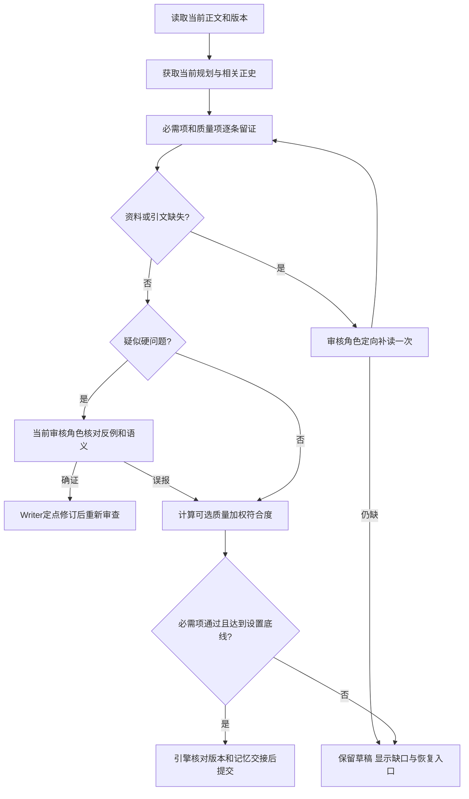

本轮只通过第22章自然语言生成过程观察，不另跑离线用例或第21章复审。

产品目标是用户用自然语言完成长篇创作，系统理解意图、自动安排步骤、处理常见错误，并清楚说明进度。日常减少重复阅读、重复调用和无效返工；用户明确要求加强或已允许按需加强时，再调用专项角色。

优先级按顺序为：
1. 遵守用户当前目标、授权范围、数据完整性和必要验收门禁。
2. 满足本次任务明确要求的质量。
3. 在这些条件内，优先减少 token、调用次数和重复步骤。
4. 优化等待时间、界面体验和可维护性。

配置五个角色不等于每次调用五个模型。每个角色可以继承默认 Provider/模型，也可以配置独立模型；模型数量与角色数量分开统计。

正式角色为 Coordinator、Writer、Editor、Reviewer、Memory Keeper。引擎、上下文构建、记忆存储、下载和预算管理是程序服务，不计入 Agent。

0.7.0交付范围分两层：核心范围是既定角色迁移、可靠恢复、正文/文件版本、清晰交互、语音可用性、费用与缓存可观测，以及可追溯的偏好/记忆基础；Tencent记忆适配、自动提示词实验、个人模型微调与Agent Lightning为条件扩展，不作为用户正常写完一卷的必装依赖。具体实施依赖见第14、17.8和19节。

## 2. 当前实现与差距

| 状态 | 证据 | 处理 |
| --- | --- | --- |
| 已实现 | coordinator.py 只有 coordinator、writer、reviewer；章节提交由 engine 执行 | 复用既有工作流门禁 |
| 已实现 | 当前 reviewer 是界面中的 Editor，兼做记忆候选 | 必须版本化迁移，不能把它直接当新专项 Reviewer |
| 已实现 | schemas.py 的 ReviewModelOutput 要求 pass 时 memory_patch 非空 | 拆分综合编辑与专项审查输出契约 |
| 已实现 | engine.py 有 memory.editor_fallback 补提取路径 | 可复用为阶段性记忆补提取，后续接入 Memory Keeper |
| 已实现 | config.py 和 App.tsx 已有按角色参数 | 增加角色配置版本、启用策略和继承显示 |
| 已实现 | runtime.py 有请求切片预算 | 增加跨切片费用观测和任务调用/token 资源累计；不增加金额门禁 |
| 已确认问题 | runtime.py 将缓存 token 固定乘 0.1 | 分开真实 token 和基于价格快照的费用 |
| 待实现 | 动态加强策略、角色互斥与专项分工 | 新增受约束的执行计划 |
| 待验证 | 字数一次达标率、记忆漏提率、80% Writer 缓存目标 | 通过真实任务和有范围的对照验证，不宣称已达标 |

历史日志中的格式失败、缺执行卡和恢复问题用于定位修复；不能由少量样本推断所有调用的性能。

### 2.1 本次可行性复核：现有能力与真实缺口

以下结论来自2026-09-23工作区静态阅读，不是本轮模型运行结果。前表描述角色迁移基线，本表补充学习与记忆链路；文件已包含其他未提交工作，实施时必须保留。

| 核对位置 | 当前证据 | 结论与需要补齐的部分 |
| --- | --- | --- |
| `agent/src/inkflow/learning.py::LearningService` | 已有学习概览、JSONL导出、偏好特征处理、训练准备清单 | 有学习入口，但不能据此称已支持大模型自动训练或自动部署 |
| `learning.py::export_dataset` | 遍历历史事件，却按章节号读取当前章节路径；最多取200条事件 | 旧反馈可能配到新正文。须按事件绑定的版本与哈希取快照；训练导出独立分页，不能沿用UI事件条数上限 |
| `learning.py::train_preference_model` | 累加`features_json`后归一化，写入`preference-model.json` | 是特征统计；未见优化损失、保留验证或Writer加载该文件的完整链路，不能描述为已微调模型 |
| `learning.py::prepare_training` | 校验文件并保存待确认清单 | 尚无这里可证实的训练执行、评估、部署和回退闭环；需分阶段补齐 |
| `database.py`的`learning_events / preference_pairs`及`engine.py`记录点 | 已有接受、拒绝、修订事件；接受可来自引擎流程，修订来源可为`reviewer_or_user` | 机器审查通过不等于用户喜欢，依据不足不等于文笔差；需拆分反馈来源、原因与评价维度 |
| `database.py::save_preference_pair` | 仅检查两个ID不同，再保存调用方特征 | 缺同任务、同依据、真实候选版本和有效选择校验；不能直接当DPO样本 |
| `retrieval.py::HybridRetriever` | 已有精确匹配、BM25、可选语义检索、融合、关系扩展和向量缓存 | 复用现有检索入口；不要仅为了“Agent Memory”名字再建一套重复检索服务 |
| `database.py::retrieval_feedback_scores` | 按来源ID累加引用/忽略/误导反馈，未按问题类型归一化 | 存在常被引用资料持续压过其他资料的设计风险；需限幅、按范围统计，单次未引用不能证明无用 |
| `context.py::ContextBuilder.build` | 全量读取当前事实和未结线索，并将已加载来源从检索结果去重 | 已有去重，但检索不能自动减少这些全量注入项。须拆出必需事实与相关证据集合，不能以高缓存掩盖输入膨胀 |
| `schemas.py::ContextPacket.to_model_prompt`、`provider.py::generate_json` | 已有稳定区段排序、稳定Schema序列化 | 继续复用；靠前的J2按任务选偏好，K包含章节执行要求，区段名称稳定不等于内容稳定 |
| `runtime.py::RunRuntime.settle` | 命中输入乘固定0.1进入累计值 | 真实token与估算费用混合；优先按第11节分账，后续实验才有可信成本基线 |
| `database.py::chapters / canonical_chapter_content` | 已有`content_text`和正史读取能力 | 不是从零补正文存储；但单章当前行不等于完整不可变历史，需核查并复用现有artifact/断点，再补缺失版本快照 |
| `references.py::ReferenceService.analyze` | 参考分析目前是段落、句长、对白和结尾统计 | 可作辅助特征，尚不能代表对人物动机、叙述距离、场景推进和文风的理解 |
| `craft.py::select_craft_guides` | 已有六类手写写作指导，按关键词选少量条目，不调用模型 | 是技法库的运行时起点；尚无从用户素材抽取、校验、发布和撤销技法的闭环 |
| `context.py::_load_reference_cards` | 按修改时间取最近六份JSON，移除旧`samples`和原文结尾字段 | 已避免部分原文注入，但未按当前场景匹配；新增内容须采用字段白名单，不能仅删除两个已知原文字段 |

可行性结论：现有Python引擎、SQLite、Context Packet和Provider足以承载第一阶段改造。主要缺口在版本与反馈语义、上下文选择、恢复和评估闭环，增加模型数量本身不解决这些问题。长期记忆与偏好个性化可先实现；权重训练受数据质量、可训练模型、硬件和部署能力约束。任何“彻底解决”的承诺都应落实为可复现问题、根因改动、真实任务证据和防复发检查；不承诺开放式小说生成从此零错误。

## 3. 五角色职责和工具权限

| 角色 | 输入与产物 | 可执行能力 | 禁止事项 |
| --- | --- | --- | --- |
| Coordinator | 用户原话、当前对话、任务状态、相关剧情依据；产出答复、设定变更指令或执行计划 | 日常聊天；回答项目问题；讨论后续发展并提出选项；按用户明确要求修改设定；识别写作目标并分派给 Writer；安排角色与流程；高级电脑控制启用且本次确认后操作电脑、项目文件和设置 | 代替 Writer 起草或改写小说正文；代替 Editor/Reviewer 审查放行；跳过版本记录；突破费用限制；高级电脑控制关闭时操作桌面 |
| Writer | 一个 Context Packet；产出规划、正文或修订 | 大纲、剧情细纲、近期计划、执行卡、写作、定点修订 | 自批正文、改审核标准 |
| Editor | 正文及依据；日常综合审查与记忆候选 | 剧情和表达检查、提出修订项、轻量事实抽取 | 直接提交正史 |
| Reviewer | 指定审查范围与相关依据；专项结论 | 因果、人物、时间线、跨章连续性深查 | 默认重复综合编辑、直接改正文或保存记忆 |
| Memory Keeper | 已审正文或标记为候选的正文；记忆变更提案 | 事实、关系、知识边界、物品状态、时间线、伏笔抽取与冲突标记 | 批准文学质量、无证据写正史、擅自改变剧情 |

Memory Keeper 理解和整理记忆，最终提交由引擎执行。它发现语义冲突时交回审查/修订流程，不能直接改正文或覆写既有事实。

Coordinator 是用户的主要对话入口，不只是派工器。用户当前对话文本决定本次创作目标与授权范围；历史设定、大纲、人物状态及伏笔用于理解影响，不得压过用户明确的新决定。用户未提出创作/修改要求时可以正常聊天、解释项目或讨论创意，但不把闲聊自动写入正文。Coordinator 可以口头讨论后续发展、比较走向、提出方案；凡用户要求生成具体小说叙事内容，无论篇幅长短，都由 Writer 执笔，Coordinator 负责理解、组装依据并分派。

用户明确要求“把女主职业改成记者”时，Coordinator 可以按授权保存设定新版本；用户说“写一小段两人和解的草稿”时，Coordinator 将任务交给 Writer，Writer 生成草稿或分支。短不构成改派给 Coordinator 的理由。若用户是在讨论可能性或索要方案，Coordinator 只讨论并给出提案，不擅自改正式设定或接受正文。修改已接受正文时创建新版本并保留原版，不静默覆盖。

剧情相关的直接编辑要读取相关设定、大纲、细纲、人物关系/知识、已发生事件和伏笔。Coordinator 可以按用户明确要求修改，但要说明旧状态、实际变化和受影响项目；不能声称内容已通过 Editor/Reviewer。引擎记录变更并标记受影响的计划、记忆或审查结果，支持撤回。风险说明用于知情选择，不替用户否决明确的创作决定。

## 4. 运行模式

| 模式 | 参与角色 | 语义审查责任 | 记忆候选责任 |
| --- | --- | --- | --- |
| everyday | Coordinator + Writer + Editor | Editor 综合审查 | Editor |
| review_boost | 日常三角色 + Reviewer | Editor 完成普通范围；Reviewer 完成指定专项 | Editor |
| memory_boost | 日常三角色 + Memory Keeper | Editor | Memory Keeper；Editor 不再重复完整抽取 |
| deep | Coordinator + Writer + Reviewer + Memory Keeper | Reviewer 完成规定的完整审查范围 | Memory Keeper；Editor 不运行 |
| full_specialist | 五角色 | Editor 只负责表达/阅读体验；Reviewer 负责逻辑/连续性 | Memory Keeper |

角色数表示本任务可以参与的角色，并不表示每一步都调用。例如旧稿专项审查无需重新调用 Writer；Writer 只有需要修订才参与。

默认使用 everyday。用户预先允许“智能加强”时，Coordinator 可在明确条件和预算内临时选择 review_boost 或 memory_boost；deep 用于用户要求的全面加强。full_specialist 需要实际存在三类不同检查任务，不能因为一个“精修”关键词就自动全开。

专项完成后回到任务基础模式，不能永久升级后续所有章节。

## 5. 总体组件关系

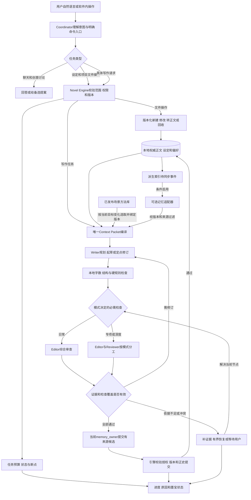

图中边表示允许的依赖关系，不代表所有角色必经；项目文件操作仍需按第12.1节分别处理草稿候选、软删除与正史依赖。`V`中的依据不足不会变成通过；`A`成功后，依赖本章的下一章才可启动。外部记忆只提供经过校验的候选资料，不写正史；离线学习不在这条实时提交链上。无深度任务时不实例化专项调用、不拼接专项提示词。

## 6. Coordinator 如何理解用户并决定调用

### 6.1 自然语言入口

保留用户原话，提取：本次是聊天、讨论、提案、设定修改、Writer短篇起草、电脑操作还是长工作流；目标、范围、必须保留内容、禁止操作、字数、质量要求、费用要求、是否允许加强和是否授权写入。短篇起草由Coordinator路由给Writer，不由Coordinator生成正文。

明确命令可本地处理；含否定、条件、讨论意图和多项补充的句子必须正确解析，不能只靠“写”“继续”等关键词派工。

示例：
- “照之前的节奏继续写三章” → 日常顺序流程。
- “这章只改对话，不改剧情” → 选区或范围修订，不重新生成整章。
- “仔细检查前面埋的伏笔” → Reviewer 的伏笔连续性专项；已有正文不重写。
- “人物关系太乱，整理一下” → Memory Keeper 只读整理提案；未获改正文授权不写作。
- “这一卷全面精修，逻辑和文风都要看” → 根据范围选择 deep 或 full_specialist，明确检查责任。
- “先别写，我想改一下结局” → 讨论/规划，不启动正文。
- “主角改成从外地回来的护士，把设定更新一下” → 读取关联剧情和伏笔，按明确指令保存设定新版本，并列出受影响的大纲与后续事件。
- “给我写一小段她第一次进医院的草稿” → Coordinator 结合上下文整理人物状态、剧情约束并派给Writer；Writer起草后存到未接受草稿/分支，不启动整章流程。
- “帮我在电脑上整理这些文件” → 高级电脑控制开启后先弹出操作预览；用户确认后才执行。

用户途中补充属于 task_revision 更新。立即处理停止；修改创作条件在安全节点冻结新输入，作废受影响产物并重建必要计划，不丢弃已有效的工作。

### 6.2 调度提案

建议内部字段如下，均为目标契约，尚未表示实现：

```json
{
  "plan_version": 1,
  "task_revision": 3,
  "base_mode": "everyday",
  "selected_mode": "review_boost",
  "reason_code": "user_requested_cross_chapter_review",
  "scope": {"chapters": [8, 9], "checks": ["causality", "character_knowledge"]},
  "required_checks": ["structure", "length", "continuity"],
  "check_owners": {"general": "editor", "causality": "reviewer"},
  "memory_owner": "editor",
  "auto_boost_allowed": true,
  "return_to_base": true
}
```

真实结构还应绑定任务资源限制、步骤依赖和输入版本。Coordinator 可以提出，Engine 必须验证角色存在、检查覆盖、权限、已启用的调用/token限制、版本和循环上限。不满足时返回结构化原因，不能直接执行任意工具链。

### 6.3 自动加强的触发条件

只有模式允许、任务范围内、调用/token 限制允许且有具体原因时才触发；费用估算不是加强或继续写作的门禁：
- Reviewer：已发现互相冲突的因果或角色知识证据；用户要求跨章核对；当前复杂修订影响多个章节。
- Memory Keeper：事实候选冲突、关键人物状态缺失、复杂时间线或关系迁移需要整理。
- 全面加强：用户明确要求，或任务预设已允许相应等级。

模型单独报告“信心不高”不够触发所有角色。Coordinator 根据用户原话、任务类型、上下文缺口、未解决风险、既往修订/审查结果和加强预算选择角色，但要给出具体理由；引擎校验权限与预算。按需加强不应在每个节点另发 Coordinator 调用：初始选计划，正常节点由代码推进，只有用户改要求或风险变化时重新规划。

### 6.4 运行中冲突的协调与继续

运行中的“冲突”首先是需要处理的事件，不直接等于整项任务失败。Coordinator 负责判断用户原意是否仍被满足、选择下一种恢复办法、向用户解释进度；Novel Engine 负责版本、预算、审查和提交门禁。正常情况下在当前节点处理完冲突后继续原任务，不让用户重复输入整段要求。

每次冲突保存一份简短的 ConflictRecord：任务与章节、相关版本哈希、冲突双方各自的说法、原文证据、用户原话和明确硬约束、已尝试的处理、剩余预算、下一步动作。Coordinator 只读取这份聚焦材料和必要上下文，不重新装入整段聊天与全部小说。

| 冲突类型 | 例子 | 首选处理 | 何时询问用户 |
| --- | --- | --- | --- |
| 表达/节奏软分歧 | Editor 想更快、Writer 想保留铺垫 | 对照用户风格偏好；保留有效剧情，可调整局部节奏，或将意见降为建议 | 两种方向都合理且用户明确要求选择风格时 |
| 可兼容的创意分歧 | 两个方案都满足既定人物目标 | Coordinator 提出兼顾方案或并列短方案；只改受影响场景 | 兼顾会改变用户核心创作意图时 |
| 事实/时间线分歧 | 一位角色记为周一，另一位记为周三 | 读取正文来源和已接受正史，核实引用，必要时定向复核 | 来源同等可信、无法判定正史且必须定一个日期时 |
| 人物视角差异 | 角色撒谎或误记，被模型当作矛盾 | 区分客观事实、人物信念、传闻与叙述留白；保留有意设计 | 是否属于作者有意设计仍不清楚、且会改变剧情时 |
| Coordinator 与产物目标不符 | 用户要局部改写，Writer 却重写整章 | 检查原话和 TaskTicket，收窄任务并重做错误节点 | 原话确实有两种重要解释时 |
| 模型之间的审查冲突 | Editor 放行，专项 Reviewer 指出带证据的硬问题 | 比较同版本、同依据和检查范围；核实证据，局部修订或一次专项复核 | 真正需要改主线、改已接受正史或两个方向不可兼得时 |
| 记忆候选冲突 | Memory Keeper 的候选与既有事实冲突 | 检查原文、时间顺序和事实类型；可解析的误报自动消解 | 两条有效正史互斥且用户未授权改写时 |
| 服务/格式/切片中断 | 超时、可修 JSON、单次预算耗尽 | 分类重试、局部格式修复、保存断点并在总预算内续跑 | 凭据、磁盘、总预算或外部操作需要用户处理时 |

“淡化冲突”只适用于软建议、表达方式和能够兼容的创意选择：可缩小修改范围、把非必要意见改为提醒，或给出兼顾方案。不能把两条互斥事实折中成一个未经正文支持的新事实，不能为了继续生成而假装硬问题已通过。

冲突处理顺序是：**代码先对齐版本和依据 → 定向补材料/核实证据 → 允许的局部修订或专项复核 → Coordinator 在剩余预算内重新规划 → 仍有真正创作选择时问用户**。每一步只处理冲突所处节点；没有必要重新执行已通过的章节。协调失败也保留断点与可读原因，状态是“等待用户决定”或“等待条件恢复”，不笼统显示“任务失败”。

向用户提问要具体：一句话说明冲突、已核实事实、两个可选方向、各自会影响的后续章节，并说明推荐理由。用户可以在原对话直接回答；回答绑定等待中的 ConflictRecord，更新任务版本并从断点继续。提问不要求用户理解批次 ID、内部审核分数或 JSON。

效率控制：格式和引用问题先由代码处理；Coordinator 只在用户意图偏差、不同 Agent 的实质分歧、恢复策略要改变时参与。一个冲突不得反复在相同上下文下调用相同模型；记录“已尝试策略 + 输入指纹 + 结果”，没有新证据或新策略就不重复收费调用。加强调用与修订都受整项预算限制。

运行时的“自修复”是修复本次任务的执行策略，不是让小说 Agent 改源码。引擎可在已授权白名单内补齐缺失依据、缩小任务范围、重做失败节点或把软意见降为提示；只有实质目标偏差才请 Coordinator 重排未完成节点。每次策略调整绑定输入版本、尝试次数与结果，已完成节点和正史不重写。策略均无进展时进入有原因的等待状态，并将可复现的代码缺陷形成开发诊断；不循环调用模型，也不以自动放行代替修复。

### 6.5 对话、设定编辑与写作任务分派

Coordinator 会话支持聊天、创意讨论、明确设定编辑、写作请求路由、项目操作和长流程。这些属于同一 Agent 的工作模式，不是新角色。Coordinator 可以直接讨论“接下来可能怎么发展”，但具体场景、段落、章节及局部正文改写都属于Writer的写作职责；篇幅短只影响任务范围，不改变执笔角色。

| 用户表达 | Coordinator 动作 | 保存方式 |
| --- | --- | --- |
| 问剧情、设定或日常聊天 | 直接回答；涉及已写小说的信息时读取相关上下文 | 不写文件 |
| “可以考虑让人物离开故乡吗？” | 结合大纲和伏笔给方向、代价及备选 | 保存为提案，不改正式设定 |
| “把人物改为离开故乡，更新设定” | 修改相关设定，检查计划与伏笔影响 | 保存新版本和差异；用户明确授权即执行 |
| “写一段人物第一次离开故乡的草稿” | Coordinator读取人物状态和前后剧情，整理约束并分派Writer起草 | Writer产出后写入隔离草稿；明确要求采用时再进入正式版本 |
| “继续写完整章节/一批章节” | Coordinator 编排 Writer、Editor 和适用专项角色 | 进入正常章节门禁 |

用户明确的新决定是创作权威。Coordinator 先呈现已知剧情约束和变更影响，再按用户要求修改；不因与旧设定冲突就拒绝创作，可保留旧版供撤回。含糊表达只产生建议；明确指令不额外要求用户逐项确认普通小说内修改。

### 6.6 高级电脑控制

- 设置中的“允许墨宝操作电脑”总开关默认关闭。关闭时，Coordinator 仍能进行聊天、读取项目上下文和既有的小说工作区操作，但不操作桌面应用或执行电脑级文件操作。
- 用户开启后，每项电脑操作仍需弹出本次确认窗口；开启开关只是允许发起请求，不是永久授权。
- 确认窗口使用自然语言列出目标应用/文件和完整路径、将执行的步骤、预计改动、风险（包含覆盖/删除/外部提交）、费用或外部数据传输、撤销/恢复方式。
- 用户可查看差异、确认或取消。确认绑定这份操作清单；若执行时目标文件变化，或计划新增/删除/覆盖/上传/扩大范围，暂停并重新确认。
- 支持尽可能丰富的本机应用和文件工作，不把能力限制在少数固定演示动作；执行范围和风险在窗口里说清，由用户决定是否继续。
- 完成后列出实际结果、失败项和修改文件，提供可恢复版本/差异。取消后不执行、不重试、不绕过；出现超出清单的情况需重新预览。
- 只在用户确认的设备本地执行；涉及外部上传或付费服务时，确认页说明数据目的地和费用。

### 6.7 模型选择

为五角色分别提供 profile，未覆盖的设置继承项目默认 Provider。不擅自替换现有用户模型。

同一基础模型可以承担多个角色，独立提示词不保证错误独立；跨模型组合可能改善漏检，也可能增加冲突和费用。具体型号、推理强度和参数以供应商能力及任务评测确定，不在架构层固定“越强越好”。

请求上限为用户上限、模型能力、剩余上下文、任务预算共同约束的结果。默认32K、界面最高128K不能被解释为所有模型都支持128K输出。

## 7. 一章与整卷的真实执行流程

1. 确定当前任务目标；不得把历史15章、18章或其他字数目标擅自混用。
2. 检查设定 → 全书大纲 → 当前卷细纲 → 近期章节规划 → 本章执行卡；已接受正文始终高于旧的未来规划。
3. 未具备生效规划时先按上述依赖生成。用户已授权连续工作且每层审核通过后，代码自动推进下一层；需要创作取舍或审核无法消除的关键冲突才询问。细纲可列粗粒度章程，但逐章 250～500 字细节只属于近期规划。
4. 构建 Writer Context Packet，写入明确字数范围和用户硬规则。
5. 本地检查输出完整性、字数、标点硬规则、版本结构。
6. 按模式进行 Editor 或 Reviewer 审查。
7. 可修复问题交给 Writer；新版本重新检查受影响的审查范围。
8. 由本模式唯一 memory_owner 提供记忆候选。
9. 引擎检查审查覆盖、版本、未解决问题、记忆一致性和授权。
10. 保存正文与记忆，发布完成事件，再进入依赖它的下一章。

批量操作对用户是一个任务，内部按章持久化。默认当前章未通过，不生成依赖它的后章。

### 7.1 全书大纲—逐卷细纲—近期规划：0.7.0 修订契约

以下为**目标设计，不能据此宣称现有运行时代码已实现**。旧 `OutlineOutput` 强制逐章、旧 `StoryDetailOutput` 不含卷边界、旧 `generate_plan` 把书/卷/篇章/章节卡打包，三处均须版本化迁移；不能只换界面标签。文档中早期“细纲完全不按章节”“默认先规划三章”“大纲需用户逐次确认”的描述被本节替代。

| 产物 | 它回答的问题与建议篇幅 | 明确不承担 | 来源与生效条件 |
| --- | --- | --- | --- |
| 设定 | 世界规则、人物既有状态、用户硬约束与创作偏好；没有统一字数配额 | 未发生的剧情当作已发生事实 | 用户明确编辑或既有正史；版本化 |
| 全书大纲 | 故事为何发生、主线任务、背景、主要场景、人物总弧、关键高潮、大致结局及卷级走向；约 5,000～25,000 字 | 逐章场景表或已发生事实账 | 用户新要求 + 已接受正文 + 有效伏笔；Writer 候选经当前模式审核者通过后生效 |
| 每卷细纲 | 该卷至少 10 章容量的起止状态、主支线、因果链、场景与新人物特征、冲突升级、伏笔种收、高潮及粗略章节节拍；每卷约 5,000～25,000 字 | 把每章写成完整执行卡或强制全书一次生成 | 生效大纲 + 既有正史；逐卷审核通过后生效，未写到的卷保持弹性 |
| 近期章节规划 | 每章约 250～500 字，写明人物和已知状态、场景、核心行动、阻力与选择、后果、伏笔、钩子与收尾；默认连续 10 章 | 改写已接受正文；冒充卷细纲 | 生效大纲/对应卷细纲 + 最新正史；审核通过后绑定未来章节卡 |
| 本章执行卡 | 写当前章时选取场景顺序、字数目标和必须核对的状态 | 重构全书承诺 | 近期规划 + 最新正史；仅绑定本章草稿 |

“约”是创作目标而非简单字数挡板：保存实际中文字数，短缺时指出缺少哪类有用信息并仅补缺，拒绝重复空话凑数；很长但内容重复同样不合格。卷至少 10 章是新卷设计的结构下限，用户明确要求短卷时由 Coordinator 提示后可覆盖，不用固定规则毁掉已有 15 章第一卷。近期规划默认 10 章可在设置修改，本次用户自然语言范围优先。跨卷规划需要分别引用两卷细纲并显示接续点，默认建议单卷内生成。

已有正文后的重设计按事实强弱分层：已接受章节正文与其可核对事实不可因新大纲倒写；用户亲自确认的硬设定不能默改；已种下但未兑现的伏笔保留可追踪的对象和状态，可调整兑现方式；旧大纲、旧细纲、旧计划只是待替换的未来方案。对《灰巷灯火》，第 1～15 章及铁盒已从铺内失踪、名单七号被划而九号前移等已写事件是锚点，不能在未来卷又写成首次发现或铁盒仍在板房。第 15 章可以显示为第 15～24 章窗口的衔接摘要，不能生成替代卡或覆盖正文；第 16～24 章为实际可变更范围。用户已允许未来卷数和总章数随合理剧情调整；项目里旧“三卷45章”只作为旧偏好与既有计划来源，不能无声地压过本次新授权，新估计需向用户可见。

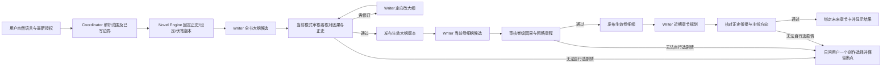

每一级均先写隔离候选和公开摘要，再由当前模式负责审核的 Agent 审阅，最后由引擎在短事务中核对输入哈希、范围、权限、已有正文边界和审查版本并发布。这里的“生效规划”仅是后续写作依据，绝非“正史事实”。用户已授权连续规划时，只要审核通过且来源仍有效，代码可自动进入下一级，不要求每一级点击；用户明确说“先给我看”则停在候选。审核依据不足先补证据；已证实硬矛盾才定向重写；来源同时变化则保留候选、重取受影响材料并续接；不能把一次冲突视为整项任务失败。旧规划可读且可回退，未来的受影响节点标为待重算，不删除已接受章节。

规划审核采取方向性而非逐句验收：大纲承接已接受正文，卷细纲维持本卷核心因果，近期规划与两者基本吻合且有推进即可。未来人物选择、线索登场、物件流转可以在写作时有因果地调整；不能因为旧提案没写过某一步、伏笔暂未揭晓、附加引文格式失误就整层重写。自动生效仍要求当前审核者 `pass`、至少 80% 把握度和一条逐字可定位的正文或生效上游依据；已证实正史矛盾、用户硬要求或主线明显偏离仍阻断。规划可标注可变动的探索点，执行卡和正文阶段再细查该章实际行动，不把未来卡片当作已经发生的事实。

新章节正文使用相同但独立的提交链：Writer 写 → 当前模式审核者（普通模式 Editor，加强模式 Reviewer）判定 → Writer 对可修问题最多两轮定向重写并重审 → `pass`、至少 80% 把握度、正文证据可定位、无硬冲突且来源版本一致时由 Novel Engine 自动入正史。两轮仍不通过则停在该章并显示具体原因与草稿；开发验证时由宿主排查提示、检索、审核误判或代码门禁并微调，再从该章继续，不替审核者放行，也不自动生成依赖它的下一章。已接受正文的事后局部修订继续保存旧版并走其独立确认规则，不被“新章节自动入正史”扩大授权。

### 7.2 迁移与真实项目验证顺序

1. 增加版本化规划契约和配置：旧三层文件继续按原版本读取；新大纲与卷细纲分开存储，章级规划窗口记录起止范围与引用的卷版本。设置页提供默认窗口章数 10，限制为合理正整数，但用户当前明确范围优先。
2. 先让 Writer 输出隔离候选，再接审核与生效提交。审核者须引用至少一个正文/设定锚点和候选里的对应句子，区分硬矛盾、可调整选择和偏好；不能仅凭分数放行或否决。
3. Coordinator 将“一次重设计后续并规划 15～24 章”保持为同一可恢复任务；代码串接大纲、相关卷细纲、未来窗口，不靠模型自由调用任意工具。每步发布事件、运行角色、输入来源、输出路径、审核结论和下一步。用户中途改变要求时仅使受影响候选/未来窗口失效。
4. 用真实《灰巷灯火》在可见墨流界面输入日常中文。先记录第 1～15 章及当前设定的版本，核对第 15 章结尾关键状态；再生成大纲、相关卷细纲与 15～24 章规划。第 15 章只读，规划第 16～24 章。核对角色调用与输入输出、每层质量和能否从第 16 章继续，不另造示例小说。若内容仍把已丢物件当作已经找回、让人物提前掌握未发现的事实，或明显脱离主线，才在受影响节点修底层并做一次对应观察；单纯未来变化只提出建议，不整套重跑。

### 7.3 由软件自主发现和清理过期成果

规划更新不由宿主手工删除小说文件。引擎在新版本生效时遍历来源引用，自动把旧大纲候选、对应卷细纲候选、过期未来章节卡和旧上下文投影分类为“仍在使用”“已失效但需保留”“可归档”“可建议删除”；这一步只改状态和 UI 提示，不销毁内容。判断依据至少包含内容哈希、上游版本、所属卷/章节范围、是否用户手改、是否被已接受正文/审查/记忆/恢复点引用，以及是否正在被运行任务读取。模型只能解释建议，不能独自决定文件已无用。

对可自动处理的派生缓存，默认做幂等失效标记，不把旧内容喂给后续 Writer。旧规划候选的删除是明确的文件删除操作，不用“移入项目内回收目录”代替：软件先展示精确路径、原因、引用及不可恢复后果，核对生效版本和内容哈希，单独确认后删除选中的旧候选文件；单项或批量都只处理这批已核对目标。用户可以委托协作宿主帮助审查目标，但确认不能被“一律同意”代替：每批目标变化须重新核对；平台要求用户即时确认的删除仍需用户自己操作。正史、用户改稿、被引用的旧版和恢复依赖不得进入自动删建议。删除失败报告已删数量和剩余目标，不回滚已成功发布的规划或中断后续无依赖的工作。正文、设定等一般项目文件仍按第12.1节的软删除与永久删除两级操作处理，不把候选专用删除规则扩展到正史。

### 7.4 数据模型与发布状态机，而非旧“四级规划包”换名

引擎保留 `BOOK.md` 作书籍设定的人类可读投影，但新规划的权威记录须拆开：`book_outline`（全书）、`volume_detail`（按卷和卷版本）、`chapter_window`（按未来连续窗口）、`execution_card`（本章）。每条记录包含稳定 ID、协议版本、所属小说及分支、范围、内容哈希、来源 ID/哈希、创建者角色、审核者角色与审核报告、状态、创建/生效/失效时间。文字 Markdown 是版本化投影，不再靠文件名或最后写入时间判断“当前”。正文 `accepted_chapter` 与事实记忆仍有独立的正史权限，任何规划记录不能伪装成已发生事实。

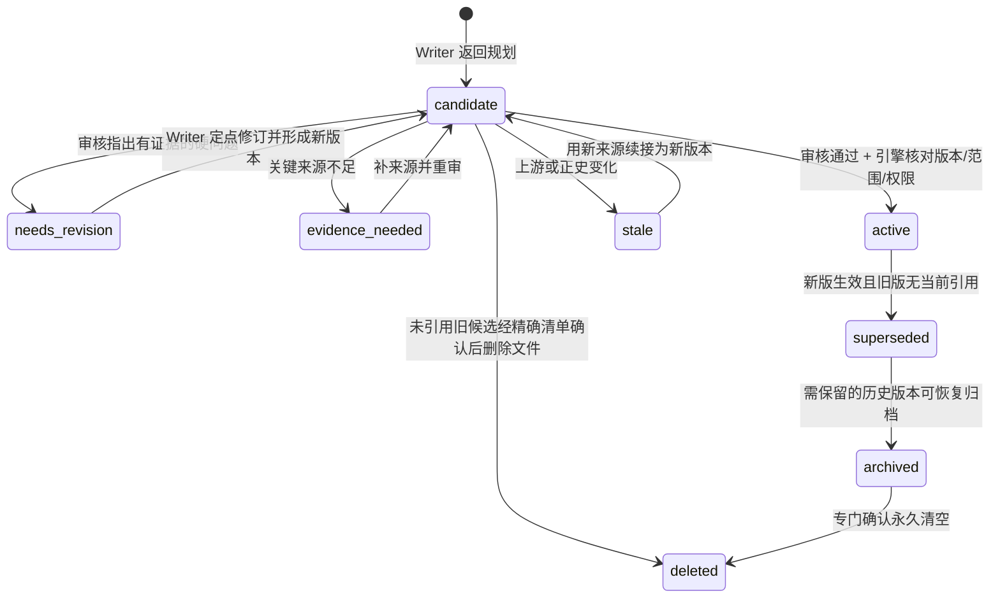

提交只需短暂独占“当前生效指针”，生成与审核可并发读取同一来源快照。发布时以 compare-and-swap 校验 `source_hashes`、正史章边界与 active 指针：若不匹配，不覆盖现有生效版；保存迟到候选并从受影响节点重新取材。更新大纲只将依赖它的未写卷细纲和近期窗口标为 `stale`；已接受正文、未受影响的卷及用户手写版本不动。更新一卷细纲仅使该卷关联的未来规划窗口失效，跨卷窗口按涉及的所有卷重新核对。章节规划不会反写全书大纲或卷细纲；若 Writer 在规划时发现上层设计真矛盾，提出升级建议给 Coordinator 重路由，不由它私改上层。

角色分工：Coordinator 解释用户原话与变更范围、提示预计影响并在必要创作选择时提问；Writer 单独产出或修订对应层文字；普通模式 Editor、加强模式 Reviewer 审核同版本候选的事实承接、因果、任务覆盖和显著叙事风险；Memory Keeper 只在正文入正史后处理记忆候选，不为每个规划阶段重复调用；Novel Engine 固定依赖图、版本门禁、审核覆盖、自动推进与安全清理。审核者可提出非阻断风格建议，但不能因为新颖支线或非线性叙事本身否决；必须把硬问题绑定候选原句和已接受来源。Coordinator 不替 Writer 写规划、不代审核者通过、不代引擎提交。

同一任务可包含多个阶段，但每段保存 `pending_stage`、输入版本、候选路径、审核记录、已试修订次数和已发布结果。重启后先读取任务状态，而不是重发整条用户消息；已经通过并发布的大纲不再付费重生，失败卷只从该卷继续，失败规划只从该窗口继续。无意义重复失败两次时，显示“当前被什么拦住、已尝试什么、候选在何处、接下来谁处理”；开发验证由宿主改路由/上下文/审核判断的根因，实际运行仍由软件 Agent 产出修复结果。独立语音、只读浏览和其他卷的无共享写入操作不因规划长模型请求被全局锁住。

针对近期窗口的反馈与断点续做分开：提到“刚才这版”只表示评价当前生效内容，不能从更早未发布候选暗中恢复；只有明确继续中断任务且正史、锚点、目标章节与生效规划哈希一致，才复用隔离候选。用户要求多章重排时可重组目标窗口的行动和节奏，不将旧候选当强制底稿；单章局部修订仍保留未受影响章节。局部规划上下文优先用最近正史事实与未结线索，较早事实按发生时点而非当前持有状态解释。审核先核对过去事件的行动者和时序，再做“两个事实能否同时为真”的共存检验；日常取放、后来新增的通知、人物主观解读或少一句说明不能单凭可能误读升级为硬矛盾。若审核以这类留白判 `revise`，同一审核者先定向复核一次并复用稳定输入前缀；只有确有排他性证据才让 Writer 修订，避免为审核误判连写两轮。两轮修订后仍不通过时，界面显示首条具体问题和候选位置，生效规划保持不变。

断点续接还保留原任务的一份根目标，而非只读最新一句“继续审核”：例如原任务要求打破连续问话、记录和原地观察的重复，后续纠错不能把此目标悄悄丢掉。本次最新补充与原目标冲突时以本次为准；根目标只存一份，不把每轮追问累加成越来越长的提示。近期规划的质量审核在事实共存以外单独看整个窗口的行动、选择与后果是否推进；安静章节可存在，但用户明确要改变重复模式时，不能把仅更换问话对象或纸张的连续章节当作已完成重排。

用户界面只突出三张当前卡：全书大纲、正在展开的卷细纲、近期章节规划。每张卡显示 `候选/审核中/生效/需修订/来源变化`、字数或章数、引用的正史边界和一个主要操作；展开后才看全文、审核证据、调用轨迹与历史版本。第 15～24 章窗口明确分栏显示“第15章正史衔接”和“第16～24章未来安排”，避免十张新卡误写第15章。清理建议单独进“待处理”抽屉，不用弹窗在写作中反复打断；真正点删除才显示一次准确的确认清单。

### 加强步骤的串并行

同一正文版本上的表达审查和逻辑审查可在启用 Editor 与专项 Reviewer 的 full_specialist 模式中按明确预算并行；deep 模式不运行 Editor。正文修订后受影响结果失效。Memory Keeper 默认在正文审查稳定后执行，减少白做。

只有延迟优先且预算允许时，才允许并行进行候选记忆抽取；其结果必须待所有必需审查通过后才能提交。不同相互依赖章节默认串行。

并发不是按模型数量一刀切，而是按输入快照、写入范围和依赖关系决定。现有 `JsonLineServer` 已为请求创建独立异步任务，语音任务和开书方向构思也有独立入口；主要瓶颈是 `project_mutation_locked` 把整段远端等待包在项目写锁内，以及桌面聊天的单一 `busy` 状态。因此 0.7.0 先让只读项目状态、任务状态和显式触发的独立提示词优化不等待章节模型请求，再拆分小说执行阶段的长锁。不能把“支持并发请求”误写成“Writer、Editor、Reviewer、Memory Keeper 已全面并行运行”。

| 可同时运行 | 仍须等待 | 结果处理 |
| --- | --- | --- |
| 章节写作与用户显式触发的提示词优化、只读项目查看、已隔离资源的语音任务 | 用户改稿与同一正文的正式提交 | 独立结果各自保存，不自动替换正在输入的文本 |
| 同一冻结正文版本上的 Editor 表达检查和专项 Reviewer 逻辑检查（仅在该模式实际启用时） | Writer 改稿完成前不能开始依赖新稿的审查 | 各带正文、规则和上下文版本；汇合后按覆盖范围判定，失效结果弃用 |
| 不同项目的无共享文件模型请求 | 同一项目的正史写入及共享文件修改 | 仅短暂串行提交；写入前比较来源版本和目标哈希 |
| 已有审查结果的展示与新请求的进度读取 | 当前章未通过时的下一依赖章节 | 未通过不生成依赖正文，界面说明等待原因 |

实施时先在代码里建立任务依赖图和写入范围标记，给模型调用设置有界并发（初始保守值，由供应商429、等待时间和费用记录调整），并为每个子任务固定 `run_id`、项目、正文哈希和规则版本。准备输入时短暂读取/冻结快照，远端 HTTP 等待不占项目写锁；返回后在短锁内检查版本并原子保存到该子任务的草稿/审查位置。失败只取消或重试相关分支，独立分支可以完成；同一版本的必需分支汇合后再判断是否提交。用户停止任务时取消它拥有的分支，但不误停另一个独立语音或项目任务。共享输入缓存前缀以稳定快照为准，并发不能以重复送入整书或重复付费调用换速度。当前 `provider.py` 每次请求新建 HTTPX `AsyncClient`，后续在同一运行循环内复用有生命周期管理的客户端和连接池，退出时关闭；这属于连接效率改造，不应冒充减少模型 token。[HTTPX 异步客户端说明](https://www.python-httpx.org/async/)

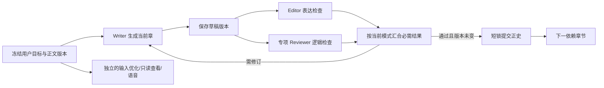

图中的 Reviewer 只在专项模式启用时存在；日常模式不会为追求并行而额外调用它。`I` 与章节主线互不依赖，因而不受 Writer 长请求阻塞。

实现依据：[Python asyncio 并发与取消](https://docs.python.org/3/library/asyncio-task.html)说明可同时等待独立任务，但失败传播方式必须按任务关系选用；[DeepSeek 当前限流说明](https://api-docs.deepseek.com/zh-cn/quick_start/rate_limit/)允许并发请求，同时按账户/模型限制速率，收到限流响应应有界退避；[SQLite WAL](https://sqlite.org/wal.html)允许读写并行，但同一数据库仍只有一个写事务。上述机制支持“远端并发计算、短暂串行提交”，不支持无版本核对地同时改同一章节。

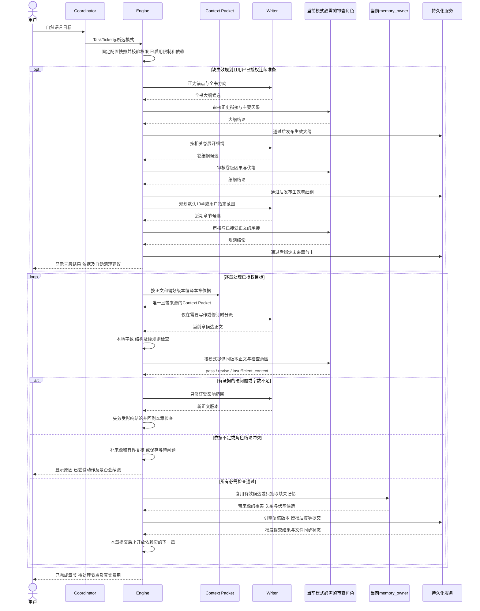

修订、依据不足和冲突分支都停留在当前章节的恢复节点；图中的`loop`不表示这些分支可直接跳到下一章。Editor是否兼任记忆候选由`memory_owner`决定；deep模式不运行Editor，full_specialist按检查范围分工。用户只讨论后续发展或要一段隔离试写时不进入整章时序；具体试写仍由Writer完成。

## 8. 审查与记忆契约

### 8.1 拆分现有耦合

当前 ReviewModelOutput 在 pass 时强制 memory_patch，适合旧综合 Editor，却不适合新专项 Reviewer。

目标契约：
- EditorResult：审查结论、覆盖范围、硬问题、软建议；仅在 memory_owner=editor 时要求记忆候选。
- ReviewerResult：专项范围、结论、证据、遗漏依据；不要求记忆候选。
- MemoryResult：来源版本、事实变化、知识主体、时间线、伏笔、冲突、证据。
- CheckCoverage：每项必须检查由谁完成，是否仍有效。
- AcceptanceRecord：提交时引用的正文、计划、正史、规则和审查版本。

角色接口分开，底层证据和 finding 类型复用，不复制整套 Provider。

### 8.2 通过、修订与信息不足

- pass：指定范围已完成审查，无未解决硬问题。
- revise：明确存在可引用的硬问题，需要修订。
- insufficient_context：缺少依据、响应不完整或结论矛盾，不能自动当作通过。

审查自动通过使用用户最新确认的最低 80% 把握度，设置可提高，不能低于这一底线；低于底线先限次核对审核是否理解了本章，不自动改正文或放行。模型自报置信度不是事实证据：即使高于底线，也必须先给出当前正文中可定位的人物目标、决定或变化原文，并核对章节卡与关键物件状态；已证实的硬矛盾不能被高分覆盖。若审核自身只谈理想剧情、计划或无关文字，缺少本章原文观察，则返回待核，不把偏题的报告当作正文缺陷。

第18步落地口径：界面保留百分比，但自动通过比较的是程序汇总的证据化审查把握度，不是模型自报值；已核实的偏差按公开严重度扣分，证据未齐显示0%（代表审查完整度未达标，不是作品质量0分）。篇章复审先取得当前大纲、卷细纲、近期规划、目标正文及相关已接受前章；至少一条当前规划和一条前章的双方原文逐字可定位，旧章节卡不能替代当前规划。漏引时同一审核角色最多一次定向补证，仍未补齐就停在待核，不驱动 Writer 改稿；可接受的前移、留白与人物传闻不自动算硬冲突。此规则评分不是统计校准的真实正确概率，不能只看单个百分比决定文学质量。

2026-09-23 执行策略更新：只有明确缺失、会影响关键行动/认知/提交的必要依据才触发补证据，不因分数低单独发起调用。普通歧义、可共存解释、风格建议以及已被证据反驳的硬指控归为不拦截意见；已证实硬问题自动限次修订后重审。真正必要来源未知、用户停止、权限、费用和版本完整性问题仍不能忽略。新计划及尚未核对的旧执行卡共用连续性检查，检查结果绑定内容与正史指纹；未变化时复用，避免逐章重复付费。以上是本次自恢复改动的执行规则，真实小说结果以实施日志为准，不表示其他0.7.0目标均已完成。

硬问题以剧情因果、设定一致性、人物知识、用户硬规则为主；审美偏好和非必要润色属于建议。

### 8.3 多角色结论冲突

不多数投票，不把 Coordinator 当最终文学裁判：
1. 确认结论针对同一正文版本和同一问题。
2. 合并重复问题，保留有引用的硬问题。
3. 核对证据是否确实支持该结论；必要时一次专项复核。
4. 修订会改变用户方向时请用户决定；否则 Writer 在授权范围内修订。
5. 只要必须解决的问题仍存在，就不能被另一个角色的总体 pass 抵消。

引擎能验证引用、版本、检查是否完成，不能单靠字符串匹配证明语义正确。

## 9. 记忆设计与数据一致性

记忆分为已接受正史、任务临时记忆、用户偏好。每条事实区分客观事实、人物信念、传闻与推测；对白中的谎言不能直接变成世界事实。

记忆候选绑定正文哈希、章节和来源片段。既有事实修改须记录前后版本和依据，早期章节修改触发下游记忆/审查失效标记。

写作第 N 章与复核早期章节要读取“第 N−1 章结束时”的事实和线索，而非一律读取当前最新投影。事实按有效章节区间及当前已接受来源版本过滤；线索按已接受记忆补丁重放，后来结清的线索在早期回查时仍应显示为当时未结。已接受正文局部修订后，摘要和线索补丁若未与新正文同版本重核，只能标为待核并从权威上下文隔离；可继续读取数据库正史正文及仍有原文证据的事实，不让派生资料的失效迫使用户重写整章。运行时说明哪些资料被隔离、为什么以及从哪个节点定向补齐。

采用一个权威提交路径。目标建议SQLite保存足够恢复的权威版本，Markdown作为可恢复导出；先核实当前表是否含完整正文，缺失时才设计明确迁移，不能假装已有。

SQLite事务不能同时原子提交Markdown：
1. 冻结版本并核对当前有效审查。
2. 短事务写入正文版本、事实、提交记录与文件同步标记。
3. 提交成功后通过临时文件与原子替换更新Markdown。
4. 文件更新失败记录待同步，恢复后重建，不再调用Writer。
5. 若正文目前必须以文件为权威，先实现预写文件与可恢复提交日志，再迁移；任何阶段都不得出现无正文的已接受指针。

外部编辑Markdown先导入新草稿，不能覆盖已接受历史。恢复器只有在提交日志和准备时的文件哈希均能证明目标未被新改动时才自动补写；没有有效日志的缺失或差异先报告，不静默覆盖。UI通知“正文已接受但文件同步待恢复”要与“完整完成”区分。

同一项目单活动创作写入者；按规范化路径持有锁，多窗口复用后端。唯一约束或版本比较实现幂等，不能只生成一个ID就声称防重复。

审查复用键包含正文、设定/正史、计划、规则、检查范围和协议版本；正文不变但依据改变，旧结论可能失效。

### 9.1 记住什么，与哪些内容可以学习

沿用正史、临时记忆和用户偏好三个权限域，在各域内增加来源层级；层级不改变权威性：

| 层级 | 墨流内容 | 使用方式 |
| --- | --- | --- |
| 原始依据 | 用户原话、对应版本正文、真实修改差异、引用片段 | 保留来源并按需回查，不能只剩失真的摘要 |
| 结构化记录 | 事实、人物所知/所信、伏笔、偏好、任务约束 | 按作品、分支、版本、时间与角色过滤后检索 |
| 场景摘要 | 卷/故事段摘要、人物状态小结、修订经验 | 有来源清单和依赖版本；来源变化即失效或重建 |
| 稳定偏好 | 经用户明确表达或有重复证据支持的写作偏好 | 默认只影响表达选择，不上升为世界事实或永久硬规则 |

正史描述作品中发生过什么；偏好描述用户希望怎样写；训练样本描述在什么输入下哪种输出更合适。三者通过来源关联，不能合并为一个“记忆池”后全部训练。人物死亡时间、某条伏笔答案等可变事实保留在可修改、可删除的检索存储中，避免把它们当成需要永久写入权重的知识。

跨作品只能使用用户选择共享的写作偏好和参考材料。人物身份、剧情事件、私有设定默认限定本书和分支；尚未接受的草稿及外部小说不得作为本书已发生事实。

### 9.2 防止长期记忆过期、漏读和双重写入

1. 一次生成固定`canon_revision`、`branch_id`、场景时间、角色知识范围、偏好版本和检索来源哈希。涉及倒叙时区分叙事顺序与故事发生时间，回放旧章节不能直接读今天的最新事实。
2. 必需事实先按实体和依赖直接取回，再检索补充资料；不能仅凭向量相似度决定人物是否知道秘密、物品是否还在手中。
3. 分层摘要保留回到原文的入口。摘要不足时定向补原文，避免反复摘要造成否定、时间和因果丢失。
4. 正史接受通过原有唯一入口完成；在同一事务记录待更新索引的事件，事务后异步更新派生摘要和可选外部记忆。外部库是可重建副本，不是第二个正史提交者。
5. 检索携带`source_revision / indexed_revision`。外部索引滞后时用本地权威事实补齐；缺少必需依据才等待，不因非关键画像尚未更新而阻止写作。
6. 修改、撤回、删除触发依赖失效、索引移除和训练资格撤销；回收站不进入正常检索。外部服务删除尚未完成时，本地墓碑立即屏蔽返回项。

腾讯记忆适配与个性化数据契约见第17.3—17.6节；此处为墨流的目标机制，不代表已经接入外部服务。

## 10. 有界自动修复

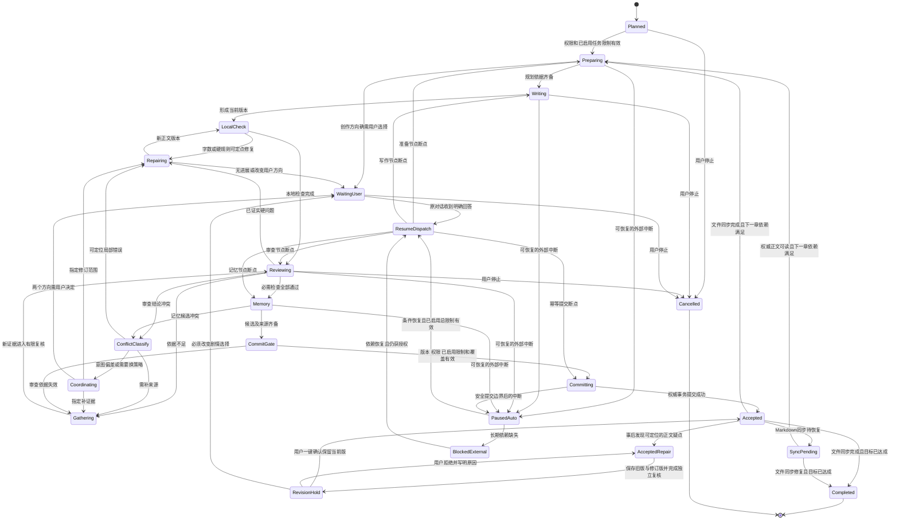

图展示主要分支。每个持久化节点都应能按输入版本恢复，包括本地检查、补证据、冲突分类与文件同步；其他运行节点收到用户停止也在安全边界进入`Cancelled`。`Accepted`仅表示权威提交成功；`SyncPending`须在界面说明文件尚未同步。已接受正文和下一章依赖可从权威存储读取时，可继续当前任务并在后台修复派生文件；若依赖来源不可读则保持等待，不能靠图中连线强行续写。已启用的任务调用/token限制耗尽、权限撤销或用户停止均不能触发自动恢复；费用观测不形成金额门禁。

`RevisionHold` 是已接受正文事后修订的额外依赖门禁：保留旧版本，向用户展示原疑点、当前改动和模型复核依据；模型判为通过后也不自动写下一章。用户认为合适可一键保留当前版，拒绝时填写具体原因并只重做受影响节点。用户的通过是用户决定，不能回填为模型审查通过。仅在正文来源版本和文件投影仍一致时接受这个决定；冲突证据已变化而无法定位时仍保留待确认状态，不以空白引文放行。

| 错误 | 动作 | 停止条件 |
| --- | --- | --- |
| 网络、429、暂时服务失败 | 尊重Retry-After，退避和抖动，Provider单层重试 | 依赖长期不可用或任务预算不足 |
| 非关键额外JSON字段 | 可审计的白名单归一化 | 不静默丢弃冲突或权限相关字段 |
| 缺关键字段 | 有范围格式修复 | 一次修复仍无效，保存断点 |
| 字数不足 | 按场景补足到区间，重新计数 | 两轮无进展后切换允许策略，仍失败暂停 |
| 剧情问题 | 定点修订，复核受影响范围 | 需改变用户方向或达到修订预算 |
| Agent 结论分歧 | 对齐版本与证据，Coordinator 选补证据、局部修订或专项复核 | 有两个无法兼容且无用户授权可选择的剧情方向 |
| Coordinator 意图偏差 | 回看用户原话并修正 TaskTicket，只重做偏差节点 | 用户原话本身存在实质歧义 |
| 记忆候选冲突 | 分开事实、人物信念和未证实传闻，定向解析 | 真实正史互斥且不能在当前授权内改动 |
| 请求切片达到上限 | 新切片续跑 | 整项任务预算到顶不能继续 |
| 用户停止 | 停止后续派工，取消可取消调用 | 不自动重启 |
| 进程崩溃 | 有界后端重启，按已持久化节点恢复 | 连续崩溃停止并报告具体原因 |
| 磁盘满、凭据错误 | 保存可保留的进度，给操作入口 | 不重复无效重试 |

默认两轮内容修订、一次格式修复可作为初始工程参数，须与总预算一起验证，不宣称最优。计算正文哈希变化和未解决问题数量识别“无进展”，不能只按轮次机械循环。

“自动修复”不授权小说Agent自行改源码、执行任意shell或安装依赖。开发者修复重复缺陷，运行时选择白名单恢复策略。

### 10.1 中断后仍然连续工作的机制

当前代码已有有限基础：章节恢复路径会对一次 `unknown` 审查进行证据复核；记忆补丁发现冲突会进行一次定向自解析。它们耗尽后仍可能返回失败或抛出错误，用户看到的状态与可继续动作未形成统一协议。新的协调层应接住这些结果，不把“本节点无法自动消解”写成“整项小说任务终止”。

每个节点保存 `workflow_id`、`task_revision`、`chapter_no`、`node`、输入哈希、输出版本、状态、已尝试策略、费用和下一步。状态至少区分 `running`、`resolving_conflict`、`paused_auto`、`waiting_user`、`blocked_external`、`completed`、`cancelled`。故障重启先读取持久化状态，再执行当前失败节点；用户回复只更新等待中的问题，不从第一章重新开始。

错误展示以“原因 → 当前处理 → 结果/所需动作”呈现：

- “第 8 章的时间线与第 5 章正史不一致，正在核对原文和人物视角。”
- “已确认这是人物撒谎，并非事实冲突；继续校对第 8 章。”
- “两种结局会分别改变第 12 章的伏笔回收，现有设定无法决定。请选择 A 或 B；前 11 章和当前草稿已保存。”
- “模型服务暂时限流；将在 20 秒后重试第 8 章的审核，不重新写前 7 章。”

用户应始终看到当前阶段、已尝试动作、是否会自动继续和完成比例；详细证据留在诊断抽屉，不能伪造隐藏思考逐字输出。提问时 UI 展示两三个自然语言选项和自由输入；用户回答后解除 `waiting_user` 并自动继续依赖步骤。用户明确点击停止时进入 `cancelled`，不会被恢复调度器自动唤醒。

本设计借鉴 [LangGraph 官方错误分类与断点模式](https://docs.langchain.com/oss/javascript/langgraph/thinking-in-langgraph)：瞬时错误重试、模型可修错误带反馈回环、需人处理的缺信息以中断保存；借鉴 [Temporal 官方重试原则](https://docs.temporal.io/encyclopedia/retry-policies)：重试失败活动而非整条工作流；借鉴 [OpenAI Agents SDK 的暂停/继续模式](https://openai.github.io/openai-agents-python/human_in_the_loop/)：等待用户决定的运行状态应可序列化并从原任务恢复。这些是机制参考，当前阶段先在既有 Python/SQLite 引擎内实现，不因为引用资料就增加新依赖。

## 11. 费用、缓存与上下文

### 11.1 费用观测与训练验证子额度

- 创作/训练项目只做费用观测，不设置固定或可选金额上限；金额或余额不是正常写作的门禁。日常创作、审查、聊天与训练验证均跨小说、章节、角色、重试及重启持久记录费用。
- 执行切片预算：控制一次后台执行的资源占用，可续接；不等同于总金额限制。
- 整项任务资源预算：已启用的调用/token限制跨所有切片、角色、重试累计，不得自动重置。
- 专项加强资源限制：约束新增步骤及无进展修订；不设置金额门禁也不允许无限重试或默认多角色全跑。

未知usage保留未知标记和待核算记录，不当作零，也不因未知费用或估算金额阻断正常写作。客户端超时可能已产生服务端费用，未支持幂等的API不能保证恰好一次计费。

真实token限额不采用缓存折扣。费用由Provider、模型、缓存命中输入、未命中输入、输出及价格快照估算，禁止固定0.1当通用价格。

用户已同意将**训练验证额度**与**日常创作调用**分开：每部小说最多5次远端付费模型API训练成果验证请求，每次实际输入与输出原始token合计不超过500,000，缓存命中输入仍按原始token计数；本地清洗、离线评测、LoRA的epoch/step/检查点和纯本地推理不占这5次，单次本地训练作业累计仍以12小时为上限并允许早停。日常正文、必要审查和聊天可按工作流调用远端DeepSeek，不占训练验证的5次；两类请求统一记录真实费用，并遵守已启用的任务调用/token限制，不设金额门禁。训练中的额外远端rollout、素材批量付费语义分析、云GPU或托管训练仍按原范围默认关闭；若确需启用，必须先明确用途、调用范围、费用和授权，不能伪装成日常写作或免费的本地训练。一个验证动作若分成两个API请求就占两次；发出后重试也占一次，除非供应商明确证实前次未受理。引擎须按`novel_task_id`持久化`training_validation_calls_used`，并持久化所有远端请求的`raw_input_tokens/raw_output_tokens/cache_hit_tokens`、价格快照和实际/估算人民币费用。验证请求原子预留名额及单次token上限，发出后未知结果保守占用验证名额；重启或切片续跑不能清零这些记录与已启用限制。500,000是验证请求的上限而非目标，也不表示供应商或当前软件允许单次输出这么长。

### 11.2 DeepSeek命中率

保留目标：日常连续Writer输入缓存命中率争取80%以上，同时关注每个合格章节成本。目标尚未验证，不承诺每次请求达到。

连续远端Writer请求仍可按真实样本观察日常缓存目标；训练验证最多5次，其样本与日常写作分开展示，不能拿少量验证请求冒充“日常80%”。缓存命中可降低费用，但不减少验证请求次数，也不从费用账本中抹去实际支出。

按角色、任务模式、模型和前缀版本组织：
1. 固定角色边界和输出Schema。
2. 稳定规则、设定、大纲、剧情细纲。
3. 本章相关正史、近期计划、执行卡。
4. 当前正文、问题和具体任务。

动态run ID、时间、调用统计不放模型稳定前缀。稳定序列化和来源排序；用户改变设定必须更新内容，即使命中暂时下降。

专项Reviewer只接收相关证据及必要上下文。所有模型调用最终接收一个编译完成的Context Packet，不允许各工具私自追加不受控历史。

不合并角色提示词来强求跨角色缓存；不填无关文本、不付费预热刷指标。按sum(hit)/sum(input)汇总，并分别报告冷启动、首稿、修订、专项检查及未知usage。

DeepSeek缓存依赖服务端已持久化前缀，角色数量本身不保证命中。[DeepSeek官方文档](https://api-docs.deepseek.com/guides/kv_cache/)

#### 11.2.1 命中率下降的定位顺序

先区分三项指标：供应商输入缓存命中率、检索证据召回质量、用户对输出的接受程度。三者分别记录，不用同一个“命中率”按钮混淆。

1. **核对统计口径。** 保留原始usage，按`sum(hit) / sum(hit + miss)`汇总已知请求；单独展示usage覆盖率。不取各请求百分比的简单平均，也不把本地向量缓存当供应商输入缓存。
2. **核对请求是否可比。** 区分Provider、账号范围、具体模型、角色、任务模式、Schema、提示词版本及冷启动/连续写作/修订。首章与热缓存后续章、Writer与Reviewer分别看。
3. **定位前缀首次变化。** 记录区段哈希、字节长度与最长公共前缀；有匹配的tokenizer时再估算token长度。不能把本地字节比较当服务端实际命中；实际结果仍以usage为准。
4. **检查伪稳定区段。** 本项目J2按任务选择声音偏好，K混入章节要求；这些内容变化会影响排在其后的长文本。将角色协议、稳定风格契约、卷级资料快照与本章偏好增量/输出目标分开，不仅调整区段名字。
5. **检查间接修改。** 自动偏好更新、摘要重建、无意义重排序、每章加入统计、外部Proxy重写system消息和模型切换，都要记录是否改变前缀。不要把服务端淘汰缓存误报为程序错误。
6. **再决定修复。** 排序不稳定则稳定序列化；章节变量提前则移至动态区；上下文过大则裁掉无关资料；必要设定变化则正确更新并标注失效原因，不保留错误旧设定来追求命中。

DeepSeek文档说明缓存按输入前缀复用、尽力提供，并存在构建和清理时间；不能由应用承诺每次80%，也不能把某个SDK缓存参数当作官方API保证。[缓存行为依据](https://api-docs.deepseek.com/zh-cn/guides/kv_cache/)

#### 11.2.2 缓存与个性化共同生效

稳定前缀候选顺序：角色/Schema版本 → 生效的项目硬规则 → 已发布风格契约 → 相关卷级资料快照。动态区包含人物当前状态、相关正史增量、近期计划、检索原文、本章要求、局部改稿与临时偏好。以上均编译成一个Context Packet，按相关性取舍，不要求把整部小说放到前缀。

一次任务固定已发布偏好与提示词版本。后台学到的新偏好先成为候选，任务结束或明确切换的安全节点才生效；用户本轮明确要求立即进入当前任务，并覆盖相应旧偏好。必要纠错立即更新，不能等待“缓存周期”而继续写错。

按一段正常连续创作统计：若稳定可复用输入为S、当前变化输入为D，理想热缓存占比近似`S / (S + D)`；这是忽略服务端淘汰等因素的估算上限。要到80%需约`S >= 4D`，但不得为了比例扩大无关S。优先减少D中的重复证据与无用历史，同时衡量总成本和质量。

每个合格章节成本包括首次生成、修订、审查、记忆提取、额外检索服务及分摊的优化成本；按Provider价格快照计算`命中输入×命中价 + 未命中输入×未命中价 + 输出×输出价`。后台优化和训练也记录费用并遵守获准的调用范围，不能以“学习”为由绕过授权。不设置金额门禁不改变有界重试与训练授权。80%继续作为日常连续Writer的目标；较低命中但更少输入、更少返工时，明确报告实际节省，不补无用token刷高比例。

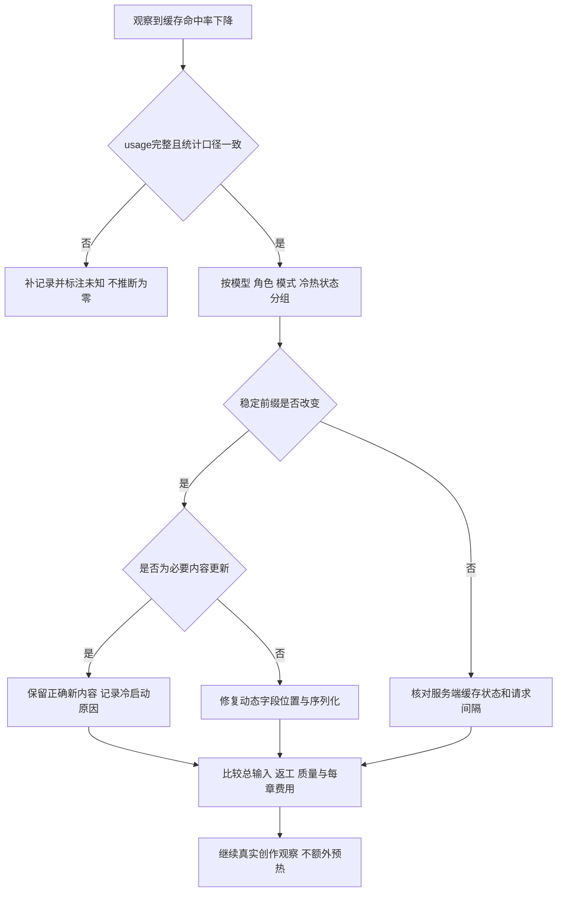

### 11.3 质量与字数

首稿直接要求完整目标区间，补写直接要求填满剩余合理缺口，不故意分多轮。中文字数与token分别计量，不能把token比例当小说字数完成率。

项目明确禁用的符号作为硬规则；标点密度和句式重复作为建议。语义改写由Writer完成，不能机械替换所有逗号。

作者样稿与 Humanizer-zh 的共享表达适配见 `INKFLOW_AUTHOR_STYLE.md`：Writer及修订使用同一静态偏好，审核保留作者声音，Coordinator准确转交要求；不新增润色角色或默认额外调用，不冒充参数微调。

### 11.4 小说质量：把创作依据落实到真实正文

研究给出方向而非墨流的效果保证：Re3将总体规划、当前故事状态与局部修订结合；DOC研究细化大纲与生成控制对连贯性的作用。这些较早研究的篇幅、语言、模型和实验环境与墨流不同，不能把论文提升比例写成18章中文小说的验收结果。[Re3论文](https://arxiv.org/abs/2210.06774)、[DOC论文](https://arxiv.org/abs/2212.10077)

墨流实施时使用以下步骤，产出复用到已有Writer/Editor调用中，不为每一项另开Agent：

1. **先理解作者意图。** 明确题材、视角、读者体验、主角欲望与不能改变的内容。Coordinator可以讨论走向，具体大纲和正文仍由Writer产出。
2. **大纲后逐卷生成细纲。** 大纲覆盖全书主线、背景、主要场景、重要高潮和结局，约 5,000～25,000 字，不强制逐章。每卷细纲约 5,000～25,000 字，卷容量至少 10 章，包含主支线、人物、详细场景、冲突、伏笔、因果及粗粒度章节走向；按卷分步细化到结尾，而不是把全书细纲压成一轮请求。
3. **从生效依据推导近期章节规划。** 计划逐章记录人物、场景、核心剧情、前因后果、伏笔、钩子与收尾，约 250～500 字/章；默认连续 10 章，可在设置或本次请求改动。可以跨卷但须明确标出边界和使用相应卷细纲，默认建议单卷内完成。调整细纲只使相关未来计划失效，不推翻已接受正文。
4. **写前明确场景的作用。** 人物为什么行动、知道什么、受到什么阻碍、做了什么选择、付出什么代价以及局面如何变化。安静日常、抒情和铺垫也可有效，不强制每场冲突或每章反转。Writing Excuses对人物动机和目标的讨论可供创作参考，不能变成统一扣分模板。[作者经验](https://writingexcuses.com/20-07-lens-3-identity-2-motivation-goals/)
5. **选择少量真正相关的文笔依据。** 从用户指定且可使用的作品及其修改中整理叙述距离、对白潜台词、动作细节、感官选择和节奏；必要时检索短片段展示写法，不将整本小说逐章送给模型，也不把参考人物剧情移植进本书。
6. **按场景承担的任务分配篇幅。** 关键转折展开过程，过渡适当简略；结合目标中文字数检查是否只有梗概、是否重复解释。节奏研究说明事件展开粒度值得单独关注，但墨流不照搬“各段等长”。[CONCOCT节奏研究](https://arxiv.org/abs/2311.04459)
7. **Writer尽量一次给足完整正文。** 字数按本项目明确口径统计，不含标题、日志和说明；token只用于容量和费用估算。未达到范围时定位缺少的场景发展或有效细节，定点修订，不使用无意义铺陈填数。
8. **Editor先阅读再给可执行意见。** 检查人物行动与动机、因果、场景连续性及用户指定表达要求；列明证据和影响。文风建议保留选择余地，不用“标点少”“句子短”替代自然性，不用模型自报分数证明文学质量。
9. **把用户修改变成可解释反馈。** 同时记录用户改了哪里、理由、是否仅适用当前角色/作品。下次Writer拿到相关偏好和一两个有依据的修订示例；没有证据就不推断用户永远讨厌某种写法。

日常保留一个当前最终候选；用户主动索要备选时才扩大生成。字数、格式可自动检查，感染力、趣味和是否符合用户审美仍需真实阅读反馈。学习目标是帮助用户保持自己的写法，并允许临时换风格。

## 12. 设置和用户体验

设置默认只显示模式：
- 日常省额：三角色，专项关闭；无法解决时保存进度说明原因。
- 智能加强：三角色起步，允许Coordinator在设定预算内选专项。
- 深度质量：四角色拆分审查与记忆，Editor不运行。
- 自定义：设置专项范围及五角色分工。

初次默认日常省额；用户主动启用智能加强后不对每次合规调度重复确认。当前明确指令可覆盖任务级模式，但不能突破凭据权限或已启用的调用/token限制。

高级配置展示五角色，各自显示“继承默认”或独立模型。不要要求日常用户填写五套API Key。

墨宝状态由真实事件驱动：理解、读取、写作、校对、整理记忆、修复、等待、完成。默认只显示简短原因，例如“这一章涉及时间跳跃，增加一次连续性检查”；诊断抽屉才显示调用量、角色、版本和错误。

布局为左侧文件树、中间正文、右侧对话；Coordinator 对话支持日常聊天、后续发展讨论、设定修改、写作请求分派和长工作流。具体正文由Writer生成，短草稿也不例外。规划文档类型分开。草稿默认只显示当前候选与接受版本，可配置中间版本保留数量，保护引用和恢复依赖。电脑操作总开关默认关闭，开启后每次操作弹出可读预览确认，不以内部工具名代替风险说明。

语音安装保持独立后台任务，成功通知，有残留即可删除；Windows后端隐藏启动、单实例、有界恢复。五角色改造不能阻塞这些已有使用流程。

### 任务完成、报告与恢复引导

任务事件统一携带任务/节点标识、输入版本、当前状态、已完成产物、未完成事项、可读原因、已尝试修复、下一步动作和诊断引用。完成正文后报告可直接打开对应章节；没有正文产物的讨论或设定任务则打开其实际成果，不展示虚假的“已生成章节”。重启后从持久状态重建同一结果卡，不把旧事件当成新任务，也不丢失用户已回答的问题。

主界面只显示结果、一个最相关的操作和简短原因，详细证据、角色记录、用量与错误放在展开区。完成时可查看成果或按原目标继续；有附属同步警告时可先看成果并单独修复同步；修复中显示当前节点与已尝试动作；需要创作选择时在原对话给出少量具体选项并保留断点；缺凭据、权限或环境条件时说明如何处理并提供“条件满足后续跑”；用户主动停止后只能手动恢复。真正不可恢复的错误给出受影响范围和可导出的诊断，不把软意见或一次模型分歧归入这一类。

| 结果状态 | 主操作 | 自动行为 |
| --- | --- | --- |
| `completed` | 打开实际成果 | 只在原任务已授权范围内继续后续节点 |
| `completed_with_pending` | 查看成果并修复附属待办 | 只重试未完成的同步或索引，不重做正文 |
| `repairing` | 查看当前修复或停止 | 有界处理当前失败节点，进度持续可见 |
| `waiting_user` | 在原对话回答具体选择 | 回答绑定原冲突后从断点续接 |
| `waiting_condition` | 查看缺失条件并在修复后续跑 | 条件未恢复时不空转调用模型 |
| `stopped_by_user` | 手动恢复 | 旧请求失效，不自动启动 |
| `failed_unrecoverable` | 查看影响范围和导出诊断 | 不自动重试相同输入与策略 |

引导按钮只能触发与当前状态和授权相符的动作；每次点击绑定任务版本并具有幂等键，避免双击或迟到响应重复生成、重复提交。报告要区分“已完成”“部分完成可续接”“等待用户”“等待条件”和“失败”，不能用一句“任务结束”掩盖真实结果。该接口是目标设计，现有桌面界面和恢复流程仍需按第5、12、14步接入，不能因本段文档更新宣称已交付。

### 12.1 软件内文件管理与草稿转正文

这是墨流项目工作区的原生能力，不依赖“高级电脑控制”开关。用户可直接在软件内新建、编辑、重命名、整理和删除小说文件，包括设定、大纲、剧情细纲、近期计划、执行卡、草稿和章节正文；Coordinator 也可根据明确自然语言指令发起相同操作。高级电脑控制只负责墨流工作区以外的桌面应用与电脑操作。

#### 用户操作与内容状态

| 操作 | 软件行为 | 需要展示的信息 |
| --- | --- | --- |
| 新建文件 | 选取文件类型和章节/卷归属，使用对应模板创建；允许空白新建 | 类型、位置和是否加入当前项目索引 |
| 编辑文件 | 保留当前内容版本；自动保存并记录版本差异 | 保存状态、冲突提示、撤回入口 |
| 草稿转正文 | 用户选草稿和目标章节，预览完整替换/合并结果，明确执行“设为本章正文” | 原正文与新正文差异、字数变化、影响到的审核/记忆/后续章节 |
| 删除草稿或文件 | 移入软件回收站，保留原路径和版本关系 | 删除对象、关联影响、恢复期限/方式 |
| 删除正文或设定 | 支持删除；执行前预览受影响的大纲、人物记忆、伏笔、章节与审查状态；默认可恢复 | 受影响清单、是否会让后续工作失去依据、恢复操作 |
| 永久清空 | 与普通删除分开操作 | 明确显示不可恢复、精确目标和数量，并单独确认 |

草稿转正文创建新的章节版本并保留草稿原件及先前正文，不覆盖历史。该操作表示用户选择这份内容作为章节正文；章节是否同时成为“已接受正史”，仍按项目验收设置处理：若已有有效审核和用户授权可完成提交；否则成为当前正文候选并触发所需审核。界面明确区分“当前正文”和“已接受正文”，不让用户误以为改文件名就等于审核通过。

删除必须真的能在软件中完成，不能要求用户去资源管理器手动删。对误删的主要防护是应用内预览、版本快照、回收站和恢复；不因风险提示而禁掉正文/设定删除。用户要求立即删除时执行软删除并提供撤回；永久清除需在专门确认窗口再次显示不可恢复的后果。

删除或替换设定/正文后，项目索引要标记引用它的上下文、计划、审查和记忆候选失效。用户恢复文件时，按版本重建依赖；不能静默把删除文件的记忆事实继续当作有效正史，也不能在引用未同步时启动下一章。

#### 操作流程

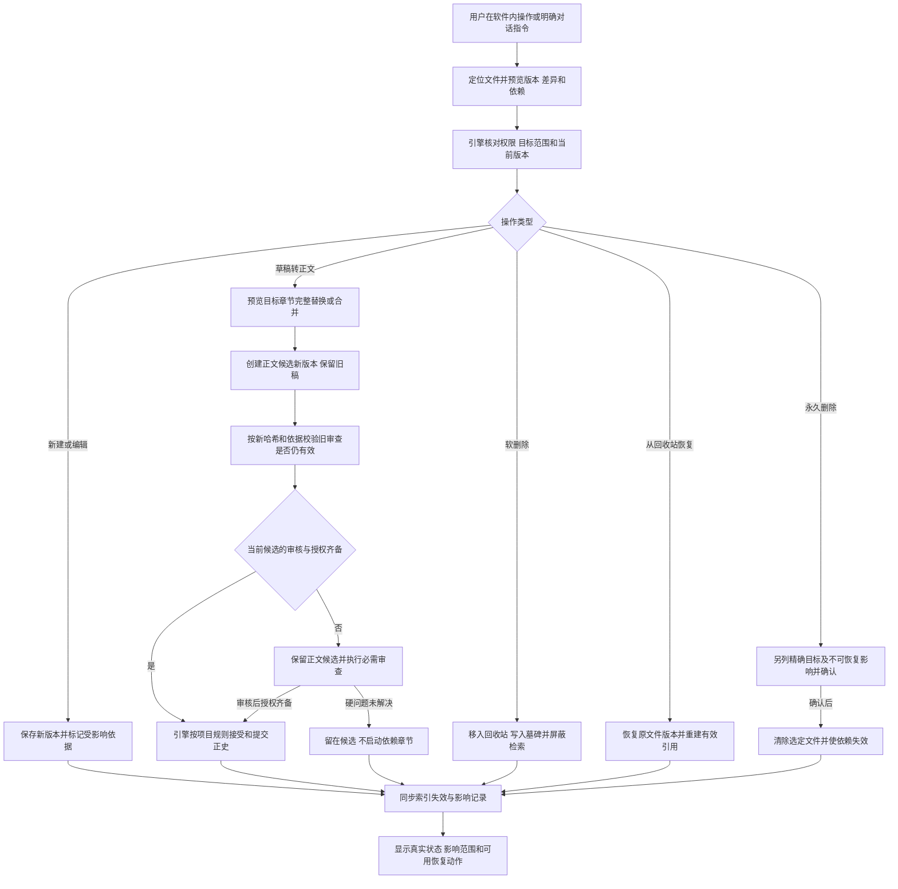

软件内文件操作不需要开启桌面电脑控制。草稿转换后的新内容只有在同版本、同依据的有效审查和授权齐备时才成为已接受正史；旧章审查不会因文件名相同自动沿用。软删除或编辑导致的来源失效先阻止错误上下文，再异步修复可重建索引；永久删除仍遵守单独确认和受影响范围检查。

#### 风险和异常处理

- 删除/编辑前比较当前文件版本与预览版本；期间发生外部改动时显示冲突，不覆盖新内容。
- 批量删除逐条列出文件，支持取消单项；执行范围必须与预览一致。
- 回收站中的正文和设定不参与上下文检索或新章节生成。
- 若无法安全更新引用索引，先保存文件操作记录并暂停依赖它的写作；恢复任务补齐索引后继续。
- 软件内操作不要求用户开启桌面控制；只有打开其他桌面程序或操作工作区以外资源时才走高级电脑控制开关与逐次确认。
- 日常编辑和草稿转换尽量一步完成，不额外要求 Coordinator 多轮复述；提交按钮处展示真正影响状态的差异。

### 12.2 语音无法朗读与效率低：0.7.0专项

**2026-09-28 语音用途路由补充：**设置分别记录输入识别（本地 SenseVoice / 浏览器实时识别）、对话回复朗读、普通文本转语音、正文/草稿听读（后三者各选 Edge 在线或本地 MOSS）。Edge 连接组件作为核心依赖随安装包预装，后三项默认选 Edge；安装状态与用途选择分别管理，缺件修复按钮不改写选择。语音输入默认未选用；旧 `voice_engine=qwen` 字段不再作为路由依据，不删除 Qwen 已下载资源。短语音按请求用途路由，听读任务按来源类型选引擎并把选择写入任务清单，避免设置变更后续做时无声切换。Edge 文字外传需在设置说明，返回 MP3 留在本地任务目录；克隆声音只能选本地 MOSS。`edge-tts` 是第三方在线接入，免费性、接口稳定性及分发许可不由本项目保证。真实语速、首音延迟、音质及安装包兼容性仍需实际使用观察，不能把代码接入写成已验证可用。

本节处理用户报告的“读不了、很慢”。本次只做静态代码核查，未启动模型或播放音频，因此不声称已复现某台设备的唯一根因，也不把问题一律归因于安装包。

#### 12.2.1 已有基础与可定位问题

| 位置 | 代码事实 | 对计划的影响 |
| --- | --- | --- |
| `voice.py::install_* / _background_install` | 已有后台安装、进度和通知入口 | 复用任务机制，重点核对真实就绪状态、失败原因与重启恢复，不重复开发下载中心 |
| `voice.py::speak` | 等待同步合成完成才返回完整音频路径；单条上限4000字 | 长消息需等待全部合成；UI应自动选择分段任务并优先播放首段，不能只返回上限错误 |
| `voice.py::_synthesize_moss_sync` | 已缓存模型对象；虽向运行库传`streaming=True`，仍收集所有句子后拼接写完整WAV | 已有模型复用，但应用层尚非端到端边生成边播放；不能只靠打开底层streaming参数宣称首音延迟解决 |
| `voice.py::transcribe / speak / _run_job` | 语音识别、短朗读和长任务共用推理锁 | 有资源串行保护，但短交互可能等待长片段；按真实排队时间决定调度优化 |
| `voice.py::_synthesize_with_recovery_sync` | 任意异常都会清模型再重试一次 | 缺文件、配置错误等也会重复成本高的加载；需分错误类别，只对可恢复故障重试 |
| `voice.py::cancel_job`与`asyncio.to_thread`调用 | 取消外层异步任务，底层合成在线程内进行 | 不能据此保证同步推理停止；需检查线程完成前资源租约、状态写回和新请求并发 |
| `desktop/src/App.tsx::speakText / playAudioPath` | 同一状态表示生成和播放；生成请求没有可见的取消标识校验 | 用户停止/切换后，迟到响应可能开始播放；须分开请求状态、播放状态及请求代次 |
| `voice.py::speak / transcribe`与长任务 | 短接口读全局设置，长任务读项目设置 | 核对工作区设置语义；避免界面选项与实际生效引擎/设备不一致，尚不能认定这是用户当前故障原因 |
| `_moss_execution_provider`及播放器 | 有设备选择、音频URL、`setSinkId`和`play()`等环节 | 逐段确认真实执行设备与播放错误；安装成功不等于GPU可用，也不等于声音已播出 |

浏览器播放可能通过Promise拒绝，UI应根据实际结果更新状态；设备可用性与模型会话实际执行Provider也需要分别核对。[MDN播放接口](https://developer.mozilla.org/en-US/docs/Web/API/HTMLMediaElement/play)、[ONNX Runtime API](https://onnxruntime.ai/docs/api/python/api_summary.html)

#### 12.2.2 分步实施与真实正文验证

**V1：记录从点击到听见声音的完整路径。** 在`voice.py、app_server.py、App.tsx、VoiceCenter.tsx`记录请求ID、项目设置快照、选用模型与版本、实际设备、排队/加载/首段合成/首次播放/总耗时。错误显示阶段、直接原因、已做恢复与可用下一步。分别诊断朗读TTS和输入识别ASR，避免把识别模型已安装当朗读就绪。

**V2：修复播放与取消状态。** 用`queued/loading/generating/buffering/playing/paused/completed/failed/cancelled`表达任务，按钮根据当前状态执行明确动作。用户停止后增加请求代次或取消令牌，忽略旧请求迟到音频；只在`play()`成功后显示正在播放。音频URL、文件格式或输出设备失败时重试播放层，不重新合成正文。

**V3：将长文本统一映射到分段任务。** 直接复用已有长篇任务清单和恢复点；根据句子与段落切分，保留引号、数字和人名读法。首段适当短，后续按测得的合成速度与音频时长调节。无需额外生成试听文案，使用用户当前正文或对话；超过短接口上限自动进入同一用户可理解的后台朗读流程。

**V4：实现真正的首段可播放。** 一个合格音频段完成后即发布带序号、来源文本哈希和音色版本的事件，播放器按序消费；后续采用有上限的预取队列。模型仅支持完整小段时采用小段流水线，不假称token级流式。段间处理采样率、音量、停顿和衔接，避免降低延迟后产生明显断裂。

**V5：按资源调度。** 在同一GPU上采用可控串行队列，短交互在片段边界获得优先级，长任务也保留进度与公平调度；不随意删掉锁并行加载模型。CPU识别能否与GPU朗读并行由实际资源和线程安全决定。请求取消后，底层线程尚未结束时不能释放设备租约让下一段同时进入；需要强制终止或隔离崩溃时再使用可管理的独立工作进程。取消协程与停止同步计算不是同一个动作。[Python异步任务说明](https://docs.python.org/3/library/asyncio-task.html)

**V6：校验模型与依赖真实就绪。** 状态分为有残留、下载中、文件完整、运行库可加载、可初始化和可合成；安装成功通知包含实测达到的阶段。核对文件清单/校验、运行库版本、实际Execution Provider和一次正常朗读结果。只有证据指向文件损坏或依赖缺失才修复对应组件，不能把“全删重装”当通用解决办法。

**V7：保留模型复用并减少重复合成。** 现有已加载模型缓存继续用；音频缓存键包含标准化后的朗读文本、文本处理版本、模型/权重版本、音色/参考音频哈希、语速及影响输出的设置。使用原文版本判断是否失效，正文改动只重新生成受影响段；用户明确要求重新生成时绕过缓存。空闲释放策略依据资源占用，避免每段加载/卸载抖动。

**V8：错误分类与后台恢复。** 暂时资源错误允许有限恢复；缺文件、权限、音色不兼容等提供准确入口。GPU不足时仅在既有自动策略允许时降低并发或切换可用设备，并提示速度/音质影响；不能悄悄换成云语音或产生新费用。合成成功但播放失败保留可用音频，重启只恢复未完成段。

**V9：残留可删除，过程可控。** 删除按钮按实际本地文件存在启用，包括未完成下载和失败暂存；先取消有关安装/合成并等待文件句柄释放，再删除已确认的组件范围。已有声音档案、用户录音和完成音频分开管理，避免“删模型”误删用户作品。后台安装可离开设置，成功/失败通知；墨流完全退出后的行为明确显示，不声称进程退出还能自动下载。

**V10：在本卷实际朗读中验收。** 选用户本来要听的段落与整章，记录冷启动/热启动首音延迟、排队时间、实时率`合成耗时/音频时长`、段间间隔、取消响应和听感。观察真实暂停、继续与切换音色；必要恢复回放用已存任务副本。先取得设备基线，再定可达到的延迟目标，不能凭模型名称承诺秒开或默认GPU一定更快。

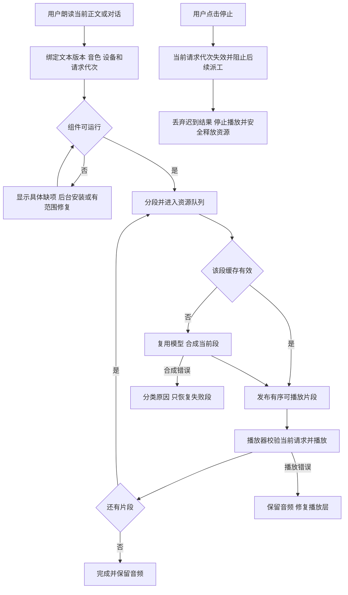

语音专项属于0.7.0核心可用性工作，可在训练和外部记忆评估之前完成。语音错误不得取消小说正文生成任务；小说训练任务也不能抢占朗读全部资源。

## 13. 旧协议迁移：重点风险

现有 reviewer=综合Editor，而目标 reviewer=专项Reviewer。这是语义变化，不能直接改标签。

迁移步骤：
1. 引入架构/角色映射版本，例如role_registry_version=2，读取缺省按旧版解释。
2. 未标版本的旧reviewer配置迁移到新editor；新专项reviewer和memory_keeper继承默认配置并保持按需启用。
3. 如果配置已存在明确专项角色或来源不清晰，不覆盖；标记为待映射，旧任务按旧协议运行。
4. 旧日志保持原始role字段，展示时用协议版本解析为legacy_editor；不批量篡改历史。
5. 历史通过记录按旧契约解读；不能拿旧Editor结果冒充新专项检查已完成。
6. 活动任务固定配置/策略快照；设置变化默认影响新任务。中途变更需增加task_revision并重算受影响节点。
7. 新写入用明确editor/reviewer/memory_keeper标识；兼容层只位于边界，不扩散到每个模块。
8. 在可恢复边界切换版本；不混跑旧半成品与新Schema。
9. 保留迁移前配置快照和可读备份，回退时识别新任务，不让旧运行时误解释新状态。

## 14. 分阶段实施清单

本节A—F是模块索引。费用观测与数据恢复基础优先完善，但固定金额门禁不是继续正常写作的前置条件；训练验证启用前须落实独立次数和 raw token 门禁。后续 L、S、T、V 编号用于展开同一项任务，不代表额外重复开发阶段。

### 阶段A：契约与兼容

A1. schemas.py：增加角色映射版本、Mode、CheckCoverage、执行计划和分角色结果契约。
- 依赖：无。
- 完成：旧配置明确映射，专项Reviewer不被强迫输出memory_patch。

A2. config.py、App.tsx的角色类型：新增五角色配置继承和模式字段。
- 依赖：A1。
- 完成：旧reviewer设置进入editor，原Provider和模型不丢失，默认日常三角色。

A3. prompts.py、coordinator.py：分离Editor与Reviewer提示词、能力和工具权限。
- 依赖：A1。
- 完成：五角色定义一致，Memory Keeper只能提出记忆变更，引擎唯一提交。

A4. schemas.py、trace.py：定义版本绑定的 ConflictRecord、冲突类别、处理动作和公开状态事件。
- 依赖：A1。
- 完成：每次分歧都能记录双方说法、证据、已尝试策略与下一步；旧日志仍能读取。

### 阶段B：确定性调度

B1. coordinator.py：以现有工作流模板表达五种模式，增加检查覆盖验证。
- 依赖：A。
- 完成：deep中不调用Editor；日常不调用专项；full_specialist有非重复检查范围。

B2. terminal_session.py、coordinator.py：区分聊天、创意讨论、设定修改、Writer短草稿请求、电脑操作和长工作流；保留否定、补充、范围与质量语义。
- 依赖：B1。
- 完成：原话可追溯；“先别写”不误派工；设定明确修改形成新版本；试探讨论不改文件；短草稿请求路由Writer并进入分支；普通节点不重复调用Coordinator。

B3. runtime.py、app_server.py、database.py：持久化跨小说费用观测账本、每部小说训练验证5次/单次50万原始token子账本、任务与专项调用/token限制、停止标志和模式快照；不设置金额门禁。验证名额和raw token请求前预留、请求后结算；未知usage标记待核算。
- 依赖：B1。
- 完成：日常写作不扣训练验证次数，日常与验证都记录费用；不会因旧金额阈值或未知费用中断写作。自动续跑不重置累计记录、验证子额度或已启用任务限制，用户取消不恢复。

B4. coordinator.py、terminal_session.py：增加冲突协调决策，只在意图偏差、实质分歧或策略切换时调用 Coordinator；用户在原对话的回答绑定等待中的问题。
- 依赖：A4、B2、B3。
- 完成：Coordinator 在预算内选择补证据、局部修订、专项复核或向用户提问；不能直接替审查放行，也不重复未改变的调用。

### 阶段C：审查、记忆与恢复

C1. engine.py、review_verifier.py：实现三态审查、范围覆盖、冲突去重与有界复核。
- 依赖：A1、B。
- 完成：insufficient_context不放行，硬问题不被多数票覆盖，下一章受依赖门禁约束。

C2. engine.py：接入memory_owner，复用有效候选，专项抽取失败只重试专项节点。
- 依赖：C1。
- 完成：每个范围只有一个候选权威来源，候选仍经引擎校验。

C3. database.py、project.py：审计现有正文存储，设计幂等提交与文件同步恢复。
- 依赖：现有表和文件权威性核查。
- 完成：提交中断可恢复，无重复事实，无错误接受指针；必要迁移有备份和回退设计。

C3a. project.py、database.py、app_server.py：补齐项目文件索引、文件类型、版本/来源、回收站状态、依赖引用与恢复操作。
- 依赖：C3明确权威正文存储及文件同步协议。
- 完成：软件内可以新建/编辑/删除设定与正文；软删除可恢复，永久删除另有确认；索引不会继续读取已删除内容。

C3b. engine.py、app_server.py：实现草稿到目标章节正文的版本化提升。
- 依赖：C3a。
- 完成：预览合并/替换差异；保留草稿和旧正文；审核/记忆按版本哈希失效；已审且授权的正文才可成为接受正史。

C4. provider.py：错误类型、有限传输重试、可审计格式兼容和usage保存。
- 可与B的独立实现安排并行，但不授权自动启动开发子Agent。
- 完成：不层层重试，不能吞掉关键字段，未知费用可见。

C5. engine.py、database.py、app_server.py：把章节审核 `unknown`、多 Agent 分歧和记忆冲突接入统一冲突处理；保存失败节点及可恢复状态。
- 依赖：A4、B4、C1、C2、C3。
- 完成：可解决的冲突在当前节点修复并继续；真正需要创作选择时进入 `waiting_user`；回复后从原节点续接；用户取消与总预算耗尽不会自动恢复。

### 阶段D：成本优化与界面

D1. context.py、schemas.py、trace.py：角色/模式前缀、指纹、输入版本及逐次usage。
- 完成：能解释输入变化与命中变化，不以缺日志当作零费用。

D2. App.tsx、app_server.py：模式设置、当前参与者、简短加强原因、预算与进度；对话区支持聊天、设定修改、Writer短草稿请求和长工作流，并实现文件树新建/编辑/删除、回收站与草稿转正文交互。
- 完成：用户无需操作内部ID；文件操作展示版本差异、关联影响和恢复入口；草稿转正文保留历史且准确显示审核/正史状态。

D3. config.py、app_server.py、desktop/electron/main.ts、设置界面：电脑控制高级开关默认关闭；开启后每次操作有清晰确认预览并仅按确认清单执行。
- 完成：关闭时不执行电脑级操作；确认展示目标、完整路径、步骤、风险、费用/外传和恢复方式；计划扩大需重新确认；取消后零操作。

D4. Mascot.tsx、main.ts：真实状态动画、统一墨宝图标、后台恢复与通知。
- 完成：状态与事件一致，减少动态效果时有静态替代。

D5. App.tsx、app_server.py：展示“发现什么分歧、正在如何处理、何时自动继续”；需用户选择时在原对话展示简短选项及自由输入。
- 依赖：C5。
- 完成：用户看不到无解释的强制中断；每条等待状态都有可操作的下一步，详细证据仅在诊断抽屉。

D6. voice.py、app_server.py、App.tsx、VoiceCenter.tsx及必要Electron音频桥接：按12.2节V1—V10修复语音无法朗读、首音等待、取消竞态和组件就绪状态。
- 依赖：先有语音阶段观测，不依赖Tencent记忆、微调或全部角色迁移。
- 完成：实际正文能播放，错误有阶段原因，取消后不会迟到播放，长文首段可先听；按真实设备报告性能，不凭安装成功宣称已验证。

### 阶段E：在实际小说创作中验收与整理

E1. 以用户当前小说为主线，正常写作时记录原话、输入版本、正文、真实改稿、审查、记忆和费用；不另生成演示小说代替验证。该阶段的观测贯穿A—D的有范围实施，不必等所有改动完成才观察。
E2. 优先复用真实章节与自然形成的修订对。只有需要确认某项收益、且已有对应费用授权时，才对同一真实材料运行隔离对照，比较Editor与专项路径的漏检、漏记、费用和耗时；不能默认双跑每章。
E2a. 在真实软分歧、正史矛盾、意图偏差、中断和用户回复中观察恢复；必要时用已保存的真实快照副本回放。未出现的异常列为待验证，不故意破坏用户当前创作或用无故障冒充恢复成功。
E2b. 用用户实际要听的本卷正文验证语音，分别记录冷/热首音、实时率、排队、播放失败和取消。结果写清设备及实际模型。
E3. 完成相关行为验收后，只在有维护问题证据时拆分过大模块；每次一个领域，不把无关重构变成写完一卷的前置条件。
E4. 有引用检查后清理过时资源，不能删除小说、接受版本、恢复数据和Git历史。完整观测协议见17.9节。

### 阶段F：个性化与学习扩展

按17.8节L1—L8补基础，其中费用观测对应D1、历史快照对应C3，可提前穿插实施；不要等阶段E完成才开始基础记录。用户素材的场景方法库按17.12节S1—S10细化L4，并衔接L6和L8；目标驱动的写作路径作为0.7.0增量交付候选，是否进入首包取决于真实写作收益。L9的Tencent适配、L10提示词优化、L11参数训练、L12完整Agent训练分别有采用条件，不自动捆绑。学习服务关闭时A—E创作与语音仍可工作。

上述阶段是实施顺序，不是已完成记录。不得在用户只要设计时悄悄启动付费创作、模型下载或应用迁移。

## 15. 验收矩阵

| 场景 | 预期 |
| --- | --- |
| 默认续写 | 只有日常角色被调用，且正文有有效审查 |
| 日常聊天 | Coordinator 回答项目问题，不创建正文文件 |
| 明确修改设定 | 读取关联设定与伏笔，创建新版本并列明受影响规划 |
| 讨论可能的新设定 | 返回提案，不擅自写入正式设定 |
| 用户要求短草稿 | Coordinator整理人物与伏笔依据后分派Writer，生成隔离草稿，不启动整章流程 |
| 用户在软件内新建设定或章节 | 创建正确类型文件、模板和索引 |
| 用户编辑已存在正文 | 保存新版本，可查看差异并恢复前版 |
| 用户将草稿设为某章正文 | 预览后创建该章正文版本，保留旧正文和草稿；未审时标为正文候选 |
| 用户删除正文或设定 | 软件内移入回收站，显示依赖影响，支持恢复 |
| 用户永久清空回收站内容 | 显示精确文件及不可恢复说明，单独确认后删除 |
| 已删除正文仍被下一章上下文引用 | 写作暂停至索引/引用状态更新，禁止用已删除内容继续 |
| 电脑控制开关关闭 | 电脑级操作不执行，界面说明需开启高级功能 |
| 开关开启且本次未确认 | 展示具体预览；取消后没有文件或桌面变更 |
| 执行计划新增覆盖、删除或外传 | 暂停并重新确认更新后的清单 |
| 用户要求查时间线 | 仅相关专项升级，完成后回基础模式 |
| 用户要求梳理记忆 | Memory Keeper可以独立只读分析，不自动重写正文 |
| 深度模式 | Editor不运行，Reviewer与Memory Keeper职责完整 |
| 五角色模式 | 表达、逻辑、记忆范围分别明确，不重复完整检查 |
| 专项超预算 | 不擅自调用，也不悄悄省略用户明确要求；保留进度说明 |
| 用户中途停止 | 不发起新请求，不自动重启任务 |
| Editor通过但Reviewer发现硬伤 | 当前章修订，不生成下一章 |
| 审查缺依据 | 补证据或暂停，不转成pass |
| Editor与Reviewer对同一版本持不同意见 | 先核对证据和范围；软建议可降为提醒，仍有硬问题则局部修订/复核 |
| 模型误把人物谎言当作正史矛盾 | 按人物视角核实，保留有意设计并继续任务 |
| Coordinator误解用户只想局部改写 | 按原话修正任务，只重做偏差节点，不重写已通过章节 |
| 两种剧情方向均合理且不能兼顾 | 保存断点，在原对话提出一个可回答的问题；用户回复后继续 |
| 正文修改/规则变化 | 旧审查按依赖失效 |
| 记忆发现冲突 | 区分事实、信念与传闻；可解析误报自动处理，真实互斥事实交 Coordinator 协调或提问 |
| 同一冲突重复出现且无新证据 | 不重复收费调用，展示已尝试方案和下一步 |
| 应用在等待用户决定时重启 | 问题和进度仍在，用户可继续回答，不丢草稿 |
| JSON多非关键字段 | 本地兼容，保留诊断，不重写小说 |
| 任务切片结束 | 总预算内恢复原节点 |
| 提交后文件写失败 | 恢复文件同步，不重新生成章节 |
| 旧reviewer配置 | 映射Editor，不冒充专项Reviewer |
| Writer缓存 | 80%为目标，按真实usage报告，费用与质量同时评估 |
| 历史反馈导出 | 始终匹配当时正文及上下文；缺快照明确跳过，不读取当前文件冒充 |
| 用户接受与机器通过 | 分来源和含义记录，机器通过不自动成为文风正样本 |
| 个性化提示词更新 | 候选经真实材料评估，在允许的安全节点生效；用户当前明确指令及时覆盖旧偏好 |
| 外部记忆不可用或索引落后 | 回到本地权威来源，必要证据缺失才等待，不使用过期事实 |
| 撤销训练来源 | 阻止检索与新训练，标出受影响模型并停用或重训，不宣称删除文件即权重遗忘 |
| 点击真实正文朗读 | 可见准备/合成/播放阶段；长文先播可用首段，失败有直接原因 |
| 合成时停止或切换消息 | 迟到音频不开始播放，底层计算结束前保持资源状态正确 |
| 长听读与短语音交互竞争 | 在片段边界按优先级和公平策略调度，不无界并行抢设备 |
| 语音安装残留删除 | 有残留即可发起，先停止相关工作再删除限定组件，用户录音和正文保留 |

质量指标至少包含：关键事实漏提、错误事实入库、后续矛盾、硬问题误报、首次字数达标、每个合格章节费用、用户干预次数、自动冲突恢复率、无解释中断数、误放行率、恢复成功率和平均恢复耗时。没有样本依据不写百分比提升承诺。

## 16. 优缺点与边界

优点：
- 日常流程保持短，专项能力可单独升级。
- Coordinator能根据用户真正目标选择任务，不要求用户懂内部操作。
- 合并Editor可复用阅读；复杂记忆和逻辑任务可分开处理。
- 角色扩展不要求更换整个应用技术栈。

代价：
- 模式、角色和结果协议增多，迁移与组合覆盖更复杂。
- 调度误判可能浪费费用或漏掉必要检查。
- 同基础模型的多角色不保证独立纠错。
- 加强步骤可能增加时延；缓存率不一定随角色数改善。

控制方式是有限模式、明确触发条件、唯一检查责任、版本绑定、预算校验和有界策略切换。避免提供任意角色互相循环的开放调度。

## 17. 长期技术路线：个性化学习、记忆扩展与条件训练

### 17.1 何时评估Agent SDK

当公开开放任务显著增加，例如外部工具种类、第三方插件、自定义工作流和跨设备执行持续增长，现有引擎维护成本有具体证据时，重新评估专门Agent SDK。

评估步骤：
1. 记录现有引擎无法有效支持的任务，排除可用小改动解决的缺口。
2. 选择一个外围、只读、有范围的工作流做适配原型。
3. 对照工具权限、DeepSeek兼容、取消、持久化恢复、日志、费用和部署负担。
4. SDK通过适配器请求Novel Engine能力，不得绕过正史门禁。
5. 验收后逐步迁移，可回退；不一次重写生产流程。

当前保留Python异步引擎、SQLite、React/Electron。LangGraph节点断点与Temporal活动级重试可作参考，不据此直接添加依赖。[LangGraph文档](https://docs.langchain.com/oss/javascript/langgraph/thinking-in-langgraph)、[Temporal文档](https://docs.temporal.io/encyclopedia/retry-policies)

### 17.2 技术结论：哪些能实现，分别改变什么

可以实现“使用越久越理解用户”的产品，但必须区分记忆、应用层参数和模型权重。首选路线是复用现有引擎，先形成正确的记忆与反馈，再按真实创作表现决定是否引入更重的训练。下面是目标设计，不是已经完成的能力。

| 方式 | 改变的对象 | 与当前远端DeepSeek推理兼容性 | 适用位置与限制 |
| --- | --- | --- | --- |
| 偏好画像与检索增强 | 可编辑的偏好记录、参考片段、上下文选择 | 可通过现有请求上下文使用 | 首期重点；不能把推测偏好当硬指令，检索错误仍需处理 |
| 应用层参数学习 | 偏好排序权重、资料选择和已有恢复策略的排序 | 不要求改远端权重 | 可做轻量个性化；需真实反馈和保留验证，不把特征计数称为LLM训练 |
| 自动提示词优化APO | 版本化角色提示词或范围明确的任务模板 | 可使用受预算约束的推理调用 | 后台候选实验；频繁发布会破坏缓存，不能每写一章自动换全部提示词 |
| SFT配合LoRA/QLoRA | 自有基础模型上的可训练适配器权重 | 不能直接写进普通DeepSeek远端推理服务 | 有可训练模型、数据和硬件时用于Writer；需独立推理部署及回退 |
| DPO偏好优化 | 可训练模型/适配器对两种回答的偏好 | 同上 | 有同输入的真实优劣对后评估；不是拿两段任意小说比较 |
| Agent Lightning强化学习 | 可训练策略在完整任务轨迹中的行为 | 需要训练后端与可更新模型，不能靠普通API密钥更新远端模型 | 后期用于有可靠奖励的调度/工具任务；不作为文笔优化首选 |

LoRA是参数高效训练方式，SFT/DPO是不同训练目标，不能将它们当互斥的同一类开关。可以SFT+LoRA，也可以DPO+LoRA。QLoRA通过量化基础模型降低部分内存需求，但并不消除长序列、训练激活和推理部署成本。[TRL的SFT说明](https://huggingface.co/docs/trl/sft_trainer)、[DPO说明](https://huggingface.co/docs/trl/dpo_trainer)、[PEFT量化说明](https://huggingface.co/docs/peft/developer_guides/quantization)

只有普通远端推理接口时，“形成自己的参数”先指墨流的偏好和选择参数；真正的权重训练必须明确基础模型版本、训练路径和部署地址。是否存在可用的供应商微调服务应在选型时单独核实，不能把本地训练文件写入磁盘描述为远端模型已经学会。

### 17.3 用户小说、长期记忆与反馈的数据闭环

#### 17.3.1 用户触发与界面结果

用户可以说“参考我这部小说的写法”“以后对话别替人物把心思全说出来”“这次改动记住，但只用于这本书”。Coordinator识别范围并调用既有资料/偏好服务，Writer使用编译后的结果。界面在设置中提供“写作偏好与学习”，展示来源、适用作品、启用状态以及撤销/删除入口；高级训练放在可展开区域，不增加新的常驻Agent聊天窗口。

明确偏好按用户要求生效；从修改行为推断的偏好先作为候选或弱偏好，显示“根据哪些修改推断”。用户采纳正文、机器审核通过、用户明确喜欢文风分开记录。用户可以暂停自动提炼而保留手工偏好，也可以只对本次任务临时变更。

#### 17.3.2 来源与版本先于模型学习

扩展现有`learning_events / preference_pairs / agent_artifacts / user_preferences`，先复用JSON元数据；确需关系约束时再做有版本的迁移。字段是目标契约：

| 记录 | 必须保留的绑定 | 用途 |
| --- | --- | --- |
| 来源资产 | `asset_id, owner_scope, work_id, source_kind, content_hash, allowed_uses, revoked_at` | 区分用户原创、授权参考、生成稿；阅读、检索、训练与外传范围分别记录 |
| 正文/上下文快照 | `artifact_id, version, branch_id, source_hash, context_hash, canon_revision, parent_revision` | 反馈始终关联当时输入和输出；缺历史原文时标不可训练，不拿当前文件补冒充 |
| 反馈事件 | `actor, reason_code, dimension, explicitness, task_id, source_version, supersedes` | 区分用户、Editor、引擎及原因；去重与撤销，不把重复审查当多位用户意见 |
| 偏好候选 | `scope, applicable_roles, evidence_refs, exceptions, status, preference_revision` | 区分本次/人物/作品/用户全局；用户新要求可覆盖；保留反例和撤销能力 |
| 训练样本 | `sample_id, input_snapshot, target_or_pair, source_refs, split_group, eligibility, export_revision` | 保证SFT目标或DPO候选可追溯，并按来源阻止污染保留集 |
| 候选优化版本 | `candidate_id, base_model_revision, prompt_revision, dataset_hash, eval_manifest, deployment_status` | 清楚区分已记录、已训练、已评估和已启用 |

首次记录反馈时绑定不可变产物。`export_dataset`只按绑定版本读取，核对哈希后导出；分页完整处理用户选定范围，显示跳过数量和原因。原始事件JSONL是数据原料，还要转换为所选训练器需要的prompt/response或prompt/chosen/rejected格式。

#### 17.3.3 数据选择规则

1. 小说原文适合做参考和抽取特征，但本身没有“用户为什么选这个版本”的标签。不可把整本原文直接包装成大量伪造的聊天偏好对。
2. 用户明确指出“这一版对白更好”是对白维度的强反馈；用户说“先这样继续”只是工作流许可。机器通过主要证明完成当前检查，不自动证明有训练价值。
3. 用户修改前后文本保留共享输入、受改范围和理由。剧情目标同时变化时不构成同任务DPO优劣对，可保存为新的条件写作样本。
4. 依据不足、限流、磁盘故障、JSON格式错误分别标记；它们不能成为“这种文风不好”的负样本。被核实为误报的审查撤销其负向学习影响。
5. 生成内容可成为候选素材，优先使用用户实质修改或明确评价过的版本；未经验证的自动生成稿不循环用来证明自己正确。
6. 用户偏好按作品/人物/场景区分，少量证据采用收缩到默认值的策略，避免一次改稿让所有小说同一种语气。用户明确的一次性指令仍立即遵守。
7. 初始个性化以易撤回的记录和少量示例为主。若偏好排序模型确有价值，再用同任务特征差拟合正则化成对排序模型，保留验证并实际接入选择路径；没有收益就继续用规则与检索。
8. 只将稳定写作习惯用于参数学习，剧情事实继续由第9节的可追溯记忆管理。新人物名或刚发生的情节通常无需重新训练。

导入资料中的指令只作为作品内容处理，不执行其要求修改系统规则、上传文件或改变工作流。外部材料可用于用户允许的参考分析；进入训练集还需具备相应使用范围，不能由“已导入”自动推定。

### 17.4 TencentDB Agent Memory：可以融合，先作为可选记忆适配器

#### 17.4.1 官方项目与版本事实

本次对应项目为`TencentCloud/TencentDB-Agent-Memory`。所查`feat/server_team`分支已发展为Memory Core、Hub、Knowledge及Proxy相关能力，包含分层记忆、资产范围和角色装配；不能沿用早期“纯本地、零外部API”的描述来估算当前部署。仓库与文档会演进，实施时固定提交和镜像摘要。[官方仓库](https://github.com/TencentCloud/TencentDB-Agent-Memory)、[技术说明](https://github.com/TencentCloud/TencentDB-Agent-Memory/blob/feat/server_team/README_CN.md)

安装文档列出本地SQLite默认存储、可选实验性MongoDB以及模型配置；本地存储不等于提炼记忆没有模型费用。当前Proxy会向system提示词注入记忆。对墨流而言，这可能影响已编译上下文、证据绑定和缓存，因此不选择“只改base URL”作为默认接入。[部署与Proxy说明](https://github.com/TencentCloud/TencentDB-Agent-Memory/blob/feat/server_team/INSTALL.md)

上游以MIT许可证发布；引入代码时保留所需声明，并单独核对其依赖和模型许可。本轮未安装服务、下载镜像或验证其Windows运行表现。[许可证](https://github.com/TencentCloud/TencentDB-Agent-Memory/blob/feat/server_team/LICENSE)

#### 17.4.2 三条路线的取舍

| 路线 | 获得什么 | 增加的负担 | 采用条件 |
| --- | --- | --- | --- |
| 首选：在现有存储和检索上补分层与来源 | 最少部署变化；直接利用第9节分层原则 | 墨流需维护小说专用版本和失效语义 | 本地单用户写作优先，先完成并用真实章节验证 |
| 可选：显式调用Memory Core，经适配器返回候选记忆 | 复用外部分层管理与跨会话能力 | 服务部署、提炼费用、API兼容、同步与权限映射 | 本地基线仍有可证实缺口，或出现实际跨工具共享需求 |
| 后期：完整Hub/Knowledge及协作能力 | 多用户、多工具资产管理 | 更多服务与UI管理；两套系统协调成本 | 用户确实需要团队协作且前述适配路径稳定 |

不额外引入CodeGraph服务来处理小说因果，也不把Memory Core算成第六个Agent。长期记忆服务与Memory Keeper角色分工不同：前者存储/检索，后者在需要时做语义整理。

#### 17.4.3 接入位置与运行细节

1. **定义窄接口。** 由现有`retrieval.py`封装`recall(scope, query, source_revision, budget)`、`index_committed(event)`、`invalidate(source_refs)`、`health()`。内部名称不是对上游API路径的猜测；实际映射按锁定版本编写。
2. **本地过滤在先。** Engine提供作品、分支、用户、来源版本和允许用途。适配器只访问明确范围；返回候选必须有可回查来源。身份与权限参数由程序构建，不让模型自由填写。
3. **只经过一个上下文编译入口。** 外部候选与本地检索合并、去重、检查版本后进入Context Packet；Provider直接使用已编译请求。任何Proxy动态注入必须关闭或被明确纳入编译及审计，否则不进入生产写作路径。
4. **增量更新，不重复读全书。** 接受正文、用户改设定或确认偏好后，由事务中的待同步事件触发派生索引更新。幂等键绑定项目、来源版本和处理器版本；失败只重试索引节点。
5. **等待有范围。** 外部服务慢或不可用时自动回到本地检索，UI提示“外部记忆暂不可用，已使用本地记录”。若本地缺必需事实则补证据或保存等待；不得用过期外部摘要冒充已同步。
6. **删除与权限贯穿链路。** 上游v3文档区分数据面和用户鉴权责任，部分删除接口依赖服务身份。墨流必须在适配器前校验用户/项目权限，不把后端服务凭据给前端或模型，也不能因接口接受请求就认为用户有权操作。[v3接口边界](https://github.com/TencentCloud/TencentDB-Agent-Memory/blob/feat/server_team/MemoryCore/v3-api-memorycore-doc.md)
7. **先旁路比较。** 用实际章节已记录的查询，在隔离副本中比较召回的相关性、来源正确性、费用和延迟。只有明显补齐缺口才启用线上读取；旁路不得写正史或延迟用户当前章节。
8. **有退出路径。** 关闭适配器后本地仍能读取权威正文和偏好；派生索引可重建。切回本地不能静默丢失只有外部存有的用户数据，启用前就要定义导入/导出和来源同步。

上游通用记忆测评不能替代墨流的“人物知识、伏笔、倒叙、草稿分支”检查。采用与否以真实创作中的漏读、错读和总成本决定，不按项目热度决定。

### 17.5 Agent Lightning：版本核实与适用边界

用户提到的“agent lighting”对应微软`microsoft/agent-lightning`。当前主线README明确说明v1.0经过完整重构，旧版保留在`v0.x`。当前v1.0由Trainer、API Gateway和Rollout Controller组成，围绕真实Agent运行过程做强化学习；旧版APO教程不能直接作为v1.0兼容示例。[当前官方架构](https://github.com/microsoft/agent-lightning) 这套框架**可以与Writer的LoRA训练配合**，并无技术上的互斥。需要区分两种学习信号：正文改稿适合条件写作监督；完整任务轨迹适合学习方法选择、协调和有界修复。把两类目标塞入单个分数或单次训练更难判断收益。

旧版APO的价值在于：用有评价依据的任务观察结果、提出提示词修改、比较候选。墨流可以采用这种实验方法，但不为运行旧教程强行引入整套过时依赖。[明确标记的v0.x APO教程](https://github.com/microsoft/agent-lightning/blob/v0.x/docs/how-to/train-first-agent.md)

#### 17.5.1 首期采用的部分

先在现有`trace.py / learning.py`上记录可评价轨迹：原始任务、版本化上下文、公开动作、输出、错误、用户反馈和费用。轨迹不依赖隐藏推理全文。离线优化器优先在本地生成提示词候选，锁定不可改的职责、权限和输出协议，再用第17.9节真实任务材料评价；训练中的远端候选生成和批量rollout默认关闭，远端验证只用于已冻结的少数候选且计入每书5次及费用统计。候选保存为待发布版本，不直接改生产提示词或源代码。

先优化能够明确判定的问题，例如否定/局部修改意图理解、字数目标表达、指定范围修订和证据引用。自然文笔通过用户选择与修改评价，不把“Editor给高分”作为唯一奖励。一次只变一个角色或一个提示词范围，避免Writer与裁判同时改动导致无法判断改善来自哪里。

#### 17.5.2 何时才接入v1.0训练

**组合方式分三步。** 首先，正常写小说时按任务、场景、调用、错误、审查依据、用户修改和费用保存版本化轨迹，不安装完整训练栈。其次，已有可训练Writer与有质量的用户改稿时，在独立环境用TRL/PEFT训练条件写作适配器，冻结当前调度策略。最后，若真实轨迹反复显示方法选错、冲突修复不当或多余调用，而且已经有可靠的分维度奖励，再评估使用Agent Lightning v1.0训练可更新的小策略模型；输入为冻结任务环境，动作限于白名单方法和流程，输出仍受Novel Engine校验。可选第一目标是“何时选方法、何时不选、何时退回修订”或Coordinator选正确流程；不让它代写正文、代审核或直接写正史。

Agent Lightning训练的奖励向量至少区分用户目标达成、剧情连续、表达偏好、无越权、费用和不必要重试；经有依据的事件归因后才能组合成训练信号。用户确认某段正文不等于每一步调度都正确；模型自评分不能单独决定奖励。旧项目的真实任务先作旁路重放，保留未见场景作为最终检查；可选策略未稳定获益时不进入日常运行。

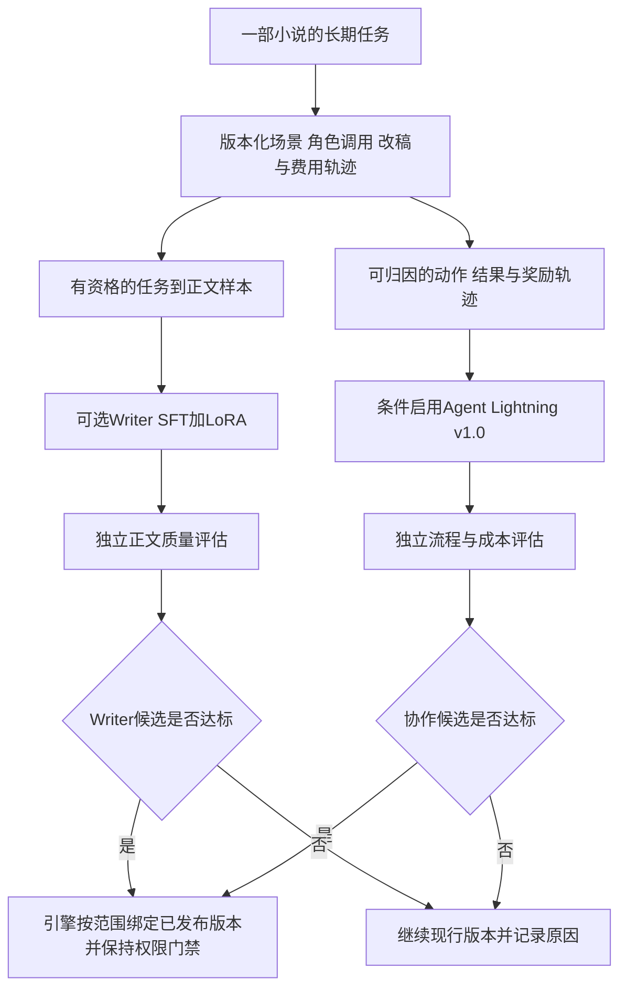

图中两条训练支路都可单独关闭；也不要求两条都完成才能写小说。Agent Lightning是离线优化器，不是第六个常驻小说Agent，不改变当前五角色能力池和默认三角色执行。官方v1.0强调通过真实Agent流程和代理网关收集轨迹，而不是替应用绕过既有状态与权限层。[v1.0官方文档](https://microsoft.github.io/agent-lightning/stable/)

v1.0官方安装涉及CUDA、verl、vLLM、FlashAttention等版本耦合，并说明默认任务会上传日志与轨迹到W&B。墨流若采用，训练环境与桌面运行环境分离，关闭未授权外传、锁定兼容版本并核实硬件支持；不能把其GPU依赖打包为所有用户启动软件的前提。[官方安装条件](https://microsoft.github.io/agent-lightning/stable/00-installation/)

完整RL的代价包含多次rollout、评价调用、GPU训练和部署。官方代码/检索任务的改进不能证明中文小说文笔会同样改善；“接入近乎零代码”也不等于奖励、数据、权限、部署和验收零工作。若只是训练Writer文风，先评估更直接的SFT/DPO工具链。若是训练整段协作与恢复，可以在同一本小说的轨迹上**配合**Writer适配器逐步接入Agent Lightning，但必须验证它优化的是流程结果，而非训练资源消耗本身。当前每部小说训练验证最多5次远端请求、单次最多50万原始token且本机显存约8GB，Agent Lightning若启用须优先使用本地策略模型及本地rollout；训练中的远端rollout默认关闭，不能借日常写作通道悄悄批量调用。其阶段性远端验证占5次之一并记录费用。先保留兼容轨迹与评估设计；完整v1.0训练尚无可证实的本机可行性或费用收益。

### 17.6 真正的个人参数：Writer适配器训练路线

#### 17.6.1 数据与方法

1. **先建立有效任务样本。** 输入包含当时的用户要求、相关写作偏好与必要剧情依据，输出为用户允许用于学习的有效文本。用户小说可转为带前文的续写样本，但自动抽出的场景说明须校验，不能将未来情节偷塞进输入。
2. **先SFT。** 对开源且许可适用的基础模型训练小型LoRA适配器，学习遵循要求、表达习惯和局部改稿方式；若硬件合适再考虑QLoRA。训练方法与实际基础模型兼容性需先核实。
3. **再按需要做DPO。** 只有真实同输入、同目标的选择对才进入偏好训练，记录用户选择维度；不把改变了剧情目标后的新稿当旧稿的无条件胜出版本。
4. **基础模型不是按参数大小盲选。** 对候选检查中文写作基础、可用上下文、训练许可、工具链、显存与推理时延。未读硬件和具体模型配置前，不承诺某张消费级显卡能训练指定长序列，也不预下载模型。
5. **优先范围受限部署。** 若候选只在对白局部改写上胜出，就只作为Writer的该类模型选择；整章任务仍用已验证路径。模型数量增加不改变角色数，也不默认增加一次润色调用。

工具选择原则：Writer条件写作微调用TRL+PEFT作为候选；需要完整Agent轨迹强化学习时可结合Agent Lightning。二者可共存并分别优化Writer表达与角色协作，但均不是桌面必装依赖；训练环境采用独立锁定依赖，桌面只连接版本明确的推理端点。[TRL工具范围](https://huggingface.co/docs/trl/quickstart)、[Agent Lightning v1.0架构](https://github.com/microsoft/agent-lightning)

#### 17.6.2 防止越学越差

数据按作品/故事段/修订家族成组，再按时间形成开发和保留范围；同一段近似改写不能同时进入训练和保留集。保留评估只包含真实任务与正文，未授权跨作品数据不参与。一个用户只有一本短书时，应报告样本不足，继续用偏好与检索，不能虚构有效样本量。

训练目标包括用户偏好、内容合理性、指令遵循、自然表达和成本；各维度单列。不能靠少写、套固定句式、泄露结局或只输出保险剧情刷分。对熟悉样式的改善必须同时检查新场景、临时换风格和用户否定旧偏好的任务，避免个性化变成创作限制。

模型自评仅作辅助；Writer不兼任自己的唯一评估者。优先观察用户真实选择、修改量与理由，配合独立依据核查。候选选择中用过的样本不得再作为最终独立证据；新章节的未来反馈用于后续观察。

#### 17.6.3 部署、停止、删除与回退

训练作业有固定数据清单、基础模型/tokenizer/模板版本、随机种子、预算、状态和产物哈希。`train_preference_model`现有特征文件与LLM适配器分开展示，避免用户误以为“训练完成”就改变了远端服务。

训练中断保留有效检查点，资源不足则解释原因并释放GPU；后台任务不能拖垮前台写作。开始训练和发布模型是两个状态，训练完成仅通知结果。通过真实任务评估后，在已有授权策略允许的安全节点启用；正在生成的章节固定原模型及适配器版本。

删除来源后立即阻止它继续检索和进入新训练集，并通过样本来源追踪标记受影响的已训练适配器。删除原文不保证权重精确遗忘；需要彻底排除该来源时停用有关适配器，回退干净版本，必要时用清理后的数据重训。界面明确区分“已移除资料”和“受影响模型已停用/重建”。

任何回退只回退提示词、排序配置或模型指针，不回退用户已接受的小说。用户已修改正文继续作为最新作品状态，由正常版本协议管理。

### 17.7 两条运行链路：创作实时执行，优化后台积累

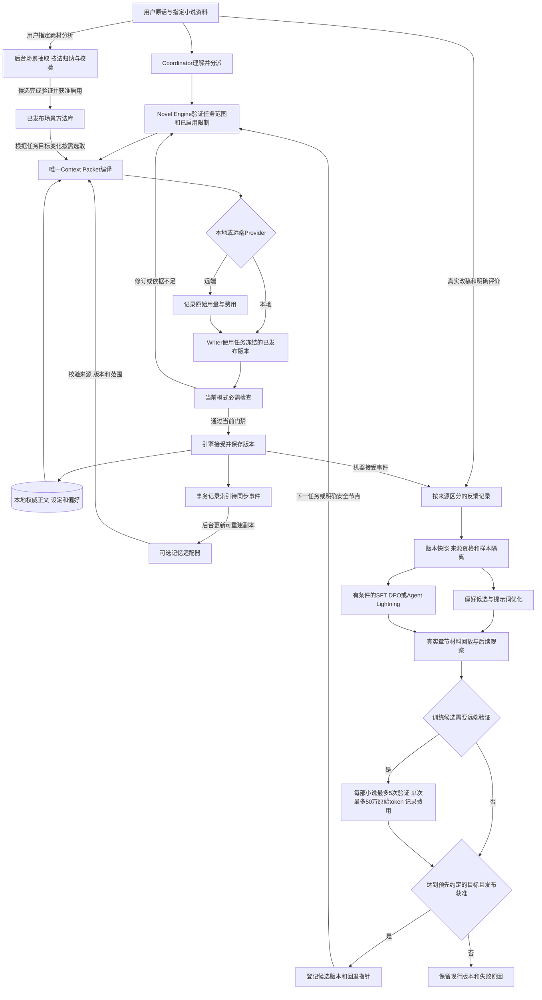

图中`F`会记录不同来源事件，`A`产生的机器接受只说明通过当前工作流门禁，不自动变成用户喜爱。`M`仅登记获准发布的配置或模型版本；它进入下一任务时仍须经过Engine校验和任务快照冻结。后台链路有独立作业状态、获准的调用范围和费用记录，费用纳入用户总成本；关闭后台学习不阻止小说正常完成。运行时自动恢复负责继续当前工作，离线学习负责改善未来行为，代码缺陷则由开发修复闭环处理。

### 17.8 更细的实施步骤与依赖

每步记录“输入依据、具体改动、实际创作观察、完成条件、回退动作”。下面是未来实施计划；当前文档修改不执行训练、模型下载、付费创作或部署。

本版已采用第17.12.9节的质量优先方案：L1—L8沿现有远端Writer路径逐步推进，补持久费用观测、原始token/缓存分账及验证子额度；不设置金额门禁。不要求本地模型通过质量门槛才允许写正文。**L0本地推理可行性**改为条件扩展：只有准备实际启用本地Writer适配器时，才核实约8GB显存下的模型加载、上下文、首字延迟、长期稳定性，并用已有真实章节对比人物、因果、字数和改稿量。L0不能把未验证的小模型默认为远端Writer的替代品，也不能阻塞正常小说写作。

#### 步骤L1：保存真实创作基线

- 输入：用户正在写的项目、已存在trace、当前Provider和提示词版本。
- 文件：`trace.py、provider.py、runtime.py、schemas.py`，复用诊断抽屉。
- 改动：分开原始token、价格快照与实际/估算费用；按创作/训练项目持久化跨小说费用观测账本，按小说持久化训练验证5次/单次50万原始token子账本，记录用途、阶段、区段哈希、正文版本、首次字数、重试原因和usage缺失情况。验证名额与raw token请求前预留；不设置金额预留；日志不保留API密钥。
- 观察：下一次正常创作自动形成完整章节账单；不另外生成测试故事，不付费预热。
- 完成/回退：一章从原话到接受可追踪，已知费用可核算；日常请求与训练验证准确分账，重试和续跑不重置验证子额度。不会因旧金额阈值阻断写作；观测失败不损坏正文，明确数据缺口，尚不能据此宣称节省。

#### 步骤L2：修复历史反馈与正文对应关系

- 依赖：L1及阶段C3明确的版本存储。
- 文件：`learning.py、database.py、engine.py、checkpoints.py`。
- 改动：在实际生成/修订时绑定不可变正文与上下文；导出按版本/哈希读，增加分页；历史缺快照的记录隔离并说明。
- 观察：用户真实改稿后，旧反馈仍指向旧稿；恢复项目后对应关系不变。
- 完成/回退：不存在用当前文件冒充旧训练目标的路径；失败样本不导出，小说主流程照常，旧事件继续可读。

#### 步骤L3：分开用户评价、机器检查和运行错误

- 依赖：L2。
- 文件：`database.py、engine.py、app_server.py、desktop/src/App.tsx`。
- 改动：补反馈来源、理由、维度与撤销；校验偏好对属于同任务、同依据且产物存在，特征由已保存文本计算或校验。
- 观察：真实审核依据不足不再成为文风负样本；用户“继续”不会变成五星评价。
- 完成/回退：每条学习依据可解释和撤销；旧记录来源不明时保留但不当强监督。

#### 步骤L4：形成可编辑的偏好与参考资料

- 依赖：L3。
- 文件：`references.py、learning.py、database.py、context.py、app_server.py`与现有设置区。
- 改动：记录资料用途；在句长等统计外增加有引用的文笔特征候选；区分作品级、人物级、全局和一次性偏好，支持停用与例外。
- 细化：参考小说按17.12节提炼为有目标、转折、后果及适用条件的场景方法，复用`craft.py`和参考资料入口；不将源小说人物、剧情或原句作为写作知识注入。方法仅作为当前用户目标与本书因果的辅助。
- 观察：用户在实际章节中要求改变语气，下一次相关写作得到相应依据；另一部小说不串入人物和剧情。
- 完成/回退：用户可查看“记住了什么、为什么、用在哪”；关闭候选后恢复旧偏好，不修改已经接受的正文。

#### 步骤L5：补本地分层记忆和相关证据选择

- 依赖：L2、L4及阶段C的提交与失效协议。
- 文件：`retrieval.py、context.py、database.py、outline_context.py`。
- 改动：区分必需事实与补充检索；按作品/分支/故事时间/来源版本筛选，摘要可回原文；反馈分范围、限幅，保留长尾事实入口。
- 观察：写到真实伏笔回收、倒叙或角色误解时，能看到准确来源与知识主体；输入减少时不丢关键证据。
- 完成/回退：过期或已删除来源被拦截；摘要链不可靠时回原文与现行检索，避免新增第二套权威库。

#### 步骤L6：稳定个性化上下文与缓存

- 依赖：L1、L4、L5。
- 文件：`schemas.py、context.py、provider.py、trace.py`。
- 改动：拆开J2/K中的稳定与动态内容；稳定序列化、快照版本和增量区；保留前缀首次变化诊断。
- 观察：同一本书的连续正常Writer调用统计命中、输入体积与费用；用户改设定时能解释命中下降。
- 完成/回退：同输入版本稳定重建，变化有来源；新组装导致漏读时回退编译版本，不能牺牲必要依据保80%。

#### 步骤L7：完善大纲—细纲—计划—正文质量链路

- 依赖：L5、L6和既有Writer/审查职责拆分。
- 文件：`outline_context.py、schemas.py、prompts.py、context.py、engine.py、craft.py`。
- 改动：落实第11.4节，细纲按故事事件展开，计划安排近期章节；Writer获得场景意图、字数范围与相关风格依据；Editor输出有依据的局部修订项。
- 观察：直接继续用户本卷，查看正文是否真实展开、人物行动是否合理、伏笔是否可追踪；记录用户实际改动。
- 完成/回退：分清结构文档类型，减少整章无效重写；不合适的文风模板可停用，保留作者选择。

#### 步骤L8：用真实创作反馈形成第一次改进结论

- 依赖：L1—L7；具体方式见17.9。
- 文件：现有trace和学习记录，增加版本化实验清单及摘要报告，优先沿用artifact存储。
- 改动：比较相似任务分组的首次字数、修订、用户修改、审查误报、证据缺失及每合格章节费用；单次只改变一个关键因素。
- 观察：正常完成的章节和实际恢复事件作为证据，异常缺席写“尚未观察”，不伪造通过。
- 完成/回退：结论说明样本、差异和不确定性；无收益的改动回退，不继续叠加框架掩盖问题。

#### 步骤L9：有缺口时旁路评估Tencent记忆

- 依赖：L5、L8及明确服务使用/数据范围。
- 文件：现有`retrieval.py`外加必要的小型适配器，配置仍在`config.py`，同步复用既有待处理事件。
- 改动：锁定上游版本、映射隔离字段、导入允许的来源副本；先离线回放实际查询，再按范围启用在线召回。
- 观察：同一真实查询比较本地与候选来源，记录额外费用、延迟、缺失来源及删除传播。
- 完成/回退：解决本地基线中明确的问题才接入；服务不可用可回本地，关闭后原稿和记忆完整。

#### 步骤L10：提示词和轻量偏好参数优化

- 依赖：L3、L4、L8；不依赖L9。
- 文件：`learning.py、trace.py、prompts.py`与必要的独立优化运行器。
- 改动：利用真实反馈提出单一角色提示词或排序配置候选；锁定职责、协议与授权；候选不直接覆盖生产配置。
- 观察：真实已保存任务回放及后续新章节表现，额外模型调用受实验额度限制；优先利用自然产生的修订前后对。
- 完成/回退：经过保留观察才发布，保留旧版本指针；收益不明确时不发布，避免自动漂移。

#### 步骤L11：条件允许才训练Writer个人适配器

- 依赖：L2、L3、L8、有效授权、真实样本、硬件与成本核实；不要求先安装Tencent或Lightning。
- 文件：扩展`learning.py`作业契约，训练器在独立环境，`provider.py / config.py`只接版本明确的推理能力。
- 改动：构建正确的SFT/偏好数据，先小范围训练、真实材料评估、再有范围部署；实现停用和来源撤销。
- 观察：与现行Writer在相同类型真实任务中的用户修订、质量、延迟和总成本；不假定本地小模型必优于远端模型。
- 完成/回退：验证有效范围并提供可用推理端点才叫“已启用”；否则保持现行Provider，不把已完成训练当已完成集成。

#### 步骤L12：必要时扩展Agent Lightning与长期维护

- 依赖：前述学习数据和评价链路稳定，且调度/工具使用存在适合RL的明确缺口。
- 文件：独立训练适配器与轨迹导出接口；生产引擎保持唯一门禁。
- 改动：用真实已授权任务副本训练受限策略，固定奖励版本；训练环境不持有生产写权限，成本和外传范围独立可见。
- 观察：白名单任务的成功、权限遵守、恢复与费用，检查是否仅通过跳过审查获得“高收益”。
- 完成/回退：完整策略确有额外价值才部署；没有价值则保留轻量方案。定期检查失效偏好、未消费的索引任务、适配器兼容和退出成本。

顺序原则：L1—L8先完成现有项目闭环；L9、L10、L11按证据分别选择，不要求全部安装；L12条件最严格。任何步骤不得成为一卷小说正常完成的额外必经审批链。

### 17.9 验证方案：在真正写小说的途中观察和实验

用户确认的验证主线是实际小说创作。不能新生成一个演示故事，然后宣称解决长篇问题；真正模型实验只在已授权的写作实施中开展。

执行0.7.0开发验证时，在墨流可见界面以普通用户的自然语言发起任务，不用内部命令或人工直接改作品文件代替 Agent。逐轮核对原话、Coordinator 所选动作与范围、实际角色及其输入输出、文件来源版本、可见状态和下一步引导。以《灰巷灯火》为代表案例：保留前十五章已接受正文与有效伏笔，允许后续卷数和全书章数随重新设计改变；先生成并审核全书大纲，再按相关卷生成并审核细纲，最后规划第15～24章，其中第15章是只读衔接锚点、第16～24章是可调整未来。三层审核通过后在已授权范围内自动推进，用户保留事后异议与定向修改权；审查未过不能偷偷写入生效依据。旧任务、语音和只读查看不应无故互斥。若同一澄清重复出现、规划误入正文流程、角色不在当前模式、或可恢复分歧导致整项终止，先修路由与断点，再从失败节点观察一次。性能对照记录同口径原始输入、缓存命中输入、输出、调用数、耗时和合格产物；缓存下降或并发退化须找出原因并修复或回退，不以虚高命中率和跳过质量检查掩盖。

#### 17.9.1 顺着本卷完成过程收集证据

1. **开始前记录现状。** 用当前真实项目核对正文、设定、大纲、细纲、计划及角色配置。沿用已有有效内容；缺少必需材料时按用户目标补齐，不为了实验重开一本书。
2. **正常写作即采集。** 每章保存原话、编译输入版本、Writer首次正文、局部修订、审查结论、最终接受版本和调用费用。采集以本地事件为主，不额外调用模型给每个阶段打分。
3. **正文阅读是必要环节。** 阅读实际段落，检查是否讲述过程而非只有剧情摘要、人物选择是否有依据、对白是否符合人物、伏笔是否得到合理推进。系统记录编辑检查，用户自然反馈才作为用户审美证据。
4. **批量创作也逐章保留检查边界。** 仍执行已接受的批量目标和依赖门禁，尽量给用户一个完整结果；当前章的必需检查未完成，不生成依赖它的下一章来掩盖失败。
5. **每次只改变一个主要因素。** 优先依次观察上下文组装、偏好选取、写作提示词；固定其余可固定条件。不同章节复杂度不同，前后费用差只能作为观察，不能声称严格因果证明。
6. **出现真实问题当场处理。** 记下失败节点与最小相关证据，运行时按白名单恢复；发现代码根因时进入开发修复项，保留该真实案例作为后续回放材料。不能靠人工另写正文替Agent完成来计算成功率。
7. **阶段性汇报不打断创作。** 在章或故事段完成后汇总有效修改、仍需处理的问题和费用；常规步骤不逐章要求确认。最后按整卷目标检查主线、人物弧线、应回收伏笔和结尾完成度。

#### 17.9.2 怎样比较，才不浪费也不自欺

| 验证方式 | 使用材料 | 额外模型成本与边界 |
| --- | --- | --- |
| 正常创作观测 | 本卷真实原话、章节、修改、审查和usage | 沿用原任务调用，不增加影子Writer |
| 确定性回放 | 已保存真实上下文与输出 | 本地检查版本、字数、编译顺序、数据导出和重复提交，不生成例子 |
| 自然形成的偏好对 | 同一真实任务实际出现的原稿与用户选定修订 | 优先使用，无需为攒训练集故意制造差稿 |
| 有限同输入对照 | 同一真实章节的冻结输入，隔离的候选输出 | 只有确需区分两个方案且在已授权实验预算内才调用；结果不覆盖正史，不默认展示多份草稿 |
| 恢复路径复核 | 真实失败事件与项目快照副本 | 可在副本重放故障边界；不能在用户唯一项目里故意断写/删文件，未覆盖的故障明确列待验证 |

上线优化使用开发材料选择候选；保留的真实故事段及未来新章节用于独立观察。同一章不断调到合适后，不能再把它当“未见过的评测”。有前后文输入时保持真实写作当时可知信息，不向回放输入加入后来发现的答案。

#### 17.9.3 观察项目、通过条件与失败处理

| 目标 | 从真实任务记录什么 | 如何决定是否保留改动 |
| --- | --- | --- |
| 更理解用户 | 否定/局部修改路由是否正确、超范围修改、重复解释和必要提问 | 不新增越权；减少可确认的意图误判，歧义不靠猜测硬推进 |
| 文笔更贴近用户 | 用户修改的段落及理由、明确偏好、自然形成的版本选择 | 同类任务中改善，并保留用户临时换风格能力；不用自动通过率替代 |
| 剧情更合理 | 被确认的因果/人物知识错误、漏伏笔、审查误报 | 真实问题减少，软风格意见不升级成硬阻断 |
| 字数更可靠 | 首次正文中文字符口径、目标区间、补写次数和重复段落 | 首次达标改善且无灌水；token完成比例不替代字数 |
| 记忆更有效 | 必需证据是否读到、引用是否支持结论、过期/跨书来源 | 必需依据完整，跨书污染和无效引用不允许被“更省token”抵消 |
| 缓存与成本 | usage覆盖率、热/冷分组命中、输入量、每合格章节全成本 | 争取连续Writer达到80%；总成本与质量共同判断，未知值如实报告 |
| 恢复更可靠 | 真实中断原因、恢复节点、重复生成、用户介入及修复成本 | 当前节点可继续，用户停止不会恢复，未观察故障不声称通过 |
| 训练有实际价值 | 候选与现行方案的真实任务表现、训练/部署摊销 | 不能只看训练loss下降；质量与成本目标均有依据才启用 |

预先记录本次要改善的指标和可接受波动，不在看完结果后更换目标。样本少时展示数量和具体案例，不编造稳定提升百分比；有足够样本再报告分组区间或统计不确定性。一次真实违规写入、版本污染或破坏取消语义，先停用相关新路径并修复，不用平均文学评分抵消。

### 17.10 对缺点做闭环处理，避免修一个问题增加多套系统

| 根因/缺点 | 应对与完成证据 | 仍存在的代价 | 何时停止扩展 |
| --- | --- | --- | --- |
| 训练样本配错正文 | 事件绑定不可变版本、哈希和上下文；真实改稿后仍可重放 | 快照占空间，需要按引用保留 | 缺原始版本的旧记录跳过，不伪造补全 |
| 把自动通过当用户喜欢 | 分来源、维度、原因；用户明确偏好与机器检查分开 | 有效强反馈积累较慢 | 数据不足继续用手工偏好，不硬启动训练 |
| 越记越多、越读越贵 | 必需事实直取、其余按需检索、分层摘要可回源 | 检索漏读和摘要失真需要监测 | 本地已满足就不加外部记忆服务 |
| 输入缓存被动态偏好打断 | 稳定契约与动态增量分开，发布版本冻结 | 必要更新仍会冷启动 | 不为80%填无用内容，不延迟用户纠错 |
| 排序自我强化、偏好过拟合 | 限幅、范围隔离、保留反例和独立真实观察 | 不能瞬间学会所有个人习惯 | 轻量排序无收益则保留简单检索 |
| Writer与审查模型互相认可错误 | 同版本证据、用户反馈和具体硬问题核对 | 文学判断无法完全机械证明 | 不靠增加更多同类Agent投票解决 |
| 接库后正史和外部记忆不一致 | 唯一提交、事务事件、幂等副本、来源失效与本地回退 | 需要维护索引状态 | 同步/删除可靠性不足时不上生产 |
| 微调遗忘、照抄或风格收窄 | 有来源的样本、保留任务、重复片段检查、范围部署和回退 | 训练与独立评价仍有成本 | 提升小于总成本或失去创作自由则停用 |
| 用户撤回资料但模型仍携带影响 | 追踪数据谱系、停用受影响适配器、必要时干净重训 | 无法承诺低成本精确遗忘 | 不能接受重训成本时保持可删除的RAG方式 |
| 框架依赖导致安装/启动变重 | 独立训练环境、可选外部服务、锁定版本、桌面依旧可单独写作 | 可选能力仍有维护成本 | 没有真实任务收益不扩大部署 |

根因闭环必须包含：真实问题记录 → 所属责任层 → 有范围改动 → 用同一真实材料回放 → 在后续写作中观察复发 → 保留或回退。数据库、预算或恢复漏洞由工程机制修复；提示词与权重训练仅承担适合学习的问题。不能声称增加一个记忆框架即可修复闪退、安装依赖或提交事务。

### 17.11 研究依据与使用范围

资料查阅日期为2026-09-23。上文链接指向官方项目、官方文档、论文作者研究或作者创作讨论；实现前锁定所选版本的提交/包版本/镜像摘要，不能把可变分支当永久兼容承诺。

- Agent Lightning：当前v1.0架构与安装条件用于判断训练成本；v0.x APO仅作为旧版方法参考，二者接口不能混用。
- TencentDB Agent Memory：当前服务架构、v3接口和许可证用于判断接入位置与数据边界；不据上游通用Benchmark承诺墨流质量。
- Hugging Face TRL/PEFT：用于区分SFT、DPO、LoRA与量化及其真实执行条件；具体模型和硬件留待有范围选型。
- DeepSeek缓存文档：用于解释前缀复用与usage，价格和模型能力须按实际Provider当时配置核实。
- Re3、DOC、CONCOCT与Writing Excuses：用于提出规划、状态、节奏和人物动机的改进方向；墨流是否有效由第17.9节真实小说过程决定。

本节的路线选择、接口边界、阶段安排与完成条件是结合当前代码提出的工程设计，不冒充这些项目已原生实现墨流全部需求。

### 17.12 用户小说素材到场景方法库：学习如何写，以及何时用

#### 17.12.1 结论、范围与本地素材证据

本项可行，但“给哭泣、暗杀等场景贴更多标签，再按标签调用技能卡”只能处理碰巧匹配的任务，无法保证Writer真正把方法用进正文。0.7.0的核心改为**目标驱动的场景方法学习**：明确本段谁想达成什么、受到什么阻力、读者与人物各知道什么、发生什么转折、结尾哪些状态改变；再从素材观察作者如何安排这些变化。写作时依据用户当前目标和本书因果选择方法，抽象技法卡只是可撤回的提示，不是固定句式或必须命中的分类器。参数训练区分两条路径：真实任务输入与用户认可输出用于任务SFT；用户明确指定为本机训练素材的整书文本可做独立的语料继续适配。后者只表示对语料分布的适配，不代表模型已经懂得用户偏好或掌握可靠写作方法；须按整本作品隔离评测且不得自动分发。保存JSON或建立索引不代表权重改变。

2026-09-23对用户指定目录`C:/Users/ashin/Downloads/小说素材/`进行了**全文件解码扫描与全书分位置抽样**：14个ZIP，各包含一份TXT，压缩文件合计31,276,711字节，条目声明展开大小合计65,629,171字节，约62.6 MiB。全部文件使用GB18030解码后得到可读中文，扫描结果均未出现U+FFFD替换字符；合计约33,770,188个字符（含标点、空白、广告），按标题正则识别约12,429个章标题。每本的前段、中段和后段均取片段核看，并在中段附近检查哭泣、遇袭词命中的上下文。章标题是启发式计数，不是已逐章验证的精确数量；可读性与无替换字符也不等于所有特殊字都已校对。

| 素材 | 约万字符 | 识别章标题 | 引号对白占比约 | 抽样观察到的可研究方向 |
| --- | ---: | ---: | ---: | --- |
| 《长生大秦》 | 290.5 | 1,119 | 35.9% | 历史幻想中的权力谈判与计划；“伏击”可出现在人物猜测里 |
| 《崇祯八年》 | 245.6 | 894 | 15.4% | 战争、治理和制度说明交错；后段说明性文字显著增多 |
| 《从我是特种兵开始打卡》 | 364.2 | 1,576 | 24.0% | 军事技术与行动；“恐怖袭击”也可能只是通讯中的推断 |
| 《挂机死神就能变强》 | 133.2 | 489 | 18.6% | 能力体系与战斗；“眼眶”可仅指非人角色的身体部位 |
| 《满级导演》 | 191.9 | 738 | 26.1% | 工作、亲属关系与影视制作；影视内容须与故事现实分开 |
| 《万界疯人院》 | 146.9 | 612 | 24.7% | 悬念、群体协作与跨作品角色；命名实体迁移风险高 |
| 《万千之心》 | 187.0 | 497 | 13.6% | 短句动作、感知压力与能力设定；风格不等于对白密度 |
| 《我不想当老大》 | 681.2 | 2,260 | 5.0% | 篮球战术分析与心理预期；“刺客”可作竞技比喻 |
| 《我夺舍了太阳神》 | 129.1 | 551 | 25.3% | 神话资料、谈判与规则解释；真实神话和流行文化名称混用 |
| 《一万年新手保护期》 | 222.3 | 828 | 18.5% | 修仙规则与跨领域解释；世界设定信息密度较高 |
| 《再活一万次》 | 145.2 | 383 | 38.4% | 都市关系、冲突和对话；“哭喊”也可能是群体事件反应 |
| 《这号有毒》 | 135.7 | 500 | 13.1% | 游戏化规则、轻松语气与人际互动 |
| 《真实末日游戏》 | 166.1 | 561 | 15.1% | 灾变、调查和威胁信息；需区分紧张叙事与事件事实 |
| 《转生眼中的火影世界》 | 338.0 | 1,421 | 17.2% | 既有作品角色与能力体系；衍生作品实体应严格隔离 |

“对白占比”只统计同一行内成对中文引号的字符，跨行对白和无引号台词可能漏计；它适合比较文本结构，不能作为文学质量打分。全书按三等分扫描还发现：例如《崇祯八年》的对白粗占比约为22.6%／19.3%／4.2%，《再活一万次》约36.5%／39.3%／39.5%，说明同一本书的阶段也会变化；不应给每本书贴一个不可变的“句式人格”。这些数据来自完整文本的确定性统计，抽样观察来自有限片段；**没有逐句语义通读全部约3377万字符，也没有完成全量技法标注**。

14本都出现了相同下载站推广字样，清洗阶段应删除重复广告并保留位置映射。初步题材偏向升级、幻想、军事、游戏、体育和历史治理，包含明显的跨作品衍生材料；当前看不到足以支撑“女频各细分领域已覆盖”的证据。男频、女频是市场标签，不能从书名、主角性别或粗词频自动判定。先对实际场景和表达机制做覆盖报告，再针对用户所写类型补源。

“哭泣”“遇袭”词命中尤其不能直接做正样本：`眼眶`可能是解剖位置，`眼泪直流`可能来自强光，`刺杀`也可能描述兵器刺击，`埋伏`可能指计划或比喻。这次只读抽样已经观察到这些歧义，因此下一步训练数据必须含前后场景、叙述层级、真实/假设/转述状态和人物目标。完成的只是全量文件扫描与初步跨书观察，并未把所有命中都解释为写作技巧。没有解压写入、导入软件、启动训练或上传整书。

#### 17.12.2 技术选择及其实际作用

| 路线 | 在墨流中的用途 | 优点 | 限制与采用决定 |
| --- | --- | --- | --- |
| 场景目标与转折的紧凑方法库 | 以人物目标、阻力、信息变化和结果组织写法；写前按当前任务选少量方法 | 可解释、可撤回，能跨哭泣/遇袭等表面类型迁移 | 需在真实正文观察是否用对；作为首选 |
| Agent Skills式组织 | 用短描述定位能力，再加载有关方法和参考说明 | 方便维护与可选导出，避免常驻整库 | 文件本身不会修改权重；墨流编译器控制读取，不额外赋予shell或文件权限 |
| 统计和风格表示 | 句长分布、对白占比、感知通道、叙述距离等用于覆盖诊断与提示 | 可低成本发现资料偏向 | 不作为正文生成的唯一入口；不能用“短句多”等同“文笔好” |
| SFT + LoRA | 在合格条件写作样本上适配Writer | 可能减少反复说明的成本、改善遵循表达要求 | 需要可训练模型、硬件和部署，存在记忆原文与风格收窄；先与技法库比较 |
| DPO或轻量偏好排序 | 从同任务真实选择中学习用户偏好 | 有助于区分“能这样写”和“用户喜欢这样写” | 无选择标签的小说不能直接产生可信偏好对；不伪造强反馈 |
| Agent Lightning | 后期优化有可靠奖励的工具或调度决策 | 可利用真实运行轨迹 | 本需求先解决表达知识，不以整套强化学习作为前置条件 |

Agent Skills的渐进加载规范支持这种资料组织方式；这里借鉴加载思想，不要求接入新的Agent框架。[Agent Skills规范](https://agentskills.io/specification) 文本风格迁移研究同时关注风格、内容保持和流畅性；据此，墨流应把“表达方式变化但当前剧情不变”作为目标之一，而不能把词汇替换当作风格理解。[文本风格迁移综述](https://arxiv.org/abs/2010.12742)

#### 17.12.3 知识的层次与分类

资料分为三个逻辑区域，优先复用现有references和artifact存储：来源证据区保存本地定位与校验依据；场景方法区保存抽象的方法与适用条件；应用记录区保存真实写作目标、所选方法、正文结果及用户实际改动。来源原文默认不进入Writer提示词，三者都不具有修改本书正史的权限。

**分层特征，避免越加越低效。** 第一层只要求当前任务确实可得的信息：人物目标或场景任务、阻力或冲突、当前剧情状态、预期变化、用户明确要求。缺项可标`unknown`，不得猜造。第二层在有用时补充视角、人物关系、信息差、情绪表达意愿、叙述距离、时间压力、感知重点等，可用自然语言说明而非为每一种组合建独立类别。第三层才是句长、对白占比、标点和类型标签，用于资料审计或用户文风偏好，不决定剧情。增加一个特征的条件是它能解释一次真实失败、改变选法或改善结果；记录其获得成本和撤销方式。特征总数不作为优化目标。

对Writer而言，真正可操作的输入是一张很短的“场景任务卡”：`当前状态 → 人物想要的变化 → 阻力/已知信息 → 必须发生的转折与后果 → 用户希望读者感受到什么`。允许空缺并可直接写作，不能因为标签不齐就卡住。大纲和细纲给方向，章节小计划给本章节点；任务卡只落实当前场景，不取代任何一层规划。Writer先由任务卡和本书设定决定事件，再选表达方法；Editor在既定模式下检查正文是否达成预期效果并说明依据，不因未使用技法卡而扣分。

下面的维度只用于解释方法或诊断失败，可交叉组合，不按作者或单本书建立唯一文风模板：

| 能力维度 | 需要记录的内容 | 不应固化成的规则 |
| --- | --- | --- |
| 情绪与人物 | 触发原因、当前目标、关系压力、注意变化、身体反应、表达意愿 | 伤心必哭、恐惧必发抖、某种性别只用某种反应 |
| 动作与事件 | 动作目的、视角可见信息、动作与后果的因果、节奏、余波 | 每次遇袭都按同一个动作顺序复制 |
| 对白与潜台词 | 说话目的、回避内容、双方知识差、称呼和语体、动作打断 | 所有人物轮流讲道理或始终不直接表达 |
| 视角与描述 | 内外视角、叙述距离、感知通道、细节选择、信息揭示顺序 | 整段套用感官清单或无依据读心 |
| 世界观呈现 | 如何通过代价、制度、日常选择和冲突展示规则 | 把源小说的地名、职业体系、历史或力量等级搬入新书 |
| 文风与节奏 | 克制/外放、简洁/铺陈、幽默/严肃、句段变化、留白程度 | 用统一标点比例或固定句长决定是否通过 |
| 读者与类型预期 | 感情关系、成长、悬疑、事业、群像等驱动力及其组合 | 用男频/女频代替所有写作维度或绑定人物性别 |

男频、女频可保留为用户可选的市场标签，但需要来源和适用说明，实际选择更多依赖当前需求。用户可以要求女频悬疑使用克制动作描写，也可以要求男频成长故事细写关系；不足覆盖标记为缺口，不阻止创作。

#### 17.12.4 一条场景方法必须能够回答什么

目标记录为`SceneMethod`（可兼容旧`CraftSkill`资产），先存放于现有特征资产目录，以`kind`和`schema_version`区别旧统计卡；若需要跨书复用，使用用户本地目录和版本清单，项目只绑定选中的版本，不建立第二套正史数据库。首期只要少量有证据的通用方法，避免为每个情绪、题材、动作排列组合造一张卡。

| 字段组 | 建议字段 | 作用 |
| --- | --- | --- |
| 身份与范围 | `method_id, revision, kind, schema_version, owner_scope, status` | 区分候选、已发布、停用，支持用户级和作品级 |
| 场景变化 | `before_state, character_goal, obstacle, knowledge_gap, turn, after_state, reader_effect` | 描述方法要帮助达成的变化；允许未知值，不拿原作剧情实例直接填入运行时 |
| 方法 | `mechanism, alternative_realizations, application_hints` | 写清如何安排因果、动作、对白和信息；允许多种表达，不存固定套句 |
| 辅助特征 | `optional_facets, evidence_strength, extraction_cost` | 只保留会改变判断的特征，支持按证据降级或删除 |
| 边界 | `preconditions, exceptions, anti_patterns, conflicts_with` | 说明哪些条件下不适合，以及与哪些方法相冲突 |
| 来源证据 | `asset_ids, source_hashes, span_refs, extractor_revision, support_scope` | 定位可复核，单书观察不冒充跨作品规律 |
| 反馈与有效性 | `usage_refs, user_feedback_refs, observed_failures, eval_revision` | 根据实际使用修订，模型自报置信度仅作辅助 |
| 使用资格 | `allowed_uses, revoked_at, lineage_ids` | 来源撤销时定位受影响卡、索引和候选模型 |

`span_refs`的完整原文与私人路径保留本地；运行时白名单只输出目标变化、方法、条件、少量选择、方法ID和版本。删除实体名不等于完成去情节化，还需检查独有物件、特殊能力、罕见比喻、事件顺序和关系组合。低支持度可保存为窄范围候选，不必为了凑多来源而伪造依据。

下列是设计字段的说明，不是声称已经从这批书里验证出的结论，也不是正文样本：

- “克制的哭泣”：考虑人物是否想掩饰、场合是否允许失态、与旁人在争取什么；可选延迟应答、改变关注对象、语言中断或事后反应。无旁观者或主动求助时可以直接表达，不能强制所有人物都沉默。
- “受袭场景的叙事”：根据视角选择读者先察觉异常还是随人物事后意识到后果；维持感知、反应和结果的可理解关联，按本书规则处理受伤和余波。这里学习小说的信息组织，不把源场景或实际袭击步骤转成模板。
- “世界观自然呈现”：在人物的选择、阻碍及付出中体现一项规则，必要时允许直接说明；使用本书设定实例化，不引入素材世界的专有制度。

模型归纳的机制属于有文本依据的解释，不能冒充作者真实创作意图或经过实验验证的因果规律。

#### 17.12.5 分步实施：先处理少量有效场景，再扩大覆盖

**S1：登记素材和处理范围。** 在`references.py`扩展导入预览，记录文件哈希、ZIP条目、编码候选、大小、来源和允许用途；复用`learning.py`作业元数据。资料分析、发送到某Provider及参数训练分别使用现有授权范围。本地选文件不隐含允许把整书发给任意服务。完成条件是用户看到待处理清单、缺失权限和预估工作量。

**S2：可靠清洗与章节定位。** 支持UTF-8/带BOM文本和GBK/GB18030候选，严格解码并记录人工可纠正的选择；去广告和重复页眉，保留对白、段落、标点和章节位置。ZIP采用流式读取、大小限制和路径校验；不执行素材内的链接或指令。清洗后保存版本与原文位置映射，不能因为去标点而破坏学习信号。完成条件是随机位置可回查且坏文件单独报错。

**S3：去重和预先划分。** 先按作品、作者或相近版本划分构建材料与保留观察材料，再做场景抽取。用哈希及近重复检测处理重复版本和宣传内容，记录被合并的来源；同一场景的重写、摘要、反例都跟随父来源分组。整书语料适配按作品整本划分训练、验证、测试集，禁止把同一书相邻章节随机拆开造成泄漏。少量14本无法提供可靠的全类型泛化结论，覆盖报告需明确样本量。

**S4：围绕状态变化选场景。** 在章内按有前因、转折和后果的场景边界取窗口，而非按“哭”“杀”词命中机械截取。先用本地章节与事件线索召回，再在已授权预算内判定人物目标、阻力、知识差及结果；对哭泣、遇袭等词只记录为可疑线索，区分现实发生、人物猜测、转述、比喻和戏中戏。按作品、章节位置和事件功能分层采样，首轮从全部14本的清洗结果中抽取不同写法；约30—60个候选窗口只是可调作业上限，不是训练样本合格数或质量承诺。

**S5：从场景结果反推方法。** 在现有角色能力中增加离线分析任务类型，由Editor承担表达分析，Writer只在需要创作或改写时工作；不增加常驻“训练Agent”，不默认调用全部角色。输出必须回答“人物原来处于什么状态、何事迫使改变、作者如何分配动作/对白/信息、结束后读者或人物知道了什么、换一组人物还能否这样用”，并附可检查的来源位置与失效条件。原作情节仅供本地核对，不发布为方法。只说“多用细节、加强情绪”的候选直接退回。

**S6：归并、校验与发布。** 本地先做Schema、来源、实体残留、连续重复片段检查；把功能相同而表面场面不同的方法合并，同时保留改变结果的条件与例外。只对含混和高影响候选追加有预算的复核，不逐卡全角色审查。发布一个短的通用方法集及少量确有条件差异的方法，记录哪些还只是试用候选。初始分析仅证明有来源，实际效果仍按S9验证；版本不在进行中的Writer请求里突然变化。

**S7：让Writer真正用到方法。** 扩展`craft.py::select_craft_guides`读取已发布方法，`context.py`先编译当前场景任务卡，再按目标变化、阻力和信息差选取最多一个最相关方法；无合适项时直接依用户要求和本书依据写作。方法必须转成针对当前人物与设定的简短可执行提示，而不是要求输出某种通用哭相。模型不得把方法ID、分类名称或分析术语写入正文。若发现本地检索漏召回，再复用`HybridRetriever`的语义能力；参考方法与正史仍隔离。改变最近六份文件优先的策略，对旧统计卡保持兼容。

**S8：控制上下文和费用。** 通用写作原则维持短的稳定前缀；一个场景任务最多注入一个方法摘要，只有当前方法确实冲突时才允许受预算约束的第二个对照方法。方法提示采用可调短预算，起点可低于数百token；没有相关方法时加载零条。任务卡中的用户要求和剧情依据优先，方法摘要放动态区域，不把所有特征预加载到远端系统提示词。按现有第11节记录真实缓存usage和每合格章节成本。

**S9：在用户正在写的小说中判断价值。** 与17.9节保持一致，按真实场景任务记录“计划变化、实际正文、用户改了哪里、是否达到预期后果、原文相似度、额外token和返工”。只有用户许可的相同输入、相同预算对照才用于估计方法的增量收益；其他情况按顺序观察并承认场景差异。失败要定位为任务卡不准确、方法选择错误、Writer没有执行、源方法本身不适用，分别修复，不简单加新标签。无收益或套式表达增多时先停用问题方法。

**S10：持续学习、增量扩充和撤销。** 一本小说按17.12.9节作为长期任务，在章、场景和用户改稿中积累任务对应的有效样本；新方法只在真实错误或明确新需求出现时提炼，不按固定周期无限增加标签。来源哈希、清洗版本和提取版本用于跳过已完成工作。来源撤回时移除其证据、重算方法的有效性，撤下失去依据的条目并重建索引；正在运行的任务在下一次调用前检查撤销状态。已有正文保持历史版本，不自动改写。只有方法库仍有可证实瓶颈且满足17.6条件，才进入有界参数训练比较。

S1—S6属于后台准备；S7—S8属于现有Context Packet编译；S9—S10属于现有反馈和作业维护。每步交付独立可回退，不要求先处理全部14本才能使用第一批合格卡。

#### 17.12.6 运行流程与角色合作

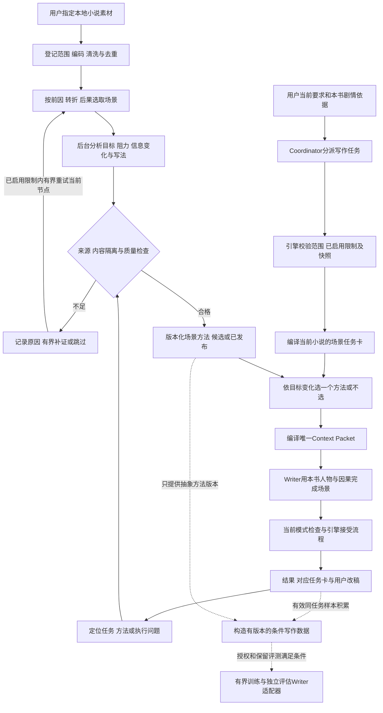

原始素材只进入已授权的分析作业，不能沿`K → R → P`携带整书或原文段落。图中的`D`也不能将原作剧情直接包装成有用户偏好的训练答案；它首先使用当前小说有版本的任务与用户真实改稿。Coordinator选任务与范围；代码负责普通检索和作业推进；Writer负责正文；Editor负责表达分析及既定审查；Reviewer、Memory Keeper只按既有模式承担相应专项。素材世界不写入本书长期记忆，方法建议不代替用户当前指令，也不赋予方法包执行代码的权限。

运行时优先级为：当前明确要求和本书硬约束 → 已接受剧情与角色状态 → 作品写作偏好 → 相关技法建议。多张卡相冲突时按当前意图选取，允许不用某种技巧；不得为了“使用技能”强加哭泣、打斗或感情戏。用户要求一次临时变化，不自动覆盖全局写作偏好。

#### 17.12.7 实际 Writer 的写作训练

当前详细流程以 [Writer 写作训练流程](INKFLOW_WRITER_TRAINING_WORKFLOW.md) 为准。用户已取消独立 Qwen/离线写作模型试验；旧的按小时训练、整书分块直接启动本地模型和本机候选发布安排不再执行。

训练对象须与最终实际 Writer 对应：先落实可训练的权重或托管微调服务及部署入口，再准备任务、前文、目标表达与合格正文。14本小说用于构造有上下文的写作样本；不能把抽象写法讲解、机器审查通过或原文复述当成写作收益。普通 DeepSeek 推理 API 不提供本机权重更新通道。

原文领域适配可作为未来明确目标下的可选试验，当前优先规划条件写作 SFT；偏好训练须有同任务的可靠选稿对。清洗、作品分区、派生样本继承分区、真实新场景比较和部署模型版本核对，都在详细流程中定义。训练时长由样本、计算资源和验证趋势决定；不以跑满小时数或100步承诺提升。

审核与协作训练需要另外的证据化审核样本和真实执行轨迹，当前第1项写作训练不自动覆盖这些能力；缓存优化保持独立计量。

#### 17.12.8 效率、验收与失败后的处理

场景目标达成率、方法选择适配率、Writer输入缓存命中率、用户满意度分别统计，不能混称一个“命中率”。缓存服务看请求前缀，不因本地多了一份知识库就自动增加命中；保持稳定前缀并把变化方法放后面，仍需按实际Provider的usage验证。[DeepSeek缓存文档](https://api-docs.deepseek.com/guides/kv_cache/) 对方法检索可借鉴BM25与向量互补、补充适用上下文的方法，文档问答的收益数字不能直接承诺为小说效果。[Contextual Retrieval](https://www.anthropic.com/engineering/contextual-retrieval)

后台作业记录`job_id, source_hash, extractor_revision, completed_units, failed_units, retry_count, actual_usage, remaining_calls`；键由来源、场景和提取版本组成，重复运行复用已完成结果；单本失败不让整批清零。用户停止后保留断点；只有已启用的调用/token限制耗尽时才等待用户调整或缩小范围。解析失败按编码/章节边界修复；语义空泛按候选证据修复；重复表达按卡和选择机制修复，各自处理，不能一律重新读整书。

验收采用真实正文中的证据：

| 问题 | 观察方式 | 不达标时怎样改 |
| --- | --- | --- |
| 当前正文是否完成用户想要的变化 | 对照任务卡的前后状态、人物目标、用户实际改稿 | 先定位目标理解、剧情依据或Writer执行哪一环出错，避免盲目加标签 |
| 选到的方法是否对当前人物和场景有帮助 | 保存选择理由、方法版本、视角及关系条件 | 收紧适用条件或改排序，允许零命中回退 |
| 是否学到了多种表达而非固定句式 | 看连续场景是否机械复用动作、句型和隐喻 | 降低同卡重复使用权重，补有根据的替代方法；不强行随机换风格 |
| 是否混入源作品 | 在本地对生成候选与来源进行上述相似检查 | 撤下有问题卡并修订当前候选，追溯抽取字段 |
| 用户是否更少改稿 | 比较同类真实任务的修改范围和明确评价 | 区分剧情变化与表达问题，不把“继续写”当赞同 |
| 成本是否合理 | 每合格章节费用加后台提炼成本摊销，报告原始总额与摊销分母 | 限卡、缓存结果、取消收益不足的语义重排或卡包 |
| 缺女频或某种能力的样本怎么办 | 覆盖报告标缺失，不从书名自动强贴标签 | 使用通用指导继续创作，按用户需要补充合适来源 |
| 关闭后能否正常运行 | 沿用实际任务的旧指导与Context Packet路径 | 保持显式回退；停用技法库不要求清空正文或正史 |

界面复用“写作偏好与学习”：显示“资料处理中/方法候选/可用方法/参数模型”四种实际状态，提供范围、处理进度、费用、采用的方法、暂时关闭、编辑与删除。用户可以说“这本只学对白”“哭戏别太克制”“这次不要参考素材”；Coordinator转换为范围和选择配置，不额外要求逐张卡确认。新的外传或训练范围没有授权时才明确询问。

交付界定：本节已经完成全文件确定性扫描、全书分位置抽样与方案修订；语义方法抽取、资料入库、运行时选择升级及训练均待实施。第一阶段交付能在当前小说中带来收益的场景目标与方法路径；大规模抽取、跨类型补齐、偏好优化和LoRA按实际收益分步推进。

#### 17.12.9 一本小说作为长期任务、费用观测与训练取舍

**小说的生命周期可以长于任何一次运行。** 一本小说使用稳定的`novel_task_id`，包含卷目标、章节细纲、章内场景任务、创作版本和当前接受状态。每个场景记录用户原话、人物目标、阻力、当前正史修订号、可选方法、Writer候选、审查依据、用户改动和后续效果。暂停、软件重启或一天工作结束后从最近可信断点继续；旧计划和已接受正文保持可追溯。一个场景经验只能变成有证据的作品级偏好候选，跨书复用须通过用户范围设置。机器通过不等于用户喜爱，未接受的草稿不进入正史。

长期任务不等于模型常驻训练。写作正常推进时只用已经发布的方法、当前模型和冻结配置；每积累一批真实改稿再做低成本的离线归纳，先判断是否需要参数训练。不同章节的反馈时间、章节难度和人物关系可能不同，版本化存储后才能比较。用户要求停下或已启用的调用/token限制耗尽时停止对应下一项操作；恢复只继续未完成节点，不通过新切片重置已启用限制。**当前已采用质量优先方案：本地LoRA训练次数不设5次上限，单次作业仍以12小时封顶并允许早停；每部小说最多5次远端付费API训练成果验证请求，每次实际输入和输出合计不超过50万原始token。日常远端写作、必要审查与聊天不占这5次，两类调用统一记录费用。**训练相关的远端rollout和素材批量付费分析默认不启动，不能伪装为日常创作调用；未另行授权这些调用或云训练。

当前机器只读检查显示约32GB内存、NVIDIA GeForce RTX 4060 Laptop GPU；`nvidia-smi`报告总显存8188 MiB、检查时可用6489 MiB。C盘剩余约12.5GB、D盘约512.8GB。它们支持评估小型本地适配器的可能性，**不证明某个具体模型能训练3—4小时或比远端DeepSeek写得好**。T5应先核实实际模型体积、训练峰值显存、长期运行温度及产物存放位置；若未来安装训练依赖与基础模型，优先使用有空间的工作目录，并遵守用户已授权的下载范围。

当前不设置固定或可选的金额上限，继续正常写作不以金额余额为前提。所有远端日常创作和训练验证请求仍统一记录实际/估算费用、价格快照及待核算usage；每部小说训练验证仍独立检查剩余5次名额与单次50万原始token上限，验证名额用尽不妨碍日常写作。Coordinator不能越过已启用的调用/token限制。默认本地完成素材清洗、场景结构提炼和训练中的高频评估，远端DeepSeek按实际工作流分章写作与必要审查。超时或未知usage不能记作零，也不能借未知费用强行暂停正常写作。界面显示累计实际/估算人民币费用、未知费用状态、验证已用/剩余、原始token与缓存命中。继续保留缓存优化、有界重试、去重和每合格章节成本分析；不设置金额门禁不是质量保证，也不授权新增远端训练rollout、素材批量付费分析、云GPU或托管训练。

| 选项 | 是否消耗当前DeepSeek或GPT调用额度 | 当前采用条件与费用控制 |
| --- | --- | --- |
| 本地清洗、统计、检索和方法归并 | 不调用远端模型时不消耗API token；消耗本机时间、内存和磁盘 | 优先执行，先用它缩小昂贵语义分析范围 |
| DeepSeek等远端日常写作、必要审核或聊天 | 不占5次训练验证名额；按供应商usage计入持久费用账本，并受已启用任务调用/token限制约束 | 保留分章生成和有界修订，减少无效角色调用与重复输入；费用记录不阻断写作 |
| 训练成果远端验证 | 每次真实发出的付费API请求占5次之一，单次输入和输出原始token合计不超过50万；费用独立记录并汇入总统计 | 只验证经过本地保留任务筛选的有价值候选；失败重发按新请求记账，不能因缓存命中免计次数 |
| 本地LoRA/QLoRA | 训练计算本身不调用DeepSeek或GPT API，主要消耗本机显卡、电力、时间与磁盘；若数据分析或评估调用远端模型，则那些调用另计 | 数据和保留评测尚不足时不开跑；可在准备充分后做有界试训，不因“免费GPU”而浪费数小时 |
| Agent Lightning v1.0完整训练 | 本地更新权重不扣远端API调用；训练中的远端rollout默认关闭，阶段性远端验证占5次之一并记录费用，训练栈另有资源要求 | 优先保留兼容轨迹与本地rollout；8GB显存和奖励可行性未经核查前不作为默认方案 |
| 云GPU或供应商托管训练 | 通常另付算力或训练服务费，云端分析仍可能有token费用 | 不作为默认路线；取消固定金额限制没有授权启动，仍须核对明确的训练范围与费用授权 |

DeepSeek当前官方价格页按每百万输入命中、输入未命中与输出token分别计费，并区分时段；当前`deepseek-flash`标注1M上下文、最高384K输出，但接口配置、实际可用窗口和软件自身输出上限仍需逐一核对，不能把单次50万原始token上限理解为必须用满或所有供应商都支持。[官方模型与人民币价格](https://api-docs.deepseek.com/zh-cn/quick_start/pricing/)、[Chat Completions参数](https://api-docs.deepseek.com/api/create-chat-completion/) 模型与价格会更新，不能把一次报价写死进0.7.0。官方token说明对中文约0.6 token/字仅是估算，实际数以API usage为准；所以不能把约3377万字符的素材当成“免费输入”反复交给远端模型。[官方token说明](https://api-docs.deepseek.com/quick_start/token_usage/) 本地训练对DeepSeek API余额为零，并不代表项目总成本为零。

量级示例，**不是实际账单或保证**：如果训练成果远端验证一次输入约2,000 token、输出上限500 token，该请求计一次验证、约2,500原始token；按查询当日`deepseek-flash`高峰时缓存未命中2元/百万输入、8元/百万输出估算约**0.008元**，五次同规模约0.04元，均纳入费用观测。再如日常一次10,000输入和3,000输出，同价下约0.044元；36次同规模约1.58元，**不占5次训练验证名额**，但全部记录费用。真实请求有系统提示、长输出、缓存差异和重试，须按usage逐笔累加；不能按此例承诺整卷费用。50万token只是单次训练验证安全上限，不是建议填满；供应商单次上下文/输出上限和软件配置仍分别生效。直接将全部约3377万字符反复交给远端模型，即使账面价格可负担一部分，也不适合当默认素材学习路径；本地结构分析与真实任务选择更可控。当前训练目标、样本流程和部署前提以 `INKFLOW_WRITER_TRAINING_WORKFLOW.md` 为准；独立本地写作模型试验已取消。

**推荐的实际顺序：**保持一部小说为长期任务；沿现有远端Writer路径按用户真实输入分章写作、必要审查和恢复，同步补持久费用观测及5次训练验证子账本。正常写作不以固定金额门禁或本地小模型训练为前置条件；启用训练远端验证前必须落实对应5次/单次50万raw约束。已观察的14本先做本地场景结构分析和方法提炼，在真实章节里检验目标理解与方法应用，并保存可映射到Agent Lightning的轨迹。累积合格改稿后才考虑本地Writer适配器试训，每次作业先安排3—4小时观察窗口、12小时封顶并允许提前停止，小说生命周期中可多次训练。每次本地训练用保留任务和用户真实改稿先筛选，只有出现值得比较的新候选时才申请一次远端验证名额；多个片段可在供应商实际上下文允许时打包进**同一请求**，不能伪称多个请求为一次。最多5次训练验证请求，已用/剩余、每次原始token和费用向用户显示。若轨迹表明问题在方法选择或协作、奖励又足够可靠，Agent Lightning可与Writer适配器分工，但rollout默认本地；没有足够样本或评估收益时继续使用现行Writer，不因训练作业完成就替换它。

**当前采用的质量优先方案及备选：**

| 路径 | 运作方式 | 优点 | 代价与触发条件 |
| --- | --- | --- | --- |
| B. 质量优先（已获用户同意，当前基线） | 最多5次远端API只限训练成果验证；日常远端写作、必要审查和聊天保留费用观测与已启用调用/token限制，默认不设硬金额上限 | 保留分章写作、修订和DeepSeek连续输入缓存的正常路径，本地训练仍可多次 | 远端请求总数可能超过5次；补持久费用账本与验证子账本，但金额不作为继续正常写作的前提，不能凭示例价格保证整卷完成 |
| A. 全书远端最多5次（已不采用） | 主要靠本地模型写作、编辑与审查 | 绝对限制远端调用次数 | 当前约8GB显存下长篇质量未验证；会限制逐章修订，不再作为默认实施前提 |
| C. 少数超长请求批量写作（不推荐） | 一次请求输出多个章节，本地保存版本和差异 | 请求数少 | 大批量输出可能漂移且失败损失大，不能替代有界分章恢复 |

实施B时复用已有Provider与真实章节记录，补持久化费用账本、训练验证用途标签以及验证名额/raw token的请求前原子预留；用户正常写作时记录首次正文质量、重试、缓存命中与每合格章节费用。验证子账本只允许绑定已冻结的候选适配器、保留任务和评价版本，避免把普通日常请求错误扣为训练验证，也避免借普通通道规避验证上限。本轮实施前的静态基线中，`RunRuntime`只按执行片段统计有效token并将缓存命中折算0.1，尚缺持久实际/估算费用及5次/单次50万原始token验证门禁；后续代码进度以实施日志为准，不因本文更新就声称已上线。待核算费用不阻断写作；验证名额和调用/token限制不能通过换供应商、重启或自动重试绕过。A、C保留作为解释历史取舍的备选，不得与当前B混称默认行为。

## 18. 后续修改与执行规则

根目录AGENTS.md保存强制架构边界，本文保存详细设计与任务依赖。修改角色、模式、预算、提交权限或默认行为时，两者必须同步。

每次改动说明：用户触发、当前证据、变更范围、契约/配置兼容、预算影响、记忆影响、针对性验证与回退方式。普通局部修复不需要扩展成整套架构重写。

记录状态：
- 已实现：必须有当前代码证据。
- 已验证：必须说明验证范围。
- 计划中：不得写成用户已经可用。
- 条件启用：说明具体条件。
- 暂不采用：保留重新评估条件。

历史三角色文档保留为旧协议说明，添加新设计入口。旧记忆或技能中固定三个/四个正式角色的要求若与本次五角色决策冲突，以用户本次决定及仓库新规则为准。

## 19. 风险最小化与可回退执行顺序

以下六项是迁移与回退原则；不要因为它们在不同章节重复出现就重复执行或验证。

### 第一步：只建立新契约，不改变日常行为

记录当前配置和角色映射版本，新增五角色类型但保持日常模式。代码适配旧输入，现有任务继续按旧快照执行。完成标准是旧项目可正常读取、模型选择不变、专项不会意外付费启动。

### 第二步：让用户可见、可选，再开启专项

增加模式设置和费用边界，清楚显示继承模型。先允许用户明确请求的单一专项，再开放预算内的智能调度。不能用隐藏开关让所有项目突然进入加强模式。

### 第三步：逐项接入能力

先完成新 Editor 的旧行为兼容，再接专项 Reviewer，再接 Memory Keeper；每次只增加一种调用路径。出现问题时关闭对应专项，保持日常路径可用。关闭专项不能把用户已经要求的深度任务悄悄降级为通过，应暂停该任务并说明。

### 第四步：完善恢复与提交，再允许长批次使用

验证取消、超预算、模型错误、版本变化和提交中断的恢复点。新旧数据格式在可识别版本下共存。数据库需要迁移时先备份、校验备份可读，制定反向兼容范围；不能承诺所有新数据均可由旧版本直接读取。

### 第五步：在授权范围内验证成本与质量

在用户实际写小说的途中采集并观察，使用已有真实输入输出作本地回放材料；需要模型质量对照时按17.9节在冻结的真实任务上进行。不要新造演示小说作为验收替代。费用样本单独标识，不能为了统计命中率制造无用调用。性能不足时先定位多余输入和重复步骤，不移除必要证据；语音性能用本卷真实朗读记录衡量。

### 第六步：扩大可用范围后再清理

新路径表现符合验收后再扩大到更多项目和任务。清理旧兼容层须明确支持版本与迁移完成条件，保护已有小说和日志；不因新设计生效就删除所有旧数据。

每一步记录输入条件、变更文件、用户可见影响、验证结果与回退动作。步骤失败只回退该步，不重写其他已有效组件。

## 20. 用户创作自由与包容性

### 第一步：区分创作讨论和生产任务

用户可以聊天、提出多个方向、只试写一个场景，也可以要求先不写正文。Coordinator 必须理解这类输入，不强制所有对话进入“设定到完结”的唯一流程。

### 第二步：把约束分成明确硬规则与可选建议

字数目标、用户禁用符号和确定的世界规则可被用户明确设为硬约束。叙述节奏、是否每章留钩子、对白比例、句式与修辞默认作为偏好，不作为统一评分扣分项。

未说明的审美偏好不能由系统偷偷升级为硬规则。用户修改创作规则后记录新版本，必要时更新相关计划和审查，避免旧规则持续否决新创意。

### 第三步：允许合理的叙事特殊性

倒叙、梦境、故意隐瞒、不可靠叙述、人物谎言、开放结局与暂未解释的谜团，可能是有效创作。Reviewer 应区分“读者暂时不知道”与“故事内部不成立”。存在歧义时先查看创作意图和已有伏笔，不能强行补完所有解释或提前揭谜。

### 第四步：给大胆尝试提供隔离空间

提供备选大纲、场景试写和草稿分支。新创意先在分支中展开，用户接受后才更新正式设定与后续计划。日常界面仍展示一个当前正文，备选收在可展开位置，避免草稿堆积。

### 第五步：只在真正改变方向时询问

局部修辞、字数补足、已授权问题修订自动处理。必须改主角目标、核心设定、重要人物命运或已接受剧情且超出授权时，保存进度，简短说明冲突与选择；不要求用户逐章确认普通动作。

### 第六步：自由选择不损坏工程边界

用户可以选择慢节奏、意识流或不常规结构，也可以选择只保留草稿、暂不审核。草稿应明确标记未验收；不会伪装已接受正史。调用/token限制、文件完整性和权限仍由引擎保证。

## 21. 0.7.0交付与本次工作账本

- 已完成的设计工作：既定五角色目标、阶段任务、权限边界；本轮增加当前学习/检索代码核对、官方技术研究、缓存诊断、小说质量链路、12步学习实施、10步语音专项、真实创作验收和对应Mermaid图。
- 开发顺序已整理为独立步骤表：第1—19步覆盖0.7.0核心，第20—22步为条件扩展；统一依赖、模块、交付物、完成条件和回退方式。验证优先复用现有证据与真实创作，仅补新改动影响的必要检查，不重复低价值测试或全卷生成。
- 素材专项设计：已只读解码扫描14个ZIP、分位置抽样并复核场景词歧义；新增17.12节目标驱动的场景方法、10步实施、分层特征、数据契约、长期小说任务、可反复本地训练，以及最多5次训练远端验证请求、单次50万原始token与日常/验证费用观测分账。完整语义通读、资料入库、用户改稿集构建及权重训练尚未进行。
- 2026-09-23费用决策更新：创作不设金额门禁，保留费用透明统计、缓存优化、有界重试、每书训练验证5次/50万raw与单次本地训练12小时上限；没有新增远端训练rollout、素材批量付费分析、云GPU或托管训练授权。
- 当前代码已有基础：混合检索、偏好/学习记录、训练准备、稳定区段序列化、语音后台任务和模型对象缓存；本轮仅静态确认入口，不表示端到端验证通过。
- 2026-09-23首批实施：已加入 v1/v2 角色映射、固定模式角色表、分角色结果契约及日志版本标识；桌面编辑保存/切换补充会话与版本防护。历史实施记录已从项目移除，当前行为以代码和发布说明为准。
- 2026-09-23后续子步：角色配置已接入v2规范存储/v1兼容视图；Provider增加持久逐请求费用观测和独立训练验证scope，普通写作不设固定金额上限。相关离线检查通过，新界面/账本尚待真实运行观察；训练验证入口未启用，UTF-8输入预检尚待目标供应商tokenizer边界验证。详见实施记录，不把底层接口当作端到端功能。
- 2026-09-23续跑与界面子步：桌面对话、工作流和选段修订已绑定持久设置快照，重试及识别出的自然语言续跑复用任务身份；旧任务无快照时明确标记恢复时捕获，不伪称还原原配置。引擎可按既有设定、大纲和剧情细纲安排 Writer 补齐缺失章节计划，不覆盖旧卡；每章读所属计划。进度分开统计已接受正文与计划覆盖，Windows 品牌入口统一墨宝。29项相关离线检查及一次桌面类型检查通过；真实续写和任务栏外观尚未重启验收，批次清单与全部 CLI/MCP 入口的快照接入仍待完成。详见实施记录。
- 2026-09-23第2步文件层收尾：桌面设置已按v2展示与保存五角色配置，旧版`reviewer`仍映射综合Editor；新增v2分角色提示词、版本化审查/协作记录、聚焦冲突记录及公开状态接口。当前只执行v1日常流程，冲突接口尚未全面接入运行节点；本轮依用户要求未运行、测试或验收，旧项目读取与界面交互效果仍待确认。
- 0.7.0仍待实施：专项调度和结果契约的运行时接入、冲突自恢复、统一恢复与提交协议、费用观测的真实运行及验证入口，以及本文指出的数据绑定、偏好学习、上下文与语音改造。文件契约已落地不能记为这些运行功能已经交付。
- 尚待真实创作验证：整卷质量、字数首稿表现、Writer连续缓存80%目标、每合格章节费用、恢复表现及真实设备语音延迟。
- 条件启用：专项角色、Tencent记忆适配、提示词优化、个人LoRA/SFT/DPO及Agent Lightning；不承诺全部进入0.7.0首个发布包。
- 明确不采用：默认五角色全跑、Coordinator代写正文或代审核、无限重试、金额门禁、跨切片重置任务调用/token限制或验证限额、用安装训练框架代替工程修复、未经范围确认的训练与外传。
- 本轮改动范围：更新本计划书、完整开发步骤及根目录AGENTS.md的对应规则；五角色和工程边界继续适用。未修改运行时代码、包版本或安装包，也未启动训练、语音推理或付费小说实验。

正式发布0.7.0时再按仓库发布规则统一桌面端、引擎、扩展、标签和安装包版本，并将README/Release只保留本版用户可见变更。发布说明仅写实际完成并验证的部分，研究候选与未来训练不写成已上线能力。
