# 墨流 0.7.2 源码：完整架构与工作流拆解

这份文件用 36 节说明墨流怎样理解要求、安排角色、生成规划与正文、检查错误、保存记忆和处理失败。章节现已连续编号为 **01～36**。标题保留，各节的目录链接和上下游引用同步调整。面向日常操作的指南见 [README](../README.md)。

**0.7.2 累计修改的阅读入口：交接与补证、可持续设定、手动改稿核对和独立对话。** 以下链接进入原有章节中的实际机制，覆盖 0.7.0 发布后尚未单独发布的规划、作者记忆和当前工作区修改。用户已授权本次全面检查、构建与上传；结果逐项记在[0.7.2 发布验证记录](#release-verification)，不能沿用此前 Writer 说明交接 MVP 冒充此次完整验证，也不能把源码版本更新当作安装包已发布。

| 本次变化 | 直接查看 | 当前确认范围 |
| --- | --- | --- |
| 设置中建立多份本书设定，自定义字段、职责与读写角色，提供十二类模板 | [第14节：设定合集与模板](#story-setting-collections) | 复用桌面数据库；设定为创作假设与证据参考，始终不自动成为正史 |
| 文件或记录真正改变才进入后台核对，疑问显示原句与用户取舍 | [第23节：手动修改状态链](#manual-edit-lifecycle) | 默认开启；草稿复用原章节审查，已接受正文只建候选；实际验证范围见顶部发布记录 |
| 多份对话的待答、历史和事件分开，浮动聊天可移动并开独立窗口 | [第02节：窗口与布局](#conversation-windows)、[第32节：共享项目边界](#conversation-isolation) | 对话分开，正史、设定及任务预算不因窗口分裂；其余面板仍有原布局限制 |
| 三层规划先补早期未结伏笔的原文，再判断它是否支持衔接 | [第14节：早期来源补读](#planning-thread-evidence) | 本地最多四条查询、六章节选、八千新增 token；来源不足明确留缺口 |
| Writer 随正文交付新增、叙事解释、未来设想、未决定项四类说明 | [第06节：独立版本说明与保存](#writer-version-handoff) | 同次交稿；说明是版本附件，不是正史 |
| 必要时一次 Writer 短答、一次原主审复核，失败和续做不刷新次数 | [第22节：自动补救与循环出口](#writer-note-recovery) | 纠正说明不重生成正文；必要问题未解决保留断点 |
| 已接受章的说明供后章简短参考，事实与伏笔仍独立核验 | [第26节：临时记忆边界](#inkflow-26)、[第30节：实际输入](#inkflow-30) | 未接受或过期说明不进入近期正式意图参考 |
| 说明变化使旧报告失效，界面与接受入口同步拦截 | [第20节：生命周期](#inkflow-20)、[第31节：接受门禁](#inkflow-31) | 正文版本相同也须核对说明指纹 |
| 新任务取消独立 deep，统一为记忆加强；已有任务按原快照恢复 | [第10节：四种模式与兼容边界](#inkflow-10) | 0.7.2 源码已改，当前验证范围见顶部；前次 Writer MVP 不作为模式合并或辅助入口快照补齐的验证 |
| 最小离线 MVP 通过、临时脚本和小说数据已清理 | [第22节：MVP 覆盖范围](#writer-note-mvp)、[第34节：成本边界](#inkflow-34) | 已验证离线代码链路；真实模型质量、Token 和耗时未实测 |

## 零基础怎么读

你不需要先学会编程。先读每节的“先用一句话理解”，再看图和例子；遇到陌生词，点击“遇到生词先看”或正文中的术语链接。文末的[零基础术语词库](#glossary)按用途分类，包含白话解释、墨流中的具体例子和返回相应专题的链接。`.py`、`.tsx` 等源码链接留给需要核对实现时使用，不要求第一次阅读就打开。

例如，你要求“下一章让甲去找钥匙，先给草稿”。Writer 写出的文字是**草稿**；如果它经过必要检查并且得到接受授权，才可能成为**正史**。“钥匙现在由乙保管”可以整理成有原文依据的**记忆**；下一次写作时，程序再把相关记忆和正文放进**上下文**交给模型。把资料保存下来、这次把资料发给模型、训练模型内部参数，是三件不同的事。

**流程图怎么看：** 方框写动作、产物或停留状态；菱形提出一个判断，沿箭头上的“是／否”或具体条件往下读。箭头回到前面表示有限重试，必须同时读它的次数或预算出口。标明“资料关系图”的图只讲谁提供资料，不表示每次操作都要走遍所有框；“待处理”意味着保留成果和原因，并不是成功完成。

本文说“本节、上游节、下游节”时指这份说明书；说“小说第十六章”时指作品中的章节。**角色是分工，模型是实际提供回答的服务**，五个角色不意味着每次都调用五次模型。**角色协议 v2、规划数据协议 v2、规划正式修订号、正文版本、源码版本 0.7.2**分别是不同概念。规划数据协议仍可为 v2，而同一作品的正式规划连续成为第 1、2、3、4 版。本次 0.7.2 的安装包与扩展已经正式发布；源码升版、构建和上传仍是各自需要证据的不同阶段。

| 先认识的词 | 先这样理解 | 详细解释 |
| --- | --- | --- |
| 草稿与正史 | 草稿可以试；正史是这本书当前正式认可的已发生内容 | [草稿](#term-draft) / [正史](#term-canon) |
| 上下文 | 模型这一次实际收到的参考资料 | [Context Packet](#term-context) |
| 版本与哈希 | 版本记第几次；哈希核对文字是否变过 | [版本](#term-version) / [哈希](#term-hash) |
| 候选与生效 | 刚生成的方案先等核对；生效后才作为当前依据 | [候选与生效](#term-draft) |
| 门禁 | 必须满足才能继续的条件 | [门禁](#term-gate) |
| 事务与恢复 | 防止只存成功一半；失败时知道该补哪一步 | [事务](#term-transaction) / [恢复](#term-resume) |

## 这份分析怎样作为下一轮修改依据

**核对口径：2026-10-01，0.7.2 已发布源码与产物。** 本版整合 `v0.7.0` 之后的累计改动，正式源码及 `v0.7.2` 标签指向 `df944d20c4b8462629aa28cc16a7016681752db7`；北京时间 20:52 已完成正式 Release 和四个附件上传，身份及验证范围在下表记录。协作边界以 [AGENTS.md](../AGENTS.md) 为准，当前版用户更新以 [CHANGELOG](../CHANGELOG.md) 为准。本次收尾文档是发布记录回填，不修改标签或重新打包，源码与包身份仍为上述提交。此前 Writer 版本说明完成了最小离线 MVP，此次现有套件、指定页面操作、安装构建和远端发布另有实际记录。以下“源码已实现”仍只表示实现路径存在，文学判断和性能需对应实际使用证据；本次没有把离线替身、类型检查和包构建写成真实模型质量、原生多窗口全流程或十万字性能测量。

<a id="release-verification"></a>
### 0.7.2 发布验证记录

本表只写本轮取得的证据；进行中与未取得结果不能折算为通过。各节历史 MVP 属于较早验证，当前新增功能的最终范围以这里为准。

| 验证或发布阶段 | 当前结果 | 证据与范围 | 尚不能证明什么 |
| --- | --- | --- | --- |
| 根任务专用针对回归 | 已通过 5/5，已并入下方 291 项 | 真实来源哈希1项、后台状态保护1项、CSET缓存范围1项、ManualEdits补读来源与快照重试2项；旧报告共同字段转换由既有套件覆盖，不属于这5项；不与全套重复相加 | 不等于真实模型语义、DeepSeek 缓存收益或整项性能 |
| 桌面对话身份检查 | 已通过 2/2 | 本轮根任务运行 Node 对话上下文检查 | 不等于实际多窗口视觉与操作体验 |
| 桌面与 VS Code 扩展类型检查 | 已通过 | renderer、Electron 与扩展类型检查通过，并修正缺失的设定工作流名称映射 | 不等于安装包构建或界面完整一致 |
| 引擎完整现有测试 | 已通过 291 项，32.86 秒，无跳过 | 根任务在断外网 guard 下执行；日志 `D:/墨流/release/0.7.2/checks/backend-final.log`，修正旧预期/替身和实际报告转换后完成；按作者最新要求不再新增测试 | 离线通过不证明供应商返回、真实文学判断或整项性能 |
| 实际 React 界面操作，本地模拟后台 | 原范围已通过 | 实际页面接纯本地 mock：十二模板、创建合集、编辑条目、changed/unchanged 上传、未保存编辑保护；Monaco Diff 关闭/保存的错误数组为空 | 未启动原生 Electron 多窗口完整验收，也未调用真实模型 |
| 0.7.2 安装包与扩展构建 | 已完成，正式构建 exit 0 | 安装包与 VSIX 已生成；latest.yml、VSIX manifest 均为 0.7.2，桌面与扩展包含相同引擎；文件与校验见下表，凭据 `checks/packaging.log`、`artifact-receipt.json` | 构建不等于已上传，也不替代原生完整流程或真实模型质量验收 |
| Git 提交、标签与 GitHub 上传 | 已正式发布，main 与标签已 push，四附件 uploaded | [0.7.2 Release](https://github.com/littlewinter320/inkflow/releases/tag/v0.7.2)：draft=false、prerelease=false；`published_at=2026-10-01T12:52:00Z`（北京时间20:52）；源码与标签 `df944d20c4b8462629aa28cc16a7016681752db7`；四附件远端 size 与 SHA256 均匹配构建回执 | 上传成功不扩展上述测试、页面和真实性能的范围；收尾文档提交不重置标签及包身份 |
| 真实模型质量、整项十万字耗时/Token | 尚未测量 | 不以离线替身、页面能显示或一次包构建推断 | 不承诺耗时增幅 ≤15% 或 Token 增幅 ≤30% |

**已发布产物与身份。** 本地发布目录为 `D:/墨流/release/0.7.2`；以下产物已上传至正式 Release，远端大小与 SHA256 均和本次成功构建回执一致。后续收尾文档提交仅回填发布记录，源码包与标签仍绑定 `df944d2`。

| 产物或关联身份 | 路径或对象 | 大小及校验 |
| --- | --- | --- |
| Windows 安装包 | [InkFlow-Setup-0.7.2.exe](D:/墨流/release/0.7.2/desktop/InkFlow-Setup-0.7.2.exe) | 159,045,316 bytes；SHA256 `b1255b965bac5a41c17abcb232b02459b21608c6d9d77bd24654090a3bd6600f` |
| VS Code 扩展 | [inkflow-vscode-0.7.2.vsix](D:/墨流/release/0.7.2/extension/inkflow-vscode-0.7.2.vsix) | 26,228,442 bytes；SHA256 `07be1c5f1f8e4b871fe60adbdc0dbfa83dbf353cc9bc9905a10d4734d44eed6c`；VSIX manifest 为 0.7.2 |
| 安装包增量映射 | 安装包对应 `.exe.blockmap` | 167,400 bytes |
| 自动更新清单 | `desktop/latest.yml` | 343 bytes；version 为 0.7.2，SHA512 与安装包相符 |
| 两端打包引擎 | 桌面与扩展携带的同一引擎 | SHA256 `caba91d9f6c33004d7f4873d09c144530af9e0272fbd1268d15ae4a94d8da690` |

构建报告 4 项开发/构建传递依赖告警，未自动改依赖；按当前生产依赖收集规则不进入应用运行链。

| 清单中的标记 | 含义 | 下一轮该怎样做 |
| --- | --- | --- |
| 现有机制 / 现有保护 | 源码已经有这项行为，本身未证明是缺陷 | 保留；只有具体失败证据才改 |
| 代码缺口 / 实现边界 | 已定位的功能未接通、行为不一致或明确限制 | 先确认所需行为与影响，再在最小共享位置修复 |
| 待核影响 / 待核假设 | 存在疑问，但未确认用户实际会遇到故障 | 先复现，记录原话、结果、来源版本和节点 |
| 设计目标 | 文档希望达到的能力，当前不等于已经运行 | 作为候选需求安排，不能冒充已交付功能 |

实施顺序先从真实问题出发：保留用户原话 → 找到实际入口 → 核对角色和资料 → 定位判断或写入错误 → 修改共享根因 → 做与本次问题相应的最小检查和授权范围内的真实观察。各节清单是追踪入口，不是要求无条件重写全部模块。

**跨章节实施追踪索引。** 下表记录当前合同与下一轮追查入口，T号不代表必须再改一次代码；“源码已实现”也不代表已经发布或已经完成真实验证。 同一个问题可能在角色、流程和保存章节分别出现，下表把共同落点合并起来。实施时先读对应节的源码依据和验收条件；修复一个共同原因后，更新所有引用它的条目，避免反复改同一处。

| 追踪号 | 合并主题与当前判断 | 先后关系与落点 | 详细分析 |
| --- | --- | --- | --- |
| T01 | 0.7.2 已修：当前使用 `ModeCheckOutput`，Memory Keeper 提示词已对齐；独立结果类仍为设计结构 | 保持现行引擎分工与来源门禁；将来确需分角色独立输出时才设计迁移 | [Editor](#inkflow-07)、[Reviewer](#inkflow-08)、[Memory Keeper](#inkflow-09)、[输出契约](#inkflow-13) |
| T02 | 默认近期章数已接入会话三层规划路由；旧新书 `generate_plan` 仍默认首次三张卡 | 先识别实际入口；用户明确终点优先，其次意图已有终点，再用设置默认值，不把两套合同混为一套 | [Coordinator](#inkflow-05)、[近期规划](#inkflow-17)、[执行卡](#inkflow-18) |
| T03 | 独立规划入口与 v2 正式发布仍有不同合同；三层正式修订已同步文件、清单和数据库未来卡，并接入采用及旧版处置提问 | 先按实际入口辨认产物；独立入口的候选展示仍需观察，不把它算作正式第 N 版 | [大纲](#inkflow-15)、[卷细纲](#inkflow-16)、[发布](#inkflow-19)、[取材](#inkflow-30) |
| T04 | 已接受章修订：保留当前版已有独立决定，拒绝原因经聊天送入 | 先记录作者拒绝针对哪版、什么原因，再追踪实际续修与复核；不把发出聊天请求写成已完成修订 | [局部修订](#inkflow-23)、[正史提交](#inkflow-31) |
| T05 | 反馈素材的版本绑定：偏好对缺少同任务校验，正文导出可能读取当前稿 | 先核对任务身份与历史正文版本，再谈导出和训练；不能把旧评价配给新正文 | [用户偏好](#inkflow-27)、[Writer训练](#inkflow-36) |
| T06 | 角色模型配置已接通，发布验证范围见顶部；跨卷自动规划仍属未接通的扩展 | 新任务冻结 role_models，空值继承默认型号；多卷候选与发布规则另行追踪，不把两项状态混称 | [模型调度](#inkflow-12)、[卷细纲](#inkflow-16) |
| T07 | 0.7.2 已改：作者默认、本书覆盖、偏好来源历史、候选反馈和设置管理 | 先保存来源与范围，再追踪有效合并、检索和模型输入；不冒充参数训练 | [偏好](#inkflow-27)、[检索](#inkflow-29)、[上下文](#inkflow-30) |
| T08 | 0.7.2 已改：多证据、记忆增改撤销日志、局部语境重核与直接依赖查看 | 记忆角色提案，接受事务核验提交，旧记录保留；隐含全书因果不在直接引用证明范围内 | [修订](#inkflow-23)、[正史记忆](#inkflow-25)、[提交](#inkflow-31) |
| T09 | 当前窗口定点修改与同卷续开窗口分开；复用有效上层，不自动跨卷 | 先核正史锚点与卷边界，再确定保留哪些卡；新版发布时只有内容实际改变的卡新增草稿修订标记 | [卷细纲](#inkflow-16)、[近期规划](#inkflow-17)、[执行卡](#inkflow-18)、[发布](#inkflow-19) |
| T10 | 正文主审核紧邻前章、三份规划与当前用户要求；临时来源保留身份 | 缺口先搜索补读、同责任复核，再核归因与硬指控；不使用无关旧章凑通过 | [Editor](#inkflow-07)、[正文审查](#inkflow-21)、[补证](#inkflow-22)、[临时记忆](#inkflow-26) |
| T11 | 批次修复支持待修、已中断和待接受批次；保留前缀并修订已有连续草稿后缀 | 前缀先核同版审核与临时记忆；目标章起修到已有草稿后缀，未写章留给续写，不冒充已经完成 | [修订](#inkflow-23)、[临时记忆](#inkflow-26)、[恢复](#inkflow-33) |
| T12 | 最新正史局部修订除已有疑点外，可由明确用户意见触发 | 核当前版审查，诊断与独立复核完整状态链，必要时重绑记忆；新版本保存后仍等用户认可 | [修订](#inkflow-23)、[记忆](#inkflow-25)、[提交](#inkflow-31) |
| T13 | 接受入口与数据库事务都阻止越章接受；旧误接受有受限独立撤销模式 | 先要求前面每章均已接受；恢复预览只有证明是单个可隔离误接受时才保留其他草稿撤销该章 | [生命周期](#inkflow-20)、[提交](#inkflow-31)、[检查点](#inkflow-33) |
| T14 | Writer 规划分段与事实顺序调整，减少连续请求的早期前缀变动 | 稳定层在前，事实按来源章排序，动态伏笔和本章卡在后；收益须看真实 usage，不能由排序宣称提速 | [上下文](#inkflow-30)、[成本](#inkflow-34) |
| T15 | Electron 引擎标准输入错误进入统一通信失败处理 | 与请求状态、进程退出分开追踪；能报告管道中断，不代表旧请求自动重放或业务写入已撤销 | [架构](#inkflow-02)、[恢复](#inkflow-33) |
| T16 | 源码已改：缺证自动补读、归因与角色分歧；说明交接 MVP 覆盖同角色复核入口，全书补源效果仍待观察 | 四条短查询→已接受正文/事实/伏笔→预算内补读→同角色复核一次→门禁；谎言与新增不默认矛盾，记忆冲突不按共用引文清除 | [07](#inkflow-07)→[08](#inkflow-08)→[09](#inkflow-09)→[13](#inkflow-13)→[21](#inkflow-21)→[22](#inkflow-22)→[29](#inkflow-29)→[34](#inkflow-34) |
| T17 | 已接通并通过离线 MVP：Writer 同次版本说明、限次意图追问和说明纠正 | 草稿附件→主审核正文和意图→必要时一次短答与一次原主审复核→记忆所有者核候选→版本门禁→授权接受；后章仅参考已接受章意图 | [06](#inkflow-06)→[07](#inkflow-07)→[08](#inkflow-08)→[09](#inkflow-09)→[13](#inkflow-13)→[22](#inkflow-22)→[26](#inkflow-26)→[30](#inkflow-30)→[31](#inkflow-31)→[34](#inkflow-34) |
| T18 | 0.7.2 源码已改；发布验证范围见顶部：新任务合并 deep 与 memory_boost，保留四种选项 | 入口兼容旧名称→新快照规范化→Editor与Memory Keeper分工；已有快照恢复保留原角色、哈希与历史 | [模式](#inkflow-10)→[调度](#inkflow-12)→[正文](#inkflow-20)→[恢复](#inkflow-33) |
| T19 | 0.7.2 源码已改；发布验证范围见顶部：设定从开书简报扩展为用户定义的长期本书资料合集 | 模板与字段→角色读取与提案→代码定位引用→必要语义核对→记录修订与历史；正史提交仍独立 | [03](#inkflow-03)→[05](#inkflow-05)→[06](#inkflow-06)→[14](#inkflow-14)→[24](#inkflow-24)→[30](#inkflow-30)→[31](#inkflow-31) |
| T20 | 0.7.2 源码已改；发布验证范围见顶部：手动修改检测、版本候选、后台审查及再次询问 | 哈希没变不调用；变化才排队；资料不足先有界补读，确定矛盾与用户决定分别保存；已接受正文不默默替换 | [03](#inkflow-03)→[14](#inkflow-14)→[20](#inkflow-20)→[22](#inkflow-22)→[23](#inkflow-23)→[31](#inkflow-31)→[33](#inkflow-33)→[34](#inkflow-34) |
| T21 | 0.7.2 源码已改；发布验证范围见顶部：独立对话窗口、会话状态隔离及自由浮动聊天 | conversation_id 绑定宿主窗口→历史与待答按会话命名→仍由共享引擎校验同章版本和正史权限 | [02](#inkflow-02)→[04](#inkflow-04)→[05](#inkflow-05)→[32](#inkflow-32)→[33](#inkflow-33) |

**0.7.2 累计源码落点。** 下表按职责解释从 0.7.0 发布至本轮的累计变化，具体作者授权与提交范围仍须核对 Git。补证与归因涉及引擎、上下文、检索、量表、核验及实际输出契约；Writer 说明复用 writer_notes.py 与工作台展示；模式、角色选模、辅助入口冻结和预算归属复用现有角色协议、任务设置、Provider、runtime 与入口。持续设定、手动核对和窗口隔离的新增模块在下一段单列。此前说明 MVP 属于当时链路，本次发布检查另以顶部结果取证，不能沿用旧通过冒充新增路径验证。规划历史、作者习惯及多证据是累计用户功能，不因 HEAD 之前已经提交就从 0.7.2 说明漏掉。沿“入口→执行→判断→保存→反馈”阅读，字段存在、离线通过和安装构建分别证明不同范围，均不独自证明真实模型准确率或性能。

| 当前修改层 | 实际修改文件 | 先查什么 | 对应章节 |
| --- | --- | --- | --- |
| 原话与任务边界 | terminal_session.py、coordinator.py | 大纲修改与否定、默认终点、批次身份、接受禁止、用户意见修订 | [04](#inkflow-04)→[05](#inkflow-05)→[17](#inkflow-17)→[23](#inkflow-23) |
| 规划候选与审核 | planning_pipeline.py、prompts.py | 定点卡合并、同卷续开、点名旧章、全书终态、相近句补证、共存复核 | [15](#inkflow-15)→[16](#inkflow-16)→[17](#inkflow-17)→[19](#inkflow-19) |
| 核验与输出契约 | engine.py、writer_notes.py、review_rubric.py、review_verifier.py、schemas.py | 紧邻前章、实际任务意见、硬问题语义、临时来源解析、量表与分类分开 | [07](#inkflow-07)→[08](#inkflow-08)→[21](#inkflow-21)→[22](#inkflow-22) |
| 缺证检索与报告 | retrieval.py、engine.py、render.py、prompts.py | 查接受正文而非只查摘要，记来源版本与补救尝试；分类与原文核验分别处理 | [09](#inkflow-09)→[13](#inkflow-13)→[22](#inkflow-22)→[29](#inkflow-29)→[33](#inkflow-33)→[34](#inkflow-34) |
| 正史与恢复 | engine.py、database.py、checkpoints.py | 连续接受、卡实际变化、最新章局部修订、批次后缀和单个误接受撤销 | [18](#inkflow-18)→[20](#inkflow-20)→[23](#inkflow-23)→[26](#inkflow-26)→[31](#inkflow-31)→[33](#inkflow-33) |
| 输入组织与缓存诊断 | context.py、outline_context.py、schemas.py | 点名全文、256条基础事实、稳定排序、C0/C拆分与伏笔分组 | [29](#inkflow-29)→[30](#inkflow-30)→[34](#inkflow-34) |
| 模型选择与预算 | config.py、task_settings.py、provider.py、runtime.py、cli.py、app_server.py、desktop/src/App.tsx | 设置按角色选型号，新快照冻结映射、旧快照继承原默认；CLI与独立调用补预算归属；发布验证见顶部 | [12](#inkflow-12)→[33](#inkflow-33)→[34](#inkflow-34) |
| 模式与任务配置 | role_protocol.py、task_settings.py、studio.py、app_server.py、terminal_session.py | 新任务四模式，旧快照不改写；辅助模型入口冻结设置，审查循环不重复读取当前配置；发布验证见顶部 | [10](#inkflow-10)→[11](#inkflow-11)→[12](#inkflow-12)→[33](#inkflow-33) |
| 宿主通信 | desktop/electron/main.ts | stdin写管道错误进入统一失败处理，后续是否重放另看任务状态 | [02](#inkflow-02)→[33](#inkflow-33) |

**可持续设定的新增落点。** [story_settings.py](../agent/src/inkflow/story_settings.py) 保存模板、用户字段、角色权限、引用定位及修订历史；[manual_edits.py](../agent/src/inkflow/manual_edits.py) 保存内容指纹、候选、核对状态和用户解释；[conversation_scope.py](../agent/src/inkflow/conversation_scope.py) 隔离对话状态键。引擎、会话、应用服务、上下文、规划管线和输出契约接入这些共享路径；桌面入口在 [StorySettings.tsx](../desktop/src/StorySettings.tsx)、[App.tsx](../desktop/src/App.tsx)，独立窗口由 [Electron 主进程](../desktop/electron/main.ts) 与 preload 桥接。以下各节已同步实际调用关系；本次用户重新授权了全面测试、安装构建及上传，证据在[发布验证记录](#release-verification)持续填写。发布准备和通过结论按阶段区分，仍不把离线替身或类型检查写成真实模型质量、付费调用或耗时增幅结论。

其余“待核影响”条目先从实际失败出发定位；已有短写锁、来源指纹、审核补读与正史事务不因本表存在就需要重写。

| 阅读顺序 | 对应章节 | 先回答什么 |
| --- | --- | --- |
| 软件各部分与角色 | 01～13 | 请求怎样进入，谁负责，实际调用什么模型 |
| 故事规划 | 14～19 | 各层怎样生成、审核和成为当前依据 |
| 正文与审查 | 20～23 | 一章怎样写出、检查、修改与确认 |
| 记忆与取材 | 24～30 | 什么能记、按什么时间读、模型实际看到什么 |
| 写入与持续工作 | 31～34 | 怎样防覆盖、恢复断点并观察成本 |
| 语音与训练边界 | 35～36 | 独立功能怎样运行，哪些只是条件路线 |

下面是**资料关系图**。实线表示生产或采用资料，虚线表示依赖；真正执行顺序和失败分支在对应章节展开。未来规划不会直接写成“已经发生”的正史。

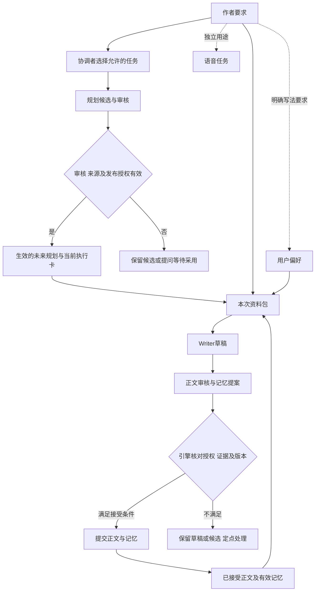

<a id="contents"></a>
## 章节目录

| 编号 | 专题 |
| --- | --- |
| 01 | [项目代码地图：每个目录和核心模块做什么](#inkflow-01) |
| 02 | [技术架构总览：界面、通信、引擎与存储](#inkflow-02) |
| 03 | [小说项目的数据地图：文件、数据库与版本](#inkflow-03) |
| 04 | [一次自然语言请求的完整旅程](#inkflow-04) |
| 05 | [Coordinator：如何理解作者并安排任务](#inkflow-05) |
| 06 | [Writer：如何把资料变成规划与正文](#inkflow-06) |
| 07 | [Editor：日常综合编辑如何工作](#inkflow-07) |
| 08 | [Reviewer：专项审查如何深入检查小说](#inkflow-08) |
| 09 | [Memory Keeper：如何提出可靠的记忆变更](#inkflow-09) |
| 10 | [协作模式：三个日常角色如何扩展到专项分工](#inkflow-10) |
| 11 | [Novel Engine：工作流、权限与质量门禁](#inkflow-11) |
| 12 | [模型调度：角色如何选择和调用实际模型](#inkflow-12) |
| 13 | [提示词与输出契约：模型结果如何进入程序](#inkflow-13) |
| 14 | [创作起点：题材、设定与用户硬要求如何形成](#inkflow-14) |
| 15 | [全书大纲：主线、高潮与结局如何生成](#inkflow-15) |
| 16 | [卷细纲：如何把全书方向展开为卷级因果](#inkflow-16) |
| 17 | [近期章节规划：未来十章如何具体安排](#inkflow-17) |
| 18 | [章节执行卡：规划如何转换为本章写作任务](#inkflow-18) |
| 19 | [规划审核与生效：候选方案如何成为当前依据](#inkflow-19) |
| 20 | [一章正文的生命周期：从草稿到已接受正文](#inkflow-20) |
| 21 | [正文审查：证据量表与放行判断如何计算](#inkflow-21) |
| 22 | [审核出错怎么办：补读、补证与反证复核](#inkflow-22) |
| 23 | [局部修订与作者介入：修改如何保留来龙去脉](#inkflow-23) |
| 24 | [记忆总览：三层记忆与三类权限如何区分](#inkflow-24) |
| 25 | [正史记忆：事实、人物状态与伏笔如何保存](#inkflow-25) |
| 26 | [临时记忆：草稿与连续任务如何保持衔接](#inkflow-26) |
| 27 | [用户偏好：软件如何记住作者想要的表达](#inkflow-27) |
| 28 | [历史状态回放：如何记住某一章当时发生了什么](#inkflow-28) |
| 29 | [检索系统：如何从长篇资料中找到相关依据](#inkflow-29) |
| 30 | [Context Packet：模型最终看到了哪些资料](#inkflow-30) |
| 31 | [正史提交与文件同步：如何防止丢稿和重复提交](#inkflow-31) |
| 32 | [并发与版本协调：多个任务如何安全同时进行](#inkflow-32) |
| 33 | [任务状态与恢复：失败之后怎样从断点继续](#inkflow-33) |
| 34 | [成本与性能：调用次数、Token 和缓存如何管理](#inkflow-34) |
| 35 | [语音系统：输入、朗读与小说音频如何工作](#inkflow-35) |
| 36 | [文风、素材与 Writer 训练：分别改变了什么](#inkflow-36) |

[直接查术语词库](#glossary)

<a id="inkflow-01"></a>
## 01. 项目代码地图：每个目录和核心模块做什么

**先用一句话理解：** 先把源码当作一张分工地图：找到某个功能从哪里进入、谁处理、最后存在哪里，就能沿路追查问题。

**遇到生词先看：** [源码](#term-source) · [模块](#term-module) · [函数 / 方法](#term-function) · [类](#term-class) · [Schema / Pydantic / 契约](#term-schema)


**实现口径：** 目录、类与主要调用入口可由当前源码确认；设计目标是跨入口保持同一权限与版本语义，仍需一次真实任务观察。

新增三个共享模块与原有职责的对应关系是：`story_settings.py` 管理本书可持续设定，复用 `studio.db` 的故事条目；`manual_edits.py` 比较管理文件与保存候选，复用正史数据库的 metadata 和 Agent 产物记录后台核对；`conversation_scope.py` 仅给对话历史、待答和续接状态加会话编号。它们没有创建第二套正史。模型输出的设定提案仍由 `schemas.py` 定义，实际调用仍由引擎完成；桌面新设置页只操作受控接口。模块怎样衔接见[第14节](#story-setting-collections)、[第23节](#manual-edit-lifecycle)和[第32节](#conversation-isolation)。这些路径的离线与界面验证范围见顶部发布记录。

墨流的代码可以按“用户入口—任务解释—创作执行—证据与存储”四条纵线阅读。仓库根目录的 `README.md` 面向使用者，`AGENTS.md` 是当前协作约束，`CHANGELOG.md` 描述已交付的用户可见变化，`docs/INKFLOW_COMPLETE_ANALYSIS.md` 同时记录现行设计与条件扩展。因此读文档时不能因为一段设计写得完整，就认定相应界面、迁移或后台调用已经运行。真正确认行为，需要落到当前代码的入口、数据结构、调用者和保存路径。最稳妥的阅读起点是 [角色协议](../agent/src/inkflow/role_protocol.py)、[任务编译](../agent/src/inkflow/coordinator.py)、[应用服务](../agent/src/inkflow/app_server.py) 与 [引擎](../agent/src/inkflow/engine.py)。这些文件分别回答“谁可参与”“允许执行什么”“请求怎样进入”“工作怎样发生”。

`agent/src/inkflow/` 是 Python 核心。`schemas.py` 的严格模型定义大纲、卷细纲、近期计划、章节卡、草稿、审核输出、记忆变更、任务票据和调度计划；它为模型文本与程序状态划出边界。`role_protocol.py` 定义版本化角色名、新任务的四种协作模式和检查归属；额外保留旧 deep 的历史责任映射用于恢复；旧协议中的 `reviewer` 在此按版本解释为综合 Editor，避免历史记录被误读。`coordinator.py` 将已经解释过的意图编译成受限 `TaskTicket` 与 `DispatchPlan`，并通过固定工作流模板校验越权步骤。`terminal_session.py` 承担会话中的意图解释、补充信息、澄清和续做，不能把它理解为任意执行代码的代理。[这些角色定义](../agent/src/inkflow/coordinator.py)与[模板校验](../agent/src/inkflow/coordinator.py)应一起读：前者说明意图，后者才说明哪些动作会被接受。

`engine.py` 体量很大，却不是一个无边界的“AI 大脑”。其中有明确的 `generate_plan`、`write_chapter`、`review_chapter_mode`、`review_chapter`、`accept_chapter` 等操作：各操作分别取材、调用模型或执行代码检查，并按自己的产物类型保存。它既承载旧版流程，也承载 v2 模式，所以读到 `reviewer` 字符串时必须看当前任务的 `role_protocol_version`。与引擎并行阅读的是 `planning_pipeline.py`，后者处理 v2 三层候选、审核及文件和 SQLite 当前执行卡的整组发布；`planning_history.py` 负责受限历史读取，`planning_cleanup.py` 负责预览、保留或确认后的清理，`outline_context.py` 负责把当前规划层级选成上下文。章节流程参见[写作入口](../agent/src/inkflow/engine.py)，规划流程参见[规划管线](../agent/src/inkflow/planning_pipeline.py)。二者共享来源版本概念，但规划生效不等于正文已发生，也不能把 v2 规划发布误画成一次数据库章节接受。

资料路径由 `context.py`、`retrieval.py`、`references.py`、`craft.py` 等组成。`ContextBuilder.build` 在写作、审查、修订模式下取不同数量的近期正史，读取计划、章节卡、截至本章之前的事实和线索，并按任务检索补充资料；生成的是一个可查看来源的 `ContextPacket`，而不是让每个角色自己拼无限聊天历史。[上下文构建](../agent/src/inkflow/context.py)可与[上下文结构](../agent/src/inkflow/schemas.py)对读。`prompts.py` 是角色系统约束和输出要求，`review_rubric.py` 与 `review_verifier.py` 分别承担量表政策和证据核验；模型提出判断，程序必须核对引用、正文版本及门禁，二者不能互相替代。

数据线的核心是 `project.py` 与 `database.py`。`InkFlowProject` 管项目根目录、路径安全、文件写入与恢复；`ProjectDatabase` 管 SQLite 中的计划、章节、审核、正史事实、线索、偏好、协作事件等。[项目文件提交](../agent/src/inkflow/project.py)与[章节接受](../agent/src/inkflow/database.py)共同解释了“Markdown 文件”与“数据库正史”为什么要协调。`checkpoints.py`、`trace.py`、`project_lock.py` 保存任务恢复、过程记录及共享写入协调。它们不是额外的 Agent；角色决定提出什么，存储与权限服务决定能否落地。文件树里还有 `learning.py` 与 `writer_training.py`，但存在学习导出和训练准备代码，不表示远端 Writer 模型权重已经被改变。

用户入口的另两端是 `desktop/` 和 `extension/`。桌面端的 [React 主界面](../desktop/src/App.tsx)、[项目中心](../desktop/src/ProjectCenter.tsx)、[编辑器](../desktop/src/MonacoEditors.tsx)呈现对话、项目和文本；Electron 进程与 Python 应用服务连接。扩展负责编辑器环境的入口；`cli.py`、`mcp_server.py` 则提供命令行和工具协议入口。这些入口共用核心领域数据的方向是明确的，但不能把桌面按钮、CLI 命令和 MCP 工具说成完全等价：参数、授权提示和界面反馈可能不同。若某个入口表现异常，先由 [app_server.dispatch](../agent/src/inkflow/app_server.py) 或相应入口向下追踪，不要直接在引擎里猜测用户行为。

从零阅读时，可先在桌面输入一个具体目标，静态跟到 `JsonLineServer.process`、`InkFlowAppService.dispatch`、`TerminalSession.handle`、`Coordinator.compile`，再进入一个引擎动作，最后查看数据库与文件投影。这样能分清“用户原话”“角色模型请求”“代码生成的检查”“最终状态”四种不同事实。比如用户说“写第十六章”，不等于 Writer 立即收到一句孤立指令；引擎还要找章节卡，构建资料包，验证前章与来源版本。相反，用户只是讨论一个剧情可能性时，不应因为 `engine.py` 有写作方法就自动建立正文。目录地图的用途是找责任边界，不是让所有模块在每个请求中跑一遍。

还需警惕命名上的历史沉积。`ReviewModelOutput` 在旧路径中把通过结论和 `memory_patch` 绑在一起；v2 实际向模型请求的是 `ModeCheckOutput`，由引擎按角色和检查所有者校验、汇总。[v2 调用](../agent/src/inkflow/engine.py)与[输出模型](../agent/src/inkflow/schemas.py)可直接对读。`EditorResult`、`ReviewerResult`、`MemoryResult` 虽在 `schemas.py` 定义，但当前 `agent/src/inkflow/` 没有构造或调用它们的运行路径；这些类是设计结构，不能说成正在运行的门禁。0.7.2 已将 Memory Keeper [提示词](../agent/src/inkflow/prompts.py)对齐 `ModeCheckOutput`。按角色的用量汇总从每条事件读取协议版本：旧 `reviewer` 归综合 Editor，v2 `reviewer` 归专项 Reviewer，[实现见应用服务](../agent/src/inkflow/app_server.py)；原始历史记录保持原样。桌面引导文字已随审查模式调整，作者要求这一入口反馈改动不做本次验证。

| 阅读层 | 关键源码 | 该层回答的问题 | 下游必须核对 |
| --- | --- | --- | --- |
| 入口 | `desktop/src/App.tsx`、`app_server.py`、`terminal_session.py` | 原话与操作怎样形成请求 | 是否保存意图和授权 |
| 调度 | `role_protocol.py`、`coordinator.py`、`task_settings.py` | 哪些角色、步骤、预算允许参与 | 模式快照与模板是否一致 |
| 产出 | `engine.py`、`planning_pipeline.py`、`provider.py` | 谁生成规划、正文与意见 | 结构化输出及来源是否有效 |
| 依据 | `context.py`、`retrieval.py`、`review_rubric.py` | 模型看过什么、怎样判定 | 引用是否对应实际版本 |
| 存储 | `database.py`、`project.py`、`planning_history.py`、`planning_cleanup.py`、`checkpoints.py` | 候选、当前依据、历史与正史如何区分 | 写入、恢复、历史选择与文件投影 |

**源码关系图：** 箭头表示模块依赖，不表示CLI、MCP与桌面都通过app_server，也不表示每次操作必经模型。

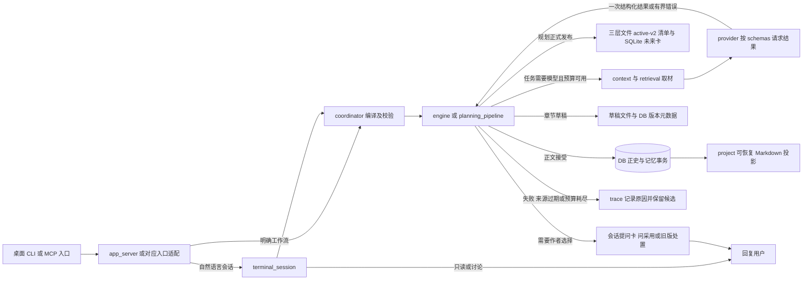

**上游与下游导读。** 本节是阅读索引；沿请求方向继续看[02. 技术架构总览](#inkflow-02)和[04. 一次自然语言请求的完整旅程](#inkflow-04)。想追章节资料来源转到[第30节](#inkflow-30)，想追提交结果转到[第31节](#inkflow-31)。图中箭头表示主要依赖，实际任务可能只读或在澄清处停止。

[writer_notes.py](../agent/src/inkflow/writer_notes.py)统一挑出同正文版本的公开说明、计算说明指纹、检查候选原句，并筛选已接受章可供后续参考的创作意图。引擎、上下文与工作区共用同一读取规则，避免一个入口读当前说明、另一个仍读历史附件。它不增加 Agent 或第二套正史库，沿用现有附件表保存说明及纠正问答。

**问题与边界。** 仓库同时保留旧流程、新协议和未来扩展描述；按文件名猜现行路径容易误判。应用服务可接受多个请求，不代表所有角色都并发；数据库有章节内容，也不代表每个历史版本都在同一张表完整保存。目录列表本身无法证明安装包已采用最新源码，发布态要另查构建产物和真实操作。

当前记忆与偏好的共享实现位于 [`preferences.py`](../agent/src/inkflow/preferences.py) 与 [`memory_records.py`](../agent/src/inkflow/memory_records.py)。前者统一作者默认和本书偏好的保存、来源、历史与合并；后者管理证据定位、事实变更日志和直接依赖查看。桌面 [`AuthorPreferences.tsx`](../desktop/src/AuthorPreferences.tsx) 嵌在设置中，不另建工作区。数据库仍只有本书正史一个权威提交者；独立作者偏好文件不保存小说正史。

**下一轮实施清单。**

| 当前判断或问题 | 源码依据 | 影响与边界 | 最小修改位置 | 前置依赖 | 后续观察条件 |
| --- | --- | --- | --- | --- | --- |
| 0.7.2 已修：历史角色按协议解释，原始记录不改写 | [角色迁移](../agent/src/inkflow/role_protocol.py)、[用量汇总](../agent/src/inkflow/app_server.py) | v1 `reviewer` 计入 Editor，v2 计入专项 Reviewer | 运行记录的版本化读取与桌面展示 | 每条事件有协议版本；缺失按 v1 | 最小离线 MVP 核对两版记录分别归类；无协议的近期账本只标边界 |
| 0.7.2 已修：v2 提示词与实际 `ModeCheckOutput` 一致 | [运行输出模型](../agent/src/inkflow/engine.py)、[Memory Keeper 提示词](../agent/src/inkflow/prompts.py) | 未使用的 `EditorResult` 等保留为设计结构 | 现行提示、Schema、解析和保存路径 | 保持现有引擎审核门禁 | 最小离线 MVP 核对调用契约；无须重写引擎 |
| 0.7.2 已改；本次已重新授权发布检查：入口审查反馈 | [应用分派](../agent/src/inkflow/app_server.py)、[会话反馈](../agent/src/inkflow/terminal_session.py) | 新任务统一记忆加强；旧 deep 按原快照解释实际审查角色，并说明审查与接受边界 | 应用服务与桌面反馈文字 | 模式由任务快照确定 | 入口验证以顶部发布记录为准；实际用户体验仍待观察 |

[返回章节目录](#contents) · [打开零基础术语词库](#glossary)


<a id="inkflow-02"></a>
## 02. 技术架构总览：界面、通信、引擎与存储

**先用一句话理解：** 界面负责接收你的操作，后台负责办事，数据库和文件负责保存结果；这一节把三者连起来。

**遇到生词先看：** [UI / 前端](#term-ui) · [后端 / 引擎服务](#term-backend) · [进程](#term-process) · [请求、响应、IPC、JSON-RPC](#term-rpc) · [SQLite / 数据库 / 表](#term-sqlite)


**实现口径：** JSON 行服务、Python 引擎、[SQLite](#term-sqlite)（本地数据库） 与文件投影均有当前代码；设计目标是远端请求不长期占共享写锁，长请求下的表现须按实际入口核验。

<a id="conversation-windows"></a>
**新增窗口与后台层的实际布局。** “设置 → 本书设定”管理模板、合集、字段、权限和具体记录；“设置 → 审查”中的“手动修改自动核对”默认开启。工作区可打开后台核对面板，查看文件、候选原句、对照原文、原因及用户决定。桌面每八秒按可用开关扫描受管理文件，Python 应用服务只为存在 `pending` 的项目排一个后台工作者；同项目的手动核对串行取队列，不为每次轮询调用模型。扫描和保存接口见 [app_server.py](../agent/src/inkflow/app_server.py)，界面见 [App.tsx](../desktop/src/App.tsx) 与 [StorySettings.tsx](../desktop/src/StorySettings.tsx)。后台异常保留在任务状态中；小说的普通模型工作流仍按[第11节](#inkflow-11)推进。

“＋独立对话”使用 Electron `BrowserWindow`，窗口有各自 `conversation_id`；主进程根据请求的真实来源窗口绑定编号，不能由聊天文本随意冒用另一窗口。一个窗口的待答选择和聊天历史不会直接替另一个窗口作答；作品正史、设定、规划、版本锁仍共享。当前自由布局落实在**聊天面板浮动移动、调整宽高和操作系统独立窗口**：原来的左、右、下方选项仍保留，浮动状态可拖动、用方向键微调，布局状态可保存。它没有把所有编辑器、文件树、提问卡和设置页改成任意停靠系统，不能把“聊天可自由移动”写成“全部区域随意组合”。关闭一份有未返回请求的独立窗口会提示任务仍在后台；关闭主应用仍走全应用退出流程，重开同一对话再查运行结果。见 [main.ts](../desktop/electron/main.ts)、[conversation_scope.py](../agent/src/inkflow/conversation_scope.py) 及[第33节](#inkflow-33)。构建及实际窗口验证范围见顶部发布记录。

墨流桌面架构可以用一句话概括：界面负责表达作者意图和显示可编辑结果，应用服务把操作变成受控任务，Python 引擎执行创作和校验，SQLite 保存权威状态，Markdown 为作者提供可读文件。这几层各有自己的失败形式，不能把一次界面报错笼统归为“模型失败”。例如用户点“继续写”，界面可能没有正确传递项目路径；服务可能在路由时认为范围不清；引擎可能发现缺章节卡；Provider 可能限流；模型可能交回不符合结构的内容；数据库可能拒绝过期版本。只有沿实际链路定位，才能避免重复调用昂贵的 Writer。总体设计关系见本节下面的组件图，可运行代码的入口见[应用服务](../agent/src/inkflow/app_server.py)。

桌面侧使用 Electron 容纳 React 与 TypeScript 界面。[桌面主界面](../desktop/src/App.tsx)呈现项目、对话、编辑与任务进度；Electron 进程负责启动和连接后台。首页的“最近打开”只记录成功打开过的项目标题、路径和时间，写到 Electron 固定的 `userData/recent-projects.json`，因此开发版 Vite 端口变化不会让列表消失；旧网页域里可见的记录会尝试迁入，项目正文仍留在原文件夹。“移除记录”只移除快捷入口，删除项目文件另走确认及系统回收站。Python 侧的 [JsonLineServer](../agent/src/inkflow/app_server.py)读入逐行 JSON 请求，按请求 ID 和运行 ID 分派；[process](../agent/src/inkflow/app_server.py)负责处理异步任务及结果事件。这里的“异步”意味着独立请求可以建立不同执行任务，不保证所有写入没有冲突。共享章节、正史指针或文件投影仍要靠版本检查和短暂写锁协调。界面响应与后台流程分离后，作者可以看到阶段信息，也可能中途补充指令；因此任务记录必须保留原话和新增指导究竟作用于哪个节点。

进入创作域后，自然语言会话由 [TerminalSession.handle](../agent/src/inkflow/terminal_session.py#L512)判断可确定的只读回应、直接任务与需要模型理解的表达；桌面明确触发的 `workflow.run` 则由应用服务构造意图并编译计划，不能一概画成先经过 TerminalSession。[直接工作流入口](../agent/src/inkflow/app_server.py)与[Coordinator.validate](../agent/src/inkflow/coordinator.py#L409)分别承担入口组装和白名单模板比对。引擎服务并不听任模型自由调用任意方法：任务要带来源范围、角色模式、依赖条件和授权状态。这样做的实际价值是在“我想改一下后面十章”一类表达中，把规划、正文和设定编辑拆开，先检查已接受章节的边界，再决定能运行哪些步骤。若说“先别写”，模型产生写作意愿也不能越过当前授权。

引擎内既有程序规则，也有角色模型调用。程序规则检查章节卡存在、字数范围、文件哈希、来源指纹、审核覆盖和提交权限；模型承担无法以固定规则完成的叙事设计、具体正文、证据判断与记忆提案。角色调用由 [Provider 抽象](../agent/src/inkflow/provider.py)通往实际服务，`generate_json` 明确要求结构化返回；[配置](../agent/src/inkflow/config.py)可为角色设不同生成参数。角色数量不等于供应商数量，也不等于一次任务的请求数：三个角色可以共用同一模型，一次 Writer 修订则可能需要多次请求。技术架构必须同时记录角色、模型、任务模式和费用，才能说明一次结果从哪来。

`ContextPacket` 是创作层与资料层之间的合同。它把当前要求、规划、正史、人物状态、近期正文和检索结果整理成确定顺序的区段；[ContextBuilder](../agent/src/inkflow/context.py#L191)根据 draft、review、revise 任务取不同材料。最关键的是证据来源：审核不是仅凭模型“想起”旧章节，正文引用需能回到被接受的版本。当前实现的 `facts_as_of(chapter_no - 1)` 和 `threads_as_of(chapter_no - 1)` 避免让角色提前知道未来事实；旧版 Markdown 退回路径还会核对内容哈希。若正史内容与哈希不符，构建资料包应失败并展示修复条件，而非继续喂给模型一份无法确定来源的文本。

SQLite 的职责比缓存更重。[ProjectDatabase](../agent/src/inkflow/database.py#L268)保存项目元信息、正式三层规划的当前数据库执行投影与仍有正史依赖的旧卡、草稿版本元数据、已接受章节全文、审核、事实、线索、偏好和协作事件；v2 三层规划的生效指针在 `planning/active-v2.json`，不能归入这张数据库地图。章节的 [accept_chapter](../agent/src/inkflow/database.py#L1294)负责在事务中处理接受和记忆变更；正史 Markdown 通过 [InkFlowProject 的文件提交路径](../agent/src/inkflow/project.py)同步。草稿则先写文件、再记录数据库路径/哈希/版本，流程不同。数据库事务不能天然覆盖文件系统，所以项目层另有暂存、最终化和恢复步骤。把 Markdown 直接视为唯一正史会让外部编辑绕过审核；把数据库当作唯一作者可见结果又会失去透明文件。二者采用权威状态与投影关系时，必须在打开项目和提交失败后有恢复途径。

架构的另一根主线是版本。Writer 发送请求前冻结写作来源，远端等待后比较指纹；若来源已变，候选会单独保存而不覆盖当前草稿，见[写作版本检查](../agent/src/inkflow/engine.py)。审核也要绑定正文哈希和规划版本，不能拿旧稿报告审批新稿。运行中的任务有模式与配置快照，途中新设定或用户补充可能只让受影响结果失效，不应丢弃独立完成的成果。这样才可能让只读查看、语音和独立模型请求并发，同时保证同章依赖按顺序进入正史。架构图应把远端模型请求与数据库提交分开看：前者时间长、可并发，后者很短且需要严格核对。

失败处理要沿层级定位。界面断线要追服务进程及请求 ID，Provider 错误要检查限流与可重试条件，结构化输出错误可在同节点有界修复，审核资料不足要定向补读，正史冲突则要保留候选并要求重新取材。Coordinator 可以调整尚未执行的任务路线，但不能代审核者放行，也不能在版本不符时强推提交。这种分工比“发生异常就从头再写一章”更能保护作者投入和调用费用。[断点与状态](../agent/src/inkflow/checkpoints.py)以及[过程追踪](../agent/src/inkflow/trace.py)为此提供基础，不过其覆盖率必须通过真实任务观察，不能由存在文件就宣布中断恢复完备。

| 层次 | 主要输入 | 主要输出 | 守住的边界 |
| --- | --- | --- | --- |
| React/Electron | 作者输入、项目操作 | 请求与可见状态 | 不自行宣称正史已提交 |
| 应用服务/会话 | 请求、对话与运行状态 | 意图和任务事件 | 不把闲聊变成写作授权 |
| Coordinator/引擎 | 任务票据、模式快照 | 白名单步骤和执行结果 | 不跨角色权限与依赖 |
| 上下文/Provider | 来源版本与结构化契约 | 规划、正文、审核提案 | 不把模型文本当权威记录 |
| SQLite/Markdown | 已核验结果 | 正史与可读投影 | 防覆盖、可恢复、可追溯 |

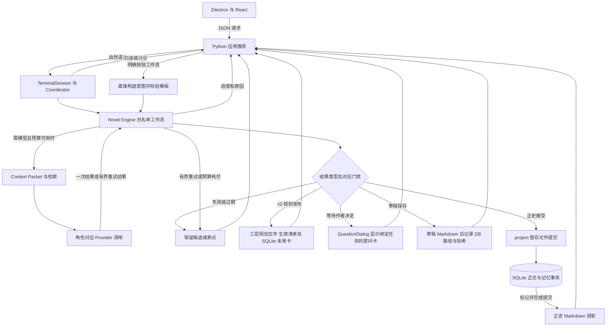

**上游与下游导读。** 从[01. 项目代码地图](#inkflow-01)进入本节，再沿[03. 小说项目的数据地图](#inkflow-03)检查落盘形态，沿[04. 一次自然语言请求的完整旅程](#inkflow-04)检查动态调用。并发与恢复细节分别在[第32、33节](#inkflow-32)展开。

**问题与边界。** 项目写锁负责保护共享写入，不能因为推测中的排队就缩小或移除。所引章节审查路径在模型返回后才取得项目写锁，不能作为“远端等待占锁”的证据；其他入口若出现可定位的无关请求阻塞，再按实际调用栈调查。当前静态阅读不能证明打包版本、桌面状态或付费服务可用，尤其不能把图中可选边误说成每次调用。

设置中的“作者习惯与记忆”通过 `preferences.manage` 管理跨书作者习惯及当前书偏好，`memory.audit` 读取当前书事实证据。作者习惯接口不要求打开小说；本书操作必须提供有效项目路径。全球作者习惯保存在现有用户设置目录旁的 `author-preferences.sqlite3`，项目事实和本书偏好仍在项目数据库。偏好更新与历史事件在同一个 SQLite 事务中提交，不受可选学习记录开关影响。

**通信失败的归属。** Electron 的 [EngineBridge](../desktop/electron/main.ts) 给子进程标准输入注册 error 处理，写管道中断进入 failChild，作者看到本地引擎通信中断。它是宿主传输故障，不证明某次业务事务没有提交，也不自动重新运行原任务。重连后先查运行ID、产物版本和提交状态，再决定续接；与数据库投影恢复见[第31节](#inkflow-31)、任务恢复见[第33节](#inkflow-33)。

**下一轮实施清单。**

| 当前判断或问题 | 源码依据 | 影响与边界 | 最小修改位置 | 前置依赖 | 后续观察条件 |
| --- | --- | --- | --- | --- | --- |
| 现有保护，保留：所引审查路径在模型返回后才取得项目写锁 | [项目锁](../agent/src/inkflow/project_lock.py)与[审查入口](../agent/src/inkflow/engine.py) | 共享写入串行，避免并发覆盖；该路径不能证明远端等待占锁 | 无；不为推测的排队问题改锁 | 只有出现无关请求被远端等待阻塞的可定位记录，才调查具体持锁段 | 本项不实施并发改造；提交仍按来源版本复核并串行写入 |
| 现有保护，保留：数据库提交和文件写入跨存储恢复 | [文件提交](../agent/src/inkflow/project.py) | 中断时恢复正史投影 | 复用已有恢复步骤 | 故障位置明确 | 重开项目后正史与 Markdown 哈希一致 |
| 本轮文档修正：已分清规划、草稿与正史三种写入路径 | [v2 生效清单](../agent/src/inkflow/planning_pipeline.py)、[草稿保存](../agent/src/inkflow/engine.py) | 防止把草稿或规划说成 DB 正史 | 无代码修改；后续只核对界面 | 先确定产物类型 | 规划、草稿、正史显示各自来源与状态 |
| 源码已实现：引擎stdin错误进入通信失败处理 | [main.ts](../desktop/electron/main.ts) | 报告宿主管道中断，不推断业务未提交 | EngineBridge.failChild与请求状态 | 当前子进程与运行ID | 实际错误可见；恢复前先查业务提交状态，不重复执行已完成步骤 |

[返回章节目录](#contents) · [打开零基础术语词库](#glossary)


<a id="inkflow-03"></a>
## 03. 小说项目的数据地图：文件、数据库与版本

**先用一句话理解：** 一本小说同时有正文文件和内部记录；这一节说明各自存什么，哪一份在什么情况下算正式依据。

**遇到生词先看：** [版本 / revision / 分支](#term-version) · [哈希 / 内容哈希](#term-hash) · [投影 / 同步 / 事务日志](#term-projection) · [正史 / 已接受正文](#term-canon)


**实现口径：** 章节内容、事实、线索、偏好及恢复路径可在数据库和项目层确认；设计目标是旧项目安全迁移且外部改稿不丢失，真实覆盖范围仍待核验。

打开一本墨流小说时，作者看到的是项目目录中的设定、规划、章节和草稿；引擎看到的是这些文件加 SQLite 的结构化状态。两种视角都必要：可读文件方便作者手改、备份和迁移，数据库可以准确保存第几章已接受、审查针对哪个版本、哪些事实何时生效。单看文件名无法判断一段文字是否已成为正史；单看数据库的一条记录也不足以判断外部 Markdown 投影有没有被改过。因此数据地图要先按“权威程度”和“生命周期”分类，再按文件夹分类。项目创建及基础布局见[InkFlowProject.create](../agent/src/inkflow/project.py#L50)，状态读取见[ProjectDatabase.project_status](../agent/src/inkflow/database.py#L2174)。

第一类是作者当前明确指令与项目设定。书名、题材、目标读者、用户硬规则等保存在项目简报及相应文件里；创作时 `ContextBuilder` 会读取 `get_brief()`。明确改设定应生成新依据，未来草稿据此写；含糊的“也许可以”只能作为讨论或候选。第二类是规划：全书大纲提出主线和结局方向，卷细纲展开卷级因果，近期章节计划细化到未写窗口，再由章节卡给 Writer 本章目标。规划被审核并发布后成为“当前写作依据”，却仍是未来假设；它不能把尚未写的事件写入人物已经知道的正史。当前存在两条实现路径：旧版 [save_plan_bundle](../agent/src/inkflow/database.py#L426) 保存可执行 `PlanBundle` 和章节卡，v2 三层规划则由 [planning_pipeline.py](../agent/src/inkflow/planning_pipeline.py) 发布 Markdown 与 `planning/active-v2.json` 清单；正式三层发布会同步创建当前数据库执行视图；旧项目已有 v2 清单但数据库尚未同步时，[ensure_chapter_plan](../agent/src/inkflow/engine.py#L676)只做一次本地投影补齐，不增加正式修订号。生效清单本身仍在文件中，不在 SQLite。

第三类是章节正文。先把[哈希](#term-hash)理解成“给这份文字算出的校验码”：相同文字得到相同值，改动一个字通常就会得到不同值。它只用于核对文字有没有变化，**不能评价写作质量，也不能代替审核**。例如，审查通过的是草稿 A；作者随后把人物名字改了，文件就成了草稿 B。即使仍是同一章、文件名没变，提交时也必须发现文字已变，不能拿 A 的审查结论放行 B。

实际保存时，Writer 先把草稿全文写成 Markdown；[upsert_draft](../agent/src/inkflow/database.py#L655)在数据库中记录文件路径、内容哈希、版本号和草稿状态，不把草稿全文写入 `chapters.content_text`。[get_chapter](../agent/src/inkflow/database.py#L692)可读取当前章状态。正式接受时，[引擎接受入口](../agent/src/inkflow/engine.py)检查审查结论、量表、权限、计划和来源指纹；[数据库事务](../agent/src/inkflow/database.py)再核对草稿版本、哈希、最新审核 ID 和临时记忆是否对应，随后保存已接受正文全文及其记忆。数据库不重新判断文学质量。未来读取正史正文以 [canonical_chapter_content](../agent/src/inkflow/database.py#L1464) 为权威入口；旧数据回退读取 Markdown 时仍核对哈希。因此，在文件管理器里直接改已接受章，不会让改后的文字悄悄变成已审核正史。

第四类是记忆与反馈。`current_facts` 与 `facts_as_of` 保存事实在当前或某章边界的有效视图；`open_threads` 和 `threads_as_of` 处理未结伏笔；`list_preferences` 读取本书偏好，`effective_preferences` 合并跨书作者默认。这几类东西性质不同：故事事实回答“作品里已发生什么”，线索回答“承诺与悬念目前如何推进”，偏好回答“作者希望怎样写”。编辑或 Memory Keeper 的模型结果只是 `MemoryPatch` 候选，只有引擎核验后才进入正史。批次中的未接受章节还有 [provisional memory](../agent/src/inkflow/database.py) 暂存路径，服务于同一批次后章衔接；批次失效时必须一并失效，不能与正式事实混存。第 24–28 节将分别展开这几类记忆。

**可持续设定另有自己的参考身份。** 十二类模板和用户自定义模块不只出现在 `BOOK.md`。它们复用 `studio.db.bible_entries`，用 `story_settings_type` 区分合集与记录，保存用户名称、分类、负责内容、字段、读写角色、条目性质、证据、修订号与修改前历史。原有故事圣经条目仍可读取；新模块不会在旧故事圣经上下文中再装一次。设定可整理规划、草稿、钩子及已接受正文，但每个来源都保留不同身份；`objective` 只是记录声明的性质，不能把 `reference_only` 升格为正式事实。章的正文版本、合集配置修订和条目修订各自独立，来源变化再通过指纹追踪，见 [story_settings.py](../agent/src/inkflow/story_settings.py) 与[第14节](#story-setting-collections)。

手动核对任务则保存在正史数据库 metadata 的 `manual_edit_jobs`、`manual_edit_heads`、`manual_document_hashes`，候选原内容存为 `manual_edit_candidate` Agent 产物。这些记录回答“用户改了什么、哪版在核对、采取了什么决定”，不是事实表的替代。未改内容不产生重复审核；已接受文件被外部修改时，SQLite 正史保持原文，变动全文另存候选并等确认。回执中的 `canon_committed=False` 应按字面理解，见[第23节](#manual-edit-lifecycle)。

第五类是过程与恢复资料。审核报告、模型输出、任务票据、协作消息、追踪记录、候选规划、过期版本和文件提交日志，对作者而言可能不是小说内容，但解释了“这版为何通过”“为什么停在第十六章”“旧版能否撤回”。[save_agent_artifact](../agent/src/inkflow/database.py#L1632)保存角色产物，[save_review](../agent/src/inkflow/database.py#L782)保存审核，[TraceRecorder](../agent/src/inkflow/trace.py#L133)记录阶段。数据清理不能只按“过期”标签批量删：只要旧候选被审查引用、承担恢复依据，或是作者手改版本，它仍有保留价值。设定模块和条目移出使用仅留档；独立候选及允许删除的规划历史另有精确清单、引用检查、用户逐项选择和再次确认，当前专用流程执行永久删除，不假称已经进入可恢复回收区。对应边界见 [协作规则](../AGENTS.md)与[第19节](#inkflow-19)。

规划历史属于这一类，而不是 Writer 默认取材库。[正式发布管线](../agent/src/inkflow/planning_pipeline.py)把被替换的 Markdown 与旧 SQLite 规划行保存到 `planning/history/`，并留下待处理记录。当前生效清单的 `protocol_version=2` 只说明数据格式；`revision_no` 才表示作品已经完成第几次正式发布。第 3 版、第 4 版仍可使用协议 v2。只有整组三层规划成功发布，修订号才从上一生效版加一；未通过、暂停、等待采用、写入回滚、旧项目执行卡补投影都不加一。历史版选择“保留”后，只有用户明确要求并指定版本与部分时才能读取；第 [19 节](#inkflow-19)解释发布与处置，第 [30 节](#inkflow-30)解释当前输入，第 [31 节](#inkflow-31)解释恢复依赖。

数据库与 Markdown 的关系是数据地图中最容易误解的一条。SQLite 事务不能原子包含文件系统写入，因此 `InkFlowProject.prepare_file_commit`、`mark_file_commit_database`、`finalize_file_commit` 和恢复方法组成分阶段提交路径。文件可能在数据库落库前被暂存，或数据库已经接受但最终 Markdown 尚未完成；重开项目时 [recover_pending_commits](../agent/src/inkflow/project.py#L498)和[recover_accepted_chapter_projections](../agent/src/inkflow/project.py#L524)处理此类中断。静态代码表明项目设计有恢复机制，却不能据此保证每一种异常都已在真实安装包里观察到。做产品说明应说“有可恢复提交路径”，并标注本轮没有执行故障注入。

版本不是一个抽象数字。章有正文版本和哈希；规划有当前生效指针与来源哈希；任务有角色模式、设置快照和当时看到的故事边界；审核有被审章的内容哈希、规划版本和引用来源。当 Writer 正在远端生成时，用户可能手改章节卡或接受了前章，因此引擎在返回时重新比较指纹，变更后把迟到文本保留为候选，不覆盖当前目标。相同原则适用于 Reviewer 的结论和 Memory Keeper 的提案：资料变动后“原来通过”不等于“现在还能通过”。这也是[写作来源指纹](../agent/src/inkflow/engine.py)与[审核来源指纹](../agent/src/inkflow/engine.py)的用途。

一个具体例子能说明数据层次：作者接受了第十五章，要求“第十六至二十五章换一种走向”。第十五章正文及其事实仍是正史；新大纲、卷细纲、近期规划依次成为候选并接受审核；原有未来计划可以标失效，但第十五章正文不能因为它曾引用旧计划就被重写；第十六章草稿若已存在，必须核对是否沿用了过期章节卡。以后写第十六章时，Writer 需要第十五章的真实状态和当前生效规划，不能把第十七章规划里的秘密提前当作第十六章已知事实。数据库的 `facts_as_of(15)`、计划指针和上下文包共同保障这个区别。

| 数据对象 | 权威状态 | 主要生产者 | 何时可用于后续写作 |
| --- | --- | --- | --- |
| 用户明确要求、简报 | 用户与项目设置 | 用户、受控设定编辑 | 保存并记录版本后 |
| 大纲/卷细纲/近期计划 | v2 候选、三层正式清单与当前 SQLite 执行视图；旧版另有独立入口 | Writer 生成，审核者核对，引擎整组发布 | 清单、文件哈希与来源仍有效时 |
| 草稿与试写 | Markdown 候选；草稿 DB 行只存路径、哈希和版本 | Writer | 同任务可参考，不能冒充正史 |
| 本书设定合集与条目 | 可修订的创作假设与证据参考；有原文也不自动成为正史 | 用户定义职责，Writer 新提案，审查/记忆角色有据补充 | 读权限、章节边界和来源仍有效时，保留待核/设想身份 |
| 已接受章节 | 正史 | 审核通过后由引擎提交 | 内容哈希与版本有效时 |
| 事实、伏笔、偏好 | 不同权限域 | Editor/Memory Keeper 提案，用户偏好另记 | 按来源、时间及适用范围读取 |

下图是**数据状态关系图**，说明规划候选、草稿和正史各自的发布条件；它不是每个请求都会执行的完整调用链。

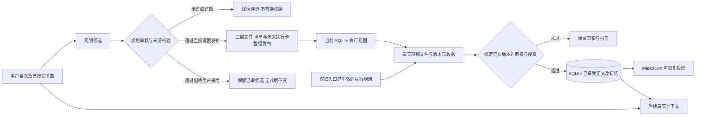

**上游与下游导读。** 本节承接[02. 技术架构总览](#inkflow-02)的数据出口；接下来[04. 一次自然语言请求的完整旅程](#inkflow-04)把这些状态放回执行顺序。计划请继续第 15–19 节，章节提交继续[第20、31节](#inkflow-20)，三类记忆继续第 24–28 节。

**问题与边界。** “已生效规划”“已接受章节”“暂存批次记忆”和“用户偏好”在界面中若都称为记忆，会误导作者以为未来事件已经发生。旧数据可能缺数据库权威正文而需要有条件迁移；自动迁移不能在缺少确认时破坏现有文件。本文没有统计实际项目内各种版本数量，不能据此评估清理收益。

**下一轮实施清单。**

| 当前判断或问题 | 源码依据 | 影响与边界 | 最小修改位置 | 前置依赖 | 后续观察条件 |
| --- | --- | --- | --- | --- | --- |
| 现有保护，保留：旧项目有正史内容迁移判定路径 | [迁移状态](../agent/src/inkflow/project.py) | 旧文件与 DB 可能不一致 | 复用现有迁移与投影恢复 | 明确旧项目样本及备份 | 迁移前后章节哈希和内容一致 |
| 本轮文档修正：v2 生效清单不在 `database.py` | [v2 读取](../agent/src/inkflow/planning_pipeline.py) | 防止迭代时错误设计迁移 | 无代码修改；结果来源字段待核 | 先区分旧执行卡与 v2 清单 | 每个规划结果可回到文件和清单 |
| 待核影响，先复现：界面可能把规划与正史状态混称 | [项目中心](../desktop/src/ProjectCenter.tsx) | 作者可能误判剧情已发生 | 状态标签与说明 | 查看当前界面 | 候选、已生效规划、正史各有清楚标识 |

[返回章节目录](#contents) · [打开零基础术语词库](#glossary)


<a id="inkflow-04"></a>
## 04. 一次自然语言请求的完整旅程

**先用一句话理解：** 你说一句“写下一章”，软件还要确定范围、准备资料、写草稿、核对版本，最后才向你汇报。

**遇到生词先看：** [工作流 / 节点 / 上游 / 下游](#term-workflow) · [路由 / 白名单](#term-routing) · [快照](#term-snapshot) · [门禁 / 硬约束](#term-gate)


**实现口径：** 以下按当前入口与引擎分支追踪；路由归一化、任务模板、模型请求和正文提交分别核对。当前源码检查不等于桌面界面、模型理解或正史提交的端到端验收。

本次新增两条入口，但没有改写这套授权链。自然语言“建一份人物状态设定”“给这条记录补原文”“移出这个场景档案”由 Coordinator 理解为 `story_settings_manage`，引擎再校验唯一合集、条目、字段、权限和修订号；数据只读及用户明确配置不必启动 Writer。桌面保存、导入受管理文件或外部改稿由 `manual_edits` 比较内容，真正变化才另建后台同版核对，原请求并不因此获得接受授权。后台疑问可以在核对面板处理，也可在本对话中明确指定 job_id、候选指纹和处理原因交引擎记录，不能把无目标的“同意”套给另一文件。完整分支见[第14节](#story-setting-collections)和[第23节](#manual-edit-lifecycle)。

同时，一份请求属于发起它的 `conversation_id`。主对话沿用原 metadata 键与 `DIALOGUE.md`；独立对话的历史保存在 `.inkflow/conversations/<编号>.md`，待答任务、排队补充及保存计数有独立键。窗口事件按会话编号分发，但故事版本与授权仍由同一个项目引擎核对。固定单选卡的复用只在该会话的当前问题中发生，见 [conversation_scope.py](../agent/src/inkflow/conversation_scope.py) 与[第32节](#conversation-isolation)。

用“请接着第十五章写第十六章，先给我看草稿，暂不收进正史”作为贯穿例子，最容易看清墨流怎样把原话转换为受控动作。此句同时给出写作目标、章节范围和禁止接受的限制；如果只抓到“写第十六章”，就可能错误执行审核和自动接受。桌面入口把项目路径和消息交给应用服务；服务建立请求及运行标识，再由会话层读取近期对话、项目状态和可能等待中的澄清。不同版本入口还可能通过命令行或 MCP 触发类似动作，但本节只描述可从 [TerminalSession.handle](../agent/src/inkflow/terminal_session.py#L512) 和 [应用分派](../agent/src/inkflow/app_server.py)核对的会话主线，不假定每种入口逐字相同。

在意图阶段，会话层可能直接识别可确定任务，也可能请 Coordinator 模型处理复合目标；之后确定性策略再按原话纠正否定、单章范围和任务关联。不能把这些路径写成所有请求一律“先由程序识别、再调用 Coordinator”。[共用的接受限制判断](../agent/src/inkflow/coordinator.py)同时用于 `normalize_intent` 与[会话接受策略](../agent/src/inkflow/terminal_session.py)：前者在任务编译前记录禁止接受并降级动作，后者在应用保存的自动接受设置前再次守住本轮限制。“暂时别写进正史”“暂时别收进正史”因此都不能被模型建议或保存设置升级成接受。写作否定另按对象判断：明确“先别写第十六章，先审第十六章”时保留审核目标、禁止新写作；“别把遗失的原件写回来”只约束内容，不能误当作禁止写整章。若用户只是讨论剧情，动作是讨论；如果要求具体段落，交给 Writer 产生隔离候选。回答待处理问题时，必须确认它绑定哪一个问题与任务，不能把一句“可以”当作所有等待任务的授权。实际是否有可审核的同章草稿、其来源版本是否有效，仍由后续任务和引擎检查，路由命中不等于审核已经执行。

规划修订还有两个由程序结果触发的具体提问，使用桌面端已有的 [QuestionDialog](../desktop/src/App.tsx) 和会话层 [pending_terminal_question](../agent/src/inkflow/terminal_session.py)，不额外请模型重新猜用户意思。设置为“审核后等我确认”时，三层审核通过会弹出“确认正式采用 / 暂不采用”；回答被绑定到这一次候选，再由引擎复核来源。正式发布后若产生被替换旧版，会再问“保留到历史 / 查看删除清单”。后一项只展示待删除对象，真正删除仍要在项目中心逐项选择并再次确认；关闭问题弹窗不算授权。用户也可直接用自然语言提出查看或融合某个已保留历史版，Coordinator 只取得指定版本和指定部分，不把旧未来自动注入当前写作上下文。这样“提问”负责表达选择，Novel Engine 仍负责发布与删除门禁。两种问答的完整状态见第 [19 节](#inkflow-19)。

接着，`Coordinator.compile` 依项目状态、目标章节和模式[快照](#term-snapshot)（固定某一时刻的状态）建立任务票据、可执行步骤、依赖和停止条件。[白名单模板](../agent/src/inkflow/coordinator.py)定义 `write_draft`、`write_review`、`write_review_accept`、`redesign_story` 等动作。`validate` 再逐项对照模板，拒绝模型增添未授权步骤、缺少任务快照或把未启用的专项角色塞进计划。这里有一处历史兼容陷阱：旧模板中 `reviewer` 表示综合 Editor，v2 的 `_mode_template` 才将章节审核操作改为由引擎按模式执行的 `chapter.review_mode`。因此“Coordinator 派 Reviewer”这句话必须带协议版本才准确。

本例若被判为 `write_draft`，引擎先确认目标章节尚未接受、前章没有阻止续写的质量待确认项，并调用 `ensure_chapter_plan` 查找本章执行卡；缺卡时，可能复用已发布 v2 窗口、恢复原卡，或在授权范围内让 Writer 补必要卡，依据不足则停止。然后 [write_chapter](../agent/src/inkflow/engine.py#L2518)冻结来源指纹，建立 Writer 的 Context Packet。这个包不是只有用户一句话，还包括当前已接受的事实、人物知识边界、生效计划、章节卡、近期完整正文和检索所得的相关来源。引擎在发请求前再次对照指纹，避免构建输入的过程中依据已改变。Provider 返回结构化 `DraftOutput` 后，程序清理重复标题和完全重复段落，并在必要时做有界篇幅修复。只有再次确认来源未变，才持有短暂项目写锁先写草稿文件，再登记数据库路径、哈希与版本。

如果另一次请求授权审核，即使仍禁止接受，审核也可独立运行并保存同版报告；只有进一步获得明确的接受授权，或在没有当前禁止指令时适用已保存的自动接受设置，才进入提交链。当前新任务的四种模式决定审查责任：日常由 Editor 综合审查并提出记忆候选；审查加强由 Editor 综合审查、Reviewer 追加逻辑连续性检查，记忆仍归 Editor；记忆加强由 Editor 综合审查、Memory Keeper 整理记忆；全专项由 Editor 检查表达、Reviewer 检查逻辑连续性、Memory Keeper 整理记忆。旧任务恢复边界见[第10节](#inkflow-10)，不能把历史分工作为第五种新任务选项。引擎读取草稿文件并核对数据库哈希，构建审核资料包，收集各责任范围的结论，再按量表、硬问题、证据、记忆交接和来源版本决定是否可接受。某个检查是“依据不足”时，任务停留在当前节点补资料；确证问题由 Writer 定向修订后再审；只有满足全部条件，数据库与 Markdown 才进入正史提交链。本例已明确禁止接受，审查报告通过也不会改变正史。这段链路应与 [v2 审查入口](../agent/src/inkflow/engine.py)、[接受策略](../agent/src/inkflow/terminal_session.py)和[章节接受](../agent/src/inkflow/database.py)对照。

最后，应用服务把结果转换成作者能理解的状态：草稿路径、当前版本、为什么停下、下一步可执行动作和诊断记录。`write_chapter` 返回 `draft_path`、`version`、`trace_id` 和 `next_action`，这是“文件写入”与“界面告诉用户”之间的可追踪桥梁。失败也不是一个笼统的红色提示：缺章节卡、来源变更、模型响应取消、审查证据未定位和提交冲突，对应的恢复条件不同。若 Writer 等待期间计划被修改，代码把返回文本保存成迟到候选，不覆盖当前草稿；如果请求取消，追踪记录说明本次未写入新版本。恢复时应从失效节点继续，而不是重复执行已通过的角色调用。

一次请求还会形成两类记录。面向作者的是章节与规划等作品资料；面向审计的是原话、任务票据、输入资料、模型结果、版本哈希和阶段追踪。它们互相引用，却不能互相冒充。举例说，模型输出“人物已经知道密信内容”只是草稿内叙事，直到审查和接受之前不形成正史事实。审核报告说“通过”也只是相应版本的结论，若作者随后手改一行，旧报告就不能批准新稿。这条完整旅程为后面每个角色章节提供公共坐标。

| 节点 | 输入与版本 | 当前执行者 | 成功产物 | 常见停止条件 |
| --- | --- | --- | --- | --- |
| 入口与意图 | 原话、对话、项目 | 会话/Coordinator | 受限意图 | 范围或授权不明 |
| 任务编译 | 意图、模式快照 | Coordinator 与代码模板 | TaskTicket/DispatchPlan | 越权步骤、快照缺失 |
| 取材与写作 | 正史、计划、章节卡、指纹 | 引擎/Writer | 隔离草稿版本 | 缺卡、来源变化、模型错误 |
| 审查与记忆 | 同版草稿与证据 | Editor/专项角色 | 有范围的结论与提案 | 硬问题、资料不足 |
| 接受与反馈 | 授权、审核、来源哈希 | 引擎/应用服务 | 正史与可见下一步 | 版本或文件提交冲突 |

下图分别画讨论/只读、规划、审核已有稿和新写/修订草稿，箭头只有在当前动作包含该步骤时才推进。开头示例禁止接受，走草稿分支后停在草稿或通过报告；“先别写，先审”则直接选择现有稿审核，不能先调用Writer。patch可进入有限修订，unknown先处理资料，pass也必须另核接受授权和连续前章。

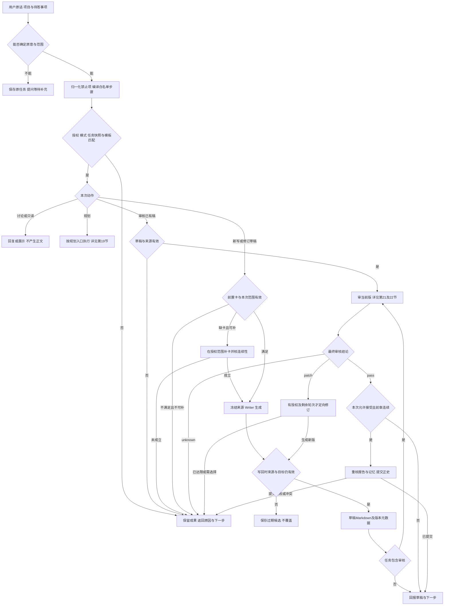

**上游与下游导读。** 输入边界由[02. 技术架构总览](#inkflow-02)和[03. 小说项目的数据地图](#inkflow-03)提供。接下来[05. Coordinator](#inkflow-05)解释派工，[06. Writer](#inkflow-06)解释草稿；[第20节](#inkflow-20)再逐节点展开章节生命周期。

**问题与边界。** 可确定的范围和否定由代码约束，复杂意图仍依赖Coordinator理解，路由命中之后还要检查真实项目状态、草稿、版本和权限。“先别写、先审、暂时别收”必须拆成禁止新写、允许审现有稿、禁止接受三个条件；“别把原件写回来”则是剧情约束，不等于禁止整章写作。特别要区分“改后续计划”和“写后续正文”，不能仅因都提到未来章号就执行同一动作。本例说明当前分支与应守住的边界，不宣称每种复合句都已实测，也不要求每次请求走遍全部节点。

自然语言路由的 `TerminalIntent.preference_observations` 可附带至多三条偏好观察，复用本来就有的 Coordinator 请求。`capture_observations` 要求引用逐字出现在当前用户消息中；本次要求不长期入库，明确长期范围才直接启用，其余保留候选。处理结果进入运行追踪和回复，用户可在设置查看。确定性本地路由没有模型观察时不会凭空提炼，不能宣称每句话都会自动变成长久记忆。

**规划与批次不能只看“继续”两个字。** 当前路由按分句检查有没有肯定要求修改大纲或细纲；“不改大纲，只改近期规划”保留窄范围，“先修大纲再重排近期”进入上层重设计。范围解析优先采用连接正史边界的章节段，用户点名旧章作为依据不应被误当未来起点。批次的“继续修”仍是 batch_repair，只有“继续写/续写/创作”等明确写作表达才考虑续写；明确 batch ID 或唯一当前可修批次参与绑定，批次多义时仍提问。见 [_requests_upper_plan_edit](../agent/src/inkflow/terminal_session.py#L183)、[_resolve_intent](../agent/src/inkflow/terminal_session.py#L1286)、[第17节](#inkflow-17)及[第26节](#inkflow-26)。

**下一轮实施清单。**

| 当前判断或问题 | 源码依据 | 影响与边界 | 最小修改位置 | 前置依赖 | 后续观察条件 |
| --- | --- | --- | --- | --- | --- |
| 现有保护，保留：同一词 `reviewer` 随协议解释职责 | [模板转换](../agent/src/inkflow/coordinator.py) | 防止追踪报告误读 | 运行事件展示协议与角色名 | 有旧版及 v2 样本 | 每步显示实际角色与检查范围 |
| 现有保护：当前禁止接受指令压过保存设置 | [共用判断](../agent/src/inkflow/coordinator.py)、[接受策略](../agent/src/inkflow/terminal_session.py) | 会话快捷路由与Coordinator共用接受否定词表 | `NO_ACCEPTANCE_PATTERN`及最终策略 | 原话、意图、结果齐全 | 后续观察“暂时别收/不验收”与自动设置组合，正史不变化 |
| 源码已实现：复合否定分别约束写作与接受 | [意图归一化](../agent/src/inkflow/coordinator.py) | “先别写第16章，先审第16章”保留审核目标；接受限制独立记录 | `normalize_intent`与会话范围解析 | 可审核草稿、来源版本与原授权 | 内容禁止不误禁整章，任务禁止不被后续设置升级 |

[返回章节目录](#contents) · [打开零基础术语词库](#glossary)


<a id="inkflow-05"></a>
## 05. Coordinator：如何理解作者并安排任务

**先用一句话理解：** Coordinator 像任务协调者，负责听懂“要做什么、不要做什么”，再安排允许执行的步骤。

**遇到生词先看：** [Coordinator](#term-coordinator) · [TaskTicket / DispatchPlan](#term-ticket) · [路由 / 白名单](#term-routing) · [协议版本 v1 / v2](#term-protocol)


**实现口径：** 角色边界、意图结构和白名单校验已写入代码；设计目标是只在目标变化时重新协调，复杂改意图时的正确率仍待真实任务观察。

Coordinator 是正式 AI Agent，也是墨流面向作者的对话与协作入口。它负责理解用户当前原话、对话上下文和作品状态，再把目标整理成可以执行的任务；它也可以进行创意讨论、解释进度、处理后续补充和协调角色分歧。其权限到这里为止：正文和具体叙事片段由 Writer 执笔，审查结论由 Editor 或专项 Reviewer 产生，记忆变更由负责角色提出，正史提交由 Novel Engine 执行。[ROLE_CAPABILITIES_V2](../agent/src/inkflow/coordinator.py)将这些允许与禁止事项写明；更关键的 [validate](../agent/src/inkflow/coordinator.py#L409)在执行前检查真实计划。前者是角色说明，后者是不能凭语言越权的代码门槛。

它如何理解一句话？会话首先区分问题、讨论、明确修改和具体创作请求，获取项目当前状态及相关对话。随后 `TerminalIntent` 记录动作、目标范围、禁止行为、授权来源、待澄清字段和与现有任务的关系。[意图模型](../agent/src/inkflow/schemas.py)限制结构；[normalize_intent](../agent/src/inkflow/coordinator.py#L167)把明示的“不接受”“先讨论”“只改这段”等条件覆盖到动作选择上。这个补充很重要：模型可能把复杂中文误当作写作命令，程序仍应尊重可确定的否定和范围。若用户回复“照刚才那个做”，必须关联正在等待的问题或任务，不能对全部候选都视为同意。

Coordinator 编译任务时不会随意设计新工作流。`_WORKFLOWS` 明列 `status`、`redesign_story`、`write_draft`、`write_review_accept`、`batch_draft`、`repair_accepted` 等动作及其依赖。一个“重做已写十五章之后的走向”会走大纲候选、审核、卷细纲候选、审核、近期规划候选、审核的依赖链；一个“只写一段”则走 Writer 的隔离场景草稿。`compile` 给每步设置责任角色、预期产物、门禁和停止条件，并记录来源与授权。`validate` 必须再次对照固定模板、协作模式、检查归属及任务快照。这样 Coordinator 可以安排工作，但不能只凭自己的结论额外创建一个 Reviewer、改掉门禁或把未审文本写入正史。

新增 `story_settings_manage` 的白名单步骤是引擎 `setting.collection.manage`。Coordinator 现在读取本书设定模块定义、记录状态及本会话需要处理的手动修改问题，理解“设定”可以在中途继续记，不限开书。它选择合集建立/修改/留档、记录新增/补证/用户保存/留档/查看，或明确候选的人工决定，生成参数而不是设定正文。新增内容交 Writer；已发生内容的补证交当前记忆所有者，并受合集写权限与同版本约束；字段说明不能由模型擅自改成另一职责。查看、配置和移出使用由已有服务执行，只有明确要求模型创作或补证才增加调用。多个对话的待答和补充分别保存；共享正史分歧仍由引擎处理，不能把独立窗口当作绕过权限的分支。见[第14节](#story-setting-collections)和[第32节](#conversation-isolation)。

它还负责节省无效调用。普通节点由引擎代码按既定步骤推进，不应每次“开始审核”“保存报告”都再付费调用 Coordinator。需要它再次判断的场景是作者补充导致目标改变、角色意见出现实质分歧、恢复策略必须改动、问题需要用户做创作选择。轻微格式错误、引用定位和已知网络重试应在失败节点处理。这个边界对应当前 [任务编译](../agent/src/inkflow/coordinator.py) 与[会话续做](../agent/src/inkflow/terminal_session.py)的分工。若路由反复询问同一信息，问题应该回到任务状态和澄清绑定，而不是多写一段“请再确认”的提示词。

规划发布的两个固定选择更具体：人工发布模式下，三层审核完成后由会话层的提问卡询问是否采用；正式新版出现旧版时，另一张卡问保留或查看删除清单。作者点固定选项时，会话按待答任务确定性路由，不必再让 Coordinator 模型猜“这句同意了什么”；作者自由填写的新要求才需要重新理解。无论哪种回答，正式版递增、历史保留及删除仍由引擎核对，Coordinator 不取得提交或删除权限。见[第4节](#inkflow-04)的入口与[第19节](#inkflow-19)的完整状态图。

例如作者说：“第十六章就从葬礼后开始，前十五章别动，先把未来十章重新排好。”Coordinator 应抽出锚点十五、目标十六至二十五、禁止改已接受正文，并判断当前请求是规划重排，不是批量写十章正文。若当前已经有生效大纲和卷细纲，可确定影响范围再选择规划动作；若作者改变了主线方向，则先重建上层规划，再按依赖往下展开。作者新决定可以改变未来设计，但不能把过去实际正史抹掉。它还要说明哪些已有未接受候选会过期、哪些仍可保留；如果存在实质剧情方向二选一，才提出一个必要问题。讨论和任务执行的分界应以原话授权与产物类型为准。

角色协作模式由任务设置与协议版本约束。日常三角色足以处理常规写审；启用智能加强且有范围与预算时，专项 Reviewer 或 Memory Keeper 才加入。Coordinator 能提出模式，不能用“质量更好”作为任意升级理由；用户明示禁止额外调用时更不能越界。一个模式说明的是可能参与的角色和检查所有者，不意味着每个角色每个步骤都会调用。`roles_for_mode` 与 `check_owners_for_mode` 分开定义这个区别，见[角色协议](../agent/src/inkflow/role_protocol.py)。完成专项后回到基础模式，避免未来所有章节无意继承更贵的配置。

产物上，`TaskTicket` 是用户意图与约束的公开记录，`DispatchPlan` 是程序可核验的步骤图。它们不属于小说正文，也不等于模型生成已发生；执行前后应能看见任务走到哪里、为什么等待以及下一步是什么。失败时Coordinator解释已尝试的补救、受影响节点和可选择路径，不替审核人说“可以放行”。路由正确、审核实际读到同版正文、结果正确显示是三个观察点：需要真实体验时，沿“原话→路由→审核输入→未提交正史的界面反馈”追踪，不能用一个结构化意图或一次离线结果代替整条链。

| 作者说法 | Coordinator 应识别的目标 | 可授权的产物 | 必须守住的界线 |
| --- | --- | --- | --- |
| “聊聊后面会怎样” | 创意讨论 | 选项和影响说明 | 不产生正式规划或正文 |
| “写一段试试” | 局部叙事候选 | Writer 隔离草稿 | Coordinator 不代写 |
| “第十六章先审别收” | 审核当前稿 | 同版审查报告 | 不自动接受 |
| “改后续十章安排” | 规划窗口重排 | 分层候选及审核 | 不覆盖已接受前章 |

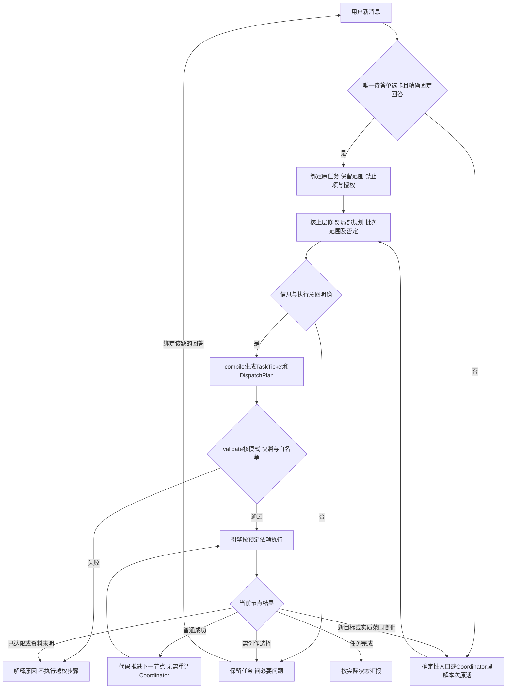

**上游与下游导读。** 输入来自[04. 一次自然语言请求的完整旅程](#inkflow-04)；计划交给[06. Writer](#inkflow-06)以及[11. Novel Engine](#inkflow-11)。协作模式分工见[10. 协作模式](#inkflow-10)。图只画一次有限任务的当前节点与后续状态；下一依赖节点仍受预定义工作流约束，不会因图中箭头无限重调 Coordinator。

**问题与边界。** 0.7.2 当前在 [会话范围解析 `_resolve_intent`](../agent/src/inkflow/terminal_session.py)统一处理明确要求完整三层规划的请求：原话明确说“三层规划”，或并列要求“大纲、卷细纲、近期规划”，且意图已经属于规划动作时，归入 `redesign_story`。这一步保留原来的执行授权，不把讨论升级为执行，也不因“参考已有大纲和细纲”而扩大为重做全部规划。独立大纲、单层修改及旧项目的 `plan` 兼容入口继续按各自产物处理，不能仅凭历史动作名称就替用户扩大任务。

完整三层请求从最新已接受章作为衔接锚点；明确章节范围从该锚点或下一章开始时采用用户终点，没有终点时使用意图中已有终点或设置中的默认近期章数。若用户指定的起点与该正史边界不一致，会说明“完整重设计”和“局部调整”的区别并问清范围，不默默扩大。下游仍走 [第19节](#inkflow-19)的逐层审核、版本核对与发布设置，路由纠正不等于候选已审核或已正式发布。

补充信息的续接也分清两种情况。[`_confirmed_question_intent`](../agent/src/inkflow/terminal_session.py#L1173)仅在当前只有一张单选卡、回答精确对应“现在执行／先继续讨论／按主要理解处理／采用另一种理解”时复用保存的意图，保留章号、原任务要求、禁止项和缺失字段，绑定当前问题与任务，再经过同一范围解析和引擎门禁。完整匹配的桌面回答同样适用；夹带新要求、多题、多选或自由填写仍交给 Coordinator 判断。专项规划确认沿原有专用路径处理，不能由通用选择替代候选版本核对。

只有绑定当前问题的回答完成后才清除此待答问题；一个无关任务完成，不再顺手清掉原来的待答事项。这减少固定选择的重复模型理解，但不是任意消息去重或多任务提问队列：当前仍保存一个待答问题组，多组并发、重复提交和完整界面表现未在本轮验证。该路由调整此前只改代码与文档；本次继续核对源码，没有运行测试或模型实验；不能把预期调用减少写成实测费用下降。上游原话与问题绑定见[第04节](#inkflow-04)，下游任务、来源与权限检查见[第11节](#inkflow-11)。

Coordinator 新增的只是偏好观察输出权限：说明用户喜欢什么写法、原话是什么、适用于作者还是本书。真正保存由宿主白名单流程执行，仍不能提取人物正史或替记忆角色提交。原话中的跨书范围和明确性由代码再约束；含糊满意反馈不会自动变成硬要求。反复出现的同一条反馈保留新来源事件，不因重复就提升为更强门禁。

**上层修改与窄范围优先级。** `_requests_upper_plan_edit` 按句号、问号、分号等分句，匹配明确修改大纲/细纲并排除对应否定表达；不是通用中文逻辑求解器，复杂并列仍需模型理解。满足明确执行条件时，规划类意图转入以最新正史为锚的 redesign_story，并保留原话作 operation_instruction。路由与途中补充请求的输出上限当前为1600 token，偏好观察也在同一 TerminalIntent 内；这只是避免复杂意图字段被过早截断，不保证每种中文都能正确理解。[_resolve_intent](../agent/src/inkflow/terminal_session.py#L1286)是入口落点，下游 [redesign_existing_story](../agent/src/inkflow/planning_pipeline.py#L565)仍核范围与权限。

**下一轮实施清单。**

| 当前判断或问题 | 源码依据 | 影响与边界 | 最小修改位置 | 前置依赖 | 后续观察条件 |
| --- | --- | --- | --- | --- | --- |
| 0.7.2 已改；发布验证范围见顶部：完整三层请求统一规划路由 | [范围解析](../agent/src/inkflow/terminal_session.py)、[工作流表](../agent/src/inkflow/coordinator.py) | 明确完整三层目标不再沿旧单层动作执行 | `_resolve_intent` 核对原话与正史边界 | 规划意图、原授权和有效终点 | 待观察：正式三层产物与请求一致，独立大纲和只读请求不扩大 |
| 0.7.2 已改；发布验证范围见顶部：固定澄清选择复用原任务 | [会话处理](../agent/src/inkflow/terminal_session.py) | 唯一固定选择跳过路由模型，保留范围和禁止项 | `_confirmed_question_intent` 与 `_remember_question` | 唯一单选卡、精确回答、保存意图有效 | 待观察：固定回答无需重问，新增要求仍重新理解，无关任务不清掉待答问题 |
| 源码已实现：上层明确修改、批次身份与范围分别解析 | [_resolve_intent](../agent/src/inkflow/terminal_session.py#L1286) | 否定大纲修改不扩大近期任务；继续修不等于继续写 | 会话共享解析入口 | 原话、正史锚点和具体batch | 范围与禁止项保留，多义任务提问；不以旧动作标签扩大 |

[返回章节目录](#contents) · [打开零基础术语词库](#glossary)


<a id="inkflow-06"></a>
## 06. Writer：如何把资料变成规划与正文

**先用一句话理解：** Writer 是实际产出规划和文字的角色；这一节追踪它拿到什么资料，以及新稿怎样保存。

**遇到生词先看：** [Writer](#term-writer) · [上下文 / Context Packet](#term-context) · [Schema / Pydantic / 契约](#term-schema) · [来源指纹](#term-fingerprint)


**实现口径：** 章节取材、[来源指纹](#term-fingerprint)（整组依据的版本校验）、结构化草稿和写入路径有当前实现；设计目标是稳定衔接三层规划与作者声音，真实文笔效果不可从源码推断。

Writer 现在还读取用户允许它使用的设定合集职责、字段及版本有效的参考记录。需要长期保存的本章新信息可放进**同一次** `DraftOutput.setting_updates`，最多八条，每条指定合集、标题、用户字段和可定位来源；它与正文和 `hook_note` 一起绑定当前版本。没有相关合集或新增内容就留空，不为了建档重复生成一份正文或说明。Writer 的新内容强制保留设想身份，已核对条目的有据更新由审查或记忆角色提出。正文接受后才采纳同版提案；当前记忆所有者必须在 `approved_setting_proposals` 中明确列出从 1 开始的附件序号，才可复用相匹配的公开说明审核标为已核参考。正文 pass 不默认认可全部附件；未被明确认可的 Writer 条目保留待核，按开关进入后台检查。两种状态均不创建正式事实，已核参考也不能保证未来设想一定成功。见[第14节](#story-setting-collections)、[第13节](#inkflow-13)及[第31节](#inkflow-31)。

Writer 是具体小说内容的执笔者。它可以提出全书大纲、卷级细纲和逐章规划，也可以写正文、场景试稿、局部替换和针对审核意见的修订。它收到的并不是一个开放式“随便写”权限：每个任务都有当前原话、作品已有正史、规划版本、目标章节和输出结构。它不能为自己的内容打通过章，不能写入正史，不能因为发现计划不合理就私改审核规则。能力边界见[角色声明](../agent/src/inkflow/coordinator.py)，实际调用路径见 [write_chapter](../agent/src/inkflow/engine.py#L2518) 与 [planning_pipeline.py](../agent/src/inkflow/planning_pipeline.py)。理解 Writer 要先分清它写的是“规划假设”“隔离草稿”还是“待接受正文”。

写章之前，引擎会检查目标章是否已接受，是否存在前章尚待核对的连续性疑点，并在授权范围内确保本章执行卡可用。正式三层发布已把未来卡投影到当前 SQLite 视图；仅旧项目缺投影时，[ensure_chapter_plan](../agent/src/inkflow/engine.py#L676)可零模型补齐，其他缺卡场景也可能恢复原卡或让 Writer 补少量计划；旧记录冲突或依据不足则停止。`ContextBuilder.build` 取本章之前有效事实和伏笔、当前规划与执行卡、近章正文、相关检索证据和作者偏好；还会分模式配置输入预算。Writer 的系统提示词约束输出为 `DraftOutput`，其内容、标题、公开决策摘要等按 [数据模型](../agent/src/inkflow/schemas.py)解析。模型能写出新叙事，但它不能凭记忆声称前章某个细节已经发生；若资料包和模型回忆冲突，以可定位的已接受正文和用户要求为准。上下文包保存到追踪目录，方便之后追问这次写作究竟看见了什么。

最关键的技术动作是来源冻结。引擎在构建输入之前计算 `_writer_source_fingerprint`，发请求前再算一次，远端返回后又比较一次；实际写草稿时持短锁再核对。若作者在 Writer 生成期间修改了章节卡、偏好或相关正史，模型的文本不会覆盖新状态，而是保留为 `stale-candidate.md` 供核对。这样处理虽然可能让一次付费输出不能直接生效，却保护了作者的后续改动。若目标签章已经成为已接受正史，`write_chapter` 在模型调用前就拒绝覆盖；已接受正文的局部修补必须走独立的诊断、局部候选、复核与用户决定路径。版本检查不是让模型判断“看起来相近”，而是程序对输入指纹和内容哈希做确定性比较。

生成后的程序检查也有边界。正文会清掉重复的章节标题与完全重复段落，并按目标有效字符检查篇幅；不足时，Writer 可在有限轮数内定向补足，过长时可做受约束压缩。字数达标只是基本交稿条件，不表示剧情因果、人物动机或表达已合格；这些仍由 Editor 或专项 Reviewer 阅读。反过来，普通文风差异也不该被程序当成硬错误。`DraftOutput` 同次返回的钩子说明与可选场景蓝图另存为协作附件，上下文清单记录实际输入；它们不是正文或正史。钩子附件同时保存公开决策摘要、少量事实候选与伏笔候选，新稿替换当前指针，旧附件保留。[草稿保存与交接](../agent/src/inkflow/engine.py)显示保存后会形成版本和审查交接消息；审查者应据此审同一稿，而不是审过时的计划卡。

Writer 写规划时，输出的权威级别低于正文正史。全书大纲组织主线、背景、关键高潮和大致结局；卷细纲把该方向展开为本卷因果、冲突、支线和人物变化；近期章节规划再逐章安排场景、行动、钩子与收尾。它们作为候选先经过审核并检查来源版本，发布后才成为未来写作的当前依据。Writer 不能把新规划写成“第十六章已发生”的事实；若已有十五章正文，必须以十五章正史和未结伏笔为锚点，而不是为了漂亮的新结局回写前章。`planning_pipeline.py` 和 [v2 规划输出模型](../agent/src/inkflow/schemas.py)说明了三层各有不同结构，不能用一份长提纲改名充当三份成果。

Writer 还承担定向修订，而非每次全章重写。审核若确证一处物件位置矛盾，需要告诉它冲突原句、相关前章证据和可保留内容，让它只改影响范围；若审核只是缺来源，先由审核角色补读，不应让 Writer “编一段解释”掩盖资料错误。选段修订则要冻结原文选区和来源版本，返回最小替换候选。已接受正文的修订更严格，要保留旧版和用户决定，不能让模型一句“已解决”直接解除待确认状态。具体修订入口见[选区输出](../agent/src/inkflow/schemas.py)和[正史局部修补](../agent/src/inkflow/engine.py)。

作者样稿与 Humanizer-zh 的表达适配是静态规则与偏好在写作上下文中的使用，不等于对供应商远端模型做了参数训练。Writer 能通过提示词、上下文和当前用户反馈调整本次文本；是否真的更符合作者的声音，需要看后续作品和用户反馈，而非一次模型自评。Writer 可继承默认模型，也可在设置中指定同一 Provider 支持的另一模型 ID；本次没有实现按角色切换供应商、接口或密钥。性能上应记录真实输入、缓存命中、输出、耗时和合格产物成本，不能因为减少一次调用却增加返工而宣称优化。

| Writer 任务 | 必需依据 | 输出状态 | 后续门禁 |
| --- | --- | --- | --- |
| 全书/卷/近期规划 | 已接受正文、用户目标、上层生效规划 | 候选规划 | 规划审核、版本发布 |
| 章节写作 | 本章卡、正史、人物状态、偏好 | 隔离草稿版本 | 正文审核与授权 |
| 场景试写 | 指定范围和相关资料 | 隔离候选 | 用户选择后才可能进入正式流程 |
| 定向修订 | 当前稿、证据、保留约束 | 新候选版本 | 重审受影响检查 |

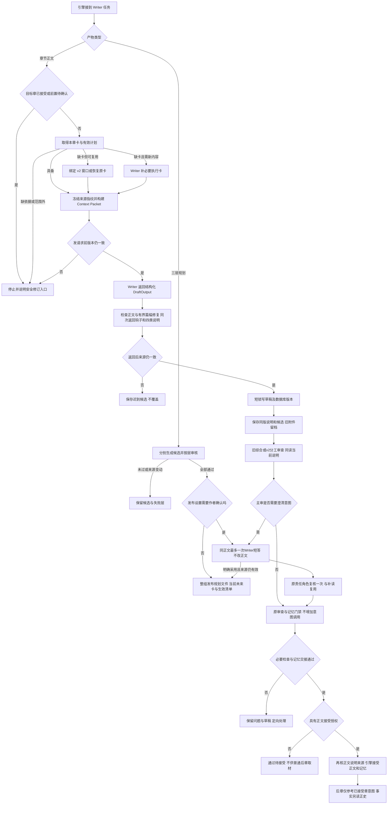

<a id="writer-version-handoff"></a>
**Writer 的独立版本说明如何交接。** 写章时在同一次 `DraftOutput` 返回 `hook_note.annotations`，无需写完后另开模型总结。每条公开说明记录一个新增或留白，至多八条，通常两到四条，不要求用满。`statement` 是简短说明，`quote` 是正文连续原句；`prerequisites` 是后续设想所需前提，`causal_steps` 最多三步，`followup_window` 是预计回应窗口。这是公开创作决定，不保存隐藏思考。实际字段见[WriterNoteClaim / HookNote](../agent/src/inkflow/schemas.py)，调用要求见[提示词](../agent/src/inkflow/prompts.py)，保存与筛选见[writer_notes.py](../agent/src/inkflow/writer_notes.py)。旧草稿没有说明直接审核正文，不为补表重新写章。

| 说明类别 | 白话含义 | 核对依据 | 出错时改哪里 |
| --- | --- | --- | --- |
| `new_fact` 正文新增 | 本章实际新写出的事 | 当前正文连续原句；记忆所有者还要区分客观、信念和传闻 | 摘录错修说明；归类错修候选；确证正文矛盾才修正文 |
| `interpretation` 叙事解释 | 为什么留白，谁可能误解或撒谎 | 原句、说话人、时间和已有语境；Writer 说是谎言不能直接证明它是谎言 | 先追问或撤回解释，不把发言直接存成客观事实 |
| `future` 未来设想 | 以后想怎样接钩子 | 已写锚点、必要前提、至多三步因果与当前主线 | 微调或撤回设想；正式主线变化另走规划发布 |
| `unknown` 未决定项 | 暂时没选择答案 | 是否影响本章必要行动，普通悬念不要求今天决定 | 保留未知，不补造证据或未来正文 |

**正文成立与意图可行分别判断。** 主审先判断读者只读正文能否理解必要行动，再比较 Writer 意图。编辑知道谁是凶手，不能替读者脑补正文未写出的取证权限。未来可以暂缓揭露身份，不能让已封存原件在没有取回动作时被使用。当前 v2 仍输出 `ModeCheckOutput`，意图风险进入分配维度、问题或建议，不新增第六个角色；旧综合审查也读取同一版本附件。没有疑问就在原调用内完成核对；必要时才一次短答和原责任角色复核，见[第22节](#inkflow-22)。

**保存和覆盖的准确含义。** 同版钩子附件保存说明、决策摘要、事实/伏笔候选、章节版本与正文校验值；标 `current` 只表示当前草稿附件，不表示已验证。短答的 `corrected_hook_note` 仍是候选，不改正文。通过并授权接受后，[读取服务](../agent/src/inkflow/writer_notes.py)才提供与对应通过报告绑定的有效说明视图；原说明和纠正记录都保留。这里的覆盖是读取时采用已核对纠正，不删除旧记录，也不把附件写进事实表。后章仅参考简短意图，长期未结承诺仍用正文可证的伏笔 ID 和状态承接，不能用最新说明抹掉历史钩子。区别见[第26节](#inkflow-26)与[第30节](#inkflow-30)。

**上游与下游导读。** Writer 接收[05. Coordinator](#inkflow-05)选定的目标，取材细节见[第29、30节](#inkflow-29)；产出的规划走第 15–19 节，正文走[第20节](#inkflow-20)，审查分别交给[07. Editor](#inkflow-07)或[08. Reviewer](#inkflow-08)。

**问题与边界。** Writer 是内容生产责任者，输出多种产物，但不保证它们都有同一保存机制。`write_chapter` 的指纹守护可以在代码里确认；三层规划能否完全按一条自然语言任务自动连续发布，还需从规划管线和真实项目核对。本文未运行模型，不评价实际文笔或缓存收益。

Writer 的正文上下文读取 `effective_preferences`，把作者默认与本书要求合并；规划入口和开书构思也接入作者习惯。当前明确要求优先，本书同名主题覆盖作者默认，作者默认一律按普通偏好使用。写作来源指纹包含有效偏好，运行中改习惯后旧结果不能无条件覆盖当前稿。具体选取、预算和遗漏原因见[第27节](#inkflow-27)与[第30节](#inkflow-30)。

**篇幅补写的结构边界。** ParagraphExpansionPlan 的 insertions 已取消固定最多12处限制，保留至少1处；decision_summary 仍有限长度。它允许复杂正文在更多位置自然补足，不授权无限轮模型调用，也不允许离开当前正文版本任意重排剧情。篇幅与段落计划只是交稿工具，后续必需审查、正文来源指纹、用户禁止项和调用预算继续生效。定位见[插入结构](../agent/src/inkflow/schemas.py)和 [write_chapter](../agent/src/inkflow/engine.py#L2518)。

**下一轮实施清单。**

| 当前判断或问题 | 源码依据 | 影响与边界 | 最小修改位置 | 前置依赖 | 后续观察条件 |
| --- | --- | --- | --- | --- | --- |
| 现有保护，保留：Writer 输入前后依赖来源指纹 | [章节写作](../agent/src/inkflow/engine.py) | 过期输出不能直接生效 | 保留此检查；仅在漏路径补齐 | 找到具体漏路径 | 变更来源后保存候选而不覆盖当前稿 |
| 待核影响，先复现：规划与正文共享旧命名造成作者误解 | [旧规划入口](../agent/src/inkflow/engine.py)与[新管线](../agent/src/inkflow/planning_pipeline.py) | 可能拿旧卡写新章 | 规划路由与状态展示 | 一个已有正文项目 | 三层规划版本和本章卡均可定位 |

[返回章节目录](#contents) · [打开零基础术语词库](#glossary)


<a id="inkflow-07"></a>
## 07. Editor：日常综合编辑如何工作

**先用一句话理解：** Editor 是日常编辑，负责核对稿件与依据，并承担当前模式分给它的记忆工作。

**遇到生词先看：** [Editor](#term-editor) · [协议版本 v1 / v2](#term-protocol) · [证据 / 引文 / 来源编号](#term-evidence) · [MemoryPatch / 记忆补丁 / 提升](#term-patch)


**实现口径：** v2 一般检查、记忆交接与引文核验路径在代码中；设计目标是少误报且能定点恢复，文学判断准确性仍待真实正文观察。

可持续设定加入 Editor 的实际输入和 `ModeCheckOutput.setting_updates`。日常 Editor 可核对 Writer 公共交接里的设定假设是否与正文、当前规划及正史相容，并按用户合集字段给有原文的补充；角色的记忆所有权仍按模式决定。Editor 拥有本轮记忆职责时，另用 `approved_setting_proposals` 明确认可 Writer 附件序号；对正文的 pass 与对设定附件的认可分开，未列出的候选不能借正文通过自动认证。记忆加强或全专项的最终附件认可采用 Memory Keeper，不合并成“任一角色同意就算通过”。手动草稿走同一章节审查门禁，手动设定文件、条目或已接受正文候选则使用独立的 `ManualEditReview` 只读核对契约；它不能冒充完整正文接受报告。前者决定章能否继续，后者判断这份手动改动的参考边界并解释疑问；已接受候选即使未发现冲突也要保留人工取舍。入口和状态见[第23节](#manual-edit-lifecycle)，不因一个“通过”覆盖正史权限。

Editor 是日常创作模式中的综合审读者。Writer 交出一个确定版本的草稿后，Editor 要先读实际正文，再对照当前全书大纲、卷细纲、近期计划、执行卡和相关已接受前章，判断这章完成了什么、还有什么需要修。日常模式由它承担一般审核和轻量记忆候选，因而能复用一次阅读；开启记忆加强后，记忆责任转给 Memory Keeper，Editor 不再重复抽取。[角色归属表](../agent/src/inkflow/role_protocol.py)给出这一区别，[v2 提示词](../agent/src/inkflow/prompts.py)把它限制在 `general` 或 `expression`。它不能直接修改正文或批准未读过的新版本，更不能自己提交正史。

在 `general` 范围，Editor 需要覆盖完整审核维度：正史连续性、关键因果、用户要求、人物动机、剧情推进、阅读连贯。前面三项是必需门禁；后面三项按公开量表评价。它应指出本章目标、实际变化和与计划的关系，并为每项结论给出当前正文原句、对应来源原句、理由和合理的另一种解读。计划与正文有差异时，应先判断作者是否有意做可接受的调整；规划是创作假设，不能拿一个未兑现的远期细节机械否定当前章。确证的硬冲突需要定位两边原句，而文风偏好、叙事留白、人物谎言和本章未到期的伏笔不自动阻断。统一量表由[review_rubric.py](../agent/src/inkflow/review_rubric.py)实现，输入结构见[ReviewAssessment](../agent/src/inkflow/schemas.py#L704)。

在五角色全专项模式，Editor 的范围缩为 `expression`，重点是表达和阅读体验；逻辑连续性由专项 Reviewer 负责。这里的“审读更细”不是让两个模型分别完整审核再多数投票，而是让结果按责任字段汇合。`review_chapter_mode` 根据 `check_owners_for_mode` 只给角色分派的检查项，系统提示词和输出契约要求其不得代填其他角色的范围。审查角色可在同一正文版本上并发执行；只要 Writer 改动正文，受影响结果都要重新核对。一次 `ModeCheckOutput` 的模型 `confidence` 是模型自报，不能替代引擎基于来源和量表计算的符合度。[模式审查入口](../agent/src/inkflow/engine.py)显示角色调用前核对草稿状态、章节卡、计划修订和正文哈希。

Editor 的记忆职责是“提案”，不是“写事实表”。在 everyday 和 review_boost，`memory_owner` 为 editor；通过时应附有同章原文证据的 `memory_patch`。提案可以含本章摘要、场景摘要、事实变化和开放线索，事实要区分客观事件、人物信念与传闻。输出若遗漏记忆，引擎当前有同角色一次纠错路径；它并不直接把空补丁当通过。到了 memory_boost 或 full_specialist，Editor 的 `memory_patch` 必须为空，避免把同一个变化由两个角色重复写入。当前运行时实际向 Editor 请求 [ModeCheckOutput](../agent/src/inkflow/engine.py)，并用 `memory_owner` 做越权核查；[EditorResult](../agent/src/inkflow/schemas.py#L1211)目前只是一份已定义、未接入此模型调用路径的结构，不能拿它当当前自动门禁的执行证据。最终只有引擎在接受章节时写入正式记忆。

审查数据不足时，先自动修资料链。比如第十六章提到旧木匣，Editor没读到第七章去向，不能直接要求Writer补造来源。当前[补读复核入口](../agent/src/inkflow/engine.py)会从source_queries、缺口理由、物件/人物和钩子线索构造最多四条短查询，使用[已接受正文检索](../agent/src/inkflow/retrieval.py)搜索章节原文、事实、摘要与伏笔，再将已知来源和相关候选交给受版本保护的补读器。搜索没有命中不能证明不存在；三份当前规划、紧邻前章与实际目标等缺口在同一次责任角色复核中重新核对。齐全报告没有这次额外调用；必要依据仍不足才保存断点，不让Writer为漏读改稿。具体步骤见[第22节](#inkflow-22)，放行门禁见[第21节](#inkflow-21)。

Editor 输出的“通过、需修订、依据不足”必须对作者有不同含义。通过且达到用户设置的至少 80% 底线、无硬冲突、记忆交接有效、来源版本一致，并获得本次接受授权，才可能进入正史。需修订要写明具体原句与可执行修法，再交给 Writer 定向处理。依据不足要保留草稿和缺失来源，补读后从审查节点继续。若只有百分比较低而没有确证硬问题，先检查审核是否读对正文，不能直接改稿刷分。`ReviewReport` 保存模型自报值与引擎符合度、来源指纹及摘要，后续编辑必须能看到它审的是哪一版。[报告结构](../agent/src/inkflow/schemas.py)说明二者是不同字段。

| 编辑责任 | everyday/review_boost | memory_boost | full_specialist |
| --- | --- | --- | --- |
| 一般正文审核 | Editor 主审 | Editor 主审 | Reviewer 主审逻辑；Editor 管表达 |
| 记忆候选 | Editor 提出 | Memory Keeper 提出 | Memory Keeper 提出 |
| 正史提交 | 引擎 | 引擎 | 引擎 |
| 资料不足处理 | Editor 补读/补证 | Editor 补读/补证 | 对应责任角色补读/补证 |

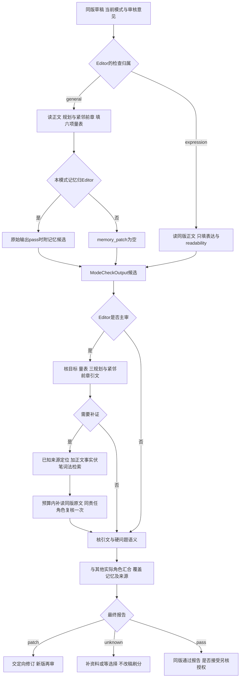

**上游与下游导读。** Editor 接收[06. Writer](#inkflow-06)的草稿；本节的证据要求在[第21、22节](#inkflow-21)展开，记忆候选在[第24、25节](#inkflow-24)展开。若启用专项，请继续[08. Reviewer](#inkflow-08)和[10. 协作模式](#inkflow-10)。

**Editor 与 Writer 说明的边界。** 两个入口统一读取[当前版本说明](../agent/src/inkflow/writer_notes.py)，v2 日常模式不再丢失钩子和新增候选。Editor 先按正文判断，不能因为 Writer 写“以后会圆”就提高符合度。必要说明引句找不到，先限次让 Writer 纠正说明，再复用原 Editor 的补读复核；没有必要问题不调用追问。纠正说明不要求改正文，也不新增两三个 Editor 子 Agent。等待期间正文、说明或来源变化，迟到结果不覆盖当前结论。循环出口和测试范围见[第22节](#inkflow-22)。

**问题与边界。** 代码同时保留旧 `review_chapter` 综合路径和 v2 `review_chapter_mode`。描述 Editor 时应先确认任务协议版本；旧报告里的 `reviewer` 可能是综合 Editor，不能作为专项 Reviewer 已运行的证据。静态代码可核验责任分派，但不能证明模型每次都准确读懂文学语境。

Editor 在拥有记忆职责时可通过同一 `MemoryPatch` 返回多处证据和补证据、撤销提案；这些字段并不赋予直接提交权。正文的主证据仍须出自当前章，其他章引用绑定已接受来源。Writer 与审查读取同一合并偏好规则，作者默认是表达参考而不是额外硬门禁。证据关系与原文核验是不同步骤：引用存在不能独自证明结论。

**引文定位与证据归因分别核对。** 主审原始pass、patch或unknown都检查三份规划、紧邻前章、目标变化与量表；每项证据新增evidence_relation，区分直接支持、状态变化、视角层级、合理新增与排他矛盾。仅引用同名物件不足以支持判断。缺口先由_recover_review_evidence自动搜索、补读并同角色复核一次，替代原来先编号补证、再单独补前章的连续调用；完成后仍走字面校验、疑似硬问题语义核验、覆盖与记忆门禁。记忆候选缺失也交当前所有者补齐，字段不赋予正史提交权。当前新契约为evidence-attribution-v1，评分权重未改变；这是一套风险控制，不是模型理解绝不会出错的保证。

**下一轮实施清单。**

| 当前判断或问题 | 源码依据 | 影响与边界 | 最小修改位置 | 前置依赖 | 后续观察条件 |
| --- | --- | --- | --- | --- | --- |
| 现有保护，保留：旧综合输出通过时强制记忆补丁 | [旧模型契约](../agent/src/inkflow/schemas.py) | 避免旧结果冒充 v2 专项 | 读取/展示时按协议解释 | 历史记录带协议 | 旧审核显示综合 Editor，不算专项覆盖 |
| 现行边界：`EditorResult` 为未接入的设计结构 | [实际调用](../agent/src/inkflow/engine.py)、[结构定义](../agent/src/inkflow/schemas.py) | 不能把定义本身当作放行门禁 | 继续使用 `ModeCheckOutput` 与引擎的记忆所有权检查 | 将来确需拆分输出时先定义映射 | 当前角色请求、提示词和保存路径按同一契约解释 |
| 本轮源码已改、未运行验证：引用存在与支持关系分开 | [共享补读复核](../agent/src/inkflow/engine.py)、[归因门禁](../agent/src/inkflow/review_rubric.py) | 未核归因、无关证据、分类矛盾不自动放行；不能保证模型识别所有隐性误读 | 复用现行输出，增加关系分类和来源上下文 | 当前责任与同版来源 | 无关句不得凑分；先检索补读，误报不改正文 |

[返回章节目录](#contents) · [打开零基础术语词库](#glossary)


<a id="inkflow-08"></a>
## 08. Reviewer：专项审查如何深入检查小说

**先用一句话理解：** Reviewer 在需要专项检查时参与，重点是把被分配的疑点查清，并给出能回到原文的理由。

**遇到生词先看：** [Reviewer](#term-reviewer) · [证据 / 引文 / 来源编号](#term-evidence) · [依据不足 / unknown / 补读 / 补证 / 反证](#term-unknown) · [证据化符合度 / confidence / 模型自评](#term-review-score)


**实现口径：** 专项责任、模型调用和报告汇合路径已实现；设计目标是在复杂因果场景补足日常审核，漏检率与误报率仍待观察。

Reviewer 的新增设定责任仍受已有检查分派限制：可指出参考设定中的排他矛盾、人物信念或合理新增，并在 `setting_updates` 中带原文补证或纠正已有条目；不能创作另一条剧情替换 Writer，也不直接改变合集职责。后台手动核对按任务模式选当前 general 所有者，无 general 的审查加强或全专项采用 Reviewer 的核对请求；这不表示又启用一组子 Agent。角色模型沿冻结的 `role_models` 选择，源资料补读继续复用本地检索，见[第12节](#inkflow-12)和[第23节](#manual-edit-lifecycle)。

Reviewer 在当前 v2 协议中是专项审查者，重点核对因果、人物知识、时间线、世界规则和跨章连续性。它不会默认在日常模式每章出现；用户要求深度检查，或已启用且符合策略的审查加强任务，才会让它参与。旧协议日志中的同名 `reviewer` 是综合 Editor 的历史标识，因此任何统计“Reviewer 参与多少章”都必须先按协议版本拆分。真正的 v2 专项范围由[角色协议](../agent/src/inkflow/role_protocol.py)分配，[提示词](../agent/src/inkflow/prompts.py)进一步禁止它提取记忆补丁、直接改正文或提交正史。

Reviewer 的输入必须是被冻结的待审正文版本，而非一份摘要。模式审查入口先要求章节处于 draft、有章节卡、没有尚未完成的计划修订，再从磁盘读取正文并与数据库内容哈希比较；这一层失败时模型请求不会发送。[review_chapter_mode](../agent/src/inkflow/engine.py#L3314)随后为每个责任角色构建审核资料包，包含实际正文、三份当前规划、近期完整正史、按正文检索出的相关历史。若 Writer 写了一个计划卡没提的新细节，检索查询仍会纳入这段真实正文，避免只按旧卡搜索而漏读关键来源。Reviewer 的判断还要和角色检查范围、任务模式快照、来源指纹一起保存，保证结果只对它读过的版本成立。

在 `review_boost`，Editor 管完整综合审核及记忆，Reviewer 补指定逻辑连续性；在 `full_specialist`，Reviewer 管逻辑连续性，Editor 管表达，记忆另由 Memory Keeper 提案。日常与记忆加强的新任务均不调用专项 Reviewer；历史任务按[第10节](#inkflow-10)的恢复边界解释。模式不是奖章，而是检查所有权图：缺一个所有者的通过结论不能被另一个角色顺手代填。当前实际模型输出是 `ModeCheckOutput`，随后由引擎按检查所有者构造覆盖并汇成 [ReviewReport](../agent/src/inkflow/engine.py)。[ReviewResultBase 和 ReviewerResult](../agent/src/inkflow/schemas.py)虽然定义了按角色验证的结构，当前运行代码并未构造它们；不能用未接入的类证明实时校验已经发生。实际的越权记忆检查在 [run_role](../agent/src/inkflow/engine.py#L3360)。字段齐全也不能代替小说语义判断。

专项审查应问“文本里到底发生了什么，凭什么说矛盾”。若第十六章写“她才第一次见到密信”，第九章已有明确“她亲手拆开密信”的原句，Reviewer 可以把两处引文和时间关系列成硬问题；若第九章只是人物听到传闻，或者第十六章是角色故意撒谎，则同一个词不构成客观事实冲突。世界规则、人物知道的范围、物件去向和关键因果都要用这种双侧证据判断。规划中的未来承诺也要看是否本章到期，不能因为第十八章才揭开的身份在第十六章没说明就阻断。当前 [ReviewFinding](../agent/src/inkflow/schemas.py#L618)记录正文证据、正史引用、解释、修订建议以及引用和语义核验状态，这正是区别硬问题与普通分歧的地方。

程序先检查引用与证据关系，缺资料时先自动搜索已接受正文、事实、摘要和伏笔，补读后交同一Reviewer复核一次，再形成最终报告；不重复让所有角色读整卷。疑似硬问题继续走_verify_review_output，输入除了当前完整正文，还包含代码从对应来源截取的引文周边文字及来源身份。conflict_type分别记录perspective人物信念/谎言/传闻、state_change状态变化、new_information合理新增和exclusive_conflict排他矛盾等。canon_conflict要被支持，必须是排他分类；消解原文必须来自本问题的正文或对照来源，不能只说“可能撒谎”或引一条无关句。分类与结论矛盾、编号重复或关键资料仍缺，保留待核而不交Writer修改。量表仍由[共享计算](../agent/src/inkflow/review_rubric.py)汇合，模型自评仅用于诊断。

专项参与有时间与费用成本。review_boost/full_specialist的不同检查可并发，参与模式仍受授权与设置快照约束；不会默认新增子Agent。相同角色、检查、来源与提示词计算call_key，补读候选复用还核其来源快照。Memory Keeper在正文角色返回结果均pass时运行，这些结果已经包含各自触发的补读复核，最终语义、量表与接受门禁仍在其后。审查加强中Reviewer只填连续性与因果证据，不重复Editor的其余质量评分；全专项中五项主审与Editor的readability在最后汇合。确证硬问题才交Writer定向修订，专项角色不自写正文。

专项审查的边界在公开报告里也应清楚。它可能发现因果和连续性问题，却不能证明一部小说文学上绝对优秀；80% 是规则符合度门槛，不是正确概率。它给出证据、理由和其他合理解释，供引擎与作者核对。一次自然语言真实任务可观察是否实际调用了 Reviewer、使用了哪个模型、检查的是哪一版；静态代码只能证明调用路径和约束存在。若真实任务显示它漏读前章，应从资料包和检索查根因，而不是简单调高分数。

| 模式 | Reviewer 的责任 | Editor 是否参与 | 记忆责任 |
| --- | --- | --- | --- |
| everyday | 不参与 | 综合审核 | Editor |
| review_boost | 指定逻辑/连续性专项 | 综合审核 | Editor |
| full_specialist | 逻辑/连续性 | 表达与阅读 | Memory Keeper |

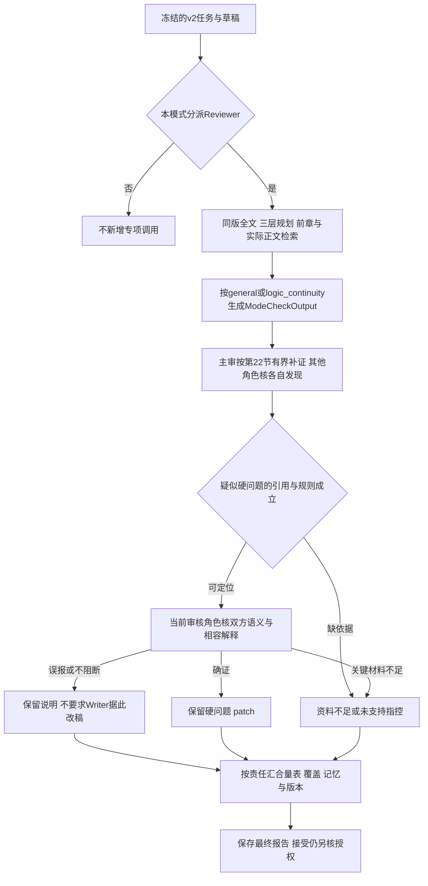

**上游与下游导读。** 专项输入来自[06. Writer](#inkflow-06)或已有草稿，模式边界见[10. 协作模式](#inkflow-10)；证据细节转[第21、22节](#inkflow-21)，修订转[第23节](#inkflow-23)。Reviewer 不处理的记忆交给[09. Memory Keeper](#inkflow-09)或日常 Editor。

**假设推演怎样使用。** 专项 Reviewer 读同版说明，核正文锚点，再判断“假如按这条路线发展，要补哪些前提，能否接回当前主线”。最多三步公开因果不是生成未来三章，也不能证明设想必会兑现。人物谎言须从发言层级和语境判断相容；客观正文与已接受事实排他，未来设想无权解围。同章双引文及已定位正史硬指控不能仅因补救结果省略而消失，仍走原语义核验。只有主审能发 `writer_note_questions`；全专项的表达 Editor 不重复问逻辑意图，Memory Keeper 也不代主审发问。

**问题与边界。** 源码存在完整校验路径，并不能证明每种文学歧义都能被模型判对。尤其引文回填只解决“原句是否存在”，不解决“该原句是否支持此结论”；这类误报需要专项语义复核或作者选择。真实任务观察应记录原话、来源版本、模型输入输出和最终门禁。

**临时前章与未证实指控。** 审核若写 chapter:00017，而包里只有唯一 batch:…:chapter:00017 来源，resolve_packet_source_id 可映射到该临时来源，保留其batch身份。若存在多份匹配则不猜。verify_review 不再因为原始 verdict 是 patch/replan 就一概认定争议：有 findings 时逐条核验，缺 findings 才按未支持结论复核；带问题的硬指控仍需字面与语义支持，不能据分类别名 continuity 自动改正文。该别名仅归一化为 finding.category=knowledge，不是量表 criterion。见[核验器](../agent/src/inkflow/review_verifier.py)和[结构](../agent/src/inkflow/schemas.py)。

**下一轮实施清单。**

| 当前判断或问题 | 源码依据 | 影响与边界 | 最小修改位置 | 前置依赖 | 后续观察条件 |
| --- | --- | --- | --- | --- | --- |
| 现有保护，保留：专项结果不能带记忆补丁 | [模式审查运行时](../agent/src/inkflow/engine.py) | 防止职责交叉 | 保持现有越权门禁 | v2 任务模式 | 违规结果拒绝，正史不变 |
| 现行兼容边界，保留：`ReviewerResult`是未接入的设计类，运行契约为`ModeCheckOutput` | [角色调用](../agent/src/inkflow/engine.py)、[实际输出](../agent/src/inkflow/schemas.py) | 设计类不构成运行证据；旧reviewer仍按原协议解释 | 在现行输出和核验路径修复，不为接入设计类重写引擎 | 模式、职责、来源和覆盖齐全 | 模型请求、保存候选、最终报告一致；不改历史记录 |
| 本轮源码已改、未运行验证：人物谎言与客观冲突分层核对 | [语义上下文与消解原文](../agent/src/inkflow/engine.py)、[分类一致性](../agent/src/inkflow/review_verifier.py) | 视角相容不能与“已证实排他冲突”混报；不是所有自称谎言都自动免责 | 当前审核角色的原文复核、conflict_type与消解定位 | 双侧原文、说话人、事件时间和来源身份 | 有相容原文则撤销硬效力；缺关键依据先补读，仍缺则保留断点 |

[返回章节目录](#contents) · [打开零基础术语词库](#glossary)


<a id="inkflow-09"></a>
## 09. Memory Keeper：如何提出可靠的记忆变更

**先用一句话理解：** Memory Keeper 提议把本章发生的事记下来，软件还要核对这些事是否有证据、是否能正式入账。

**遇到生词先看：** [原始与最终通过](#term-raw-pass) · [Memory Keeper](#term-keeper) · [MemoryPatch / 记忆补丁 / 提升](#term-patch) · [正史 / 已接受正文](#term-canon) · [门禁 / 硬约束](#term-gate)


**实现口径：** 模式分派、记忆候选、证据过滤及接受事务已有代码；设计目标是长期可靠更新与可撤销溯源，漏提率不能由静态阅读确认。

Memory Keeper 是专项记忆责任者，只在任务模式明确分派时参加。它回答当前正文真正新增了什么、人物知道或相信了什么、哪些线索推进或解决，在新任务的 memory_boost、full_specialist 中承担记忆提案；前者由 Editor 完整审正文，后者由 Editor 与 Reviewer 分担正文检查；日常和审查加强的记忆由 Editor 兼任。历史分工的恢复另见[第10节](#inkflow-10)。当前 [MEMORY_KEEPER_SYSTEM_V2](../agent/src/inkflow/prompts.py) 已明确要求返回 `ModeCheckOutput`，与 [review_chapter_mode](../agent/src/inkflow/engine.py#L3314) 的 `output_model` 一致。`MemoryResult` 是仍未接入此调用的独立设计结构，不是现行返回类型；旧文把提示词差异列作待修缺口，现已删除。记忆角色不能评价文学放行、改正文或直接写入正史。

输入与审查角色共享同版正文，但“角色返回pass”不等于“引擎最终通过”。[review_chapter_mode](../agent/src/inkflow/engine.py#L3314)先收集正文审查输出；每个角色若缺资料，已经在run_role内进行自动检索补读与同角色复核。记忆归Memory Keeper且这些返回结果均pass时，才调用它；它自己的缺源、引用与记忆交接问题也走同一补救入口。随后仍核硬指控、算量表、查记忆与覆盖。因此不能写成“全部最终门禁通过后才调用Memory Keeper”，也不能把原始模型pass或候选artifact的verified当作正史接受。详见[第22节](#inkflow-22)。

接受阶段另有一条需要区分的补提取路径：[引擎提取记忆](../agent/src/inkflow/engine.py)优先复用同版审查报告里的补丁；如果交接不可复用，它会按当时记忆责任角色再调用模型，但要求的输出结构是 `MemoryPatch`，随后继续核对事实证据和冲突。这与 `review_chapter_mode` 实际使用的 `ModeCheckOutput` 是两种输出契约，两者都没有使用 `MemoryResult`，也不表示允许在审核不通过时绕过门禁。统计实际模型调用时，必须把这次有条件的补提取算进去。

输出的最小单位不是模糊摘要，而是可核验的变更。`MemoryPatch` 包含章节摘要、场景摘要、事实变更、线索变更和未解决冲突。每条 `FactMutation` 有主体、谓词、值、生效章节、正文证据，以及 `objective`、`belief`、`rumor` 三种认知性质；还可区分事件发生时间与叙事呈现时间。`ThreadMutation` 有种类、标题、状态、埋设章和到期章，状态可表示开放、推进、兑现、延迟或放弃。[记忆结构](../agent/src/inkflow/schemas.py)并不能自行保证内容真实，所以输出中的证据必须逐字定位到本章正文；计划卡、Writer 说明和模型推测不能替代。这种结构让第十六章“她认为门没有锁”与“门客观上没有锁”保持两条不同记录。

冲突也要分类。人物A声称父亲已死，正文并未证明此话为真，Memory Keeper 应记录为A的信念或传闻；不能因为客观事实表中父亲还活着就直接要求 Writer 改稿。未揭晓身份、悬念和有意留白是开放线索，不是 `unresolved_conflicts`。如果两段有效正史确实给出同一时间、同一对象互斥的客观状态，则提案要列出双方来源，把冲突交给审核、定点修订或作者决定；它无权挑对自己方便的一版覆盖旧事实。当前运行时实际检查 `ModeCheckOutput.memory_patch` 的章节号、事实证据与未决冲突，并剔除没有本章正文原句支撑的事实，见[汇合检查](../agent/src/inkflow/engine.py)。[MemoryResult 的 ready 验证器](../agent/src/inkflow/schemas.py)尚未进入该调用路径，不能把其中的 `evidence_refs` 要求说成正在执行。证据存在也不保证解释正确，互斥判断仍有语义复核与人工创作选择边界。

即使 Memory Keeper 的实际 `ModeCheckOutput` 给出 `pass` 和记忆候选，也还没写入正史。引擎汇合时核对检查覆盖、硬问题、评分门槛、记忆候选有效性及来源版本；报告通过并获接受授权后，[数据库 accept_chapter](../agent/src/inkflow/database.py)在事务里同时确认草稿版本与哈希、最新审核 ID，以及存在批次暂存时该补丁与草稿是否对应，并更新章节、事实、线索和记忆补丁。事实 ID 不能悄悄换主体或谓词；同一主体关系的新事实按章节边界使旧事实失效。接受过程中任何校验失败，章节和记忆都不应只写一半。Markdown 的同步另走可恢复文件投影路径，不能把数据库事务说成天然覆盖了磁盘文件。

多章批次还有临时记忆。为让未接受的第十六章影响同批次第十七章写作，可以保存版本绑定的 `provisional_memory_patch`，但其状态是临时的，不能让项目其他任务读成已接受正史。[暂存、失效与读取](../agent/src/inkflow/database.py)以及[ContextBuilder 的批次资料](../agent/src/inkflow/context.py)显示了这条隔离路径。若第十六章改稿，旧暂存补丁须失效；只有按连续章节接受时才核对并提升到正式记忆。这样既支持批次内衔接，又不把未来试写污染作品事实。第 24–28 节会把正史、临时资料和用户偏好分别拆开。

Memory Keeper 除章节模式审查与接受交接，还能在当前模式确实将记忆职责分给它、合集允许记录且用户明确要求补证时，调用共享设定记录路径。它用已接受正文、事实和伏笔提出 `record_supplement`，或在同次 `ModeCheckOutput` / `MemoryPatch.setting_updates` 中补充已有条目。本轮记忆所有者在 `approved_setting_proposals` 中列出明确核过的 Writer 附件序号，v2 汇合报告只取该所有者的认可列表，Reviewer 对正文成立的判断不能代替这个参考认证。设定候选与正史事实字段分别保存，引用须定位，写回须核修订号；日常模式这个职责归 Editor，不因为建了“人物设定”模块就额外调用 Memory Keeper。“梳理参考”与“提交正史”仍是两种权限：正式事实进入接受事务，设定服务只能写参考记录，用户习惯仍由独立偏好服务管理。新调用、后台审查及桌面表现实际验证范围见顶部发布记录，见[第14节](#story-setting-collections)和[第31节](#inkflow-31)。

| 记忆对象 | 能否由本章直接支持 | 候选处理 | 正式生效条件 |
| --- | --- | --- | --- |
| 客观事件与物件状态 | 本章明确叙述或可定位动作 | 记录事实及生效章 | 同版审核、授权、引擎提交 |
| 人物信念与传闻 | 角色说法或视角明确 | 标注认知性质，不冒充客观事实 | 同上，且保留来源 |
| 伏笔和承诺 | 正文埋设、推进或兑现 | 更新线索状态与到期范围 | 同上 |
| 未接受草稿 | 只能支持任务临时衔接 | 暂存并绑定草稿版本 | 连续通过后才能提升 |

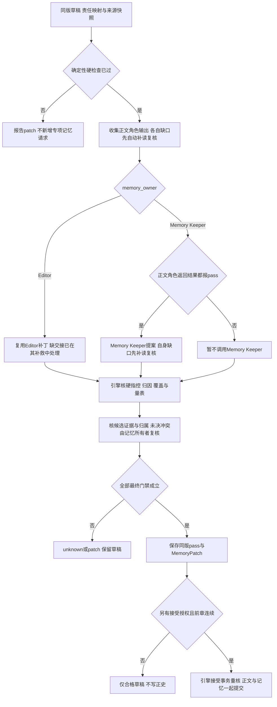

**上游与下游导读。** 记忆输入来自[07. Editor](#inkflow-07)或[08. Reviewer](#inkflow-08)完成的审查；模式分工见[10. 协作模式](#inkflow-10)。数据组织继续看第 24–28 节，事务及文件一致性转[第31节](#inkflow-31)。

**问题与边界。** 事实证据可定位只证明摘录存在；叙述可靠性、角色撒谎和回忆错误仍可能需要读上下文判断。旧协议综合 Editor 的记忆补丁不可改标为 Memory Keeper 产物。静态阅读不能证明实际长期记忆漏提率或不同作品之间的隔离效果。

当前 `MemoryPatch` 已扩展：事实可附 `evidence_refs`，`operations` 可提出 supplement（补充依据）、retract（撤销当前效力）、replace_evidence（替换附加证据）、retire_evidence（停用附加证据）。每条引用说明来源章、原文和支持/反证/人物信念/参考关系，真实版本、哈希及定位由引擎侧补全。撤销须提供当前审核章的反证，找不到旧证据不能自动撤销事实；主证据只经正文修订重核替换。事务提交及历史保留见[第25、31节](#inkflow-25)。

**Reviewer与Memory Keeper的分歧处理。** 正文成立、Writer意图可行、候选归类正确、提交安全分别检查。Reviewer说角色的谎言不构成客观矛盾，不能因此自动删除Memory Keeper对“这句话应存belief还是objective”的疑问。旧的按共用引文过滤unresolved_conflicts路径已移除；共用引用并不说明是同一个问题。候选缺证或存在未决冲突时，当前记忆所有者先搜索相关事实、伏笔和接受正文，再依据原文修候选或明确剩余缺口；没有理由将存储归类错误交Writer改正文。若确证正文有硬矛盾，仍需双方证据并走当前审核门禁。其余必要冲突未解决时不能提交，已接受旧事实也不被模型默默覆盖。候选复核记录与最终正文判断都保留，接受仍须[第31节](#inkflow-31)权限与版本检查。

**新增说明不是记忆依据的捷径。** 主审的 Writer 短答随任务交给随后运行的 Memory Keeper，不必再问一次。它仍从正文独立核候选：作者说“甲在撒谎”，不能直接证明甲相信什么，也不能把谎言内容存成客观事实。可以记录“甲说了某句话”的发言事件；话的内容是否为真是另一项判断。Future 的调查、身份设想与必要前提不自动进事实表；正文实际种下的悬念才可转开放伏笔并沿用 ID。纠正说明供协作参考，MemoryPatch 是待接受提案，正式记忆仍由引擎事务提交。本次离线 MVP 已观察角色继承短答和事实保存的区别，真实模型理解尚未测量。

**下一轮实施清单。**

| 当前判断或问题 | 源码依据 | 影响与边界 | 最小修改位置 | 前置依赖 | 后续观察条件 |
| --- | --- | --- | --- | --- | --- |
| 现有保护，保留：正式提交要求草稿、审核和暂存记忆同版 | [接受事务](../agent/src/inkflow/database.py) | 防止旧补丁污染正史 | 保持事务校验 | 同版审查报告 | 版本变更后拒绝提升临时补丁 |
| 0.7.2 已修：Memory Keeper 提示词与实际输出均为 `ModeCheckOutput` | [提示词](../agent/src/inkflow/prompts.py)、[实际调用](../agent/src/inkflow/engine.py) | 避免模型按未使用的 `MemoryResult` 组织答案 | 保持提示词、Schema 和引擎记忆所有权检查一致 | 记忆候选仍须正文证据和接受授权 | 字段、责任和门禁按同一契约解释；本轮未运行验证 |
| 本轮源码已改、未运行验证：缺证/冲突先由记忆所有者补读复核，误分类风险仍存在 | [记忆提示与共享补救](../agent/src/inkflow/engine.py)、[提示词](../agent/src/inkflow/prompts.py) | 保持objective/belief/rumor，不保证模型永不误标 | 候选及原文关系重核，不为归类错误改正文 | 同版原文与真实说话人 | 谎言与传闻保留归属，未决候选不提交 |
| 本轮源码已改、未运行验证：不按共用引文清除记忆冲突 | [模式汇合](../agent/src/inkflow/engine.py) | 一项正文误报不能顺带解除不同记忆问题 | 当前所有者补读复核，正式事务另核 | 同版草稿、check_owners与有效候选 | 候选产生后仍可能unknown/patch；verified不冒充接受 |

[返回章节目录](#contents) · [打开零基础术语词库](#glossary)


<a id="inkflow-10"></a>
## 10. 协作模式：三个日常角色如何扩展到专项分工

**先用一句话理解：** 不同任务不必叫齐所有角色；协作模式决定谁参加、各检查什么、怎样避免重复劳动。

**遇到生词先看：** [Agent / 角色](#term-agent) · [协议版本 v1 / v2](#term-protocol) · [快照](#term-snapshot) · [Novel Engine](#term-engine)


**实现口径：** 新任务四种模式、检查所有者和任务[快照](#term-snapshot)（固定某一时刻的状态）已有当前实现；设计目标是按需加强而不重复检查，桌面呈现与并发性能须由真实任务核验。

墨流的“模式”决定本次任务可以有哪些角色参加，以及每个必需检查由谁承担。正式能力池有 Coordinator、Writer、Editor、Reviewer、Memory Keeper 五个角色；日常 `everyday` 使用 Coordinator、Writer、Editor 三者。`review_boost` 增加专项 Reviewer，`memory_boost` 增加 Memory Keeper；原 deep 已不再作为新任务选项，旧名称的新请求统一为 memory_boost。`full_specialist` 才允许五角色同场，但 Editor 管表达、Reviewer 管逻辑连续性、Memory Keeper 管记忆。[MODE_ROLES 与 MODE_CHECK_OWNERS](../agent/src/inkflow/role_protocol.py)是可核对的程序定义。角色在模式名单里，意味着符合任务条件时可参与，不是承诺每一步都调用。

模式的输入是当前用户目标、明确授权、项目设置和冻结的任务快照。[capture_task_settings](../agent/src/inkflow/task_settings.py)把协议版本、模式及持久配置编成哈希；运行中通过 `active_task_settings` 读取同一范围。途中作者改模型、温度或模式，不应悄悄替换正在执行任务的配置，否则 Writer 与 Reviewer 可能基于不同契约产出看似同版的结果。旧任务没有 v2 快照时只能按旧协议日常模式解释；[快照校验](../agent/src/inkflow/task_settings.py)拒绝无效版本、身份不匹配或内容哈希错误，而不是自动套用最新默认值。这个约束既保护恢复，也让费用和质量对照有一致基础。

日常模式走最短完整路径：Coordinator 理解和编排，Writer 生成规划或正文，Editor 在一般范围审读并于通过时提出记忆候选，Novel Engine 执行质量和正史门禁。它适合普通章节的连续写作，不需要每章再找一位 Reviewer 核对相同事项。用户要求更深的因果连续性检查，且允许新增调用时，`review_boost` 保留 Editor 的一般审核，同时让 Reviewer 只查 `logic_continuity`；记忆仍由 Editor。用户更担心人物状态与伏笔漏记，`memory_boost` 保留 Editor 综合审核，但 Memory Keeper 独占记忆候选。这些分工是职责变化，不是模型数量简单相加。

**为什么现在合并。** 原 memory_boost 和 deep 都是一次完整六维正文审核加一次独立记忆整理，主要区别只是由 Editor 还是 Reviewer 主审。它没有稳定增加检查覆盖、独立复核、模型能力或轮数，不能用“深度”名称证明更高质量。因此新任务取消单独 deep，统一 memory_boost：Editor 完整审核，Memory Keeper 核记忆，Writer 的写作与引擎接受门禁保持完整。Reviewer 仍有明确用途：review_boost 补独立连续性/因果核对，full_specialist 与 Editor 分担逻辑和表达。合并重复模式不等于合并这两个在其他分工中有不同责任的角色。

**新旧边界怎样落地。** [ACTIVE_COLLABORATION_MODES 与 new_task_mode](../agent/src/inkflow/role_protocol.py)只向新任务公开四种模式，并把旧名称 deep 规范化为 memory_boost；[capture_task_settings](../agent/src/inkflow/task_settings.py)在新任务生成快照与哈希前完成转换，应用参数和自然语言“深度模式”兼容同一路径。已有 deep 快照的校验、恢复、角色所有权与原始标签不变：它仍是 Reviewer/general 加 Memory Keeper，不把历史调用冒充 Editor。恢复中的模式匹配允许旧名称访问已合并的新快照，但不能把明确 memory_boost 请求偷偷用于旧 deep 快照；真正切换应建立新任务。源码仍有 deep 的兼容定义，是为了恢复和读历史，不是第五个新模式。

在一次执行内，`review_chapter_mode` 根据 `check_owners_for_mode` 建立角色列表，为各角色只传它所负责的检查项。正文审查角色可以在同一冻结草稿版本上并发；Memory Keeper 则等它们原始输出均为pass后再提记忆，之后引擎还要补证、核语义并最终评分，以免在需重写的稿上白做。返回结果记录调用键、正文哈希、故事指纹和任务快照，已验证的同样候选可复用。引擎随后按责任字段检查覆盖，合并问题、量表及记忆交接，再判断通过、修订或依据不足。并发不意味着可以同时对同章提交，也不意味着允许在 Writer 改稿后复用旧 Reviewer 结论。对同一正文与正史的最终接受仍依赖短暂写锁和版本校验。

模式选择也有反向门禁。Coordinator 不得自行“为了质量”把所有角色都叫来；用户禁止额外调用时不能升级，专项结束后回到基础模式。一次只读状态查看可能根本不需要 Writer；复查旧稿未必重新写正文；Memory Keeper 若未被分派也不参与。`Coordinator.validate` 会比对 `DispatchPlan` 与模板、任务快照和检查所有者，拒绝越权派工。[模式审查运行时](../agent/src/inkflow/engine.py)又核对当前活动快照与传入模式一致。这两层对应“计划合法”和“执行没有换模式”，减少途中配置漂移或 Coordinator 自由发挥的风险。

质量结论不是几个角色投票。若 Editor 说“通过”，专项 Reviewer 给出可定位的硬矛盾，最终不能按二比一放行；先对齐同一正文哈希和资料来源，再让当前责任角色复核语义，必要时 Writer 定点修订。若 Memory Keeper 找到两个不能并存的已证实事实，也不能由 Reviewer 的高分覆盖。软文风建议可以作为作者选择，不能把它升级为版本硬门禁。角色分工需要把“谁检查过哪些项目”展示给作者，否则“五角色参与”只是宣传词。当前源码有责任映射和汇合逻辑；一次真实任务才可验证界面是否把参与角色、模型调用及结论说明清楚。

| 模式 | 可参与的正式角色 | 审查所有者 | 记忆所有者 | 适合的任务 |
| --- | --- | --- | --- | --- |
| everyday | C、W、E | Editor/general | Editor | 普通写审 |
| review_boost | C、W、E、R | Editor/general + Reviewer/logic_continuity | Editor | 指定连续性深查 |
| memory_boost | C、W、E、M | Editor/general，完整六维 | Memory Keeper | 统一记忆加强，原 deep 新请求也使用此分工 |
| full_specialist | C、W、E、R、M | Editor/expression + Reviewer/logic_continuity | Memory Keeper | 三类专项均有实际任务 |

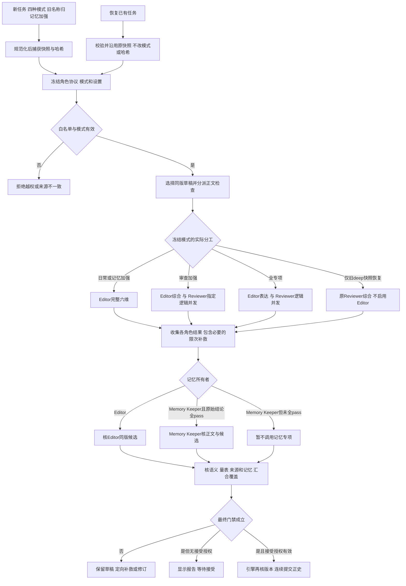

**上游与下游导读。** 模式输入由[05. Coordinator](#inkflow-05)确定，Writer、Editor、Reviewer、Memory Keeper 的具体职责分别见第 06–09 节。执行门禁看[第11节](#inkflow-11)，模型选择与真实调用数看[第12节](#inkflow-12)。图是按已分派角色绘制的汇合关系；未启用的角色节点直接跳过。

**问题与边界。** `MODE_ROLES` 是可参与集合，不能当成固定调用次数。旧协议 `reviewer` 必须解释为综合 Editor；不能只改显示名称而不改旧审核覆盖含义。当前代码有并发调用和快照核对，但桌面 busy 状态、远端等待期间的锁范围、不同入口在同一模式下的反馈仍需真实观察。

**下一轮实施清单。**

| 当前判断或问题 | 源码依据 | 影响与边界 | 最小修改位置 | 前置依赖 | 后续观察条件 |
| --- | --- | --- | --- | --- | --- |
| 0.7.2 源码已改；发布验证范围见顶部：合并重复模式，新任务取消独立 deep | [新模式入口与旧责任映射](../agent/src/inkflow/role_protocol.py)、[快照捕获与恢复](../agent/src/inkflow/task_settings.py)、[应用入口](../agent/src/inkflow/app_server.py) | 新任务统一 memory_boost，完整审核与记忆覆盖保留；历史任务不换角色 | 新任务规范化、四模式能力列表及恢复匹配共用边界 | 先识别新任务或已有快照，旧快照哈希不可改写 | 新请求只列四模式，旧名称进入记忆加强；旧 deep 恢复仍按原 Reviewer 执行，full_specialist 不重复 general |
| 待核影响，先复现：界面可能不能解释本次实际调用角色 | [任务事件](../agent/src/inkflow/app_server.py) | 作者误以为五角色每章运行 | 角色事件展示 | 一次审查加强任务 | 显示实际调用、检查范围、费用与结果 |

[返回章节目录](#contents) · [打开零基础术语词库](#glossary)


<a id="inkflow-11"></a>
## 11. Novel Engine：工作流、权限与质量门禁

**先用一句话理解：** Novel Engine 是落实规则的程序：即使模型说“可以了”，它也要检查条件才允许下一步。

**遇到生词先看：** [Novel Engine](#term-engine) · [工作流 / 节点 / 上游 / 下游](#term-workflow) · [门禁 / 硬约束](#term-gate) · [事务 / 原子性](#term-transaction)


### 这一层解决什么问题

Novel Engine 是创作任务的执行者和裁判规则的载体，不是第六个 AI 角色。作者说“把后面十章重新安排，再写下一章”时，Coordinator 可以理解意图并提出顺序；真正判断能否读取当前项目、是否允许改动已接受内容、哪一步必须先审、哪个结果能够写入，以及运行时是否还在预算内的，是引擎和它调用的确定性服务。这种分工首先保护作者的文本：模型给出一段漂亮新规划，不等于有权覆盖正文；模型认为某章合格，也不等于可绕开来源和审查记录直接入正史。当前五角色名录及模式归属由 [role_protocol.py](../agent/src/inkflow/role_protocol.py) 定义，Coordinator 的提案和校验见 [coordinator.py](../agent/src/inkflow/coordinator.py)，引擎的主要创作入口集中在 [engine.py](../agent/src/inkflow/engine.py)。

一项任务先被收敛为受支持的动作、范围与资源约束。Coordinator 的 `normalize_intent` 和 `compile` 将自然语言变为调度计划，`validate` 再检查角色与流程是否合法；之后的普通节点由代码推进，不需要每写一张卡就请 Coordinator 重新发号施令。默认模型与角色模型映射均随任务冻结；旧快照缺映射则继续继承其原默认模型。运行时配置通过 [task_settings.py](../agent/src/inkflow/task_settings.py) 固定为带哈希的快照，旧角色协议任务按旧语义恢复。Provider 还会核对当前模式允许调用的角色，并按 endpoint 限制并发请求，相关实现见 [provider.py](../agent/src/inkflow/provider.py) 与同文件的 `_model_role`。这些环节防止“用户切换设置后，正在执行的任务悄悄换模型或换角色”的无声漂移；本次已补上应用层四个辅助模型入口的快照绑定，并把多维审查循环中重新读取设置改为复用当前任务配置；具体覆盖与未覆盖边界见下文。源码路径已核对，未运行入口体验或模型验证，不能据此宣称所有调用场景已经实测。

对正文而言，引擎把规划、草稿、审核、修订、记忆提案和接受作为相互依赖的节点。`write_chapter` 先确保本章有章节卡，再取上下文和来源指纹；必要审查完成后，`accept_chapter` 才进入正史提交。审查被判为依据不足时，先由当前审核角色补读或补证；被证实的关键矛盾才进入 Writer 定向修订。低把握度暂停自动接受，不应被解释为“正文必然有错”。已接受正文修补另走保留旧版与确认的路径，不能把 Writer 的一句“已解决”当作放行结论。读者可把第 [18 节](#inkflow-18) 的章节卡看成写作入口，把[第20～23节](#inkflow-20)作为正文阶段的细拆；本节只说明它们怎样被引擎串联。

对规划而言，旧版 `generate_plan` 仍可生成 `PlanBundle`，面向已有正史的 v2 重设计则由 [planning_pipeline.py](../agent/src/inkflow/planning_pipeline.py) 顺序生成全书大纲、卷细纲、近期窗口。v2 在每层先保存候选及审核报告；三层均通过后，自动发布设置进入整组发布，人工设置先通过提问卡等作者采用。引擎在短写锁内复核已接受章节、项目基础文件及原生效规划哈希，成功后同时更新三层文件、SQLite 未来执行卡和生效清单，才递增正式修订号。旧版进入历史待选择状态，另问保留或查看删除清单。若来源变化，候选留存并进入待处理，不应回退到把整个任务从头生成。第 [19 节](#inkflow-19) 展开发布门禁；第 [32 节](#inkflow-32) 再追踪并发和版本关系。

这次新增 `manage_story_settings` 和手动修改依赖检查，仍复用同一个引擎。设定管理先核用户定义的合集、职责、字段和修订；有据记录只写参考数据库。规划与 Writer 来源指纹现在包含 `StorySettingsService.source_fingerprint()`，所以模型等待时改设定或其引用来源，会使旧结果不能无条件写回。`write_chapter` 与 `accept_chapter` 在关键前置位置扫描管理文件并调用 `ManualEditsService.assert_ready`：未核基础文件、相关先前章节和已经确认的设定硬冲突会保留待处理；普通新设想并不因为尚未认证就自动阻断一切写作。后台开关按配置/任务快照控制自动核对，不能替代原章节版本、审查量表和提交权限。当前代码没有把任意改动都扩展成全书重审，细节见[第14节](#story-setting-collections)、[第23节](#manual-edit-lifecycle)。

| 门禁对象 | 引擎目前可核的内容 | 通过后的动作 | 不满足时的状态 |
|---|---|---|---|
| 角色与流程 | 协作模式、角色协议、白名单计划 | 发起归属清楚的模型步骤 | 拒绝越权节点，保留任务原因 |
| 来源版本 | 正史、设定、规划、草稿等指纹 | 采用本次候选 | 候选隔离，按受影响层续接 |
| 规划审核与采用 | verdict、把握度、逐字依据、来源和发布设置 | 自动发布或提问确认后整组替换未来依据 | 补证、定向改本层、待作者采用或待处理 |
| 正文审核 | 必需检查、硬矛盾、符合度与记忆交接 | 接受版本并开放依赖章节 | 补读、修订或等待决定 |

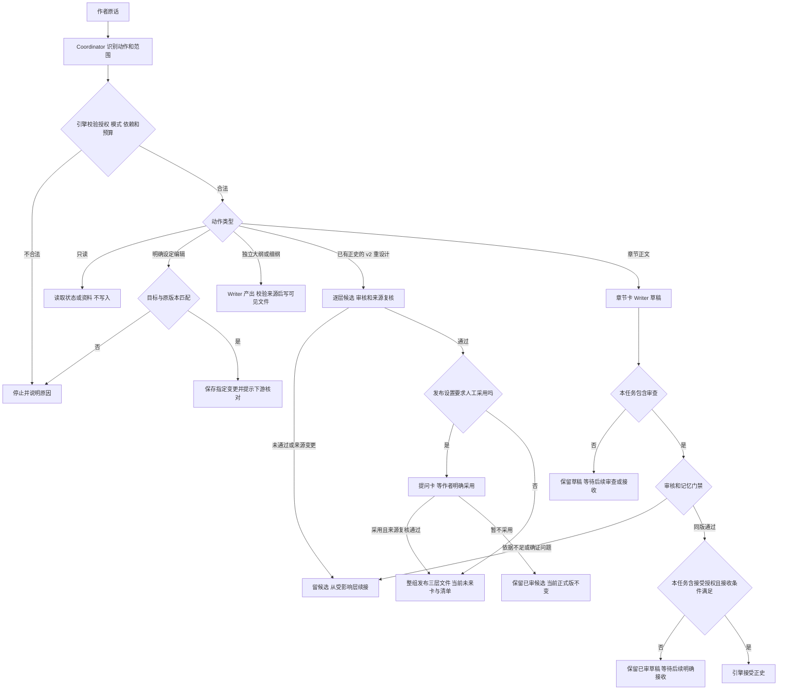

图中的“同版通过”只证明当前草稿完成必要审查。独立写草稿、只写并审核等任务到这里仍保留草稿；只有本次动作包含接收授权，且当前接收设置、版本、审查和记忆条件都满足，才会调用 `accept_chapter`。作者日后单独要求验收时也要走同一提交门禁，不能把 Editor 的通过等同于正史提交。

真正值得警惕的是把“计划节点存在”误当作“某种品质已自动达标”。一方面，`coordinator.py` 的结构校验主要保证操作合法，不替代小说因果判断；另一方面，引擎中的确定性门禁虽能核版本、字段和引文是否出现在文本里，也不能仅凭字符串包含关系证明人物行动合理。因此审核仍需当前模式的审核角色给出语义判断和可反驳证据，硬问题必须回到原文核实。另一个实际边界是规划体系并存：旧 `PlanBundle` 的章节执行卡和 v2 三层规划通过适配相接，而非已统一成单一数据契约。这是代码结构中已经确认的复杂点，不宜在产品介绍里抹平。

以“第十五章已接受，重排第十六至二十四章”为例，正确顺序是核对第十五章是否确为最后正史、冻结书籍设定和近期正文、生成候选大纲及细纲、为目标窗口生成近期规划，再按审核结果与发布设置决定是否采用。正式发布会同时投影目标窗口的当前执行卡，不等到写第十六章时再把新版规划绑定进去。若模型生成期间第十五章被用户改动，旧候选不能直接写回；若审核只因引文复制错字而未通过，应修审核记录，不能让 Writer 改小说来配合错误报告。这样的例子同时解释了“门禁”如何避免数据损坏，以及为何门禁不能变成无意义的反复拦截。

**编排流程与内部子流程。** 一条 DispatchPlan 步骤可能对应有界的多次模型请求：章节审核含补证，规划步骤含三层候选与审核，批次修复含前缀补审及后缀修订。工作流白名单限制“能做哪类事”，引擎内部再限制“这类事怎样完成”；不能把调度表的一行等同于一次付费调用。各子流程的失败保留原任务与版本，具体次数、来源及停止条件分别见[第19节](#inkflow-19)、[第22节](#inkflow-22)、[第26节](#inkflow-26)。

### 任务快照的入口边界

本次定位到的遗漏在应用请求入口，而不是快照保存类本身：[AppServer 的请求执行](../agent/src/inkflow/app_server.py)原先只给聊天、工作流和选区修订绑定配置，预填、候选方向、多维审查、记忆预览未走同一机制；多维审查还在每次模型请求前读取环境设置。现在这四个入口也进入 `_TASK_SETTINGS_METHODS`，先注册运行，再通过 `prepare_task_settings` 保存并绑定快照，随后从 `_engine(...).settings` 取冻结设置。循环中的各维度因此复用同一配置，不会因为设置页变化而悄悄切模型。结束或失败仍在原有 finally 中解除上下文，不影响其他并发任务。

| 入口 | 配置与角色协议 | 恢复和提交边界 |
| --- | --- | --- |
| conversation.send、workflow.run | 新任务默认 v2；根据授权选择当前四种模式 | 重试或续做核对原运行和快照，禁止途中换模式 |
| document.revise_selection | 保留现有 v2 入口设置 | 只修选区，审查与接受另走门禁 |
| document.prefill、chapter.writer_candidates | 本次接入快照，保留 v1 Writer 工具契约 | 只产出候选，不因有任务记录获得正文提交权 |
| chapter.review_panel、memory.preview | 本次接入快照，保留 v1 综合 Editor 契约 | 面板报告不替代正式审核；记忆预览也不提交正史 |
| 批次子流程 | prepare_batch_settings 保存自身配置引用 | 恢复核对清单引用与原快照，不回填当前设置 |
| 本地参考搜索、下载及静态分析 | 不是这一组小说模型调用入口 | 不因本次变更增加模型调用或改变权限 |
| CLI、直接调用引擎 | 一次构造的引擎设置与既有批次机制 | 未统一接入桌面运行快照；本次不声称所有开发入口均可按桌面运行编号恢复 |

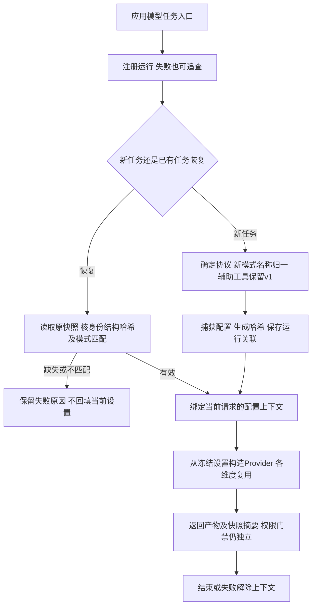

配置快照固定的是模型接口、默认模型、角色模型映射和生成/运行设置，不是把小说所有文件锁住。正文、规划和证据仍需各自的来源指纹；密钥、实时费用也不纳入这份快照。已关联快照损坏时停止并解释，只有确实没有历史关联的旧任务才能按 `legacy_recovery` 明示捕获当前配置。这里修的是代码中可定位的入口遗漏；新增最小回归检查已保留但未运行，真实界面恢复与供应商行为仍待观察。

### 下一轮实施清单

| 当前判断或问题 | 源码依据 | 影响与边界 | 最小修改位置 | 前置依赖 | 后续观察条件 |
|---|---|---|---|---|---|
| 现有保护，保留：旧规划与 v2 通过执行卡适配衔接 | [engine.py](../agent/src/inkflow/engine.py) 与 [schemas.py](../agent/src/inkflow/schemas.py) | 来源需要可追踪 | 保留卡片父关联及 v2 来源标识 | 不需先重写引擎 | 可从一章追到原规划与接受正文，来源不混用 |
| 0.7.2 源码已改；发布验证范围见顶部：辅助模型入口绑定任务快照 | [统一入口](../agent/src/inkflow/app_server.py)、[捕获与恢复](../agent/src/inkflow/studio.py)、[快照契约](../agent/src/inkflow/task_settings.py) | 预填、候选方向、多维审查与记忆预览固定配置；旧综合协议保持不变，面板不直接放行正文 | _TASK_SETTINGS_METHODS、任务开始绑定及辅助调用读取 | 有效项目身份，已有快照恢复须校验哈希，缺失或损坏不回填 | 同任务各维度沿用同一配置对象；运行摘要含原快照身份；发布验证范围见顶部 |

**追踪下一站。** 第 [12 节](#inkflow-12) 沿着引擎发出的调用看角色怎样落到模型，第 [13 节](#inkflow-13) 看提示词及 JSON 契约怎样让返回值可用；准备进入故事规划时，从第 [14 节](#inkflow-14) 开始顺读。

[返回章节目录](#contents) · [打开零基础术语词库](#glossary)


<a id="inkflow-12"></a>
## 12. 模型调度：角色如何选择和调用实际模型

**先用一句话理解：** 角色名称不等于模型名称；这一节查清一个角色真正调用哪个服务、哪个模型、用什么设置。

**遇到生词先看：** [Provider / endpoint / API / API Key](#term-provider) · [temperature / top_p / 生成参数](#term-generation) · [thinking / reasoning_effort](#term-reasoning) · [usage / Ledger / 用量账本](#term-usage)


### 从角色名到一次真实请求

“五个角色”描述的是责任边界，不表示每项任务发出五次请求，也不保证五个不同底层模型。`role_protocol.py` 中的日常模式只有 Coordinator、Writer、Editor；审查加强、记忆加强与全专项按分工允许专项角色，旧 deep 标签仅用于既有任务恢复，且模式表给出了普通审核、逻辑连续性与记忆提案各由谁负责。实际请求的 `agent_role` 是审计和权限信息：规划 Writer 调用显式传 `writer`，规划审核在日常与记忆加强传 `editor`，在审查加强与全专项传 `reviewer`；旧 deep 快照恢复仍传原 `reviewer`，见 [planning_pipeline.py](../agent/src/inkflow/planning_pipeline.py) 与 [planning_pipeline.py](../agent/src/inkflow/planning_pipeline.py)。同一个角色在一次任务中也可能被多次调用，例如审核缺引文后的定点复核；角色数、调用数和模型数必须分开统计。

设置入口由 [config.py](../agent/src/inkflow/config.py) 的 `Settings` 保存 [Provider](#term-provider)（模型服务适配层） 类型、基础地址、默认模型、角色模型映射 `role_models`、上下文预算、最大输出量、最大并发数、推理强度以及按角色的采样参数。按角色的温度、top-p 等通过 `generation_for` 获取；它们改变生成行为；实际选模另由 `model_for` 与共享 Provider 的 `_selected_model` 负责，不能把温度设置当模型选择。Provider `generate_json` 将请求的系统提示词和输出 Schema 拼接，统一交给服务商，并在返回时留下模型名、响应标识、用量和实际角色。不同服务商的请求格式由适配器处理；当前 `create_provider` 对 Anthropic 走专用实现，其余走兼容聊天接口的 `DeepSeekProvider`，所以“支持多个 Provider 名称”也不等于每家都有独立调度器。模型失败重试、限流等待、用量记账要计入真实调用成本，不能用一次逻辑节点代替 HTTP 尝试次数。

应用长任务开始时，配置、角色协议版本和协作模式通过共享入口形成不可变快照。新任务先把旧模式名称归一到当前四种模式，再生成快照哈希；恢复则读取原快照，不重新套用新任务模式归一规则。辅助模型工具仍按原协议 v1 运行，冻结配置不等于把它们升级为 v2 专项。 [task_settings.py](../agent/src/inkflow/task_settings.py) 把非敏感设置写入快照并计算哈希，恢复时先校验结构、项目身份和哈希，防止把当前设置悄悄填回旧任务。凭据单独由环境变量或系统凭据库读取，避免进入项目文件。Provider 的 `_model_role` 会按快照区分协议 v1 与 v2：旧日志中的 `reviewer` 是综合编辑工作，不能把历史调用自动解释为 v2 专项 Reviewer；v2 则拒绝当前模式没有启用的角色。并发控制按服务端地址计数，允许独立任务使用同一服务商，但上限仍受用户设置约束。远端推理不应为了写回占有项目写锁，这在规划链及章节写作的来源指纹模式中可见。

| 术语 | 在代码中的含义 | 不能推出什么 |
|---|---|---|
| Agent 角色 | 调用职责、提示词和权限归属 | 每个角色都有专属模型 |
| Provider | API 协议、凭据和请求适配 | 每种 Provider 已有单独性能保证 |
| 默认模型与角色模型 | `Settings.model`、`role_models` 与实际请求中的 `model` | 未填写角色模型时也自动选不同型号 |
| 角色生成参数 | 温度、top-p、可选 top-k | 已进行参数训练或权重微调 |
| 调用记录 | HTTP 尝试、角色、模型与 token 用量 | 一次任务只有一次付费调用 |

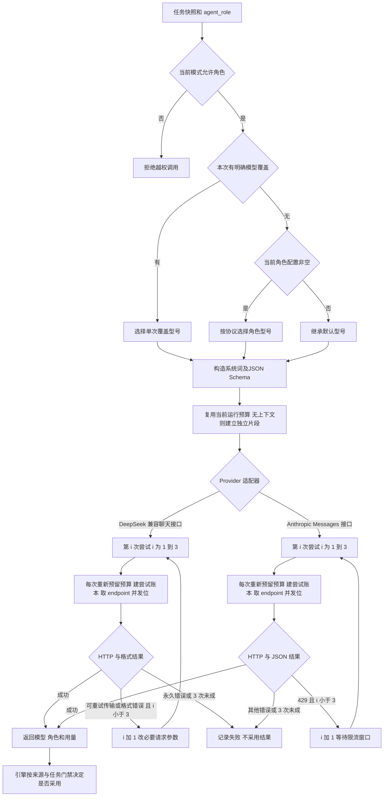

这里的 DeepSeek 兼容路径是 `DeepSeekProvider` 类承载的聊天接口，包括非 Anthropic 的已配置 Provider；最多三次是一次逻辑模型调用的**总尝试数**，不是每类错误各三次。每次尝试都重新向运行时预留预算、创建用量账本，并在发 HTTP 时申请并释放并发位；传输及可修的 JSON 格式问题可在余下次数内重试，明确永久错误不重试。Anthropic 适配器也逐次记账和申请并发位，但当前仅针对 HTTP 429 继续尝试，其他 HTTP、网络或格式错误直接返回失败。[provider.py](../agent/src/inkflow/provider.py) 与 [provider.py](../agent/src/inkflow/provider.py) 分别实现两条路径。

**角色模型配置已接通，当前未运行验证。** 设置的模型页在每个角色生成参数中提供“角色模型”输入。`Settings.role_models` 保存角色到模型 ID 的映射；空值或缺项由 `model_for` 继承默认 `Settings.model`。选择顺序为单次明确 `model_override` → 当前协议下的角色模型 → 默认模型，统一在两种真实 HTTP Provider 的 `_selected_model` 完成，规划与章节调用无需分别写死型号。接口地址、服务商、密钥、上下文及输出上限仍沿用当前设置，角色选模不启用额外角色，不增加调用次数，也不为不支持的型号自动换供应商或重新生成。

| 配置情况 | 实际选择 | 关联边界 |
| --- | --- | --- |
| Writer 单独填写模型 ID | Writer 使用该型号，其余角色各自继承或使用本身配置 | 相同服务商须支持该型号；未知型号按现有 Provider 失败路径返回 |
| 角色留空或旧配置没有 role_models | 继承默认模型 | 留空可恢复继承，不要求给五个角色都配模型 |
| 某次核验明确传 model_override | 本次覆盖优先 | 只影响该调用，不修改角色设置和快照 |
| 协议 v1 的 reviewer | 使用综合 Editor 的模型配置 | 不读取专项 Reviewer 的配置；保留原始角色记录 |
| 已冻结旧任务没有新字段 | 沿用旧快照模型与原哈希 | 兼容读取缺字段，不从设置页补入角色模型 |
| 新任务已有角色映射，途中修改设置 | 继续用开始时冻结的映射 | 新设置仅影响新任务；恢复先核原快照 |

[task_settings.py](../agent/src/inkflow/task_settings.py)将新映射纳入新任务快照。旧快照兼容缺少 `role_models`，恢复比较仍只核原快照实际保存的字段，不重算或改写历史哈希。[config.py](../agent/src/inkflow/config.py)的保存契约按角色协议解释补丁：旧调用者的 reviewer 更新 Editor，不覆盖专项 Reviewer；新调用者明确 v2。模型 ID 验证为最多200字符的单行字符串，留空合法；这不是五套独立 Provider profile，也不证明每个型号都具有相同能力。费用继续按实际请求型号估算，默认模型的手填单价不会直接套到不同角色型号，不能确定时显示未知。

**预算与归属已补齐，当前未运行验证。** 桌面 JSON-RPC 请求复用已有 `RunRuntime`；CLI 的一次命令或一条聊天消息现在通过 `ensure_run_runtime` 建立统一片段，各模型调用及重试共享调用/token计数，有模型请求时 CLI 返回 `runtime_usage` 摘要。两种真实 HTTP Provider 还在共享调用边界兜底：有运行上下文便复用，没有则为这一逻辑调用及其重试建立带身份的独立片段，结束后解除上下文。若已有配置快照，兜底记账沿用该 task_id；否则生成明确的 standalone 身份。直接调用多个引擎步骤若想共享整项预算，调用者仍需包在同一个运行上下文，不能把单次兜底说成整本小说的统一上限。

每次真实 HTTP 尝试仍由现有 `reserve` 与 `ModelAttempt` 计入调用数、输入估计和供应商用量；失败或没有 usage 保留未知状态，不算零成本。预算预留在等待并发位前，因此发送前中断的预留可能也留在未知计数，不能把运行计数无条件解释为服务商已扣费次数。余额查询、模型列表、语音和本地静态分析不是这一套生成 token 预算；ScriptedProvider 不发送 HTTP，不纳入真实模型尝试账本。账本写入失败的已有提醒机制保留，源码补齐不等于消除文件系统故障或证明真实服务费用准确。

另一个容易误解的点是缓存。Provider 为重复调用构造稳定的 JSON Schema 字符串，并记录系统契约和用户提示词前缀哈希，这有助于定位前缀为何改变；服务商是否命中缓存仍取决于自己的机制、账号与历史请求。`prompt_cache_key` 仅对 OpenAI 类请求设置，不能把本地前缀哈希当作已命中 token。模型名、原始输入、缓存命中输入和输出应按同口径报告，特别要区分首次生成、后续章节、修订和专项审核。可参看第 [34 节](#inkflow-34) 的成本统计，那里再解释为什么一次偶然命中率不能证明流程改善。

**设定与手动核对的调用分配。** 配置合集、保存用户输入、定位原句、比较哈希、列引用和归档均为本地操作。正文同次 `setting_updates` 复用 Writer/当前审核/记忆请求；接受后对本轮记忆所有者明确认可的 Writer 附件复用同版说明报告认证参考，不新增模型。未被认可的附件仍待核，若开启自动核对可能有额外后台请求，不能全部算零调用。用户明确请求生成设定时调用 Writer，要求补证时调用当前记忆所有者；日常是 Editor，记忆加强和全专项才是 Memory Keeper。人工改动另建后台核对任务并冻结设置，草稿复用当前章节模式，其他文件及记录按 general 所有者或 Reviewer 发一份 `ManualEditReview`，角色型号仍遵循 role_models、默认继承和显式 override 的既有优先级。本地补读不新增角色；用户解释一次冲突最多让该手动候选再核一次，失败、限流、未知 usage 仍按实际尝试入账。开多个窗口不会自动创建多份共享预算：独立请求有各自 RunRuntime，同一后台批次复用它自己的任务 runtime。见[第23节](#manual-edit-lifecycle)、[第32节](#conversation-isolation)及[第34节](#inkflow-34)。

以用户要求“普通模式先写一章”为例，Coordinator 可以参与理解任务，但模型请求未必每个节点都再调用 Coordinator。Writer 拿到章节 Context Packet 后生成正文，Editor 审核；Memory Keeper 没被启用时不应额外发专项请求。若同一书正在朗读或有独立只读查询，它们也不应因为“项目任务正在跑”就全部排队；只有共享版本写回和同章依赖需协调。模型调度的价值是把调用次数、角色归属、能力预算和版本来源都变得可检查，而不把多模型当作质量保证。

### 下一轮实施清单

| 当前判断或问题 | 源码依据 | 影响与边界 | 最小修改位置 | 前置依赖 | 后续观察条件 |
|---|---|---|---|---|---|
| 0.7.2 源码已改；发布验证范围见顶部：角色模型配置接通 | [配置](../agent/src/inkflow/config.py)、[快照](../agent/src/inkflow/task_settings.py)、[共享选模](../agent/src/inkflow/provider.py)、[设置界面](../desktop/src/App.tsx) | 单次覆盖优先，其次角色模型，再继承默认；共用接口和密钥，不自动启用角色 | role_models、model_for、_selected_model及设置输入 | 型号由当前服务商支持；旧协议按综合 Editor 解释，历史快照不回填 | 实际请求、缓存诊断及账本采用所选型号；模型与界面验证范围见顶部发布记录 |
| 0.7.2 源码已改；发布验证范围见顶部：CLI预算与独立生成归属补齐 | [运行上下文](../agent/src/inkflow/runtime.py)、[CLI入口](../agent/src/inkflow/cli.py)、[HTTP尝试](../agent/src/inkflow/provider.py) | 桌面复用原片段，CLI按命令/消息共享，独立调用兜底绑定身份；缺usage保留未知 | ensure_run_runtime与两类Provider共享装饰入口 | 多步骤共用预算须由调用者建立同一上下文，不包含非生成服务 | 重试各自计数，嵌套不重置预算，结束解除上下文；发布验证范围见顶部 |

**追踪下一站。** 模型拿到的不是“整个项目”，而是经过选择的提示词与结构化输出要求；第 [13 节](#inkflow-13) 说明契约如何构造，第 [30 节](#inkflow-30) 再拆 Context Packet 的内容选择。

[返回章节目录](#contents) · [打开零基础术语词库](#glossary)


<a id="inkflow-13"></a>
## 13. 提示词与输出契约：模型结果如何进入程序

**先用一句话理解：** 模型的答复要能被程序读懂，还要满足业务要求；格式正确和内容正确是两次不同的检查。

**遇到生词先看：** [Schema / Pydantic / 契约](#term-schema) · [JSON / JSONL](#term-json) · [提示词 / system prompt / user prompt](#term-prompt) · [字段 / 类型](#term-field)


### 文本输入如何变成可处理的数据

墨流的模型调用通常不是发一句“帮我写”，然后把任意回复显示出来。引擎先确定任务类型、角色、当前来源和目标输出类，Context Builder 或规划流水线再把书籍设定、上游规划、相关正文、用户本次指令及专用规则组装成提示词。`provider.py` 的 `generate_json` 从 Pydantic 输出类产生 JSON [Schema](#term-schema)（规定字段与格式的规则），附在系统消息中，要求只返回一个满足结构的 JSON 对象。返回值经 `_model_from_json_content` 解码，再由 Pydantic 校验。这样程序才能安全地读取“规划的卷范围”“审核是通过还是需修订”“章节卡目标字数”等字段。结构正确仅说明可被程序处理，不代表故事合理；故事合理需另由审核及来源门禁判断。

契约在不同层级有不同形状。旧 `OutlineOutput` 明确要求逐章数组连续覆盖范围，旧 `StoryDetailOutput` 以故事阶段为单位；面向已有正史的 v2 `BookOutlineV2` 则要求全书主体和卷级方向，`VolumeDetailV2` 要求卷级内容与粗略节拍，`RollingPlanV2` 才含逐章近期窗口。对应类见 [schemas.py](../agent/src/inkflow/schemas.py) 与 [schemas.py](../agent/src/inkflow/schemas.py)。因此改文档名称或 UI 标签并不会自动更改生成粒度，必须同时核查调用入口选了哪个输出类。第 [15～18 节](#inkflow-15) 会逐层讨论这些差别；读者看到“每卷细纲”时，应先确认调用到底进入 v2 链还是旧独立细纲入口。

提示词职责也有边界。全书大纲的 Writer 系统词告诉模型未来可创作、过去不可脑补；规划审核系统词要求只在已接受事实冲突、关键因果不通、用户硬要求未覆盖等情况下提出阻断，并须给候选与来源中的连续原句。正文审核另用统一 evidence-rubric-v1；它的必需项与加权项不能直接套到未来规划。一个普通文风偏好可提示 Writer 或形成 Editor 建议，但没有用户硬约束证据时不应升级成硬门禁。第36节的作者样稿和 Humanizer-zh 接入属于静态表达规则，不是模型权重已经改变。这里“提示词版本”会影响审查报告解释，也会影响缓存前缀，因此运行中变更应与任务快照和来源版本一起看。

| 输入或输出层 | 典型内容 | 程序负责的检查 | 模型负责的判断 |
|---|---|---|---|
| 来源文本 | 用户原话、设定、正史、规划 | 版本、范围、字符与引用定位 | 理解语义和故事关系 |
| 系统提示词 | 角色边界、任务规则 | 固定本次契约和角色 | 按职责完成创作或审查 |
| JSON Schema | 字段、类型、列表边界 | 缺字段、范围和嵌套结构 | 填写有意义的候选内容 |
| 审核证据 | 候选原句、来源原句、理由 | 原句是否连续出现于来源 | 两句是否真的冲突或互相支持 |
| `setting_updates` / `approved_setting_proposals` | 合集 ID、条目、用户字段、性质、引用、预期修订；从 1 开始的明确认可序号 | 字段、角色、版本、出处定位；v2 只取本轮记忆所有者的认可列表 | 正文 pass 不默认认可全部附件，未认可 Writer 条目仍待核；任何条目不自证正史 |
| `ManualEditReview` | `pass / needs_user / insufficient_context`、摘要与问题、规划相容判断、补回的正史证据 | 当前候选、来源哈希、双方原句；`planning_quotes` 定位当前规划，`recovered_evidence` 定位接受原文 | 同一请求核人工候选及旧计划能否继续；不代替正文量表、正式规划发布或接受授权 |
| 旧 `ReviewModelOutput` → `ReviewReport` | 综合结论、量表、原句、说明问题及 `approved_setting_proposals` | 只映射两类共有字段，来源与得分由代码补；记忆补丁走独立校验 | 不把 memory_patch 强塞进报告，不把字段映射当作文学或接受放行 |

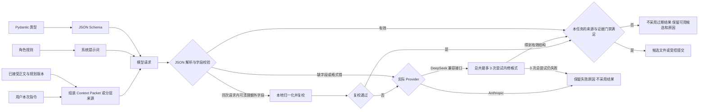

格式错误的处理不是无限重试。Provider可以清理Schema不允许的额外键，再由Pydantic复校；必要字段缺失仍须有限修复或失败，见[provider.py](../agent/src/inkflow/provider.py)。规划引文仍由planning_pipeline.py过滤与限次复核。正文审核则先发现资料、引用或归因缺口，自动检索补读，再由责任角色复核，疑似硬问题另走反证；它不是Writer按审核误读改稿的授权。evidence_relation与conflict_type为兼容扩展，旧记录缺字段按unchecked解析，但新自动通过不能把unchecked当已核。source_queries承载缺源短线索；evidence_recovery和evidence_policy_version由引擎保存实际补救与契约版本，不采纳模型自行声称的验证完成。算分版本仍为evidence-rubric-v1，归因契约为evidence-attribution-v1。

设定扩展继续使用现行输出类：`DraftOutput.setting_updates`、`ModeCheckOutput.setting_updates` 与 `MemoryPatch.setting_updates` 每处最多八条 `SettingRecordProposal`，独立设定生成使用 `SettingRecordSet`。它们不是启用 dormant `EditorResult`、`ReviewerResult`、`MemoryResult` 的信号。Writer 提案随公开钩子保存，`version_notes` 读取这批字段，说明指纹因此覆盖它们；模型不能交一份设定提案、再让正文审核完全看不到。后台手改使用的 `ManualEditReview` 是用途不同的实际契约：`planning_decision` 区分相容、须更新、不适用和资料不足，`planning_quotes` 最多八处当前规划原句，`recovered_evidence` 最多八条接受原文及支持、反证、信念或参考关系。代码定位原句并补真实版本身份，模型不能自己编造来源哈希。这份报告的 `pass` 不能代替章节 `ReviewReport`、旧未来卡重新发布或正史接受。模板字段与出入范围见[第14节](#story-setting-collections)，疑问状态与人工解释见[第23节](#manual-edit-lifecycle)。

**旧综合路径怎样转换报告。** `ReviewModelOutput` 保留模型必须填写的综合审查字段和独立记忆补丁；构造 `ReviewReport` 时按 `ReviewReport.model_fields` 明确选择共同字段，不把模型输出全量展开后因额外 `memory_patch` 触发禁止字段错误。`approved_setting_proposals` 已同时接入旧综合实际 Schema、v2 输出和最终报告，默认空列表不表示附件全部认可。旧协议仍按综合 Editor 解释，转换成功后还要经过相同的原句、归因、评分、来源和记忆门禁，不能把可解析当可接受。实现见 [ReviewModelOutput / ReviewReport](../agent/src/inkflow/schemas.py) 与 [review_chapter](../agent/src/inkflow/engine.py)。

这个设计的逻辑上限值得明确：JSON Schema 擅长约束形状，不能证明“人物绝无途径知道名单”。引文位置校验擅长证明审核确实引用了某段文字，不能证明审核的解释唯一正确。举例来说，角色说“我昨天看见铁盒”可能是撒谎，也可能是作者要写的误解；若审核只按字面断言客观铁盒位置发生矛盾，程序不能因引文匹配就自动要求改正文。相反，若上游已接受正文明确写铁盒在另一个人手里，而新规划声称主角无行动就拿到它，审核应定位这两句并说明为何无法同真。结构校验、来源校验和语义复核各管一段，混用会让系统既慢又容易改错。

当前一个已确认的实现复杂点是两个规划协议并存：旧入口的 `OutlineOutput` 强制逐章，新 v2 全书大纲不逐章；旧 `generate_plan` 首次只展开一到三章，v2 已有正文重设计可产生更长近期窗口。文档会在相关章节清楚标注入口和范围。另一处可继续核查的是 Provider 对各种模型的 JSON 模式兼容行为：代码中有格式清理与最多有限重试，但实际供应商返回怎样、是否有服务商特有 Schema 限制，静态阅读不能代替真实调用观察。

新增 `MemoryEvidence`、`MemoryOperation` 与 `PreferenceObservation` 均是现有输出契约的兼容扩展；旧候选未提供新列表时使用空列表。事实原来的主 `evidence` 保留；额外证据不能替代主引用。日常 Editor、旧协议综合 Editor、专项 Memory Keeper 的记忆提示词共享 `MEMORY_CHANGE_CONTRACT`；专项 Reviewer 仍不提取记忆。作者偏好由 Coordinator 观察，不从小说事实里反推出作者习惯。

**小范围结构兼容不会扩大业务授权。** ReviewFinding.category 接受 continuity 别名并归到 knowledge；assessments.criterion 仍只用量表的六项，不能填knowledge/originality。PLAN_CONTINUITY_SYSTEM 明确 assessments=[]，近期卡连续性检查不做正文六维文学评分。ParagraphExpansionPlan 的插入数组无固定12处上限，但调用预算和轮次仍在引擎。字段兼容只修返回形状，角色越权、引用缺失、正文或计划范围错误仍需独立拒绝。依据见[schemas.py](../agent/src/inkflow/schemas.py)、[prompts.py](../agent/src/inkflow/prompts.py)。

### 下一轮实施清单

| 当前判断或问题 | 源码依据 | 影响与边界 | 最小修改位置 | 前
1置依赖 | 后续观察条件 |
|---|---|---|---|---|---|
| 现有保护，保留：新旧大纲 Schema 粒度不同且按入口选择 | [schemas.py](../agent/src/inkflow/schemas.py) 与 [schemas.py](../agent/src/inkflow/schemas.py) | 同名产物可能被误读 | 先在入口与产物展示协议标识 | 列用户可见的规划入口 | 从产物可回查所用 Schema、来源与审核状态 |
| 待核影响，先复现：个别服务商的结构化输出兼容性 | [provider.py](../agent/src/inkflow/provider.py) | 格式重试可能增加费用 | 若复现，再改对应 Provider 解析边界 | 取得具体失败样本 | 同类格式错误有可解释原因与有限恢复 |

**追踪下一站。** 第 [14 节](#inkflow-14) 从创作材料开始进入具体规划，第 [21 节](#inkflow-21) 专讲正文证据量表，第 [30 节](#inkflow-30) 展开上下文如何在 token 预算内选择。

**本次实际接入的字段。** `HookNote.annotations` 请求四类 `WriterNoteClaim`，随原 Writer `DraftOutput` 返回，少量 `new_fact_candidates` 和 `thread_changes` 落入同版钩子附件。实际运行的 `ModeCheckOutput` 与旧 `ReviewModelOutput` 增加可空 `writer_note_questions`，主审最多提出三个具体意图问题。短答实际请求 `WriterNoteClarification`，逐题给简短 `answers`，必要时附 `corrected_hook_note`，不生成正文。`ReviewReport.writer_notes_hash` 由代码计算；补救记录保留问题、尝试、答复及纠正附件 ID。旧草稿无说明仍可处理；没有启用未接入的独立 Result，也没有新增数据库迁移。

[返回章节目录](#contents) · [打开零基础术语词库](#glossary)


<a id="inkflow-14"></a>
## 14. 创作起点：题材、设定与用户硬要求如何形成

**先用一句话理解：** 设定是贯穿整本小说的可维护资料合集；你定义记录什么，Writer 提出新内容，审查与记忆角色核对补证，正式发生了什么仍由已接受正文决定。

**遇到生词先看：** [设定合集与条目](#term-setting) · [大纲 / 卷细纲 / 近期规划 / 执行卡](#term-plan) · [正史 / 已接受正文](#term-canon) · [草稿 / 候选 / 生效](#term-draft) · [来源指纹](#term-fingerprint)


### 一本书最初有哪些依据

开始一部小说时，墨流需要先分清“作者希望写什么”和“故事里已经发生了什么”。前者可以来自题材、主角、叙述视角、读者体验、篇幅估计和本轮特别要求；后者只能来自已经接受的正文及可核对的事实。新项目的 [BookBrief](../agent/src/inkflow/schemas.py#L14) 是结构化书籍契约，创建项目时由 [project.py](../agent/src/inkflow/project.py) 保存进 SQLite 并渲染为 `BOOK.md`。此时还没有已接受章节，`STATE.md` 明确是空正史状态，`PLAN.md` 只是“尚未生成四级规划”的占位。软件不应因为创建了书名和主角，就对用户说全书大纲已经完成。后续 Writer 规划需要从书籍契约出发，逐层提出方向；新书和已有十五章正文的小说，起点根本不同。

Coordinator 理解用户自然语言时，先分清讨论、改书籍简报、编辑规划和管理可持续设定。例如“主角是外地返乡护士，结局偏克制，但先别写正文”，前两项是创作方向，最后一项限制现在不能写章节。“建立人物变化档案，今后记录首次登场和最新状态”则是设定合集的职责定义；“把林的职业背景记录进去”是条目操作。会话模型已获得 `story_settings_manage` 白名单动作，提取目标合集、操作、字段和修订号，交引擎处理，不能因为碰到“人物”关键词就直接写入，也不能自己编完设定正文当作用户选择。只讨论不保存；目标同名不唯一、缺字段或范围不清时才询问必要信息，见 [terminal_session.py](../agent/src/inkflow/terminal_session.py)、[coordinator.py](../agent/src/inkflow/coordinator.py) 和 [manage_story_settings](../agent/src/inkflow/engine.py)。

当作者已经写到中途，已接受正文、人物当时实际知道的信息和未结关键伏笔仍是新设计的锚点；设定和未来规划可以调整，不能让尚未发生的结果倒灌过去。v2 管线读取书籍契约、时序状态、已接受摘要、最近三章、点名的相关前章、有效偏好及按角色允许读取的设定参考；本次另外补接早期未结伏笔的连续原文。来源哈希和版本在审核与发布前复核，读到一条设定说明并不意味着已经读到其证明正文。设定怎样加入当次输入见[第30节](#inkflow-30)，伏笔怎样定位见本节后面的[早期来源补读](#planning-thread-evidence)。

<a id="story-setting-collections"></a>
### 可持续设定由两层对象组成

**合集**定义“这份档案负责什么”，包含名称、分类、模板、记录说明、字段、读取角色、记录角色和自己的修订号。**条目**记录某个人、地点、物件或约定，包含标题、字段值、性质、来源角色、来源章、多个引用、复核状态、条目修订号及修改前历史。一份人物合集可以有多个角色条目，同一个模板也能创建多份不同职责的合集。它类似可拆分的故事设计资料：既能存未来假设，也能给已发生变化提供原文索引；它不是第四层正史，也不替代大纲的全书方向、细纲的因果安排或记忆的正式事实。实现见 [StorySettingsService](../agent/src/inkflow/story_settings.py)。

桌面入口是**设置 → 本书设定**。先选模板或新建自定义模块，填写名称、分类、负责记录的内容，调整字段与角色，再保存具体条目。每个字段有标识、显示名称、填写提示和新条目默认内容，模板预先提供字段及职责说明；每份合集允许 1～40 个字段，并能停用留档。它们仅属于当前小说，不随作者习惯自动迁入新书。作者跨书偏好仍使用[第27节](#inkflow-27)的独立设置入口。

下表完整列出当前十二个模板及预设字段。字段提示可以修改；“首次出现”“最后出现”等是具体记录字段，当前没有独立的人物实体识别器自动证明每次登场都已收齐，模型是否覆盖仍受用户定义、当次输入和提案质量影响。

| 模板 / template_id | 默认分类 | 预设记录字段 | 使用时要核对的关系 |
| --- | --- | --- | --- |
| 人物设定 / `character` | 人物 | 身份与定位、背景、性格与动机、当前状态、人物信念、首次登场、最后出现、关键关系 | 主角、配角、反派分别建条目；信念不等于客观状态，首次提及和实际登场可在值中注明 |
| 场景与地点 / `location` | 场景 | 场景描述、背景、位置与布局、首次出现或提及、最后出现、关键人物、关键事件 | 拟设地点与正文已到过的地点区分；布局变化引用对应章 |
| 道具与物品 / `item` | 道具 | 外观与来源、用途、限制与代价、持有人、当前去向、首次出现、流转与变化 | 所有权、携带者、最后位置和人物以为的位置分别解释 |
| 世界与背景 / `world` | 世界 | 时代、地理、环境、基本前提、世界限制、世界变化 | 新世界规则是创作假设；过去例外不能靠新定义抹除 |
| 组织与势力 / `faction` | 组织 | 目标、背景、关键成员、资源、势力关系、当前状态、首次提及、最后涉及 | 公开目标、真实目标及传闻分别标明来源 |
| 能力与力量体系 / `power` | 规则 | 效果、使用条件、代价、层级、限制、例外 | 人物展示过的能力与拟新增能力分开，例外须说明生效范围 |
| 时间线与事件 / `timeline` | 时间 | 发生时间、持续时间、参与者、事件、前因后果、叙述时间 | 回忆的叙述顺序不等于事件发生顺序，未知日期不补造 |
| 人物关系 / `relationship` | 关系 | 关系双方、已证实关系、双方认知、矛盾与期待、关系转折、最后变化 | 实际关系与各自认知可不同，不以一个人的对白证明双方一致 |
| 种族与生物 / `species` | 生物 | 外形、栖息地、习性与能力、弱点、代表个体、首次出现 | 族群一般特征不强制覆盖每个个体，特殊差异需来源或设想标签 |
| 文化与制度 / `culture` | 社会 | 习俗、制度、信仰、阶层、适用范围、差异与例外 | 地域、时代和组织范围不扩大，信仰说法不自动成为世界真相 |
| 悬念与伏笔参考 / `mystery` | 伏笔 | 已出现内容、读者已知、未揭示部分、后续打算、回收条件、关联伏笔 | 后续打算可调整；是否种下、推进和回收仍看正史伏笔及正文 |
| 故事边界与约定 / `constraint` | 约束 | 要求、适用范围、要求性质、允许例外、目的、生效时间 | 用户约定、硬约束和表达偏好分别解释，不因字段标签自动生成全书硬门禁 |

### 各角色可以改什么，依据怎样保留

合集职责和权限由用户定义，Coordinator 只把原话转成白名单参数。用户可以直接写条目，或明确要求 Writer 生成新的设定候选；Writer 的新记录强制标为 `hypothesis`，不能改写已核对条目。Editor、Reviewer 和 Memory Keeper 可在许可范围内带证据补充、纠正，不能凭常识补造过去。`supplement` 合并原字段并保留旧证据，`correct` 明确替换候选内容，修改前值仍进历史。设定记录权限不会增加角色调用：日常记忆所有者仍是 Editor，记忆加强与全专项才由 Memory Keeper 接管，见[第10节](#inkflow-10)。所有角色读取都尊重合集的 `read_roles`，模型未被启用时不会因为某个复选框就自动参加。

每个条目最多十二处引用，来源可为已接受正文 `canonical`、当前草稿 `draft`、当前规划 `planning` 或版本绑定的 Writer 钩子 `writer_hook`。引用须给连续原句；代码补齐真实修订号、内容哈希、项目内路径或附件 ID、字符位置，并标明 `support` 支持、`counter` 反证、`belief` 信念或 `reference` 参考。规划仅取当前基础文件，不自动读历史规划；已有三层正式清单时，旧 `PLAN.md` 投影不能作为自动设定证据，应引用当前 `OUTLINE.md`、`STORY_DETAIL.md` 或 `RECENT_PLAN.md`。钩子只能证明“Writer 曾给这个意图”，不能证明故事已发生。草稿正式接受后，仅在原哈希及修订号都不变时衔接到已接受来源；改写来源则显示过期。**原句定位、语义支持、正史提交是三道不同判断**，不能凭引用存在自动认证内容。

保存与复核分开。用户编辑或模型候选先进入 `pending_review`；后台语义核对可以变成 `verified_reference`、`needs_user` 或 `needs_evidence`。即使核对通过，身份仍是 `reference_only`。用户保留冲突内容时只能记录为“保留设想及原因”，原审查意见留存；要改变正史必须另走已接受正文修订和记忆重绑，不能在设定窗口点一次同意就把前文改掉。修订号、父合集配置及来源指纹在写回前核对；迟到结果不覆盖新版，无变化返回 `changed=False`，不虚增版本或重复排队。

Writer 同次 `DraftOutput.setting_updates` 把设定候选随钩子附件暂存，主审读到这份公开说明及候选。Editor/Reviewer 的实际 `ModeCheckOutput.setting_updates` 和记忆补丁也可提出有依据的参考变更。**当前自动落库发生在正文接受事务完成后**：传入本次接受前已核对的报告，章版本、正文哈希、pass 和公开说明 `writer_notes_hash` 必须一致；专项提案仅取这份 mode bundle 关联的精确 candidate ID，再核协议、角色、模式、verified 状态、故事指纹及快照，不扫描旧审核凑提案。代码随后按字段和引用保存参考。Writer 附件仅在本轮记忆所有者的 `approved_setting_proposals` 明确认可列表里，才复用既有审核标为 `verified_reference`；未认可条目仍 `pending_review`，按设置进入后台核对，不由正文 pass 全部带过。审查/记忆自己的有据补充可复用其对应同版请求，但仍先核来源和写权。缺少匹配报告不采纳旧提案；保存或认证失败保持候选/待核并逐项警告，已接受正文不因辅助参考失败回滚。复用明确认可的分支不再调用 Writer 或固定再审一次整章；待核分支若开启自动核对仍可能增加调用。这个状态认证的是同版参考记录，不能把设想升级为正史或保证将来一定圆满。用户之后修改条目会重新排队。独立“生成设定”“补证设定”是用户明确提出的另外任务，才消耗对应角色调用，见 [_adopt_setting_proposals](../agent/src/inkflow/engine.py)、[writer_notes.py](../agent/src/inkflow/writer_notes.py) 和[第34节](#inkflow-34)。

| 输入类别 | 典型内容 | 权限和解释方式 | 进入哪个后续阶段 |
|---|---|---|---|
| 用户原话 | 本轮目标、禁止事项、修改范围 | 本轮明确指令优先，含“先不写” | Coordinator 路由、规划任务 |
| 书籍设定 | 题材、角色基础、估计规模 | 可由明确编辑改变，保存版本 | 全书大纲的基础 |
| 用户定义的设定合集 | 人物状态、场景、道具、世界等档案及任意自定义字段 | 模板仅预填职责；读写权限、来源身份和待核状态分别保存 | 各角色上下文及来源补读，不自动变成正史或生效规划 |
| 已接受正文 | 已发生事件、人物实际行动 | 不可被未来规划倒写 | 各级规划及正文门禁 |
| 伏笔与事实账 | 已种下或已验证的状态 | 须保留来源、时序、认知类型 | 检索、上下文与审核 |
| 旧未来方案 | 被替换的大纲、细纲、近期卡 | 仅保留为历史创作假设，不自动作为当前依据 | 作者明确指定版本与部分时才可参考或融合 |

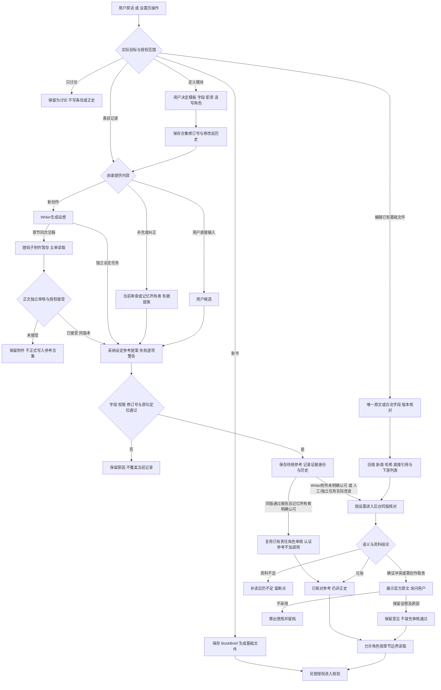

### 旧文件编辑回执现在给出什么

`edit_story_setting` 仍是明确修改 `BOOK.md`、`OUTLINE.md` 或 `STORY_DETAIL.md` 的受控文件入口，不承担整个设定合集的职责。书籍字段须通过 `BookBrief` 校验并同步结构化简报；规划替换须提供唯一命中的原文与新文。实际修改才捕获旧版和保存新版本，回执现含 `before`、`after`、前后哈希、`changes`、现存下游规划文件列表、设定条目的直接引用影响摘要及后台核对对象。旧值等于新值直接返回无变化。回执不再只有一句“下游需核对”，但这里的 `affected_documents` 是**结构上需要核对的文件**，`impact` 是**已保存引用的关系**，不是全书语义分析证明的完整受影响章节。程序没有自动改写大纲、细纲或已接受正文，后台门禁和来源指纹阻止未核内容被当作同版已审依据。见 [edit_story_setting](../agent/src/inkflow/engine.py)、[impact_summary](../agent/src/inkflow/story_settings.py) 和[手动修改状态链](#manual-edit-lifecycle)。

<a id="planning-thread-evidence"></a>
### 早期关键伏笔现在怎样找原文

已有正文的三层规划新增 `planning-thread-evidence-v1`。程序先从 `threads_as_of(anchor)` 取在最近三章之前种下或推进过、当前仍开放的伏笔，优先本窗口到期及承诺、伏笔、悬念，再最多选四条形成短查询。已知种植章和最近推进章先按身份定位；模糊检索只补相关线索。候选去重并排除已经完整装入的章节，最多六篇，每篇以中文词片段/BM25 选一段最多 1400 字的连续原文；总新增上下文最多八千 token，并预留角色输出和当前上下文余量。数据库权威正文或旧哈希一致投影读取后再次核对内容指纹，查不到、文件过期、预算不足分别记 `missing_sources`。这些索引及节选记在运行目录 `thread-evidence.json`，不会重新生成章节。

取到节选只说明原文可读，当前规划审核角色还要判断它是否支持该人物、该时间及该伏笔。没有命中不能证明伏笔不存在；未选中的开放线索单独记录，不以“最多四条”声称已做全书查尽。发布前重新核对加载章的版本、哈希和节选，来源变化则停在受影响节点。它补上了原先主要依赖 `STATE.md` 与最近三章的早期原文缺口，仍保留窗口预算和未知资料边界，见 [_planning_thread_evidence](../agent/src/inkflow/planning_pipeline.py)、[第29节](#inkflow-29)与[第30节](#inkflow-30)。

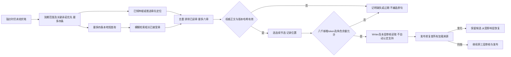

另一个容易出错的地方是硬要求与审美偏好的区别。“不要修改前十五章”“这轮只规划十六至二十四章”是明确边界，模型不得自行扩展；“对白更含蓄”“允许慢热”指导表达和审查理解，不能机械变成字数或标点门槛。用户可临时试写和保留备选，候选没有经过接受不能污染正史。长篇项目尤其需要把客观事实、角色相信的事、传闻和作者未定的设想分开。若一个人物误以为铁盒还在铺内，规划应写成这个人物的信念；只有正文已证实铁盒位置时才能写成客观状态。这样的区分直接决定后续大纲能否接住故事，又决定审查是改正文、改计划，还是仅保留悬念。

未打开小说时，开书构思也可从作者设置读取默认习惯；这些习惯帮助 Writer 选择表达与故事体验，但不是已有世界设定。用户输入的新题材、读者和明确要求优先。本书人物、篇章和章节偏好不能直接保存为作者跨书范围。新书使用的是有效作者条目，没有把旧书整套事实和正文复制进来。

### 下一轮实施清单

| 当前判断或问题 | 源码依据 | 影响与边界 | 最小修改位置 | 前置依赖 | 后续观察条件 |
|---|---|---|---|---|---|
| 0.7.2 源码已改；发布验证范围见顶部：设定编辑返回前后值、哈希、直接引用及结构下游列表 | [edit_story_setting](../agent/src/inkflow/engine.py)、[impact_summary](../agent/src/inkflow/story_settings.py) | 不再只有保存提示；影响列表不冒充全书语义依赖，正文未自动修改 | 复用保存回执与后台任务 | 明确文件编辑还是合集记录 | 同版改动及引用可追踪，后续按授权核对规划 |
| 0.7.2 源码已改；发布验证范围见顶部：早期开放伏笔有界定位接受原文 | [planning-thread-evidence-v1](../agent/src/inkflow/planning_pipeline.py)、[HybridRetriever](../agent/src/inkflow/retrieval.py) | 四查询、六章节选、八千新增 token；未命中和未选中不算不存在 | 现有规划来源构建及发布前核验 | 当前正史锚点、有效伏笔和角色预算 | 原文、版本、位置与缺口在运行记录可追踪；未做真实小说质量验证 |
| 0.7.2 源码已改；发布验证范围见顶部：十二模板、自定义合集与多来源记录 | [共享设定服务](../agent/src/inkflow/story_settings.py)、[桌面设置页](../desktop/src/StorySettings.tsx) | 接受后仅明确认可的 Writer 附件复用精确说明审核；未认可仍待核，无匹配不采用旧提案 | 复用 bible_entries、实际输出字段和接受后交接 | 用户定义职责、当前条目修订与合法原文 | 新设想不倒灌正史，补充保留证据，停用保留历史 |

**追踪下一站。** 有了输入边界之后，第 [15 节](#inkflow-15) 看全书方向如何提出；如果希望理解用户反馈如何沉淀为偏好，先跳到第 [27 节](#inkflow-27)。

**自动记录到哪一步。** 当前自动附件字段接在章节 `DraftOutput`、实际 `ModeCheckOutput` 和 `MemoryPatch`；三层规划自己的大纲、卷细纲、近期窗口 Schema 尚未自动产出一批设定条目。因此“设定可以整理大小纲并被所有获准角色读取”，不能扩写成“每一层规划发布都会自动完成全部档案建库”。作者可从设置页或自然语言明确要求以当前规划补充某份合集，按新设想/有据补充路径处理；未来若要自动接入各层，应先决定哪些字段只是设想、何时采纳及由谁核对，不重复复制整份规划或跳过本节参考身份。

[返回章节目录](#contents) · [打开零基础术语词库](#glossary)


<a id="inkflow-15"></a>
## 15. 全书大纲：主线、高潮与结局如何生成

**先用一句话理解：** 大纲要说明全书往哪里走；当前代码里的章节范围大纲与全书大纲入口不同，需要分别理解。

**遇到生词先看：** [大纲 / 卷细纲 / 近期规划 / 执行卡](#term-plan) · [锚点 / 近期窗口 / PlanBundle](#term-window) · [草稿 / 候选 / 生效](#term-draft) · [Schema / Pydantic / 契约](#term-schema)


### 两条真实存在的大纲路径

全书大纲回答的是故事为何发生、人物将经历怎样的总变化、主要场景和冲突怎样推向高潮，以及大致收在何处。它不是每章执行卡。当前项目里，一个入口生成**指定章节范围的独立大纲**，另一个入口为**已有正史重设计全书大纲**；它们都可能写到名为“大纲”的可见文件，却不属于同一层级。独立入口 `engine.generate_outline` 输出 [OutlineOutput](../agent/src/inkflow/schemas.py#L280)，要求目标范围的章节条目连续，还能供用户预览和讨论，不自动生成草稿、审查报告或正史。v2 入口 `redesign_existing_story` 输出 [BookOutlineV2](../agent/src/inkflow/schemas.py#L331)，主体约五千至二万五千字符，另列连续的卷级方向，不逐章填场景。因此“全书大纲不逐章”只适用于当前 v2 路径，不能扩大成所有大纲入口的现状。

独立大纲的输入包括 `BookBrief`、已接受章节摘要、当前正式规划的相关部分及相邻旧大纲边界。若是重构，代码另外读取最近三章完整已接受正文和经来源哈希核过的客观事实，以避免把过时未来计划当作正史。Writer 的结果必须有主线、人物变化与结局，章节范围必须和用户要求一致；远端返回后，写入前再次核对来源指纹。生成文件会保存到 `planning/outlines`，同时直接更新可见的 `OUTLINE.md`；若只改一段则通过范围替换保存其余章节。这里有真实的状态语义需要辨清：自然语言入口的回复称它为“候选、尚未确认”，但文件已经更新，并未经过 v2 的 `PlanningReviewV2` 审核。读者不能把“可见文件被更新”理解成“v2 已审核生效”；下一轮应先明确这类候选如何呈现与确认。实现分别见 [engine.py](../agent/src/inkflow/engine.py) 与 [terminal_session.py](../agent/src/inkflow/terminal_session.py)。

v2 重设计专门面向已经有正史、作者想重新安排未来的情形。`redesign_existing_story` 要求锚点等于当前最后一章已接受正文，读取书籍设定、事实账、全部已接受章节摘要和最近三章全文，保存来源哈希。Writer 先生成 `outline-candidate.json`；审核角色根据当前协作模式读取候选与来源，输出 verdict、confidence、逐字证据和修订指令。若审核依据不足，保存候选等待补证；若有确证硬问题，只针对大纲修；若通过，则进入卷细纲生成，但大纲此时仍是尚未整组发布的候选。只有大纲、卷细纲、近期窗口三层都通过，短写回阶段才同步更新可见 Markdown、数据库执行卡和 `active-v2.json`。这种整组提交保护了“新的大纲已生效、但细纲还是旧故事”的半状态。具体顺序见 [planning_pipeline.py](../agent/src/inkflow/planning_pipeline.py)；发布细节见第 [19 节](#inkflow-19)。

大纲通过只解除“进入卷细纲”的依赖，不创建正式第 N 版。卷细纲、近期规划仍可能审核失败或遇到来源变化；此时旧正式修订号不动。三层全部合格后，发布设置决定是否立刻提交，人工确认模式会向用户提问。该问题回答“暂不采用”时仍保留候选，不让 Writer 将它当成当前大纲。参见[自然语言问答](#inkflow-04)和[第19节的状态图](#inkflow-19)。

| 大纲入口 | 输入重点 | Writer 输出 | 审核与写入语义 |
|---|---|---|---|
| 独立 `generate_outline` | 用户范围、书籍契约、已有摘要及局部边界 | 强制逐章的 `OutlineOutput` | 校验范围和来源后更新 `OUTLINE.md`；未进入 v2 审核链 |
| 已有正文 v2 重设计 | 最后正史锚点、事实与伏笔、最新授权 | 全书主体加卷级方向的 `BookOutlineV2` | 审核通过后暂存候选；三层齐备才整组发布 |

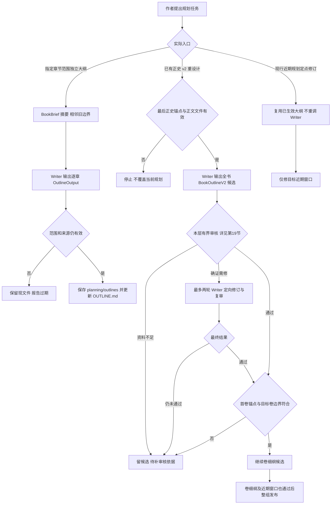

图中的“有界审核”不是一个可无限循环的 Writer 与审核角色对话：本层最多一次初稿加两轮定向修订，次数与补证条件在第 [19 节](#inkflow-19) 单独展开。若锚点、来源或审核始终不成立，候选留在运行目录并停在本层，不会自动跳到卷细纲。

大纲审核不能把旧版未来章节逐句当作承诺。已有正文后的重设计必须承接已发生事件，例如铁盒已经失踪，就不能让未来卷写成第一次丢失；尚未兑现的伏笔可以改变兑现方式，只要原来种下的事实和当下人物知识没有被抹掉。一个好的总方向要交代主线目标如何改变人物、主要冲突何以升级、高潮的代价和结局的余波，但未来未定的对话和场景可以在卷细纲及正文阶段调整。代码的 v2 [Schema](#term-schema)（规定字段与格式的规则） 会检查卷号、卷章节范围连续、不重叠以及每卷不少于十章；这里“十章”作为新卷结构限制写在验证器里，用户要求短卷的例外尚不能仅凭架构文档中的允许说明认为代码已经支持。此处存在已确认的设计与实现差距：例外应由明确授权驱动，不能靠操纵输入绕过结构校验。

首次完整重设计仍带有特定假设：当未复用生效大纲时，第一卷终点必须等于当前已接受锚点，且至少再规划一卷。因此任意卷中途重建全书的需求仍有限制。但是现行近期窗口修改或同卷续开复用大纲时，不再要求旧第一卷终点等于已经推进后的新锚点；程序改为选择包含“锚点下一章”的卷并核对终点。这两类情况不能都写成“每次必须以第一卷末为锚”。新书没有已接受章时仍不进入此管线，跨卷自动细化也没有接通。依据是 [redesign_existing_story](../agent/src/inkflow/planning_pipeline.py#L565) 的 active_outline 分支、卷选择和终点校验。

正式三层规划把合并后的作者习惯与本书偏好纳入来源，并在发布前核对是否改变。旧版独立规划入口也在 Context Packet 中附带相同类型的偏好段。偏好不构成已经发生的情节；新书题材与作者当前要求优先。若规划期间用户修改了默认习惯，保留候选并核对受影响层，不把已发布大纲默默改写。

**全书终态的审核范围。** 规划审核提示新增跨卷物件与人物终态检查：同一物件既“不归还/仍失踪”又“被取回”，或“最后一次出现”在不同卷重复，都要核对是不是不同对象和不同时间，确证互斥才定向修改。这个检查是审核提示和证据合同，不是程序已建全书对象状态图。大纲内部两处引文可支持 revise；pass 仍须外部正史或上游依据，不能候选自证。下游卷细纲见[第16节](#inkflow-16)，统一审核边界见[第19节](#inkflow-19)。

### 下一轮实施清单

| 当前判断或问题 | 源码依据 | 影响与边界 | 最小修改位置 | 前置依赖 | 后续观察条件 |
|---|---|---|---|---|---|
| 代码缺口，按需求改：独立大纲被称候选却更新 `OUTLINE.md` | [engine.py](../agent/src/inkflow/engine.py)、[terminal_session.py](../agent/src/inkflow/terminal_session.py) | 候选与当前依据的边界不清 | 独立大纲保存及界面状态 | 先定义确认和生效语义 | 用户能区分候选、当前文件和 v2 已审版本 |
| 实现边界：完整重设计首卷终点须等于锚点；复用上层的同卷续开不受此旧首卷限制 | [planning_pipeline.py](../agent/src/inkflow/planning_pipeline.py) | 卷中途重设计被当前流程阻断 | 若有明确卷中途需求再调整契约 | 先定义已接受卷内进度规则 | 原正史不被改写，新范围有明确边界 |
| 代码缺口，按需求改：短卷例外未进入 Schema | [schemas.py](../agent/src/inkflow/schemas.py) | 明确短卷要求仍会被拒绝 | `BookOutlineV2` 范围验证 | 例外授权的持久记录 | 有授权短卷通过，无授权短卷仍拦截 |

**追踪下一站。** 第 [16 节](#inkflow-16) 看全书方向如何落到当前卷的因果链，第 [17 节](#inkflow-17) 再把卷级节拍变成近期逐章规划；想先看总体发布规则可跳第 [19 节](#inkflow-19)。

[返回章节目录](#contents) · [打开零基础术语词库](#glossary)


<a id="inkflow-16"></a>
## 16. 卷细纲：如何把全书方向展开为卷级因果

**先用一句话理解：** 卷细纲解释这一卷为什么发生这些事、人物怎样变化，并给接下来逐章安排提供依据。

**遇到生词先看：** [大纲 / 卷细纲 / 近期规划 / 执行卡](#term-plan) · [锚点 / 近期窗口 / PlanBundle](#term-window) · [证据 / 引文 / 来源编号](#term-evidence) · [失效 / stale / invalidated](#term-stale)


### 卷级工作和逐章工作怎样分开

一卷细纲连接全书承诺与近期章节行动。它要说清本卷从什么局面开始、主角追求什么、谁施加阻力、支线如何改变主线、重要人物为何改变决定、伏笔如何种下或兑现、本卷高潮造成什么代价、结尾把问题交给下一卷。章号可以用于粗略节奏定位，却不应每章写成完整场景执行卡。当前 v2 的 `VolumeDetailV2` 包含卷号、标题、起止章节、长篇主体和 `rough_chapter_beats`，见 [schemas.py](../agent/src/inkflow/schemas.py)。它与旧 `StoryDetailOutput` 的“按故事阶段列 segments、没有严格卷边界”不同，后者仍由独立 [generate_story_detail](../agent/src/inkflow/engine.py#L1909) 路径使用。因此在分析“卷细纲”时必须先问它来自哪套协议。

在已有正文的 v2 完整重设计链中，全书大纲先生成并经当前模式审核者通过，程序再从卷级方向里选出包含下一章的卷。只有用户指定的近期终点也落在同一卷，才能生成该卷细纲。跨卷时当前代码直接报范围错误，已生成的大纲候选保留；它没有自动拆成多个卷、继续生成各卷细纲。Writer 的输入是先前冻结的设定、正史摘要、最近全文、事实账、用户最新要求，以及本轮已经通过但尚未发布的大纲候选。任务要求只细化所选卷，解释主支线、前因后果、场景、新人物、冲突、伏笔与高潮；模型结果先经过 Provider 的类型校验；本层审核返回后，程序再检查卷号及起止范围与大纲完全一致。错卷、缩水或偷偷扩大章节范围都不能发布，见 [planning_pipeline.py](../agent/src/inkflow/planning_pipeline.py)。若用户只定点修改已生效的近期窗口，程序会复用已生效的大纲和卷细纲，本轮不重新生成或审核这两个上游层。

因此“卷细纲已通过”只是本轮内部的中间结果：它与上游大纲候选一起供近期规划取材，尚不能替换旧卷细纲。若最后一层失败，两份已审候选可以用于定点续接，但正式版仍是原来的三层。下一步到[第17节](#inkflow-17)核对逐章窗口，到[第19节](#inkflow-19)核对整组发布和修订号。

卷级审核是独立的一道门：审核者对照已接受锚点及上游大纲，检查核心因果是否成立、人物知识和关键物件有没有无来源跳变、卷末状态能否承接下一步。当前 v2 的规划审核使用 `PlanningReviewV2`，要求 `pass`、至少 80% 把握度和可逐字定位到来源与候选的证据，见 [planning_pipeline.py](../agent/src/inkflow/planning_pipeline.py)。把握度在这里是审核报告自报的门槛字段，真正可读的依据仍是引文与理由；模型给出高值不能替代证据，也不能覆盖已证实矛盾。普通留白、以后才揭晓的动机和卷内可补的动作细节可写为建议，不能一概要求 Writer 补全。若证据缺失先复核审核，若确证关键问题才反馈 Writer；候选与审核文件保留，避免每次都重跑全书大纲。

| 卷细纲元素 | 它需要回答的因果问题 | 对近期规划的交接 |
|---|---|---|
| 卷起点 | 上一卷或已接受正文留下什么局面 | 窗口锚点必须对齐 |
| 主支线 | 人物行动为何改变局势 | 逐章选择需产生后果 |
| 人物变化 | 谁在何种代价下改变立场 | 章节不能凭空让人物改口 |
| 伏笔与高潮 | 哪些线索播下、何时回收 | 近期窗口只承担已到期部分 |
| 卷末状态 | 本卷解决了什么、留下什么 | 下一卷有清楚的起点 |

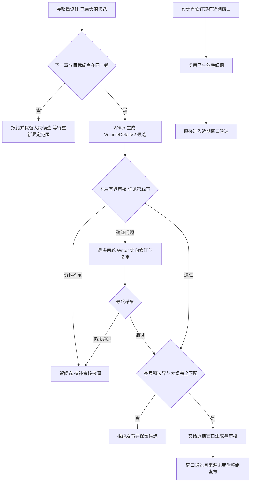

本层有问题时，每一次审核最多做一次定点引文或低分复核；若确有可定位问题，Writer 只获两轮定向修订机会。资料仍不足或第三份候选仍不通过，就保存候选和报告等待处理，不会在同一输入下反复付费调用。各层共享的次数图见第 [19 节](#inkflow-19)。

旧独立细纲入口的行为不同。它通过 Writer 生成不绑定章节号的事件阶段，保存到 `STORY_DETAIL.md`，若明确是第二卷修订，还会尝试按卷标题局部替换旧文件。它会核对生成前后的来源指纹，也把 `OUTLINE.md` 的哈希存为细纲依据，但没有 v2 的逐层审核、候选隔离和整组发布门禁。已有完整三层正式清单时，这一入口会拒绝直接覆盖生效细纲；没有正式清单时，它仍可按自己的旧合同保存文件。对读者而言，“独立细纲文件已保存”与“当前 v2 已审核生效”是两个状态；下一轮要观察界面能否说明所走入口和生效依据。作者若在程序外直接改 `STORY_DETAIL.md`，清单哈希会失配，后续 `load_active_planning` 会拒绝把旧审核当成新文件的放行依据。

卷细纲还存在“内容很长但不能靠堆字”的质量问题。Schema 只检查主体长度与粗略节拍数量，不能保证因果有力。一个五千字文本若每段都是“人物继续调查，发现更多线索”，对近期规划没有可用的行动路径。审核应问每段之后人物所能做的事情是否真的变了：是否形成新的阻力、代价、关系和可执行选择。可用卷细纲让 Writer 知道哪些剧情必须承接、哪些探索点仍可调整，而非逐句命令未来正文。此层留下的可变空间越清楚，后面每章在不违背正史的情况下越能写出自然的行动；细纲越僵硬，近期规划和正文越容易为了守旧卡而改错已发生事实。

卷级展开沿用当前三层规划冻结的偏好来源；题材和本书要求负责限制跨书习惯的适用范围。默认“节奏紧凑”不意味着每卷都必须安排相同冲突，更不能复用旧小说人物经历。当前普通偏好依然由 Writer 按任务判断是否采用，不新增机械文风分数。

**同卷推进后的上层复用。** 若只是近期窗口改动或续开，生效大纲与卷细纲复制到本轮运行目录作来源，不重复生成、也不重新当作未经审核的全书提案。下一章与新终点仍须落在同一卷，并核细纲的卷号与起止范围。新窗口可随着正史向前推进；自动生成下一卷细纲、一次跨多卷发布仍不在这个分支中。请从[第17节](#inkflow-17)的新旧窗口判定追到 [redesign_existing_story](../agent/src/inkflow/planning_pipeline.py#L565) 的 new_window 和 volume 选择。

### 下一轮实施清单

| 当前判断或问题 | 源码依据 | 影响与边界 | 最小修改位置 | 前置依赖 | 后续观察条件 |
|---|---|---|---|---|---|
| 现有保护，保留：完整三层清单存在时旧独立细纲入口拒绝覆盖；外部手改造成哈希失配时拒读 | [engine.py](../agent/src/inkflow/engine.py)、[planning_pipeline.py](../agent/src/inkflow/planning_pipeline.py) | 正式规划不被旧入口绕过审核 | 保留入口阻断和清单核验；如界面误导再补状态提示 | 用真实独立细纲编辑观察 | 用户能分清拒绝旧入口与外部手改后需重核的 v2 层 |
| 代码缺口，按需求改：v2 不自动处理跨卷范围 | [planning_pipeline.py](../agent/src/inkflow/planning_pipeline.py) | 一次跨卷请求停在卷细化前 | 卷选择与分卷调度 | 用户确需单次跨卷规划，定义多卷候选布局 | 各卷依次审核，未受影响上游不重跑 |

**追踪下一站。** 第 [17 节](#inkflow-17) 会把卷级因果转成具体未来章节；若这层修改，回看第 [19 节](#inkflow-19) 的来源哈希与失效边界，再到第 [18 节](#inkflow-18) 看本章如何取用。

[返回章节目录](#contents) · [打开零基础术语词库](#glossary)


<a id="inkflow-17"></a>
## 17. 近期章节规划：未来十章如何具体安排

**先用一句话理解：** 近期规划把未来一段章节安排得足够具体；设置里的默认章数是否真正被执行也要查代码。

**遇到生词先看：** [锚点 / 近期窗口 / PlanBundle](#term-window) · [Schema / Pydantic / 契约](#term-schema) · [草稿 / 候选 / 生效](#term-draft) · [证据 / 引文 / 来源编号](#term-evidence)


### 从卷级方向到可写的窗口

近期章节规划回答“接下来哪些章节发生哪些行动，行动改变了什么”。大纲给全书方向，卷细纲给卷级因果，近期窗口才安排逐章选择、后果、伏笔和收尾。`planning_window_chapters` 默认为10；[_resolve_intent](../agent/src/inkflow/terminal_session.py#L1286)已经在完整三层请求和明确上层规划修订的路由中读取它：用户明确终点优先，其次保留意图里有效终点，都没有才用“最新正史锚点＋设置章数”。不能再说该设置没有入口消费者。这个默认并未统一所有旧流程：旧 `generate_plan` 新书首次仍默认第1～3章，直接调用 `redesign_existing_story` 仍须传 anchor/end，卷内合法性也独立核验。默认十章不是强制把九章请求扩成十章。

v2 链中的近期窗口发生在大纲和当前卷细纲候选都已经通过审核之后。Writer 读取固定的设定、正史摘要、近期完整正文、事实账，再加这两份已审候选，输出 `RollingPlanV2`。其中 `anchor_chapter` 指最后一章已接受正文，`anchor_summary` 只作衔接摘要，`chapters` 只包含从锚点下一章到用户终点的未来章节。本层审核返回后，程序严格核对这一连续编号，既不允许把锚点章重新写一遍，也不允许少一章、多一章或跳章，见 [planning_pipeline.py](../agent/src/inkflow/planning_pipeline.py)。每个未来章节的 [Schema](#term-schema)（规定字段与格式的规则） 正文限制在 200～700 字符，提示词目标约 250～500 字；长度只是结构约束，必须进一步看是否真的有本章的行动和后果。

这一层是三层正式修订链的最后一个候选，不是“近期规划一通过就单独变成新版”。审核通过后还要走第 [19 节](#inkflow-19) 的发布设置、当前来源复核和整组写入。旧窗口里锚点后的未来章节卡在正式发布时退出当前 SQLite 执行范围；已经接受章节的来源卡保留。若只修改现行窗口的一段，未选中章节仍按原规划带入候选，只有整组成功发布才改变当前 Writer 的默认依据。

窗口的审核读取上层方向和正史锚点，不把将来的提案当作已经发生的事实。审核可放过伏笔暂不揭晓、日常收纳动作省略、人物尚未说清的动机；但如果用户明确要求打破反复的“换人问话、回铺整理”，而多数章节仍只做同一件事，没有新选择和代价，模型应判需修订并定位到具体章节。当前代码还有 `_repeated_user_rejected_pattern` 的窄范围确定性检查，会在用户原话明确反对多种重复行动且窗口多数章节仍出现这些模式时要求 Writer 重组；它是特定现象的保护，不应被描述成通用文学质量分类器。对“纸张从台面放回工具箱”等可合理共存的日常动作，审核先做反证核对，防止软建议拖住整个规划。实施见 [planning_pipeline.py](../agent/src/inkflow/planning_pipeline.py) 与同文件的 `generate_and_review`。

| 近期规划字段 | 形成依据 | 审查重点 | 写作时的解释 |
|---|---|---|---|
| 锚点摘要 | 最后已接受正文 | 不得重写已发生事件 | 提供接续状态，不生成替代正文 |
| 场景与人物 | 生效卷方向、人物现状 | 谁有途径到场、知道什么 | 可在正文中有因果地调整 |
| 行动与阻力 | 用户目标和卷级因果 | 是否造成新选择 | 不用机械重复调查动作 |
| 后果与伏笔 | 本卷阶段目标和旧伏笔 | 是否承接且有推进 | 未到期伏笔可暂缓 |
| 钩子与收尾 | 相邻章节连接 | 后章起点是否合理 | 是建议，不是已发生正史 |

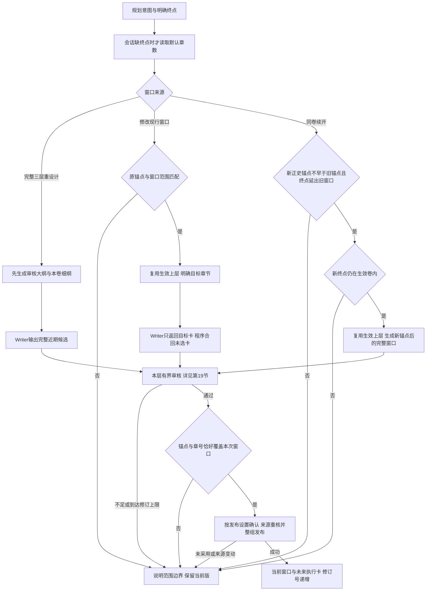

各规划层如果被判为“缺一步交代，可能有矛盾”且符合共存复核条件，审核者还可能在当前尝试内做一次共存反证复核；它只核这条疑点是否真会阻断，不自动多开一位评委。引文不准或通过把握度不足时，本次尝试内还可让同一审核角色定点重核一次；若仍缺依据即待处理。连同 Writer 候选次数，具体上限见第 [19 节](#inkflow-19)。

当前近期规划有两种修改。第一种是定点修改现行窗口：锚点和窗口必须与当前清单匹配，明确章号只能落在未接受范围；局部 Writer 返回目标卡后，程序从生效版合回其他卡。多章“重排”可重组目标段的行动与转折，单章修改不自动扩成整段重排。第二种是同卷续开窗口：锚点仍是最新已接受章且不早于原锚点，终点超过旧窗口末章并位于生效卷细纲之内；这时复用生效大纲和细纲，生成从新锚点下一章到新终点的整个近期窗口，原未来卡只作为“沿用仍有效因果”的要求，并非逐卡锁定。两种都经过窗口审核和正式发布，不能用旧卡绕出窗口。跨卷终点不由这个分支自动拆卷。见 [generate_plan](../agent/src/inkflow/engine.py#L1441) 与 [redesign_existing_story](../agent/src/inkflow/planning_pipeline.py#L565)。

旧路径中，近期规划可能表现为 `PlanBundle.current_arc.chapter_cards`，其章节卡在 SQLite `plans` 中保存并渲染到 `PLAN.md`；若授权范围里缺卡，`ensure_chapter_plan` 会补缺，不覆盖已有卡。v2 已生效窗口可在特定条件下被映射为这套执行视图，无需 Writer 再重写整个卷计划，见 [engine.py](../agent/src/inkflow/engine.py)。所以读者在目录中看到 `RECENT_PLAN.md`、`PLAN.md` 和 `planning/recent` 时，不应把三者看成完全相同的文档。一个是 v2 当前窗口投影，一个是旧正式计划和章节卡，一个是增补记录；本章真正读取哪个，取决于卡片父关联和当前协议。第 [18 节](#inkflow-18) 解释这个转换；第 [19 节](#inkflow-19) 解释何时生效。

近期规划与大纲、卷细纲共享本次有效偏好来源；章节专属要求保留本书范围，不提升为跨书习惯。窗口局部重排的审核资料也补入同一份偏好说明，避免写作和审核使用不同默认。规划来源版本检查与偏好检查一同发生，候选通过不等于正史变化。

### 下一轮实施清单

| 当前判断或问题 | 源码依据 | 影响与边界 | 最小修改位置 | 前置依赖 | 后续观察条件 |
|---|---|---|---|---|---|
| 源码已实现：会话三层规划消费默认章数；旧入口另有默认 | [_resolve_intent](../agent/src/inkflow/terminal_session.py#L1286)、[配置](../agent/src/inkflow/config.py) | 不同入口默认不可混用，明确终点优先 | 如需统一新书规划，先统一产物合同 | 确认使用旧 PlanBundle 还是 v2 三层 | 未指定范围时三层路由使用设置值；旧首次三卡行为单独说明 |
| 现有保护，保留：重复动作识别是少数中文模式的窄规则 | [planning_pipeline.py](../agent/src/inkflow/planning_pipeline.py) | 其他重复靠审核语义判断 | 保留窄检查，不升级为通用文学评分器 | 若有真实漏判再给样本 | 明确拒绝的重复被定位，慢热且有变化的窗口可通过 |
| 源码已实现：同卷续开与现行窗口定点修改分支 | [redesign_existing_story](../agent/src/inkflow/planning_pipeline.py#L565) | 复用上层；新窗口整段生成，局部卡保留其他卡 | new_window与focus_chapters | 最新正史锚点、有效清单和卷边界 | 卡与发布窗口一致；跨卷不自动拆卷；候选未采用不替换当前版 |

**追踪下一站。** 第 [18 节](#inkflow-18) 说明规划怎样供一章使用；第 [20 节](#inkflow-20) 从草稿、审核到接受继续追踪实际正文。

[返回章节目录](#contents) · [打开零基础术语词库](#glossary)


<a id="inkflow-18"></a>
## 18. 章节执行卡：规划如何转换为本章写作任务

**先用一句话理解：** 章节卡像本章任务单，但“已有卡”不一定代表可直接写，还可能需要核对它是否仍然有效。

**遇到生词先看：** [锚点 / 近期窗口 / PlanBundle](#term-window) · [上下文 / Context Packet](#term-context) · [来源指纹](#term-fingerprint) · [缓存 / 命中 / 稳定前缀](#term-cache)


### 执行卡是本章的可核对任务单

近期规划能说明未来若干章的方向，但 Writer 写某一章时仍要知道本章视角、场景、目标字数、行动、阻力、选择、结果和上一章留下的状态。`ChapterCard` 在 [schemas.py](../agent/src/inkflow/schemas.py) 中定义这些字段，数据库以章节编号保存卡片并用父键关联它所属的篇章或补充计划。正文 Context Builder 不随便拿最后一次打开的窗口，它从本章卡的父关联追溯到对应 `PlanBundle`，若引用的篇章、卷或卡片不存在就报错，见 [context.py](../agent/src/inkflow/context.py)。这一步很关键：第十六章不能因为用户刚打开第二十章规划，就误用另一个篇章的目标和人物状态。

生成或恢复卡片有多种情况。入口先加载并校验 v2 生效清单；若清单与可见规划文件的哈希不符，会先停下核对。若本章卡已存在，`ensure_chapter_plan` 不直接跳去写正文，而是调用 `_check_existing_plan_window`：[来源指纹](#term-fingerprint)（整组依据的版本校验）命中既有连续性结果时零模型调用，否则可能进入 `replan_pending` 和连续性审核，只有无硬冲突才继续，必要时还会修订未接受卡。若卡片查找记录丢失但权威计划仍保存同一张卡，代码优先恢复原卡。正常正式发布已把 v2 三层方向投影为当前数据库执行卡；旧项目只有生效文件、数据库尚未同步时，`ensure_chapter_plan` 先作零模型投影同步。仍有缺卡且目标章在窗口内时，兼容分支可把 v2 章节方向绑定为轻量执行视图：标题和 `function` 来自 `RollingChapterV2`，多个其他字段使用通用文案，并以 `v2:trace_id:范围` 关联补充计划；这一特定绑定分支返回 `model_calls: 0`，见 [engine.py](../agent/src/inkflow/engine.py)。已有正史而旧 `PlanBundle` 缺失时，后备路径会拒绝凭空重建基础计划，不会自动调用 Writer 补出完整计划。

版本核对要分成两次：正式发布替换的是**未接受未来章节的当前卡**，并保留旧数据库快照；写章时读取的是这次发布后的当前卡与正史，而不是历史目录里的旧卡。若旧项目已有有效 `active-v2.json` 却没有对应 SQLite 投影，补投影只是修复两处视图，不构成新的作品规划决定，因此不让 `revision_no` 增加。旧版快照如果还承担已接受章节的恢复依赖，清理预览会标为阻止删除；参见[第19节的处置表](#inkflow-19)和[第31节的恢复边界](#inkflow-31)。

补卡路径也受授权范围限制。它只针对指定连续缺口，按卷边界切片，不能跨过还没有进入正史的前章，也不能用旧版卡片凭空延伸到 v2 当前窗口以外。Writer 从已接受正文、设定、卷罗盘、相邻卡、事实和伏笔中生成指定范围卡片，连续性检查以后，在短事务里验证这些章节尚无正文和同名卡，再写入 SQLite 与 `planning/recent`。任何一卡已有内容，就要停下核对，不以“自动补齐”覆盖用户改稿。写锁放在数据写回阶段；远端请求期间保存来源指纹，回来后检查设定、正史、规划和卡片是否变化。这条链同时解释了“为什么模型有时补卡”“为什么另一次直接继续写章，显示模型调用 0 次”。

| 卡片来源 | 创建条件 | 数据写入 | 对 Writer 的意义 |
|---|---|---|---|
| 旧正式计划 | 新书或旧四级规划生成 | SQLite `plans`、`PLAN.md` | 有完整章节任务字段 |
| v2 近期规划绑定 | 生效窗口、缺卡连续且有适配前提 | SQLite `supplement` 与 `chapter` | 复用已审方向，通用字段仍需正史约束 |
| 增补卡 | 已授权范围内的空缺 | SQLite 与 `planning/recent` | 只补缺口，原卡保留 |
| 原卡恢复 | 原权威篇章内仍有卡但索引缺失 | 重建缺失记录 | 不生成另一个目标 |

```mermaid
flowchart TD
  T[准备写第N章] --> A{生效v2清单存在}
  A -->|存在但哈希失配| STOP[保留正文与规划 说明缺口]
  A -->|有效| SYNC[必要时零模型同步数据库投影 不递增修订号]
  A -->|不存在| CARD{本章卡是否存在}
  SYNC --> CARD
  CARD -->|是| CHECK[按来源指纹核已有卡连续性]
  CHECK -->|已核或核后成立| READ[按父键读取本章计划与卡]
  CHECK -->|硬问题未解或资料不足| STOP
  CARD -->|否| RESTORE{原权威计划仍有该卡}
  RESTORE -->|是| OLD[恢复索引并核来源]
  OLD --> READ
  RESTORE -->|否| V2{有效v2窗口可映射目标卡}
  V2 -->|是| BIND[复用已审方向映射执行视图]
  BIND --> READ
  V2 -->|否| BASE{旧基础计划存在}
  BASE -->|否且已有正史| STOP
  BASE -->|否且为新书起点| INIT[授权后生成基础PlanBundle]
  INIT --> READ
  BASE -->|是| AUTH{空缺范围与卷边界允许补卡}
  AUTH -->|否| STOP
  AUTH -->|是| FILL[Writer补指定缺卡并核连续性]
  FILL -->|不成立或来源变动| STOP
  FILL -->|成立且无同名正文或卡| SAVE[短事务登记卡和来源]
  SAVE --> READ
  READ --> CONTEXT[本章卡加正史与当前要求构建输入]
```

执行卡是约束本章写作的工作资料，但未接受之前仍是未来假设。比如卡片写“主角拿到线索”，Writer 不能让人物毫无途径得到线索；人物可经行动、对话或代价改变实现方式，只要最终因果与用户硬要求相容。已接受正文若发生了原卡未预料的变化，下一章要先重新核对卡片是否仍有效，而不是强迫正文服从旧卡。`write_chapter` 先调用 `ensure_chapter_plan`，然后核对当前章没有已接受版本，再从本章卡构建上下文，并冻结 Writer 来源指纹，见 [engine.py](../agent/src/inkflow/engine.py)。没有卡时 `ContextBuilder.build` 直接拒绝继续。这条门禁把规划和写作接上，但不把计划当正史。

v2 适配的代价也需要直说。它把每章约几百字规划放进卡片的 `function`，其余多个字段使用“按正史推进”“由人物行动决定”之类通用文案。这样避免重复模型调用，节省成本，却比旧完整章节卡少了可执行的场景拆解。是否影响 Writer 实际成稿，要在一次真实章节流程中观察：[Context Packet](#term-context)（本次交给模型的资料包） 是否仍包含 v2 上游细纲和近期规划、正文是否准确承接前章、Editor 是否能指出缺因果。只从代码看，这条适配是已实现的；“它足以稳定替代详细卡”仍属待验证效果，不能提前宣称。

**卡变了才新增修订标记。** [save_plan_bundle](../agent/src/inkflow/database.py#L426)发布前先读取原章节卡，替换未来执行视图后逐卡比较完整 JSON。卡内容与旧卡相同则跳过新增 pending_plan_revision；实际改变且已有 draft 的卡才标 needs_writer，保存草稿版本、哈希、新卡哈希和定向修订要求。这里比较的是卡内容，不是只看新的 arc_id。已有待处理标记不会因“这次没改卡”被自动清空，整组规划来源变化也仍可能让旧审核失效。因此避免无改动章节被机械重修，并不表示所有旧报告都可无条件复用。

### 下一轮实施清单

| 当前判断或问题 | 源码依据 | 影响与边界 | 最小修改位置 | 前置依赖 | 后续观察条件 |
|---|---|---|---|---|---|
| 待核影响，先复现：v2 轻量卡多个字段由通用文案填充 | [engine.py](../agent/src/inkflow/engine.py) | 本章动作粒度可能不足 | 有具体成稿问题再改卡片投影 | 先核 Context Packet 实际输入 | 一次真实写章能追到具体行动、因果和来源 |
| 现有保护，保留：已有正史且旧 `PlanBundle` 缺失时拒绝重建 | [engine.py](../agent/src/inkflow/engine.py) | 写作停在缺依据处 | 保留拒绝，给出恢复原计划入口 | 确认项目原始计划记录 | 不凭空编卡，也不额外付费重生整套计划 |
| 源码已实现：发布时内容相同的卡不新增草稿修订标记 | [save_plan_bundle](../agent/src/inkflow/database.py#L426) | 避免仅因新arc标识而重修未改卡；其他来源仍须核 | 发布事务的previous_cards比较 | 完整卡JSON、当前草稿与既有待修标记 | 实际改卡才标needs_writer；不清除旧待修或放行来源失效报告 |

**追踪下一站。** 第 [19 节](#inkflow-19) 说明哪份规划算生效；第 [20 节](#inkflow-20) 从卡片继续进入正文草稿和接受，必要时回第 [30 节](#inkflow-30) 核对 Writer 看到了哪些依据。

[返回章节目录](#contents) · [打开零基础术语词库](#glossary)


<a id="inkflow-19"></a>
## 19. 规划审核与生效：候选方案如何成为当前依据

**先用一句话理解：** 模型刚给出的规划只是候选；这一节追踪它如何审核、怎样成为当前依据，以及失败后留下什么。

**遇到生词先看：** [草稿 / 候选 / 生效](#term-draft) · [快照](#term-snapshot) · [投影 / 同步 / 事务日志](#term-projection) · [失效 / stale / invalidated](#term-stale)


### 规划通过与正文接受是两件事

规划候选描述未来怎么写，正史正文记录过去已经写成且作者接受了什么。两者可以有先后依赖，却不能共享同一个“已通过”标记。面向已有正史的 v2 完整重设计在 [planning_pipeline.py](../agent/src/inkflow/planning_pipeline.py) 为大纲、卷细纲和近期窗口分别保存候选 JSON 与审核 JSON，并在本层通过后继续下一层。若用户仅定点修订现行近期窗口，则读取已经生效的大纲和卷细纲，本轮复制其候选 JSON 作来源，不重新调用 Writer 或审核者处理这两个上游层；只对被改的近期窗口生成和审核。每份新审核 `PlanningReviewV2` 包含 `pass`、`revise`、`insufficient_context` 三种 verdict、把握度、解释、引文和修订指令，见 [schemas.py](../agent/src/inkflow/schemas.py)。规划审核看方向性：能否衔接已接受正文、是否延续主线与卷级因果、用户明确要求是否落实。它不能把未写的每句对话、日常动作和所有伏笔细节提前定死；正文阶段还有自己的独立审查与记忆门禁。

当前自动通过至少要 `pass`、把握度达到用户设置且不低于 80%，并有一条能够在候选和外部来源中逐字定位的依据。对于 `revise`，大纲、卷细纲和近期规划各层都可以引用同一候选内部两处原句证明互斥；但 `pass` 不能只拿候选自己证明自己。程序会过滤无法定位的附加引文，必要时给当前审核角色一次定点引文修复。若审核报告仍缺证据或仅把握度低，候选保留、Writer 不因审核写错引文而改稿。若确有硬问题，Writer 在有限轮数内按已定位句子定向修本层。对于未来规划中“没有写出某一步所以可能矛盾”的指控，当前代码还会让同一审核角色核对两事是否可能共存，防止普通留白被当作关键硬冲突，见 [planning_pipeline.py](../agent/src/inkflow/planning_pipeline.py)。这一审查机制有一定自动保护，但逐字定位不证明语义正确，仍需把已证实与待核问题分开。

本轮需要审核的层都通过、复用的上游层仍有效后，程序先比较候选与当前三层的哈希：内容完全相同就返回 `unchanged`，不制造空版本。若设置 `planning_publication_mode=confirm_after_review`，本轮停在已审核候选，并通过[统一提问卡](../agent/src/inkflow/terminal_session.py)问用户是否正式采用；选择“暂不采用”不改当前版。选择采用时，引擎核对候选运行编号、审核产物、已接受正文和现行文件来源，复用已完成审核，零模型调用发布。自动模式则在审核完成后进入相同发布门禁。这一设置与正文的 `acceptance_confirmation_mode` 独立，不能把“正文自动接受”误当成“规划自动发布”。

发布在短写锁内核对已接受正文数量及哈希、`BOOK.md` 与 `STATE.md` 的来源状态，以及原 `OUTLINE.md`、`STORY_DETAIL.md`、`RECENT_PLAN.md` 是否在生成期间被作者改掉。随后保存旧文件与数据库规划快照，写三层 Markdown 和必要的书籍规模信息，从已审结构投影当前 SQLite `PlanBundle` 与锚点后的未来章节卡，最后写 `planning/active-v2.json`。旧未来卡从当前执行范围退出；已接受章节的来源卡仍保留。manifest 记录数据协议号 `protocol_version=2`、正式修订号 `revision_no`、前版 run、正史锚点、卷号、窗口、内容与来源哈希。正式修订号只从上一生效清单加一；v2 并非只能有“第二版”，作品可在同一数据协议下连续发布第 3、4 版。未通过、等待确认、来源失配、写入回滚和旧项目卡片投影同步均不加号。manifest 最后写，缺失或哈希不符时半套 Markdown 不应被当成生效。代码能在**进程仍在运行的写入异常**里尝试恢复旧文件、SQLite 规划行与 Brief；若进程突然退出，文件和数据库并非一个跨介质原子事务，重开时仍需核对清单和投影，不能宣称崩溃恢复已验证。具体见[发布管线](../agent/src/inkflow/planning_pipeline.py)、[数据库投影](../agent/src/inkflow/database.py)及第 [31 节](#inkflow-31)。

新正式版生效后，被替换旧版进入 `planning/history/` 的 `pending` 记录。会话层再用提问卡问“保留到历史”还是“查看删除清单”。保留会写成 `kept`，以后只在用户明确指令下按修订号与部分读取；查看清单只返回路径、哈希、引用、阻止原因和删除影响，不构成删除授权。若用户仍要删，项目中心须让其逐项选择并再次确认，`cleanup_apply` 重新比对确认 token、路径和哈希；有当前引用或已接受章节恢复依赖的快照禁止删除。删除后旧版无法再作为恢复、参考或融合素材，所以目前界面执行的是永久删除，不能描述为已经进入可恢复回收区。旧版若已选择保留，用户明确要求恢复且正史锚点和来源仍一致时，恢复会成为**新的**正式修订号；来源已变化则拒绝直接恢复。参考或融合则只能把用户指定的旧版部分当作非正史素材，重新走 Writer、审核、发布。详见[清理实现](../agent/src/inkflow/planning_cleanup.py)、[历史读取](../agent/src/inkflow/planning_history.py)和[第4节的用户入口](#inkflow-04)。

| 状态 | 资料在哪里 | 可以做什么 | 不能做什么 |
|---|---|---|---|
| Writer 候选 | `.inkflow/runs/.../*-candidate.json` | 接受审核或定向修订 | 自动替换生效依据 |
| 审核不足 | 同运行目录的 review 与 trace | 补读、核引文、等待来源 | 让 Writer 为误读改稿 |
| 本轮需审层通过、复用上游仍有效 | 同次运行的候选与审核记录或已生效上游 | 按发布设置自动发布或提问等待采用 | 视为已发生剧情 |
| 待人工采用 | 运行目录候选、审核与 `pending_planning_publication` | 用户确认后零模型复核发布，或暂时保留 | 预先递增正式修订号 |
| v2 正式生效 | 可见三层 Markdown、`active-v2.json` 与当前 SQLite 未来卡 | 作为唯一自动规划依据，修订号加一 | 覆盖已接受正文 |
| 被替换旧版待选择 | `planning/history` 的 `pending` 记录 | 提问选择保留或预览删除 | 自动注入 Writer 输入或未经确认删除 |
| 旧版已保留 | `planning/history` 的 `kept` 记录 | 明确指定版本与部分后查看、参考或恢复 | 隐式回退当前生效版 |

```mermaid
flowchart TD
  A[用户授权规划任务] --> K{本轮范围}
  K -->|完整重设计| O[生成或续接大纲候选并审核]
  O -->|不足或达限| HOLD[保留候选与具体失败层 当前版不变]
  O -->|通过| OB{新生成大纲首卷与锚点匹配}
  OB -->|否| HOLD
  OB -->|是| VB{下一章与终点在同一卷}
  VB -->|否| HOLD
  VB -->|是| D[生成或续接该卷细纲并审核]
  D -->|不足或达限| HOLD
  D -->|通过| DB{卷号与边界等于大纲}
  DB -->|否| HOLD
  DB -->|是| W[生成或续接近期窗口并审核]
  K -->|定点修改或同卷续开| F{满足第17节对应范围条件}
  F -->|否| HOLD
  F -->|是| RE[复制生效大纲与细纲 不重新调用模型]
  RE --> W
  W -->|不足或达限| HOLD
  W -->|通过| WB{锚点与未来章号精确覆盖}
  WB -->|否| HOLD
  WB -->|是| SAME{三层内容与当前正式版完全相同}
  SAME -->|是| UN[unchanged 不递增修订号]
  SAME -->|否| MODE{规划发布设置}
  MODE -->|确认后发布| ASK[保存候选与产物哈希 提问采用或暂不采用]
  ASK -->|暂不采用| WAIT[保留候选 当前正式版不变]
  ASK -->|采用| CHECK[核待发布运行 产物哈希与来源 复用审核]
  MODE -->|审核后自动| CHECK
  CHECK -->|已变化| HOLD
  CHECK -->|有效| LOCK[取得短写锁再核正史 偏好与原规划]
  LOCK -->|冲突| HOLD
  LOCK -->|成立| WRITE[留旧版 写三层文件与数据库未来卡]
  WRITE -->|进程内异常| ROLLBACK[尝试恢复原文件与数据库状态]
  WRITE -->|突然退出| CRASH[重开核清单与投影 半套不算有效发布]
  WRITE -->|成功| ACTIVE[最后写active-v2清单 正式修订号加一]
  ACTIVE --> OLD{产生被替换历史副本}
  OLD -->|否| DONE[发布完成]
  OLD -->|是| Q[另问保留历史或查看删除清单]
  Q -->|保留| KEEP[标kept 仅显式版本及部分读取]
  Q -->|查看清单| PREVIEW[列对象 引用与影响 不删除]
  PREVIEW --> CONF{逐项选择且再次确认 来源与依赖允许}
  CONF -->|否| PRESERVE[保留副本与必要依赖]
  CONF -->|是| DELETE[按专用流程永久删除选中副本]
```

上图把每层审核压成一个节点，真实次数上限如下。`generate_and_review` 对每层最多处理三份候选：第一份初稿，加至多两轮 Writer 定向修订。每份候选先经 Provider 的 Pydantic 类型检查，再由当前审核角色审查；本次审核若缺逐字引文或通过把握度不足，可由同一审核角色定点复核一次。任一规划层遇到符合当前关键词条件、且依据可定位的 `revise`，还可能由同一角色做一次共存反证复核。`insufficient_context` 或复核后仍缺证据会保留候选并待处理，不消耗 Writer 修订来“修”审核报告。下一图的第二、第三次审核各自仍受相同的一次引文复核与一次可适用的共存复核上限约束，绝无无限返回第一轮的箭头。流程依据 [planning_pipeline.py](../agent/src/inkflow/planning_pipeline.py) 至 [planning_pipeline.py](../agent/src/inkflow/planning_pipeline.py)。

```mermaid
flowchart TD
  C1[Writer 初稿 第 1 份候选] --> R1{第 1 次审核}
  R1 -->|通过且证据有效 达阈值| S[本层通过]
  R1 -->|资料不足或引用复核仍失败| H[留候选 待处理]
  R1 -->|有证据需修| W2[Writer 第 1 轮定向修订 第 2 份候选]
  W2 --> R2{第 2 次审核}
  R2 -->|通过且证据有效 达阈值| S
  R2 -->|资料不足或引用复核仍失败| H
  R2 -->|有证据需修| W3[Writer 第 2 轮定向修订 第 3 份候选]
  W3 --> R3{第 3 次审核}
  R3 -->|通过且证据有效 达阈值| S
  R3 -->|仍需修或依据不足| H
  X[每次审核内部 引文或低分至多复核 1 次] -.-> R1
  X -.-> R2
  X -.-> R3
  Y[各层符合条件的疑点 可做 1 次共存反证] -.-> R1
  Y -.-> R2
  Y -.-> R3
```

通过审核之后仍有程序性的范围校验，不能把“JSON 字段类型正确”或“审核报告通过”直接画成发布。新生成 v2 大纲审核返回后，程序才核第一卷终点等于已接受锚点；复用生效大纲的窗口分支跳过这一首卷限制、当前目标终点落在所选卷；卷细纲审核返回后，才比对卷号与起止章的三元组；近期窗口审核返回后，才核锚点与未来章号恰好覆盖本次范围。任一不符都不发布本轮候选，见 [planning_pipeline.py](../agent/src/inkflow/planning_pipeline.py) 至 [planning_pipeline.py](../agent/src/inkflow/planning_pipeline.py)。这些程序检查与上面的有界语义审核分工不同。

读取生效版本也不是只看文件修改时间。`load_active_planning` 读取 manifest，要求状态为 active，来源 run id 合法；同时核 `OUTLINE.md`、`STORY_DETAIL.md`、`RECENT_PLAN.md` 的哈希，重新解析来源 JSON 并核章节窗口、卷号与渲染后的哈希。正常读取、单层近期窗口修改及同卷续开仍严格拒绝失配，用 `PlanningNeedsAttention` 保留现有文件与具体原因。只有作者明确授权整条重新规划，才允许 `allow_document_edits` 处理手工文件变化：它返回“目前没有可复用的生效链”，不把改过的 Markdown 或旧候选 JSON 当作当前版；手动文本作为带精确哈希的**非生效来源候选**进入新的完整审核链。候选丢失或结构错误也不会借这个标记自动修复。`_cleanup_suggestions` 只列旧独立大纲候选；旧正式修订的文件与数据库快照另由 `planning/history` 记录并通过 `cleanup_preview` 列出。二者都不能因“过期”直接删除。第 [31 节](#inkflow-31) 再讨论正史与 Markdown 同步，第 [33 节](#inkflow-33) 讨论中断续接。

**手动修改后的正式衔接。** 本次完整管线冻结 `BOOK.md`、`PLAN.md`、三层可见规划与 `planning/active-v2.json` 六项初始指纹，发布前逐项复查；可持续设定、正史锚点和早期伏笔依据另在整组来源指纹中检查。标准格式的用户 `BOOK.md` 经唯一字段、规模格式及 `BookBrief` 校验后用于新规划，不能悄悄拿数据库旧简报覆盖作者新输入。正式三层发布成功后，`reconcile_planning` 只解除精确采用了本次手动版本、没有未决问题的 pending 或 planning_gap 任务，并保留原核对报告与解决它的规划运行编号；正在核对、被拒绝、被新版替代或来源失配的任务不会被顺带清除。普通人工相容性 `pass` 对结构改变的 `PLAN.md`、`RECENT_PLAN.md` 以及 v2 大纲/细纲不能直接更新旧卡，仍要走本节正式发布。新旧规划的关系因此能沿“手动候选 → 审核报告 → 新正式修订 → 未来执行卡”追踪，具体入口见[第23节](#manual-edit-lifecycle)。这些接线尚未运行真实规划验证。

与这一 v2 链并存的独立章节范围大纲、独立细纲和新书 `generate_plan` 不走同一个 `active-v2.json` 发布合同。这种并存是当前实现的能力边界，本身不是已经复现的数据错误。已有完整三层正式清单时，旧独立大纲/细纲入口拒绝直接改动生效的一层；完整窗口的近期重排转入三层正式修订链。若作者在程序外手改 `OUTLINE.md`，v2 manifest 会因哈希失配停止读取，以免无审核的新文字冒充当前版。需要进一步观察的是作者能否从界面看懂失配原因并从正确层续接。若下一轮确需统一新书与已有书的规划协议，应先明确各入口的候选、确认、审核和生效状态，再迁移读取路径与章节卡；不能只把旧文件标题改成“三层规划”而保留旧 Schema。当前代码具备 v2 候选、审核、整组发布、提问选择和显式历史入口，但尚未做本次真实项目观察，也不保证崩溃后自动恢复。

**两套连续性审核请分开追。** 本节的三层管线使用 PlanningReviewV2。旧执行卡的连续性核验在 [_check_plan_continuity](../agent/src/inkflow/engine.py#L1133)，使用 ReviewReport，过滤能在候选与正史或卡内定位的硬问题后，再以 ReviewClaimDecisionBatch 逐条核语义；supported 才交Writer修卡，uncertain或缺决定保留旧卡并暂停。此前“补两条相近引文就制造硬冲突”的 reanchor 路径已移除。三层审核的引文重核用 difflib 只找相近原句供审核者复制，最终仍须逐字包含，不能把模糊匹配当证据成立。

### 下一轮实施清单

| 当前判断或问题 | 源码依据 | 影响与边界 | 最小修改位置 | 前置依赖 | 后续观察条件 |
|---|---|---|---|---|---|
| 现有保护，保留：各规划入口协议不同且 v2 清单核文件哈希 | [engine.py](../agent/src/inkflow/engine.py)、[planning_pipeline.py](../agent/src/inkflow/planning_pipeline.py) | 改文件后依赖暂停 | 保留拒读；有误导再改状态提示 | 先观察一个真实编辑流程 | 说明来源协议、有效版本和定点续接条件 |
| 0.7.2 源码已改；发布验证范围见顶部：手工规划可作为候选进入完整重新发布 | [load_active_planning / 正式发布](../agent/src/inkflow/planning_pipeline.py)、[reconcile_planning](../agent/src/inkflow/manual_edits.py) | 正常读取和单窗口仍拒失配，显式整链重规划才接手动来源 | 保留严格默认；正式发布按精确来源解除对应缺口 | 同版六项文件指纹、已审三层及正史锚点 | 新正式版可追到手动版本，旧卡不被 helper pass 偷换，原问题报告保留 |
| 待核影响，先复现：跨进程崩溃留下半发布时怎样恢复 | [planning_pipeline.py](../agent/src/inkflow/planning_pipeline.py) | 半套文件可能需人工核对 | 观察后定位启动恢复或规划读取入口 | 获得可复现中断点 | 中断后不误读半套规划，旧版与候选可定位 |
| 源码已接通、未做真实观察：审核后采用与旧版处置使用提问卡 | [terminal_session.py](../agent/src/inkflow/terminal_session.py)、[App.tsx](../desktop/src/App.tsx) | 用户能明确作两次不同选择 | 后续仅在真实入口发现问题时修正 | 一次已有正文的三层修订 | 采用前修订号不变；正式生效后单独问保留或查看删除清单，删除仍需再次确认 |
| 源码已实现：规划内部矛盾与共存核对不限近期层 | [planning_pipeline.py](../agent/src/inkflow/planning_pipeline.py) | revise可引本候选两处；pass须独立来源 | generate_and_review证据及共存条件 | 定位原句、用户要求和同源候选 | 审核措辞误读只重核审核，互斥事实才定向修本层 |

**追踪下一站。** 三层生效后，顺着第 [18 节](#inkflow-18) 的章节执行卡进入第 [20 节](#inkflow-20) 的正文生命周期；如果任务在审核或发布时停住，用第 [33 节](#inkflow-33) 的状态与恢复方法定位失败节点。

**未来说明与正式规划分开。** 某章 future 条目“先查寄件人再回到失踪案”可辅助核对钩子，主线和卷级因果仍按正式规划。说明被认为可行也没有递增规划修订号、替换执行卡或授权读旧规划。正式主线调整须回到本节的候选、审核、整组发布流程，已接受正文仍是衔接锚点。

[返回章节目录](#contents) · [打开零基础术语词库](#glossary)


<a id="inkflow-20"></a>
## 20. 一章正文的生命周期：从草稿到已接受正文

**先用一句话理解：** 一章从草稿到正式接受会经历多种状态；每次修改都要保证审核与保存的仍是同一版文字。

本次在原生命周期外增加手动改稿检测，而非改成“所有文件变化都自动接受”。未接受草稿哈希变化会形成新版本并触发同模式审查；已接受正文的改稿保持独立候选，数据库原文不动。Writer 同次设定提案随版本说明保存，章通过并接受后再写参考合集；只有被记忆所有者明确认可的序号可复用同版说明报告标记已核参考，其余 Writer 条目继续待核，两者都不进入事实表。授权引擎流程写入新文件时，旧已应用手动候选若哈希不同标为 superseded，不把它改成 pass；正式三层发布先按精确来源解决对应规划缺口，再登记新文件基线，原意见不被擦除。设定和来源改动加入整组指纹，旧报告无法因正文恰好未变就继续授权新依据。完整人工分支在[第23节](#manual-edit-lifecycle)，接受后参考交接在[第31节](#inkflow-31)，本次未执行生命周期验证。

**遇到生词先看：** [状态 / 状态机](#term-state) · [草稿 / 候选 / 生效](#term-draft) · [正史 / 已接受正文](#term-canon) · [版本 / revision / 分支](#term-version)


**阅读位置。**[上游：规划审核与生效](#inkflow-19)决定 Writer 能依据哪一版章节卡写作；本节说明这张卡如何变成正文，并把审查、记忆和提交串成一条有版本边界的链。[下游：正文审查](#inkflow-21)细拆中间的判断，[正史提交](#inkflow-31)细拆落盘与恢复。这里的“接受”是项目状态变化，不等同于作者一定喜欢该章，也不能由模型一句“完成”替代。

```mermaid
flowchart TD
  P[有效章节卡 正史与当前要求] --> W[Writer生成或定向修订]
  W --> S{写回时来源与目标仍有效}
  S -->|否| STALE[保留候选 不覆盖]
  S -->|是| D[草稿文件 版本与哈希]
  D --> A{任务包含审查}
  A -->|否| KEEP[保留草稿 等后续授权]
  A -->|是| R[按模式审核并交接记忆候选]
  R --> V{引擎最终报告}
  V -->|unknown| U[同版有界补审 仍不足则保留断点]
  V -->|patch| B{定向修订已授权且轮次预算可用}
  B -->|否| KEEP
  B -->|是| W
  V -->|pass| AUTH{本次允许接受}
  AUTH -->|否| KEEP
  AUTH -->|是| CONT{第1至N减1章全部已接受}
  CONT -->|否| ORDER[拒绝越章 草稿与临时记忆不算正史前章]
  CONT -->|是| G[短锁重核审核ID 版本 来源与记忆]
  G -->|不成立| KEEP
  G -->|成立| TX[接受数据库事务与可恢复文件提交]
  TX --> ACCEPTED[已接受正文与事实 成为后章正史依据]
```

一章的起点是生效的全书方向、所属卷细纲、近期规划和本章执行卡。Writer 读取的不只是卡片文本，还包括已接受前章、人物事实、开放伏笔、用户当前要求和适用的表达偏好。`ContextBuilder.build`按章节边界取 `facts_as_of(chapter_no - 1)` 和 `threads_as_of(chapter_no - 1)`，这避免把本章之后才出现的状态喂给写作者。上下文包也有最近正文和检索片段；`_writer_source_fingerprint`用于辨认写作来源是否被改动。因此“写第十六章”需要先确定第十五章是否已接受、当前章节卡究竟是哪一版。规划只是写作依据，未写成正文的未来事件尚未进入正史。

Writer 生成的正文首先进入草稿态。`ProjectDatabase.upsert_draft`给同章草稿递增版本并记录文件哈希；若该章已经接受，普通草稿写入会被拒绝，已接受修补走专门路径。草稿文件和数据库行之间的哈希意味着“文件内容被外部编辑过”是可以检测的：一旦文件与记录不一致，后续审查或接受不能假装仍在处理旧版。一个模型请求成功只说明产生候选文本，标题、字数、段落、用户硬要求和小说内因果仍需后续处理。若用户只是试写一段或保留分支，候选应停留在未接受范围；不得为了让流程看似完成而自动推进整章正史。

审查阶段按被冻结的任务模式决定责任人：日常的正文与记忆均归 Editor；审查加强由 Editor 综合审核及整理记忆、Reviewer 补逻辑连续性；记忆加强由 Editor 完整审正文、Memory Keeper 整理候选；全专项由 Editor 审表达、Reviewer 审逻辑连续性、Memory Keeper 整理候选。记忆加强不额外调用 Reviewer，也不省略 Editor 的完整检查。历史任务按[第10节](#inkflow-10)恢复原分工，不能途中换角色。旧协议日志里的 `reviewer` 对应旧综合编辑语义，不能据字段名推断已调用新专项 Reviewer。程序把审查报告和 `chapter_version` 绑定；`latest_review_record`提供最近一次报告，接受前要求报告对应当前草稿版本。审查可以给出通过、需修订、依据不足：前者仍需引擎门禁；第二种应依据定位到的硬问题或明确修改目标定向修；第三种优先补资料、核对证据，不能让 Writer 凭空补写曾经存在的事实。

修订会产生新的正文版本，旧报告由此失去放行效力。`review_and_repair`一类恢复循环允许有限轮次修订与证据复核，避免无限来回；`revise_chapter`对正在审查的草稿和规划指纹做核对。Writer 收到的是当前文本、审核定位的原因与受限修改范围，不应把审美分歧改造成主线重写。用户编辑草稿也是新来源，必须把审查结论重新绑定新版本。必要审查未完成或硬问题未解决时，不生成依赖该章的后续正文；独立的只读查看或语音任务则可以继续。

单独的草稿或审查请求即使得到通过结论，也只形成合格草稿；只有本次任务确有接受正文的授权，引擎才可进入正史提交。自动修订轮次和已启用的调用、token 预算一旦用尽，流程保留当前草稿和失败节点，等待在原任务范围内续做，不能靠重新起任务重置限制。

通过之后还有一段容易被忽略的交接。记忆角色或日常 Editor 提交 `MemoryPatch` 候选，里面有章节摘要、事实变更和线索变更。引擎核对候选中的事实证据确实能在本版正文中定位、事实作用章节合法、冲突已处理；Memory Keeper 并无直接写入正史的权限。`accept_chapter`在接受前还检查章节状态、规划修订待处理情况、报告版本、评分契约、证据化符合度门槛、正文哈希、章节卡、格式硬问题、来源对照和上下文指纹。其后在项目写锁内重核指纹与报告 ID，再让数据库接受正文和记忆，并完成 Markdown 投影。提交后记录学习事件和检查点，供恢复与统计使用；这些后续记录失败会给出警告，不能把已提交正文误报成未提交。

| 产物 | 生命周期中的位置 | 可否作后章正史依据 | 关键绑定 |
|---|---|---|---|
| 章节卡 | 写前的生效规划 | 仅为目标与约束 | 规划版本、章节范围 |
| 草稿正文 | Writer 输出及修订 | 否；同批临时上下文需显式标记 | 章节版本、文件哈希 |
| 审查报告 | 针对特定草稿 | 否；只是放行依据 | 草稿版本、来源与评分契约 |
| 记忆候选 | 审查后的提案 | 否 | 正文证据、章节范围 |
| 已接受正文 | 引擎完成提交 | 是 | 数据库状态、正文、投影与检查点 |

**正文与说明一起绑定。** 同次创作说明是草稿附件，仅纠正说明不创建虚假正文版本或重新生成整章。报告保存所读说明指纹；`current_pass_review`、实际接受和工作区 `can_accept` 一同核对。即使正文版本没变，附件被替换后旧报告也不能继续显示可接受。授权接受后才提供对应通过报告绑定的有效说明，原说明和纠正保留；这不是第二份正文正史。权限沿[第31节](#inkflow-31)追踪。

**问题与边界。** 源码已有版本检查、实际模式调度与接受事务；不能再依据旧架构目标把已接通的专项调用写成尚未实施。当前运行输出是 ModeCheckOutput，独立角色结果类未接入，具体界面与模型效果仍未在本次观察。此外，草稿批次可在临时记忆支持下跨未接受前章生成，而正式接受必须连续：引擎和数据库均要求第N章之前第1～N−1章全部已接受。已审临时前章不满足这个正史提交条件。用户评价“刚才这版”指当前版本，已有后续正史的旧章也不能套用最新章局部修订入口。源码入口见 [accept_chapter](../agent/src/inkflow/engine.py#L5114)、[accept_chapter](../agent/src/inkflow/database.py#L1294) 与[第23节](#inkflow-23)。

接受正文时，扩展的多证据和记忆操作与既有补丁一起提交。证据定位失败、目标事实过期或撤销缺少当前章反证，会使事务失败，不能只写入半份正文与记忆。新章状态变化使用独立事实 ID，避免复用旧 ID 使历史消失。草稿和临时补丁仍不直接更新正史。

**接受顺序新增双层保护。** 第N章接受前，引擎要求已接受前章集合恰好包含1～N−1；数据库 BEGIN IMMEDIATE 内再次要求前面已接受章数为N−1。草稿、临时补丁或高分报告都不能代替前章正史。两层检查分别阻止普通入口与直接数据库调用越章；已经发生的旧误接受则由[第33节](#inkflow-33)受限恢复处理，不能以修复能力为理由绕过提交顺序。

**下一轮实施清单。**

| 当前判断或问题 | 源码依据 | 影响与边界 | 最小修改位置 | 前置依赖 | 后续观察条件 |
|---|---|---|---|---|---|
| 现有保护：草稿、审查、提交均核对版本与正文哈希 | `upsert_draft`、`latest_review_record`、`accept_chapter` | 旧报告不能直接放行新稿 | 保留现有共享门禁 | 当前草稿与同版报告 | 改稿后旧报告被拦下 |
| 0.7.2 源码已改；发布验证范围见顶部：手动变化加入既有生命周期 | [manual_edits.py](../agent/src/inkflow/manual_edits.py)、[studio.py](../agent/src/inkflow/studio.py)、[engine.py](../agent/src/inkflow/engine.py) | 哈希没变不重审，草稿换版，已接受稿仅保候选 | 共享保存、检测与接受前依赖检查 | 同版基线及用户保存来源 | 不用旧报告批准新稿；关闭后台不绕过正文权限 |
| 待核影响：桌面对话续做是否正确呈现各状态 | 引擎有门禁，桌面全链路本次未运行 | 可能给出错误的下一步引导 | 复现入口定点修正 | 一项真实任务及原话 | 对齐角色、文件版本和界面状态 |
| 源码已实现：引擎及数据库双层阻止越章接受 | [engine.py](../agent/src/inkflow/engine.py)、[database.py](../agent/src/inkflow/database.py) | 批次临时前章不能代替正史前章 | 共用accept_chapter入口和事务 | 第1至N减1章连续接受 | 不连续时不写正史；同版草稿和暂存成果保留 |

[返回章节目录](#contents) · [打开零基础术语词库](#glossary)


<a id="inkflow-21"></a>
## 21. 正文审查：证据量表与放行判断如何计算

**先用一句话理解：** 审核百分比来自公开的证据规则，不能当作小说质量或模型判断正确的概率。

新增设定参考不改变本章的证据量表。主审读取公开 `setting_updates`，判断合理新增、信念、未来设想与硬冲突；同一引用仍不能自动消解正史矛盾。人工草稿复用这里的完整检查；手动设定及已接受正文候选的 `ManualEditReview` 是单独只读相容性核对，不产生本量表分数，也不凭 `pass` 得到章节接受权。资料不足、模型问题和作者选择分别留档，具体同版来源与提问次数沿[第22节](#inkflow-22)和[第23节](#manual-edit-lifecycle)追踪。

**遇到生词先看：** [证据化符合度 / confidence / 模型自评](#term-review-score) · [证据 / 引文 / 来源编号](#term-evidence) · [门禁 / 硬约束](#term-gate) · [依据不足 / unknown / 补读 / 补证 / 反证](#term-unknown)


**阅读位置。**[上一节](#inkflow-20)说明审核在正文生命周期中的位置；本节拆开“通过”究竟意味着什么。审查结论还会决定记忆交接，故应接着读[Memory Keeper](#inkflow-09)及[记忆总览](#inkflow-24)；如果审查依据本身不可靠，先走[审核出错处理](#inkflow-22)，再考虑让 Writer 修文。

```mermaid
flowchart TD
  P[本版正文 当前要求 规划与紧邻前章] --> R[分派角色输出观察和原句]
  R --> E[定位引文 缺资料按第22节有界补证]
  E --> HARD{确证硬问题}
  HARD -->|有| PATCH[patch 阻断 高分不能抵消]
  HARD -->|无| MISSING{必要资料 覆盖与记忆仍有缺口}
  MISSING -->|有| UNKNOWN[unknown 资料未完成 不让Writer据此改稿]
  MISSING -->|无| SCORE[三项必需成立 质量按40 35 25计分]
  SCORE --> TH{符合度达到至少80%的设置底线}
  TH -->|否| LOW[unknown 保留实算分 定向核对审核]
  TH -->|是| PASS[同版pass报告 模型自评分另存]
  PASS --> AUTH{另有接受授权且前章连续}
  AUTH -->|否| DRAFT[保留合格草稿 正史不变]
  AUTH -->|是| ACCEPT[引擎重核来源和版本后提交]
```

墨流的审查不是给文学作品一个不可争辩的总分，而是在当前作品规则下判断这一版草稿能否继续。`ReviewReport`保存报告、发现、维度评分、来源对照和记忆候选；`review_rubric.score_review`执行统一的分档与汇总。现行 evidence-rubric-v1 把正史连续性、关键因果、当前硬要求和本章核心结果列为必需门禁；人物动机、剧情推进、阅读连贯采用 40/35/25 加权。这个百分比表示规则符合度，不是经统计校准的“模型正确概率”，模型自己写出的分值也不能直接决定放行。未到期的远期伏笔、合理留白、可替换的日常动作，不应被硬塞进本章必有结果。

每项判断应有本章原文、理由和另一种合理解读。审核角色先读当前正文，再分别对照当前大纲、卷细纲、近期规划和相关已接受前章。规划是可调整的创作假设；例如“十七章安排揭露真相”不等于第十六章必须交代真相。人物说了假话也不自动等于世界事实互相矛盾，必须问这是客观叙述、人物信念、传闻，还是故意让读者暂时误会。相反，已接受前文明确某人从未见过钥匙，而本章无任何交代就让她凭亲历指认钥匙细节，可能构成需要核对的知识边界问题。只在来源和叙事视角确实支持时才能判硬冲突。

证据定位是算法门禁的一部分。`review_verifier.packet_sources`收集本次上下文中的来源，`evidence_matches`核对引文是否真实存在，`verify_review`把发现与正文及来源对应。审核角色说“前文已经写过”不能代替可定位片段；旧人物卡与真实正文冲突时，按实际已接受正文核查。`anchored_comparisons`保证规划和章节对照有锚点。若必要来源或评定引文在限次补证后仍缺失，处理状态应是资料错误和 0% 未完成评定，而不是把正文判为 0 分，更不是让 Writer 补出一个虚构解释。引擎允许同版本限次补读已接受前章，并核对版本及内容哈希；这保证补证仍属于同一份审核。

硬门禁和加权分不能相互抵消。一个确证的关键因果断裂，即使动机和可读性分很高，也不能平均后放行。反过来，软性节奏意见或读者暂时不知道的细节，即使审核模型措辞激烈，也需要证据支持才能变成硬门禁。低于用户设置的最低自动通过线（至少 80%）时，系统先暂停自动放行，定向核对审核是否真的读对小说；不能仅凭“74%”就启动 Writer 改稿。源码把量表算出的证据化符合度存入报告的 `confidence` 字段，模型自评另存 `model_self_confidence`，仅供诊断；这里没有第二个由模型自报分决定的放行阈值。高于门槛也只是必要条件之一，源码 `accept_chapter`还会核对当前报告的评分版本、正文哈希、规划与前章对照、上下文来源、角色覆盖以及待解决冲突。

| 审查情形 | 证据应是什么 | 处理 |
|---|---|---|
| 正文确证违反硬要求 | 当前要求、对应原句、适用范围 | 阻断并定点修文 |
| 前后章因果不合 | 两版已接受/当前正文原句与时间关系 | 核实叙事视角后定点修文 |
| 风格或节奏有分歧 | 用户偏好和具体阅读感受 | 作为可讨论建议，不单独硬阻断 |
| 来源漏读或引文未定位 | 缺失来源 ID、版本、实际查询结果 | 同版本补读；仍缺则保留草稿 |
| 符合度低但无硬矛盾 | 分项理由、反向解读 | 核对审核，暂缓自动放行 |

**当前实现边界。** v2 模式调用、覆盖汇合和引擎接受门禁已实际接通，不再将它们归为笼统的待实施架构。实际角色输出仍为 ModeCheckOutput；ReviewerResult 等类存在不能证明它们正在执行。新的主审对照要求是三份当前规划各有一条有效对照，且紧邻前章已在包中时必须使用其原文，不能用更早一章替代状态接力。同批临时前章也适用，来源仍保留 batch 身份。正文审核接收用户本次 instruction 并保存其哈希，带新要求的审核不得直接复用旧要求的通过记录。依据是 [review_chapter_mode](../agent/src/inkflow/engine.py#L3314)、[current_pass_review](../agent/src/inkflow/engine.py#L3069) 与[证据核验](../agent/src/inkflow/review_verifier.py)。真实误报率和文学理解效果仍待观察。

一次可追踪的审查记录应能回答六个问题：用户当时想要什么，本章和上游规划是哪一版，审核角色实际读了哪些片段，哪些发现有逐字依据，评分为何变化，引擎最终为何允许或阻止提交。若其中一个环节缺失，就不宜把“通过”显示成绝对安全的印章。尤其在角色加强模式下，覆盖表应列出每项检查的责任角色；同一发现由两名角色重复提出时可以合并证据，但不能借合并抹掉专项未完成的状态。章节审查还应保留软建议，让作者能审美选择，而不会把建议混进硬失败列表。

审查中的文学判断与记忆引用核对继续分开。多处证据可以支持、反驳或解释某个人物的信念，不能把反证和支持混成引用数量投票；代码能确认原文与版本，语义判断仍由当前审查/记忆所有者完成。作者默认习惯为普通偏好，本书明确硬要求才按硬条件处理。

**量表与时间措辞。** 最新统一提示把轻微规划建议留在质量项；本章核心结果已经达成，不能只因可选细节未展开就将 requirements 判 partial。跨章“明天”要对照事件发生日期，写下线索词也不等于完成下一章调查。这是审核语义指引，分档与权重未改。确定性 speech_cues 指标仅匹配引号外明确“说/问…：”形式，排除引号内对白；它仍是提示诊断，不是缺少引号即阻断的文学门禁。

**归因门禁与分工。** 每项assessment/source_comparison新增evidence_relation，直接支持、状态变化、人物视角、规划调整、合理新增和排他冲突分别解释。引文匹配仅说明可定位，归因分类与公开reason仍需责任角色判断；未核、无关、资料不足不能拿来算有效分。主审声称met却声明排他矛盾，或来源关系和分类矛盾，先修审核链。全专项Reviewer的中间输出暂缓readability完整性检查，最终由Editor的readability补入，再执行完整六项计算；不是伪造Reviewer的阅读连贯分数。新契约标记也参与未接受草稿的复用和提交检查，旧已接受章与旧角色日志不改写。缺口自动补救见[第22节](#inkflow-22)，报告字段见[第13节](#inkflow-13)。

**下一轮实施清单。**

| 当前判断或问题 | 源码依据 | 影响与边界 | 最小修改位置 | 前置依赖 | 后续观察条件 |
|---|---|---|---|---|---|
| 现有保护：加权分由原文证据计算，硬问题独立阻断 | `score_review`、`verify_review`、`accept_chapter` | 模型自评分不能独自放行 | 保留量表和证据核验 | 同版正文与来源 | 报告区分证据化分值和模型自评 |
| 核查结论：现有六项量表和计算公式已存在 | `review_rubric.py` 已有六项量表 | 不应另造评分器 | 暂不改计算函数 | 具体误判案例 | 只修有证据的错误判定 |
| 待核影响：专项覆盖在各入口是否完整 | v2 模式与 coverage 已有，UI 真实调用未观察 | 若遗漏可能误放行 | 复现入口的模式传递或覆盖核验 | 一次专项任务 | 角色、coverage、报告版本相符 |
| 源码已实现：审核含当前意见与紧邻前章对照 | [review_chapter_mode](../agent/src/inkflow/engine.py#L3314) | 不能用任意更早章替代状态接力；新意见使旧审核不可直接复用 | 主审补证及instruction_hash | 同版正文、当前规划与前章身份 | 本批前章仍保留batch身份；缺必要对照先补审 |

[返回章节目录](#contents) · [打开零基础术语词库](#glossary)


<a id="inkflow-22"></a>
## 22. 审核出错怎么办：补读、补证与反证复核

**先用一句话理解：** 先分清小说真的写错了，还是审核没读全、引用错了；两种问题需要交给不同角色处理。

这次把补源分为三种实际入口，避免混称已经做了全书核验。正文模式复核继续使用原 `_recover_review_evidence` 和限次 Writer 意图澄清；三层规划的早期未结伏笔使用 `planning-thread-evidence-v1`，在每层生成和审核前装入有位置的连续原文；手动文件及条目则先在自己的后台核对任务中有界本地搜索，再给实际责任角色一份 `ManualEditReview`。三者均最多四条短查询、六个补读候选、八千新增 token且服从角色余量，但输出和权限不同。手动报告仍缺引文时保留 `needs_evidence`，不能把未命中说成“Writer 乱生成”，也不能让用户一次同意取代证据。用户解释触发的是该人工候选最多一次额外复核，不会重置原 Writer 说明追问次数。入口对照[第14节](#planning-thread-evidence)与[第23节](#manual-edit-lifecycle)。

**遇到生词先看：** [依据不足 / unknown / 补读 / 补证 / 反证](#term-unknown) · [证据 / 引文 / 来源编号](#term-evidence) · [来源指纹](#term-fingerprint) · [门禁 / 硬约束](#term-gate)


**阅读位置。**[正文审查](#inkflow-21)定义何为合格证据，本节处理审核链本身出错时的恢复。核心是先判“小说正文有问题”还是“审核资料不完整”。这个判断会影响[局部修订](#inkflow-23)是否应该启动，也会影响[任务恢复](#inkflow-33)该从哪个节点继续。

```mermaid
flowchart TD
  O[冻结正文 版本说明与角色分工] --> C[责任角色首轮判断]
  C --> NEED{资料 引文 归因 记忆或必要意图有缺口}
  NEED -->|没有| V[原句定位及疑似硬问题语义核验]
  NEED -->|有| DATA{需要补历史资料}
  DATA -->|是| SEARCH[已知来源直取 最多四条短查询检索已接受原文]
  SEARCH --> LOAD[最多六篇补读 八千新增token 且受实际预算约束]
  DATA -->|否| INTENT{主审需要澄清Writer意图}
  LOAD --> INTENT
  INTENT -->|否| BUDGET{复核调用和上下文预算可用}
  INTENT -->|是| LIMIT{同正文是否已追问}
  LIMIT -->|没有| ASK[先记尝试 再问最多三题 不改正文]
  ASK --> ANSWER[保存短答或失败 纠正仍是候选]
  ANSWER --> BUDGET
  LIMIT -->|已经问过| REUSE[来源有效则复用短答 否则保留次数上限]
  REUSE --> BUDGET
  BUDGET -->|否| HOLD[保留缺口与尝试 不续写依赖章]
  BUDGET -->|是| R[原责任角色统一复核一次]
  R --> VERSION{正文 说明及来源仍有效}
  VERSION -->|否| STALE[隔离迟到结果 不覆盖当前记录]
  VERSION -->|是| V
  V --> HARD{确证正文硬问题}
  HARD -->|是| PATCH[授权范围定向修正文 修订有上限 新版重审]
  HARD -->|否| COMPLETE{必要判断完成}
  COMPLETE -->|否| HOLD
  COMPLETE -->|是| JOIN[其他分工与记忆门禁齐全后汇合]
  JOIN --> PASS[计算符合度 再核来源 通过仍须接受授权]
  PATCH --> RECORD[保存最终判断和补救记录]
  HOLD --> RECORD
  STALE --> RECORD
  PASS --> RECORD
```

长篇小说的审查很容易“读错书”：检索没有命中某段旧正文、旧摘要遮住了原句、规划与已发生正史被混为一谈，或本章某句话本来是人物欺骗却被当成作者陈述。正确处理顺序是先核对本章原句和审查所用的来源，再判断语义。`ContextBuilder`给审核构建较完整的当前正文、三层规划、近期前章和来源目录；`review_verifier`进一步检查原文引文、来源 ID 与已载入内容。审查报告中写“第三章表明他已死”却找不到那句话，说明审核依据不足，不说明第十六章“复活”一定合理，也不说明 Writer 必须改掉复活段落。把资料错误误派给 Writer，会让作者的真实设定被幻觉式审查反复改坏。

源码将可定位性与语义支持分开。evidence_matches核逐字摘录，evidence_relation说明这段话与判断的关系，conflict_type说明硬指控的性质；新增的evidence-attribution-v1与旧算分版本分开。未核、无关、资料不足的关系不能凑分；声称通过却又声称排他冲突，或来源relation=conflict但归因为人物视角，属于审核契约错误。_recover_review_evidence在保存缺资料报告前自动运行本地搜索、补读及同角色复核。_review_evidence_packet只读取当前目标章之前的已接受正文，保留临时包中的batch身份，不搜索旧规划历史；以真实内容校验值核对来源。后续候选保存、最终报告写回、复用与接受都重核补读章节版本。补读途中来源变了，迟到结果不能覆盖当前结论。

若找到了两个真实片段，仍须考虑另一种合理解读。比如角色在公开场合否认认出母亲，私下却讲出母亲衣着细节：可能是撒谎，也可能是前后矛盾。审核应结合叙事视角、角色动机、既有伏笔和用户意图判断，不能要求任何秘密立即解释。`review_verifier`有同章争议、语义决策及必要的本地 NLI 路径；这些是复核材料，不是新模型自动代替审核角色签字。按照现行规则，只有疑似关键硬问题才额外调用当前审核角色做反证复核；正常通过报告不为了保险逐项重复调模型。若反证仍无法判断、且答案会改变主线或正史，保存断点并只向用户提出必要创作选择。

确认硬问题之后，给 Writer 的应是精确修订目标：哪两句不相容、冲突发生的时间和人物知识边界、哪些部分必须保留、允许改动的段落。Writer 修完会得到新草稿版本，新版再走审查，不复用旧报告。低分但未证实硬问题时，应优先复核评分依据；模型自报“已解决”不是复审。对用户硬约束同样如此：要求“本章不改变哥哥身份”而正文确实改身份，是直接硬问题；要求“气氛更克制”则需按风格偏好处理，不能作为无证据事实冲突。这种区分让审核修复落在失败节点，不把可恢复小分歧扩大为整项失败。

| 故障源 | 可见症状 | 正确恢复点 | 不应发生的动作 |
|---|---|---|---|
| 本章引文错误 | 找不到审核引用的原句 | 引文定位 | Writer 根据伪引文改稿 |
| 前章未读入 | 指控与旧正文无法核对 | 补读特定来源 | 判小说不存在该事实 |
| 来源版本已变化 | 引文属于旧稿 | 新版上下文与审查 | 沿用旧评分放行 |
| 语义误判 | 原句存在但可作合理解释 | 反证复核 | 强行解释全部留白 |
| 确证硬矛盾 | 两个有效事实互斥 | Writer 局部修订 | 直接忽略冲突续写 |

**已改范围与未验证范围。** 自动补救接入旧综合审查、v2每个实际责任角色以及篇章复审；资料齐全时不新增复核，疑似硬指控仍用原有条件式核验。最多四条去重查询，每条截至160字符；本地扫描目标章之前的已接受正文，以中文单字/双字片段BM25匹配，连同事实、摘要与伏笔来源排序，最多六个相关章作为补读线索。补入完整原文累计上限八千估算token，还要服从当前上下文上限及运行预算；放不下不截断硬证据冒充完整阅读。一次搜索无命中、原文不可读或预算不足都记录，不宣布故事没有该事实。本轮离线检查不证明真实模型漏检、误报、耗时与成本变化，仍待对应使用记录观察。源码：[检索](../agent/src/inkflow/retrieval.py)、[补救引擎](../agent/src/inkflow/engine.py)、[分类核验](../agent/src/inkflow/review_verifier.py)。

补读和反证也要守住成本边界。已有来源 ID足以定位一篇前章时，先读那篇原文；无需让所有角色重新审完整卷。若已核实的指控只涉及一处时间先后，就在该范围内比较事件发生时间与叙事呈现时间。真正发生重大来源变化时才重建相应上下文和报告。失败状态应带“目前缺哪条证据、已试过哪次补读、继续需要哪个版本”，让用户或下一次任务恢复能从此节点接上。反复向用户询问同样的原话，或者每次从 Writer 起草重来，只会增加费用并破坏已有效的创作成果。

**一个完整补救例子。** 小说第十六章拿出了旧木匣，首轮审核说“不知木匣何来”。角色应给“木匣、交付、持有人、取回”等短线索，而不是猜第七章编号。程序同时搜索已接受原文、事实和伏笔，可能定位第七章的寄存和第十二章的取回，再补读原文。责任角色核对是否同一个匣子、事件先后与人物认知。如果原文足以解释，就修正审核；如果第十六章只引入一个此前未出现的新匣子，且没有违反旧规则，则按合理新增判断；如果关键行动明确依赖从未交代的权限或物件转移，仍需确认具体缺项，不能因为搜索未命中就直接判乱生成。确证后才进入已授权的Writer定向修订，新版重新审查。人物“声称没见过匣子”还须核对这是不是谎言；不能把人物发言自动升级为客观事实。

| 搜索及复核结果 | 小说判断 | 自动下一步 | 保存依据 |
| --- | --- | --- | --- |
| 找到相关前章且双方可相容 | 首轮漏读或误读 | 修审核结论，再走原门禁 | 来源章版本、原句、分类与公开理由 |
| 新概念不违背旧规则 | 合理新增，不要求旧章预告一切 | 用new_information说明关系 | 当前正文、适用世界规则及相容解读 |
| 说话人相信或故意欺骗 | 视角层级不同 | 用perspective判断，记忆保留人物归属 | 发言与可定位的语境，不假造谎言动机 |
| 记忆候选把“怀疑”写成“确认” | 候选归类问题 | 记忆所有者修候选，不改正文 | 候选变化与本章原句 |
| 同对象同时间客观版本互斥 | 确证正文问题 | 在授权范围交Writer修订 | 双侧原文与exclusive_conflict分类 |
| 未命中、来源坏了或预算不足 | 必要判断可能未完成 | 留断点与具体缺口；不续写依赖章 | 查询、搜索范围、跳过章节及补读状态 |

**退出条件与恢复。** source-recovery-角色.json和最终报告的evidence_recovery记录查询、扫描范围、不可读来源、候选章、实际补入章号/版本/哈希、剩余缺口和复核状态。rechecked只表示完成此次模型复核，不能代替引擎的pass。同一轮已经做过自动补读，review_and_repair不再为了同一unknown外围整份重审，也不派Writer做无依据澄清。来源恢复或正文版本改变后，才从受影响节点继续。系统不会凭空恢复遗失正史，不会擅自给故事补事实；遇到确实需要作者选择的剧情分歧，保留成果并说明选项。

**补读显示文字不替代原文身份。** `_recovered_source_snapshots` 现在先读取数据库权威全文，核正文真实内容与保存的哈希；ContextSection 显示内容若只是首尾空白清理，只与 `canonical.strip()` 比较，保存到补读快照的仍是原正文哈希和版本。末尾换行不会制造来源失配，真正改写原文或版本仍拒绝复用。这个修正不放宽引文逐字定位和语义核验，属于来源表示与权威全文的边界，针对回归结果见[发布验证记录](#release-verification)。实现见 [_recovered_source_snapshots](../agent/src/inkflow/engine.py)。

<a id="writer-note-recovery"></a>
**历史资料与创作意图分开补。** “木匣以前在哪”要搜索已接受章；“这里隐藏谁的身份”可能需要 Writer 解释本次公开意图。前者使用 `source_queries` 和真实来源编号，后者只有主审可给 `writer_note_questions`。程序也检查 annotations 的新增/解释原句是否在正文；没找到就要求纠正或撤回说明，不让 Writer 为附件错引改正文。补读和短答最后复用同一责任角色的一次复核，不另开完整多人第二轮。Writer 的保证不是事实依据，纠正引句仍须正文定位，未来路线仍须符合当前主线及硬要求。

**死循环出口。** 在请求 Writer 前先保存尝试，超时、中断和失败也用掉机会。最多三个问题，每题短答，至多一份纠正说明；不生成未来正文。同一章相同正文内容的追问机会不因改说明、换问题或续做重置；同来源复用短答，来源改变或达到次数上限保留剩余条件。原责任角色统一复核一次，双引文或已定位正史硬指控不能靠被省略来消除。必要意图未澄清或纠正仍有找不到的引句，保持 unknown；本轮补救已经尝试，外围不再整份重审或无依据重写。确证正文硬问题才进入既有授权修订轮数，达到上限或未改变正文也有出口。

| 问题落点 | 自动补救 | 可以改变 | 不可越过的边界 |
| --- | --- | --- | --- |
| 审核漏读旧章 | 本地搜索、补读、原角色复核 | 审核结论与来源记录 | 不编造历史事件 |
| Writer 说明摘错或解释不成立 | 一次短答提出纠正，再复核 | 说明候选与已核读取视图 | 不重生成正文，旧说明留档 |
| 未来接法有具体风险 | 已写锚点和最多三步因果核对 | 可调整或撤回设想 | 不补造已发生的桥接，不自动改正式主线 |
| 候选把人物说法存成客观事实 | 记忆所有者回查正文修候选 | MemoryPatch | 正文过审不等于记忆过审 |
| 原文确证硬矛盾 | 语义核验后授权定向修订 | 对应正文与同版说明 | 不用未来保证解围，修订有上限 |
| 短答失败、关键问题未解或过期 | 记尝试、剩余条件和受影响节点 | 断点状态 | 不刷新次数、不省略问题冒充解决 |

<a id="writer-note-mvp"></a>
**此前 Writer 说明 MVP 覆盖。** 一个临时小说项目配离线模型替身，调用当时的 `review_chapter_mode`、共享补救、SQLite 审查保存和 `accept_chapter`。全专项正常为表达 Editor、逻辑 Reviewer、Memory Keeper 三次调用；一条说明引句错误的修复共五次，仅增 Writer 短答及原 Reviewer 复核。换问法复用短答；复核仍有必要问题保持 unknown；说明变更拦截旧通过；接受后未来计划没有写成事实，正文和版本保持不变，原说明留档，已核纠正可供参考。另一个最小版本守卫检查通过，工作区 `can_accept` 与实际接受入口同步拒绝变更后的说明。临时链路脚本及小说数据已删除，守卫复用[现有测试文件](../agent/tests/test_mode_review.py)。这只证明当时的离线说明交接链路，不覆盖本次设定提案、手动检测、早期伏笔补源、多窗口或之后的角色选模与预算修改；真实模型判断、十万字小说耗时及 token 没有实测。

**下一轮实施清单。**

| 当前判断或问题 | 源码依据 | 影响与边界 | 最小修改位置 | 前置依赖 | 后续观察条件 |
|---|---|---|---|---|---|
| 现有保护：定位字面引文并按来源 ID 限次补读 | `evidence_matches`、`verify_review`、`_review_evidence_packet` | 缺资料不会直接要求 Writer 改稿 | 保留补证入口 | 同版报告与来源 | 能解释具体缺失的来源 ID |
| 本轮源码已改、未运行验证：本地正文检索与预算内自动补读 | `recover_review_sources`、`_recover_review_evidence`、`_review_evidence_packet` | 摘要漏项可回查原文；未命中不证明不存在 | 复用BM25与现行ContextPacket，不新增服务/模型下载 | 接受正文、来源版本及运行预算 | 补读完成再复核，有完整查询与实际装载记录 |
| 待核影响：桌面上 unknown 是否被正确解释为资料问题 | 引擎有 unknown 路径，UI 效果未观察 | 误分类可能触发无谓修稿 | 仅在复现入口修提示或状态映射 | 一次真实缺源任务 | 草稿保留并有补读/续做动作 |
| 本轮源码已改、未运行验证：同角色补读复核替代连续引文修复 | [共享补救](../agent/src/inkflow/engine.py) | 缺源、归因、目标和交接在一次补救中处理；硬问题条件式复核另行保留 | 现行输出契约与来源快照 | 当前职责与同版本原文 | 不外围重复整份重审；真实缺项才改稿，未完成不放行 |
| 此前已通过离线 MVP：Writer 说明与限次追问 | [说明读取](../agent/src/inkflow/writer_notes.py)、[共享补救](../agent/src/inkflow/engine.py) | 正常不额外调用；必要时短答及原主审复核，不改正文 | 复用 HookNote、ModeCheckOutput 与附件表 | 同版正文、说明及既有预算 | 不覆盖本次新增设定字段和手动审查；实际叙事理解仍待真实观察 |

[返回章节目录](#contents) · [打开零基础术语词库](#glossary)


<a id="inkflow-23"></a>
## 23. 局部修订与作者介入：修改如何保留来龙去脉

**先用一句话理解：** 修改一段草稿与修改已经接受的正文，影响和权限不同；改后还要看是否需要作者确认。

**遇到生词先看：** [版本 / revision / 分支](#term-version) · [来源指纹](#term-fingerprint) · [MemoryPatch / 记忆补丁 / 提升](#term-patch) · [正史 / 已接受正文](#term-canon)


**阅读位置。**[审核恢复](#inkflow-22)确认问题属于正文后，才进入本节的修订。未接受草稿、作者选区、已接受正史三种对象有不同门禁；修订结果又影响[记忆总览](#inkflow-24)与[历史状态回放](#inkflow-28)。把三种对象混成一个“改文本”按钮，最容易发生旧版覆盖和过期证据传播。

<a id="manual-edit-lifecycle"></a>
### 手动修改的检测、核对与决定

**差异窗口的资源边界。** 上传预览和工作区比较使用共享 [MonacoEditors.DiffEditor](../desktop/src/MonacoEditors.tsx)。关闭或切换差异窗口时，先解除编辑器的模型关联，再按保留选项释放原文/候选模型，避免包装组件重复释放或在已释放模型上继续引用。它修的是预览组件生命周期，不改变上传保存、正史候选、版本检查和核对权限；实际可见操作范围在顶部发布记录单独填写。

本次新增 [ManualEditsService](../agent/src/inkflow/manual_edits.py)，用于用户编辑设定、规划、草稿、已接受正文以及桌面保存的设定条目。`manual_edit_review_enabled` 默认 `True`，可在**设置 → 审查 → 手动修改自动核对**关闭。关闭会暂停自动调度并取消应用中的后台工作者，任务记为 paused，候选、次数、疑问和原正史保留，重新开启可扫描续核。取消本机等待不保证服务商已经停止计费，也不是撤销已经完成的业务写入。关闭不能把未经审查的新正文当作旧版已通过，不能取消原有版本、权限和规划来源门禁。本文描述当前源码；离线与桌面观察见顶部发布记录，未以此证明真实模型质量。

桌面正文编辑器新增**上传修改稿**：用本地文件选择器读取 `.md` / `.txt`，先展示当前文件与上传候选的差异，预览阶段不替换编辑器、不触发自动保存。用户明确保存时再走同一个 `document.save`；当前文档有未保存输入、已切项目/文件或哈希变化则拒绝覆盖。上传只针对当前文档，不顺带导入其他章节；相同内容返回无变化。已接受文档仍只保存未接受提案并保留原正文。上传、取消及后台状态的代码在 [App.tsx](../desktop/src/App.tsx)，与参考语料库的“导入本地文本”是两种不同入口。

检测只比较内容哈希，不比较修改日期，也不因为文件被打开过就重审。桌面 `document.save` 在旧值相同时返回无变化；外部文件扫描把实际全文指纹与已知基线比较。正文以数据库章版本和哈希为基线；`BOOK.md` 可用结构化简报渲染核对，v2 三层文件可用生效清单核对，旧 `PLAN.md` 使用保存的当前计划指纹。引擎自身写入记录基线，避免下一次轮询把机器产物误当人工改稿。没有可恢复基线的历史文件，首次发现只能登记当前指纹，无法证明它在软件观察前是否已改；这是一条明确的检测边界，不编造“修改前版本”。只扫描受管理的基础文件和数据库登记的章节路径，不是监听电脑全部目录。

发生变化时，候选全文单独写入 `manual_edit_candidate`，任务记录旧哈希、新哈希、路径、类型、章节号、是否已应用、可见文件预期哈希、记录修订、次数和时间。相同当前内容不会再次排队；新版出现时旧候选被 `superseded`，当前 head 绑定最新有效候选，避免文字从 A 改 B 又恢复 A 后仍处理 B。草稿真正改变会更新草稿版本，所以旧报告与 Writer 说明不能自动批准它。已接受正文在桌面保存时是**未应用修订候选**，`saved=False` 不代表用户新内容丢失；从文件管理器直接改了投影，候选记录 `applied=True`，但数据库原正史仍不变。

后台工作者按项目取 pending 队列并冻结当前模型配置与模式，已有运行中的普通创作请求仍可独立进行；只在读取候选身份和写回时持短锁。草稿走实际 `review_chapter_mode` / 旧协议 `review_chapter`，包含原有证据量表、记忆交接和来源检查。其他设定文件、条目及已接受正文候选用 `ManualEditReview`：先读取书籍契约、有效事实、开放线索、近期正史和允许当前审核角色读取的设定，再用最多四条本地短查询补读至多六个来源，新增上下文最多八千 token且服从角色余量，最后只调用当前责任角色核对。索引命中不证明语义，硬冲突须有候选原句、排他正史原句及来源路径，代码再查正文哈希和原句；依据未定位转 `needs_evidence`，不让模型用一个模糊警告强推改稿。

| 修改对象 | 检测后保存什么 | 实际核对 | 通过后仍要守住什么 |
| --- | --- | --- | --- |
| `BOOK.md` / 当前规划文件 | 修改前后指纹、受控版本、手动候选 | 当前审核职责核相容性，必要来源先本地补读 | 不自动重写其他规划；三层生效清单仍有自身哈希与发布门禁 |
| 未接受草稿 | 新草稿版本及候选；原审查不批准新版 | 复用完整章节审查与当前模式 | 报告通过后仍要接受授权、连续前章和记忆门禁 |
| 已接受正文 | 数据库原正文保留，编辑保存或外部改稿作为独立候选 | 只读核对修改及正史，局部修订授权另走原入口 | 未发现冲突也进入人工确认，不在后台提交正文或事实 |
| 设定条目 | 用户字段、条目修订、多个原文引用及后台记录 | 对照当前合集定义与来源，核对角色读取权限 | `verified_reference` 仍是参考；客观、信念、传闻声明不能缺原文就认证 |

**改了设定，旧章节卡还可以照用吗。** 保存规划时记录 `current_plan_source_hashes` 和当前规划文本指纹；`planning_source_impact` 比较 `BOOK.md`、`OUTLINE.md`、`STORY_DETAIL.md` 与当时依据，并以 `current_plan_text_hash` 单独比较 `PLAN.md`；`assert_planning_ready` 在未来章的规划读取及补卡入口执行，已接受历史查看不受这个未来执行门禁影响。v2 的三层 Markdown 另外由 `load_active_planning` 核 manifest，关闭后台开关也不跳过这一结构一致检查。后台手动报告使用同一次请求返回 `planning_decision` 和当前结构化规划连续原句 `planning_quotes`。只有 compatible、原句能定位、候选同版且没有需要处理的问题时，才留下绑定**当前追踪的基础文件指纹及当前 PlanBundle 哈希**的 compatibility clearance；它不把旧规划的历史来源改写成“当初就是新设定”。再次变化就不能复用这份临时相容结论。

手改 `PLAN.md`、`RECENT_PLAN.md` 或 v2 生效的 `OUTLINE.md` / `STORY_DETAIL.md` 会改变规划结构，不能靠报告说 compatible 就让旧数据库章节卡继续执行；需要在明确授权内重新走三层候选审核与正式发布。完整重规划可读取保留的手动文本作为**尚非生效结构的候选来源**，而非在旧 manifest 哈希不符后只能报错；窄范围近期窗口仍须有效上层。新规划发布后，`reconcile_planning` 只处理确实基于这份精确手动指纹、没有未决问题的相关任务，将它记为 reconciled 并保留原报告，不用一次发布清空全部待办。自动/人工采用及旧版历史处置仍走[第19节](#inkflow-19)。这既保护旧成果，也防止保存文件后只是界面改了、Writer 实际仍拿旧卡。

`BOOK.md` 有另一条确定性同步：保持现有项目契约格式时，标准库解析唯一书名、项目字段、故事前提、用户规则、规模和单章目标，通过 `BookBrief` 校验；同版无问题核对通过后才同步结构化简报。解析不明、重复标题/字段、规则段出现不能识别的续行或超出结构约束时保留断点，不猜遗漏字段，也不静默丢掉作者规则。此同步只是本书契约，仍不改已接受正文；如未来规划与新设定未证实相容，规划门禁继续保留。用户修改合集职责、字段及读写权限时，两个入口共用 `collection_changed` 给已有条目重新排队；仅改名称或没有变化不重复调用。实现见 [manual_edits.py](../agent/src/inkflow/manual_edits.py)、[database.py](../agent/src/inkflow/database.py)、[context.py](../agent/src/inkflow/context.py) 及 [planning_pipeline.py](../agent/src/inkflow/planning_pipeline.py)。

背景资料齐全且相容时，普通设定候选可显示已核参考；疑问展示在**后台核对面板**，包括改动原句、对照原句、来源、原因和处理入口。用户可保留待处理、记录修订要求、说明原因要求重核或不采用候选。确认例外必须有原因，不能只用“我同意”让已证实矛盾消失；同一候选首次核对后，带用户解释最多再核一次，达到两次后仍未明就保留待确认，不无限重复调用。记录决定始终保留 `canon_committed=False`；“记录修订要求”保存了任务意图，**不会仅凭这个按钮自动重写正文**，下一步须按明确范围走 Writer 修订或已接受正文修补。新候选和旧候选之间不会因为同一句同意自动互换。

拒绝已应用候选时，先验证可见文件仍是该候选；已接受文件可从权威数据库恢复原投影，其他文档和草稿须找到哈希一致的修改前版本。找不到原版就留存原因，不用空文件覆盖。移出设定模块或条目会让相应后台任务失效而保留历史。对于条目，另有“保留为设想并记录原因”，会改成 `user_kept_hypothesis`，原审查意见不删除；这与“确认历史正文修订”是不同选择。根本性改设定或正文重写还需依赖[第31节](#inkflow-31)与[第33节](#inkflow-33)的恢复路径。

依赖阻断也按对象分开：`assert_ready` 会拦未核基础文档、目标章之前相关手动章节及已有确证硬冲突的设定记录；普通未来设想不会被一刀切为“所有待核都禁止写作”。自动核对开关、设定参考状态和正文硬门禁是三个不同概念；关闭自动核对不能把数据库正史与已修改文件不一致的问题伪装成通过。最小后续观察应从一次实际文件改动追“原哈希→候选→实际角色与补读→用户解释→写回状态”，本次未执行该观察。

```mermaid
flowchart TD
  INPUT[桌面保存 设定记录保存 或 受管理文件外部变化] --> HASH{内容与已有基线相同}
  HASH -->|是| NOOP[不增正文版本 不排新审查]
  HASH -->|基线缺失| BASE[登记首次观察 明示无法判断更早修改]
  HASH -->|确有变化| TYPE{修改对象}
  TYPE -->|草稿| DRAFT[保存新草稿版本 原报告失效]
  TYPE -->|设定文件或条目| SET[保存候选及当前修订]
  TYPE -->|已接受正文| CANON[只留修订候选 原正史保留]
  DRAFT --> JOB[候选绑定旧新哈希 新head 旧候选失效]
  SET --> JOB
  CANON --> JOB
  JOB --> SWITCH{后台核对开启}
  SWITCH -->|否| PAUSE[候选留存 自动处理暂停 原门禁独立]
  SWITCH -->|是| SNAP[首次冻结任务配置 后续恢复原快照 每次独立核来源]
  SNAP --> CURRENT{候选 记录 与可见文件仍匹配}
  CURRENT -->|否| STALE[旧任务失效 不重审旧候选]
  CURRENT -->|是| KIND{是未接受草稿}
  KIND -->|是| FULL[原章节模式完整审查]
  KIND -->|否| RECOVER[基础来源及本地四查询六来源有界补读]
  RECOVER --> AUDIT[当前责任角色只读ManualEditReview]
  FULL --> RECHECK{写回前候选与来源未变化}
  AUDIT --> RECHECK
  RECHECK -->|否| STALE
  RECHECK -->|是| RESULT{核对结果与对象}
  RESULT -->|缺证| MISSING[needs_evidence 保存补读与剩余缺口]
  RESULT -->|规划结构改变 或相容未证实| PLANHOLD[保留planning_gap 旧未来卡暂不执行]
  PLANHOLD --> PLANREQ[按明确授权重规划 手动文本只作候选]
  PLANREQ --> PLANPUB{原三层审核与正式发布完成}
  PLANPUB -->|否| HOLD
  PLANPUB -->|是| RECON[精确手动来源且无未决问题 才reconciled]
  RESULT -->|有矛盾或需取舍| ASK[awaiting_confirmation 双侧原文及原因]
  RESULT -->|设定参考可用| READY[已核对参考 不提交正史]
  RESULT -->|草稿完整通过| PASS[可按原授权继续接受 非自动提交]
  RESULT -->|已接受正文候选无矛盾| ASK
  MISSING --> USER{用户对当前候选的决定}
  ASK --> USER
  USER -->|保留待处理| HOLD[保留问题与断点]
  USER -->|记录修订要求| REVISE[记明确范围 另走Writer修订入口]
  USER -->|拒绝| RESTORE[同哈希核对后恢复原版或弃用未应用候选]
  USER -->|解释并请求重核| LIMIT{该候选核对尝试少于两次}
  LIMIT -->|是| SNAP
  LIMIT -->|否| HOLD
```

**同一候选如何恢复配置。** 每个手动 job 使用固定 `manual-audit-<job_id>` 任务编号，通过现有 `prepare_task_settings` 保存模型、角色映射、模式与预算快照；领取任务时保存 `task_id`、`snapshot_hash` 和尝试次数。暂停后开启、用户解释后第二次核对或更换后台工作者，均从这份任务快照恢复，而非重新读取当前角色设置；原快照缺失或损坏则保留可见失败，不能用新配置替代。当前设置只决定是否允许继续自动处理，不改变原任务审核模型。两次上限在调用前计入，取消、失败和中断不会因为换工作者把次数清零，来源与 head 仍在每次写回前独立核验。见 [review / _review](../agent/src/inkflow/manual_edits.py) 与 [任务配置保存](../agent/src/inkflow/studio.py)。

**补源的实际边界。** 非草稿人工核对目前以最新全书事实/未结伏笔及近期正史作整体相容性参考，再补读相关旧章；它没有假称是纯 `facts_as_of(目标章)` 的历史正文审查，已接受旧章也不会因此自动被覆盖。设定条目缺引用时，同一个责任角色可从已经装入的接受正文返回 `recovered_evidence`，服务逐字定位并补真实章版本、哈希和位置，以有据补充保存后再认证参考；无法定位、来源变了或仍有未决问题，就保留待处理，不新增一轮 Writer 生成或凭空补“证据”。这个补证不会将参考条目提交为事实。检测前没有基线的文件也无法追溯更早改动。相应原文、用户选择、来源和固定任务快照均留档，上述边界按各自验证记录解释，未覆盖场景不视为通过。

**后台失败与前台结果分别留存。** 应用在成功保存前台结果后尝试调度手动核对；调度异常只附 `background_review_warning`，不把已经持久完成的请求标成 failed。用户新保存的正文候选或设定仍能查到，后台问题另在相应任务中处理；这里没有承诺失败的核对已经通过，也不要求重新执行已经完成的 Writer 或保存。这个边界与[第32节](#inkflow-32)的任务身份、[第33节](#inkflow-33)的恢复状态一起追踪，源码见 [JsonLineServer](../agent/src/inkflow/app_server.py)。

```mermaid
flowchart TD
  U[明确修改意见或确证问题] --> O{修订对象}
  O -->|草稿整章或选区| D[核同版草稿 审查与允许范围]
  D --> W[Writer生成定向候选]
  W --> C{来源 原文本与目标版本未变}
  C -->|否| STALE[保留候选 不覆盖]
  C -->|是| NEW[保存新草稿 旧pass不放行新版]
  NEW --> REVIEW[针对新版本重新审核]
  O -->|未接受批次| BATCH[按第26节核前缀并修已有连续后缀]
  O -->|已接受正文| LATEST{是最新已接受章且来源有效}
  LATEST -->|否| STOP[正史不变 说明后续依赖边界]
  LATEST -->|是| TRIGGER{已有同章疑点或明确局部修订意见}
  TRIGGER -->|否| STOP
  TRIGGER -->|是| READ[读当前完整章 审查及适用前章证据]
  READ --> DIAG[诊断最早错误状态与整章接力]
  DIAG -->|需创作选择| STOP
  DIAG -->|已经合理| VERIFY[独立复核完整相关状态链]
  DIAG -->|需要局部修| LOCAL[至多两轮 Writer每轮最多四小处]
  LOCAL --> VERIFY
  VERIFY -->|未解决或达限| STOP
  VERIFY -->|成立且正文未变| RES[记复核结论 不新增正文版本]
  VERIFY -->|成立且正文改变| MEMORY[重核受影响记忆 保留其他ID与内容]
  MEMORY --> FINAL{短锁内版本 审核ID与来源仍有效}
  FINAL -->|否| STALE
  FINAL -->|是| COMMIT[备份旧版 提交新正文与受限记忆]
  COMMIT --> HOLD[修订待作者确认 依赖章节不自动放行]
  HOLD --> USER{作者选择}
  USER -->|保留当前版| APPROVE[独立记录作者决定]
  USER -->|拒绝并写原因| RETRY[原因送入续修任务 再核当前版本]
```

修订的第一步是明确目标和范围。审核指出“甲在第十三章拿走钥匙，本章却写乙一直持有”时，Writer 应看到两段原文、冲突原因和允许调整的段落，而不是得到“重写这一章”的模糊命令。用户说“这段对话更短，但事件不变”属于表达范围；用户要求“角色实际上并不知道钥匙”则可能改变后续因果，要连同人物知识和计划一起核对。`revise_chapter`利用最近审查、章节卡和[来源指纹](#term-fingerprint)（整组依据的版本校验）来形成定向修订；如果规划已有待应用的新版本，旧卡下的草稿不能靠旧报告直接接受。修订后会产生新草稿版本，故旧审查报告即使写着 pass，也不能自动迁移到新版。

选区修订比整章修订更需要防误覆盖。`revise_selection`读取起止偏移对应的原选段和前后文，把它交给 Writer 改写；调用前后都比较写作来源指纹。如果用户在模型响应期间又修改了文件，生成内容会保存为过期候选，不能覆盖新的用户文本。代码对空选区和超长选区有约束；还保留选段首尾空白，以减少局部替换对原排版的干扰。成功替换仍是一个新草稿版本，并有替换摘要和来源记录，后续审核要针对新文本进行。这个机制说明“异步模型写完”并不自动有写入权，来源仍有效才是关键条件。

已接受正史修订只适用于当前最新已接受章，不能覆盖已有后续正史依赖的早期章。[repair_accepted_continuity](../agent/src/inkflow/engine.py#L4355)有两个触发条件：已有同章质量疑点，或者没有疑点但用户明确给出局部修订意见。后者先要求当前正文有对应版本的审查记录，读取紧邻前章与完整当前章；前者定位保存的两处引文。诊断沿关键物件与人物认知从最早错误状态到章末核查，不仅补最后一句“取出”。最多两轮局部修订与独立复核，每轮 Writer 最多改四小处；候选中的每次关键物件出现都要覆盖核对，且不得引入来源不明的放入、交付或取回。若其实已有合理衔接，保存复核结论而不改正史；需要创作选择或来源变化则保留候选。确需改稿时才重核受影响记忆，保留旧正文，在短锁内复查正文、审核ID与来源后提交新版本。新版本提交仍返回 needs_input，等待作者保留当前版或拒绝并说明原因；机器复核不替作者认可，也不自动放行依赖章节。

用户介入的地位要清晰。作者可以保留现行正文，或拒绝建议并说明理由，然后让 Writer 按原因继续定向修订；这是一条用户决定，不是审核模型的“通过”结论。用户明确改变设定时，需要保存设定新版本并标记受影响规划、正文与记忆；引擎不能把这解释成模型自行推翻正史。作者对“刚才这版”的评价默认指当前生效版，不能因为系统曾保留旧候选就暗中把那份候选恢复。若用户保留当前版，待确认疑点要按实际证据和权限处理：用户的选择可决定创作方向，却不能把缺失来源伪装成已经核验。

| 修订对象 | 输入与版本 | 写入结果 | 关键风险 |
|---|---|---|---|
| 草稿整章 | 本版正文、审查问题、章节卡 | 新草稿版本 | 旧报告被误用 |
| 草稿选区 | 偏移、原选段、前后文、指纹 | 局部替换或过期候选 | 响应期间用户改稿 |
| 最新已接受章 | 已有双引文疑点或用户明确局部意见、当前正史、同版审核与记忆 | 新正史版本及受影响记忆 | 旧事实证据仍指向旧句 |
| 用户创作决定 | 原话、当前生效版本、明确范围 | 设定或修订指令记录 | 将用户决定冒充模型审核 |

**问题与边界。** 已确认源码存在选区指纹核对、已接受章局部修补和版本保护；项目中心已有“保留当前版”按钮、后端哈希校验和独立的用户决定记录，也有“拒绝并写原因”的输入入口。拒绝原因目前通过对话送入续修，其结构化留存和真实续修效果仍需观察；早期已接受章节的安全修补并非这个最新章入口已经覆盖的范围。本次只做静态核对，未观察具体 UI。下一轮应优先沿真实作者修改动作看是否把用户决定、模型结论和写入文件各自记录清楚。源码定位：[整章、选区与正史修补](../agent/src/inkflow/engine.py)、[数据库已接受章修补](../agent/src/inkflow/database.py)、[文件投影保护](../agent/src/inkflow/project.py)、[现行修订规则](#inkflow-01)。

局部修订还有一个常被忽略的失败分支：模型给出了看似正确的新句子，但把选段外的伏笔解释或叙事语气一起改掉。审核不能只寻找原硬问题是否消失，还应比较修改前后的非目标部分、用户要求保留的情节和记忆依据。若唯一的问题是引用旧句失效，应重核派生事实与摘要，而不把所有仍有原文支持的记忆全部删除。修订记录需要保留旧版链接、候选改动、审核依据与最终用户决定，使下一轮出现类似矛盾时能定位到底是原稿问题、修订引入的问题，还是引用了旧版本。

已接受章局部修订新增 `affected_fact_ids`：比较改动行及相邻上下文，并检查涉及的主体与引用。即使主引文原样保留，只要相关上下文改变，也可能触发既有记忆重核。数据库重复检查同一影响集合，防止模型改变未受影响事实；最新章局部修订仍禁止任意增删事实、线索编号或重放历史撤销操作。重核后的证据绑定新版本并保留旧证据日志。这个局部匹配不是全书语义依赖分析，不能宣传成任意早期章节自动安全重写。

**用户不喜欢通过稿也可修。** 会话 revise 分支已不再要求当前审查 verdict 必须是patch：只要报告与当前草稿版本、哈希匹配，就可按明确用户意见让 Writer 定向修订。这不把用户意见冒充已证实缺陷，也不沿用旧pass放行新稿。批次修复还要绑定具体batch，按已有连续后缀推进，详见[第26节](#inkflow-26)；修改最新已接受章则走本节的独立入口。

**下一轮实施清单。**

| 当前判断或问题 | 源码依据 | 影响与边界 | 最小修改位置 | 前置依赖 | 后续观察条件 |
|---|---|---|---|---|---|
| 现有保护：最新已接受章修补保旧版且提交后待用户确认 | `repair_accepted_continuity`、`apply_accepted_continuity_repair`、`approve_accepted_quality_hold` | 模型修补不冒充用户认可 | 保留来源指纹和待确认门禁 | 可定位的当前疑点 | 界面显示新旧版、差异及待确认状态 |
| 代码缺口：拒绝原因目前仅由界面对话传入续修，未见独立拒绝决定接口 | `ProjectCenter.tsx` 拒绝按钮用 `onSend`；`app_server.py` 仅有 approve 方法 | 用户拒绝与模型复核可能难以分别追溯 | 现有质量提醒决定入口 | 用户明确拒绝理由 | 留下独立用户决定及续修来源 |
| 待核影响：拒绝后的真实续修与较早已接受章影响处理 | 最新章修补入口限定范围 | 旧章不能套用此入口 | 复现后定点设计影响链 | 有真实旧章修订目标 | 保留旧版、显示下游依赖，不暗中改写 |
| 源码已实现：明确意见可触发最新正史局部修订 | [repair_accepted_continuity](../agent/src/inkflow/engine.py#L4355) | 不再仅限已有双引文提醒；仍不支持已有后续正史的早期章 | 诊断、局部候选、复核与受限提交 | 最新章、同版审核与当前投影 | 旧版保留，相关状态链完整复核，新版保存后待作者确认 |

[返回章节目录](#contents) · [打开零基础术语词库](#glossary)


<a id="inkflow-24"></a>
## 24. 记忆总览：三层记忆与三类权限如何区分

**先用一句话理解：** 记忆要同时看“允许怎么用”和“整理成什么样”；正史、临时资料和偏好不能混成一锅。

**遇到生词先看：** [权限域](#term-domain) · [表示层 / 派生资料](#term-representation) · [正史 / 已接受正文](#term-canon) · [MemoryPatch / 记忆补丁 / 提升](#term-patch)


**阅读位置。**[上一节](#inkflow-23)说明修订如何影响旧事实。本节是[第25～28节](#inkflow-25)的导航：先讲记忆的权限域，再讲域内表示层、谁可以提案与谁可以提交。[正史记忆](#inkflow-25)讲事实和线索，[临时记忆](#inkflow-26)讲同批草稿，[用户偏好](#inkflow-27)讲表达，[历史回放](#inkflow-28)讲按章节时间读取。

```mermaid
flowchart LR
  subgraph D[权限域：内容能以什么身份使用]
    C[已接受正史]
    T[任务临时记忆]
    P[用户偏好]
  end
  subgraph L[表示形态：按域选择 并非必经步骤]
    R[原始依据 原话与正文]
    S[结构化记录 事实 线索 偏好]
    M[摘要或索引 可回源 可失效]
  end
  C -.可有.-> R
  C -.可有.-> S
  C -.可有.-> M
  T -.可有.-> R
  T -.可有.-> S
  P -.原话来源.-> R
  P -.已启用偏好.-> S
  S -->|核对来源| R
  M -->|核对来源| R
  E[Editor 或 Memory Keeper 提案] --> G{Novel Engine 核验来源 版本 授权和全部必需审查覆盖}
  G -->|通过| C
  G -->|未通过| X[保留候选或隔离过期项]
```

“三层记忆”在本项目里容易产生歧义。当前源码中应区分的三个**权限域**是已接受正史、任务临时记忆和用户偏好；它们各自可以使用不同**表示形态**：原始依据、结构化记录、摘要和索引。两个轴相互交叉，不能把“原文层、事实层、摘要层”说成正史/草稿/偏好的另一组名字。权限域回答“这条内容能以什么身份参与创作与提交”；表示层回答“同一来源以什么形态保存、怎样查回原文”。例如第十六章草稿原句可以有临时事实提案和临时摘要，但三者仍在临时域；它们不会因为被结构化而变成正史。第十五章已接受正文可以派生事实和摘要，但正文仍是权威来源，摘要失效不能反过来改写正文。

可持续设定是这两个轴之外需要**明确身份的设计参考**，不能因为长期保存就改名为第四层正史记忆。它可以存未定人物背景、场景设计、道具规则，也可以记录已发生变化及回到原文的索引；同一条目标明 `hypothesis / objective / belief / rumor / user_constraint`，权威身份始终 `reference_only`。`verified_reference` 证明当前核对状态，未来假设仍是未来；用户保留意见仍不改变事实。正式已发生内容读正史数据库，批次暂存读临时补丁，作者表达习惯读偏好库，故事设计及记录职责读本书设定服务。各自修改会影响输入指纹，但没有互相自动迁移，关系沿[第14节](#story-setting-collections)→[第25节](#inkflow-25)→[第30节](#inkflow-30)追踪。

已接受正史域描述作品已经发生的内容。`chapters` 中 `status='accepted'` 的正文、来源哈希与 `content_text`是主要依据；`facts`、`plot_threads`及`memory_patches`存储经接受流程落地的派生结构。`facts_as_of`与`threads_as_of`按章节边界查询，避免“现在已死亡”的角色在回看生前章节时被当作当时已死亡。正史域也不能无限扩张：未来生效大纲仅是计划，不是已发生事件；某章人物对白声称看见凶手，若她在说谎，结构化项必须标明人物信念或传闻，不得当作叙事客观事实。

临时域服务于正在执行的任务和未接受分支。`provisional_memory_patches`按批次、章节版本和正文哈希保存候选；`ContextBuilder.build`在传入 `provisional_chapters` 时把临时草稿和它们的记忆补丁标作 provisional，作为同批下一章的有限上下文。这个能力对多章草稿连续生成很有用，但它有严格的路径：同一批次、相同文本版本、候选仍有效时才能被下游读取；中途改稿需从受影响章起失效，接受时再经引擎提升。临时记忆不出现在 `current_facts` 和 `open_threads` 的正史查询里。孤立试写、备选走向也可被保存，但不能因此污染正式人物状态。

偏好域回答作者希望怎样写。`user_preferences`存强度、范围、来源和状态；上下文构建器会挑硬偏好和与当前任务、章节卡相关的声音偏好。偏好可以来自作者明确原话，也可以由多次反馈形成待确认候选；不能把模型评分通过当作用户喜欢，不能把“对白收敛些”变成世界规则。偏好常可跨章节，但跨作品默认不共享私有设定与剧情。用户本次临时要求优先于历史偏好，偏好修改应可撤销且说明适用范围。现有 `learning_events`和`preference_pairs`为后续学习提供素材，但不等于已经训练和部署专属 Writer 参数。

最后看权限。Editor 和 Memory Keeper能抽取或提出记忆补丁，Reviewer 负责其被分配的审核范围，Coordinator 解释用户意图与调度；只有 Novel Engine 检查正文证据、版本、授权、冲突、提交条件并执行正史写入。外部记忆服务即使未来接入，也只能作可重建索引或候选来源，不能成为第二个正史提交者。记忆越“聪明”，越需要保留原始依据，因为摘要会丢失否定、时间和叙事视角；只留摘要而删原文等于丢掉最终裁决依据。

| 轴 | 分类 | 可以回答的问题 | 不可越过的边界 |
|---|---|---|---|
| 权限域 | 正史、临时、偏好 | 是否已发生、是否暂供任务、是否为表达选择 | 草稿和偏好不冒充事实 |
| 表示层 | 原始依据、结构化、摘要/索引 | 如何定位、筛选与压缩来源 | 摘要不代替原文 |
| 角色权限 | 提案、复核、提交 | 谁提出、谁审核、谁落地 | 角色不越过引擎门禁 |

**问题与实现边界。** 目前能在本地 SQLite、上下文和引擎中找到上述核心表与入口；完整分层摘要自动重建、外部记忆适配和参数训练的设想不能称已运行。下一轮若要谈“提升记忆”，应先分清是漏抽、误分类、回放时间错位、检索漏读，还是摘要过期；修正最小受影响环节，而非新增一个无来源的总记忆池。源码定位：[数据库记忆表](../agent/src/inkflow/database.py)、[上下文用法](../agent/src/inkflow/context.py)、[记忆提案与提交](../agent/src/inkflow/engine.py)、[现行三域定义](#inkflow-01)。

一个可操作的诊断方法是沿单条断言倒查。假如 Writer 写“铁盒还在板房”，先看模型是否读到第十五章实际正文；若读到了，再看结构化事实有无“铁盒已失踪”的来源原句；再看检索是否把事实选入本次上下文；最后才讨论模型是否忽略了已给依据。若发现所谓“铁盒失踪”仅来自未来细纲，问题是权限域混用，不是事实抽取漏掉。若原文确实写了、补丁也存在，只是回放时间错了，应修时间边界。把这条追踪链放进运行记录，比反复增加通用记忆提示词更能解决根因。

偏好域内部现在再区分作者默认、本书偏好与当前任务三个适用层级；这不是替换上图的正史/临时/偏好三权限域。作者默认保存于本机用户设置目录旁的独立库，可跨小说使用；本书偏好与事实均留在本书。引用、版本和变更日志共同构成可回源记录，模型没有读到的记录不能被描述为本次已采用记忆。

**“三层”不等于三个独立数据库。** 原始依据、结构化记录、摘要/索引描述表示形态；正史、临时、偏好描述能怎么使用；作者默认、本书偏好、当前要求描述偏好优先级。三张分类表不能按行一一对应。作者库是跨书写法存储，项目库是本书正文、事实、临时补丁及本书偏好的存储；其中metadata再保存证据和事件。现有代码不是一套自动把全书原文逐级压缩成永远不失真的多级摘要引擎。追踪顺序应从[第25节](#inkflow-25)的原文与版本到[第29节](#inkflow-29)的候选，再到[第30节](#inkflow-30)的实际输入。

**下一轮实施清单。**

| 当前判断或问题 | 源码依据 | 影响与边界 | 最小修改位置 | 前置依赖 | 后续观察条件 |
|---|---|---|---|---|---|
| 现有保护：正史、批次临时补丁和用户偏好分开存取 | `facts`、`provisional_memory_patches`、`user_preferences` | 临时草稿不会自动成为正史 | 保留权限域边界 | 来源和版本 | 普通正史查询不返回临时事实 |
| 设计目标：完整多级摘要的依赖失效与自动重建仍需逐路径确认 | [摘要状态读取](../agent/src/inkflow/database.py)与[上下文](../agent/src/inkflow/context.py) | 摘要可能需要定向回源 | 优先复用现有章节摘要状态 | 确认一例真实过期摘要 | 失效项隔离，原文仍可查 |
| 待核影响：某次“记错”究竟是抽取、回放、检索还是理解问题 | `context.py`、`database.py` 各有不同环节 | 错修一层不会解决根因 | 只改复现环节 | 保存 Context Packet 与来源 ID | 能指出失效节点和恢复结果 |

[返回章节目录](#contents) · [打开零基础术语词库](#glossary)


<a id="inkflow-25"></a>
## 25. 正史记忆：事实、人物状态与伏笔如何保存

**先用一句话理解：** 正史记忆记录已发生的事实、人物认知和伏笔，并保留能够证明它们的正文。

**遇到生词先看：** [多证据关系](#term-memory-evidence) · [证据操作](#term-memory-operation) · [客观事实 / 人物信念 / 传闻](#term-knowledge) · [MemoryPatch / 记忆补丁 / 提升](#term-patch) · [有效期 / 历史回放](#term-replay) · [证据 / 引文 / 来源编号](#term-evidence)


**阅读位置。**[记忆总览](#inkflow-24)给出域与层级；本节进入正史域的数据结构。[临时记忆](#inkflow-26)解释相同信息在接受前如何暂存，[历史状态回放](#inkflow-28)解释这些结构怎样按旧章节边界还原。[Context Packet](#inkflow-30)则负责把合适的部分交给模型。

```mermaid
flowchart TD
  A[已审核的当前正文及版本] --> B[Editor/Memory Keeper 记忆提案]
  B --> C[章节摘要 事实变更 伏笔变更]
  C --> D{引擎核对原句 身份 时间 冲突}
  D -->|证据缺失或冲突| E[剔除 补证或保留待处理]
  D -->|有效| F{全部必需审查覆盖及正史提交门禁通过?}
  F -->|否| G[仅保留候选]
  F -->|是| H[(chapters + facts + plot_threads + memory_patches)]
  H --> I[按章节边界检索]
```

正史记忆的最底层仍是已接受的正文。`chapters`表保存接受状态、版本、正文哈希、正文文本、摘要和路径；Markdown 是可阅读投影，不能以一份旧投影压过数据库中已接受正文。事实表 `facts`把主体、关系、值、有效起止章节、来源章节、正文证据、来源版本与哈希、事实类型、事件时间、叙事时间、分支和状态拆开。这样一个事实不是孤立的“张三持有钥匙”，而是“在某一章、某个来源版本、某段原句支持下，张三在给定时间范围持有钥匙”。同一主体和关系的新事实进入正史时，旧有效项可被截至前一章，避免当前投影保留互斥的“同时持有”。然而剧情允许误认、撒谎和视角变化，不能用一个简单主谓键替作者决定所有冲突；`epistemic_kind`区分 objective、belief、rumor 等语义，`knows.`、`believes.`、`rumor.`谓词在接受时还做对应归类。

人物状态不只包含外在物品。她知道什么、相信什么、对谁有何关系，往往比一件物品位置更影响下一章。`ContextBuilder`把 `state.`、`knows.`、`believes.` 及非客观项归成状态事实，让 Writer 与审核角色看到知识边界。具体推理仍依赖原句：人物“她以为名单已烧掉”只表明她的信念，不证明名单客观消失。若后章揭穿谎言，应新增有来源的状态变化，而非偷偷把早期人物信念修改成当时的世界真相。作者若修订旧章，则需对旧事实证据重新定位，失效项应隔离或重核；引擎不能因为新正文仍有相似主题就默认旧事实仍成立。

伏笔使用 `plot_threads`记录线索编号、类别、标题、状态、描述、种下章节、预计到期章节和最后推进章节，还绑定来源版本与哈希。开放、推进中、延迟等状态为近期写作提供提示；到期不是模型随意增加的义务，必须看本章规划和用户要求。`open_threads`读当前有效投影，`threads_as_of`则从已接受记忆补丁重放到指定章节：一条谜团在第二十章解决，回查第十章时仍应显示“当时未解”。这也是为什么不能只保存一个“当前开放伏笔列表”；最新状态无法回答早期人物当时看到了什么，也无法为旧稿复审还原必要背景。

提交路径集中在引擎。Editor 或 Memory Keeper给出 `MemoryPatch`，`_extract_memory_patch`校验章节范围、证据原句、既有事实 ID和冲突；`_validate_memory_patch_scope`阻止越界的时间与错误事实复用。`ProjectDatabase.accept_chapter`在事务中把事实、伏笔、章节摘要和正文接受状态写入本地权威库，并保存 `memory_patches`。对于已经在批次中暂存的候选，引擎再次核对版本、哈希和补丁内容，然后提升同一份补丁，避免接受时重新生成另一个事实身份。提交之后用户能读取正文和来源；摘要、索引或外部适配器只能跟随版本更新。数据库有 `source_version`、`source_hash` 和 `branch_id`等字段，但是否每条路径都严格筛选仍需针对真实操作核对，字段存在不能代替行为验证。

| 信息 | 典型记录 | 审查重点 | 下游用途 |
|---|---|---|---|
| 客观事实 | 铁盒从板房移走 | 原句、事件时间、来源版本 | 连续性与场景约束 |
| 人物信念 | 甲以为铁盒已销毁 | 观点所属人物及知识时间 | 对白和行为动机 |
| 传闻 | 众人听说名单被改 | 传闻传播者与可靠性 | 悬念而非客观结论 |
| 伏笔 | 名单七号被划 | 种下、推进、兑现时间 | 未来规划与复审 |
| 章节摘要 | 本章发生的关键结果 | 是否仍匹配正文 | 远距离衔接与检索 |

**问题与边界。** 已实现的是本地事实、线索、补丁与接受事务的主要结构；待验证的是复杂倒叙和已接受章多轮修补时，所有派生摘要与每个调用入口是否始终只取有效来源。一个“模型找不到事实”的现象可能是抽取漏了，也可能是检索没带入，必须按来源链分辨。正史记忆不能替代审查小说质量：记录“角色开门”不证明这段开门有因果说服力。源码定位：[事实与线索表及接受事务](../agent/src/inkflow/database.py)、[候选核验](../agent/src/inkflow/engine.py)、[状态注入](../agent/src/inkflow/context.py)、[记忆结构](../agent/src/inkflow/schemas.py)。

在实际维护中，一条事实的身份最好稳定到可以追踪“何时被哪句正文支持、何时被新事件取代”。若新章只是角色发现自己此前判断错了，可能要结束旧信念并建立新信念；若新章揭示作者早先故意隐瞒的客观真相，则应保留旧章中人物当时的错误认知。两种情况表面都像“改值”，实质上不同，审核和记忆角色应明确原文与叙事视角，再由引擎提交合格的变更。伏笔同理：延期、推进、兑现分别是不同状态，不能因为本章没有提到就自动判为遗忘或结清。

事实的多证据由 [`memory_records.py`](../agent/src/inkflow/memory_records.py) 保存到现有项目 `metadata` 的 `memory.evidence:*` 记录中。每条包含来源章节、真实版本、内容哈希、原文位置和引用关系；`attach_evidence` 只把仍匹配已接受来源的证据提供给模型，历史查询还会排除目标章节之后的证据。过期引用在设置的证据查看中标为待核对，不物理删除旧正文，也不自动判事实为假。

| 动作 | 当前代码处理 | 保留内容 |
| --- | --- | --- |
| 新增或状态变化 | 常规 facts 提交，旧状态结束有效期，新章用独立 ID | 新旧事实及事件 |
| 补充依据 | operations.supplement 对已存在事实补引用 | 原引用与新引用 |
| 替换附加证据 | operations.replace_evidence 指定旧证据 ID、理由和新引用 | 旧引用停用，新引用生效，事件留档 |
| 停用附加证据 | operations.retire_evidence 指定旧证据 ID 与可定位理由 | 当前不使用，旧章仍按当时状态回看 |
| 撤销当前效力 | operations.retract 要求当前章 counter 原文，结束事实有效期 | 历史事实与撤销原因 |
| 局部改稿重绑证据 | 受影响事实重核后绑定新版本 | 修改前后的证据记录 |
| 来源过期 | 展示 needs_review，读取时排除不匹配的附加引用 | 原记录，等待定向核对 |

```mermaid
flowchart TD
  A[当前审查角色提出记忆补丁] --> B[主证据与附加证据定位]
  B --> C{章节版本和引用有效}
  C -->|否| D[保留候选 不提交正史]
  C -->|是| E{变更类型}
  E -->|新增或更新| F[记录新事实 结束旧状态有效期]
  E -->|补充依据| G[追加证据 不重复制造事实]
  E -->|替换或停用附加证据| R{旧证据编号存在且不是主证据}
  R -->|否| D
  R -->|是| S[记录旧引用停用时间和原因]
  S --> V{是否替换}
  V -->|是| W[登记已经定位的新引用]
  V -->|否| J
  W --> J
  E -->|撤销| H{本章有明确反证}
  H -->|否| D
  H -->|是| I[结束当前效力 保留历史]
  F --> J[正文 记忆 证据 变更事件同事务提交]
  G --> J
  I --> J
  J --> K[设置中查看来源和直接引用]
```

`memory.event:*` 保存操作、事实 ID、修改前后值、理由、章节与时间；它独立于可关闭的学习事件。设置中的依赖查看复用 `writer_context_manifest` 的来源 ID，只能列出已记录的直接引用。它不宣称覆盖所有隐含因果，也不会因为发现引用就自动重写后文。

**事实效力、证据效力和依赖范围是三件事。** [attach_evidence](../agent/src/inkflow/memory_records.py#L135)排除版本不匹配或已停用的附加引用；facts_as_of还先核事实自身主来源。[memory_overview](../agent/src/inkflow/memory_records.py#L95)显示 valid、retired、needs_review，并反查 Writer来源清单中的直接ID引用。失效引用不证明事实为假，直接引用也不证明所有后文语义依赖已查全。撤销当前事实需要本章counter证据，停用附加证据不能停用主证据。必要事件保存在metadata，不受学习开关影响；当前设置是查看和偏好管理入口，没有允许用户直接点击删除正史事实的任意写入接口。

**下一轮实施清单。**

| 当前判断或问题 | 源码依据 | 影响与边界 | 最小修改位置 | 前置依赖 | 后续观察条件 |
|---|---|---|---|---|---|
| 现有保护：事实有来源版本和有效期，伏笔可按章重放 | `facts_as_of`、`threads_as_of`、`accept_chapter` | 防止后来的事实倒流到前章 | 保留时间与来源过滤 | 指定目标章边界 | 旧章读到当时状态 |
| 核查结论：无需为本节另建第二套权威库 | SQLite 已保存正文、事实、线索和补丁 | 避免双重写入 | 暂不新增存储 | 具体漏抽或错记案例 | 只修失效的抽取/读取节点 |
| 待核影响：旧章修补后是否还有读取入口使用过期摘要 | `summary_stale` 已有过滤 | 若遗漏会误导模型 | 复现入口补版本核验 | 有真实修补章 | 正文可读，旧摘要隔离 |

[返回章节目录](#contents) · [打开零基础术语词库](#glossary)


<a id="inkflow-26"></a>
## 26. 临时记忆：草稿与连续任务如何保持衔接

**先用一句话理解：** 同一批未接受的草稿可以暂时互相衔接，但不能因此变成整本书的正式历史。

**遇到生词先看：** [前缀与后缀](#term-batch-suffix) · [MemoryPatch / 记忆补丁 / 提升](#term-patch) · [权限域](#term-domain) · [失效 / stale / invalidated](#term-stale) · [快照](#term-snapshot)


**阅读位置。**[正史记忆](#inkflow-25)是已接受内容的权威结构；本节说明多章草稿在“尚未接受”的阶段怎样彼此衔接。临时资料进入模型的具体位置见[Context Packet](#inkflow-30)，最终提升到正史的门禁见[章节生命周期](#inkflow-20)与[正史提交](#inkflow-31)。

```mermaid
flowchart TD
  B[batch ID 范围 根目标与正史边界] --> OP{本次操作}
  OP -->|初写或续写| W[复用有效完成前缀 从未完成章起写]
  W --> R[同版审核 传入当前任务意见]
  R --> OK{最终报告pass且版本有效}
  OK -->|否| STOP[保留草稿与断点 不写依赖后章]
  OK -->|是| M[提取或复用MemoryPatch并暂存]
  M --> NEXT{批次还有未完成章}
  NEXT -->|是| P[把本批草稿与临时记忆显式给后章]
  P --> W
  NEXT -->|否| READY[ready_for_acceptance 仍非正史]
  OP -->|修复已有草稿| VALID{批次ready needs_revision或interrupted}
  VALID -->|否| STOP
  VALID -->|是| PREFIX[核目标前缀 缺报告只补审 缺有效临时记忆重提取]
  PREFIX -->|前缀未过| STOP
  PREFIX -->|成立| SUFFIX[确定已有连续draft后缀 记录请求和实际范围]
  SUFFIX --> REPAIR[目标章起顺序修订 重审并重建临时记忆]
  REPAIR -->|失败或来源变化| STOP
  REPAIR -->|完成| UNWRITTEN{还有未写章}
  UNWRITTEN -->|是| WAIT[保留needs_revision 指明未写范围 留待续写]
  UNWRITTEN -->|否| READY
  OP -->|集中接受| ACCEPT{授权及逐章门禁有效}
  READY -->|后续明确接受| ACCEPT
  ACCEPT -->|否| STOP
  ACCEPT -->|是| TX[按章连续接受 核同版暂存并提升]
  TX -->|某章失败| PART[保留已接受前缀 从失败章续接]
  TX -->|全成功| CANON[正文与记忆进入正史]
```

连续创作会遇到一种真实需求：第十六章还没正式接受，但第十七章草稿需要知道第十六章候选里发生了什么。若每写一章都强迫立即入正史，作者失去集中阅读和重排的空间；若把草稿事实直接写进正史，后续推翻第十六章又会污染人物状态。项目的临时记忆正为这个中间阶段服务。`provisional_memory_patches`表用批次 ID、章节号、草稿版本和正文哈希绑定候选补丁，并记录 active、invalidated、promoted 等状态与失效原因。它与 `memory_patches`、`facts`、`plot_threads` 的正式提交路径分开。`save_provisional_memory_patch`的注释明确说明，在 `accept_chapter`提升之前，这些候选不进入正史事实与线索查询。

同批下一章写作时，引擎把仍然有效的上游草稿以 `provisional_chapters`传入 `ContextBuilder.build`。构建器把最近的临时章节正文标作“尚未进入正史”，并把补丁内摘要、事实与伏笔列在临时记忆区域，来源 ID含批次和章节。这样 Writer 能衔接第十六章候选里的现场变化，同时仍能区分“这是同批候选”与“这是已接受正史”。审核角色也可读取同批临时前章，但必须明示来源状态并检查版本；不能在报告里把候选当作已接受前文。当前上下文注入对近期临时正文有限量，远距离信息需靠批次候选及补丁，而不是无限复制所有草稿。

临时记忆的关键是来源有效性。第16章改了铁盒位置，同批从16章起的active临时补丁失效，17章不能继续拿旧补丁衔接；数据库失效动作本身并未删除后章正文。批次修复当前保留目标前缀，并对目标起已有连续草稿后缀逐章定向修订、重审和重建临时补丁。这是按章节顺序的保守后缀策略，不是已经完成全书语义依赖分析，更不是物理删除整批重写。正文若未变也仍须核实际来源和审查，临时记忆失效记录可供追踪。下文的例子与[第33节](#inkflow-33)区分修现有稿和续写未完成章。

批次接受也并非一次整包无条件写入。`accept_batch`核对批次清单、已接受前缀、各章草稿与审查，再按章顺序调用接受入口；同章若已有有效的暂存记忆，需核对版本、哈希与补丁内容后提升，避免重新抽出不同 ID。第一章提交会改变下一章的正史边界，因此批次接受需要按依赖顺序协调，而独立只读、语音或不共享正史的请求不必因此全局串行。失败时留住批次身份和断点，从失败章续做；不能新建批次掩盖原任务的调用限制与旧草稿。批次清单也能用于界面说明哪些章已草拟、已审、待修、已接受。

| 条目 | 允许用途 | 不允许用途 | 有效性条件 |
|---|---|---|---|
| 临时草稿正文 | 同批后章衔接、集中复审 | 作为跨任务正史 | 批次、章节、文本版本匹配 |
| 临时事实补丁 | 暂时描述人物和物件状态 | 写入 `current_facts` | 证据在当前草稿、状态 active |
| 临时伏笔 | 标记同批已种线索 | 作为已接受章节承诺 | 来源章未改、时间范围合法 |
| 批次清单 | 恢复与集中接受 | 替代逐章审核 | 来源和权限仍有效 |

**Writer 说明不是临时记忆。** `writer_hook_note` 保存当前草稿意图和线索候选，`writer_note_clarification` 保存有界问答；都不是 provisional_memory 或事实表。批次临时记忆另须同版审查和暂存门禁，仅服务同批后章；正式正史须接受。附件标 current 不等于已验证；普通后章不会从近期正式意图入口读取未接受章。接受后的旧说明和纠正形成可追溯参考视图，未来仍可调整。跨章长期悬念以正文可证伏笔 ID 和状态延续，不靠一份新说明覆盖历史。

**问题与边界。** 源码已有临时补丁表、通过审查且同版同哈希后暂存、批次草稿注入、补丁失效和提升逻辑，不能把它描述成未来设想；但真实跨多章操作是否在界面把 provisional 标识、失效原因和断点完整显示，仍需实际观察。单次试写/备选分支是否都经过这套批次结构，也不能从批次代码推断；它们的共同底线是未接受内容不得污染正史。源码定位：[临时补丁与状态](../agent/src/inkflow/database.py)、[批次工作流](../agent/src/inkflow/engine.py)、[临时上下文注入](../agent/src/inkflow/context.py)。

例如一批第16～20章在第18章停下，16、17章已审，18章有草稿，19、20章未写。用户说“只修这批18章起的草稿，别验收”时，当前代码先检查批次处于 needs_revision、interrupted 或 ready_for_acceptance。它复用16、17章仍有效的通过报告，若报告缺失或来源失效则只补审现有正文；临时记忆版本或哈希不符时重提取并暂存，不先重写前缀。目标段按批次内从起点连续存在的 draft 延伸：当前只有18章就只修到18章，若19章也已有草稿则纳入后缀；原来请求的终点与实际修复终点分别写入 last_repair。尚无草稿的章留给 batch_draft 续写，不能把修订当作新章生成。因此既不能写成“所有后章都按语义独立性选择保留”，也不能写成“删除整批重写”：当前修复策略确实会顺序修订目标章之后已有的连续草稿后缀，只保留目标前缀。依据是 [_repair_batch](../agent/src/inkflow/engine.py#L6224)。

临时补丁携带相同的附加证据与 operations，但上下文明确保留 provisional 身份，补证据和撤销提案也只供本批任务理解。正式事实表和变更日志等到逐章接受时才更新；接受前再次定位证据、核对目标与来源。批次失效使整个候选补丁失效，不能单独留下其中的撤销动作影响正式事实。

**下一轮实施清单。**

| 当前判断或问题 | 源码依据 | 影响与边界 | 最小修改位置 | 前置依赖 | 后续观察条件 |
|---|---|---|---|---|---|
| 现有保护：通过审查、同版同哈希后才暂存补丁，修订后批量失效 | `_stage_batch_memory`、`invalidate_provisional_memory_from` | 候选不能直接污染正史 | 保留批次身份和来源核对 | 同批草稿及报告 | 修改上游后旧临时补丁不再注入 |
| 实现边界：批次修复扩到已有连续草稿后缀，保留目标前缀 | [_repair_batch](../agent/src/inkflow/engine.py#L6224) | 可能超过用户点名终点；不是任意语义依赖最小化 | 如需更细粒度保留，再定义依赖判定 | last_repair 的请求与实际范围、草稿连续性 | 未写章不由修复生成；前缀缺资料只补审；后缀逐章新审并重建临时记忆 |
| 待核影响：界面是否明确显示 provisional 与失效原因 | `ContextBuilder` 有文字标记，UI 未运行 | 作者可能误以为草稿已入正史 | 复现后改状态呈现 | 真实批次任务 | 每章状态与恢复动作可见 |
| 源码已实现：中断批次修复前缀补审与已有后缀续修 | [_repair_batch](../agent/src/inkflow/engine.py#L6224) | 不把未写章当修复完成，不因丢清单而重写有效前缀 | 批次清单重建、报告复用与暂存重提取 | 可修状态、同版草稿与实际连续范围 | 分别记录请求/实际范围；前缀未过先停，后缀逐章新审 |

[返回章节目录](#contents) · [打开零基础术语词库](#glossary)


<a id="inkflow-27"></a>
## 27. 用户偏好：软件如何记住作者想要的表达

**先用一句话理解：** 作者默认习惯随你跨书保留，本书偏好负责这本小说的声音，当前明确要求决定这一次怎样写；每次修改都能查到来源。

**遇到生词先看：** [偏好与范围](#term-preference) · [上下文](#term-context) · [来源指纹](#term-fingerprint)。入口是 **设置 → 作者习惯与记忆**，没有打开小说也能管理作者默认；打开小说后可管理本书偏好、查看本书证据。

```mermaid
flowchart TD
  U[用户原话或设置编辑] --> ENTRY{入口}
  ENTRY -->|设置保存| SET[指定作者或本书 范围 原话与修订号]
  ENTRY -->|Coordinator已有路由输出| OBS[至多三条PreferenceObservation]
  OBS --> Q{当前消息有逐字引用且不是task范围}
  Q -->|否| TASK[仅本次要求或不保存观察]
  Q -->|是| EXPLICIT{明确长期范围与明确性均成立}
  EXPLICIT -->|是| ACTIVE[保存active 不自动升级hard]
  EXPLICIT -->|否| CAND[新观察保存candidate 已启用同条保留原状态]
  SET --> SAVE[同事务保存当前值 详情与before after事件]
  ACTIVE --> SAVE
  CAND --> SAVE
  SAVE --> USE{条目active且适用}
  USE -->|否| ARCHIVE[候选 暂停 移出使用留档 不加入有效集合]
  USE -->|是| MERGE[本书加作者weak默认 应用本书停用与同主题覆盖]
  MERGE --> FILTER[按题材 人物 场景和章节筛选]
  FILTER --> BUDGET[硬要求保留 普通偏好预算选择与检索]
  BUDGET --> PACK[实际Context Packet与来源清单]
  TASK --> PACK
  PACK --> MODEL[Writer及审核 当前要求优先]
  MODEL --> FEEDBACK[正文与真实用户反馈 不自动训练]
  FEEDBACK -.下一次明确表达.-> U
```

作者习惯回答“我通常喜欢怎样的表达与协作”，例如自然对白、通过动作表达情绪、修改时保留满意段落。本书偏好回答“这本书有什么不同”，例如整体压抑、某个人物说话克制。当前任务回答“这次要怎样处理”，例如这一章舒缓一点。三层不互相冒充：默认习惯不证明任何人物事件已经发生；本次临时要求也不会因为模型觉得有价值而自动进入全局。用户明确要求跨书使用时才保存为作者范围，人物、篇章和章节范围不能直接存到作者库。

[`preferences.py`](../agent/src/inkflow/preferences.py)复用现有偏好字段和 SQLite。作者库位于用户设置文件旁的 `author-preferences.sqlite3`，当前书继续使用项目 `user_preferences`。扩展来源、理由、主题与修订号保存在所属库的 `metadata`；每次增改、暂停、恢复和移出使用都保存 before/after 事件。旧数据没有原话时不会伪造，界面标明旧记录缺少来源。可选 `learning_events` 即使关闭，必要偏好历史仍保留。这些是本地数据，不涉及把正文上传到额外服务。

界面提供作者和本书两个管理范围，支持添加、编辑、暂停、采用候选、移出使用并留档和查看历史。作者条目还可“仅本书停用”，不改变别的小说。`topic` 是用户填写的同类习惯名称：本书同主题 active 条目会覆盖作者默认。没有相同主题时不声称代码已理解任意矛盾；当前用户要求优先的语义规则交给现有 Writer/审查契约。作者默认进入任务时统一按普通偏好使用，不因历史设置为 hard 而自动给新小说增加硬门禁。真正硬要求需明确放在本书范围。

对话观察复用 `TerminalIntent.preference_observations`，不额外调用一个反馈模型。每条观察保留当前消息逐字原话、作者/本书/任务范围和明确性。代码再次检查原话是否存在及长期范围提示，符合条件才启用；“这章不错”之类反馈至多保留候选，不自动推出所有句子、人物和节奏都值得复制。纯任务要求不长期保存。本地确定性路由没有产生观察时不会自动补调用，因此不能承诺所有自然语言偏好都已被提炼。用户始终可在设置直接保存或修正，重复反馈保留来源事件，不自动升级为硬规则。

`effective_preferences`先合并本书偏好和作者默认，再应用本书停用列表与同主题覆盖。正文构建器按题材、人物、场景、章节等范围筛选；硬要求保留，普通声音偏好使用约 3000 token 的选择预算，不再单纯取最近十二条。相关度相同的旧偏好不会因为创建时间较早就天然失效。未入选声音段的偏好仍可进入相关检索，不再被错误当作“已经加载”而删除。总体输入仍受 Context Packet 的软硬预算控制，不能把永久保存等同于每次全部发送。

| 使用情形 | 保存范围与状态 | 后续动作 |
| --- | --- | --- |
| 每本书都希望对白自然 | 作者默认，明确时启用 | 新书构思和写作读取 |
| 这本书改成慢节奏 | 本书偏好 | 同主题覆盖作者默认 |
| 这一章短一点 | 当前任务 | 不自动改变长期基线 |
| 喜欢某段但未说明原因 | 带原话候选 | 在设置采用或修正 |
| 不再使用旧习惯 | 暂停或移出使用并留档 | 从后续选择中排除 |
| 多窗口同时编辑 | 按修订号保存 | 过期保存拒绝，刷新后决定 |

[`context.py`](../agent/src/inkflow/context.py)保存最近一次 `preference.selection`，列出选入条目及未选原因；每次运行的最终 Context Packet 和 Writer 来源清单用于确认实际发给模型的内容。设置中的最近记录不是所有运行的完整历史，也不代表模型一定遵守了输入。追踪顺序应是：设置原话 → 偏好版本 → 本次选择 → 最终输入 → 实际正文 → 用户反馈。这样才能区分没记住、没检索到、预算未选、当前要求覆盖，以及模型未遵守。

偏好历史不等于训练完成。`LearningService`原有导出与成对权重路径继续独立，偏好对的同任务与版本绑定仍需在训练前校验，不能把本轮默认习惯功能写成远端 Writer 权重改变。此前局部离线检查记录涉及跨书继承、本书覆盖、学习关闭保留历史与过期修改拒绝；该历史记录不作为本次当前完整代码的验证结论。真实用户长期满意度、模型实际遵守率、任意语义冲突的自动解决没有在本轮被证明。

**上下关系与追踪。** 从[第04～05节](#inkflow-04)核对原话如何被理解，从[第24节](#inkflow-24)区分偏好与正史，从[第29～30节](#inkflow-29)核对是否进入本次输入，再看[第32节](#inkflow-32)的并发来源保护。只有确定问题属于参数能力时，再进入[第36节](#inkflow-36)的训练路线。

**下一轮实施清单。**

| 当前判断或问题 | 源码依据 | 影响与边界 | 最小修改位置 | 前置依赖 | 后续观察条件 |
| --- | --- | --- | --- | --- | --- |
| 0.7.2 已改：跨书默认、本书覆盖、原话与历史 | `preferences.py`、`AuthorPreferences.tsx` | 重开和换书可读取习惯 | 维护现有设置入口 | 明确范围 | 最小离线检查通过 |
| 0.7.2 已改：未选偏好不再被当作已加载去重 | `context.py`、`retrieval.py` | 长期条目可参与相关检索 | 保留实际选入 ID | 当前任务与预算 | 最终输入文件可追踪 |
| 实现边界：同主题覆盖是确定性规则，不是任意语义冲突求解 | `effective_preferences` | 未归同主题的矛盾仍需语义判断 | 先定位具体反馈 | 用户原话和当前要求 | 不声称所有偏好冲突已自动解决 |
| 训练边界：选稿对仍须核对同任务和历史版本 | `save_preference_pair`、`LearningService` | 不把错误配对用于训练 | 训练前独立处理 | 明确训练授权 | 本轮未训练或导出正文 |

[返回章节目录](#contents) · [打开零基础术语词库](#glossary)


<a id="inkflow-28"></a>
## 28. 历史状态回放：如何记住某一章当时发生了什么

**先用一句话理解：** 回头审早期章节时，要看当时知道什么，而不是把后来发生的事提前告诉人物。

**遇到生词先看：** [有效期 / 历史回放](#term-replay) · [失效 / stale / invalidated](#term-stale) · [来源指纹](#term-fingerprint) · [上下文 / Context Packet](#term-context)


**阅读位置。**[正史记忆](#inkflow-25)解释事实与伏笔的存储，本节解决“回头审第十章时读到哪个状态”。接着可读[检索系统](#inkflow-29)和[Context Packet](#inkflow-30)：回放负责时间边界，检索负责相关性，两者一起决定角色实际看见的资料。

```mermaid
flowchart TD
  N[写或复核第N章] --> B[按N减1确定可用前史]
  B --> F[事实按有效期及主来源版本查询]
  F --> E[附加证据再按来源 登记 停用章节和版本筛选]
  B --> T[截至边界重放有效已接受线索补丁]
  B --> P[加载近期或点名已接受前章正文]
  P --> V{正文哈希与权威版本有效}
  V -->|否| STOP[停止使用不可信来源 说明缺口]
  V -->|是| S{摘要与补丁仍同版}
  S -->|否| RAW[停用过期派生摘要 原文仍可用]
  S -->|是| GOOD[正文与有效摘要可用]
  E --> JOIN[按身份与来源构建本章资料]
  T --> JOIN
  RAW --> JOIN
  GOOD --> JOIN
  TEMP[同批未接受前章] --> LABEL[显式provisional路径 不伪装正史]
  LABEL --> JOIN
  JOIN --> G{本次必需依据足够}
  G -->|否| STOP
  G -->|是| PACK[Context Packet 当前正文另为审核对象]
```

历史状态回放的核心是“知识随章节变化”。在第十八章才揭晓的真相，不能提前送给写第十章的 Writer，当作人物当时知道的事实；第二十章才兑现的伏笔，回查第十章时仍应显示为开放。`ContextBuilder.build`为第 N 章取 `facts_as_of(N-1)`、`threads_as_of(N-1)`，检索候选也依同一边界生成。这里的 N−1 是写作本章时已经接受的上一章末尾状态；复核已经写成的第 N 章时，当前正文另作为审核对象进入上下文，不与历史事实列表混为一谈。若是同批尚未接受的草稿前章，则走[临时记忆](#inkflow-26)的显式 provisional 通道。

事实回放依赖有效区间和来源过滤。`facts_as_of`按照 `valid_from_chapter`、`valid_to_chapter`选出在边界有效的条目，并关联已接受来源章，检查保存的来源版本和哈希是否仍匹配当前已接受文本。举例说，第五章“甲持有铁盒”，第十二章写“乙拿走铁盒”，若这两个变化都被接受且证据有效，写第十章读到甲，写第十三章读到乙。用户把第五章旧正文修成甲从未持有铁盒后，旧事实即使仍在表里，也不能因为字段状态为 active 就继续以权威身份被取出；来源版本核验要把它隔离。若事实类型是 `belief`，回放出的仍是那一时点的信念，而不是故事后来证实的真相。

伏笔回放不能只查询 `plot_threads` 当前状态。`threads_as_of`读取截至边界章的已接受 `memory_patches`，顺序重放线索变化；若某来源章版本不符，则将受影响线索标为污染，不纳入回放。代码对旧导入项目缺失补丁的情况有回退，尝试从仍有效的当前开放线索中补入不晚于边界的项。这是兼容手段，不能把它理解为所有旧历史都可完美还原：没有当时补丁、也没有可定位原文时，系统应该说明资料不完整，不能根据当前投影虚构旧状态。倒叙又增加第二条时间轴：读者在第十章看到的叙事时间，与剧情事件真正发生的时间可能不同，`event_time`和`narrative_time`字段正用于保留区别，语义判读仍需回正文。

章节摘要的回放也有版本问题。`chapters.summary`能为很远的前文提供压缩索引，但如果已接受正文局部修订后摘要没有同版重核，数据库读取会给出 `summary_stale`并把摘要置空；`ContextBuilder`也收集过期摘要情况。这样做的意思是“摘要不可用”，并非“正文消失”。审核应补读数据库正史正文或仍有来源证据的事实，再重建摘要；不能因为摘要失效就要求 Writer 重写本来已经接受的整章。未来多级场景摘要也必须遵守同样的来源链：每一层记录原始章节和依赖版本，任何上游变化只影响相关派生节点。

回放之后还需相关性筛选。第十三章的模型不需要读取所有已接受事实，但必须能找到与本章核心人物、物品和到期伏笔有关的条目。`ContextBuilder`会区分当前必需事实与补充检索，`HybridRetriever`按关键词、BM25、可选语义向量等路径选片段。少读会漏掉硬矛盾，多读会挤掉正文及用户原话；因此先确保时间和来源正确，再讨论排序与输入长度。检索命中率、审核漏读率和模型质量收益只能用真实章节按同一口径观察，不能靠存在检索函数就自称已经解决长篇遗忘。

| 查询对象 | 第 N 章需要的状态 | 主要来源 | 来源变化时 |
|---|---|---|---|
| 人物与物品事实 | N−1 章结束时有效 | `facts_as_of`与原文 | 版本不符则隔离 |
| 已种伏笔 | 截至 N−1 的开放状态 | `threads_as_of`重放 | 补丁失效则补读 |
| 近期前章 | 原文与摘要并列 | 已接受章节 | 近期原文已装入；更早章节按需补读 |
| 同批候选 | 显式临时状态 | 批次草稿及补丁 | 上游修订后失效 |

**问题与边界。** `facts_as_of`、`threads_as_of`、上下文边界和摘要过期过滤已经存在；复杂历史项目导入、倒叙语义与所有 UI 复审入口的实测可靠性仍需验证。下一轮若发现“模型记错”，先记下目标章、查询边界、原文、事实或线索 ID、来源哈希和最终 [Context Packet](#term-context)（本次交给模型的资料包），再决定是抽取、回放、检索还是模型理解出了错。源码定位：[按章事实与线索回放](../agent/src/inkflow/database.py)、[上下文边界与摘要状态](../agent/src/inkflow/context.py)、[检索候选](../agent/src/inkflow/retrieval.py)、[现行记忆一致性规则](#inkflow-01)。

证据也有时间边界：`facts_as_of(N)` 附带引用时只允许来源章和登记章均不晚于 N，不能把后章揭晓的反证或后来才登记的解释送给早期视角。附加证据被停用时还记录停用章节；回看停用之前的章节，仍按当时有效状态读取。新章替代事实使用独立 ID；撤销保留旧事实并设置有效期，因此早期状态仍可查询。正文版本变化和故事时间变化依然是两个维度，引用存在但版本不符会被排除，设置可看到待核对原因。

**历史时间不能绕过当前版本。** 附加证据按来源章、登记章与停用章判断历史可见性，但每条引用仍需对应当前已接受来源的版本和哈希。停用前回看可以读到当时有效的引用；正文已经换版后则不会自动去历史备份恢复该句。当前 facts_as_of 不是“任意旧正文版本数据库”，而是“在当前有效正史版本上查询当时事实效力”。若要重现旧稿发布当时全文，需显式选择版本/检查点，见[第23节](#inkflow-23)与[第33节](#inkflow-33)。

**下一轮实施清单。**

| 当前判断或问题 | 源码依据 | 影响与边界 | 最小修改位置 | 前置依赖 | 后续观察条件 |
|---|---|---|---|---|---|
| 现有保护：事实按有效期/来源查，伏笔按补丁回放，过期摘要标记 | `facts_as_of`、`threads_as_of`、`summary_stale` | 降低旧状态被新结果污染的风险 | 保留查询前的过滤 | 目标章节边界 | 第十章看不到十八章才知道的真相 |
| 代码缺口：旧导入项目缺少补丁时，兼容回退不能完整恢复所有历史伏笔 | `threads_as_of` 对当前开放投影的有限回退 | 旧状态可能不全 | 先补来源缺口提示与定向原文回查 | 具体旧项目样本 | 不把缺资料伪装成确定状态 |
| 待核影响：所有 UI 复审入口是否传正确章节边界 | `ContextBuilder.build` 使用 N−1，UI 未实测 | 可能出现知识倒流 | 仅在复现入口修章号传递 | 一次旧章复审 | 上下文来源和目标章一致 |

[返回章节目录](#contents) · [打开零基础术语词库](#glossary)


<a id="inkflow-29"></a>
## 29. 检索系统：如何从长篇资料中找到相关依据

本次增加的早期伏笔补读和手动核对复用 `HybridRetriever.recover_review_sources`，没有安装额外模型，也没有把设置合集变成第二个正史检索库。已知来源章或附件先按身份读，模糊检索负责找候选，仍须定位原文、核哈希及语义。三层规划从锚点有效伏笔中优先选四条，最多六篇连续节选；手动核对从候选标题、字段、正文短片段或用户解释构造最多四条线索，再按实际余量装载。设定记录自己的引用由共享设定服务直接定位；其上下文按点名标题优先排列，**没有命中关键词不会硬排除其他允许读取的条目**。这些区别见[第14节](#planning-thread-evidence)、[第23节](#manual-edit-lifecycle)和[第30节](#inkflow-30)，本次未测命中率。

**先用一句话理解：** 检索负责从旧资料里挑出本次相关内容；没挑到、挑错了和模型读错了，是不同的问题。

**遇到生词先看：** [检索 / RAG / 召回](#term-retrieval) · [BM25 / 精确匹配](#term-bm25) · [嵌入 / embedding / 向量](#term-embedding) · [重排 / reranker / top_k](#term-rerank)

**本章要回答的问题。** 一本小说写到几十万字时，Writer 不可能把所有旧章节、设定、修改意见都塞进一次请求。检索的任务是按本次写作或审查的目标找出相关材料，同时保留材料的身份、权威等级与时间位置。[第25～28节](#inkflow-25)说明了哪些东西能成为记忆、怎样按章节回放；本章从“已有资料”走向“挑选资料”，下一章再说明入选资料如何编译进 Context Packet。这个顺序很重要：检索命中只是候选，不能把一个相似的句子当成已经核实的正史事实。

实际入口是 [`HybridRetriever.retrieve`](../agent/src/inkflow/retrieval.py#L48)。调用者给出查询、目标角色、章号、可选的章节版本和数量限制。候选集由同一模块的 `_candidates` 建立：先取“写第 N 章之前”的正史事实与未结线索，再取较早已接受章节的摘要、有效用户偏好，以及发给当前角色且版本匹配的协作消息。候选记录不只含正文，还带 `source_id`、`source_type`、章节、版本、实体和 `authority_rank`。例如小说第十六章要写人物是否知道一个秘密，时间边界是小说第十五章结束；小说第十八章才获得的知识不能因为关键词吻合而倒流。章节摘要提供发现线索的入口，真正有争议时仍须回到原文或权威事实。代码中的 [`facts_as_of` 与 `threads_as_of`](../agent/src/inkflow/database.py) 是这个时间边界的底座。

本节的检索候选不自动扫描 `planning/history/` 的保留旧版。旧规划代表已经被替换的未来假设，不能因关键词相似再次排到当前 Writer 的材料前面。作者明确说“参考第 2 版卷细纲的某一部分”时，会话先按版本与部分调用[历史读取](../agent/src/inkflow/planning_history.py)，再把它标作非正史参考交给新的规划任务；这不是检索器自行从旧目录召回。当前依据如何进入资料包见[第30节](#inkflow-30)，正式版怎样更换见[第19节](#inkflow-19)。

检索使用三条互补路径。精确路径识别来源编号、标题和实体名称；[BM25](#term-bm25)（按文字出现情况排序的方法） 路径根据词频、文档长度和稀有程度给文本排序。中文 `_terms` 把连续中文拆成单字和相邻双字，例如“铁盒失踪”会拆出“铁”“盒”“失”“踪”及“铁盒”“盒失”“失踪”；这是一种简单的字符切分，不是理解词义的中文分词器。只有配置了嵌入模型才运行语义检索；配置[重排](#term-rerank)（给初选资料再次排序）模型才对入选结果二次排序。向量按来源编号、模型名和内容哈希缓存，内容变化就需要重新计算。项目数据库保存向量，进程内也有短期缓存。当前代码确有混合检索路径，但嵌入模型能否加载仍受本机环境限制；不能把空配置解释成已经启用语义检索。最终排序先比较来源权威，再比较相关分，重排也保留这条优先级。因此更相似的低权威讨论不会仅凭相似度压过正史；代价是同一数量上限内，较低权威的相关建议可能完全没有入选。

| 阶段 | 输入与主要判断 | 输出与可追溯信息 |
| --- | --- | --- |
| 候选生成 | 章号、角色、已接受事实、线索、摘要、偏好、协作消息 | 带来源编号、时间与权威级别的候选 |
| 精确与词法排序 | 查询中的实体、标题、中文双字及词频 | 命中理由和初步排名 |
| 可选语义与重排 | 已配置的嵌入或重排模型 | 向量相关性、可选重排分 |
| 选取与诊断 | 动态数量预算、来源权威、关系扩展 | 入选来源、落选原因、缓存命中诊断 |

```mermaid
flowchart TD
    Q[任务 查询 角色 章号和章版本] --> C[按第N减1章和角色收集候选]
    C --> Empty{候选为空?}
    Empty -->|是| Z[返回空结果并记录零候选诊断]
    Empty -->|否| R[精确排序加BM25排序]
    R --> S{配置嵌入模型?}
    S -->|是| V[加载或计算向量并做语义排序]
    S -->|否| M[合并现有排序]
    V --> M
    M --> A[按权威等级 反馈和相关性选取]
    A --> E[相关实体来源扩展]
    E --> K{配置重排模型且多条命中?}
    K -->|是| X[对命中来源重排]
    K -->|否| D[截取结果并记录诊断]
    X --> D
    D --> P[把带source_id的补充来源交给ContextBuilder]
```

关键逻辑是“基础正史直取，检索补充”，但当前基础范围比只取相关项更广。[build](../agent/src/inkflow/context.py#L221)把有效事实按来源章、事实ID排序，前256条都进入硬事实或人物状态段；超过256条的部分再按世界规则、当前实体、历史查询等 required_now 条件追加。这让新增事实通常出现在旧事实之后，也使小型项目的大部分正史直接可见，但256不是全部事实的硬上限，更不是只加载256条检索结果。硬段不能被动态 top_k 或软压缩删掉，过大时会触发上下文容量门禁。实际已加载来源ID才参与检索去重；审核 query 含当前正文与本次要求，未在旧卡出现的动作仍可找历史资料。检索诊断用于解释落选，点名旧章和审核补读则是另外的全文装载路径。

**问题与边界。** 候选来源目前主要是数据库中的结构化事实、线索、章节摘要、偏好和协作消息；旧章全文主要经上下文装配和定向补读进入，不应将摘要命中宣传成全文核验。语义相近也不能证明两个事实兼容，尤其不能证明人物在当时有途径得知秘密。`top_k` 随语料量、查询复杂度、实体和时间跨度变化，依旧有上限；如果相关但稀有的来源没有进入候选，排序再精细也救不回来。审查发现引用无法定位时，应按[第22节](#inkflow-22)的补读机制回查，不让 Writer 为检索遗漏改稿。向量缓存是派生索引；当内容、版本或模型改变，必须以原始来源为准。当前代码能证明这些路径存在，不能仅凭静态阅读证明真实大型小说中的召回率达标。

**上下关系与追踪方法。** 从[第28节](#inkflow-28)的“按过去时点回放”出发，在本章追踪 [`_candidates`](../agent/src/inkflow/retrieval.py#L196) 是否只纳入那个时点可用的资料；把结果交给[第30节](#inkflow-30)的 Context Packet，看哪些是硬输入、哪些是补充检索。若要排查一次漏读，先保存任务原话、章号、角色与实际正文，再查检索诊断、来源编号和数据库版本，最后回到[第21～22节](#inkflow-21)判断审查结论是否缺证。这条线把“找得到”与“判断正确”分开，也把资料问题和正文质量问题分开。

当前偏好去重已修正：原先把所有偏好 ID 都标成已加载，即使该偏好未入选声音段，也会从检索结果剔除；现在只排除实际选入硬要求或声音段的条目。检索候选也按本次题材、章节和范围筛选，避免通过补充检索绕过适用范围。跨书默认先与本书覆盖合并，再进入检索；保存得久不是失效理由，当前声音段以稳定顺序和约 3000 token 预算替代固定十二条截断。

**点名章节不只靠检索。** [build](../agent/src/inkflow/context.py#L221)从任务原话提取“第N章”，去重后最多检查前三个编号，过滤当前/未来章和已在近期正文中的章；有效已接受旧章全文以 E-cited-N 硬段补入并核哈希。此处上限是前三个提及编号，不保证装入三篇额外全文。三层规划另读取instruction点名、未在最近三章中的已接受章，加入Writer与窗口审核来源。其他未点名旧章仍通过摘要候选、事实检索和按ID补读；不能声称每次都通读全书。

**缺证补救增加原文搜索。** 首轮普通retrieve仍按索引选择资料；明确缺证时，recover_review_sources另外扫描当前目标章之前的已接受正文，使用重叠的原文窗口及同一BM25词片段算法，连同事实、摘要、伏笔索引定位相关章节。伏笔定位优先最近推进章，未推进时可回到种下章。这个路径是本地词法近似查找，不是新启用语义向量、全书语义依赖分析或模型下载；不同称谓完全无文字交集时仍可能漏取。摘要漏细节时可以查原文，但得分仅是找资料的线索，不能当作事实支持分。最多四查询与六候选，实际全文补入仍受八千token和当前预算限制，记录哪些来源不可读与哪些没有装入。篇章补救只搜索审查范围起点之前的正史，范围正文保持独立来源。后续关联到[第22节](#inkflow-22)的同责任复核，再到[第30节](#inkflow-30)查实际模型输入。

**下一轮实施清单。**

| 当前判断或问题 | 源码依据 | 影响与边界 | 最小修改位置 | 前置依赖 | 后续观察条件 |
| --- | --- | --- | --- | --- | --- |
| 代码边界：关系扩展不保证扩大最终结果 | 见本节带链接的函数与模块 | `_relation_expand` 把相关项追加到列表后，`retrieve` 最终仍截到原 `limit`；先确认是否配置重排以及是否存在漏读案例 | 仅定位已复现的共享根因 | 原话、来源版本与失败节点 | 入选清单说明扩展项是否进入最终输入；只有真实漏读才调整选取策略 |
| 待核：摘要命中后审核能否补读原文 | 见本节带链接的函数与模块 | 依[第22节](#inkflow-22)补证流程追踪 `context.py` 与审核入口 | 仅定位已复现的共享根因 | 原话、来源版本与失败节点 | 审核引用必须定位原文；资料不足停在审核节点，不触发 Writer 改稿 |
| 源码已实现：基础事实排序与用户点名旧章直读 | [ContextBuilder.build](../agent/src/inkflow/context.py#L221) | 前256条有效事实直取加超出部分必需项，点名全文另走硬段 | 事实选择、E-cited与检索去重 | 第N减1边界、用户提及编号及来源哈希 | 基础范围不是上限；点名装载不能被当作全文检索召回 |

[返回章节目录](#contents) · [打开零基础术语词库](#glossary)


<a id="inkflow-30"></a>
## 30. Context Packet：模型最终看到了哪些资料

**设定参考也区分稳定与动态。** CSET 随目标章、查询和条目状态变化，当前 ContextBuilder 把它标为 `chapter`，放在稳定书籍材料之后。若把它错误归 `book`，每次人物状态改变会过早扰动提示词共同前缀；现在排序属性已有真实两章与条目变更的离线回归。本次只证明输入组织正确，不证明 DeepSeek 缓存命中率、实际 Token 或耗时提升。角色读权与来源指纹仍独立执行，见 [ContextBuilder](../agent/src/inkflow/context.py)、[发布验证记录](#release-verification)及[第34节](#inkflow-34)。

当前构包新增 `CSET`：用户定义的设定合集、字段职责、可读条目和证据状态，以软段、book 缓存范围装入。角色 `read_roles` 决定它能读哪些合集；晚于目标章的来源不会倒灌到早章，过期引文和变过的合集规则分别显示 `stale_evidence`、`configuration_changed`。单次服务默认最多一万六千字符，再服从构包整体预算；先装点名条目，再按容量逐条选择，未装入明示可能省略，不推定不存在。源材料属于原文、规划、草稿或 Writer 意图各自身份，CSET 不提供正史事实来源编号。原故事圣经装载会过滤新合集标记，避免同一份资料两次发送。新增参考与证据变化进入来源指纹，版本控制不依赖模型记性，见 [context.py](../agent/src/inkflow/context.py)、[story_settings.py](../agent/src/inkflow/story_settings.py)。

**先用一句话理解：** 模型只看到这次实际发送的资料；这一节检查资料包怎样组成、怎样压缩，以及如何追查遗漏。

**遇到生词先看：** [输入分组](#term-cache-scope) · [上下文 / Context Packet](#term-context) · [Token / 上下文容量 / 输入输出预算](#term-token) · [哈希 / 内容哈希](#term-hash) · [来源指纹](#term-fingerprint)

**本章要回答的问题。** 数据库知道很多事，模型一次调用只会看到请求里的文本。[Context Packet](#term-context)（本次交给模型的资料包） 就是从项目资料到模型输入之间的编译结果：它规定这次写作或审查可见哪些来源、按什么优先级排列、哪些内容不能压缩、哪些内容因预算被缩短。理解[第29节](#inkflow-29)的检索后，要在这里检查“命中的东西是否真被送进模型”。再往下，[第31节](#inkflow-31)解释模型结果如何在版本检查后写回正史，因此 Context Packet 是读取边界，提交事务是写入边界。

[`ContextBuilder.build`](../agent/src/inkflow/context.py#L221)首先核对当前章节绑定的规划包和章节卡。`planning_bundle_for_chapter`会通过章节卡的父键解析其所属近期计划，不能简单拿最后打开的窗口代替；缺少规划或卡片直接触发门禁。接着按第 N−1 章获取有效事实和伏笔，取用户偏好、相关参考卡、最近的已接受正文，必要时加入同批次尚未接受的临时章节与记忆。近期正文优先从数据库权威内容读取；对旧记录，只有 Markdown 内容与已接受[哈希](#term-hash)（核对内容是否变化的指纹）一致才可退回使用，否则报错，避免用户外部改过的投影文件被误认作正史。这个检查与[第25、28、31节](#inkflow-25)的权威性和版本问题相连。

正式三层发布已把当前未来卡写入 SQLite，因此默认读到的是与 `active-v2.json`、三层 Markdown 和正史锚点相符的版本；仅旧项目缺投影时才做零模型补齐。被替换的文件和数据库快照在 `planning/history/`，不会因为“曾经也是正式版”而自动混进新章节的 Context Packet。用户主动要求参考或融合历史时，指定的旧部分只作为本次新规划任务的非正史材料出现；现行章节仍由当前卡和已接受正文约束。查错时先对照第 [18 节](#inkflow-18) 的卡片来源和第 [19 节](#inkflow-19) 的生效清单，再看本次实际发送的资料包。

构造时没有把所有材料视为同一份长文本。`ContextSection` 带键、标题、内容、`hard` 标记、来源编号和缓存范围。当前任务与用户要求是硬输入；大纲与计划通过 [`outline_sections`](../agent/src/inkflow/outline_context.py#L81)进入；冲突优先级写明“当前明确指令 ＞ 已验收正史 ＞ 用户长期硬规则 ＞ 当前章节卡 ＞ 已确认工作决定 ＞ 弱偏好 ＞ Agent 建议 ＞ 外部作品特征”。正史事实、人物知识边界、规划切片和相关前章分段呈现。这个序列既是模型理解素材的路径，也方便审核时逐段定位：说“人当时不知道”需要查人物知识段与前章，而不是凭整本小说的最新状态推断。对于任务要求、必要事实、当前审查正文等硬内容，缩减预算不能悄悄丢掉；可选摘要、参考材料和补充检索则可按预算压缩。

| 内容 | 常见来源 | 为什么进入包 | 处理原则 |
| --- | --- | --- | --- |
| 当前用户要求 | 对话或任务指令 | 定义本次目标和禁止事项 | 硬输入，保留原意 |
| 有效正史与人物状态 | 数据库按章回放 | 防止人物、物件和因果漂移 | 必需项直取并保留来源 |
| 大纲、卷细纲、近期规划与卡片 | 当前绑定的规划版本 | 提供方向与本章执行依据 | 区分计划与已发生事实 |
| 近期完整正文 | 已接受章节及临时批次 | 保持语言和动作衔接 | 校验哈希、标明临时身份 |
| 检索与参考 | [第29节](#inkflow-29)的入选来源 | 补足较远历史和相关方法 | 去重、受预算约束 |

```mermaid
flowchart TD
  T[任务 章号 模式与可选当前正文] --> B{本章卡与父关联存在}
  B -->|否| STOP[资料门禁 保留任务]
  B -->|是| SOURCES[按章回放正史 合并偏好 读取规划]
  SOURCES --> PROSE[近期前章 点名旧章及显式批次资料]
  PROSE --> V{已接受来源哈希有效}
  V -->|否| STOP
  V -->|是| FACTS[事实按来源章排序 前256条加其余必需项]
  FACTS --> RET[正文和当前要求构造query 补充检索 实际加载ID去重]
  RET --> SECTION[分段标hard 来源ID 身份与cache_scope]
  SECTION --> SOFT{达到软预算90%}
  SOFT -->|是| SHRINK[仅缩软段 保留完整项及诊断]
  SOFT -->|否| HARD{超过硬预算}
  SHRINK --> HARD
  HARD -->|是| STOP
  HARD -->|否| RECORD[保存Context诊断与最近偏好选择]
  RECORD --> ORDER[to_model_prompt按稳定层级排列]
  ORDER --> SEND[Provider加系统词及Schema实际发送]
  SEND --> CHECK[以运行输入与来源清单追踪 模型遵守仍需审核]
```

预算不是简单“超长就截尾”。代码按 `draft`、`review`、`revise` 设不同的近期正文数量与软硬 token 上限，并为模型输出留空间。软段缩减会尽量保留 JSON 的完整项，避免把半个对象交给模型；还有上下文状态、来源版本和检索诊断。审核另有 [`build_arc_audit`](../agent/src/inkflow/context.py#L776) 路径，用于篇章复审时组合目标正文、当前三层规划及相关前章。审查的检索查询加上实际正文，这使“规划中没写的动作”有机会触发旧事实检索。实际 token 估算与供应商计数仍可能有差距，所以构造层给预算并不等于供应商一定接受；当硬证据本身过大，应暂停或定点补读，而不是把硬约束当软段砍掉。

Context Packet 还承担可追溯职责，但不能把所有追踪信息都说成包自身的字段。[`ContextPacket`](../agent/src/inkflow/schemas.py#L951)直接保存项目、章号、任务、分段、估算输入和警告；各段保存来源编号。项目的 `source_revision` 出现在 [`_publish_context_status`](../agent/src/inkflow/context.py#L1015)生成的诊断中，审核的正文和依据指纹则由引擎与报告另行记录。`to_markdown()` 供人查看，`to_model_prompt()` 会按资料稳定程度重排内容供模型使用，两种展示顺序并不完全相同。判断“模型看过什么”要核对实际发送文本，不能只看人读的 Markdown。一次失败可能是数据库缺事实、检索漏取、输入已到但模型读错；三种原因分别回到记忆、取材或审核处理。小说第十六章不能直接复用第二十章的包，因为时间边界、章节卡和人物知识可能已经改变。

**补读包与篇章时间边界。** 补读器先移除旧来源目录，再添加预算允许的真实原文，并重新生成“已装入”目录，避免重复目录或把补读前列表误称为补读后状态。新增段不覆盖原硬资料，实际加载章节版本另存于报告，最终写回与接受再核对。篇章正文及紧邻前章优先读数据库权威内容，旧数据退回Markdown必须仍符合已接受内容校验；事实与伏笔按篇章终点回放，避免历史复审读到更晚事实。范围起点作为补救搜索的前章边界，不把范围内正文错误算成前章。来源文件确实缺失、损坏或预算不足时，系统记录断点，不能自造原文声称补齐。上下关系沿[28](#inkflow-28)→[29](#inkflow-29)→[22](#inkflow-22)→[31](#inkflow-31)追踪。

**说明进入哪些输入。** 当前待审章由引擎统一读取同版附件并附在实际请求中，不加入可用于事实引证的 `source_ids`；构包时把说明计入保护输入容量，后续调用仍受角色和运行预算限制。ContextBuilder 的 `WN` 软段最多参考前三篇已接受章，每篇仅保留阅读期待、暂缓项、回应窗口和少量 future 条目，不重复发送全部旧附件。WN 来源 ID 为空，不能把未来预告当旧章事实引用；摘要省略不证明不存在。生效规划决定主线，事实、未结承诺仍读正史事实、伏笔及必要原文。已接受章须与同版通过报告、正文校验值和说明指纹匹配，未接受或过期说明不会混入。见[说明筛选](../agent/src/inkflow/writer_notes.py)及[ContextBuilder](../agent/src/inkflow/context.py)。

**问题与边界。** 源码证明包的构造、去重、预算和来源记录存在，但不能证明模型必然遵循每段；模型有时会忽略长输入，也可能把规划中的未来安排误当成已发生。为此引擎在输出后还要执行[第21节](#inkflow-21)的证据化审查与[第31节](#inkflow-31)的提交门禁。较早摘要因来源变更而过期时，应回查原文或隔离该摘要；不能仅因摘要格式齐全就把它当事实。语音任务和独立只读任务不是同一写作包，不能把“一个项目”混成全局上下文。包展示的是一次具体请求的材料切片，不是全书真实知识的最终判决。

**上下关系与追踪方法。** 读者可用一个实际任务验证四个环节：先从[第17～18节](#inkflow-17)找规划和章节卡，再从[第28～29节](#inkflow-28)确认历史事实和检索来源，接着在 Context Packet 中逐段核对来源编号、哈希和硬软属性，最后到[第12～13节](#inkflow-12)看 Provider 把哪些文本与输出 Schema 交给模型。写回前还应返回[第31节](#inkflow-31)比较草稿版本。这样才能回答“模型为什么写错”：是输入缺失、输入冲突、模型误读，还是审查和提交后的状态漂移。

偏好的读取链为作者默认与本书合并 → 适用范围过滤 → 硬要求与普通偏好选择 → 补充检索 → 现有压缩。`preference.selection` 记录最近一次选择、遗漏条目和原因；设置可查看。每次 Writer 运行仍保存最终 Context Packet 和带来源 ID 的清单，最终输入以运行文件为准，不能将预算压缩前的候选列表当成实际全部送达。偏好更新会进入写作和规划来源校验，旧任务不能悄悄按新旧混合依据写回。

**稳定顺序与实际使用身份。** to_model_prompt按 global→book→canon→chapter→request 排序，book内J/B/O0/O1/O2/C0固定顺序；C0为书卷篇章规划，C为本章卡与相邻提醒，动态伏笔G在chapter。时间分组是缓存顺序，不提升资料权威，近期规划放book仍是未来假设。有效事实前256条直取，超出部分追加必需项；点名旧章以硬段入包。新增硬资料可能扩大输入并触发容量门禁，不能为了命中缓存暗删证据。诊断的prefix hash说明文字是否相同，实际缓存必须看[第34节](#inkflow-34)供应商usage。

**下一轮实施清单。**

| 当前判断或问题 | 源码依据 | 影响与边界 | 最小修改位置 | 前置依赖 | 后续观察条件 |
| --- | --- | --- | --- | --- | --- |
| 现有保护：压缩明确跳过 `hard=True` 分段 | 见本节带链接的函数与模块 | 保留 `context.py::_shrink_soft_sections` 的硬段判断；若模型没看到某事实，先查它是否被正确收集和分类 | 仅定位已复现的共享根因 | 原话、来源版本与失败节点 | 对照硬段与实际发送文本，不能仅凭遗漏现象认定压缩删除了事实 |
| 待核：审查是否使用了实际正文检索 | 见本节带链接的函数与模块 | 准备含旧卡未列动作的草稿，追踪审核模式的 `protected_input` | 仅定位已复现的共享根因 | 原话、来源版本与失败节点 | 相关前章来源出现在检索或补读记录，引文能定位原文 |
| 源码已实现：C0/C规划分段与cache_scope重排 | [context.py](../agent/src/inkflow/context.py)、[schemas.py](../agent/src/inkflow/schemas.py) | 稳定层在前，本章卡与动态伏笔在后；不提高规划权威 | 构建段、模型提示排序和诊断排序 | 相同资料与输出契约 | 实际输入身份、硬证据和预算正确；缓存收益另看usage |

[返回章节目录](#contents) · [打开零基础术语词库](#glossary)


<a id="inkflow-31"></a>
## 31. 正史提交与文件同步：如何防止丢稿和重复提交

新增设定交接必须放在提交边界之后解释。`accept_chapter` 原事务仍提交正文、事实和伏笔，参考合集不变成第二个正史提交者；完成正式接受后 `_adopt_setting_proposals` 使用**接受前核过的精确报告对象**，提取同版附件、该报告 mode bundle 精确关联的通过角色结果及补丁中的参考提案。Writer 新候选使用可重复计算的条目身份避免重复采纳，已有条目的有据补充核预期修订。匹配章版本、通过报告、说明哈希和本轮记忆所有者**明确认可的附件序号**才复用既有审核标为已核参考；未认可 Writer 条目保留 pending 并按设置排后台检查，正文 pass 不默认认证全部条目。缺匹配报告不采纳旧附件，保存或认证失败逐项警告，不能把“正文已经提交”误报成整章失败后重写。这个参考保存不是与正史同一个 SQLite 事务；它失败不撤销已接受正文，也不宣称跨两份数据库绝对原子。手动已接受稿、关闭后台开关以及用户保留设想都无权绕过本节原有接受门禁，见[第23节](#manual-edit-lifecycle)。

**先用一句话理解：** 接受一章时，正文、事实和文件必须对得上；数据库成功而文件没同步完，也要能安全恢复。

**遇到生词先看：** [事务 / 原子性](#term-transaction) · [幂等](#term-idempotent) · [投影 / 同步 / 事务日志](#term-projection) · [哈希 / 内容哈希](#term-hash)

**本章要回答的问题。** 正史不是“Writer 写出一篇文字”或“Editor 说通过”，而是特定版本的正文及其记忆补丁被引擎确认为已接受。[第20～23节](#inkflow-20)讲一章如何写出、审查与修订；[第25～28节](#inkflow-25)讲正文衍生的事实如何维护；本章追踪这两者在提交时如何绑定。[第32节](#inkflow-32)随后讨论多个窗口同时工作时，怎样保证这个提交不会吃掉别人的更新。这里的核心风险是双重的：数据库说已接受但文件丢了，以及草稿已经换版却仍把旧审核和旧记忆一并提交。

[`ProjectDatabase.accept_chapter`](../agent/src/inkflow/database.py#L1294)采用一个数据库[事务](#term-transaction)（一组数据库写入整体成功或不生效）执行接受。开始时使用 `BEGIN IMMEDIATE`，核对章节必须仍是草稿、版本号等于预期、数据库里的内容[哈希](#term-hash)（核对内容是否变化的指纹）等于预期，同时对待提交正文再次计算哈希。再查最新审查记录的编号和对应章版本；若审查已经被后来一轮覆盖，提交被拒绝。批次临时记忆还有单独检查：同一个批次、章号、草稿版本、正文哈希和补丁内容必须一致，不能把小说第十六章早期候选的记忆升格到后来新稿。事实写入前也检查 `fact_id` 是否已经指向不同主体或关系。以上都在事务内执行，错误会中断，不产生一半正史和一半记忆。

提交成功时，数据库里的 `chapters` 行更新为 `accepted`，同时写入完整 `content_text`、内容哈希、路径、摘要和接受时间；事实、伏笔与记忆补丁一并进入事务，临时补丁状态变为 `promoted`。[`canonical_chapter_content`](../agent/src/inkflow/database.py#L1464)随后从数据库读取权威正文。这个实现细节很重要：SQLite 可在事务内同时维护正史正文和结构化记忆，但不能与独立的 Markdown 文件形成天然跨介质原子事务。Markdown 是人可读、可编辑的项目投影，需要另外同步和恢复。把“数据库提交成功”和“文件也已经正确更新”混称为一次绝对原子操作，会掩盖真实故障窗口。源码中的 [`NovelEngine.accept_chapter`](../agent/src/inkflow/engine.py#L5114)先完成审核、来源和记忆检查；进入短写锁后再次核对来源，再调用 [`prepare_file_commit`](../agent/src/inkflow/project.py#L380)写暂存文件及日志，然后提交数据库，接着标记日志为数据库已提交，最后 `finalize_file_commit` 替换正文和 `STATE.md` 投影。若最后一步失败，`committed` 状态让错误报告明确区分“已入库但投影待恢复”与“未入库”。

| 检查点 | 拒绝条件 | 保护的内容 |
| --- | --- | --- |
| 草稿版本与哈希 | 内容被用户或其他任务改动 | 不用旧审核接受新稿 |
| 最新审查编号 | 审查已被后续结果替代 | 不重复使用过期放行 |
| 临时记忆来源 | 补丁不属于当前版本 | 不污染已接受事实 |
| 事实身份 | 编号已属于别的主体关系 | 不覆盖无关正史 |
| 文件投影 | Markdown 与权威内容不符 | 不静默覆盖用户改稿 |

```mermaid
flowchart TD
  U[授权接受第N章] --> ORDER{第1至N减1章全部已接受}
  ORDER -->|否| STOP[拒绝越章 正史不变]
  ORDER -->|是| G{草稿 报告 评分 覆盖 来源与硬门禁有效}
  G -->|否| STOP
  G -->|是| MEM[复用或提取并核验同版记忆补丁]
  MEM --> LOCK[短锁内重核草稿 审核ID 指纹和投影]
  LOCK --> SAME{仍一致}
  SAME -->|否| STOP
  SAME -->|是| PREP[prepare_file_commit 暂存正文与prepared日志]
  PREP --> DB[数据库事务再核连续前章 版本与证据 提交正文记忆]
  DB --> OK{数据库事务成功}
  OK -->|否| NO[不当作正史成功 按prepared日志处理暂存]
  OK -->|是| JOURNAL[日志记database_committed]
  JOURNAL --> FILE[核旧投影 同步章节正文与STATE]
  FILE --> DONE{文件最终化成功}
  DONE -->|否| REC[正史已提交 保留日志 不覆盖冲突用户文件]
  REC --> REOPEN[重开按日志 数据库与文件哈希恢复]
  DONE -->|是| OUT[清日志 回报已接受 后续记录失败仅警告]
```

从操作层看，外部编辑已接受Markdown不会即时改变数据库正史。ContextBuilder优先读取数据库 canonical_chapter_content；数据库有权威正文时继续使用这份已接受文字，不把改过的磁盘文件喂给模型，也不能说外部改文件必然令所有读取立即失败。仅旧记录缺数据库全文、必须退回Markdown时才核投影哈希并拒绝不匹配内容。接受、正史局部修订和文件恢复另会检查磁盘投影，防止覆盖用户修改。项目恢复只在日志、数据库与准备时哈希足够证明文件身份时补写；冲突用户文件保留并报告。读正史与覆盖磁盘是两个不同边界，当前调用见[context.py](../agent/src/inkflow/context.py)、[project.py](../agent/src/inkflow/project.py)与[engine.py](../agent/src/inkflow/engine.py)。

**接受前也核说明。** 报告 `writer_notes_hash` 绑定实际读取的当前附件，报告复用、补救来源复查、最终接受与工作区显示一起核它。章号和正文版本相同，附件变更也不复用旧结论。接受仍只提交已核正文与 MemoryPatch；通过报告绑定的纠正形成意图参考，不获得正史写入权。本次 MVP 覆盖了这条守卫，不代表既有恢复、权限和全部历史保护都重新验收。

**问题与边界。** SQLite 内的提交相对清楚，跨数据库与 Markdown 的状态则要审查每条失败路径。准备阶段写的是 `.inkflow/transactions` 下的暂存内容和日志，不是可见正史文件；数据库提交后若投影写入失败，则会出现“数据库新、文件旧”。只靠重试并不能解决覆盖问题，必须先核对来源哈希和用户改动。当前数据库函数检查最新审查编号和章版本；引擎还检查审查模式、覆盖、规划与前章证据、来源指纹和格式门禁。源码存在 [`recover_pending_commits`](../agent/src/inkflow/project.py#L498) 可处理经验证的日志，及 `recover_accepted_chapter_projections` 用于报告没有可靠日志的投影漂移；后者明确不会静默覆盖。`summary` 与 `memory_patch` 随正文版本一起生效，早期章节重新修订会使下游摘要、线索和审核需要重新评估。实际界面对“正史已接受、文件待恢复”的呈现仍需按真实故障观察。

规划历史的数据库快照不能与正文正史事务混为一谈。它保存的是被新版替换的旧执行规划，用于核对曾给已接受章节的来源；因此[规划清理预览](../agent/src/inkflow/planning_cleanup.py)会阻止删除仍被这些章节依赖的快照。用户要求恢复已保留的旧规划时，[恢复入口](../agent/src/inkflow/planning_pipeline.py)先核当前正史锚点及来源；相符才把旧内容作为**新的正式修订**发布，而不是直接把旧编号设回去。若来源已经改变，只能基于当前正史重新规划。这样第 [19 节](#inkflow-19) 的“历史可看”与本节“恢复依赖必须保留”并不矛盾。

**上下关系与追踪方法。** 从[第20节](#inkflow-20)拿到草稿版本、[第21节](#inkflow-21)拿到最新有效审查、[第25节](#inkflow-25)拿到对应的记忆补丁，进入本章的事务；提交后用[第28节](#inkflow-28)的按时点事实回放确认新事实只从有效章号起作用。遇到同步故障再到[第33节](#inkflow-33)看恢复与断点。排查一次疑似丢稿，先记录正文哈希、数据库 `content_text`、Markdown 文件哈希和当前审查编号，再看是否存在用户外部改动。按这个顺序能避免把修复投影误当成“重新写一章”，也能避免用模型输出覆盖作者手写内容。

证据与事实变更日志使用现有项目数据库事务：`commit_evidence` 在接受正文的事务里检查附加引用、目标事实和撤销依据，失败一起回滚。新章不能复用旧章事实 ID 覆盖历史，常规引擎先生成本章独立 ID，数据库再做防覆盖核验。偏好保存也在其所属数据库内把当前值与 before/after 事件一起提交；作者库和本书库不组成一个跨库原子事务，单次偏好修改只落一个明确范围。

**提交顺序与数据库责任。** [accept_chapter](../agent/src/inkflow/engine.py#L5114)先拦越章接受，[accept_chapter](../agent/src/inkflow/database.py#L1294)在事务里重复检查，前章必须全部已接受。数据库继续只核版本、哈希、最新审核ID、临时补丁和证据操作，不自行重做文学审核；正文与记忆变更一起成功或回滚。模型批准、批次ready或用户单独说接受某章都不能绕过这一连续性约束。历史越章状态的撤销属于[第33节](#inkflow-33)检查点恢复，不应与正常接受或已接受局部修订画成同一事务。

**下一轮实施清单。**

| 当前判断或问题 | 源码依据 | 影响与边界 | 最小修改位置 | 前置依赖 | 后续观察条件 |
| --- | --- | --- | --- | --- | --- |
| 待核：数据库已提交而 Markdown 同步失败时的界面提示 | 见本节带链接的函数与模块 | 先核对 `engine.py::accept_chapter` 与 `project.py::finalize_file_commit` 的状态返回，再看桌面反馈 | 仅定位已复现的共享根因 | 原话、来源版本与失败节点 | 显示“正史已入库、投影待恢复”，不会引导用户重复接受或覆盖改稿 |
| 待核：旧项目正史正文缺列的迁移路径 | 见本节带链接的函数与模块 | 先看 `project.py` 的迁移状态与备份，再决定是否需改 | 仅定位已复现的共享根因 | 原话、来源版本与失败节点 | 用户先看到影响和需确认项；仅哈希相符的旧正文可回填 |
| 现有保护与新增约束：事务核连续前章和证据操作 | [database.py](../agent/src/inkflow/database.py)、[memory_records.py](../agent/src/inkflow/memory_records.py) | 正文与事实操作整体成功，数据库不替代文学审查 | accept_chapter事务与文件journal | 审核ID、正文版本、补丁及前章正史 | 失配全部拒绝；数据库已提交而投影失败明确报告并恢复 |

[返回章节目录](#contents) · [打开零基础术语词库](#glossary)


<a id="inkflow-32"></a>
## 32. 并发与版本协调：多个任务如何安全同时进行

**独立任务完成不会被后台异常撤销。** `JsonLineServer` 把实际前台结果与后续手动队列调度分开：前台已完成而后台启动出错时，返回独立 `background_review_warning`，保持原任务完成状态和 durable 结果。警告属于后台恢复条件，不跨窗口撤销另一个请求，也不能把这个请求的完成当作后台审查通过。这个修正已有针对离线回归，范围见[发布验证记录](#release-verification)。

<a id="conversation-isolation"></a>
**独立对话共享什么、隔离什么。** 这次新增 `conversation_id`，由 Electron 根据发起请求的窗口绑定；应用服务用 ContextVar 在该请求中设置会话身份，并给回传事件加同一编号。主对话的历史继续是 `DIALOGUE.md`，其他对话保存到 `.inkflow/conversations/<编号>.md`；待答卡、正在续接的创作任务、用户排队补充、保存计数等使用会话前缀键，不让窗口 A 的“同意”答复窗口 B 的问题。已有主对话键兼容保留，不能把全部老记录统一改名。模型远端调用可独立等待，实际同时请求数仍服从供应商和本机条件。

正史正文、规划、设定条目、作者偏好、文件候选和项目写锁仍是共享对象。两个窗口同时改同一记录时，后到保存必须比较 `expected_revision`；一个窗口改变了模型正在读取的设定或正文，迟到结果不能因来自另一窗口而免除来源指纹检查。后台手动核对采用独立 `manual-review` 会话身份与自己的 task/runtime，不清除用户窗口待答；它每项目只保留一个队列工作者，并不把普通创作、只读和语音也塞进这个串行队列。新窗口从当前项目历史列表可重新打开相同编号；关闭单个窗口不自动取消已经发给引擎的任务，重开后核查结果，主应用退出另行处理。实现见 [conversation_scope.py](../agent/src/inkflow/conversation_scope.py)、[app_server.py](../agent/src/inkflow/app_server.py)、[main.ts](../desktop/electron/main.ts) 和[第33节](#inkflow-33)。并发与窗口的实际验证范围见顶部发布记录。

```mermaid
flowchart TB
  WA[主窗口 conversation main] --> BRIDGE[共享Electron EngineBridge]
  WB[独立窗口 conversation B] --> BRIDGE
  WC[独立窗口 conversation C] --> BRIDGE
  BRIDGE --> ID[主进程按来源窗口绑定编号]
  ID --> API[同一Python服务 每请求ContextVar]
  API --> HA[各会话历史 待答与续接状态]
  API --> RUN[各授权任务冻结配置和预算]
  RUN --> MODELS[模型请求可独立等待]
  MODELS --> CHECK{来源及目标版本仍有效}
  CHECK -->|否| STALE[保存候选 不覆盖]
  CHECK -->|是| LOCK[共享写入短锁 校验修订和权限]
  LOCK --> SHARED[共同正史 当前规划 设定及文件版本]
  SHARED --> EVENT[按conversation编号回传事件]
  STALE --> EVENT
  EVENT -->|main归属| WA
  EVENT -->|B归属| WB
  EVENT -->|C归属| WC
  BACK[手动核对独立身份 单项目队列] --> RUN
```

**先用一句话理解：** 多个任务可以同时工作，但共享写入要防覆盖；等待模型与改动正式数据不该用同一把长期锁。

**遇到生词先看：** [锁 / 短写锁 / 并发 / 异步](#term-lock) · [进程](#term-process) · [快照](#term-snapshot) · [来源指纹](#term-fingerprint)

**本章要回答的问题。** 用户可能一边朗读正文，一边打开任务记录，还让 Writer 生成后续章节；另外一个窗口可能正在修改设定。把整个项目锁到模型远端返回，会使这些无关操作都排队；完全不加版本协调，则会发生旧任务写回覆盖新设定。墨流的目标是让远端生成和独立只读工作并行，只在共享写入或同章依赖处短暂协调。[第31节](#inkflow-31)讲了提交需要何种版本条件，本章讲这些条件如何与锁一起工作；[第33节](#inkflow-33)讲条件失败后如何续做。

[`project_lock.py`](../agent/src/inkflow/project_lock.py)提供项目写锁、章节操作锁和批次工作流锁，其中项目写锁有异步及同步入口。锁名由规范化项目路径派生，记录所有者，处理等待、过期或遗留锁。它们解决的是“两个进程或窗口同时修改同一份共享状态”的瞬时互斥；版本检查解决的是“一个请求从开始到返回期间，依据已经变了”的长期冲突。两者缺一不可。例如小说第十六章的 Writer 用旧卷细纲生成了候选，生成期间另一个操作发布新卷细纲；Writer 即便之后独占写锁，仍不能因为持锁就合法覆盖新生效规划。必须比较请求开始时保存的来源哈希与发布时的活跃指针，再决定保留旧候选、重新取材或局部续接。

| 工作类别 | 是否需要项目级写入协调 | 必须核对的版本 |
| --- | --- | --- |
| 独立只读查看 | 通常不需要 | 读取快照及展示时间 |
| 语音生成 | 不应占据小说项目长期写锁 | 待朗读文字与输出任务自身状态 |
| 远端模型生成 | 调用期间原则上不持写锁 | 任务配置、规划、正史及来源哈希 |
| 同一章的修订与审核 | 需要同章顺序或独立候选 | 草稿版本、审查版本、正文哈希 |
| 正史接受和规划发布 | 需要短写锁及各自的分阶段写入；跨文件与 SQLite 不天然原子 | 来源版本、当前活跃指针、权限 |

```mermaid
flowchart TD
  A[任务A取得同章操作锁或批次锁 如需要] --> SNAP[冻结配置与资料来源]
  SNAP --> CALL[申请Provider并发位 远端请求不持项目写锁]
  CALL --> RET[返回候选 释放Provider并发位]
  B[独立任务B 只读或语音] --> FREE[按自身资源限制执行]
  EDIT[其他任务修改共享设定或规划] --> WRITE[短项目写锁 保存新状态]
  RET --> LOCK[任务A取得短项目写锁]
  WRITE -.可能改变当前来源.-> LOCK
  LOCK --> COMPARE{目标版本 指纹 依赖与授权仍有效}
  COMPARE -->|是| SAVE[按产物合同写回]
  COMPARE -->|否| STALE[保留候选 说明受影响节点]
  SAVE --> RELEASE[释放锁 回报实际状态]
  STALE --> RELEASE
  NOTE[同章锁 批次锁 项目写锁和语音锁作用不同] -.说明.-> A
```

规划链也体现这种协调。全书大纲的改动可能使依赖它的未写卷细纲和近期窗口失效；只改某一卷时，通常不应使其他卷的已接受正文失效。[`planning_pipeline.py`](../agent/src/inkflow/planning_pipeline.py)维护当前生效规划和发布逻辑，数据库的 [`planning_source_hashes`](../agent/src/inkflow/database.py#L389)与 `planning_source_impact` 提供来源影响判断。运行中任务固定配置和策略[快照](#term-snapshot)（固定某一时刻的状态），避免用户在设置里切换模型后，同一个批次前半段与后半段难以解释。版本冲突时应先将迟到结果保存为候选，不向下游宣称它已生效；同章后续正文不能继续基于已知失效的计划写。这个边界也适用于审查：如果用户改了草稿，旧审核虽然可能仍存于数据库，却不能自动放行新稿。

**问题与边界。** 当前实现存在多个锁层次，下一轮要核对实际调用方是否持锁范围恰当：模型请求期间是否真的释放项目写锁，同项目批次协调锁是否只阻塞确有冲突的批次，语音是否被无关项目写操作阻塞。仅看到 `async def` 不等于可并发，只有检查 `await` 前后的锁范围和本机资源上限才可靠。另一方面，无锁读也不保证所有字段来自同一瞬间；若一次审查分几次取规划、正文和事实，需要明确来源版本或重读策略。本进程发往同一服务地址的请求数量由 [`provider.py`](../agent/src/inkflow/provider.py) 的 `_model_request_slot` 以端点为单位约束；这不是跨所有进程共享的供应商配额，这与项目写锁是不同资源限制，不应为了提升吞吐自动增加远端请求。大量并行模型调用还可能抬高费用和冲突重做率，真实性能需要与[第34节](#inkflow-34)一起观察。

**上下关系与追踪方法。** 以“两个窗口同时编辑同一本书”为例，从[第10～12节](#inkflow-10)确认任务模式和模型选择，从[第30节](#inkflow-30)记录每个 Context Packet 的来源快照，再到本章看锁与比较条件，最后按[第31节](#inkflow-31)检查正史或规划发布。失败后按[第33节](#inkflow-33)从受影响节点续接。用于下轮迭代的具体观察应记原始目标、两项任务的开始与结束时刻、持锁阶段、模型调用次数、来源哈希变化和最终写入版本。若只是界面显示慢，不能立即认定是全局锁；还需区分 Provider 限流、前端等待和本机模型或音频处理占用。

设置保存携带 expected_revision，过期窗口不能覆盖已更新偏好；统一存储层使用 SQLite 写事务。模型等待不持有作者偏好写事务。正文来源指纹和三层规划发布检查均包含有效偏好；设置在远端调用期间改变时，保留候选并重新核对依据，不能把它当作不相关的 UI 变化而跳过检查。

**三把锁的作用范围。** 远端等待不占项目写锁，不等于同章操作完全无锁。章节操作锁可覆盖同章写作、修订与审查整个操作，防同章互相踩；批次锁覆盖同一项目批次工作流；项目写锁才是共享正史/规划写回的短互斥。Provider并发位另按进程内endpoint限制；语音推理锁是声音资源。这些资源不能合成“项目全局串行”。具体等待只有追到占用哪种锁、哪项任务和哪个阶段后才能判断缺陷，不以文档中的待核条目要求删除保护。

**下一轮实施清单。**

| 当前判断或问题 | 源码依据 | 影响与边界 | 最小修改位置 | 前置依赖 | 后续观察条件 |
| --- | --- | --- | --- | --- | --- |
| 待核：远端调用是否意外占用项目写锁 | 见本节带链接的函数与模块 | 以[第04节](#inkflow-04)任务轨迹为入口检查 `engine.py` 各模型 `await` 周围的锁范围 | 仅定位已复现的共享根因 | 原话、来源版本与失败节点 | 调用在途时只读和独立语音仍可使用，共享提交仍有版本保护 |
| 待核：旧候选在来源变更后是否会误发布 | 见本节带链接的函数与模块 | 先确定[第19、31节](#inkflow-19)的活跃指针及哈希，再看 `planning_pipeline.py` 和章节接受入口 | 仅定位已复现的共享根因 | 原话、来源版本与失败节点 | 旧候选保留但不生效；用户可见失效原因和续做节点 |

[返回章节目录](#contents) · [打开零基础术语词库](#glossary)


<a id="inkflow-33"></a>
## 33. 任务状态与恢复：失败之后怎样从断点继续

本次新增的手动核对状态不混入小说批次的“已接受”。`pending` 等待、`reviewing` 正在核、`passed` 核对通过、`needs_evidence` 依据仍不足、`awaiting_confirmation` 等创作选择、`revision_requested` 已记修订意图、`failed` 失败、`paused` 关闭自动核对时暂停、`superseded` 新版替代及 `discarded` 未采用，均保存候选 ID、哈希、来源、次数与用户解释。`acknowledged_hypothesis` 表示用户保留设想并关闭该轮疑问，原条目仍不是正史；`reconciled` 表示精确采用手动来源的新规划已经正式发布，原报告仍可读。扫描发现审核所属进程已消失，会把 reviewing 转为可见失败断点，不凭当前文件猜旧候选；读取候选按精确 artifact ID，避免历史记录多了以后找不到原对象。实际恢复仍核候选可见哈希、当前条目修订、来源指纹及 head，并恢复同一个 manual-audit 任务快照；重新开启把 paused 放回 pending，但不重置已消耗的尝试次数。旧解释不能套给新版。见 [manual_edits.py](../agent/src/inkflow/manual_edits.py) 与[第23节](#manual-edit-lifecycle)。

独立对话的历史文件和待答键也成为恢复依据，主会话兼容原键，其他窗口按原编号重新打开。关闭窗口不是任务撤销，消息事件按会话归属显示；一个窗口完成无关任务不能清空另一窗口的问题。角色模型与模式仍从该任务原快照恢复，不因新开窗口或当前设置变化重选。设定合集和条目的历史与引用保持在原数据库，移出使用不是物理删除；正文已接受后辅助设定交接出现警告，要核对应条目修订和引用，不能回头重复生成正文。新增恢复链的实际验证范围见顶部记录；未观察的进程中断和重开不宣称自动恢复。

**先用一句话理解：** 失败后先保住已有成果，查清停在哪一步，再决定补读、重试、继续还是让作者作决定。

**遇到生词先看：** [独立误接受撤销](#term-isolated-recovery) · [断点 / 检查点 / checkpoint / 回滚](#term-resume) · [重试 / 退避 / HTTP 429](#term-retry) · [状态 / 状态机](#term-state) · [usage / Ledger / 用量账本](#term-usage)

**本章要回答的问题。** 长篇任务会遇到网络失败、审查证据不足、规划冲突、用户改稿和执行预算耗尽。一个任务不能因某个可恢复分歧就从头再写，也不能为了“继续”偷偷复用已经过期的候选。[第31、32节](#inkflow-31)分别讨论提交与并发；本章说明引擎怎样把失败定位到具体节点、保留哪些成果、重新开始时检查什么。它连接用户界面的“下一步”与内部任务记录，下一章则说明模型调用预算和费用为什么也会导致可续做暂停。

[`RunRuntime`](../agent/src/inkflow/runtime.py)跟踪一次请求片段的模型调用数与 token 使用。调用前先 `reserve`，响应后由 `settle` 用供应商用量修正估计；达到片段边界抛出 `RunBudgetExceeded`，异常说明进度保留、继续任务可从断点恢复。这是防止单次请求无界消耗的机制，不等同于小说工作流失败。引擎的批次流程在处理章节循环时保存 `batch_id`、任务配置摘要、原始任务身份、每章状态和运行轨迹；继续时检查是否有可复用的完成节点，核对章节顺序、计划修订与用户本次补充，再确定从哪一章重启。根据 [`engine.py`](../agent/src/inkflow/engine.py) 的批次续做逻辑，“继续”与“新要求重做”会走不同路径，不能只把最新一句“继续审核”当作原任务全部目标。

恢复先分清两类较大的操作。第一类是**工作流续接**：保留审核通过的大纲、已审的细纲、已经接受的章节，从失败节点重新取材或补证。一个审核引文漏定位，回到审核补读；一个 Writer 草稿太短，定点补足，不要求从全书大纲开始。第二类是**项目数据恢复**：[`CheckpointService`](../agent/src/inkflow/checkpoints.py#L24)建立数据库与受管文件快照，提供预览和恢复；恢复需要检查点身份、受管路径与确认令牌，对中断中的恢复也有记录。这是主动回退项目状态的操作，权限和后果高于普通“继续任务”。两类流程不能混为一谈：重试模型生成不会自动修复损坏的数据库，恢复旧检查点也不等于完成当前写作任务。[第31节](#inkflow-31)提到的文件投影恢复又是第三种较小的同步修复，目标是从权威已接受正文补回派生文件，而不是回退整个项目。

三层规划还有一个易混的**等待选择**状态。人工发布设置下，三层已审核候选会通过提问卡等作者明确采用；作者选择暂不采用，当前正式版和修订号保持不变，已审候选仍可按明确请求核对来源后采用。新版正式生效后，旧版处置的提问卡是另一件事：保留或查看删除清单都不会撤销新版。若要把已保留的旧版重新作为依据，必须明确指定旧修订号，并通过第 [19 节](#inkflow-19) 的来源校验发布为新的修订号；这既不是继续未完成的 Writer 调用，也不是恢复整个项目检查点。

| 现象 | 首要定位 | 优先恢复动作 |
| --- | --- | --- |
| 网络、429、短暂服务故障 | Provider 响应与重试记录 | 有界重试，保留原始任务与快照 |
| 审核证据缺失 | 引文、短查询、扫描范围、实际补入来源及剩余缺口 | 先自动检索补读，同责任角色复核一次；仍缺才留断点，不让Writer为资料问题改稿 |
| 规划或正史来源变化 | 生效指针与哈希 | 保留候选，从受影响节点重取材 |
| 规划审核通过但待人工采用 | 候选 run、审核证据与当前来源 | 回答提问；采用时复核同来源，暂不采用则保持原版 |
| 新版生效后旧版待选择 | 历史记录状态与清理预览 | 选择保留，或只查看清单；删除须另行逐项确认 |
| 单次调用预算用完 | Runtime 用量与批次清单 | 暂停片段，核对断点后续接 |
| 数据文件损坏或误操作 | SQLite、受管文件与检查点 | 先预览恢复影响，再按授权执行 |

```mermaid
flowchart TD
  U[用户要继续或恢复] --> TYPE{操作身份}
  TYPE -->|工作流续接| TASK[绑定根目标 原任务快照 batch或候选run]
  TASK --> SOURCES{当前来源与可复用成果有效}
  SOURCES -->|否| REBUILD[保留成果 标具体失效层 重取必要依据]
  SOURCES -->|是| NODE[从未完成节点补证 修订或续写]
  REBUILD --> NODE
  NODE --> G{门禁成立且预算可用}
  G -->|否| HOLD[保留断点 原因和下一步]
  G -->|是| NEXT[继续授权的下游]
  TYPE -->|规划候选采用或历史恢复| PLAN[走第19节候选来源或显式历史修订合同]
  TYPE -->|项目检查点回退| PREVIEW[校验快照 计算影响与确认token]
  PREVIEW --> ISO{证明是单个可隔离越章误接受}
  ISO -->|是| LOCAL[预览只撤销该章保留其余草稿]
  ISO -->|否| FULL[预览普通快照覆盖和可恢复归档范围]
  LOCAL --> CONFIRM{用户确认且当前指纹未变}
  FULL --> CONFIRM
  CONFIRM -->|否| HOLD
  CONFIRM -->|是| SAFETY[建立安全检查点与恢复journal]
  SAFETY --> APPLY[按预览模式恢复数据库与文件]
  APPLY -->|中断或失败| INTERRUPT[保留journal和安全点 先恢复中断前状态]
  APPLY -->|成功| BRANCH[新分支状态与恢复记录]
  TYPE -->|文件投影未完成| FILE[走第31节journal恢复 不回退创作目标]
```

界面引导应与内部状态一致。完成、待处理和失败都应说明已完成什么、停在哪一步、原因、已经尝试的修复以及下一步可执行动作；诊断详情可展开。不能只显示一个“失败”按钮，让用户猜是密钥错误还是人物动机争议。对于需要创作取舍的问题，系统可以提出一个具体问题；对于来源丢失、格式错误和可重试网络问题，则先由相应节点有界修复。任务中途修改模型配置或策略时，旧任务使用的快照仍要保留，并记录变化影响，不应把后续章节的结果伪装成同一不变配置下的产物。模型调用轨迹、产物版本、协作消息和检查点提供了追查依据，但用户的普通体验应先看到可理解的状态和下一步。

**配置恢复与当前模式。** [prepare_task_settings](../agent/src/inkflow/studio.py)使新的运行编号关联原任务配置；恢复先核身份、原快照哈希、协议与模式，再构造模型设置，不从设置页重新抓取。新请求的旧 deep 名称在捕获前归记忆加强；已冻结的旧 deep 任务则保持原 Reviewer 主审与 Memory Keeper 分工。两者不能混用，明确改模式应建立新任务。辅助模型入口本次也返回快照摘要，但保存运行记录不等于自动具备重试或正史提交授权。配置损坏停在快照节点，正文来源变化停在受影响创作节点，二者应分别说明。

**短答恢复位置。** 尝试记录先于远端 Writer 请求保存，中断后不会因为没成功答复就误判为未问过。同一正文核说明指纹和创作来源，同源复用，换措辞不能再生成。失败或来源变化保留草稿、原说明、尝试与剩余条件，从受影响审查节点处理；纠正不增加正文版本。已经补救的 unknown 不外围整份重审，确需作者创作选择才返回具体条件，不能把“未来能圆”的保证当完成。

**问题与边界。** 代码中存在恢复机制，不代表任何异常都能自动修好。若已接受正文被用户直接改动、数据库与文件同时损坏，或大纲重排涉及真正的创作方向选择，系统可能必须停下让用户决定。自动恢复的安全条件应按版本、哈希和授权核对，不能为了“不中断”越过正史门禁。下轮迭代可逐条检查典型失败的可见反馈与真实断点：一次计划审核缺引文、一次 Provider 429、一次写文件失败和一次批次中途补充要求即可定位主要缺口；这里是验证设计，不代表本轮已经运行这些场景。具体修复要在失败节点完成，避免重复进行已通过的上游模型调用。

**上下关系与追踪方法。** [第04节](#inkflow-04)的一次自然语言请求给出根目标，[第11节](#inkflow-11)的 Novel Engine 定义节点和门禁，[第20～22节](#inkflow-20)提供章节产物与审核状态，[第31～32节](#inkflow-31)提供已提交版本和并发关系。本章将这些记录聚成“从哪里继续”。如果用户说“刚才这版”，先查当前生效版；如果说“继续上次中断的任务”，再查批次标识、原目标、来源哈希与候选。两句话意义不同，恢复器不能用模糊关键词替用户选择旧候选。检查结果应能追溯到具体运行轨迹，而非仅凭 Coordinator 的一段说明。

偏好历史不依赖学习开关，软件重开后作者默认从作者库读取、本书偏好从项目库读取。候选、暂停、移出使用是明确状态，移出使用保留审计，不等于彻底擦除个人数据。设置读取失败会显示错误，不能把存储错误当成空偏好后覆盖原库。记忆证据过期只标记待核对，继续使用时需回到相关来源，不重启整本小说。

**检查点新增单个误接受撤销。** [preview_restore](../agent/src/inkflow/checkpoints.py#L225)会调用 [_isolated_acceptance_chapter](../agent/src/inkflow/checkpoints.py#L173)识别非常窄的恢复条件：目标快照的已接受章是1～边界，当前恰好多一章且该章跳过至少一章；标准正文路径及哈希有效，没有同名draft，STATE投影匹配，记忆补丁没有operations等不可隔离影响。通过时预览列出recovery_mode=isolated_acceptance，明确只把这一章退回draft、恢复它引起的事实和线索，保留其他草稿、规划和审核。用户确认token后再核条件，先建安全检查点和恢复journal，再事务撤销该章提交及相关事件，归档文件并更新STATE。受影响章之后active临时记忆失效，不能直接复用。中断保留安全点与journal，需恢复中断前状态；条件不满足走普通完整检查点预览，不能默默承诺单章撤销。

**下一轮实施清单。**

| 当前判断或问题 | 源码依据 | 影响与边界 | 最小修改位置 | 前置依赖 | 后续观察条件 |
| --- | --- | --- | --- | --- | --- |
| 待核：中断续做是否丢失根目标或复用过期候选 | 见本节带链接的函数与模块 | 先记录[第04节](#inkflow-04)的原话、当前正史和规划哈希，再追 `engine.py` 批次恢复清单 | 仅定位已复现的共享根因 | 原话、来源版本与失败节点 | 继续时保留原目标、合并新补充，仅从受影响节点重做 |
| 待核：失败页是否交代具体下一步 | 见本节带链接的函数与模块 | 用一次自然语言任务观察桌面端状态返回和 `TraceRecorder` | 仅定位已复现的共享根因 | 原话、来源版本与失败节点 | 可见完成内容、失败节点、已尝试修复与可执行动作 |
| 源码已实现：单个可隔离越章误接受专用撤销 | [checkpoints.py](../agent/src/inkflow/checkpoints.py) | 保留其他草稿和规划；只有满足严格检测才采用此模式 | preview_restore与_restore_isolated_acceptance | 检查点连续边界、当前唯一额外章、无不可隔离操作 | 预览列精确影响；确认后再核来源；失败保留安全点和journal |

[返回章节目录](#contents) · [打开零基础术语词库](#glossary)


<a id="inkflow-34"></a>
## 34. 成本与性能：调用次数、Token 和缓存如何管理

本次功能的增量按实际触发点计算，不能把“多了十二模板和窗口”直接算成十二个模型，也不能声称它们完全没有输入成本。模板、配置、原句定位、哈希扫描、修订比较和窗口切换是本地操作；正文同次 `setting_updates` 增加少量结构化输出及公开交接输入，匹配同版报告且被记忆所有者明确认可的接受交接不再调用模型。未明确认可的 Writer 附件保持待核，开启后台核对时仍可能增加请求，不能默认为全零。设定参考本身加入 CSET，默认服务上限一万六千字符并服从整个包的软段预算，来源补读另有八千 token上限。人工改动是真正新增的核对任务，开关、候选无变化、角色许可和调用预算决定是否执行，不能把后台请求隐藏为“零成本”。

| 本次触发 | 新增模型调用口径 | 输入/输出与次数边界 |
| --- | --- | --- |
| 文件或条目内容未变 | 0 | 只比较本地哈希/字段，不重复审核或虚增正文版本 |
| 建合集、改名称/字段、引用定位、留档 | 0 | 本地保存、规则版本及历史；下次角色读取会带相关定义 |
| 正文同次设定提案、接受后匹配说明且被明确认可 | 不新增 Writer 或独立整章审核 | 原请求多提案字段；接受后做本地权限、引用和修订认证 |
| Writer 附件未被记忆所有者明确认可 | 保留待核；自动核对开启时可能新增后台请求 | 不借正文 pass 偷认证，也不每章固定加第二整章审核 |
| 用户明确要求独立生成/补证设定 | 对应 Writer 或当前记忆所有者请求，改变记录可再进入后台核对 | 最多八条模型候选，来源与输出受角色上下文及共享 RunRuntime 限制 |
| 人工改草稿 | 按既有章节模式的必要审查调用 | 日常/专项分工照旧；缺源补读与反证仍只在必要条件下执行 |
| 人工改其他受管理资料 | 当前责任角色一次核对；解释同一疑问最多再核一次 | 本地最多四查询、六来源、八千新增 token；每次 HTTP 格式/网络重试仍单独计尝试 |
| 多窗口对话 | 开窗口本身 0；实际新消息按原授权工作流统计 | 各请求归自己的任务，窗口数量不自动扩大供应商并发或全书预算 |

十万字整项小说的增加比例取决于设定大小、人工改动频率、触发模式和供应商速度，本次没有实测，不能保证耗时增幅不超过 15% 或 token 不超过 30%。比较时仍按用户确认的**整项小说任务**口径，把后台审核、重试、缓存命中与未返回 usage 都计入；只读轮询次数不能冒充模型调用数，局部原文检索也不能冒充已验证的提速。源码实现与真实收益分开报告，参见[第12节](#inkflow-12)、[第23节](#manual-edit-lifecycle)及本节原有用量账本边界。

**先用一句话理解：** 省钱和提速要看实际调用与合格产物，不能只看漂亮的缓存百分比或省掉必要审核。

**遇到生词先看：** [Token / 上下文容量 / 输入输出预算](#term-token) · [缓存 / 命中 / 稳定前缀](#term-cache) · [usage / Ledger / 用量账本](#term-usage) · [Provider / endpoint / API / API Key](#term-provider)

**本章要回答的问题。** 一次写作看似只产生一章，背后可能有规划、初稿、审查、补证和修订的多个模型请求。要解释“为什么慢、为什么贵”，必须把调用数、输入与输出 token、缓存命中、重试、耗时和合格产物放在同一口径。[第12节](#inkflow-12)介绍模型选用，[第29～30节](#inkflow-29)解释输入从何而来，[第32～33节](#inkflow-32)解释并发与续做；本章把这些路径的实际成本连起来。性能目标不能靠降低必要审查、跳过人物事实或故意增加无关稳定文本来获得。

[`RunRuntime`](../agent/src/inkflow/runtime.py)在任务片段里先对预估输入和调用次数占位，供应商返回后以实际 usage 结算。它负责限制一次自动工作片段的调用和 token 数，不是完整账单，也不把未知用量默认为零。[`UsageLedger`](../agent/src/inkflow/model_usage.py#L146)则逐次保存请求身份、项目、原始角色名、模型、提示词族、开始结束时间、结果、输入估计、供应商用量及价格快照。即使输出不是合格 JSON、后续校验失败，该次请求仍应计入模型尝试。它刻意不保存提示词、正文、密钥或思维链，因此查费用用 Ledger，查任务内容和节点用运行轨迹；两种记录不能相互替代。对缺失 usage 的超时调用，Ledger 保留未知状态与待估算金额，不能在报表里当作免费请求。0.7.2 的累计按角色统计从带协议版本的运行事件解释角色；近期 Ledger 的原始角色字段没有协议版本，界面因此明确标“最近账本未分协议”，不能把其中的 `reviewer` 全算成旧 Editor 或专项 Reviewer。

缓存分本地派生索引与服务端输入前缀。向量缓存减少本机重复编码；DeepSeek 前缀命中由实际 prompt_cache_hit_tokens 表示，不能把本地哈希当服务端命中。当前 Writer 输入按 global、book、canon、chapter、request 顺序排列；book 内为J、B、O0、O1、O2、C0，近期规划O2改为book，C0保存书/卷/篇章计划，C仅含本章卡和相邻提醒。事实按来源章和事实ID排进canon，未结伏笔G移到chapter，减少动态线索改动冲掉前面的事实前缀。book表示分组顺序，不表示近期规划永不变化；任何文字、Schema或角色系统词变化都可能使缓存前缀改变。这些是 [_publish_context_status](../agent/src/inkflow/context.py#L1015)、[ContextPacket.to_model_prompt](../agent/src/inkflow/schemas.py#L975) 与[Provider](../agent/src/inkflow/provider.py)可确认的结构调整，本次没有真实usage比较，不宣称命中率、速度或费用已经改善。

规划提问本身走已有界面与会话状态，不必为了询问“采用还是保留”再调用模型。人工确认后的正式采用复用同一批已审核候选，来源仍有效时发布阶段模型调用数为零；旧版保留、清单预览和确认删除也属于本地操作。统计一次三层重设计的成本时，应把 Writer 与审核的真实调用计入，把这些本地决定与可能发生的**新一轮**参考/融合写作分开，不能把“提问卡出现”记成一次额外模型费用。

| 指标 | 代码来源 | 正确解释 |
| --- | --- | --- |
| 模型调用数 | Runtime 与逐次 Ledger | 含失败、重试及补证；按阶段拆开 |
| 原始输入/输出 | 供应商 usage | 统计实际 token，不用字符数代替 |
| 缓存命中输入 | 供应商缓存字段 | 按命中 token 总数除以有报告的输入总数 |
| 未知用量 | 超时或接口未返回字段 | 标未知及潜在费用，不能算零 |
| 估算费用 | 调用时价格快照 | 本地估算，不等于供应商账单 |
| 合格产物成本 | 用量、耗时和审核结果 | 防止靠跳过质量门禁制造假优化 |

```mermaid
flowchart TD
  A[一个逻辑模型步骤] --> TRY[第i次HTTP尝试 总尝试有上限]
  TRY --> B{本片段调用与token预算可用}
  B -->|否| HOLD[保存断点 等续接]
  B -->|是| L{远端账本能否写入}
  L -->|是| PENDING[写pending尝试 价格快照和输入估算]
  L -->|否且普通创作| WARN[警告用量可能缺失 允许创作继续]
  L -->|否且训练验证| STOP[拒绝请求 不能可靠扣减专用次数]
  PENDING --> HTTP[Provider按endpoint限制发请求]
  WARN --> HTTP
  HTTP --> R{响应结果}
  R -->|未收到或失败| FAIL[记录失败与未知usage 不算免费]
  R -->|收到| USAGE[记录真实输入 缓存字段 输出及耗时]
  USAGE --> VALIDATE[解析结构及业务结果]
  VALIDATE --> RECORD[记录成功或不合格 实际调用仍计费]
  FAIL --> RETRY{错误可重试且剩余次数预算允许}
  RETRY -->|是| TRY
  RETRY -->|否| RECORD
  RECORD --> SUM[按模型 角色 阶段统计 合格产物成本]
  LOCAL[本机Ollama调用] -.不建立远端费用尝试记录.-> SUM
```

计算费用时，`normalized_usage`处理通用与 Anthropic 风格的缓存字段。若供应商返回的命中数大于总输入或命中加未命中与总数不一致，会把命中量置为未知；不能因为一个怪字段算出超过 100% 的收益。`_cost_micros`按未命中输入、缓存读取输入、输出的各自价格估算；缺定价、缺用量或无法可靠计算缓存写入费用时返回未知。[`price_snapshot`](../agent/src/inkflow/model_usage.py#L57)优先使用用户明确配置的费率，特定官方端点和有效日期内才采用内置参考价；因此展示的人民币数字必须标为“按快照估算”，不是银行扣款或永久有效的官方价格。将本轮普通写作与训练验证分开也重要，训练验证有独立的候选、评价版本和调用额度，不能把它混进日常章节均价。

**意图交接的成本。** 说明随原 Writer 调用返回，原角色在既有审查调用中读取；前三篇已接受章仅提供简短参考。必要追问至多一次 Writer 短答及一次原主审复核，同时缺历史资料则与补读共用该次复核，不多开第三次意图审查。MVP 观察全专项正常三次、修一条说明五次，这不含无关规划或 Coordinator，也不是供应商实际性能。整项任务耗时增加最多15%、token增加最多30%仍需同任务真实 usage 才能判断，本次没有测量，不能保证每章都追问还在阈值内。采用时保持说明简短、仅必要疑问触发；超阈值调整冗余说明和触发范围，不能跳过硬质量检查制造省费。

**问题与边界。** 下一轮若要声称某项优化确有价值，应记录相同类型任务、相同材料范围与质量门禁，比较原始输入、命中输入、未命中输入、输出、调用数、耗时和最终合格正文。规划调用、初稿、返修的上下文差异很大，合并平均会掩盖退化。Model [Provider](#term-provider)（模型服务适配层） 的并发限制、项目锁和界面渲染都能造成等待，不能把所有延迟归因于模型。压缩 Context Packet 要先查重复输入，[第30节](#inkflow-30)中的硬事实、有效前章和当前用户约束不能因为省钱而删除。若连续 Writer 命中率下降或请求排队加重，应先定位模型、Schema、稳定前缀和锁范围的变化，必要时撤回该优化。仅凭仓库静态阅读无法给出当前实际单章成本或性能提升幅度。

**上下关系与追踪方法。** 选一个真实而已授权的创作任务，以[第04节](#inkflow-04)的根目标为单位，串起[第12节](#inkflow-12)的角色模型、[第30节](#inkflow-30)的输入包、[第33节](#inkflow-33)的失败续接和本章的逐次 Ledger。每个请求保留任务号、阶段、模型、前缀族、材料版本和 usage，再把“合格章节”定义与[第21节](#inkflow-21)审查结果对应。这样下一轮改缓存、检索或并发时，可判断是更少的无效输入、更少的重试，还是只是把必要审核挪掉了。测量本身可利用正常工作产生的数据，不需要为了统计另发付费预热请求。

偏好观察复用 Coordinator 的原有路由输出，不新增每轮反馈分析调用；设置查看、证据定位、合并与历史查询均为本地代码。局部改稿涉及事实语境时才使用现有记忆重核路径。增加来源数据会增加输入量，因此记录预算与真实模型用量，不把类型检查或离线通过称为缓存、费用或写作质量提升。

**新增调用都按条件计费。** 本地缺证搜索不调用远端模型；触发缺口后才有一次同责任角色补读复核，替代原先连续的主审编号补证和前章专用补证。同一轮已尝试补读，不在外围再做整份unknown重审；疑似硬问题的既有条件式语义核验另计，Provider格式尝试也仍计请求。资料齐全报告不默认增加调用。规划复核、批次前缀补审与记忆重提取各计实际用量，零调用复用仍核来源和本次意见。源码限次数及上下文，不等于真实token增幅或耗时已证明达标。

**本轮方案选择及估算口径。** 用户成本上限按整项小说任务比较：耗时增幅不超过15%，总token增幅不超过30%。未采用每章固定2～3个完整重复审查子Agent；复用当前角色和设置，只有缺口触发补救，不新增子Agent数量配置。前次假设是10万字/40章、每章32,000token与75秒、固定规划40,000token与5分钟，基准132万token/55分钟。两个完整重复审查再汇总约210万token/67分钟，分别+59.1%/+21.8%；三个约270万/69分40秒，+104.5%/+26.7%，故不选。定向方案假设每章关系说明增加320token，25%章节各增加4,600token及18秒复核，约137.88万/58分钟，+4.5%/+5.5%。这些是设计推算，当前复核发送必要包与完整正文，实际输入可能高于4,600token，也可能存在失败尝试；不能把假设表当实测结果或承诺。八千补读token是新增资料上限，不是整次复核的全部输入。本轮未做真实性能测量，15%/30%是否满足仍待同口径usage观察，预算不足也不能跳过必要审核假装通过。

**下一轮实施清单。**

| 当前判断或问题 | 源码依据 | 影响与边界 | 最小修改位置 | 前置依赖 | 后续观察条件 |
| --- | --- | --- | --- | --- | --- |
| 待核：连续 Writer 缓存是否退化 | 见本节带链接的函数与模块 | 先固定[第30节](#inkflow-30)的材料版本，再比较 `model_usage.py` 的逐次调用和前缀族 | 仅定位已复现的共享根因 | 原话、来源版本与失败节点 | 同阶段报告命中、未命中、输出、调用数与合格章节成本；未知 usage 单列 |
| 待核：优化是否增加无效重试 | 见本节带链接的函数与模块 | 先确认[第21节](#inkflow-21)质量门禁，再核对 Provider 重试与 Runtime 片段 | 仅定位已复现的共享根因 | 原话、来源版本与失败节点 | 不以减少审核或更多失败调用换取漂亮的命中百分比 |
| 结构已调整，效果未实测：Writer前缀与动态资料顺序 | [context.py](../agent/src/inkflow/context.py)、[outline_context.py](../agent/src/inkflow/outline_context.py) | 改排序可能改善前缀，也可能增加硬输入；不能预报收益 | to_model_prompt与usage诊断 | 同阶段任务、相同材料版本与合格产物口径 | 看真实命中/未命中/输出/调用/耗时及合格成本，不额外付费预热 |

用量记录还有两项实际例外。本机 localhost 的 Ollama 推理不建立远端费用尝试记录；普通创作时若用量数据库暂时不可写，会发出“用量可能缺失”的警告后允许创作继续。训练验证因为必须可靠扣减专用次数，在账本不可用时会拒绝发送请求。图中是云端请求的主路径，不能把记账成功画成所有日常写作的绝对前置条件。


[返回章节目录](#contents) · [打开零基础术语词库](#glossary)


<a id="inkflow-35"></a>
## 35. 语音系统：输入、朗读与小说音频如何工作

**先用一句话理解：** 语音输入是把声音变文字，朗读是把文字变声音；长篇音频还有独立的分段保存和恢复流程。

**遇到生词先看：** [ASR / 语音识别 / sherpa](#term-asr) · [TTS / 语音合成 / Edge / MOSS](#term-tts) · [WAV / MP3 / profile / 音频片段](#term-audio) · [锁 / 短写锁 / 并发 / 异步](#term-lock)

**本章要回答的问题。** 墨流的语音不是一个统一开关。语音输入、对话朗读、输入文字朗读、小说正文朗读对应不同动作和设置：前者把声音转成文字，后三者把文字转成可播放音频。0.7.0 的 [CHANGELOG](../CHANGELOG.md)说明三类朗读默认使用 Edge 在线组件，按需可使用 MOSS 本地朗读；输入可关闭、使用浏览器能力或安装本地普通话识别。安装某个组件只表明可用，是否真正使用仍取决于对应功能所选引擎。读者可从[第02节](#inkflow-02)的界面与引擎通信转到这里，再回到[第32节](#inkflow-32)看语音为何可以独立于小说写锁执行。

入口分两条。桌面端的 [`VoiceCenter.tsx`](../desktop/src/VoiceCenter.tsx)提供录音和任务操作；[`voiceRecording.ts`](../desktop/src/voiceRecording.ts)从麦克风获取音频，生成单声道 WAV 数据。本地语音识别走 [`VoiceRuntime.transcribe`](../agent/src/inkflow/voice.py#L1332)：先核对功能开关、文件和格式，再确认本地识别模型就绪，以推理锁执行识别；若后台安装刚完成而进程内旧对象尚未刷新，会清理缓存并有限重试一次。浏览器识别是前端选择，不能把它说成本地 sherpa 服务。对话或短文字朗读走 `VoiceRuntime.speak`，按 `purpose` 选择对应朗读引擎，限制单次文字长度，随后保存到本地短音频缓存并返回路径。Edge 模式会向在线服务发送待合成文本；本地文件存在不表示合成过程离线。MOSS 模式需要组件和模型确实已就绪，否则应给出具体缺项。

长篇文字和小说正文走后台任务，而不是把两百万字交给短朗读入口。[`VoiceRuntime.create_job`](../agent/src/inkflow/voice.py#L1386)读取正文、核对长度和功能设置，按用途选择文字或小说朗读引擎，对输入计算哈希，并把声音配置和角色映射算入配置哈希。相同项目、相同文字、相同配置的排队或运行中任务会复用，避免重复合成。任务把源文本、片段和状态写入本地清单，再由 `_run_job`逐段生成，支持查看进度、暂停、取消和恢复。片段是否真正完成，要同时检查清单状态与输出文件存在，而不能仅凭“已完成片段计数”。人物与旁白的声音映射可配置；对对白发言人只有启发式识别，无法判断的片段使用旁白，并保存 ambiguous 标记；角色分析界面会提示确认声音分配。源码尚不足以证明每个含糊片段都有单独的可见确认入口，因此不能称为准确的自动角色配音。

| 用途 | 入口和主要设置 | 产物 | 关键失败条件 |
| --- | --- | --- | --- |
| 语音输入 | 浏览器或本地识别设置 | 转写文字 | 麦克风、音频格式或本地模型不可用 |
| 对话朗读 | 对话引擎与默认声音 | 本地短音频 | 功能关闭、内容为空、在线服务失败 |
| 文本朗读 | 文字引擎 | 本地短音频或后台任务 | 超长内容需要后台分段 |
| 小说朗读 | 小说引擎与角色映射 | 分段音频和任务清单 | 来源变更、组件未就绪、片段失败 |

```mermaid
flowchart TD
    U[用户选择语音用途] --> I{用途类型}
    I -->|输入| ASR{浏览器识别或本地识别?}
    ASR -->|关闭| STOP[提示该用途未启用]
    ASR -->|浏览器| BT[前端识别并得到文字]
    ASR -->|本地| WAV[录音成WAV 检查本地识别组件]
    WAV --> READY{模型和音频文件有效?}
    READY -->|否| STOP
    READY -->|是| TXT[VoiceRuntime转写]
    I -->|短对话或短文字| SP[按用途读取TTS引擎设置]
    SP --> EN{引擎已启用且组件就绪?}
    EN -->|否| STOP
    EN -->|是| RE[合成并保存本地短音频]
    I -->|长文字或小说| J[校验来源哈希和声音配置]
    J --> JA{所选引擎和组件可用?}
    JA -->|否| STOP
    JA -->|是| SAME{同源同配置任务正在运行?}
    SAME -->|是| OLD[复用已有任务]
    SAME -->|否| SEG[保存源文本和分段清单]
    SEG --> RUN[逐段合成 保存片段与进度]
    RUN --> NEXT{暂停 失败或完成?}
    NEXT -->|暂停或失败| RES[保留清单 待核对后恢复]
    NEXT -->|完成| OUT[本地音频与播放列表]
```

**问题与边界。** 同一段文字可以从不同用途进入，不同用途的引擎设置可能不同；设置页要让用户知道目前实际选的是 Edge、MOSS、浏览器识别还是关闭。若用户把 Edge 误认为离线，隐私预期会错：待朗读文字确实发送到在线语音服务，本机保存的是合成后的音频。相反，本地 MOSS 需要额外模型和资源，下载完成也不能自动改掉已选引擎。后台任务的恢复应按每个片段的实际文件与清单校验，不能只凭前缀计数就跳过缺失的片段。`prepare_finetune`只准备语音微调计划，未执行训练，不能写成具备完整已训练的个人声音模型。真实可用性还受网络、音频驱动和系统权限影响，源码存在不能替代实际设备体验。

**上下关系与追踪方法。** 从[第02节](#inkflow-02)界面通信入口找到语音动作，先看 [`Settings`](../agent/src/inkflow/config.py) 四类配置，再沿 VoiceCenter → VoiceRuntime 的对应方法到本地音频或后台任务清单。排查“一段小说无法朗读”时，记录用户选择的用途、实际引擎、组件就绪状态、来源哈希、任务号、失败片段和界面反馈；不要只检查声音文件是否存在。语音应能与[第32节](#inkflow-32)的独立只读工作并行，但本地推理锁、设备和服务端限流仍是实际约束。若下一轮优化性能，按完成的音频字数、总耗时、重试片段和质量观察比较。

**下一轮实施清单。**

| 当前判断或问题 | 源码依据 | 影响与边界 | 最小修改位置 | 前置依赖 | 后续观察条件 |
| --- | --- | --- | --- | --- | --- |
| 待核：断点恢复是否跳过已丢失的音频片段 | 见本节带链接的函数与模块 | 先固定源文本和配置哈希，追 `voice.py::_run_job`、`_voice_segment_output_ready` | 仅定位已复现的共享根因 | 原话、来源版本与失败节点 | 缺失片段重新合成，已有片段保留，进度与可播放文件一致 |
| 代码边界：音频续做保留引擎名，但重新读取当前设置和声音档案 | 见本节带链接的函数与模块 | `_run_job` 使用当前 `Settings.from_env` 与 `_profile`，没有据旧配置哈希冻结完整声音参数；有中途改设置需求时先决定冻结还是另建任务 | 仅定位已复现的共享根因 | 原话、来源版本与失败节点 | 同一任务旧片段和续做片段使用哪一版语速、音色配置可追溯，不能只凭引擎名相同称配置未变 |

同一个 VoiceRuntime 中，长音频任务由 `_long_lock` 排队，短朗读和识别还共享 `_inference_lock`。因此“语音可与小说任务独立工作”并不表示所有语音推理都并行。恢复音频时会保留任务记录的引擎名，但当前实现重新读取设置与声音档案；中途改变语速、音色后，旧片段与续做片段可能采用不同配置。这是代码可见的配置绑定边界，真实听感差异仍需针对该场景观察。

**长音频任务的保存与恢复。** 下面只画后台任务；它与上面的功能选择图分开读。取消和暂停不同：取消状态不能直接通过 `resume_job` 恢复，暂停、进程中断或失败的任务才进入续做入口。

```mermaid
flowchart TD
  Q[任务queued等待长任务锁] --> R[读取清单并设为running]
  R --> C{当前被暂停或取消?}
  C -->|是| STOP[停止本轮 保存已有片段]
  C -->|否| NEXT{还有待处理片段?}
  NEXT -->|没有| DONE[设为completed并回报100%]
  NEXT -->|有| TAKE[取下一个片段并推进遍历位置]
  TAKE --> READY{片段已完成且文件存在?}
  READY -->|是 跳过本片段| C
  READY -->|否| MAKE[取得推理锁并合成本片段]
  MAKE -->|成功| SAVE[保存音频路径 清单 进度和播放列表]
  SAVE --> C
  MAKE -->|失败| FAIL[设为failed保存原因和已完成片段]
  FAIL --> REQ[用户请求续做]
  STOP --> PAUSE{状态是paused或interrupted?}
  PAUSE -->|是 用户续做| REQ
  PAUSE -->|否 已取消| END[保留文件 不经resume直接恢复]
  REQ --> Q
```


[返回章节目录](#contents) · [打开零基础术语词库](#glossary)


<a id="inkflow-36"></a>
## 36. 文风、素材与 Writer 训练：分别改变了什么

**先用一句话理解：** 文风指引、整理训练样本和真的训练模型是三件事，每一件都要有自己的成果与证据。

**遇到生词先看：** [推理 / 训练 / 模型权重](#term-inference) · [SFT / 监督微调](#term-sft) · [LoRA / 适配器](#term-lora) · [DPO / 偏好对 / 评价集](#term-dpo) · [过拟合 / 数据泄漏](#term-overfit)

**本章要回答的问题。** “让墨流更像作者”至少有三条不同路径：在提示词里明确表达偏好；从反馈或样稿中整理可引用的写作经验；真正训练一个能够由产品 Writer 调用的模型参数。三条路径改变的对象、费用、风险和验证方式不同。[第06节](#inkflow-06)描述 Writer 的正文任务，[第27节](#inkflow-27)描述用户偏好，[第30节](#inkflow-30)描述上下文输入，本章把它们与长期训练路线接起来。下一轮迭代尤其不能把“已经整理了一批小说素材”写成“Writer 已训练完成”，也不能把有一个 [LoRA](#term-lora)（训练附加参数的办法） 脚本当成当前 DeepSeek API 权重已经变化。

当前已接入的是静态表达引导。[select_craft_guides](../agent/src/inkflow/craft.py#L97)选择与任务相关的写作引导；[craft.py](../agent/src/inkflow/craft.py)和[humanizer.py](../agent/src/inkflow/humanizer.py)的作者声音及小说表达契约被[prompts.py](../agent/src/inkflow/prompts.py)用于写作、修订和相关审查。目标是保留作者声音、通过具体动作和对白表现人物、避免无依据总结与机械句段。当前要求和本书声音优先；样稿剧情、人物和专有经历不迁移到另一部作品。规则是提示指导，句长、通用词表、标点数量不构成文学硬门禁。程序确定性指标可提示诊断，却不能据此断言用户不满意。正文、插入补写与审核使用同一表达口径，也仍须用作者对新文本的真实反馈衡量效果。

第二条是素材与反馈管理。[`LearningService`](../agent/src/inkflow/learning.py#L13)能记录用户反馈、比较偏好并在明确设置允许时导出数据。导出时区分真正的用户信号与机器审查事件；是否附正文由 `include_prose` 单独决定。它还有一个本地成对线性偏好权重计算入口，但权重文件不是 Writer 的参数训练，也没有资格替代正史事实。素材拆解代码 [`writer_training.py`](../agent/src/inkflow/writer_training.py)读取指定 ZIP/TXT，生成章节候选、来源哈希、批次和结构概况。它无法从原小说反推出作者当时真实给出的写作任务，候选场景也不是天然优质训练样本。每条样本还需要人工核对原文前后、任务、必要上下文、合格目标正文、使用权与分组。按整本作品及派生样本组隔离训练和验证，才能避免同一情节片段在训练与评估两边出现，让结果虚高。

第三条是条件参数训练。仓库里的 [`writer_train_local.py`](../agent/src/inkflow/writer_train_local.py)提供本地适配器训练入口，但[当前协作约束](../AGENTS.md)明确说明：目标模型必须可训练、训练产物可部署，且实际 Writer 能调用；当前普通 DeepSeek API Key 不提供直接修改远端权重的能力。已有的本地入口所接受的“写作要求＋前文 → 纯正文”格式与正式 Writer 的 `ContextPacket → DraftOutput JSON` 契约还不一致，因此即使某次本地实验产生保存点，也不能直接宣称产品 Writer 获得了训练收益。用户已取消本次独立 Qwen/本地离线试验，不应自动下载模型、安装依赖或重启训练。当前可以继续明确标注的状态是“静态文风引导已接入”“素材候选已整理”“参数训练和正式 Writer 接入未完成”。

| 路径 | 改变对象 | 可证明的当前状态 | 应如何验收 |
| --- | --- | --- | --- |
| 作者样稿与 Humanizer 规则 | 提示词中的表达指导 | 已接入指定写作与审查链 | 相同创作任务下看作者实际修改和反馈 |
| 用户偏好与素材候选 | 可检索记录、候选数据 | 有记录、导出和整理入口 | 核对来源、权限、质量和作品隔离 |
| 本地训练入口 | 条件性适配器候选 | 有脚本，未成为现行 Writer 模型 | 先确认目标模型、契约、部署及新场景收益 |

```mermaid
flowchart TD
    A[作者当前要求与已接受作品声音] --> P[固定表达契约进入Writer提示]
    H[已授权样稿与用户反馈] --> S[保留来源和用途的素材候选]
    S --> Q{人工核对任务 上下文 正文质量与使用权?}
    Q -->|否| HOLD[候选隔离 不进入训练]
    Q -->|是| D[按整本作品隔离训练与验证]
    D --> M{目标模型可训练 可部署且正式Writer可调用?}
    M -->|否| WAIT[继续使用现行Writer 参数训练等待]
    M -->|是| C[统一正式Writer输入输出契约]
    C --> T[小批训练并保存候选]
    T --> E[用未见过的新场景比较]
    E -->|收益不足或退化| WAIT
    E -->|收益稳定且无事实退化| R[显式接入实际Writer并继续观察]
```

**问题与边界。** 审查通过并不等于作者喜欢，训练损失下降也不等于新故事写得更好；三种反馈应保留不同来源。用户偏好影响表达选择，不应把人物死亡时间等可变正史事实训练进永久参数。样稿中的原文、人物名与专有情节是来源材料，不可无意混入其他作品正文。训练数据和下载缓存受项目 D 盘目录规则约束，但本轮文档工作不执行下载或训练。若下一轮真的启动训练，应先把正式 Writer 的模型身份、调用位置、输入输出契约、评估集与回退办法固定，再决定训练方法。当前最可操作的改进通常先在真实失败上定位：到底是 Context Packet 缺少当前事实，还是静态声音指引不足，抑或 Writer 有资料仍写得机械。不同根因对应不同修改位置。

**上下关系与追踪方法。** 先读[第27节](#inkflow-27)确认哪些偏好由用户明确表达，再看[第30节](#inkflow-30)这些偏好如何进入当次模型输入；如果反馈指向的是事实错误，回到[第25～29节](#inkflow-25)检查记忆和检索。如果事实无误但句段刻板，再从 `craft.py` 与 `prompts.py` 查静态契约和 Writer 实际输出。只有跨多个新任务看到表达问题且现行提示、资料和审查机制均不足时，才把经过审定的场景样本和可训练模型带入参数实验。最终成果必须由实际 Writer 在产品里调用并显示来源模型版本，不能用一段离线样例替代。这样每次迭代都有明确证据、受影响模块和停止条件。

跨书作者习惯现在通过设置持久化并进入规划/写作上下文，属于运行时个性化，不是参数训练。自然语言满意反馈可以形成带原话的候选，明确长期要求可启用；机器审查通过不生成作者喜欢的结论。偏好当前值及变更历史独立于训练导出开关，仍不自动上传样稿、启动参数训练或把历史作品情节移植到新书。

**确定性文风诊断的上限。** 当前未加引号speech_cues先移除完整引号内对白，再只识别明确的引号外发言提示，减少把对白中“说：”误作排版问题；它不理解所有叙事方式。ParagraphExpansionPlan允许更多插入位置，也仍受篇幅修复轮数和输入输出预算限制。这些是提示、交稿和诊断改动，不是Writer模型参数训练，不构成机器评分替代用户满意度的依据。

**下一轮实施清单。**

| 当前判断或问题 | 源码依据 | 影响与边界 | 最小修改位置 | 前置依赖 | 后续观察条件 |
| --- | --- | --- | --- | --- | --- |
| 已确认边界：本地纯正文训练格式与正式 Writer JSON 契约不同 | 见本节带链接的函数与模块 | 先确定实际目标模型能训练部署，再核对 `writer_train_local.py` 与 `prompts.py` | 仅定位已复现的共享根因 | 原话、来源版本与失败节点 | 未满足前提不启动训练；未来候选必须经正式 Writer 输入输出和新场景评估 |
| 代码缺口：附正文的反馈导出未按事件的历史章节版本取正文 | 见本节带链接的函数与模块 | `learning.py::export_dataset(include_prose=True)` 记录事件版本，却从当前章节路径读文件；先给导出绑定事件版本和内容哈希，再将它用作训练样本 | 仅定位已复现的共享根因 | 原话、来源版本与失败节点 | 用户修改过同一章后，旧反馈仍对应旧正文；无法恢复旧版时明确跳过，不把新稿配给旧评价 |

[返回章节目录](#contents) · [打开零基础术语词库](#glossary)


<a id="glossary"></a>
## 附录：零基础术语词库

词库按“这是什么、在墨流里怎样用、到哪里继续看”组织。同一英文在不同地方可能有不同含义：例如 top_k 可以指检索条数，也可以指生成选词参数；checkpoint 可以是项目恢复点，也可以是训练保存点。不要只凭名称判断功能。

不必背词库。阅读中点击术语链接就能跳到对应解释，再点击“继续阅读”回到相关章节；也可以按 **Ctrl+F** 搜索英文或中文。每一行把经常一起出现的名称放在一起，所以“词库条目数”不等于只解释同样数量的单词。

[基础阅读](#terms-1) · [任务与角色](#terms-2) · [规划与证据](#terms-3) · [记忆与版本](#terms-4) · [检索与输入](#terms-5) · [模型与训练](#terms-6) · [写入与恢复](#terms-7) · [语音](#terms-8) · [本次流程术语](#terms-9)

<a id="terms-1"></a>
本节量表适用于[第10节](#inkflow-10)的四种新任务模式，不按模式名称另设分数捷径。日常、记忆加强由 Editor 完整审六维；审查加强由 Editor 的综合结果与 Reviewer 的逻辑连续性结果汇合；全专项汇合 Editor 表达与 Reviewer 逻辑连续性。记忆归属另核，Memory Keeper 的通过不能代替正文检查，Editor 的正文通过也不能代替必要记忆提案。

当前模型生成预算的入口与兜底见[第12节](#inkflow-12)：桌面请求复用原运行，CLI按一条命令或聊天消息建立片段，直接 Provider 调用无上下文时只对本次调用及重试兜底。配置角色模型不增加调用，但型号改变可能改变价格、耗时和缓存前缀；账本记录实际型号，默认型号的手填费率不自动套到另一型号。未知 usage 和账本故障仍须保留未知及提醒，不能承诺所有尝试的真实供应商成本均已拿到。

### 基础阅读

| 词语 | 白话意思 | 墨流中的例子与边界 | 继续阅读 |
| --- | --- | --- | --- |
| <a id="term-source"></a>**源码** | 写给电脑执行的原始程序 | 像软件的操作说明和办事步骤，开发者修改它才能改变产品行为。本文点开 .py 或 .tsx 链接，就是在看源码；读懂结论不要求会写代码。 | [第01节](#inkflow-01) |
| <a id="term-module"></a>**模块** | 负责一类工作的程序文件或部件 | 例如 retrieval.py 负责查资料，voice.py 负责语音。一个功能可能跨多个模块；找到文件不等于已经理解完整流程。 | [第01节](#inkflow-01) |
| <a id="term-function"></a>**函数 / 方法** | 程序里的一个具体办事动作 | accept_chapter() 是“接受章节”动作。函数名后面的括号表示调用动作，不是给用户输入的指令；类里的函数常叫方法。 | [第11节](#inkflow-11) |
| <a id="term-class"></a>**类** | 把相关数据和动作放在一起的定义 | ContextPacket 类规定资料包有哪些字段、怎样显示。类定义存在不代表当前流程已真正使用它，仍要找调用位置。 | [第13节](#inkflow-13) |
| <a id="term-field"></a>**字段 / 类型** | 记录中的一格及这一格允许的内容 | chapter_no 是章号字段，通常必须是整数；正文是文字字段。类型不对会被程序拒绝，能检查格式但不能判断剧情是否合理。 | [第13节](#inkflow-13) |
| <a id="term-ui"></a>**UI / 前端** | 你能看到和操作的界面 | 小说列表、聊天框、审查按钮都属于界面。按钮显示“完成”是否准确，还要核对后台到底保存了什么。 | [第02节](#inkflow-02) |
| <a id="term-backend"></a>**后端 / 引擎服务** | 接收界面要求并实际办事的程序 | 界面点“写一章”后，Python 服务安排模型、核对资料并保存结果。界面卡住和模型慢可能是不同原因。 | [第02节](#inkflow-02) |
| <a id="term-stack"></a>**技术栈：Python、TypeScript、React、Electron、Vite** | 搭建软件所用的语言和工具组合 | Python 写核心引擎；TypeScript 写桌面和扩展逻辑；React 组织界面；Electron 提供桌面窗口；Vite 用于开发与打包网页界面。它们都不是小说角色。 | [第02节](#inkflow-02) |
| <a id="term-process"></a>**进程** | 电脑正在运行的一份程序 | 桌面窗口和 Python 引擎可以是不同进程。某进程内的请求限额不会自动变成全电脑所有进程共享的限额。 | [第32节](#inkflow-32) |
| <a id="term-rpc"></a>**请求、响应、IPC、JSON-RPC** | 界面与后台来回传话的办法 | 请求说“请审查第十六章”，响应带结果或错误。IPC 是进程之间通信；JSON-RPC 是用固定格式描述动作和结果的约定。 | [第02节](#inkflow-02) |
| <a id="term-json"></a>**JSON / JSONL** | 带名称和值的结构化文字格式 | JSON 可写成 {"chapter_no":16,"status":"draft"}；JSONL 每行是一条这样的记录。格式正确仍可能装着错误内容。 | [第13节](#inkflow-13) |
| <a id="term-markdown"></a>**Markdown / Mermaid** | 写文档的简单标记及画图语法 | Markdown 用井号表示标题、竖线表示表格；Mermaid 根据文字画流程图。不支持 Mermaid 的阅读器会显示图的源代码，可在支持它的预览里看图。 | [第01节](#inkflow-01) |
| <a id="term-sqlite"></a>**SQLite / 数据库 / 表** | 软件在本地保存结构化记录的账本 | 数据库像一组相互关联的表：章节表记版本，事实表记人物状态。SQLite 是本项目使用的本地数据库，不是云端模型。 | [第03节](#inkflow-03) |
| <a id="term-schema"></a>**Schema / Pydantic / 契约** | 一份结果必须长什么样的规则 | 例如草稿必须含正文、标题等字段。Pydantic 帮程序检查字段与范围；契约也可包括业务要求，但字段齐全不代表审核通过。 | [第13节](#inkflow-13) |
| <a id="term-cli-mcp"></a>**CLI / MCP / stdio** | 供命令行或外部助手使用的入口 | CLI 是命令行入口；MCP 是助手调用软件工具的协议；stdio 是程序通过标准输入输出传话。它们共用部分引擎，授权与参数仍须各自核对。 | [第02节](#inkflow-02) |

[返回词库分类](#glossary) · [返回章节目录](#contents)

<a id="terms-2"></a>
### 任务与角色

| 词语 | 白话意思 | 墨流中的例子与边界 | 继续阅读 |
| --- | --- | --- | --- |
| <a id="term-agent"></a>**Agent / 角色** | 被分配了职责和规则的AI办事者 | Writer 和 Editor 可以使用同一实际模型，但任务规则不同。五个角色不等于每次调用五个模型，更不等于五个模型一直在运行。 | [第10节](#inkflow-10) |
| <a id="term-coordinator"></a>**Coordinator** | 理解目标并安排步骤的协调者 | 作者说“先改后十章规划，别写正文”，它应保留范围和禁止项，选择允许的流程。它不能替 Writer 写正文或替审核放行。 | [第05节](#inkflow-05) |
| <a id="term-writer"></a>**Writer** | 负责构思、规划、写作和定向修订的角色 | 它拿到本次任务与资料后生成候选。写得完整不意味着自动成为正史，是否采用由后续审核、授权和引擎检查决定。 | [第06节](#inkflow-06) |
| <a id="term-editor"></a>**Editor** | 日常综合审读角色 | 日常模式下负责正文检查与分配给它的记忆工作。旧协议名为 reviewer 的角色通常指这个综合编辑，不能只按英文名字判断。 | [第07节](#inkflow-07) |
| <a id="term-reviewer"></a>**Reviewer** | 按模式启用的专项审查角色 | 侧重被分派的因果、连续性等检查。新任务在审查加强或全专项中承担指定检查，已有旧 deep 快照保留原综合主审；Reviewer 不拥有正史提交权限。 | [第08节](#inkflow-08) |
| <a id="term-keeper"></a>**Memory Keeper** | 提出有原文依据的记忆变更的角色 | 它可建议“钥匙在本章交给乙”，并附对应原句；程序核验后才可能写入事实表。角色自己不直接改正史。 | [第09节](#inkflow-09) |
| <a id="term-engine"></a>**Novel Engine** | 按固定规则执行创作流程的程序 | 它核对角色权限、版本、依赖和证据，再决定能否继续或写入。它是软件核心服务，不是第六个AI角色。 | [第11节](#inkflow-11) |
| <a id="term-workflow"></a>**工作流 / 节点 / 上游 / 下游** | 有先后依赖的一组步骤 | 写作先需要章节依据，审核再读取草稿；前面的供料步骤叫上游，后面的消费步骤叫下游。没有依赖的任务可以独立执行。 | [第04节](#inkflow-04) |
| <a id="term-routing"></a>**路由 / 白名单** | 选哪条流程，以及只允许选哪些流程 | “讨论故事”和“写正文”走不同动作。白名单是一张允许执行的动作表，不能因为模型提出一个动作就任意执行。 | [第05节](#inkflow-05) |
| <a id="term-question-card"></a>**提问卡 / 待答问题** | 界面明确请你从几个处理方向中选择 | 审核通过后可问“正式采用或暂不采用”；新版生效后再问旧版保留还是查看删除清单。回答与这次任务绑定，关闭窗口不是同意，查看清单也不是删除许可。 | [第04节](#inkflow-04)、[第19节](#inkflow-19) |
| <a id="term-ticket"></a>**TaskTicket / DispatchPlan** | 任务单和执行安排 | 任务单保存目标、范围与约束，执行安排列步骤和角色。它们描述准备做什么，不证明模型已经执行或结果已经保存。 | [第05节](#inkflow-05) |
| <a id="term-protocol"></a>**协议版本 v1 / v2** | 解释角色、字段和结果所用的规则版本 | 旧记录的 reviewer 指综合编辑，新版专项 Reviewer 职责不同。本文还会区分“角色协议v2”和“规划v2”，二者不是同一个开关。 | [第10节](#inkflow-10) |
| <a id="term-gate"></a>**门禁 / 硬约束** | 继续之前必须满足的条件 | 正文版本变了、必要审查没完成、明确要求未满足，会挡住接受。普通风格建议和合理留白不应随意升级为门禁。 | [第11节](#inkflow-11) |
| <a id="term-state"></a>**状态 / 状态机** | 当前进行到哪一步，以及允许怎样转到下一步 | draft 表示草稿，accepted 表示已接受；状态机就是这些状态之间的允许变化。不同产物的状态名称和通过规则可能不同。 | [第20节](#inkflow-20) |
| **role_models / model profile** | 角色的模型选择配置 | 当前 role_models 只保存同一服务商下的模型 ID；留空继承默认模型。profile 不意味着独立接口、密钥、训练或新角色；单次 model_override 优先。 | [第12节](#inkflow-12) |
| <a id="term-mode"></a>**everyday / review_boost / memory_boost / full_specialist** | 当前四种模式：日常、审查加强、记忆加强、全专项 | 模式规定哪些角色可参加；general 指综合检查，expression 指表达检查，logic_continuity 指逻辑连续性检查。启用角色不等于每步都调用它；旧 deep 名称新请求归记忆加强，旧快照不改写。 | [第10节](#inkflow-10) |

[返回词库分类](#glossary) · [返回章节目录](#contents)

<a id="terms-3"></a>
### 规划与证据

| 词语 | 白话意思 | 墨流中的例子与边界 | 继续阅读 |
| --- | --- | --- | --- |
| <a id="term-canon"></a>**正史 / 已接受正文** | 这本小说目前正式认可的已发生内容 | 例如已接受第十五章说钥匙交给乙，后章要承接。未来大纲里计划“甲会找回钥匙”尚未发生，不能覆盖当前事实。 | [第25节](#inkflow-25) |
| <a id="term-draft"></a>**草稿 / 候选 / 生效** | 待选择的结果与当前采用的依据 | 草稿可以保留多个想法；生效规划是当前写作依据，仍属未来安排；正文进入正史则是另一种接受动作。 | [第19节](#inkflow-19) |
| <a id="term-plan"></a>**大纲 / 卷细纲 / 近期规划 / 执行卡** | 从全书方向逐步细化到本章任务 | 全书大纲管主线，卷细纲管一卷因果，近期规划安排未来几章，执行卡把其中一章变成可写的任务。当前不同入口的实现粒度仍不完全统一。 | [第15节](#inkflow-15) |
| <a id="term-setting"></a>**设定合集 / 条目 / 模板** | 一份由你定义职责的故事资料档案、档案中的具体对象和预填样式 | “人物变化”是合集，“林的当前状态”是条目；十二模板先提供字段，你能改负责内容并建多份。它会持续记录规划和章节参考，不只用于开书，也不自动成为正史。 | [第14节](#story-setting-collections) |
| <a id="term-setting-state"></a>**hypothesis / verified_reference / reference_only** | 设想、当前已经核对的参考，以及资料始终属于参考的身份 | Writer 新能力设定是 hypothesis；同版语义核对后可显示 verified_reference，它仍是 reference_only，不能证明能力以前已经存在。用户保留意见也不等于模型通过。 | [第14节](#story-setting-collections)、[第24节](#inkflow-24) |
| <a id="term-setting-proposal"></a>**setting_updates / approved_setting_proposals** | 模型交稿附设定提案，记忆所有者列出明确核过的序号 | Writer 交正文时可附新设定，接受后按字段、权限和版本写参考。正文通过不等于全部附件获认可；未列出的 Writer 条目仍待核。不是另生成正文，也不向事实表直接写入。 | [第06节](#inkflow-06)、[第13节](#inkflow-13) |
| <a id="term-window"></a>**锚点 / 近期窗口 / PlanBundle** | 从哪里衔接、安排哪段章节，以及旧执行规划包 | 锚点通常是最后已接受章；近期窗口是本次未来章范围。PlanBundle 是代码中书卷篇章卡的组合，不能与 v2 三份规划文件简单画等号。 | [第18节](#inkflow-18) |
| <a id="term-evidence"></a>**证据 / 引文 / 来源编号** | 结论依据哪句话，以及怎样找回它 | “甲在本章知道秘密”要能指出正文原句和相关前章。source_id 标明来源，但原句存在只能证明引用准确，不能自动证明判断正确。 | [第22节](#inkflow-22) |
| <a id="term-review-score"></a>**证据化符合度 / confidence / 模型自评** | 按证据规则计算的分数，以及模型自己报的分数 | 正文量表按动机40、剧情35、阅读25汇总，另有不能被平均分抵消的必需门禁；运行时把程序分数写入 confidence，模型自评分另存。规划审核仍使用其自身把握度契约，两条流程不能混用。这些百分比都不能冒充统计正确概率。 | [第21节](#inkflow-21) |
| <a id="term-unknown"></a>**依据不足 / unknown / 补读 / 补证 / 反证** | 先找资料再核理解，不能看到缺口就停在一份错误报告 | 程序先按已知来源和短查询搜索已接受正文、事实与伏笔，补读后由责任角色复核；仍缺必要依据才留断点。反证核相容解释；没有命中不等于没有发生。 | [第22节](#inkflow-22) |
| <a id="term-attribution"></a>**证据归因 / evidence_relation** | 这句话到底怎样支持这个判断 | direct直接支持；state_change状态变化；perspective信念/谎言/传闻；plan_adaptation规划调整；new_information合理新增；exclusive_conflict不能同时成立。unchecked未核、irrelevant无关、insufficient缺资料，不能凑通过。 | [第21～22节](#inkflow-21) |
| <a id="term-conflict-type"></a>**冲突类型 / conflict_type** | 分清真矛盾、人物说法不同还是资料没找全 | 人物说“没见过”可能撒谎，不自动推翻其此前客观经历；只有同对象同时间同客观层级的排他版本才支持事实矛盾。分类仍需原文与公开理由，不能只贴标签。 | [Reviewer](#inkflow-08) |
| <a id="term-source-recovery"></a>**自动补救 / source_queries / evidence_recovery** | 我不知道在哪一章，软件先帮我找，再让审核重新看 | source_queries是人物、物件、动作、时间或伏笔的短搜索线索；evidence_recovery是程序实际查询、搜索范围、加载版本、剩余缺口和复核状态。rechecked表示复核已返回，不等于pass。 | [第22节](#inkflow-22) |
| <a id="term-writer-note"></a>**公开创作说明 / HookNote.annotations** | Writer 说明这章新写什么、为什么留白、以后想怎样接 | 同稿返回，有原句和版本；“以后去邮局”不能证明现在已查到寄件人。 | [第06节](#inkflow-06)、[第26节](#inkflow-26) |
| <a id="term-hypothesis"></a>**未来设想 / 前提 / 三步因果** | 假如这样发展，先具备什么，再发生什么，最后怎样回主线 | 依法取资料→判断寄件来源→回失踪案；是公开可改路线，不补造已经发生的查证。 | [第08节](#inkflow-08)、[第19节](#inkflow-19) |
| <a id="term-note-clarification"></a>**WriterNoteClarification / 限次短答** | 只问一次具体意图，必要时修说明 | 不重写正文，答复仍须原角色核对；同正文换问法不刷新次数，失败也记一次。 | [第22节](#inkflow-22)、[第33节](#inkflow-33) |
| <a id="term-note-hash"></a>**说明指纹 / writer_notes_hash** | 看审核读过的说明是否还是现在这份 | 正文没改而钩子说明变了，旧审核也需核对；界面与接受入口同条件，校验变化不是评价文学质量。 | [第20节](#inkflow-20)、[第31节](#inkflow-31) |
| <a id="term-manual-audit"></a>**手动修改核对 / ManualEditReview** | 真正改了文件或记录之后，后台对当前候选检查并保留疑问 | 没改不重审；草稿走完整章节审查，其他候选只读核对。已接受稿不会因为后台 pass 就换正史，仍须单独取舍和修订授权。默认开启，可在审查设置暂停。 | [第23节](#manual-edit-lifecycle) |
| <a id="term-knowledge"></a>**客观事实 / 人物信念 / 传闻** | 世界实际怎样、人物以为怎样、别人声称怎样 | 人物撒谎说铁盒在河边，只能支持“他说了这句话”，不能直接支持“铁盒真的在河边”。记忆与审核都要区分视角。 | [第25节](#inkflow-25) |
| <a id="term-verdict"></a>**pass / patch / revise / conflict / unknown** | 通过、需修、冲突或依据不足等结论值 | 正文与规划使用的结论词可能不同，必须按对应输出规则解释。一个地方写 pass，不代表所有检查齐全或已经完成接受。 | [第21节](#inkflow-21) |
| <a id="term-output"></a>**DraftOutput / ModeCheckOutput / 各类 Result** | 代码给不同模型答复格式起的名字 | DraftOutput 用于草稿；当前 v2 分工检查实际请求 ModeCheckOutput。EditorResult、ReviewerResult、MemoryResult 定义存在，但不等于现行调用都用这些类。 | [第13节](#inkflow-13) |
| <a id="term-nli"></a>**NLI / 语义核验** | 辅助判断两段文字是否支持或矛盾 | 可用于复核审核指控，但不是小说真相裁判。人物说谎、倒叙和留白都要结合背景；不能仅凭一个分类结果改正文。 | [第22节](#inkflow-22) |

[返回词库分类](#glossary) · [返回章节目录](#contents)

<a id="terms-4"></a>
### 记忆与版本

| 词语 | 白话意思 | 墨流中的例子与边界 | 继续阅读 |
| --- | --- | --- | --- |
| <a id="term-version"></a>**版本 / revision / 分支** | 同一对象在不同时间或备选路线上的记录 | 规划数据协议 v2 只是格式；同一作品第 2、3、4 次正式规划发布由 revision_no 记录，审核失败不加一。正文 v2、产品 0.7.2 与角色协议 v2 也是不同计数。分支是备选路线；代码有 branch_id 字段不证明完整分支切换已经做成。 | [第03节](#inkflow-03) |
| <a id="term-expected-revision"></a>**expected_revision / 乐观版本检查** | 保存前确认自己编辑的还是刚才那版 | 窗口 A 读人物条目第3版，窗口 B 先存第4版；A 再保存必须刷新，不能以旧输入覆盖 B。设定条目、合集配置与正文各有自己的版本。 | [第14节](#story-setting-collections)、[第32节](#conversation-isolation) |
| <a id="term-history-choice"></a>**pending / kept / 历史旧版** | 旧规划等待选择，或已选择保留 | pending 是新版已生效后等待你处理的旧副本；kept 表示它可按明确指令指定版本与部分读取。二者都不是当前 Writer 的默认依据。查看删除清单不改变历史状态；删掉后不能再靠该副本恢复。 | [第19节](#inkflow-19) |
| <a id="term-hash"></a>**哈希 / 内容哈希** | 由文本算出的内容校验值 | 可以理解为内容指纹。正文改一个字，校验值通常会变；相同内容值帮助核对是否还是审核过的那份文字，但不能判断内容写得好不好。 | [第31节](#inkflow-31) |
| <a id="term-fingerprint"></a>**来源指纹** | 把本次所依赖的资料版本一起做的校验 | 正文没改，但大纲或硬要求变了，原审核也可能过期。来源指纹让程序发现这些变化，不等于模型记住了所有资料。 | [第30节](#inkflow-30) |
| <a id="term-snapshot"></a>**快照** | 固定某一时刻的一份配置或资料状态 | 新任务先确定当前模式、默认模型及角色模型映射再固定配置；续做校验并沿用原快照，不能用设置页的新值回填。历史 deep 任务保留原模式和角色。任务配置快照不是小说文件备份，也不固定密钥和实时价格。 | [第32节](#inkflow-32) |
| <a id="term-stale"></a>**失效 / stale / invalidated** | 保存着但暂时不能继续当有效依据 | 前章改了，旧记忆补丁可能过期。失效不等于删除：它仍可能用于比较、追查或恢复。 | [第26节](#inkflow-26) |
| <a id="term-manual-state"></a>**pending / reviewing / needs_evidence / paused / reconciled** | 等核对、正在核对、仍缺资料、暂停、已由正式新规划解决 | 这些是手动候选状态，不是正文接受状态。来源变了不能沿用旧通过；关闭后台保留候选、问题、次数和任务快照。用户保留设想记 acknowledged_hypothesis，仍不等于事实。 | [第23节](#manual-edit-lifecycle)、[第33节](#inkflow-33) |
| <a id="term-domain"></a>**权限域** | 一条资料允许以什么身份使用的范围 | 墨流区分正史、任务临时记忆、用户偏好。将草稿提取成结构化事实不会改变它的临时身份，仍不能当正式历史。 | [第24节](#inkflow-24) |
| <a id="term-representation"></a>**表示层 / 派生资料** | 同一内容的不同整理方式 | 原正文可以整理成事实、摘要或索引。这些是按需存在的表示，不是每条记忆都必须逐层加工；来源改变后派生资料可能过期。 | [第24节](#inkflow-24) |
| <a id="term-patch"></a>**MemoryPatch / 记忆补丁 / 提升** | 本章建议新增或更新的记忆，以及将临时结果正式接受 | 补丁含摘要、事实和伏笔提案；“提升”指经门禁把同版本临时记忆连同正文提交。不是单纯把文件从一个文件夹移到另一个。 | [第26节](#inkflow-26) |
| <a id="term-replay"></a>**有效期 / 历史回放** | 恢复某一章结束时成立的状态 | 现在伏笔已解决，回查早期章节仍应看到当时未解决。事实通过有效章节范围过滤，伏笔通过已接受补丁重建当时状态。 | [第28节](#inkflow-28) |
| <a id="term-preference"></a>**偏好 / 强度 / scope** | 作者希望怎样写，以及适用于哪里 | “本书少解释对白”可限定本书；“这场戏激烈一点”可只管当前任务。scope 指范围，不能把一次临时要求自动推广到所有小说。 | [第27节](#inkflow-27) |
| <a id="term-id"></a>**ID / source_id / source_hash** | 对象编号、来源编号和来源内容校验值 | 编号回答“哪一条”，哈希回答“内容还是不是那一份”。两个都相同也只能辅助证明来源未变，不能保证模型结论正确。 | [第30节](#inkflow-30) |
| <a id="term-manifest"></a>**清单 / manifest / active-v2.json** | 记录一组文件身份和版本的索引文件 | v2 生效规划由 active-v2.json 记录三份文件及哈希。文件存在但与清单对不上时，程序会拒绝把这组规划当作有效依据。 | [第19节](#inkflow-19) |

[返回词库分类](#glossary) · [返回章节目录](#contents)

<a id="terms-5"></a>
### 检索与输入

| 词语 | 白话意思 | 墨流中的例子与边界 | 继续阅读 |
| --- | --- | --- | --- |
| <a id="term-context"></a>**上下文 / Context Packet** | 模型这次真正拿到的资料包 | 像写一章前发给作者的一包参考：当前要求、规划、相关前章、事实和偏好。数据库里有资料，并不意味着这次包里一定包含它。 | [第30节](#inkflow-30) |
| <a id="term-cset"></a>**CSET / 设定参考段** | 本次模型实际能读到的用户设定档案切片 | 按角色权限和章节边界选择，再服从容量；未装入不表示资料不存在。它不是正史事实引用编号，也不是整本数据库都发给模型。 | [第30节](#inkflow-30) |
| <a id="term-retrieval"></a>**检索 / RAG / 召回** | 先查相关材料，再让模型据此生成 | 召回关注有没有找到该找的资料；RAG 是检索后辅助生成的做法。找到了关键词不代表读懂因果，更不代表引用已经核验。 | [第29节](#inkflow-29) |
| <a id="term-bm25"></a>**BM25 / 精确匹配** | 按文字出现情况寻找资料的方法 | 精确匹配找标题或人物名；BM25 结合词频、稀有程度和文本长度排序。它不需要额外语义模型，也不能真正理解人物动机。 | [第29节](#inkflow-29) |
| <a id="term-embedding"></a>**嵌入 / embedding / 向量** | 把文字转换成便于比较相似程度的一串数字 | 描述相近的文字可能离得较近，适合找相关材料；相似不代表事实相同、时间相同或相互不矛盾。 | [第29节](#inkflow-29) |
| <a id="term-rerank"></a>**重排 / reranker / top_k** | 对初选资料再排序，以及最多取几条 | 检索中的 top_k 是资料数量上限；生成参数里的 top_k 则限制选词候选，两者同名但用途不同。 | [第29节](#inkflow-29) |
| <a id="term-prompt"></a>**提示词 / system prompt / user prompt** | 给模型的工作说明与本次任务 | 系统提示词规定角色职责；用户输入部分提供任务和资料。当前用户明确要求和权限仍需程序核对，不能只靠提示词约束。 | [第13节](#inkflow-13) |
| <a id="term-token"></a>**Token / 上下文容量 / 输入输出预算** | 模型处理文字的计量单位及数量限制 | 一个汉字不固定等于一个 token。输入是发给模型的文字，输出是它返回的文字；还要为输出留空间，不能把输入塞满。 | [第34节](#inkflow-34) |
| <a id="term-cache"></a>**缓存 / 命中 / 稳定前缀** | 重复材料能否复用，以及真正复用了多少 | 本地向量缓存省本机计算；服务端前缀缓存影响模型输入计费。把常用规则放前面有利于复用，但是否命中以服务端 usage 为准。 | [第34节](#inkflow-34) |
| <a id="term-authority"></a>**权威等级 / 相关性 / 索引** | 哪份依据优先、与任务多相关、怎样快速找到它 | 正史比未接受建议更有约束力；相关性高不代表权威高。索引是找资料的目录或派生结构，可以重建，不能代替原始正文。 | [第29节](#inkflow-29) |

[返回词库分类](#glossary) · [返回章节目录](#contents)

<a id="terms-6"></a>
### 模型与训练

| 词语 | 白话意思 | 墨流中的例子与边界 | 继续阅读 |
| --- | --- | --- | --- |
| <a id="term-provider"></a>**Provider / endpoint / API / API Key** | 模型服务适配层、请求地址、调用接口和访问凭证 | 软件通过 Provider 向指定地址发请求，API Key 用于服务访问。设置了密钥不等于能改云端模型参数，也不证明模型型号已按角色分别配置。 | [第12节](#inkflow-12) |
| <a id="term-generation"></a>**temperature / top_p / 生成参数** | 影响模型怎样选择输出的控制项 | 可理解为选择文字时的取舍设置；它们不等于文学质量旋钮。角色使用不同生成参数，也可能仍调用同一个模型。 | [第12节](#inkflow-12) |
| <a id="term-reasoning"></a>**thinking / reasoning_effort** | 供应商允许控制的推理模式或投入程度 | 它们可能改变耗时与输出，不是可读的完整内心过程；实际支持哪些选项取决于当前 Provider 的实现和供应商接口。 | [第12节](#inkflow-12) |
| <a id="term-usage"></a>**usage / Ledger / 用量账本** | 服务端报告的消耗量及本地逐次记录 | 记录输入、输出、缓存等数量。超时可能没收到 usage，这叫未知用量，不能算零费用；本地估算也不是供应商最终账单。 | [第34节](#inkflow-34) |
| <a id="term-inference"></a>**推理 / 训练 / 模型权重** | 使用已有模型回答，或改变模型内部参数 | 日常 Writer 生成属于推理。更新提示词、增加资料和整理样本都不会自动改变权重；参数训练需要另有可用模型和部署入口。 | [第36节](#inkflow-36) |
| <a id="term-sft"></a>**SFT / 监督微调** | 用配好的输入与合格答案训练模型 | 例如输入任务与前情，目标是经过审定的正文。当前素材候选尚不能直接当作合格训练集，正式 Writer 的输入输出格式也要一致。 | [第36节](#inkflow-36) |
| <a id="term-lora"></a>**LoRA / 适配器** | 在基础模型之外训练的一小组附加参数 | 适配器像给特定模型配的补充部件，不能随便接到不相关模型上。仓库有条件入口，不代表当前远端 Writer 已加载训练成果。 | [第36节](#inkflow-36) |
| <a id="term-dpo"></a>**DPO / 偏好对 / 评价集** | 通过同任务选稿训练偏好，以及用未参与训练的任务评估 | 一对偏好样本应来自相同任务与依据；评价集要留出新材料。把同一本书的近似片段放在训练和评价两边，会造成数据泄漏。 | [第36节](#inkflow-36) |
| <a id="term-overfit"></a>**过拟合 / 数据泄漏** | 记住旧答案造成虚假的好成绩 | 训练里见过的段落再拿来考，容易显得进步很大。这里的数据泄漏指评价内容提前进入训练，不是网络泄密。真正要看未见过的新人物、新场景。 | [第36节](#inkflow-36) |
| <a id="term-baseline"></a>**基线 / 对照 / 验收** | 改动前的参照结果，以及如何判断改动有用 | 比较前后要尽量使用同类任务、相同资料范围和相同质量要求。一次偶然更快不能证明优化，一次好段落也不能证明训练成功。 | [第34节](#inkflow-34) |

[返回词库分类](#glossary) · [返回章节目录](#contents)

<a id="terms-7"></a>
### 写入与恢复

| 词语 | 白话意思 | 墨流中的例子与边界 | 继续阅读 |
| --- | --- | --- | --- |
| <a id="term-transaction"></a>**事务 / 原子性** | 一组相关写入要么整体成功，要么整体不生效 | 接受一章时，正文和事实不能只保存成功一半。SQLite 事务能保护数据库内部，但不能天然同时保护另一份 Markdown 文件。 | [第31节](#inkflow-31) |
| <a id="term-idempotent"></a>**幂等** | 同一操作重试不会重复产生副作用 | 再次恢复同一条已完成的提交，不应重复增加事实。仅生成随机编号不能证明幂等，还需版本比较、唯一条件或完成记录。 | [第31节](#inkflow-31) |
| <a id="term-projection"></a>**投影 / 同步 / 事务日志** | 权威数据的可见副本、更新副本及记录更新进度 | 正史正文保存在数据库，Markdown 是可见文件。事务日志记录是否已入库、文件是否同步；用户改过文件时，恢复不能静默覆盖。 | [第31节](#inkflow-31) |
| <a id="term-lock"></a>**锁 / 短写锁 / 并发 / 异步** | 多个任务同时工作时怎样避免互相覆盖 | 模型可以在等待远端答复时让其他任务继续；共享写入时短暂排队。异步是能让出等待时间，不保证所有工作都可同时执行。 | [第32节](#inkflow-32) |
| <a id="term-conversation"></a>**conversation_id / 独立对话** | 一份聊天的编号及独立历史、待答状态 | 两个窗口可以谈同一本小说不同问题；各自答自己的提问卡，但仍共用正史、设定和版本门禁，不能借新窗口绕过接受授权。 | [第02节](#conversation-windows)、[第32节](#conversation-isolation) |
| <a id="term-resume"></a>**断点 / 检查点 / checkpoint / 回滚** | 从失败处继续，或恢复到保存过的状态 | 续做保留已完成步骤；项目检查点保存可恢复数据；训练检查点保存模型训练进度。三者用途不同，不能见到同名词就当成同一功能。 | [第33节](#inkflow-33) |
| <a id="term-retry"></a>**重试 / 退避 / HTTP 429** | 失败后有限再试，以及服务端要求放慢请求 | 网络暂时失败可重试；退避是逐步等待更久；429 常表示请求过密。重试模型不能重复执行正史提交。 | [第33节](#inkflow-33) |

[返回词库分类](#glossary) · [返回章节目录](#contents)

<a id="terms-8"></a>
### 语音

| 词语 | 白话意思 | 墨流中的例子与边界 | 继续阅读 |
| --- | --- | --- | --- |
| <a id="term-asr"></a>**ASR / 语音识别 / sherpa** | 把说话录音变成文字 | 用于口述输入。浏览器识别与本地 sherpa 识别是不同路径，需要分别检查麦克风、设置和组件是否可用。 | [第35节](#inkflow-35) |
| <a id="term-tts"></a>**TTS / 语音合成 / Edge / MOSS** | 把文字读成声音及所选引擎 | Edge 路径在线合成后把音频存本地；MOSS 是按需安装的本地选项。音频在本地并不能证明合成过程离线。 | [第35节](#inkflow-35) |
| <a id="term-audio"></a>**WAV / MP3 / profile / 音频片段** | 声音文件格式、声音档案和分段任务 | profile 记录音色等选择；长文本拆片段便于保存与恢复。恢复要查每个片段文件是否存在，不能只信进度条。 | [第35节](#inkflow-35) |

[返回词库分类](#glossary) · [返回章节目录](#contents)

### 看源码链接时只需知道这些

`database.py` 是文件；`accept_chapter()` 是文件里的一个动作；`chapter_no` 是记录的字段；`status=accepted` 表示状态为已接受；`source_id` 是来源编号。函数存在不证明已被调用，调用了也不证明真实体验完全正确。点击源码链接是为了核对这一条论断的依据，不是要求你先读完整个程序。

<a id="terms-9"></a>
### 读本次流程时容易混淆的词

| 词语 | 白话意思 | 墨流中的例子与边界 | 继续阅读 |
| --- | --- | --- | --- |
| <a id="term-raw-pass"></a>**原始pass / 最终pass / verified** | 模型先报通过、程序最终通过、某份候选已核来源，是不同阶段 | Memory Keeper可在其他角色先报pass后提记忆，最终引擎仍可能发现资料不足；候选artifact的verified不等于正文已接受。 | [第09节](#inkflow-09)、[第21节](#inkflow-21) |
| <a id="term-plan-marker"></a>**pending_plan_revision / needs_writer** | 某章已有草稿，但它的规划改变了，需要按新卡核对修订 | 卡内容不变不新增该标记；已有待修标记和其他来源变化不会因此被自动忽略。 | [第18节](#inkflow-18) |
| <a id="term-instruction-hash"></a>**instruction / instruction_hash** | 用户这次给出的具体意见，以及用于核对意见是否相同的指纹 | 同一正文以前通过，不意味着“这次对白缩短”的新任务也完成；复用审核先核任务意见。 | [第21节](#inkflow-21)、[第23节](#inkflow-23) |
| <a id="term-memory-evidence"></a>**evidence_refs / support / counter / belief / reference** | 多处引用，以及支持、反证、人物相信或仅作参考的关系 | 引用存在不等于支持事实；反证不是投票反对，需当前正文确实能证明旧事实不能继续成立。 | [第25节](#inkflow-25) |
| <a id="term-memory-operation"></a>**supplement / retract / replace_evidence / retire_evidence** | 给旧事实补依据、撤销当前效力、换附加依据或停用附加依据 | 主证据不能随意停用；撤销须当前章反证。旧证据和变更事件留档，不直接删除正史。 | [第25节](#inkflow-25)、[第31节](#inkflow-31) |
| <a id="term-batch-suffix"></a>**前缀 / 后缀 / 连续草稿** | 目标前已经做出的部分、目标起之后的部分、章号没有空缺的现有草稿 | 修18章时先保留并核16、17章，再修从18章起已经存在的连续草稿；尚未写出的章留给续写。 | [第26节](#inkflow-26) |
| <a id="term-cache-scope"></a>**cache_scope / global / book / canon / chapter / request / C0与C** | 把输入按预计稳定程度分组排列 | book组在chapter组之前；C0放书卷篇章，C放本章卡。分组不会把未来规划变成正史，也不保证服务端缓存命中。 | [第30节](#inkflow-30)、[第34节](#inkflow-34) |
| <a id="term-isolated-recovery"></a>**isolated_acceptance / safety checkpoint / journal** | 只撤销一个能证明可隔离的误接受；恢复前留安全点并记步骤 | 不满足严格条件就不能保证保留其他所有数据。journal像恢复施工记录，失败后先按它恢复中断前状态。 | [第33节](#inkflow-33) |

[返回词库分类](#glossary) · [返回章节目录](#contents)
