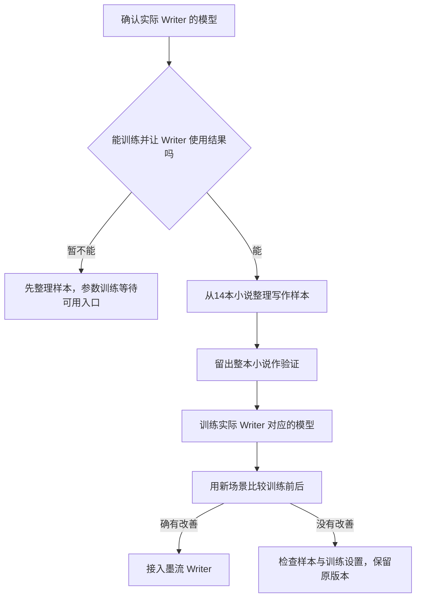

# 墨流 Writer 写作训练：简单流程

2026-09-28补充：作者样稿表达偏好与 Humanizer-zh 已接入实际 Writer、审核及Coordinator提示，见 `INKFLOW_AUTHOR_STYLE.md`。这是静态引导，不修改远端权重；下文参数训练及其产物接入仍未完成，旧学习画像仍是可选候选。

状态：已完成本地素材结构拆解与条件训练入口；参数训练和实际 Writer 接入尚未开始。现有“学习配置”只是提示词层的可选写法建议，三项原始输出对照未证明它可作为默认配置。本次独立 Qwen 试验已取消；14 本小说原件保留。后续若需下载模型、依赖或缓存，统一放 D 盘。

## 一、先确定训练的是谁

训练结果必须能被墨流**实际负责正文的 Writer** 调用。要先确定目标模型、它支持的训练方式、训练后如何部署，以及墨流用哪个模型版本调用它。

目前墨流调用的是 DeepSeek API；尚未落实可供本项目训练并部署私有版本的入口。普通 API Key 无法让本机训练直接修改云端 DeepSeek 参数。这个条件未满足时，可以准备数据，不能声称已经训练好 Writer，也不下载一个无关的小模型代替它。

“让模型的预输出与 Writer 架构完全一样”不能作为可验证的训练目标：模型内部 token 概率无法被普通 API Key 读取或改写，也不能保证每次逐字相同。可验证的目标是：真实 Writer 接收相同结构的任务与 Context Packet，输出符合 `DraftOutput` 契约的正文及摘要，并更稳定地满足篇幅、人物知识、伏笔和语言要求。当前本地 LoRA 入口只训练“写作要求＋必要前文 → 纯正文”，而正式 Writer 使用 `WRITER_SYSTEM`、`ContextPacket.to_model_prompt()` 和 `DraftOutput` JSON；两者输入输出格式不一致。即使未来换成可训练目标，也须先统一契约，再训练和接入，不能把这个入口的保存点直接接给现行 Writer。

仓库新增 `agent/src/inkflow/writer_training.py`：只读取用户指定的 ZIP/TXT，在 D 盘生成来源哈希、章节行号、章节候选、逐书结构概况和 20～30 批候选。它不会从原文猜出作者的原始写作指令。`agent/src/inkflow/writer_train_local.py` 是条件性本地 LoRA 入口：只接受已人工核对、具有写作任务和使用权利记录的样本以及 D 盘已有基础模型；每批保存适配器和优化器状态，可从最近完整检查点续跑，每次运行最多12小时，累计训练时间继续记录。当前未提供这种基础模型，入口也不会下载或安装依赖，更不会更改墨流正在使用的 DeepSeek。保存点是候选，不等于训练成果已可用。

本轮素材位置为 `C:\Users\ashin\Downloads\新建文件夹 (4)`，当前成果位于 `D:\墨流\writer-training\materials-20260927-02`。14本、约12,523个启发式章节、24批候选、约56.2万候选字符；按整本保留2本作评估。章节统计包括卷首等启发式边界，不等于逐章语义验收。`READING_NOTES.md` 记录各书前中后抽样阅读观察；人物因果和写法未逐章核对。候选目录内 `quality_accepted=false`、`training_rights_confirmed=false`，不允许直接投入训练。按字数组织的是素材批次，实际 GPU 秒数取决于模型、显卡和样本 token，不能承诺每批30～200秒。

后续操作口径：从 `candidates/batch-0001.jsonl` 等文件复制到独立的 `reviewed` 目录，逐条读原章节前后文，补全 `task`、`context`、`scene_understanding`、审定人及训练用途；一个章节含多场景时按真实转折拆为多个样本，过长样本须人工缩短，保持原始 `source_unit_ids`。训练入口要求所有批次均已审定并有使用权利记录；完成一批保存一个 `checkpoint-0001` 等目录，`progress.json` 记录续跑位置。新一轮使用新的审核批次和输出目录，显式传入上一轮适配器。检查点不能按训练损失自动选为最好，须用独立新写作任务比较后再选择。以上操作尚未执行。

## 二、14 本小说怎样变成样本

原书是写法材料。先去掉确认无关的广告、乱码和重复内容，找出**完整场景**：人物处境、目标、行动和结果。然后为合格片段配上必要前文和一条明确写作要求。

例如，输入是“人物得知坏消息，却要在同伴面前保持镇定；不要提前揭示坏消息的来源”；目标输出是一段能成立的正文。这样的任务要求是后期整理出来的，要标明来源，不能冒充作者原本给模型的指令。也不能把原书每一段都视作优秀示范。

按**整本作品**留出一部分素材作验证。来自同一场景的原文、改写和类似版本留在同一组，避免训练时见过答案、验证时又拿它算成绩。14 本都会接受分析，实际训练样本数由清洗和质量核对决定，不事先许诺数字。

### 样本格式与针对性拆解

每条可训练样本至少保留 `book_id`、`source_unit_ids`、`task`、`context`、`completion`、`reviewed_by`、`quality_accepted` 和 `training_rights_confirmed`。其中 `task` 是整理者依据场景反推的写作要求，不冒充原作者提示词；`context` 只放写这段必需的前情、人物知识与限制；`completion` 是审定后的目标正文，而非整章盲切或模型自己写完就算合格。未核对来源、质量和训练用途的条目保持 `false`，不进入参数训练。

标注时按**场景功能**而非固定措辞细分：人物此刻知道什么、想要什么；动作怎样改变物件或关系；对白中的目的、信息差与称呼；视角及叙述距离；感官细节为何与行动有关；段落、引号与标点如何帮助读者辨认声音；伏笔处于种下、推进还是兑现；结尾留下哪一个具体期待。允许同一作品给出不同写法，不把“哭泣”“暗杀”等题材词直接当训练标签，也不把固定短句比例或动作三段式写成标准答案。篇幅与格式要求必须写进任务并对应合格正文，不能靠模型输出后补一条评分假装学会了。

若目标确为正式 Writer 的参数训练，样本还要增加**契约适配层**：输入保持正式调用的稳定系统规则、结构化 Context Packet 和用户任务的顺序；输出映射到实际 `DraftOutput` 字段。映射只可由已审正文和真实可核对的决策摘要组成，不生成虚构的审核结论、记忆或原作者意图。先选定可训练且可由产品调用的模型，再为它的聊天模板准备这一层；当前 DeepSeek API 路径不满足前提，故不启动转换或训练。

## 三、怎样训练

用“写作要求＋必要前文 → 合格正文”训练已经确定的目标模型，让它逐渐倾向于写出符合条件的表达。这通常叫监督微调。先做小批次，检查样本与目标是否匹配；方向正确后，再按有效样本覆盖和验证结果继续。每 100 步可以看一次变化，但**100 步不会保证明显提升**，也不能用“跑满两小时”证明训练完成。[SFT 方法说明](https://huggingface.co/docs/trl/sft_trainer)

长篇问题不能只靠模仿句子解决。研究中的 [LongStory](https://arxiv.org/abs/2311.15208) 将结构位置和长短期上下文分开处理，以改善完整性与长度控制；[StoryWriter](https://arxiv.org/abs/2506.16445) 将事件关系、章节安排和写作衔接分开。对墨流的启示是复用现有大纲、卷细纲、近期规划及 Context Packet，不为训练另造一套角色；样本既要有句子与场景表达，也要包含前情约束和篇章位置，但研究结果不能直接当作本产品已验证的收益。

如果以后积累了“同一任务的两版正文，用户明确选哪版”的记录，才考虑进一步训练文风偏好。那是后续选择，不混入这次写作训练。

## 四、怎样判断值不值得用

给训练前后两个版本同样的新任务，比较是否更能按要求写、人物说话是否自然、动作与因果是否清楚、用户需要改多少，以及是否复述原书的独特文字或情节。先固定比较方法，再看结果；只看训练损失下降或一段好看的示例不够。

只有新场景里反复看到收益，且事实与指令遵循没有退化，才把训练版本接入墨流 Writer。接入后，在软件里用自然语言写一段新正文，确认实际调用的是训练后的版本。

**可能的效果：**场景表达、对白与行文节奏有所改善。**不能由这次训练自动得到的效果：**审核 Agent 更准确、Coordinator 更会调度、长篇记忆自动完整，或 DeepSeek 输入缓存命中率提高。这些各有自己的数据和改进方法。

输入缓存是另一条优化线：DeepSeek 只对相同的输入前缀提供尽力命中，训练参数不会令变化的提示词自动命中。正式 Writer 应保持系统规则、JSON Schema 和可复用的书籍依据在稳定前缀，把本章临时目标、时间戳、随机风格建议等变化内容放在后面；每次改默认规则都会形成新前缀并暂时失去旧缓存。以供应商实际返回的 `prompt_cache_hit_tokens`、`prompt_cache_miss_tokens` 和合格正文成本比较连续请求，不靠两次偶然对照宣称命中率提升。[DeepSeek 缓存规则](https://api-docs.deepseek.com/guides/kv_cache/)。

当前只有来源可回查的结构候选和抽样阅读笔记。合格的“任务＋前文→正文”训练样本、可训练且能由 Writer 调用的目标模型、实际训练检查点与对照收益均尚未完成。素材提取、样本审定、参数训练、实际 Writer 接入分别记状态，不能互相冒充。
